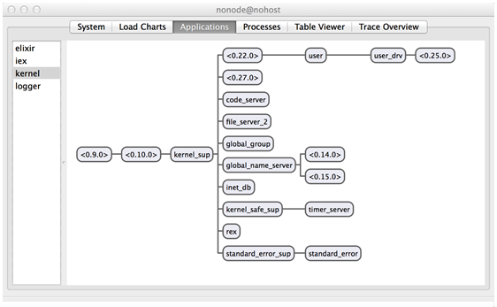

# 4   Writing Server Applications with GenServer

This chapter covers: 

·      OTP and why you should use it

·      OTP behaviours

·      Rewriting Metex to use the GenServer OTP Behaviour

·      Structuring your code to use GenServer

·      Handling synchronous and asynchronous requests using callbacks

·      Managing server state

·      Cleanly stopping the server

·      Registering the GenServer with a name

In this chapter, we begin by learning about OTP. OTP originally stood for Open Telecom Platform. Coined by the marketing geniuses over at Ericsson (I hope they don't read this!), it is now only being referred to by its acronym. Part of the reason is because the naming is myopic. The tools provided by OTP are in no way specific to the telecommunications domain. Nonetheless, the naming stuck, for better or worse. This just goes to show that naming is indeed one of the hardest problems in Computer Science.  

We will learn what exactly OTP is. Then we will look at some of the motivations that drove its creation. We will also see how OTP *behaviours* help us build applications that reduce boilerplate code, reduce potential concurrency bugs drastically and rely on code that has benefited from the decades of hard-earned experience. 

Once we have understood the core principles of OTP, we will then learn about one of the most important and common OTP behaviours – the GenServer. Short for Generic Server, the GenServer behaviour is an abstraction of client/server functionality. We will take
`Metex`, the temperature reporting application that we built in Chapter 3, and turn it into a GenServer. By then, you would have a firm grasp of how to implement your own GenServers.

4.1           What is OTP Exactly?

OTP is sometimes referred to as a framework, but that is not giving it due credit. Instead, think of OTP as a complete development environment for concurrent programming. To prove my point, here's a non-exhaustive laundry list of the features that come with OTP:

·      The Erlang interpreter and compiler

·      Erlang standard libraries

·      Dialyzer, a static analysis tool

·      Mnesia, a distributed database

·      Erlang Term Storage (ETS), an in-memory database

·      A debugger,

·      An event tracer

·      A release management tool 

We will encounter various pieces of OTP as we progress along the book. For now, we will turn out attention to OTP behaviours.

4.2           OTP Behaviours 

Think of OTP behaviours as design patterns for processes. These behaviours emerged from battle-tested production code, and have been refined continuously ever since. Using OTP behaviours in your code helps you by providing you the generic pieces of your code for free, leaving you to implement the specific pieces of business logic.  

Take GenServer for example. GenServer provides you with client/server functionality out of the box. In particular, it provides functionality that in common to all servers. What are these common features?  They are:

·      Spawning the server process

·      Maintaining state within the server

·      Handling requests and sending responses back

·      Stopping the server process  

GenServer has got the generic side covered. You on the other hand, have to provide the business logic. The specific logic that you need to provide include: 

·      The state that you want to initialize the server with

·      The kinds of messages the server handles

·      When to reply to the client

·      What message to reply to the client

·      What resources to clean up after termination 

There are also other benefits. When you are building your server application for example, how would you know that you have covered all the necessary edge cases and concurrency issues that might crop up? Furthermore, it would not be fun to have to understand different implementations of server logic.

Take
`worker.ex`
in the
`Metex`
example. In my programs that don't use the GenServer behaviour, I usually name the main loop, well
`loop`. However, there is not stopping anyone from naming it
`await`,
`recur`
or even something ridiculous like
`while_1_true`. Using the GenServer behaviour releases me (and more likely the naming-challenged developer) from the burden of having to think about these trivialities.

4.1.1        The Different OTP Behaviours 

The following table lists the common OTP behaviours that is provided out of the box. OTP doesn’t limit you to these four. In fact, you can implement your own behaviours. However, it is imperative to understand how to use the default ones well, because they cover most of the use cases you would ever encounter.

Table 4.1 OTP Behaviours and the functionality they provide

|  |  |
| --- | --- |
| 
Behaviour
 | 
Description
 |
| GenServer | A behaviour module for implementing the server of a client-server relation. |
| GenEvent | A behaviour module for implementing event handling functionality |
| Supervisor | A behaviour module for implementing supervision functionality |
| Application | A module for working with applications and defining application callbacks. |

To make things more concrete, we can see for ourselves how these behaviours fit together. For this, we need the Observer tool, provided by OTP for free. Fire up
`iex`, and start Observer:

Listing 4. 1 Launching the Observer tool

`% iex`
`iex(1)> :observer.start``:ok`
When the window pops up, click on the “Applications” tab. You should see something like this:

  

Listing 4. 2 The Observer tool displaying the supervisor tree of the Kernel application

On the left column is a list of OTP *applications* that were started when iex was started. We will cover applications in the next chapter. For now, you can think of them as self-contained programs. Clicking on each option in the left column reveals the *supervisor* hierarchy for that application. For example, the above diagram shows the supervisor hierarchy for the
`kernel`
application, which is the very first application started, even before the
`elixir`
application starts.

If you look closely, you will notice that the supervisors have a
`sup`
appended*.*
`kernel_sup`
for example supervises ten other processes. These processes could be GenServers (`code_server`
and
`file_server`
for example) or even other Supervisors (`kernel_safe_sup`
and
`standard_error_sup`).

Behaviours like the GenServer and GenEvent are the *workers* – they contain most of the business logic, and do most of the heavy lifting. You will learn more about them as we progress along. Supervisors at exactly what they sound: They take care of processes under them and take action when something bad happens. Let’s make everything more concrete by starting with the most frequently used OTP behaviour – GenServer.

4.3           Hands On OTP: Revisiting Metex 

Using GenServer as an example we will go about implementing an OTP behaviour. We will re-implement
`Metex`, our weather application in Chapter 3. Only this time, we will implement it using the GenServer behaviour. 

In case you need a refresher,
`Metex`
reports the temperature in Celsius given a location such as the name of a city. This is done through a HTTP call to a third party weather service. We will add other bells and whistles to illustrate the various GenServer concepts such as keeping state and process registration. For example, we will be tracking the frequency of valid locations requested.

Pieces of functionality that was discussed in Chapter 3 will be skipped. In order words, if all this sounds new to you, now would be the perfect time to start on Chapter 3! Once we have completed the application, we will then take a step back and compare the approaches in Chapter 3 and Chapter 4. Let’s get started!

4.1.2        Creating a New Project

As usual, create a new project. Remember to place your old version of
`Metex`
in another directory first!

`% mix new metex`
In
`mix.exs`, fill up the
`application`
and
`deps`
like so:

Listing 4. 3 Project setup

`defmodule Metex.Mixfile do`
`use Mix.Project`

`# ...`

`def application do`
`[applications: [:logger, :httpoison]]`
`end`

`defp deps do`
`[`
`{:httpoison, "~> 0.9.0"},`
`{:json,      "~> 0.3.0"}`
`]`
`end`
`end`
We then need to get our dependencies. In the terminal, use the
`mix deps.get`
command to do just that.

4.1.3        Making The Worker GenServer Compliant

We begin with the workhorse of the application, the worker. In
`lib/worker.ex`, we first declare a new module and specify that we want to make use of the GenServer behaviour:

Listing 4. 4 Using the GenServer behaviour

`defmodule Metex.Worker do`
`use GenServer #1`
`end`
#1 Automatically define all the callbacks required for the GenServer

Simply having
`use GenServer`, Elixir automatically defines all the callbacks needed by the GenServer. This means that you get to pick and choose which callbacks you want to implement. What exactly are these callbacks? Glad you asked.

4.1.4        Callbacks

There are exactly six callbacks that are automatically defined for you. Here's the entire list:

`·`
`init(args)`

`·`
`handle_call(msg, {from, ref}, state}`

`·`
`handle_cast(msg, state}`

`·`
`handle_info(msg, state)`

`·`
`terminate(reason, state)`

`·`
`code_change(old_vsn, state, extra)`

Before we go any further, it helps to remind ourselves *why* are we even bothering to make the worker a GenServer, especially since (as you will see soon) you need to learn about the various callback functions and proper return values.

The biggest benefit that using OTP gives you is all the things that you do *not* have to worry about when you write your own client-server programs or supervisors. For example, how would you write a function that makes an asynchronous request? What about a synchronous one? The GenServer behaviour provides
`handle_cast/2`
and
`handle_call/3`
for that exact use case.

Your process has to handle different kinds of messages. As the kinds of messages grow, a hand-rolled process might grow unwieldy. Once again, GenServer’s various
`handle_*`
functions provide a neat way to specify the different kinds of messages that you want to handle. Receiving messages is just half the equation. You also need a way to handle replies. As expected, the callbacks have got your back (pun intended!) since it makes it convenient to access to pid of the sender process.

Now let’s think about state management. Every process needs a way to initialize state. It also needs a way to potentially perform some cleanup before the process is terminated. GenServer’s
`init/1`
and
`terminate/2`
are just the callbacks you need.

Recall that in the previous chapter how we managed state using a recursive loop and passing the (potentially) modified state into the next invocation of that loop. The return value of the different callbacks will affect the states. Hand-rolling this in a non-trivial process results in clumsy looking code.

Using a GenServer also makes it easy to be plugged into say, a Supervisor. A nice thing about writing programs that conform to OTP behaviours is that they tend to look similar. This means that if you were to look at someone else’s GenServer you most probably would easily tell which are the messages that it can handle and what replies it can give, and whether the replies are synchronous or asynchronous.

Now you know some of the benefits of simply having to type
`use GenServer`. Elixir automatically defines all the callbacks needed by the GenServer. In Erlang, you would have to specify quite a bit of boilerplate. This means that you get to pick and choose which callbacks you want to implement. What exactly are these callbacks? Glad you asked.

Table 4.2 GenServer functions on the left call the callback functions, defined in Metex.Worker, on the right

|  |  |
| --- | --- |
| 
GenServer Module calls …
 | 
Callback Module (Implemented in Metex.Worker)
 |
|
`GenServer.start_link/3`
|
`Metex.init/1`
|
|
`GenServer.call/3`
|
`Metex.handle_call/3`
|
|
`GenServer.cast/2`
|
`Metex.handle_cast/2`
|

Each callback expects a return value that conforms to what GenServer expects. Here's a table that summarizes the callbacks, the functions that call them, and the expected return value. You will find the table especially helpful when you need to figure out the exact return values that each callback expects. I find myself referring to this table constantly.

Table 4.3 GenServer callbacks and their expected return values

|  |  |
| --- | --- |
| 
Callbacks
 | 
Expected Return Value
 |
|
`init(args)`
 |
`·`
`{:ok, state}`
`·`
`{:ok, state, timeout}`
`·`
`:ignore`
`·`
`{:stop, reason}`
|
|
`handle\_call(msg, {from, ref},state)`
 |
`·`
`{:reply, reply, state}`
`·`
`{:reply, reply, state, timeout}`
`·`
`{:reply, reply, state, :hibernate}`
`·`
`{:noreply, state}`
`·`
`{:noreply, state, timeout}`
`·`
`{:noreply, state, hibernate}`
`·`
`{:stop, reason, reply, state}`
`·`
`{:stop, reason, state}`
|
|
`handle\_cast(msg, state)`
 |
`·`
`{:noreply, state}`
`·`
`{:noreply, state, timeout}`
`·`
`{:noreply, state, :hibernate}`
`·`
`{:stop, reason, state}`
|
|
`handle\_info(msg, state)`
 |
`·`
`{:noreply, state}`
`·`
`{:noreply, state, timeout}`
`·`
`{:stop, reason, state}`
|
|
`terminate(reason, state)`
 |
`·`
`:ok.`
 |
|
`code\_change(old\_vsn, state, extra)`
 |
`·`
`{:ok, new\_state}`
`·`
`{:error, reason}`
|

`init(args)`
is invoked when
`GenServer.start_link/3`
is called. Let's see that in code:

Listing 4. 5 Structuring the code with client API, server callbacks and helper functions

`defmodule Metex.Worker do`
`use GenServer`

`## Client API`

`def start_link(opts \\ []) do`
`GenServer.start_link(__MODULE__, :ok, opts)`
`end`

`## Server Callbacks`

`def init(:ok) do`
`{:ok, %{}}`
`end`

`## Helper Functions`
`end`
Here, I have demarcated, by way of comments, the different sections of code. You will usually find Elixir/Erlang programs in the wild follow a similar convention. Since we haven’t introduced any helper functions just yet, the “Helper Functions” section has been left unfilled.

start\_link/3 and init/1

`GenServer.start_link/3`
takes in the module name of the GenServer implementation where the
`init/1`
callback is defined. It starts the process and also links the server process to the parent process. This means that if the server process fails for some reason, the parent process would be notified.

The second argument is for arguments to be passed to
`init/1`. Since we do not require any, an
`:ok`
suffices.

The final argument is a list of options to be passed to
`GenServer.start_link/3`. These options include defining a name to register the process with and to enable extra debugging information. For now, we can pass in an empty list.

When
`GenServer.start_link/3`
is called, it invokes
`Metex.init/1`. It waits until Metex.init/1 has returned, before returning. What are valid return values of
`Metex.init/1`? Consulting the table, we get the following four values:

`·`
`{:ok, state}`

`·`
`{:ok, state, timeout}`

`·`
`:ignore`

`·`
`{:stop, reason}`

For now, we go for the simplest,
`{:ok state}`. Looking at our implementation,
`state`
in this case is initialized to an empty Map,
`%{}`. We need this map to keep the frequency of requested locations.

Let's give this a spin! Open up your console and launch
`iex`
like so:

`% iex -S mix`
Let's now start a server process and link it to the calling process. In this case, it's the shell process:

Listing 4.6 Starting the server process

`iex(1)> {:ok, pid} = Metex.Worker.start_link`
`{:ok, #PID<0.134.0>}`
The result is a two-element tuple, and
`:ok`
and the pid of the new server process.

4.1.5        Handling Synchronous Requests with handle\_call/3

Let's head back to the code. Now, we want to have our server process handle requests, which is the whole point of having a server process. Let's start from the the client API and work downwards.

Listing 4.7 Implementing a synchronous request with GenServer.call/3

`defmodule Metex.Worker do`
`use GenServer`

`## Client API`

`# ...`

`def get_temperature(pid, location) do`
`GenServer.call(pid, {:location, location})`
`end`

`## Server API`

`# ...`
`end`
Here’s how a client might retrieve the temperature of Singapore:

`Metex.Worker.get_temperature(pid, "Singapore").`
The above functions wraps a call to
`GenServer.call/3`, passing in the pid, and a tuple that is tagged
`:location`
and the actual
`location`. In turn,
`GenServer.call/3`
expects a
`handle_call/3`
defined in the
`Metex.Worker`
module and invoke it accordingly.

`GenServer.call/3`
makes a *synchronous* request to the server. This means that a reply from the server is expected. The sibling to
`GenServer.call/3`
is
`GenServer.cast/2`, which makes an *asynchronous* request to the server. We will take a look at that shortly. For now, here's the implementation of the
`handle_call/3`
for the
`{:location, location}`
message:

Listing 4.8 Implementing the handle\_call callback

`defmodule Metex.Worker do`
`use GenServer`

`## Client API`

`# ...`

`def get_temperature(pid, location) do`
`GenServer.call(pid, {:location, location})`
`end`

`## Server API`

`# ...`

`def handle_call(#1{:location, location}, #2_from, #3stats) do`
`case temperature_of(location) do`
`{:ok, temp} ->`
`new_stats = update_stats(stats, location)`
`{:reply, "#{temp}°C", new_stats}`

`_ ->`

`{:reply, :error, stats}`
`end`
`end`
`end`
#1: The expected request to be handled

#2: This is in fact a tuple in the form of {pid, tag} which represents the pid of the sender and the message’s unique reference

#3: The current state of the GenServer

Let's first take a closer look at the function signature:

`def handle_call({:location, location}, _from, stats) do`
`# ...``end`
The first argument declares the expected request to be handled. The second argument returns a tuple in the form of
`{pid, tag}`, where the
`pid`
is the pid of the client, and
`tag`
is a unique reference of the message. The third argument,
`state`, represents the *internal state* of the server. In our case, it is the current frequency counts of valid locations.

Now, let's turn out attention to the body of
`handle_call({:location, location}, ...})`:

`def handle_call({:location, location}, _from, stats) do`
`case temperature_of(location) do              #1`
`{:ok, temp} ->`
`new_stats = update_stats(stats, location) #2`
`{:reply, "#{temp}°C", new_stats}          #3`

`_ ->`
`{:reply, :error, stats}                   #3`
`end``end`
#1: Makes a request to the API for location's temperature

#2: Update the
`stats`
Map with the location frequency

#3: Return a three-element tuple as a response.

`Metex.Worker.temperature_of/1`
makes a request to the third-party API to get the location's temperature. If it succeeds,
`Metex.Worker.update_stats/2`
is invoked to return a new Map with the updated frequency of location. Finally, it returns a three-element tuple that any
`handle_call/3`
is expected to return.

In particular, this three-element tuple begins with a
`:reply`, followed by the actual computed responses, followed by the update state, which in this case is
`new_stats`. If the request to the third-party API fails for some reason or another, then
`{:reply, :error, stats}`
is returned. Here are the valid responses of a
`handle_call/3`:

`·`
`{:reply, reply, state}`

`·`
`{:reply, reply, state, timeout}`

`·`
`{:reply, reply, state, :hibernate}`

`·`
`{:noreply, state}`

`·`
`{:noreply, state, timeout}`

`·`
`{:noreply, state, hibernate}`

`·`
`{:stop, reason, reply, state}`

`·`
`{:stop, reason, state}`

Let's fill in the missing pieces in order to get
`Metex.Worker.get_temperature/2`
to work:

Listing 4.9 Implementing the helper functions

`defmodule Metex.Worker do`
`use GenServer`

`## Client API and Server API`

`## previously implemented code`
 
`## Helper Functions`

`defp temperature_of(location) do`
`url_for(location) |> HTTPoison.get |> parse_response`
`end`

`defp url_for(location) do`
`"http://api.openweathermap.org/data/2.5/weather?q=#{location}&APPID=#{apikey}"`
`end`

`defp parse_response({:ok, %HTTPoison.Response{body: body, status_code: 200}}) do`
`body |> JSON.decode! |> compute_temperature`
`end`

`defp parse_response(_) do`
`:error`
`end`

`defp compute_temperature(json) do`
`try do`
`temp = (json["main"]["temp"] - 273.15) |> Float.round(1)`
`{:ok, temp}`
`rescue`
`_ -> :error`
`end`
`end`

`def apikey do`
`“APIKEY-GOES-HERE”`
`end`

`defp update_stats(old_stats, location) do`
`case Map.has_key?(old_stats, location) do`
`true ->`
`Map.update!(old_stats, location, &(&1 + 1))`
`false ->`
`Map.put_new(old_stats, location, 1)`
`end`
`end`
`end`
Most of the implementation is the same as Chapter 3, except for minor changes to
`Metex.Worker.temperature_of/1`
and
`Metex.Worker.update_stats/2`, which are completely new. The implementation of
`Metex.Worker.update_stats/2`
is pretty simple:

Listing 4.10 Updating the frequency of a requested location

`defp update_stats(old_stats, location) do`
`case Map.has_key?(old_stats, location) do`
`true ->`
`Map.update!(old_stats, location, &(&1 + 1))`
`false ->`
`Map.put_new(old_stats, location, 1)`
`end``end`
This function takes in the
`old_stats`
and the
`location`
requested. We first check if
`old_stats`
contains the location of the key. If so, we can simply fetch the value and increment the counter. Otherwise, we put in a new key called denoted by
`location`
and set it to
`1`. If the
`&(&1 + 1)`
seems confusing, you can do a syntactical "unsugaring" in your head:

`Map.update!(old_stats, location, fn(val) -> val + 1 end)`
Let's take
`Metex.Worker`
out for another spin. Once again, fire up
`iex`, the start the server with
`Metex.Worker.start_link/1`:

`% iex -S mix`
`iex(1)> {:ok, pid} = Metex.Worker.start_link``{:ok, #PID<0.125.0>}]`
Now, let's get the temperatures from a few famous locations:

`iex(2)> Metex.Worker.get_temperature(pid, "Babylon")`
`"12.7°C"`
`iex(3)> Metex.Worker.get_temperature(pid, "Amarillo")`
`"5.3°C"`
`iex(4)> Metex.Worker.get_temperature(pid, "Memphis")`
`"7.3°C"`
`iex(5)> Metex.Worker.get_temperature(pid, "Rio")`
`"23.5°C"`
`iex(6)> Metex.Worker.get_temperature(pid, "Philadelphia")``"12.5°C"`
4.1.6        Accessing the Server State

Success! But wait, how do I get to see the contents of
`stat`? In other words, how do we access the *server state*? Turns out, it is not hard. Let's implement the client facing API first:

`def get_stats(pid) do`
`GenServer.call(pid, :get_stats)``end`
Since we expect a reply from the server, we need a synchronous reply from the server. Therefore, we should invoke
`GenServer.call/3`. Here, we are saying that the server should handle a synchronous
`:get_stats`
message. Notice that messages can come in the form of any valid Elixir term. This means that tuples, lists and atoms are all fair game. Here's the callback function:

`def handle_call(:get_stats, _from, stats) do`
`{:reply, stats, stats}``end`
Since we are interested in
`stats`, we can simply return
`stats`
in the second argument as the reply. Since we are simply accessing
`stats`, as opposed to modifying it, we simply pass it along unchanged as the third argument.

Before we continue, here is a gentle reminder to *group* all your
`handle_call`s (and later on,
`handle_cast`s) together! This is important because the Erlang virtual machine relies on this for pattern matching. For example, if I were to "misplace"
`handle_call`s like so:

Listing 4.11 Notice that the handle\_calls are not grouped together

`defmodule Metex.Worker do`
`use GenServer`

`## Client API`

`# ...`

`## Server Callbacks`

`def handle_call(:get_stats, _from, stats) do # 1`
`# ...`
`end`

`def init(:ok) do`
`# ...`
`end`

`def handle_call({:location, location}, _from, stats) do`
`# ...`
`end`

`## Helper Functions`

`# ...``end`
#1: handle\_calls and handle\_casts should be grouped together

The compiler will then issue a friendly warning:

`% iex -S mix`
`lib/worker.ex:29: warning: clauses for the same def should be grouped together, def handle_call/3 was previously defined (lib/worker.ex:20)`
4.1.7        Handling Asynchronous Requests with handle\_cast/2

Asynchronous requests do not require a reply from the server. This also means that a
`GenServer.cast/2`
returns immediately. What is a good use case for
`GenServer.cast/2`? A fine example would be a command that is issued to a server, which causes some side effect in the server's state. In that case, the client issuing the command shouldn't have to care about a reply.

Let's construct such a command. This command, called
`reset_stats`, will re-initialize stats back to an empty Map:

Listing 4. 12 Handling resetting of stats

`# Client API`

`# ...`

`def reset_stats(pid) do`
`GenServer.cast(pid, :reset_stats)`
`end`

`# Server Callbacks`

`# handle_calls go here`

`def handle_cast(:reset_stats, _stats) do`
`{:noreply, %{}}``end`
`Metex.Worker.stats/1`
will make a call to
`GenServer.cast/2`. This in turn invokes the
`handle_cast(:reset_stats, _stats)`
callback. Since we do not care about the current state of the server (after all, we are resetting it), we prepend an underscore to
`stats`.

The return value is a two-element tuple with
`:noreply`
as the first element and an empty Map, the response, as the second argument. Again notice that the response is one of the valid
`handle_cast/2`
responses.

Let's see our handiwork! Fire up
`iex -S mix`
again, and try out a couple of locations:

`iex(1)> {:ok, pid} = Metex.Worker.start_link`
`{:ok, #PID<0.134.0>}`
`iex(2)> Metex.Worker.get_temperature pid, "Singapore"`
`"29.0°C"`
`iex(3)> Metex.Worker.get_temperature pid, "Malaysia"`
`"22.7°C"`
`iex(4)> Metex.Worker.get_temperature pid, "Brunei"`
`"24.2°C"`
`iex(5)> Metex.Worker.get_temperature pid, "Singapore"`
`"29.0°C"`
`iex(6)> Metex.Worker.get_temperature pid, "Cambodia"`
`"27.7°C"`
`iex(7)> Metex.Worker.get_temperature pid, "Brunei"`
`"24.2°C"`
`iex(8)> Metex.Worker.get_temperature pid, "Singapore"``"29.0°C"`
Now we can try out the get\_stats/1 function:

`iex(9)> Metex.Worker.get_stats pid`
`%{"Brunei" => 2, "Cambodia" => 1, "Malaysia" => 1, "Singapore" => 3}`
It works! You can clearly see the frequency of the requested locations represented by the Map. Now, let's try to reset
`stats`:

`iex(10)> Metex.Worker.reset_stats pid`
`:ok`
`iex(11)> Metex.Worker.get_stats pid``%{}`
Perfect! It works as expected.

4.1.8        Stopping the Server and Cleaning Up

Sometimes, we need to free up resources, or some other cleanup tasks, before the server stops. That's when the
`GenServer.terminate/2`
comes in.

How then do we stop the server? If you take a look at the callbacks table, under the
`handle_call/handle_cast`
column, you will find two valid responses that starts with
`:stop`:

`·`
`{:stop, reason, new_state}`

`·`
`{:stop, reason, reply, new_state}`

This is a signal to the GenServer that the server will be terminated. Therefore, all we need to do is to provide a
`handle_call/3`/`handle_cast/2`
callback that returns either of the responses listed above, and include any cleanup logic in the
`GenServer`.terminate/2 callback. We will first write the
`stop/1`
function under client API:

`def stop(pid) do`
`GenServer.cast(pid, :stop)``end`
Again, I've chosen a
`GenServer.cast/2`
because I don't really care about any return value. Another reason might be that the server might take time to properly clean up all resources, and I do not want to bother to wait it. The corresponding callback is simple enough:

`def handle_cast(:stop, stats) do`
`{:stop, :normal, stats}``end`
We don't have any resources to speak of, but you can imagine that we might for example write
`stats`
to a file or database. In our example, let's just print the current state before we stop the server:

Listing 4. 13 The terminate callback is called right before the server terminates

`def terminate(reason, stats) do`
`# We could write to a file, database etc`
`IO.puts "server terminated because of #{inspect reason}"`
`inspect stats`
`:ok``end`
`GenServer.terminate/2`
has two arguments. The first argument provides a reason why the server terminated. In a normal termination, reason would be :`normal`. The
`:normal`
comes from the response from the
`handle_cast/2`
defined early. For errors, either arising from caught exceptions for example, you could include other reasons. Finally,
`GenServer.terminate/2`
must always return an
`:ok`. Let's see how we can terminate a server in iex.

`% iex -S mix`
`iex(1)> {:ok, pid} = Metex.Worker.start_link`
`{:ok, #PID<0.152.0>}`
`iex(2)> Process.alive? pid`
`true`
`iex(3)> Metex.Worker.stop pid`
`server terminated because of :normal`
`:ok`
`iex(4)> Process.alive? pid``false`
4.1.9        What Happens when Callbacks Return an Invalid Response?

Let's modify
`handle_cast(:stop, stats)`
return value slightly:

`def handle_cast(:stop, stats) do`
`{:stop, :normal, :ok, stats}``end`
If you look at the table again, this corresponds to a valid
`handle_call/3`
response, not a
`handle_cast/2`
one! The extraneous
`:ok`
is for a reply to the client. Since
`handle_cast/2`
is not meant for replying to the client (at least, not  directly), this is obviously wrong. Let's see what happens when we repeat the same process of stopping the server:

Listing 4. 14 When callbacks do not return the expected responses, GenServer gets upset

`% iex -S mix`
`iex(1)> {:ok, pid} = Metex.Worker.start_link`
`{:ok, #PID<0.152.0>}`
`iex(2)> Metex.Worker.stop pid`
`iex(2)>`
`10:59:15.906 [error] GenServer #PID<0.134.0> terminating #1`
`Last message: {:"$gen_cast", :stop}                      #1`
`State: %{}                                               #1``** (exit) bad return value: {:stop, :normal, :ok, %{}}   #1`
`#1 GenServer reports an error when it receives an invalid response from a callback handler`

Firstly, notice that there's *no* compile-time error. The error only surfaces when we try to stop the server, and GenServer freaks out by throwing a
`bad return value: {:stop, :normal, :ok, %{}}`. Whenever you see something like that, your first instinct should be to double-check the return values of your callback handlers. It is sometimes very easy to miss out a minor detail, and the error messages might not be so obvious at first glance.

4.1.10     Receiving Other Kinds of Messages

Messages might arrive from other processes that might not be defined in
`handle_call/3`/`handle_cast/2`. That is where
`handle_info/2`
comes in. It is invoked to handle any other messages that are received by the process, sometimes referred to as “out of band” messages. You do not need to supply a client API counterpart for
`handle_info/2`. This callback takes in two arguments, the message received and the current state:

`def handle_info(msg, stats) do`
`IO.puts "received #{inspect msg}"`
`{:noreply, stats}``end`
Let's see this in action:

Listing 4. 15 With handle\_info, the server process can handle any kind of unexpected message

`iex(1)> {:ok, pid} = Metex.Worker.start_link`
`{:ok, #PID<0.134.0>}`
`iex(2)> send pid, "It's raining men"``received "It's raining men"`
We will see much more interesting uses for
`handle_info/2`
in the later chapters. The main thing to remember is that
`handle_info/2`
is used for any other message that isn’t covered by
`handle_call/3`/`handle_cast/2.`

4.1.11     Process Registration

Having to constantly reference the GenServer via the pid can be a pain. Fortunately, there's another way to do it.
`GenServer.start_link/3`
takes in a list of options as it's third argument.

There are two common ways of registering a GenServer with a name. The difference lies in whether the name should be visible locally or globally. If the name is registered globally, then the name is unique across a cluster of connected nodes. (You will learn more about distribution soon). On the other hand, a locally registered name is only visible from within the local node.

Having a registered name is great for a singleton GenServer. That is, only one should exist in a node or cluster. We will let
`Metex.Worker`
be registered under
`MW`. When we choose to register a name for the GenServer, we no longer have to reference the process using its pid. Fortunately, the only places we have to change are the invocations to
`GenServer.call/3`
and
`GenServer.cast/2`
in the client API:

Listing 4. 16 With an explicit name, the pid no longer has to be passed into the client API

`defmodule Metex.Worker do`
`use GenServer`

`@name MW                                                    #1`

`## Client API`

`def start_link(opts \\ []) do`
`GenServer.start_link(__MODULE__, :ok, opts ++ [name: MW]) #2`
`end`

`def get_temperature(location) do`
`GenServer.call(@name, {:location, location})              #3`
`end`

`def get_stats do`
`GenServer.call(@name, :get_stats)                         #3`
`end`

`def reset_stats do`
`GenServer.cast(@name, :reset_stats)                       #3`
`end`

`def stop do`
`GenServer.cast(@name, :stop)                              #3`
`end`

`# The rest of the code remains unchanged.`
`# ...``end`
#1 Store the name

#2 Initialize the server with a registered name

#3 Notice that we pass
`@name`
instead of
`pid`

Now, fire up
`iex -S mix`
again. This time, we do not have to explicitly capture the pid. However, it is a good idea, because we usually want to know if the server started correctly, and therefore would want to make sure that the
`:ok`
is pattern matched.

Here is how we would interact with
`Metex.Worker`
now:

`% iex -S mix`
`iex(1)> Metex.Worker.start_link`
`{:ok, #PID<0.134.0>}`
`iex(2)> Metex.Worker.get_temperature "Singapore"`
`"29.3°C"`
`iex(3)> Metex.Worker.get_temperature "London"`
`"2.0°C"`
`iex(4)> Metex.Worker.get_temperature "Hong Kong"`
`"24.0°C"`
`iex(5)> Metex.Worker.get_temperature "Singapore"`
`"29.3°C"`
`iex(6)> Metex.Worker.get_stats`
`%{"Hong Kong" => 1, "London" => 1, "Singapore" => 2}`
`iex(7)> Metex.Worker.stop`
`server terminated because of :normal``:ok`
4.1.12     Reflecting on Chapter 3's Metex

Look again at the
`Metex`
we built in Chapter 3. Try to imagine what we would need to add to obtain the same functionality as the
`Metex`
we built in this chapter. Also, try to figure out where you would put all these functionality.

You might realize that some features are not as straightforward to implement. For instance, how would you implement a synchronous and asynchronous call? What about stopping the server? In that case, we would have to specially handle the stop message, and not run the loop. Where would we then stick the logic for cleaning up resources?

In the earlier version of
`Metex.Worker`, we had to handle unexpected messages explicitly with the catchall operator (that's the underscore) in loop. With OTP, this is handled with the
`handle_info/2`
callback. Stopping of the server was also not handled.

Given all these issues, you would soon realize that the loop function would start to balloon in size. Of course, you could always abstract everything out in nice little functions, but that can only go so far.

Hopefully, you can start to see the benefits of OTP. Using OTP behaviours helps you attain a consistent structure in your code. It makes it easy to eyeball exactly where the client API is, where the server callbacks are defined, and where the helper methods are located.

Besides providing consistency, OTP provides many helpful features that are common to all server-like programs. For example, managing state using GenServer is a breeze. No longer do you have to stick your state in a loop. Being able to decide when you state should change in the callbacks is also extremely useful.

4.4           Exercises

Write a GenServer that can store any valid Elixir term, given a key. Here are a few operations to get you started:

`·`
`Cache.write(:stooges, ["Larry", "Curly", "Moe"])`

`·`
`Cache.read(:stooges)`

`·`
`Cache.delete(:stooges)`

`·`
`Cache.clear`

`·`
`Cache.exist?(:stooges)`

Structure your program similar to how we did in this chapter. In particular, pay attention to which of the above operations should be
`handle_call`s or
`handle_cast`s.

Table 4.2 A summary of the relationship between the Client API, GenServer and Callback functions

|  |  |  |  |  |
| --- | --- | --- | --- | --- |
| 
Metex.Worker Client API
 |   | 
GenServer
 |   | 
Metex.Worker Callback
 |
|
`MW.start_link(:ok)`
|
`è`
|
`GS.start_link`
|
`è`
|
`MW.init(:ok)`
|
|
`MW.get_temp(p,“NY”)`
|
`è`
|
`GS.call(p,{:loc,“NY”})`
|
`è`
|
`MW.handle_call(`
`{:loc, “NY”}, fr, st)`
|
|
`MW.reset(p)`
 |
`è`
|
`GS.cast(p, :reset)`
|
`è`
|
`MW.handle_cast(:reset,  st)`
|
|
`MW.stop(p)`
|
`è`
|
`GS.cast(p, :stop)`
|
`è`
|
`MW.handle_cast(:stop, st)`
|
|  |  |  |
`ç`
| If the above returns
`{:stop, :normal, st}`
then
`MW.terminate(:normal, st)`
is called |

4.5           Summary

When I first learnt about GenServer, it was a lot to take in – And that is putting it gently. The following table is useful to group all the related functions together.

Along with some of the function names, I have abbreviated
`Metex.Worker`
to
`MW`,
`GenServer`
to
`GS.`
The
`state`
has been shortened to
`st`
and
`from`
shortened to
`fr`.  Finally,
`pid`
is
`p`.

Let’s go through the last row. Say I want to stop the worker process, and I call
`Metex.Worker.stop/1`. This will in turn invoke
`GenServer.cast/2`, passing in the
`pid`
and
`:stop`
as arguments. The callback that is triggered would be
`Metex.Worker.handle_cast(:stop, state)`. If the callback returns a tuple of the form
`{:stop, :normal, state}`, then
`Metex.Worker.terminate/2`
is invoked.

We covered a lot of ground in this chapter. Here's a recap:

·      What OTP is, and the principles and motivations behind it

·      The different kinds of OTP behaviours available

·      Converting Metex to use GenServer

·      The various callbacks provided by GenServer

·      Managing state in the GenServer

·      Structuring your code according to convention

·      Process registration

There's one other benefit that I have been intentionally keeping from you until now. Using the GenServer behaviour lets you stick GenServers into a supervision tree. What happens if your GenServer crashes? How will it affect the rest of the parts of your system and how can you ensure that your system stays functional?

Read on, dear reader, because Supervisors – which happens to be one of my favorite features of OTP – is up next!

