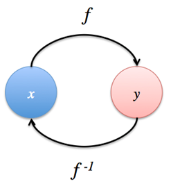
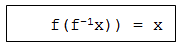
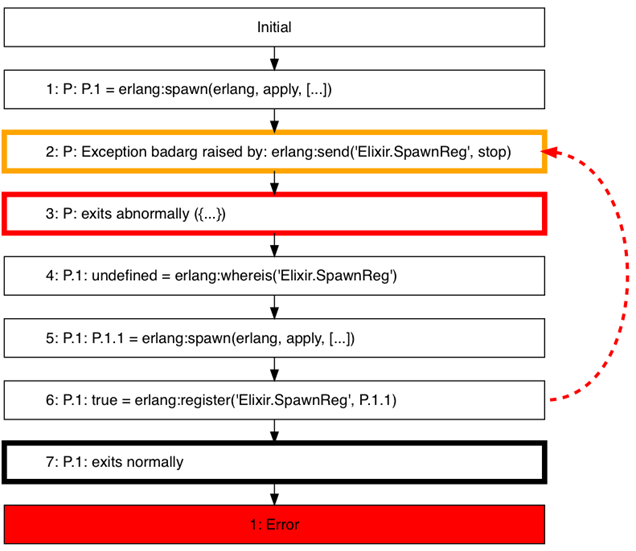

# 11      Property-Based and Concurrency Testing

This chapter covers:

·      Property-Based Testing with QuickCheck

·      Detect concurrency errors with Concuerror

In this final chapter (hurray!), we continue the survey of some of the testing tools that are available. You have just seen ExUnit and Dialyzer. However, the Erlang ecosystem has much more to offer, as the following sections will demonstrate.

First, there’s QuickCheck, the property-based testing tool. Property-based testing turns unit testing on its head. Instead of writing *specific* test cases as with traditional unit testing, property based testing forces you to express your test cases in terms *general* specifications. Once you have these specifications in place, the tool can generate as many test cases as you heart desires.

Next, we then look at Concuerror. Concuerror is a tool that systematically detects concurrency errors in your programs. Concuerror can point out hard to detect and often surprising race conditions, deadlocks and potential process crashes.

This chapter contains plenty of examples to try out, providing ample opportunity to get a feel of these tools. These tools can lend an incredible amount of insight into your programs, especially when they start to grow in complexity. Let’s starting upgrading our testing skills!

11.1       Introduction to Property-Based Testing and QuickCheck

Face it – Unit-testing can be hard work. You often need to think of several scenarios and make sure you cover all the edge cases. You need to cater for cases like garbage data, extreme values and lazy programmers who just want the test to pass in the dumbest way possible. What if I told you that instead of writing individual test cases by hand, you could instead *generate* test cases by writing a *specification* instead? That is exactly what property based testing is about.

Here’s a quick example: Say we are testing a sorting function. In unit-testing land, we would come up with different examples of lists such as:

`·`
`[3, 2, 1, 5, 4]`

`·`
`[3, 2, 4, 4, 1, 5, 4] # With duplicates`

·     
`[1, 2, 3, 4, 5]       # Already sorted`
 

Can you think of other cases that we might have missed out? At the top of my head, we are missing cases such as the empty list a list that contains negative integers. Speaking of integers, what about other data types like atoms or tuples? As you can see, it starts to become tedious and the probability of missing some edge case goes way up.

With property-based testing, we can specify properties of our sorting function. For example, sorting a list once is the same as sorting the list twice. We can specify a property like so (do not worry about the syntax yet):

Listing 11.1 An example property for list sorting

`@tag numtests: 1000`
`property "sorting twice will yield the same result" do`
`forall l <- list(int) do`
`ensure l |> Enum.sort == l |> Enum.sort |> Enum.sort`
`end``end`
This property generates *a thousand* different kinds of lists of integers and make sure that the properties hold for each of this list. If the property fails, the tool will automatically *shrink* the test case to find the smallest list that fails the same property.

QuickCheck is the tool that we are going to use. To be precise, we are going to use Erlang QuickCheck developed by Quviq. While the full-version of Erlang QuickCheck requires a commercial license, the one that we are going to use is a scaled-down version called Erlang QuickCheck *Mini*.

What’s the difference between the paid and free version of Quviq QuickCheck?

Both versions support property-based testing which is this whole point!. The paid version has other niceties like testing with state machines, parallel execution of test cases to detect race conditions (we will have Conqueror for that) and of course, commercial support.

 

You should be aware that apart from Erlang QuickCheck, there are a few flavors of similar property-based testing tools available:

·      Triform QuickCheck or *Triq* [[1]](#u83UNuzRV57fRwEzhWNgBm6)

·      PropEr[[2]](#uzOPdfenDvyvCoAdHdYLuV8): A QuickCheck-inspired property-based testing tool for Erlang

Quivq’s version is arguably the most mature of the three. Although the free version is somewhat limited in features, it is more than adequate for our purposes. Once you have grasped the basics, you can easily move on to the other flavors of QuickCheck since the concepts are identical and the syntax similar. Let’s get started with installing QuickCheck onto our system.

11.1.1     Installing QuickCheck

Installing QuickCheck is slightly more involved than the usual Elixir dependency, but not difficult at all. First, head over to Quviq[[3]](#utP7ZYyoYEcEE26GeQaeT75) and download the *free* version of QuickCheck (Mini). Unless you have a valid license, you should download the free version otherwise you will be prompted for a license. Here are the steps once you have downloaded the file:

·      Unzip the file and
`cd`
into the resulting folder

·      Run
`iex`

·      Run
`:eqc_install.install()`

If everything went well, you will see:

`iex(1)> :eqc_install.install`
`Installation program for "Quviq QuickCheck Mini" version 2.01.0.`
`Installing in directory /usr/local/Cellar/erlang/18.1/lib/erlang/lib.`
`Installing ["eqc-2.01.0"].`
`Quviq QuickCheck Mini is installed successfully.`
`Bookmark the documentation at /usr/local/Cellar/erlang/18.1/lib/erlang/lib/eqc-2.01.0/doc/index.html.``:ok`
It would be wise to heed the helpful prompt to bookmark the documentation.

11.1.2     Using QuickCheck in Elixir

Now that you have QuickCheck installed, we are back into familiar territory. Let’s create a new project to play with QuickCheck:

`mix new quickcheck_playground`
Open
`mix.ex`, and add the following:

Listing 11.2 Setting up a project to use QuickCheck

`defmodule QuickcheckPlayground.Mixfile do`
`use Mix.Project`

`def project do`
`[app: :quickcheck_playground,`
`version: "0.0.1",`
`elixir: "~> 1.2-rc",`
`build_embedded: Mix.env == :prod,`
`start_permanent: Mix.env == :prod,`
`test_pattern: "*_{test,eqc}.exs",     #1`
`deps: deps]`
`end`

`def application do`
`[applications: [:logger]]`
`end`

`defp deps do`
`[{:eqc_ex, "~> 1.2.4"}]                #2`
`end``end`
#1: Specify the test pattern for tests. Note the suffix “\_eqc” for QuickCheck tests.

#2: Add the Elixir wrapper for Erlang QuickCheck.

Do a
`mix deps.get`
to fetch the dependencies. Let’s try out an example next!

List Reversing – The “Hello World” of QuickCheck

We’ll make sure that we have everything set up correctly by writing a simple property of list reversal, namely, reversing a list twice yields back the same list.

`defmodule ListsEQC do`
`use ExUnit.Case`
`use EQC.ExUnit`

`property "reversing a list twice yields the original list" do`
`forall l <- list(int) do`
`ensure l |> Enum.reverse |> Enum.reverse == l`
`end`
`end`
`end`
Never mind what all these means for now. To run this test, execute
`mix test test/lists_eqc.exs`:

`% mix test test/lists_eqc.exs`
`....................................................................................................`
`OK, passed 100 tests`
`.`

`Finished in 0.06 seconds (0.05s on load, 0.01s on tests)`
`1 test, 0 failures`
`Randomized with seed 704750`
Sweet! QuickCheck just ran *one hundred* tests. That’s the default number of tests that QuickCheck generates. We can modify the amount by annotating with
`@tag numtests: <N>`, where
`<N>`
is a positive integer. Let’s purposely introduce an error to the property:

Listing 11. 3. This is an erroneous list-reversing property

`defmodule ListsEQC do`
`use ExUnit.Case`
`use EQC.ExUnit`

`property "reversing a list twice yields the original list" do`
`forall l <- list(int) do`
`# NOTE: THIS IS WRONG!`
`ensure l |> Enum.reverse == l`
`end`
`end`
`end`
`ensure/2`
checks whether the property is satisfied, and prints out an error message if the property fails. Let’s run
`mix test test/lists_eqc.exs`
again and see what happens:

Listing 11. 4 QuickCheck detects an inconsistency in the property and reports an example that fails it

`% mix test test/lists_eqc.exs`
`...................Failed! After 20 tests.`
`[0,-2]`
`not ensured: [-2, 0] == [0, -2]`
`Shrinking xxxx..x(2 times)`
`[0,1]`
`not ensured: [1, 0] == [0, 1]`

`1) test Property reversing a list twice gives back the original list (ListsEQC)`
`test/lists_eqc.exs:5`
`forall(l <- list(int)) do`
`ensure(l |> Enum.reverse() == l)`
`end`
`Failed for [0, 1]`

`stacktrace:`
`test/lists_eqc.exs:5`

`Finished in 0.1 seconds (0.05s on load, 0.06s on tests)``1 test, 1 failure`
After 20 tries, QuickCheck has reported that the property failed, and even provided a *counter example* to back up its claim. Now that we are confident that we have QuickCheck properly set up, we can get into the good stuff. But first, how do you go about designing your own properties?

11.1.3     Patterns for Designing Properties

Designing properties is by far the trickiest bit about property-based testing. Fear not! Here are a couple of pointers that are helpful when devising your own properties. As you work through the examples, try to figure out which of these heuristics fit.

Inverse Functions

This is one of the easiest to exploit. Some functions also have an inverse counterpart.

  

Figure 11. 1 An inverse function

Figure 11.1 illustrates what an inverse function is about. The main idea is that the inverse function undoes the action of the original function. Therefore, executing the original function followed by executing the inverse function basically does nothing. We can make use of this property to test out encoding and decoding of binaries using
`Base.encode64/1`
and
`Base.decode64!`
as an example:

Listing 11. 5 Encoding and decoding are inverses of each other

`property "encoding is the reverse of decoding" do`
`forall bin <- binary do`
`ensure bin |> Base.encode64 |> Base.decode64! == bin`
`end``end`
You can try executing the above property and unsurprisingly all the tests should pass. Here are a few more examples of functions that have inverses:

·      Encoding and decoding

·      Serializing and deserializing

·      Splitting and Joining

·      Setting and Getting

Exploit Invariants

Another technique is to exploit invariants. An invariant is a property that remains unchanged when a specific transformation is applied. Two examples of invariants:

·      A sort function always sorts elements in order

·      A monotonically increasing function is always such that the former element is smaller or equals to the next element

Say we wanted to test out a sorting function. First, we create a helper function that checks if a list is sorted in increasing order:

`def is_sorted([]), do: true`

`def is_sorted(list) do`
`list`
`|> Enum.zip(tl(list))`
`|> Enum.all?(fn {x, y} -> x <= y end)``end`
We can then use the function in the property to then check if the sort function does its job properly:

Listing 11.6 Property to checking if sorting invariant holds

`property "sorting works" do`
`forall l <- list(int) do`
`ensure l |> Enum.sort |> is_sorted == true`
`end``end`
When you execute the above property, everything should pass.

Use an Existing Implementation

Suppose you have developed a sorting algorithm can perform sorting in constant time. One simple way to test your implementation is against an *existing* implementation that is known to work well. For example, we can test our custom implementation with *Erlang* one:

Listing 11. 7 Testing against an existing implementation is a great way to maintain feature parity

`property "List.super_sort/1" do`
`forall l <- list(int) do`
`ensure List.super_sort(l) == :lists.sort(l)`
`end``end`
Use a Simpler Implementation

This is a slight variation of the previous technique. Let’s say you want to test an implementation of Map. One way is to use a previous implementation of a map. However, that might be too cumbersome, and not every operation of your implementation might (pardon the pun) map to the implementation that you want to test against.

There is another way! Instead of using a map, why not use something simpler like a list? Yes, it might not be the most efficient data structure in the world, but it is simple, and easy to create implementations of the map operations.

  

Figure 11. 2 Using a simpler implementation to test against a tested implementation

For example, let’s test out the
`Map.put/3`
operation. When a value is added using an existing key, the old value will be replaced. How can we test this out? Let an example show you how:

Listing 11. 8 Using a simpler implementation to test the more complicated one

`property "storing keys and values" do`
`forall {k, v, m} <- {key, val, map} do`
`map_to_list = m |> Map.put(k, v) |> Map.to_list`
`map_to_list == map_store(k, v, map_to_list)`
`end`
`end`

`defp map_store(k, v, list) do`
`case find_index_with_key(k, list) do`
`{:match, index} ->`
`List.replace_at(list, index, {k, v})`
`_ ->`
`[{k, v} | list]`
`end`
`end`

`defp find_index_with_key(k, list) do`
`case Enum.find_index(list, fn({x,_}) -> x == k end) do`
`nil   -> :nomatch`
`index -> {:match, index}`
`end``end`
The
`map_store/3`
helper function basically simulates the behavior of how
`Map.put/3`
would have added a key/value pair. The list contains elements that are two-element tuples. The tuple represents a key/value pair. When
`map_store/3`
finds tuple that matches the key, it will replace the entire tuple with the same key but with the new value. Otherwise, the new key/value is inserted into the list.

Here, we are exploiting the fact a map can be represented as a list, and also that the behavior of
`Map.put/3`
can be easily implemented using a list. In fact, most operations of the can be represented (and therefore tested) using a similar technique presented above.

Performing operations in different orders

For certain operations, the order doesn’t matter. Three examples of these are:

·      Appending a list and reversing it is the same as prepending a list and reversing the list

·      Adding elements to a set in different orders should not affect the resulting elements in the set

·      Adding an element and sorting it gives the same results as prepending an element and sorting

Listing 11.9 The end result of sorting is always the same, no matter where the element is added before

`property "appending an element and sorting it is the same as prepending an element and sorting it" do`
`forall {i, l} <- {int, list} do`
`[i|l] |> Enum.sort == l ++ [i] |> Enum.sort`
`end``end`
When you execute the above property, everything should pass.

Idempotent Operations

An idempotent[[4]](#uDAzWNpJXjoRDvP35LqJIwB) operation is a fancy way of saying that an operation will yield the same result when it is performed once or performed repeatedly. For example:

·      Calling
`Enum.filter/2`
with the same predicate twice is the same as doing it once

·      Calling
`Enum.sort/1`
twice is the same as doing it once

·      HTTP GET requests

Another example is
`Enum.uniq/2`, where calling the function twice should not have any additional effect:

Listing 11.10 Calling an idempotent function once or multiple times always gives the same result

`property "calling Enum.uniq/1 twice has no effect" do`
`forall l <- list(int) do`
`ensure l |> Enum.uniq == l |> Enum.uniq |> Enum.uniq`
`end``end`
Running this property will pass all tests. Of course, these six are not the only ones, but they are a good starting point. The next piece of the puzzle is generators. Let’s get right to it.

11.1.4     Generators

Generators are used to generate random test data for our QuickCheck properties. These data could be numbers (integers, floats, real numbers etc.), strings, and even different kinds of data structures like lists, tuples and maps.

In this section, we will explore the generators that are available to us by default. Then, we will learn how to create our own custom generators.

11.1.5     Built-in Generators

QuickCheck comes pre-shipped with a bunch of generators/generator combinators. Table 11.1 lists some of the more common ones that you would encounter:

|  |  |
| --- | --- |
| 
Generator/ Combinator
 | 
Description
 |
|
`binary/0`
| Generates a binary of random size. |
|
`binary/1`
| Generates a binary of a given size in bytes. |
|
`bool/0`
| Generates a random Boolean. |
|
`char/0`
| Generates a random character. |
|
`choose/2`
| Generates a number in the range M to N. |
|
`elements/1`
| Generates an element of the list argument. |
|
`frequency/1`
| Makes a weighted choice between the generators in its argument, such that the probability of choosing each generator is proportional to the weight paired with it. |
|
`list/1`
| Generates a list of elements generated by its argument. |
|
`map/2`
| Generates a map with keys generated by K and values generated by V. |
|
`nat/0`
| Generates a small natural number (bounded by the generation size). |
|
`non_empty/1`
| Make sure that the generated value is not empty. |
|
`oneof/1`
| Generates a value using a randomly chosen element of the list of generators. |
|
`orderedlist/1`
| Generates an ordered list of elements generated by G. |
|
`real/0`
| Generates a real number. |
|
`sublist/1`
| Generate a random sub-list of the given list. |
|
`utf8/0`
| Generates a random utf8 binary. |
|
`vector/2`
| Generates a list of the given length, with elements generated by G. |

Table 11.1 A list of generator and generator combinators that come with QuickCheck

You have already seen generators in action in the previous examples. Here are some other examples on using generators.

Example: Specifying the Tail of a List

How would we write a specification for getting the tail of a list? As a refresher, this is what
`tl/1`
does:

Listing 11.11 tl/1 gets the tails of the list

`iex> h tl`
`def tl(list)`

`Returns the tail of a list. Raises ArgumentError if the list is empty.`
 
`Examples`

`┃ iex> tl([1, 2, 3, :go])``┃ [2, 3, :go]`
The representation of a non-empty list, it is
`[head|tail]`, where
`head`
is the first element of the list and
`tail`
is a smaller list not including the head. With this definition in mind, we can therefore define the property as such:

Listing 11.12 Property for getting the tail of the list

`property "tail of list" do`
`forall l <- list(int) do`
`[_head|tail] = l`
`ensure tl(l) == tail`
`end``end`
Let’s try this out and see what happens.

`1) test Property tail of list (ListsEQC)`
`test/lists_eqc.exs:11`
`forall(l <- list(int)) do`
`[_ | tail] = l`
`ensure(tl(l) == tail)`
`end``Failed for []`
Whoops! Turns out, QuickCheck has found a counterexample – the empty list! And that is spot on, because if you were to look back at the definition of
`tl/1`, it raises
`ArgumentError`
if the list is empty. In order words, we should correct our property.

We can try using
`implies/1`
to add a precondition to our property. This precondition here will always make sure that the generated list is empty. Let’s set the precondition where we only want *non-empty* lists:

Listing 11.13 Using implies/2 to set a precondition for the generated lists

`property "tail of list" do`
`forall l <- list(int) do`
`implies l != [] do`
`[_head|tail] = l`
`ensure tl(l) == tail`
`end`
`end``end`
This time when we run the test, all the tests pass, but we see something slightly different:

`xxxxxxxxxx.xxxxx.xx...x...x...xxx.xx..x....x.........x....x.............x..x........................(x10)...(x1)xxxxx`
`OK, passed 100 tests`
The crosses (`x`) indicate that some tests been discarded because these tests have failed the post-condition. Ideally, you do not want test cases to be discarded. We can instead express it different and make sure that our generated list is always non-empty. In QuickCheck, we can easily add a generator combinator and therefore get rid of
`implies/1`:

Listing 11.14 Using non\_empty/1 to explicitly generate non-empty lists

`property "tail of list" do`
`forall l <- non_empty(list(int)) do`
`[_head|tail] = l`
`ensure tl(l) == tail`
`end``end`
This time, *none* of the test cases were discarded:

`.................................................................................................... OK, passed 100 tests`
Example: Specifying List Concatenation

So far, we have only used one generator. Sometimes, that is not enough. Say we want to test
`Enum.concat/2`. A straightforward way would be to test
`Enum.concat/2`
against the built-in
`++`
operator that does the same thing. This requires two lists:

Listing 11.15 Using more than one generator

`property "list concatenation" do`
`forall {l1, l2} <- {list(int), list(int)} do`
`ensure Enum.concat(l1, l2) == l1 ++ l2`
`end``end`
In the next section, we will see how to define our own custom generators. You will find that QuickCheck is expressive enough to produce any kind of data we need.

11.1.6     Creating Custom Generators

All the generators we have been using are built-in. However, we can just as easily create our own generators. Why go through the trouble though? Sometimes, you want the random data that QuickCheck generates to have certain characteristics.

Example: Specifying String Splitting

Let’s say we wanted to test
`String.split/2`. This function takes a string and a delimiter, and splits the string based on the delimiter. For example:

`iex(1)> String.split("everything|is|awesome|!", "|")`
`["everything", "is", "awesome", "!"]`
Step back and think for a moment how we might write a property for
`String.split/2`. One way would be to test the *inverse* of a string. Given a function
`f(x)`
and it’s *inverse*,
`f-1(x)`, then we can say that:

  

This means that when you apply a function to value, and then you apply the inverse function to the resulting value, you get back the original value.

In this case, the inverse operation of splitting a string using a delimiter is *joining* the result of the splitting with that same delimiter. For this, we write a quick helper function called join that takes the tokenized result from the split operation and the delimiter:

`def join(parts, delimiter) do`
`parts |> Enum.intersperse([delimiter]) |> Enum.join``end`
Here’s an example:

`iex> join(["everything", "is", "awesome", !], [?|])`
`"everything|is|awesome|!"`
With this, we can write a property for
`String.split/2`:

Listing 11. 16 Splitting and joining a string with the same delimiter are inverse operations

`defmodule StringEQC do`
`use ExUnit.Case`
`use EQC.ExUnit`

`property "splitting a string with a delimiter and joining it again yields the same string" do`
`forall s <- list(char) do`
`s = to_string(s)`
`ensure String.split(s, ",") |> join(",") == s`
`end`
`end`

`defp join(parts, delimiter) do`
`parts |> Enum.intersperse([delimiter]) |> Enum.join`
`end`
`end`

`to\_string`
on character lists

Notice the use of
`to\_string/1`. This function is used to converts the argument to a string according to the
`String.Chars`
*protocol*. Protocols are not covered in this book, but the point is we must massage the list of characters into a format that
`String.split/2`
can understand.

 

There’s a tiny problem though. What is the probability that QuickCheck actually generates a string that contains commas? Let’s find out with
`collect/2`:

Listing 11. 17 With collect/2, we can see a distribution of the generated data

`property "splitting a string with a delimiter and joining it again yields the same string" do`
`forall s <- list(char) do`
`s = to_string(s)`
`collect string: s, in:                           #1`
`ensure String.split(s, ",") |> join(",") == s  #1`
`end``end`
#1: The
`collect`
macro reports statistics of the generated data

Here’s a snippet of the output from
`collect/2`:

`1% <<"¡N?½W.E">>`
`1% <<121,6,53,194,189,5>>`
`1% <<"x2A¤">>`
`1% <<"q$">>`
`1% <<"g">>`
`1% <<102,7,112>>`
`1% <<"f">>`
`1% <<98,75,6,194,154>>``1% <<"\\¯\e">>`
Even if you were to inspect the entire generated data set, you would be hard pressed to find anything with a comma. How hard pressed exactly? QuickCheck has
`classify/3`
for that:

Listing 11.18 classify/3 runs a Boolean function against the generated data

`property "splitting a string with a delimiter and joining it again yields the same string" do`
`forall s <- list(char) do`
`s = to_string(s)`
`:eqc.classify(String.contains?(s, ","),`
`:string_with_commas,`
`ensure String.split(s, ",") |> join(",") == s)`
`end``end`
`classify/3`
runs a Boolean function again the generate string input and property, and displays the result. In this case, it reports:

`....................................................................................................`
`OK, passed 100 tests`
`1% string_with_commas`
While all the tests pass, only a paltry *one percent* of the data has commas. Since we only have a hundred tests, only *one* string that was generated had one or more commas.

What we really want is to generate *more* strings that have *more* commas. Luckily for us, QuickCheck gives us the tools to do just that. The end result is to be able to express the property like this, where
`string_with_commas`
is our custom generator that we are going to implement next.

`property "splitting a string with a delimiter and joining it again yields the same string" do`
`forall s <- string_with_commas do`
`s = to_string(s)`
`ensure(String.split(s, ",") |> join(",") == s)`
`end``end`
Example: Generating Strings with Commas

Let’s come up with a few requirements for our list.

1.   It has to be between 1 to 10 characters long

2.   The string should contain lowercase alphabets

3.   The string should contain commas

4.   Commas should appear less frequently than alphabets

Let’s tackle the first thing on the list. When using the
`list/1`
generator, we do not have control of the length of the list. For that, we have to use the
`vector/2`
generator, which accepts a length and a generator.

Create a new file called
`eqc_gen.ex`
in
`lib`. Let’s start with the our first custom generator:

Listing 11. 19 vector/2 generates a list with a specified length

`defmodule EQCGen do`
`use EQC.ExUnit`

`def string_with_fixed_length(len) do`
`vector(len, char)`
`end`
`end`
Then open an
`iex`
session with
`iex -S mix`. We can get a sample of what QuickCheck might generate with
`:eqc_gen.sample/1`:

`iex> :eqc_gen.sample(EQCGen.string_with_fixed_length(5))`
Here’s a possible output:

`[170,246,255,153,8]`
`"ñísJ£"`
`"×¾sûÛ"`
`"ÈÚwä\t"`
`[85,183,155,222,83]`
`[158,49,169,40,2]`
`"¥Ùêr¿"`
`[58,51,129,71,177]`
`"æ¿q5º"``"C°{Sð"`

String Representation

Recall that strings internally are lists of characters, and characters can be represented using integers.

 

Generating fixed-length strings is no fun. With
`choose/2`, we can introduce some variation.

Listing 11.20 choose/2 returns a random number that we can use in vector/2 to generate lists of varying lengths

`def string_with_variable_length do`
`let len <- choose(1, 10) do`
`vector(len, char)`
`end``end`
The use of
`let/2`
here is important.
`let/2`
binds the generated value for use with another generator. In other words, this *will not* work:

Listing 11.21 The wrong way of using choose/2. Remember that choose/2 is a generator too.

`# NOTE: This doesn’t work!`
`def string_with_variable_length do`
`vector(choose(1, 10), char)``end`
That’s because the first argument of vector/1 should be an integer, not a generator.

Tip: You do not have to restart the iex session

Instead you can recompile and reload the specified module’s source file. Therefore, after we have added the new generator, we can reload
`EQCGen`
directly from the session:

`iex(1)> r(EQCGen)`
`lib/eqc\_gen.ex:1: warning: redefining module EQCGen`
`{:reloaded, EQCGen, [EQCGen]}`

 

Try running
`:eqc_gen.sample/1`
against
`string_with_variable_length`:

`iex(1)> :eqc_gen.sample(EQCGen.string_with_variable_length)`
`"ß"`
`[188,220,86,82,6,14,230,136]`
`[150]`
`[65,136,250,131,106]`
`[4]`
`[205,6,254,43,64,115]`
`",ÄØ"`
`[184,203,190,93,158,29,250]`
`"vp\vwSçú"`
`[186,128,49]``[247,158,120,140,113,186]`
It works! There are no empty lists, and the longer list has ten elements in them. Now, to tackle the second requirement: The generated string should only contain lower-case characters. The key here is to limit the values that are generated in the string. Currently, we are allowing *any* character (including UTF–8) to be part of the string:

`vector(len, char)`
To do what we want, we can use the
`oneof/1`
generator that randomly picks an element from a list of generators. In this case, we only need to supply a single list containing lowercased alphabets. Note that we are using the Erlang
`:lists.seq/2`
function to generate a sequence of lowercased alphabets:

`vector(len, oneof(:lists.seq(?a, ?z)))`
Reloading the module and running
`eqc_gen.sample/1`
again:

`iex> :eqc_gen.sample(EQCGen.string_with_variable_length)`
We get a taste of what QuickCheck might generate:

`"kcra"`
`"iqtg"`
`"yqwmqusd"`
`"hoyacocy"`
`"jk"`
`"a"`
`"iekkoi"`
`"nugzrdgon"`
`"tcopskokv"`
`"wgddqmaq"``"lexsbkosce"`
Nice! How do we have commas as part of the generated string? A naive way would be to simply add the comma character as part of the generated string:

`vector(len, oneof(:lists.seq(?a, ?z) ++ [?,]))`
The problem with this approach is that we cannot control how many times the comma appears. We can fix this using
`frequency/1`. It is easier to show how
`frequency/1`
is used before explaining:

Listing 11.22 Using frequency/1 to control how often a value is generated

`vector(len,frequency([{3, oneof(:lists.seq(?a, ?z))},`
`{1, ?,}]))`
When we express it like that, a lower-case alphabet will be generated 75% of the time, while a comma will be generated 25% of the time. Here’s the final result:

Listing 11.23 Using frequency/1 to increase the probability of commas being generated in the resulting string

`def string_with_commas do`
`let len <- choose(1, 10) do`
`vector(len, frequency([{3, oneof(:lists.seq(?a, ?z))},`
`{1, ?,}]))`

`end`
`end``end`
Reload the module and run
`eqc_gen.sample/1`:

`iex> :eqc_gen.sample(EQCGen.string_with_commas)`
Here’s a sample of the generated data:

`"acrn"`
`",,"`
`"uandbz,afl"`
`"o,,z"`
`",,wwkr"`
`",lm"`
`",h,s,aej,"`
`",mpih,vjsq"`
`"swz"`
`"n,,yc,"``"jlvmh,g"`
Much better! Now, let’s use our newly minted generator:

Listing 11. 24 Using our new generator that generates string with (more) commas

`property "splitting a string with a delimiter and joining it again yields the same string" do`
`forall s <- EGCGen.string_with_commas do # 1`
`s = to_string(s)`
`:eqc.classify(String.contains?(s, ","),`
`:string_with_commas,`
`ensure String.split(s, ",") |> join(",") == s)`
`end``end`
#1 Using our new generator

This time, the results are *much* better:

`....................................................................................................`
`OK, passed 100 tests`
`65% string_with_commas`
Of course, if you are still not satisfied with the test data distribution, you are always in power to tweak the values yourself. It is always good practice to check the distribution of test data, especially when you data depend on certain characteristics such has having at least one comma. Here are a few example generators that you can try implementing:

·      A DNA sequence. A DNA sequence consists of only A’s, T’s, G’s and C’s. An example is
`ACGTGGTCTTAA`.

·      A Hexadecimal sequence. A Hexadecimal consists of 0 to 9, and the letters
`A`
to
`F`. An example is
`0FF1CE`
and
`CAFEBEEF`.

·      A sorted and unique sequence of numbers. For example:
`-4, 10, 12, 35, 100`

11.1.7     Recursive Generators

Let’s try our hand at something *slightly* more challenging. Suppose we need to generate *recursive* test data. An example is JSON, where the value of a JSON key could be yet another JSON structure. Another example is the tree data structure (which we will see in the next section).

This is when we need *recursive* generators. As its name suggests, these are generators that call themselves. In this example imagine that we are going to write a property for
`List.flatten/1`, and we need to generate nested lists.

However, when solving problems with recursion, you must take care not to have infinite recursion. The way to prevent that is to have the input to the recursive calls to be *smaller* at each invocation, and reaching to a terminal condition somehow.

The standard way to handle recursive generators in QuickCheck is to use
`sized/2`.
`sized/2`
gives you access to the current size parameter of the test data currently being generated. We can use this parameter to therefore control the size of the input of the recursive calls.

Example: Generating Arbitrarily Nested Lists (Test with List.flatten/2)

An example is in order. First, we will create an entry point for our tests to use the nested list generator:

Listing 11.25 sized/2 gives us access to the size parameter of the generated data

`defmodule EQCGen do`
`use EQC.ExUnit`

`def nested_list(gen) do`
`sized size do`
`nested_list(size, gen)`
`end`
`end`

`# nested_list/2 not implemented yet`
`end`
`nested_list/1`
accepts a generator as an argument, and hands it to
`nested_list/2`
which is wrapped in
`sized/2`.
`nested_list/2`
takes in two arguments.
`size`
is the size of the current test data to be generated by
`gen`, while the second argument is the generator.

We now need to implement
`nested_list/2`. For lists, there are two cases. Either the list is empty, or not. An empty list should be returned if the size passed in is zero:

Listing 11. 26 Implementing the empty list case of nested\_list/2

`defmodule EQCGen do`
`use EQC.ExUnit`

`# nested/1 goes here`

`defp nested_list(0, _gen) do`
`[]`
`end`
`end`
The second case is where the action happens:

Listing 11. 27 Implementing the non-empty list case of nested\_list/2. Here is where the recursion happens.

`defmodule EQCGen do`
`use EQC.ExUnit`

`# nested/1 goes here`

`# nested/2 empty case goes here`

`defp nested_list(n, gen) do`
`oneof [[gen|nested_list(n-1, gen)],`
`[nested_list(n-1, gen)]]`
`end`
`end`
Let’s try it out with

`iex(1)> :eqc_gen.sample EQCGen.nested_list(:eqc_gen.int)`
Here are the results:

`[[-10,[-7,[9,[4,[[]]]]]]]`
`[10,0,2,-3,[[-6,[[-2,-1]]]]]`
`[[8,[[11,[-7,-3,-9,10,-8,-10]]]]]`
`[5,8,[-10,-11,[7,[-4,-10,0,[5]]]]]`
`[[-8,-4,2,12,-6,9,1,[[[12,-4,[]]]]]]`
`[8,[4,12,[13,-12,[12,4,[15,14,[4]]]]]]`
`[[[[6,[-11,[[-6,[[[[[[-16]]]]]]]]]]]]]`
`[-7,13,[15,-13,[-3,[5,0,[16,-17,[[[[]]]]]]]]]`
`[18,[[[[[-8,-8,[3,[-12,[18,[13,[[]]]]]]]]]]]]`
`[[-2,[[[-6,-17,3,[[-18,[[12,[[[13,1]]]]]]]]]]]]`
`[[[[-15,[-17,[[[-16,[[[20,[[[17,10,[]]]]]]]]]]]]]]]``:ok`
Hurray! We managed to generate a bunch of nested lists of integers. But did you notice that the generation took a *very* long time? The problem lies with this line:

`oneof [[gen|nested_list(n-1, gen)],`
`[nested_list(n-1, gen)]]`
What is happening internally is that even though we are saying choose *either*
`[gen|nested_list(n-1, gen)]`
or
`[nested_list(n-1, gen)]`. What’s really happening is that *both* expressions are being evaluated, even when we only need one of them. What we need is to use *lazy evaluation*. Being lazy only evaluates the part of the
`oneof/1`
that we need. Fortunately, all we have to do is wrap a
`lazy/1`
around
`oneof/1`:

Listing 11. 28 lazy/1 only calls generators on demand

`lazy do`
`oneof [[gen|nested_list(n-1, gen)],`
`[nested_list(n-1, gen)]]``end`
Here’s the final version:

Listing 11. 29 The final version of the nested list generator

`defmodule EQCGen do`
`use EQC.ExUnit`

`def nested_list(gen) do`
`sized size do`
`nested_list(size, gen)`
`end`
`end`

`defp nested_list(0, _gen) do`
`[]`
`end`

`defp nested_list(n, gen) do`
`lazy do`
`oneof [[gen|nested_list(n-1, gen)],`
`[nested_list(n-1, gen)]]`
`end`
`end`
`end`
This time, the generation of the nested lists zips right along. In order to let the concepts sink in, we will work through another example.

Example: Generating a Balanced Tree

In this example, we will learn to build a generator that spits out *balanced trees*. As a refresher, a balanced tree is such that:

·      The left and right subtree’ heights differ by at most one

·      The left and right subtree are both balanced

As before, we first create the entry point:

Listing 11.30 The entry point to the balanced tree generator. Note the use of sized/2 again

`defmodule EQCGen do`
`use EQC.ExUnit`

`def balanced_tree(gen) do`
`sized size do`
`balanced_tree(size, gen)`
`end`
`end`

`# balanced_tree/2 not implemented yet`
`end`
A terminal node of a tree is the *leaf node*. That is the base case of the tree construction:

Listing 11.31 The base case is when the size of the tree is zero

`defmodule EQCGen do`
`use EQC.ExUnit`

`# balanced_tree/1 goes here`

`def balanced_tree(0, gen) do`
`{:leaf, gen}`
`end`
`end`
Notice that we tag the leaf node with the
`:leaf`
atom. Next, we need to implement the case where the node is *not* a leaf:

Listing 11.32 Recursively calling generators in the non-base case version of balanced\_tree/2

`defmodule EQCGen do`
`use EQC.ExUnit`

`# balanced_tree/1 goes here`

`# balanced_tree/2 leaf node case here`

`def balanced_tree(n, gen) do`
`lazy do`
`{:node,`
`gen,`
`balanced_tree(div(n, 2), gen), # 1`
`balanced_tree(div(n, 2), gen)} # 1`
`end`
`end`
`end`
#1: Each recursive call halves the size of the subtree

For non-leaf nodes, we tag the tuple with
`:node`
followed by the value of the generator. Finally, we recursively call
`balanced_tree/2`
twice: One for the left subtree and one for the right subtree. Each recursive call *halves* the size of the generated subtree. This ensures that we eventually hit the base case and terminate.

Finally, we wrap recursive calls with a
`lazy/1`
to make sure that the recursive calls are only invoked when needed. Here’s the final version:

Listing 11.33 The final version of the balanced tree generator

`defmodule EQCGen do`
`use EQC.ExUnit`

`def balanced_tree(gen) do`
`sized size do`
`balanced_tree(size, gen)`
`end`
`end`

`def balanced_tree(0, gen) do`
`{:leaf, gen}`
`end`

`def balanced_tree(n, gen) do`
`lazy do`
`{:node,`
`gen,`
`balanced_tree(div(n, 2), gen),`
`balanced_tree(div(n, 2), gen)}`
`end`
`end`
`end`
We can generate a few balanced trees with integers as the generator:

`iex> :eqc_gen.sample EQCGen.balanced_tree(:eqc_gen.int)`
This gives us an output like:

`{node,0,`
`{node,8,`
`{node,8,{node,8,{leaf,6},{leaf,-3}},{node,1,{leaf,5},{leaf,-7}}},`
`{node,1,{node,-4,{leaf,8},{leaf,3}},{node,1,{leaf,-8},{leaf,7}}}},`
`{node,-4,`
`{node,6,{node,-1,{leaf,6},{leaf,10}},{node,5,{leaf,-6},{leaf,-3}}},``{node,-4,{node,6,{leaf,3},{leaf,-1}},{node,2,{leaf,8},{leaf,8}}}}}`
Try your hand at generating these recursive structures:

·      An unbalanced tree

·      JSON

11.1.8     Summary of QuickCheck

The big idea of QuickCheck is write properties of your code, and leave the generation of the test cases and verification of the properties to the tool. Once you have come up with the properties, the tool handles the rest and can easily generate hundreds to thousands of test cases.

On the other hand, it is not rainbows and unicorns — you need to think of the properties yourself. While thinking of the properties does involve a lot of thinking on your part, the benefits are huge. Often the process of thinking through the properties leaves you with a much better understanding of your code.

We have covered enough of the basics so that you are able to write your own QuickCheck properties and generators. There are other (advanced) areas that we have no explored, such as shrinking of test data and verification of state machines. I will just gently point you to the resources at the end of this chapter. Now, we look at concurrency testing with a ambitiously named tool called Concuerror.

11.2       Concurrency Testing with Concuerror

While the actor concurrency model in Elixir eliminates a whole class of concurrency errors, it is by no means a silver bullet. It is still very possible (and very easy) to introduce concurrency bugs. In the examples that follow, I challenge you to figure out what the concurrency bugs are by simply eyeballing the code.

Exposing concurrency bugs via traditional unit testing is also very difficult, if not woefully inadequate endeavor. Concuerror is a tool that systematically weeds out concurrency errors. While it cannot find every single kind of concurrency bug, the bugs that it can reveal are very impressive.

We will learn how to use Concuerror and exploit its capabilities to reveal hard-to-find concurrency bugs. I guarantee you will be surprised with the results. First, we need to get Concuerror installed.

11.2.1     Installing Concuerror

Getting Concuerror installed is simple. Here are the steps required:

`$ git clone https://github.com/parapluu/Concuerror.git`
`$ cd Concuerror`
`$ make`
`MKDIR ebin`
`GEN  src/concuerror_version.hrl`
`DEPS src/concuerror_callback.erl`
`ERLC src/concuerror_callback.erl`
`…``GEN  concuerror`
The last line of the output is the Concuerror program (an Erlang script) that, for convenience, you would want to include into your
`PATH`.

Add
`concuerror`
to your
`PATH`

On Unix systems, this means adding a line like

``export PATH=$PATH:"/path/to/Concuerror"``

 

11.2.2     Setting Up the Project

Create a new project:

`mix new concuerror_playground`
Next, open
`mix.exs`
and add make sure you add the lines in bold:

Listing 11. 34 Setting up to use Concuerror

`defmodule ConcuerrorPlayground.Mixfile do`
`use Mix.Project`

`def project do`
`[app: :concuerror_playground,`
`version: "0.0.1",`
`elixir: "~> 1.2-rc",`
`build_embedded: Mix.env == :prod,`
`start_permanent: Mix.env == :prod,`
`elixir_paths: elixirc_paths(Mix.env), #1`
`test_pattern: "*_test.ex*",           #1`
`warn_test_pattern: nil,               #1`
`deps: deps]`
`end`

`def application do`
`[applications: [:logger]]`
`end`

`defp deps do`
`[]`
`end`

`defp elixirc_paths(:test), do: ["lib", "test/concurrency"] #1`
`defp elixirc_paths(_),     do: ["lib"]                     #1``end`
#1 These lines are needed so that Concuerror tests get compiled.

By default, Elixir tests end with
`.exs`. This means that they are not compiled. Concuerror doesn’t understand
`.exs`
files (or even
`.ex`
files for that matter), therefore, we need to tell Elixir to compile these files into
`.beam`. For this to happen, we first modify the test pattern to accept
`.ex`
and
`.exs`
files. We also turn off the option for
`warn_test_pattern`, which complains when there is a
`.ex`
file in the
`test`
directory.

Finally, we add two
`elixirc_path/1`
functions and add the
`elixir_paths`
option. This explicitly tells the compile that we want the files in both
`lib`
and
`test/concurrency`
to be compiled.

One last bit before we move on to the examples. Concuerror is able to display its output in a helpful diagram. We will see a few examples of this later.

The output is a Graphviz
`.dot`
file. Graphviz is an open source graph visualization software. It is available for most package managers or can be obtained via <http://www.graphviz.org/>. Make sure that Graphviz has been properly installed:

`% dot -V dot - graphviz version 2.38.0 (20140413.2041)`
11.2.3     Types of Errors that Concuerror can Detect

How does Concuerror perform its magic? The tool instruments your code (usually in the form of a test), and it knows which points process interleaving can happen. Armed with this knowledge, it systematically searches and reports for any errors it can find. Some of the concurrency-related errors it can detect are:

·      Deadlocks

·      Race conditions

·      Unexpected process crashing

·      In the examples that follow, we will see the kinds of errors that Concuerror can pick out.

11.2.4     Deadlocks

A deadlock happens when two actions are waiting for each other to finish, and therefore neither can make progress. When Concuerror finds a program state where one or more processes are blocked on a
`receive`
and no other process are available for scheduling, it will consider that state to be deadlocked. We will see two such examples of deadlocks.

Example: Ping Pong (Communication Deadlock)

We start with something simple. Create
`ping_pong.ex`
in
`lib`:

Listing 11. 35 Can you spot the deadlock?

`defmodule PingPong do`

`def ping do`
`receive do`
`:pong -> :ok`
`end`
`end`

`def pong(ping_pid) do`
`send(ping_pid, :pong)`
`receive do`
`:ping -> :ok`
`end`
`end`
`end`
Create a corresponding test file in
`test/concurrency`
and name it
`ping_pong_test.ex`. Let’s see the test:

Listing 11. 36 Implementing test/0 so that Concuerror can test PingPong

`Code.require_file "../test_helper.exs", __DIR__`

`defmodule PingPong.ConcurrencyTest do`
`import PingPong`

`def test do`
`ping_pid = spawn(fn -> ping end)`
`spawn(fn -> pong(ping_pid) end)`
`end`
`end`
The test itself is pretty simple. We spawn two processes, one running the
`ping/0`
function and one running the
`pong/1`
function. The
`pong`
function takes the pid of the
`ping`
process.

There are few slight differences compared to ExUnit tests. Notice once again that unlike our usual test files that end with
`.exs`, our concurrency tests via Concuerror needs to be compiled and therefore must end with
`.ex`. Besides that, the test function itself is named
`test/0`.

As you will see later on, Concuerror expects that test functions have *no arity* (no arguments). Additionally, if you do not explicitly supply the test function name, it automatically looks for
`test/0`. Running the test is slightly involved. First, we need to compile the tests:

`% mix test`
Next, we need to run Concuerror. We need to explicitly tell Concuerror where to find the compiled binaries for Elixir, ExUnit and finally our project. We do that by specifying the paths (`--pa`) and pointing to the respective
`ebin`
directory:

`concuerror --pa /usr/local/Cellar/elixir/HEAD/lib/elixir/ebin/ \`
`--pa /usr/local/Cellar/elixir/HEAD/lib/ex_unit/ebin \`
`--pa _build/test/lib/concuerror_playground/ebin     \`
`-m Elixir.PingPong.ConcurrencyTest \`
`--graph ping_pong.dot \``--show_races true`
Then we need to tell Concuerror exactly which module using the
`-m`
flag. We need to say
`Elixir.PingPong.ConcurrencyTest`
instead of just
`PingPong.ConcurrencyTest`.
`--graph`
tells Concuerror to generate a Graphviz visualization of the output and
`--show_races true`
tells Concuerror to highlight race conditions.

There is also the
`-t`
option that isn’t shown in here. This
`-t`
option along with a value tells Concuerror the test function to execution. As mentioned previously, it looks for
`test/0`
by default. If you want to specify your own test function, then you would need to supply
`-t`
and the corresponding test function name. Look at that! Concuerror found us an error:

`# ... output omitted`
`Error: Stop testing on first error. (Check '-h keep_going').`

`Done! (Exit status: warning)``Summary: 1 errors, 1/1 interleaving explored`
Here’s the output of
`concuerror_report.txt`:

`Erroneous interleaving 1:`
`* Blocked at a 'receive' (when all other processes have exited):`
`P.2 in ping_pong.ex line 11`
`--------------------------------------------------------------------------------`

`Interleaving info:`
`1: P: P.1 = erlang:spawn(erlang, apply, [#Fun<'Elixir.PingPong.ConcurrencyTest'.'-test/0-fun-0-'.0>,[]])`
`in erlang.erl line 2497`
`2: P: P.2 = erlang:spawn(erlang, apply, [#Fun<'Elixir.PingPong.ConcurrencyTest'.'-test/0-fun-1-'.0>,[]])`
`in erlang.erl line 2497`
`3: P: exits normally`
`4: P.2: pong = erlang:send(P.1, pong)`
`in ping_pong.ex line 10`
`5: Message (pong) from P.2 reaches P.1`
`6: P.1: receives message (pong)`
`in ping_pong.ex line 4`
`7: P.1: exits normally`

`Done! (Exit status: warning)``Summary: 1 errors, 1/1 interleaving explored`
You might be wondering what are
`P`,
`P.1`
and
`P.2`.
`P`
is the parent process.
`P.1`
is the first process spawned by the parent process and
`P.2`
is the second process spawned by the parent process. Now, let’s tell Concuerror to generate a visualization of the interleaving:

`% dot -Tpng ping_pong.dot > ping_pong.png`
`ping_pong.png`
looks like:

  

Figure 11. 3 Concuerror showing us a blocked process

The numbered lines on the report correspond with the numbers on the image. It helps also to view the image *and* the report side by side to piece together the events leading up to the problem. Its like playing detective and piecing together the clues of a crime scene! This time, the crime scene is a GenServer program.

Example: GenServer doing sync call to itself in another sync call

OTP behaviors shield us from many potential concurrency bugs, but it is very possible to shoot yourself in the foot. This next example showcases an example of how to do exactly that. In other words, don’t try this at home:

Listing 11. 37 The complete implementation of a shady Stack GenServer

`defmodule Stacky do`
`use GenServer`
`require Integer`

`@name __MODULE__`

`def start_link do`
`GenServer.start_link(__MODULE__, :ok, name: @name)`
`end`

`def add(item) do`
`GenServer.call(@name, {:add, item})`
`end`

`def tag(item) do`
`GenServer.call(@name, {:tag, item})`
`end`

`def stop do`
`GenServer.call(@name, :stop)`
`end`

`def init(:ok) do`
`{:ok, []}`
`end`

`def handle_call({:add, item}, _from, state) do`
`new_state = [item|state]`
`{:reply, {:ok, new_state}, new_state}`
`end`

`def handle_call({:tag, item}, _from, state) when Integer.is_even(item) do`
`add({:even, item})`
`end`

`def handle_call({:tag, item}, _from, state) when Integer.is_odd(item) do`
`add({:odd, item})`
`end`

`def handle_call(:stop, _from, state) do`
`{:stop, :normal, state}`
`end`
`end`
Numbers are added into the Stack GenServer. If the number is an even number, then a tagged tuple
`{:even, number}`
is added into the stack. If it’s an odd number, then
`{:odd, number}`
will be pushed into the stack instead. Here’s the *intended* behavior (again, this doesn’t work with the current implementation):

`iex(1)> Stacky.start_link`
`{:ok, #PID<0.87.0>}`

`iex(2)> Stacky.add(1)`
`{:ok, [1]}`

`iex(3)> Stacky.add(2)`
`{:ok, [2, 1]}`

`iex(4)> Stacky.add(3)`
`{:ok, [3, 2, 1]}`

`iex(5)> Stacky.tag(4)`
`{:ok, [{:even, 4], 3, 2, 1]}`

`iex(6)> Stacky.tag(5)``{:ok, [{:odd, 5}, {:even, 4], 3, 2, 1]}`
Unfortunately, when we try out
`Stack.tag/1`, we get a nasty error message:

`16:44:26.939 [error] GenServer Stacky terminating`
`** (stop) exited in: GenServer.call(Stacky, {:add, {:even, 4}}, 5000)`
`** (EXIT) time out`
`(elixir) lib/gen_server.ex:564: GenServer.call/3`
`(stdlib) gen_server.erl:629: :gen_server.try_handle_call/4`
`(stdlib) gen_server.erl:661: :gen_server.handle_msg/5`
`(stdlib) proc_lib.erl:240: :proc_lib.init_p_do_apply/3`
`Last message: {:tag, 3}``State: [3, 2, 1]`
Take a moment and see if you can spot the problem. While you are thinking, let Concuerror help you out a little. Create
`stacky_test.ex`
in
`test/concurrency`. The test is simple:

Listing 11. 38 Creating test/0 to test with Concuerror

`Code.require_file "../test_helper.exs", __DIR__`

`defmodule Stacky.ConcurrencyTest do`

`def test do`
`{:ok, _pid} = Stacky.start_link`
`Stacky.tag(1)`
`Stacky.stop`
`end`
`end`
Run
`mix test`
then run Concuerror and see what happens:

`% concuerror --pa /usr/local/Cellar/elixir/HEAD/lib/elixir/ebin \`
`--pa /usr/local/Cellar/elixir/HEAD/lib/ex_unit/ebin \`
`--pa _build/test/lib/concuerror_playground/ebin     \`
`-m Elixir.Stacky.ConcurrencyTest \``--graph stacky.dot`
Here’s the output:

`# output truncated ...`
`Tip: A process crashed with reason '{timeout, ...}'. This may happen when a call to a gen_server (or similar) does not receive a reply within some standard timeout. Use the '--after_timeout' option to treat after clauses that exceed some threshold as 'impossible'.`
`Tip: An abnormal exit signal was sent to a process. This is probably the worst thing that can happen race-wise, as any other side-effecting operation races with the arrival of the signal. If the test produces too many interleavings consider refactoring your code.`
`Info: You can see pairs of racing instructions (in the report and --graph) with '--show_races true'`
`Error: Stop testing on first error. (Check '-h keep_going').`

`Done! (Exit status: warning)``Summary: 1 errors, 1/2 interleavings explored`
11.2.5     Reading Concuerror’s Outputs

It is essential to read what Concuerror tells you. Part of the reason is because Concuerror might need your help to for its error detection. The thing to look out for are the *tips*. Let’s start with the first one:

`Tip: A process crashed with reason '{timeout, ...}'. This may happen when a call to a gen_server (or similar) does not receive a reply within some standard timeout. Use the '--after_timeout' option to treat after clauses that exceed some threshold as 'impossible'.`
Concuerror always assumes that the
`after`
clause is *possible* to reach. Therefore, it will search through the interleavings that will trigger the clause. However, since adding to the stack is a pretty trivial operation, we can explicitly tell Concuerror to say that the
`after`
clause will never be triggered with the
`--after_timeout N`
flag, where any value higher than
`N`
is taken as
`:infinity`. Let’s run Concuerror again with the
`--after_timeout 1000`
flag:

`% concuerror --pa /usr/local/Cellar/elixir/HEAD/lib/elixir/ebin/ \`
`--pa /usr/local/Cellar/elixir/HEAD/lib/ex_unit/ebin \`
`--pa _build/test/lib/concuerror_playground/ebin     \`
`-m Elixir.Stacky.ConcurrencyTest \`
`--graph stacky.dot \``--after_timeout 1000`
Interesting! This time, no more tips are emitted. However, as previously reported, Concuerror has found an error:

`% concuerror --pa /usr/local/Cellar/elixir/HEAD/lib/elixir/ebin/ \`
`--pa /usr/local/Cellar/elixir/HEAD/lib/ex_unit/ebin \`
`--pa _build/test/lib/concuerror_playground/ebin     \`
`-m Elixir.Stacky.ConcurrencyTest \`
`--graph stacky.dot \`
`--after_timeout 1000`

`# ... output truncated`
`Error: Stop testing on first error. (Check '-h keep_going').`

`Done! (Exit status: warning)`
`Summary: 1 errors, 1/1 interleavings explored`
`# ... output truncated`
`Error: Stop testing on first error. (Check '-h keep_going').`

`Done! (Exit status: warning)``Summary: 1 errors, 1/1 interleavings explored`
The report reveals some details about the error it found:

`Erroneous interleaving 1:`
`* Blocked at a 'receive' (when all other processes have exited):`
`P in gen.erl line 168``P.1 in gen.erl line 168`
`Blocked at a 'receive'`
is basically Concuerror telling you that a deadlock had occurred. Next, it shows the details of how it discovered the error:

`Interleaving info:`
`1: P: undefined = erlang:whereis('Elixir.Stacky')`
`in gen.erl line 298`
`2: P: [] = erlang:process_info(P, registered_name)`
`in proc_lib.erl line 678`
`3: P: P.1 = erlang:spawn_opt({proc_lib,init_p,[P,[],gen,init_it,[gen_server,P,P,{local,'Elixir.Stacky'},'Elixir.Stacky',ok,[]]],[link]})`
`in erlang.erl line 2673`
`4: P.1: undefined = erlang:put('$ancestors', [P])`
`in proc_lib.erl line 234`
`5: P.1: undefined = erlang:put('$initial_call', {'Elixir.Stacky',init,1})`
`in proc_lib.erl line 235`
`6: P.1: true = erlang:register('Elixir.Stacky', P.1)`
`in gen.erl line 301`
`7: P.1: {ack,P.1,{ok,P.1}} = P ! {ack,P.1,{ok,P.1}}`
`in proc_lib.erl line 378`
`8: Message ({ack,P.1,{ok,P.1}}) from P.1 reaches P`
`9: P: receives message ({ack,P.1,{ok,P.1}})`
`in proc_lib.erl line 334`
`10: P: P.1 = erlang:whereis('Elixir.Stacky')`
`in gen.erl line 256`
`11: P: #Ref<0.0.1.188> = erlang:monitor(process, P.1)`
`in gen.erl line 155`
`12: P: {'$gen_call',{P,#Ref<0.0.1.188>},{tag,1}} = erlang:send(P.1, {'$gen_call',{P,#Ref<0.0.1.188>},{tag,1}}, [noconnect])`
`in gen.erl line 166`
`13: Message ({'$gen_call',{P,#Ref<0.0.1.188>},{tag,1}}) from P reaches P.1`
`14: P.1: receives message ({'$gen_call',{P,#Ref<0.0.1.188>},{tag,1}})`
`in gen_server.erl line 382`
`15: P.1: P.1 = erlang:whereis('Elixir.Stacky')`
`in gen.erl line 256`
`16: P.1: #Ref<0.0.1.209> = erlang:monitor(process, P.1)`
`in gen.erl line 155`
`17: P.1: {'$gen_call',{P.1,#Ref<0.0.1.209>},{add,{odd,1}}} = erlang:send(P.1, {'$gen_call',{P.1,#Ref<0.0.1.209>},{add,{odd,1}}}, [noconnect])``in gen.erl line 166`
The very last line tells us the line that is causing the deadlock:

`17: P.1: {'$gen_call',{P.1,#Ref<0.0.1.209>},{add,{odd,1}}} = erlang:send(P.1, {'$gen_call',{P.1,#Ref<0.0.1.209>},{add,{odd,1}}}, [noconnect])`
`in gen.erl line 166`
The problem here is that when two or more synchronous calls are mutually waiting for each other, you get a deadlock. In this example, the callback of the synchronous
`tag/1`
function calls
`add/1`, which itself is synchronous.
`tag/1`
will return when
`add/1`
returns, but
`add/1`
is waiting for
`tag/1`
to return too. Therefore, both processes are deadlocked.

Since we know where the problem is, let’s fix it. The only changes needed are in
`tag/1`
callback functions:

Listing 11. 39 Fixing Stacky by avoiding additional synchronous calls in synchronous calls

`defmodule Stacky do`

`# ...`

`def handle_call({:tag, item}, _from, state) when Integer.is_even(item) do`
`new_state = [{:even, item} |state]`
`{:reply, {:ok, new_state}, new_state}`
`end`

`def handle_call({:tag, item}, _from, state) when Integer.is_odd(item) do`
`new_state = [{:odd, item} |state]`
`{:reply, {:ok, new_state}, new_state}`
`end`

`# ...``end`
Remember to compile and then run Concuerror again:

`# ... output omitted`
`Tip: An abnormal exit signal was sent to a process. This is probably the worst thing that can happen race-wise, as any other side-effecting operation races with the arrival of the signal. If the test produces too many interleavings consider refactoring your code.`
`Error: Stop testing on first error. (Check '-h keep_going').`

`Done! (Exit status: warning)``Summary: 1 errors, 1/1 interleavings explored`
Whoops! Concuerror reported another error. What went wrong? Let’s crack open the report again:

`Erroneous interleaving 1:`
`* At step 30 process P exited abnormally`
`Reason:`
`{normal,{'Elixir.GenServer',call,['Elixir.Stacky',stop,5000]}}`
`Stacktrace:`
`[{'Elixir.GenServer',call,3,[{file,"lib/gen_server.ex"},{line,564}]},`
`{'Elixir.Stacky.ConcurrencyTest',test,0,``[{file,"test/concurrency/stacky_test.ex"},{line,8}]}]`
The tip indicated an abnormal exit. However from the looks of it, our GenServer exited *normally* and
`Stacky.stop/0`
caused this. Since this is something that Concuerror should not worry about, we can safely tell it that processes the exit with
`:normal`
as a reason is fine using the
`--treat_as_normal normal`
option:

`% concuerror --pa /usr/local/Cellar/elixir/HEAD/lib/elixir/ebin/ \`
`--pa /usr/local/Cellar/elixir/HEAD/lib/ex_unit/ebin \`
`--pa _build/test/lib/concuerror_playground/ebin     \`
`-m Elixir.Stacky.ConcurrencyTest \`
`--graph stacky.dot \`
`--show_races true  \`
`--after_timeout 1000 \`
`--treat_as_normal normal`

`# ... some output omitted`
`Warning: Some abnormal exit reasons were treated as normal (--treat_as_normal).`
`Tip: An abnormal exit signal was sent to a process. This is probably the worst thing that can happen race-wise, as any other side-effecting operation races with the arrival of the signal. If the test produces too many interleavings consider refactoring your code.`
`Done! (Exit status: completed)``Summary: 0 errors, 1/1 interleavings explored`
Hurray! Everything is good now!

Example: Race Condition with Process Registration

Create
`lib/spawn_reg.ex`. This example will demonstrate a race condition caused by process registration. If you recall, process registration is basically assigning a process a name. Look at the implementation below and see if you can spot the race condition.

Listing 11. 40 Full implementation of SpawnReg.

`defmodule SpawnReg do`

`@name __MODULE__`

`def start do`
`case Process.whereis(@name) do`
`nil ->`
`pid = spawn(fn -> loop end)`
`Process.register(pid, @name)`
`:ok`
`_ ->`
`:already_started`
`end`
`end`

`def loop do`
`receive do`
`:stop ->`
`:ok`
`_ ->`
`loop`
`end`
`end`
`end`
This program looks innocent enough. The
`start/0`
function creates a named process, but not before checking if has already been registered with the name. When spawned, the process terminates on receiving a
`:stop`
message, and continues blissfully otherwise. Can you figure out what’s wrong with this program?

Create the test file in
`test/concurrency_test/spawn_reg_test.ex`. We spawn the
`SpawnReg`
process within another process, after which we tell the
`SpawnReg`
process to stop:

`Code.require_file "../test_helper.exs", __DIR__`

`defmodule SpawnReg.ConcurrencyTest do`

`def test do`
`spawn(fn -> SpawnReg.start end)`
`send(SpawnReg, :stop)`
`end`
`end`
Concuerror discovers a problem (Remember to do a
`mix test`
first):

`% concuerror --pa /usr/local/Cellar/elixir/HEAD/lib/elixir/ebin/ \`
`--pa /usr/local/Cellar/elixir/HEAD/lib/ex_unit/ebin \`
`--pa _build/test/lib/concuerror_playground/ebin     \`
`-m Elixir.SpawnReg.ConcurrencyTest \`
`--graph spawn_reg.dot`
 
`# ... output omitted`
`Info: You can see pairs of racing instructions (in the report and --graph) with '--show_races true'`
`Error: Stop testing on first error. (Check '-h keep_going').`

`Done! (Exit status: warning)``Summary: 1 errors, 1/2 interleavings explored`
It also tells us about using the
`--show_races true`
to reveal pairs of racing instructions. Let’s do that:

`% concuerror --pa /usr/local/Cellar/elixir/HEAD/lib/elixir/ebin/ \`
`--pa /usr/local/Cellar/elixir/HEAD/lib/ex_unit/ebin \`
`--pa _build/test/lib/concuerror_playground/ebin     \`
`-m Elixir.SpawnReg.ConcurrencyTest \`
`--graph spawn_reg.dot \``--show_races true`
Let’s examine the report for the erroneous interleaving:

`Erroneous interleaving 1:`
`* At step 3 process P exited abnormally`
`Reason:`
`{badarg,[{erlang,send,`
`['Elixir.SpawnReg',stop],`
`[9,{file,"test/concurrency/spawn_reg_test.ex"}]}]}`
`Stacktrace:`
`[{erlang,send,`
`['Elixir.SpawnReg',stop],`
`[9,{file,"test/concurrency/spawn_reg_test.ex"}]}]`
`* Blocked at a 'receive' (when all other processes have exited):``P.1.1 in spawn_reg.ex line 17`
It tells us that at the third step, the
`SpawnReg.stop/0`
call fails with a
`:badarg`. The
`P.1.1`
process is also deadlocked. In other words, it never received a message that it was waiting for. Which is the
`P.1.1`
process? This is the first process spawned by the first process that was spawned by the parent process. In less words:

`spawn(fn -> SpawnReg.start end)`
Another reason why Concuerror might say that is because we have failed to “tear down” our processes. In general for Concuerror tests, it is good practice to make our processes exit once we are done with them, such as sending
`:stop`
messages. If we inspect the interleaving info, we get a get a better sense of the problem:

`Interleaving info:`
`1: P: P.1 = erlang:spawn(erlang, apply, [#Fun<'Elixir.SpawnReg.ConcurrencyTest'.'-test/0-fun-0-'.0>,[]])`
`in erlang.erl line 2495`
`2: P: Exception badarg raised by: erlang:send('Elixir.SpawnReg', stop)`
`in spawn_reg_test.ex line 9`
`3: P: exits abnormally ({badarg,[{erlang,send,['Elixir.SpawnReg',stop],[9,{file,[116,101,115,116,47,99,111,110|...]}]}]})`
`4: P.1: undefined = erlang:whereis('Elixir.SpawnReg')`
`in process.ex line 359`
`5: P.1: P.1.1 = erlang:spawn(erlang, apply, [#Fun<'Elixir.SpawnReg'.'-start/0-fun-0-'.0>,[]])`
`in erlang.erl line 2495`
`6: P.1: true = erlang:register('Elixir.SpawnReg', P.1.1)`
`in process.ex line 338`
`7: P.1: exits normally`
`--------------------------------------------------------------------------------`

`Pairs of racing instructions:`
`*    2: P: Exception badarg raised by: erlang:send('Elixir.SpawnReg', stop)``6: P.1: true = erlang:register('Elixir.SpawnReg', P.1.1)`
Concuerror has helpfully discovered a race condition! In fact, it has even pointed out the pair of racing instructions that was the cause! You might find the image more helpful. You will also notice that the image contains an error pointing to the pair racing instructions. Super handy!

Here’s the graphic version:

  

Figure 11.4 Concuerror showing a race condition

The race condition here happens because the process might not complete setting name up yet. Therefore,
`send/2`
might fail if
`:name`
is not registered yet. Concuerror has identified that this is a *possible* interleaving. If you tried this out in the console, you very well might have not even encountered the error.

11.3       Summary of Concuerror

We have just seen some of the concurrency bugs that Concuerror can pick out. Many of these bugs are not obvious and sometimes very surprising. It is nearly impossible to use conventional unit-testing techniques and expose the concurrency bugs that Concuerror is able to pick up relatively easily. Furthermore, unit-testing tools are not able to produce a process trace of the inter-leavings that led up to the bug, whether is a process deadlock, crash or a race-condition. Concuerror is a tool I will keep close by when I develop my Elixir programs.

11.4       Resources

Both tools were borne out of research; therefore, you will most likely see papers rather than written books about tools such as QuickCheck and Concuerror. You are witnessing a humble attempt to contribute to the latter. Fortunately in recent years, the creators of these two tools have been giving conference talks and workshops that are freely available online. Here’s a list of resources that you will find useful if you want to dive deeper into QuickCheck and Concuerror:

·      Software Testing with QuickCheck (paper by John Hughes)

·      Testing Erlang Data Types with Quviq QuickCheck (paper by Thomas Arts, Laura M. Castro and John Hughes)

·      Jesper Louis Anderson has a series of excellent posts [[5]](#uGplayAVlyLaX4IyOPPBFu5)where he develops a QuickCheck model to test the new implementation of Map in Erlang 18.0.

·      Test-Driven Development of Concurrent Programs using Concuerror (paper by Alkis Gotovos, Maria Christakis and Konstantinos Sangonas)

11.5       Summary

In this chapter, we have seen two power tools. One is capable of generating as many test cases as you want, and the other is capable of seeking hard-to-find concurrency bugs and potentially reveal insights into our code. To recap, we have learnt:

·      How to use QuickCheck and Concuerror in Elixir (even though they have been originally written for Erlang programs in mind)

·      How to generate test cases with QuickCheck by specifying properties that are more general than specific unit tests

·      Learn a few pointers to come up with own our properties

·      Design custom generators to produce exactly the kind of data we need

·      Use Concuerror to detect various concurrency errors such as communication deadlocks, process deadlocks and race conditions

·      Seen a few examples of how these concurrency bugs can occur

We haven’t explored every feature there is, and some advanced but very useful features have been left out. Thank goodness, otherwise I would never be done with the book! However, this chapter should give you the fundamentals and tools needed to conduct your own exploration.

[****[1]****](#uEandRAdHEMbKa7scWKaW7C) http://krestenkrab.github.io/triq

[****[2]****](#uY3Qeh8W6N7zl8IWhUktnSA) https://github.com/manopapad/proper

[****[3]****](#ud7Cx2vjA84I2jInhUdGBw8) http://www.quviq.com/downloads/

[****[4]****](#u635lIFw7sxq7be8l3pcDE6) This is an excellent word to impress your friends and annoy your co-workers.

[****[5]****](#uwnx7uBuXSXwJ6LEmLvJuxF) https://medium.com/@jlouis666

