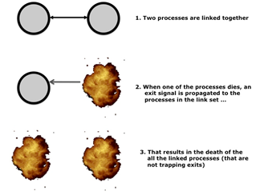

# 第5章 并发错误处理和容错性：链接、监视器和进程

本章内容包括：

- 以 Elixir 风格处理错误
- 链接、监视器和捕获退出
- 实现一个监督器

是否看过阿诺德·施瓦辛格主演的《终结者》？那部关于未来的刺客机器人的电影？无论终结者受到多少枪击，它总能不屈不挠地一次又一次地复原。在本章结束时，你将熟悉容错性功能，能够构建能够优雅处理错误并采取纠正措施解决问题的程序。当然，你至少目前还无法构建天网。

在顺序程序中，通常只有一个主进程在做所有繁重的工作。如果这个进程崩溃了怎么办？通常，这意味着整个程序都崩溃了。常见的处理方法是进行*防御性编程*。这通常意味着在程序中加入
`try`、
`catch` 和
`if err != nil`。

但在构建并发程序时，情况就不同了。由于有不止一个进程在运行，所以有可能*另一个*进程*检测到崩溃*并随后*处理错误*。这是一个非常解放性的概念。

你可能听说过或读过 Erlang 的非官方座右铭——"让它崩溃"——Erlang 程序员非常喜欢这么说。因为这是 Erlang VM 中处理事务的方式。事实证明，这么做有几个很好的理由，我们很快就会了解到。这种独特的错误处理方式可能会让习惯了防御性编程的程序员不由自主地抽搐。

在本节中，我们将首先了解*链接*、*监视器*、*捕获退出*和*进程*，以及它们如何共同构成构建容错系统的基础构建块。然后我们将开始构建一个简单版本的监督器，其唯一的工作是管理工作进程。这将是进入下一章的完美过渡，在那里我们可以更充分地欣赏 OTP 监督器行为所提供的便利和附加功能。

## 5.1 链接 — 直到死亡将我们分开

当一个进程链接到另一个进程时，它创建了一个双向关系。链接的进程有一个*链接集*，其中包含它所链接的所有进程的集合。如果任一进程因任何原因终止，一个*退出信号*会传播到所有与它链接的进程。此外，如果这些进程中的任何一个链接到不同的进程集，那么*相同*的退出信号也会沿着传播。



图 5.1 当一个进程死亡时，所有链接到它的其他进程也将死亡（假设它们没有捕获退出）。

如果你现在在挠头并想知道为什么这是件好事，请考虑以下示例，一群进程在进行 map-reduce 作业。如果这些进程中的任何一个崩溃并死亡，让其余进程继续工作就没有意义了。事实上，让进程相互链接将简化剩余进程的清理工作，因为其中一个进程的失败会自动导致其余链接的进程崩溃。

### 5.1.1 将进程链接在一起

为了理解这一点，需要一个示例。使用 `Process.link/1` 创建链接，唯一的参数是要*链接到*的进程的进程 ID。这意味着 `Process.link/1` 必须在现有进程中调用。

`Process.link/1` 和 `Process.monitor/1` 都是在进程的上下文中调用的

注意 `Process.link/1` 必须在现有的进程中调用，因为没有 `Process.link(link_from, link_to)` 这样的东西。`Process.monitor/1` 也是如此。

打开一个 `iex` 会话。我们将创建一个与 `iex` shell 进程链接的进程。由于我们处于 shell 进程的上下文中，所以每当我们调用 `Process.link/1` 时，我们都将 shell 进程链接到我们指向的任何进程。

我们要创建的进程将在接收到 `:crash` 消息时崩溃。观察它崩溃时会发生什么。首先，让我们记录下当前 shell 进程的 pid：

```elixir
iex> self
#PID<0.119.0>
```

我们可以检查当前 shell 进程的链接集：

```elixir
iex> Process.info(self, :links)
{:links, []}
```

`Process.info/1` 包含有关进程的许多其他有用信息。我们使用 `Process.info(self, :links)` 是因为我们现在只对链接集感兴趣。其他有趣的信息包括邮箱中的消息总数、堆大小以及进程启动时的参数。

正如预期的那样，它是空的，因为我们还没有链接任何进程。接下来，让我们创建一个只对 `:crash` 消息作出响应的进程：

```elixir
iex> pid = spawn(fn -> receive do :crash -> 1/0 end end)
#PID<0.133.0>
```

现在，我们将 shell 进程链接到我们刚刚创建的进程：

```elixir
iex> Process.link(pid)
```

`<0.133.0>` 现在在 `self` 的链接集中：

```elixir
iex> Process.info(self, :links)
{:links, [#PID<0.133.0>]}
```

反过来，`self` (`<0.119.0>`) 也在 `<0.133.0>` 的链接集中：

```elixir
iex> Process.info(pid, :links)
{:links, [#PID<0.119.0>]}
```

现在应该很清楚了，从 shell 进程中调用 `Process.link/1` 创建了一个双向链接，将 shell 进程和我们刚刚产生的进程链接在一起。

现在，我们一直在等待的时刻到了——让我们崩溃这个进程，看看会发生什么：

```elixir
iex> send(pid, :crash)
```

```elixir
11:39:40.961 [error] Error in process <0.133.0> with exit value: {badarith,[{erlang,'/',[1,0],[]}]}
 
** (EXIT from #PID<0.119.0>) an exception was raised:
** (ArithmeticError) bad argument in arithmetic expression: erlang./(1, 0)
```

错误告诉我们，我们在 `<0.133.0>` 中执行了一些糟糕的数学计算，导致了 `ArithmeticError`。此外，请注意，*相同*的错误也使 shell 进程 `<0.119.0>` 崩溃。为了让我们确信之前的 shell 进程确实已经消失：

```elixir
iex> self
#PID<0.145.0>
```

`self` 的 pid 不再是 `<0.119.0>`。

## 5.1.2 连锁反应的退出信号

在前一个例子中，我们建立了两个进程之间的链接。在这个例子中，我们将创建一个链接进程的环，以便你亲自看到错误是如何被传播并重新传播到所有链接中的。在终端中，创建一个新项目：

`% mix new ring`

打开 `lib/ring.ex`，并添加以下内容：

清单 5.1 ring.ex - 创建相互链接的进程环

```elixir
defmodule Ring do

def create_processes(n) do
1..n |> Enum.map(fn _ -> spawn(fn -> loop end) end)
end

def loop do
receive do
{:link, link_to} when is_pid(link_to) ->
Process.link(link_to)
loop

:crash ->
1/0
end
end
end
```

上述内容应该很直接。`Ring.create_processes/1` 创建 `n` 个进程，每个进程都运行之前定义的 `loop` 函数。`Ring.create_processes/1` 的返回值是一个生成的 pids 列表。

循环函数定义了进程可以接收的两种类型的消息，这些消息是：

- `{:link, link_to}` - 链接到由 `link_to` 指定的进程。
- `:crash` - 故意崩溃进程。

5.1.3 设置环

设置链接环更有趣。特别注意我们如何使用模式匹配和递归来设置环：

清单 5.2 ring.ex - 使用递归设置链接环

```elixir
defmodule Ring do

# ...

def link_processes(procs) do
link_processes(procs, [])
end

def link_processes([proc_1, proc_2|rest], linked_processes) do
send(proc_1, {:link, proc_2})
link_processes([proc_2|rest], [proc_1|linked_processes])
end

def link_processes([proc|[]], linked_processes) do
first_process = linked_processes |> List.last
send(proc, {:link, first_process})
:ok
end

# ...
end
```

第一个函数子句 `link_processes/1` 是 `link_processes/2` 的入口点。`link_processes/2` 函数将第二个参数初始化为空列表。`link_processes/2` 的第一个参数是一系列进程（最初未链接）：

清单 5.3 ring.ex - 使用模式匹配链接前两个进程

```elixir
def link_processes([proc_1, proc_2|rest], linked_processes) do
send(proc_1, {:link, proc_2})
link_processes([proc_2|rest], [proc_1|linked_processes]) end
```

我们可以使用模式匹配来获取列表中的前两个进程。然后，通过发送 `{:link, link_to}` 消息，告诉第一个进程链接到第二个进程。

接下来，递归调用 `link_processes/2`。这次，输入进程*不包括*第一个进程。相反，它被添加到第二个参数中，表示已向该进程发送 `{:link, link_to}` 消息。

不久，输入进程列表中将只剩下一个进程。这并不难看出。那是因为我们每次递归调用 `link_processes/2`，输入列表的大小就减少一个。我们可以通过模式匹配 `[proc|[]]` 来检测这种情况：

清单 5.4 ring.ex - 只剩下一个进程时的终止条件

```elixir
def link_processes([proc|[]], linked_processes) do
first_process = linked_processes |> List.last
send(proc, {:link, first_process})
:ok end
```

最后，为了完成环，我们需要将 `proc` 链接到第一个进程。因为进程按照 LIFO（后进先出）的顺序被添加到 `linked_processes` 列表中，这意味着第一个进程是最后一个元素。一旦我们从最后一个进程创建了到第一个进程的链接，我们就完成了环。让我们

试一试吧：

`% iex -S mix`

让我们创建五个进程：

`iex(1)> pids = Ring.create_processes(5)`
`[#PID<0.84.0>, #PID<0.85.0>, #PID<0.86.0>, #PID<0.87.0>, #PID<0.88.0>]`

接下来，我们将它们全部链接起来：

`iex(2)> Ring.link_processes(pids)`
`:ok`

这些进程的链接集是什么？让我们找出来：

`iex> pids |> Enum.map(fn pid -> "#{inspect pid}: #{inspect Process.info(pid, :links)}" end)`

这给了我们：
```elixir
["#PID<0.84.0>: {:links, [#PID<0.85.0>, #PID<0.88.0>]}",
"#PID<0.85.0>: {:links, [#PID<0.84.0>, #PID<0.86.0>]}",
"#PID<0.86.0>: {:links, [#PID<0.85.0>, #PID<0.87.0>]}",
"#PID<0.87.0>: {:links, [#PID<0.86.0>, #PID<0.88.0>]}",
"#PID<0.88.0>: {:links, [#PID<0.87.0>, #PID<0.84.0>]}"]
```


让我们崩溃一个随机进程！我们从 `pids` 列表中随机选择一个 pid 并向它发送 `:crash` 消息：

```elixir
iex(6)> pids |> Enum.shuffle |> List.first |> send(:crash)
:crash
```

现在我们可以检查这些进程是否都没有幸存：

```elixir
iex(8)> pids |> Enum.map(fn pid -> Process.alive?(pid) end)
[false, false, false, false, false]
```

5.1.4 截获退出信号

到目前为止，我们所做的只是看到链接将所有链接的进程一起带下来。如果我们不希望进程在接收到错误信号时死亡怎么办？我们需要使进程*截获退出信号*。要使进程截获退出信号，需要调用`Process.flag(:trap_exit, true)`。这样做将进程从普通进程转变为系统进程。

普通进程与系统进程有何区别？当系统进程收到错误信号时，它不会像普通进程那样崩溃，而是将信号转换为普通消息，格式为`{:EXIT, pid, reason}`，其中`pid`是被终止的进程，`reason`是终止的原因。

这样，系统进程可以对被终止的进程采取纠正措施。让我们看看这是如何与两个进程一起工作的，类似于本节中的第一个示例。

首先，我们注意到当前的shell进程：

```
iex> self
#PID<0.58.0>
```

接下来，通过使其截获退出来将shell进程转变为系统进程：

```
iex> Process.flag(:trap_exit, true)
false
```

请注意，就像`Process.link/1`一样，这必须在调用进程内部调用。然后，我们创建一个将要崩溃的进程：

```
iex> pid = spawn(fn -> receive do :crash -> 1/0 end end)
#PID<0.62.0>
```

然后将新创建的进程链接到shell进程：

```
iex> Process.link(pid)
true
```

现在，如果我们尝试崩溃新创建的进程会发生什么？

```
iex> send(pid, :crash)
:crash
14:37:10.995 [error] Error in process <0.62.0> with exit value: {badarith,[{erlang,’/‘,[1,0],[]}]}
```

首先，让我们检查shell进程是否存活：

```
iex> self
#PID<0.58.0>
```

是的！它与之前的进程相同。现在，让我们看看shell进程收到了什么消息：

```
iex> flush
{:EXIT, #PID<0.62.0>, {:badarith, [{:erlang, :/, [1, 0], []}]}}
```

正如预期的，因为shell进程以`{:EXIT, pid, reason}`的形式接收到消息。我们稍后在学习如何创建我们自己的监督者进程时会利用这一点。

5.1.5 链接已终止/不存在的进程

让我们尝试链接一个已死的进程，看看会发生什么。首先，我们创建一个很快就退出的进程：

```
iex> pid = spawn(fn -> IO.puts “Bye, cruel world.” end)
Bye, cruel world.
#PID<0.80.0>
```

我们确保这个进程真的死了：

```
iex> Process.alive? pid
false
```

然后我们尝试链接一个已死的进程：

```
iex> Process.link(pid)
** (ErlangError) erlang error: :noproc:erlang.link(#PID<0.62.0>)
```

`Process.link/1`确保你正在链接到一个未终止的进程，并且如果你尝试链接到一个已终止或不存在的进程，它会报错。

5.1.6 `spawn_link/3`：在一个原子步骤中产生和链接

大多数时候，当生成一个进程时，你会想使用`spawn_link/3`。`spawn_link/3`是否像`spawn/3`和`link/1`的荣耀包装？换句话说，是否执行`spawn_link(

Worker, :loop, [])`与执行以下操作相同：

```
pid = spawn(Worker, :loop, [])
Process.link(pid)
```

事实证明，这个故事比这更复杂。`spawn_link/3`在一个原子操作中完成生成和链接。为什么这很重要？这是因为当`link/1`给出一个已终止或不存在的进程时，它会抛出一个错误。由于`spawn/3`和`link/1`是两个单独的步骤，`spawn/3`很可能失败，导致后续调用`link/1`引发异常。

5.1.7 退出消息

有三种类型的`:EXIT`消息。你已经看到了第一种，其中返回的终止原因描述了异常。

正常终止

进程在正常终止时发送`:EXIT`消息。这意味着进程没有更多的代码要运行。例如，给出这个进程，其唯一的任务是接收`:ok`消息然后退出：

```
iex> pid = spawn(fn -> receive do :ok -> :ok end end)
#PID<0.73.0>
```

记得链接这个进程：

```
iex> Process.link(pid)
true
```

然后我们发送`:ok`消息给这个进程，使其正常退出：

```
iex> send(pid, :ok)
:ok
```

现在，让我们揭示shell进程收到的消息：

```
iex> flush
{:EXIT, #PID<0.73.0>, :normal}
```

请注意，对于*正常*链接到刚刚正常退出（即以`:normal`为原因）的进程的进程，前者进程*不会*被终止。

强制杀死进程

进程死亡还有一种方式，那就是使用`Process.exit(pid, :kill)`。这会向目标进程发送一个*无法截获*的退出信号。这意味着即使进程可能正在截获退出，这也是它无法截获的一个信号。让我们设置shell进程来截获退出：

```
iex> self
#PID<0.91.0>

iex> Process.flag(:trap_exit, true)
false
```

当我们尝试使用`:kill`以外的原因使用`Process.exit/2`杀死它时：

```
iex> Process.exit(self, :whoops)
true

iex> self
#PID<0.91.0>

iex> flush
{:EXIT, #PID<0.91.0>, :whoops}

iex> self
#PID<0.91.0>
```

在这里，我们已经显示了shell进程已成功截获该信号，因为它在其邮箱中收到了`{:EXIT, pid, reason}`消息。现在，让我们尝试`Process.exit(self, :kill)`：

```
iex> Process.exit(self, :kill)
** (EXIT from #PID<0.91.0>) killed

iex> self
#PID<0.103.0>
```

这次，请注意shell进程重新启动，进程id不再是我们之前的那个。

5.1.8 重访环形链

再次考虑环形链。只有两个进程设置了退出陷阱。我们想创建的是这样的：


图 5.3 当进程 2 被终止时会发生什么？

再次打开 `lib/ring.ex`，添加消息来让进程设置退出陷阱并处理 `{:EXIT, pid, reason}`：

清单 5.5 ring.ex - 让进程处理 :EXIT 和 :DOWN 消息

```elixir
defmodule Ring do
# …

def loop do
  receive do
    {:link, link_to} when is_pid(link_to) ->
      Process.link(link_to)
      loop

    :trap_exit ->
      Process.flag(:trap_exit, true)           #1
      loop

    :crash ->
      1/0

    {:EXIT, pid, reason} ->                   #2
      IO.puts "#{inspect self} received {:EXIT, #{inspect pid}, #{reason}}"
      loop

  end
end
end
```
#1 处理设置退出陷阱的消息

#2 处理检测 :DOWN 消息

进程 1 和进程 2 设置了退出陷阱。所有进程彼此链接。现在，当 2 被终止时会发生什么？我们可以创建三个进程来找出答案：

```elixir
iex> [p1, p2, p3] = Ring.create_processes(3)
[#PID<0.97.0>, #PID<0.98.0>, #PID<0.99.0>]
```
并将它们链接起来：

```elixir
iex> [p1, p2, p3] |> Ring.link_processes
```
我们设置前两个进程来设置退出陷阱。

```elixir
iex> send(p1, :trap_exit)
iex> send(p2, :trap_exit)
```
观察我们终止 `p2` 时会发生什么：

```elixir
iex> Process.exit(p2, :kill)
#PID<0.97.0> received {:EXIT, #PID<0.98.0>, killed}#PID<0.97.0> received {:EXIT, #PID<0.99.0>, killed}
```
最后检查，只有 `p1` 存活：

```elixir
iex> [p1, p2, p3] |> Enum.map(fn p -> Process.alive?(p) end)
[true, false, false]
```
这里是教训：

如果一个进程设置了退出陷阱，并且它被使用 `Process.exit(pid, :kill)` 目标终止，它还是会被终止。当它死亡时，它会向它的链接集中的进程传播一个 `{:EXIT, #PID<0.98.0>, :killed}` 消息，这*可以*被陷阱捕获。

下面是一个表格，总结所有不同的情况：

表 5.1 链接集中的进程退出时可能发生的不同情况

| 当链接集中的进程…                | 设置退出陷阱？ | 那么会发生什么？                   |
| ------------------------------- | -------------- | --------------------------------- |
| 正常退出                        | 是             | 接收 `{:EXIT, pid, :normal}`      |
|                                 | 否             | 无任何反应                        |
| 使用 `Process.exit(pid, :kill)` | 是             | 接收 `{:EXIT, pid, :normal}`      |
| 终止                            | 否             | 以 ``:killed`` 终止               |
| 使用 `Process.exit(pid, other)` | 是             | 接收 `{:EXIT, pid, other }`       |
| 终止                            | 否             | 以 `other` 终止                   |

5.2 监视器

有时候，您不需要双向链接。您只是想让一个进程知道另一个进程是否已经宕机，而不影响监视进程本身。例如，在客户端-服务器架构中，如果客户端由于某种原因宕机，服务器不应该随之宕机。

这就是*监视器*的用途。它们在监视进程和被监视的进程之间建立单向链接。让我们来做一些监视工作！我们创建一个我们最喜欢的可崩溃进程：

```elixir
iex> pid = spawn(fn -> receive do :crash -> 1/0 end end)
#PID<0.60.0>
```

然后，我们告诉shell去监视这个进程：

```elixir
iex> Process.monitor(pid)
#Reference<0.0.0.80>
```

注意返回值是一个对监视器的*引用*。

引用是独一无二的，可以用来识别消息的来源，尽管这是后面章节的主题。

现在，让进程崩溃并看看会发生什么：

```elixir
iex> send(pid, :crash)
:crash

iex>
18:55:20.381 [error] Error in process <0.60.0> with exit value: {badarith,[{erlang,’/‘,[1,0],[]}]}`nil
```

让我们检查shell进程的邮箱：

```elixir
iex> flush
{:DOWN, #Reference<0.0.0.80>, :process, #PID<0.60.0>,{:badarith, [{:erlang, :/, [1, 0], []}]}}
```

注意引用与`Process.monitor/1`返回的引用相匹配。

5.2.1 监视已终止/不存在的进程

当您尝试监视一个已终止/不存在的进程时会发生什么？继续我们之前的例子，我们首先确信`pid`确实已经死亡：

```elixir
iex> Process.alive?(pid)
false
```

然后让我们再次尝试监视：

```elixir
iex(11)> Process.monitor(pid)
#Reference<0.0.0.114>
```

`Process.monitor/1`正常处理，不像`Process.link/1`，它会抛出一个`:noproc`错误。shell进程收到什么消息？

```elixir
iex(12)> flush
{:DOWN, #Reference<0.0.0.114>, :process, #PID<0.60.0>, :noproc}
```

我们得到一个看起来类似的`:noproc`消息，不过它不是错误，而是一个平常的消息存在于邮箱中。因此，这个消息可以从邮箱中通过模式匹配得到。

5.3 实现一个监督器

一个监督器是一个仅仅负责监视一个或多个进程的进程。这些进程可以是工作进程，甚至是其他监督器。


图5.4 一个监督树可以与其他监督树层叠。监督器和工作进程都可以被监督。

监督器和工作进程被安排在一个监督树中。如果任何工作进程死亡，监督器可以重启死掉的工作进程，并且可能根据特定的*重启策略*重启监督树中的其他工作进程。什么是工作进程？它们通常是实现了GenServer, GenFSM或GenEvent行为的进程。

到目前为止，您已经拥有了构建自己的监督器所需的所有构件。一旦您完成了这个部分，监督器将不再显得神奇，尽管这并不意味

着它们不再令人敬畏。

5.3.1 监督器API

下表列出了监督器的API以及简要描述：

表5.2 我们将实现的API总结

| API | 描述 |
| --- | --- |
| `start_link(child_spec_list)` | 给定一个可能为空的子规范列表，启动监督器进程和相应的子进程 |
| `start_child(supervisor, child_spec)` | 给定一个监督器pid和一个子规范，启动子进程并将其链接到监督器 |
| `terminate_child(supervisor, pid)` | 给定一个监督器pid和一个子pid，终止子进程 |
| `restart_child(supervisor, pid, child_spec)` | 给定一个监督器pid、子pid和一个子规范，重启子进程并用子规范初始化子进程 |
| `count_children(supervisor)` | 给定监督器pid，返回子进程的数量 |
| `which_children(supervisor)` | 给定监督器pid，返回监督器的状态 |

实现上述API将使我们对实际OTP监督器在底层如何工作有一个非常好的理解。

5.3.2 构建我们自己的监督器

像往常一样，我们从一个新的`mix`项目开始。由于叫它`Supervisor`不够原创，而`MySupervisor`又太无聊，让我们给它一些古英语的风格，称之为`ThySupervisor`：

```elixir
% mix new thy_supervisor
```

作为一种复习，我们将使用GenServer行为构建我们的监督器。您可能会惊讶地发现，监督器行为实际上实现了GenServer行为。

```elixir
defmodule ThySupervisor do
use GenServer
end
```

5.3.3 start_link（启动链接）的子规范列表

首先实现 `start_link/1`。

```elixir
defmodule ThySupervisor do
  use GenServer

  def start_link(child_spec_list) do
    GenServer.start_link(__MODULE__, [child_spec_list])
  end
end
```

这是创建监督进程的主要入口点。在这里，我们调用 `GenServer.start_link/2`，传入模块的名称和包含 `child_spec_list` 的列表。`child_spec_list` 指定了（可能为空的）*子规范*列表。

这是一种告诉监督者它应该管理哪些*类型*的进程的方式。两个（相似）工作进程的子规范可能看起来像这样：`[{ThyWorker, :start_link, []}, {ThyWorker, :start_link, []}]`。

回想一下，`GenServer.start_link/2` 期望实现 `ThySupervisor.init/1` 回调。它将第二个参数（列表）传递给 `:init/1`。让我们来做：

列表 5.6 thy_supervisor.ex - start_link/1 和 init 回调/1。注意，在 init/1 回调中捕获了退出。

```elixir
defmodule ThySupervisor do
  use GenServer

  #######
  # API #
  #######

  def start_link(child_spec_list) do
    GenServer.start_link(__MODULE__, [child_spec_list])
  end

  ######################
  # 回调函数 #
  ######################

  def init([child_spec_list]) do
    Process.flag(:trap_exit, true)                      #1
    state = child_spec_list
    |> start_children
    |> Enum.into(HashDict.new)

    {:ok, state}
  end
end
```
#1 让监督进程捕获退出

我们在这里做的第一件事就是让监督进程捕获退出。这样，它就可以接收来自其子进程的退出信号作为正常消息。

接下来的几行中有很多事情发生。`child_spec_list` 被输入到 `start_children/1`。很快您将看到，此函数生成子进程并返回一个元组列表。每个元组都是一对，包含新生成子进程的 pid 和子规范。例如：

`[{<0.82.0>, {ThyWorker, :init, []}}, {<0.84.0>, {ThyWorker, :init, []}}]`
然后这个列表被输入到 `Enum.into/2`。通过将 `HashDict.new` 作为第二个参数传递，我们实际上将元组列表转换为 `HashDict`，子进程的 pid 作为键，子规范作为值。

使用 enum.into 将可枚举转换为可收集

`Enum.into/2`（和接受额外转换函数的 `Enum.into/3`）将一个可枚举（如 `List`）插入到一个可收集的对象中（如 `HashDict`）。这很有帮助，因为 HashDict 知道如果它得到一个元组，第一个元素将成为键，第二个元素将成为值：

```elixir
iex> h = [{:pid1, {:mod1, :fun1, :arg1}}, {:pid2, {:mod2, :fun2, :arg2}}] |> Enum.into(HashDict.new)
```
这将返回一个 HashDict：

`#HashDict<[pid2: {:mod2, :fun2, :arg2}, pid1: {:mod1, :fun1, :arg1}]>`
可以这样检索键：

```elixir
iex> HashDict.fetch(h, :pid2)
{:ok, {:mod2, :fun2, :arg2}}
```
生成的 `HashDict` 包含 pid 和子规范映射，构成了监督进程的*状态*，我们以 `{:ok, state}` 元组返回，这是 `init/1` 所期望的。

start_child（监

督者，子规范）

我还没有描述在 `init/1` 中使用的私有函数 `start_children/1` 中发生的事情。让我们稍微跳过一点，先看看 `start_child/2`。这个函数接收监督者 pid 和子规范，并将子进程附加到监督者：

列表 5.7 thy_supervisor.ex - 启动单个子进程

```elixir
defmodule ThySupervisor do
  use GenServer

  #######
  # API #
  #######

  def start_child(supervisor, child_spec) do
    GenServer.call(supervisor, {:start_child, child_spec})
  end
  
  ######################
  # 回调函数 #
  ######################

  def handle_call({:start_child, child_spec}, _from, state) do
    case start_child(child_spec) do
      {:ok, pid} ->
        new_state = state |> HashDict.put(pid, child_spec)
        {:reply, {:ok, pid}, new_state}
      :error ->
        {:reply, {:error, "error starting child"}, state}
    end
  end

  #####################
  # 私有函数 #
  #####################

  defp start_child({mod, fun, args}) do
    case apply(mod, fun, args) do
      pid when is_pid(pid) ->
        Process.link(pid)
        {:ok, pid}
      _ ->
        :error
    end
  end
end
```
`start_child/2` API 调用向监督者发出同步调用请求。请求包含一个包含 `:start_child` 原子和子规范的元组。请求由 `handle_call({:start_child, child_spec}, _, _)` 回调处理。它尝试使用 `start_child/1` 私有函数启动一个新的子进程。

成功后，调用进程接收到 `{:ok, pid}`，监督者的状态更新为 `new_state`。否则，调用进程接收到带有 `:error` 标签的元组，并提供原因。

监督者和使用 spawn_link 生成子进程

这里有一个重要的点，我们在这里做了一个很大的假设。假设是我们假设创建的进程链接到监督进程。这意味着什么？这意味着我们假设进程是使用 `spawn_link` 生成的。事实上，在 OTP 监督者行为中假设进程是使用 `spawn_link` 创建的。

启动子进程

现在，我们可以看看 `start_children/1` 函数，它在 `init/1` 中使用。这里是：

列表 5.8 thy_supervisor.ex - 启动子进程

```elixir
defmodule ThySupervisor do
  # …

  #####################
  # 私有函数 #
  #####################

  defp start_children([child_spec|rest]) do
    case start_child(child_spec) do
      {:ok, pid} ->
        [{pid, child_spec}|start_children(rest)]
      :error ->
        :error
    end
  end

  defp start_children([]), do: []
end
```
`start_children/1` 函数接收子规范列表，并将子规范交给 `start_child/1`，同时累积一个元组列表。如前所述，每个元组都是一对，包含 `pid` 和子规范。

`start_child/1` 是如何工作的？事实证明，没有太多复杂的机制涉及。每当我们看到一个 `pid`，我们会将其链接到监督进程：

```elixir
defp start_child({mod, fun, args}) do
  case apply(mod, fun, args) do
    pid when is_pid(pid) ->
      Process.link(pid)
      {:ok, pid}
    _ ->
      :error
  end
end
```
terminate_child（监督者，pid）

监督器需要一种方法来终止其子进程。以下是API，回调和私有函数的实现：

清单 5.9    thy\_supervisor.ex – 终止单个子进程

```elixir
defmodule ThySupervisor do
use GenServer

#######
# API #
#######

def terminate_child(supervisor, pid) when is_pid(pid) do
GenServer.call(supervisor, {:terminate_child, pid})
end

######################
# Callback Functions #
######################

def handle_call({:terminate_child, pid}, _from, state) do
case terminate_child(pid) do
:ok ->
new_state = state |> HashDict.delete(pid)
{:reply, :ok, new_state}
:error ->
{:reply, {:error, "error terminating child"}, state}
end
end

#####################
# Private Functions #
#####################

defp terminate_child(pid) do
Process.exit(pid, :kill)
:ok
end
end
```
我们使用 `Process.exit(pid, :kill)` 来终止子进程。还记得我们如何设置监督器来捕获退出吗？当一个子进程被强制杀死使用 `Process.exit(pid, :kill)`，监督器将收到一个形式为 `{:EXIT, pid, :killed}` 的消息。为了处理这个消息，使用 `handle_info/3` 回调：

清单 5.10  thy\_supervisor.ex – :EXIT 消息通过 handle\_info/3 回调处理

```elixir
def handle_info({:EXIT, from, :killed}, state) do
new_state = state |> HashDict.delete(from)
{:no_reply, new_state}
end
```
我们需要做的就是更新监督器状态，通过在 `HashDict` 中删除其条目，并在回调中返回适当的元组。

restart\_child(pid, child\_spec)

有时手动重启一个子进程是有帮助的。当我们想要重启一个子进程时，我们需要提供进程id和子规范。为什么我们需要将子规范与进程id一起传入？原因是你可能想要添加更多的参数，这必须进入子规范。

`restart_child/2` 私有函数是 `terminate_child/1` 和 `start_child/1` 的组合。

清单 5.11  thy\_supervisor.ex – 重启一个子进程

```elixir
defmodule ThySupervisor do
use GenServer

#######
# API #
#######

def restart_child(supervisor, pid, child_spec) when is_pid(pid) do
GenServer.call(supervisor, {:restart_child, pid, child_spec})
end

######################
# Callback Functions #
######################

def handle_call({:restart_child, old_pid}, _from, state) do
case HashDict.fetch(state, old_pid) do
{:ok, child_spec} ->
case restart_child(old_pid, child_spec) do
{:ok, {pid, child_spec}} ->
new_state = state
|> HashDict.delete(old_pid)
|> HashDict.put(pid, child_spec)
{:reply, {:ok, pid}, new_state}
:error ->
{:reply, {:error, "error restarting child"}, state}
end
_ ->
{:reply, :ok, state}
end
end

#####################
# Private Functions #
#####################

defp restart_child(pid, child_spec) when is_pid(pid) do
case terminate_child(pid) do
:ok ->
case start_child(child_spec) do
{:ok, new_pid} ->
{:ok, {new_pid, child_spec}}
:error ->
:error
end
:error ->
:error
end
end
end
```
count\_children(supervisor)

这个函数返回与监督器链接的子进程的数量。实现很直接：

清单 5.12 thy\_supervisor.ex – 计算子进程的数量

```elixir
defmodule ThySupervisor do
use GenServer

#######
# API #
#######

def count_children(supervisor) do
GenServer.call(supervisor, :count_children)
end

######################
# Callback Functions #
######################

def handle_call(:count_children, _from, state) do
{:reply, HashDict.size(state), state}
end
end
```
which\_children(supervisor)

这与 `count_children/1` 的实现类似。因为我们的实现很简单，所以完全可以返回整个状态：

清单 5.13 thy\_supervisor.ex – which\_children/1 的简单实现，返回监督器的整个状态

```elixir
defmodule ThySupervisor do
use GenServer

#######
# API #
#######

def which_children(supervisor) do
GenServer.call(supervisor, :which_children)
end

######################
# Callback Functions #
######################

def handle_call(:which_children, _from, state) do
{:reply, state, state}
end
end
```
terminate(reason, state)

这个回调被用来关闭监督器进程。在我们终止监督器进程之前，我们需要终止所有与其链接的子进程，这是由 `terminate_children/1` 私有函数处理的：

清单 5.14 thy\_supervisor.ex – 终止监督器涉及到首先终止子进程

```elixir
defmodule ThySupervisor do
use GenServer

######################
# Callback Functions #
######################

def terminate(_reason, state) do
terminate_children(state)
:ok
end

#####################
# Private Functions #
#####################

defp terminate_children([]) do
:ok
end

defp terminate_children(child_specs) do
child_specs |> Enum.each(fn {pid, _} -> terminate_child(pid) end)
end

defp terminate_child(pid) do
Process.exit(pid, :kill)
:ok
end
end
```

### 5.3.4 处理崩溃

我把最好的留到了最后。当其中一个子进程崩溃时会发生什么？如果你注意的话，监督器会收到一个看起来像 `{:EXIT, pid, reason}` 的消息。我们再次使用 `handle_info/3` 回调来处理退出消息。

有两种情况需要考虑（除了 `:killed`，我们在 `terminate_child/1` 中处理了）。

第一种情况是进程正常退出。在这种情况下，监督器不需要做任何事情，只需更新其状态：

清单 5.15 thy\_supervisor.ex – 当一个子进程正常退出时，不做任何操作

```elixir
def handle_info({:EXIT, from, :normal}, state) do
new_state = state |> HashDict.delete(from)
{:no_reply, new_state}
end
```
第二种情况是进程异常退出并且没有被强制杀死。在这种情况下，监督器应该自动重启失败的进程：

清单 5.16 thy\_supervisor.ex – 如果一个子进程因为异常原因退出，自动重启它

```elixir
def handle_info({:EXIT, old_pid, _reason}, state) do
case HashDict.fetch(state, old_pid) do
{:ok, child_spec} ->
case restart_child(old_pid, child_spec) do
{:ok, {pid, child_spec}} ->
new_state = state
|> HashDict.delete(old_pid)
|> HashDict.put(pid, child_spec)
{:no_reply, new_state}
:error ->
{:no_reply, state}
end
_ ->
{:no_reply, state}
end
end
```
以上的函数并不新鲜。它几乎与 `restart_child/2` 的实现相同，只是子规范是*重用*的。

### 5.3.5 完整的源代码

以下是我们手动实现的监督器的完整源代码：

清单 5.17 thy\_supervisor.ex 的完整实现

```elixir
defmodule ThySupervisor do
use GenServer

#######
# API #
#######

def start_link(child_spec_list) do
GenServer.start_link(__MODULE__, [child_spec_list])
end

def start_child(supervisor, child_spec) do
GenServer.call(supervisor, {:start_child, child_spec})
end

def terminate_child(supervisor, pid) when is_pid(pid) do
GenServer.call(supervisor, {:terminate_child, pid})
end

def restart_child(supervisor, pid, child_spec) when is_pid(pid) do
GenServer.call(supervisor, {:restart_child, pid, child_spec})
end

def count_children(supervisor) do
GenServer.call(supervisor, :count_children)
end

def which_children(supervisor) do
GenServer.call(supervisor, :which_children)
end

######################
# Callback Functions #
######################

def init([child_spec_list]) do
Process.flag(:trap_exit, true)
state = child_spec_list
|> start_children
|> Enum.into(HashDict.new)

{:ok, state}
end

def handle_call({:start_child, child_spec}, _from, state) do
case start_child(child_spec) do
{:ok, pid} ->
new_state = state |> HashDict.put(pid, child_spec)
{:reply, {:ok, pid}, new_state}
:error ->
{:reply, {:error, "error starting child"}, state}
end
end

def handle_call({:terminate_child, pid}, _from, state) do
case terminate_child(pid) do
:ok ->
new_state = state |> HashDict.delete(pid)
{:reply, :ok, new_state}
:error ->
{:reply, {:error, "error terminating child"}, state}
end
end

def handle_call({:restart_child, old_pid}, _from, state) do
case HashDict.fetch(state, old_pid) do
{:ok, child_spec} ->
case restart_child(old_pid, child_spec) do
{:ok, {pid, child_spec}} ->
new_state = state
|> HashDict.delete(old_pid)
|> HashDict.put(pid, child_spec)
{:reply, {:ok, pid}, new_state}
:error ->
{:reply, {:error, "error restarting child"}, state}
end
_ ->
{:reply, :ok, state}
end
end

def handle_call(:count_children, _from, state) do
{:reply, HashDict.size(state), state}
end

def handle_call(:which_children, _from, state) do
{:reply, state, state}
end

def handle_info({:EXIT, from, :normal}, state) do
new_state = state |> HashDict.delete(from)
{:no_reply, new_state}
end

def handle_info({:EXIT, from, :killed}, state) do
new_state = state |> HashDict.delete(from)
{:no_reply, new_state}
end

def handle_info({:EXIT, old_pid, _reason}, state) do
case HashDict.fetch(state, old_pid) do
{:ok, child_spec} ->
case restart_child(old_pid, child_spec) do
{:ok, {pid, child_spec}} ->
new_state = state
|> HashDict.delete(old_pid)
|> HashDict.put(pid, child_spec)
{:no_reply, new_state}
:error ->
{:no_reply, state}
end
_ ->
{:no_reply, state}
end
end

def terminate(_reason, state) do
terminate_children(state)
:ok
end

#####################
# Private Functions #
#####################

defp start_children([child_spec|rest]) do
case start_child(child_spec) do
{:ok, pid} ->
[{pid, child_spec}|start_children(rest)]
:error ->
:error
end
end

defp start_children([]), do: []

defp start_child({mod, fun, args}) do
case apply(mod, fun, args) do
pid when is_pid(pid) ->
Process.link(pid)
{:ok, pid}
_ ->
:error
end
end

defp terminate_children([]) do
:ok
end

defp terminate_children(child_specs) do
child_specs |> Enum.each(fn {pid, _} -> terminate_child(pid) end)
end

defp terminate_child(pid) do
Process.exit(pid, :kill)
:ok
end

defp restart_child(pid, child_spec) when is_pid(pid) do
case terminate_child(pid) do
:ok ->
case start_child(child_spec) do
{:ok, new_pid} ->
{:ok, {new_pid, child_spec}}
:error ->
:error
end
:error ->
:error
end
end
end
```

## 5.4 一个样例运行（或者：它真的能工作吗？）

在我们开始测试我们的监督器之前，创建一个新文件 `lib/thy_worker.ex`：

清单 5.18 lib/thy\_worker.ex – 一个用于 ThySupervisor 的示例 worker

```elixir
defmodule ThyWorker do
def start_link do
spawn(fn -> loop end)
end

def loop do
receive do
:stop -> :ok

msg ->
IO.inspect msg
loop
end
end
end
```
我们首先创建一个 worker：

`iex> {:ok, sup_pid} = ThySupervisor.start_link([])`
`{:ok, #PID<0.86.0>}`
让我们创建一个进程并将其添加到监督器中。我们保存新生成的子进程的 pid。

`iex> {:ok, child_pid} = ThySupervisor.start_child(sup_pid, {ThyWorker, :start_link, []})`
让我们看看监督器中存在哪些链接：

`iex(3)> Process.info(sup_pid, :links)`
`{:links, [#PID<0.82.0>, #PID<0.86.0>]}`
有趣的是，有两个进程链接到了监督器进程。第一个显然是我们刚刚生成的子进程。那么另一个是什么呢？

`iex> self`
`#PID<0.82.0>`
经过一些思考，我们应该能发现，由于监督器进程是由 shell 进程生成并链接的，所以它的链接集中会有 shell 的 pid。

让我们杀死子进程：

`iex> Process.exit(child_pid, :crash)`
当我们再次检查监督器的链接集时会发生什么？

`iex> Process.info(sup_pid, :links)`
`{:links, [#PID<0.82.0>, #PID<0.90.0>]}`
太棒了！监督器自动负责生成和链接新的子进程。为了说服我们自己，我们可以查看监督器的状态：

`iex> ThySupervisor.which_children(sup_pid)`
`#HashDict<[{#PID<0.90.0>, {ThyWorker, :start_link, []}}]>`

5.5 总结

在本章中，我们通过几个例子强调了以下几点：

- "让它崩溃"的哲学意味着将错误检测和处理委托给另一个进程，而不是过度防御性编程
- 链接建立了进程之间的双向关系，当其中一个进程发生崩溃时，它们会传播退出信号
- 监视器在进程之间建立了单向关系，所以当被监视的进程死亡时，监视进程只会收到通知
- 退出信号可以被所谓的系统进程捕获，这些进程将退出信号转换为普通消息
- 使用进程和链接实现一个简单的监督器进程

在下一章中，我们准备深入研究 OTP Supervisor 行为。我们将学习最重要的 Supervisor 特性，并通过构建一个 worker pooler 来实验它们。有趣的时刻即将到来！