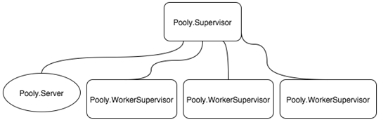
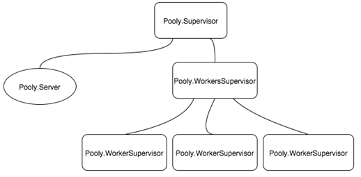
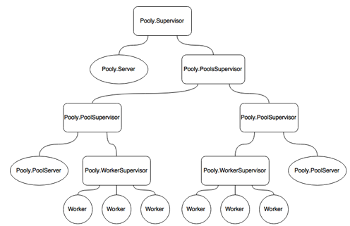
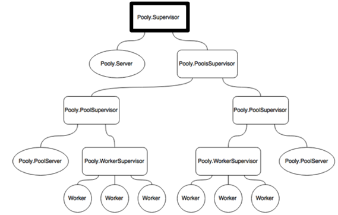
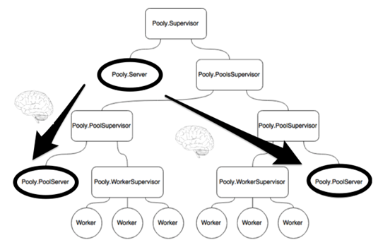
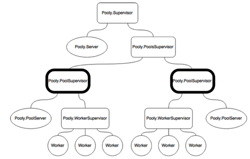
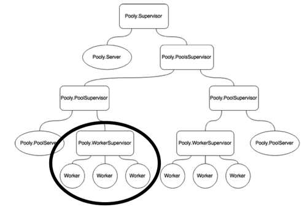

# 第 7 章 完成工作池应用程序

本章内容包括：

· 实现完整的工作池应用程序

· 构建多个监督层级

· 动态创建监督者和工作者

在本章中，我们将继续发展在第 6 章开始的 `Pooly` 的设计。到本章结束时，我们将拥有一个完整且功能齐全的工作池应用程序。我们将更深入地探索 Supervisor API，并探讨更高级（也就是更有趣！）的监督者主题。

在第 6 章中，我们停留在一个非常基础的工作池应用程序阶段，如果可以这样说的话。在接下来的部分中，我们将为 `Pooly` 添加一些智能。例如，目前还没有办法优雅地处理崩溃和重启。`Pooly` 的当前版本只能处理单个池和固定数量的工作者。第 3 版本的 `Pooly` 将实现对多个池的支持，以及对可变数量的工作进程的支持。

有时池需要处理意外负载。当请求太多时会发生什么？当所有工作者都忙时会发生什么？在第 4 版中，我们使池具有可变大小，允许工作者的 *溢出*。我们还实现了在所有工作者都忙时对消费者进程的排队。

## 7.1 版本 3：错误处理、多个池和工作者

我们如何知道一个进程崩溃了？我们可以监视或链接它。这引出了下一个问题，我们应该选择哪一个？为了回答这个问题，我们必须思考当进程崩溃时应该发生什么。有两种情况需要考虑。崩溃可能发生在：

· 服务器进程和消费者进程之间

· 服务器进程和工作者进程之间

### 7.1.1 情况 1：服务器和工作者之间的崩溃

服务器进程的崩溃不应该影响消费者进程。事实上，反之亦然！当消费者进程崩溃时，它不应该使服务器进程崩溃。因此，*监视器* 是正确的选择。

每次工作者检出时，我们已经在监视消费者进程。剩下的就是处理消费者进程的 `:DOWN` 消息：

```elixir
defmodule Pooly.Server do

#############
# Callbacks #
#############

def handle_info({:DOWN, ref, _, _, _}, state = %{monitors: monitors, workers: workers}) do
  case :ets.match(monitors, {:”$1”, ref}) do
    [[pid]] ->
      true = :ets.delete(monitors, pid)
      new_state = %{state | workers: [pid|workers]} #1
      {:no_reply, new_state}

    [[]] ->
      {:no_reply, state}
  end
end
end
#1 将工作者返回到池中
```

当消费者进程崩溃时，我们在 `monitors` ETS 表中匹配引用，删除监视器，并将工作者添加回状态中。

### 7.1.2 情况 2：服务器和工作者之间的崩溃

如果服务器崩溃，它应该带下工作者进程吗？应该，因为否则，服务器的状态将与池的实际状态不一致。另一方面，当工作者进程崩溃时，它应该使服务器进程崩溃吗？当然不是！这对我们意味着什么？嗯，由于双向依赖，我们应该使用 *链接*。然而，由于服务器在工作者进

程崩溃时 *不应* 崩溃，服务器进程应该捕获退出：

```elixir
defmodule Pooly.Server do

#############
# Callbacks #
#############
def init([sup, pool_config]) when is_pid(sup) do
  Process.flag(:trap_exit, true)                          #1
  monitors = :ets.new(:monitors, [:private])
  init(pool_config, %State{sup: sup, monitors: monitors})
end
end
#1 设置服务器进程以捕获退出。
```

现在服务器进程已经开始捕获退出，我们应该处理来自工作者的 `:EXIT` 消息：

```elixir
defmodule Pooly.Server do

#############
# Callbacks #
#############

def handle_info({:EXIT, pid, _reason}, state = %{monitors: monitors, workers: workers, worker_sup: worker_sup}) do
  case :ets.lookup(monitors, pid) do
    [{pid, ref}] ->
      true = Process.demonitor(ref)
      true = :ets.delete(monitors, pid)
      new_state = %{state | workers: [new_worker(worker_sup)|workers]}
      {:noreply, new_state}

    [[]] ->
      {:noreply, state}
  end
end
end
```

当工作者进程意外退出时，在 `monitors` ETS 表中查找其条目。如果条目不存在，则无需执行任何操作。否则，不再监视消费者进程，并从 `monitors` 表中删除其条目。最后，创建一个新的工作者并将其添加回服务器状态的工作者字段中。

### 7.1.3 处理多个池

在第 2 版之后，我们有了一个非常基本的工作池。然而，任何自尊的工作池应用程序都应该能够处理多个池。在我们开始编码之前，让我们先考虑一些可能的设计。最直接的方法是这样设计监督树：



图 7.1 处理多个池的可能设计

你看到问题了吗？我们实际上是在 `Pooly.Supervisor` 中添加更多的 `WorkerSupervisor`。这是一个糟糕的设计。问题在于 *错误核心*，或者说缺乏错误核心。

请允许我详细说明。任何 `WorkerSupervisor` 的问题都不应该影响 `Pooly.Server`。思考当一个进程崩溃时会发生什么，以及谁会受到影响是值得的。一个潜在的修复方法可能是添加另一个监督者来处理所有工作者监督者，比如 `Pooly.WorkersSupervisor`（*只是* 另一个间接层！）。现在它可能是这样的：



图 7.2 另一种可能的设计。你能识别出瓶颈吗？

你注意到另一个问题了吗？可怜的 `Pooly.Server` 必须处理 *每个* 池的所有请求。这意味着如果消息快速而猛烈地发送到服务器进程，可能会导致服务器进程成为瓶颈，并可能淹没其邮箱。`Pooly.Server` 也是单点故障，因为它包含每个池的状态。服务器进程的死亡意味着 *所有* 工作者监督者都必须被关闭。那么考虑一下这个设计：



图 7.3 Pooly 的最终设计

#### 顶层监督器

`Pooly.Supervisor` 作为顶层监督器，管理一个 `Pooly.Server` 和一个 `PoolsSupervisor`。`PoolsSupervisor` 又管理多个 `PoolSupervisor`。每个 `PoolSupervisor` 管理自己的 `PoolServer` 和 `WorkerSupervisor`。

如你所猜测的，Pooly将进行设计大修。为了便于跟踪，我们将从上到下实施更改。

#### 7.1.4 添加应用行为到 Pooly

首先要更改的地方是 `lib/pooly.ex`，Pooly的主入口。由于我们现在支持多个池(pool)，我们希望通过其名称引用每个池。这意味着各种函数也将接受 `pool_name` 作为参数：

##### 清单 7.4 lib/pooly.ex - 添加对多个池的支持

```elixir
defmodule Pooly do
  use Application

  def start(_type, _args) do
    pools_config =                                      #2
    [                                                   #1
      [name: "Pool1",                                   #1
       mfa: {SampleWorker, :start_link, []}, size: 2],  #1
      [name: "Pool2",                                   #1
       mfa: {SampleWorker, :start_link, []}, size: 3],  #1
      [name: "Pool3",                                   #1
       mfa: {SampleWorker, :start_link, []}, size: 4],  #1
    ]                                                   #1

    start_pools(pools_config)                           #2
  end

  def start_pools(pools_config) do                      #2
    Pooly.Supervisor.start_link(pools_config)           #2
  end

  def checkout(pool_name) do                            #3
    Pooly.Server.checkout(pool_name)                    #3
  end

  def checkin(pool_name, worker_pid) do                 #3
    Pooly.Server.checkin(pool_name, worker_pid)         #3
  end

  def status(pool_name) do                              #3
    Pooly.Server.status(pool_name)                      #3
  end
end
```

#1 池配置现在接受多个池的配置。池也有名称。

#2 从 pool_config 到 pools_config 的复数变化。

#3 其余的 API 接受 pool_name 作为参数。

#### 7.1.5 添加顶层监督器

我们的下一站是顶层监督器，`lib/pooly/supervisor.ex`。顶层监督器负责启动 `Pooly.Server` 和 `Pooly.PoolsSupervisor`。当 `Pooly.PoolsSupervisor` 启动时，它启动各自的 `Pooly.PoolSupervisor`，而这些又启动它们自己的 `Pooly.Server` 和 `Pooly.WorkerSupervisor`。



图 7.4 从顶层监督器开始

看图，`Pooly.Supervisor` 监督两个进程：`Pooly.PoolsSupervisor`（尚未实现）和 `Pooly.Server`。因此，我们需要将这两个进程添加到 `Pooly.Supervisor` 的子进程列表中。我们就这样做：

##### 清单 7.5 lib/pooly/supervisor.ex – 顶层监督器监督顶层池服务器和池监督器

```elixir
defmodule Pooly.Supervisor do
  use Supervisor

  def start_link(pools_config) do                       #1
    Supervisor.start_link(__MODULE__, pools_config,
                          name: __MODULE__)             #2
  end

  def init(pools_config) do                             #1
    children = [
      supervisor(Pooly.PoolsSupervisor, []),            #3
      worker(Pooly.Server, [pools_config])              #3
    ]

    opts = [strategy: :one_for_all]

    supervise(children

, opts)
  end
end
```

#1 从 pool_config 到 pools_config 的复数变化。

#2 Pooly.Supervisor 现在是一个命名进程。

#3 Pooly.Supervisor 现在监督两个子进程。注意 Pooly.Server 不再需要 Pooly.Supervisor 的 pid，因为我们可以通过名称引用它。

`Pooly.Supervisor` 的主要变化是添加 `Pooly.PoolsSupervisor` 作为子进程，并给 `Pooly.Supervisor` 命名。回想一下，我们在 #1 中将 `Pooly.Supervisor` 的名称设置为 `__MODULE__`，这意味着我们可以将进程引用为 `Pooly.Supervisor` 而不是 pid。因此，我们不需要将 `self`（参见 `Pooly.Supervisor` 的第二版）传递给 `Pooly.Server`。

#### 7.1.6 添加池的监督器

在 `lib/pooly/` 下创建 `pools_supervisor.ex`。以下是实现：

##### 清单 7.6 lib/pooly/pools_supervisor.ex – 池监督器的完整实现

```elixir
defmodule Pooly.PoolsSupervisor do
  use Supervisor

  def start_link do
    Supervisor.start_link(__MODULE__, [], name: __MODULE__) #1
  end

  def init(_) do
    opts = [
      strategy: :one_for_one                                #2
    ]

    supervise([], opts)
  end
end
```

就像 `Pooly.Supervisor`，我们给 `Pooly.PoolsSupervisor` 命名。注意这个监督器没有子规格。事实上，当它启动时，没有任何池附加到它。这是因为，就像版本 2 一样，我们想在创建任何池之前验证池配置。因此，我们提供的唯一信息是重启策略，如 #2 所示。为什么是 `:one_for_one`？任何池的崩溃都不应该影响其他池。

7.1.7 使 Pooly.Server 更简单

在第一版和第二版中，我们说 `Pooly.Server` 是整个操作的大脑。但现在不再是这样了。`Pooly.Server` 的一些工作将由专门的 `Pooly.PoolServer` 接管。



图 7.6 从之前版本的顶级池服务器中移动的逻辑将被移至各个池服务器

大多数 API 与之前版本相同，增加了 `pool_name`。打开 `lib/pooly/server.ex` 并*替换*之前的实现为以下内容：

清单 7.7 lib/pooly/server.ex - 顶级池服务器的完整实现

```elixir
defmodule Pooly.Server do
use GenServer
import Supervisor.Spec

####### 
# API #
#######

def start_link(pools_config) do
GenServer.start_link(__MODULE__, pools_config, name: __MODULE__)
end

def checkout(pool_name) do
GenServer.call(:”#{pool_name}Server”, :checkout) #2
end

def checkin(pool_name, worker_pid) do
GenServer.cast(:”#{pool_name}Server”, {:checkin, worker_pid})             #2
end

def status(pool_name) do
GenServer.call(:”#{pool_name}Server”, :status)   #2
end

#############
# Callbacks #
#############

def init(pools_config) do                         #3
pools_config |> Enum.each(fn(pool_config) ->    #3
send(self, {:start_pool, pool_config})        #3
end)                                          #3

{:ok, pools_config}
end

def handle_info({:start_pool, pool_config}, state) do #4
{:ok, _pool_sup} = Supervisor.start_child(Pooly.PoolsSupervisor, supervisor_spec(pool_config))                           #4
{:no_reply, state}
end

#####################
# Private Functions #
#####################

defp supervisor_spec(pool_config) do
opts = [id: :”#{pool_config[:name]}Supervisor”]    #5
supervisor(Pooly.PoolSupervisor, [pool_config], opts)
end
end
```

在这个版本中，`Pooly.Server` 的工作是*委托*所有请求给相应的池，并启动池并将池附加到 `Pooly.PoolsSupervisor`。

在 #2 中，我们假设每个单独的池服务器被命名为 `:”#{pool_name}Server”`。注意名字是*原子*！遗憾的是，因为我未能正确阅读文档，我在这上面浪费了几个小时（和头发）。

在 #3 中，`pools_config` 被迭代，发送 `{:start_pool, pool_config}` 消息给自己。在 #4 中处理消息，告诉 `Pooly.PoolsSupervisor` 根据给定的 `pool_config` 启动一个子进程。

这里有一个*微小*的注意点。注意在 #5 中我们确保每个 `Pooly.PoolSupervisor` 以*独特*的监督器规范 id 启动。如果忘记这样做，你会得到一个如下的神秘错误信息：

```
12:08:16.336 [error] GenServer Pooly.Server terminating
Last message: {:start_pool, [name: “Pool2”, mfa: {SampleWorker, :start_link, []}, size: 2]}
State: [[name: “Pool1”, mfa: {SampleWorker, :start_link, []}, size: 2], [name: “Pool2”, mfa: {SampleWorker, :start_link, []}, size: 2]]
** (exit) an exception was raised:
** (MatchError) no match of right hand side value: {:error, {:already_started, #PID<0.142.0>}}
(pooly) lib/pooly/server.ex:38: Pooly.Server.handle_info/2
(stdlib) gen_server.erl:593: :gen_server.try_dispatch/4
(stdlib) gen_server.erl:659: :gen_server.handle_msg/5
(stdlib

) proc_lib.erl:237: :proc_lib.init_p_do_apply/3
```

这里的线索是 `{:error, {:already_started, #PID<0.142.0>}}`。我花了几个小时试图解决这个问题，直到偶然发现这个解决方案。当一个 `Pooly.PoolSupervisor` 以给定的 `pool_config` 启动时会发生什么？

7.1.8 添加池监督器



图 7.7 实现各个池监督器

`Pooly.PoolSupervisor` 取代了之前版本的 `Pooly.Supervisor`。因此，只有一些小的更改。首先，每个 `Pooly.PoolSupervisor` 现在都初始化了一个名字。其次，我们需要告诉 `Pooly.PoolSupervisor` 使用 `Pooly.PoolServer`。以下是更改内容：

清单 7.8 lib/pooly/pool_supervisor.ex - 单个池监督器的完整实现

```elixir
defmodule Pooly.PoolSupervisor do
use Supervisor

def start_link(pool_config) do
Supervisor.start_link(__MODULE__, pool_config, name: :”#{pool_config[:name]}Supervisor”)                     #1
end

def init(pool_config) do
opts = [
strategy: :one_for_all
]

children = [
worker(Pooly.PoolServer, [self, pool_config])     #2
]

supervise(children, opts)
end
end
```

我们在 #1 中给单个池监督器命名，尽管这并非严格必要。这有助于我们在观察器中轻松找到池监督器。

其次，#2 中的子规范从 `Pooly.Server` 更改为 `Pooly.PoolServer`。我们传递相同的参数。尽管我们正在命名 `Pooly.PoolSupervisor`，我们将*不会*在 `Pooly.PoolServer` 中使用该名称，这样我们可以重用来自版本2的 `Pooly.Server` 的大部分实现。

### 7.1.9 添加池(Pool)的核心逻辑

如上一节所述，大部分逻辑保持不变，只是在一些地方进行了修改以支持多个池。为了节约纸张和屏幕空间，与`Pooly.Server`版本2完全相同的函数被用“`# …`”标记了出来。换句话说，如果你在跟随学习，可以将`Pooly.Server`版本2的实现复制粘贴到`Pooly.PoolyServer`。

以下是`Pooly.PoolServer`的实现：

#### 清单 7.9 lib/pooly/pool_server.ex - 单个池服务器的完整实现

```elixir
defmodule Pooly.PoolServer do
  use GenServer
  import Supervisor.Spec

  defmodule State do
    defstruct pool_sup: nil, worker_sup: nil, monitors: nil, size: nil, workers: nil, name: nil, mfa: nil
  end

  def start_link(pool_sup, pool_config) do
    GenServer.start_link(__MODULE__, [pool_sup, pool_config], name: name(pool_config[:name]))
  end

  def checkout(pool_name) do
    GenServer.call(name(pool_name), :checkout)
  end

  def checkin(pool_name, worker_pid) do
    GenServer.cast(name(pool_name), {:checkin, worker_pid})
  end

  def status(pool_name) do
    GenServer.call(name(pool_name), :status)
  end

  # 回调函数
  # ...

  def init([pool_sup, pool_config]) when is_pid(pool_sup) do
    Process.flag(:trap_exit, true)
    monitors = :ets.new(:monitors, [:private])
    init(pool_config, %State{pool_sup: pool_sup, monitors: monitors})
  end

  def init([{:name, name}|rest], state) do
    # …
  end

  # 其他初始化函数
  # ...

  def handle_call(:checkout, {from_pid, _ref}, %{workers: workers, monitors: monitors} = state) do
    # …
  end

  def handle_call(:status, _from, %{workers: workers, monitors: monitors} = state) do
    # …
  end

  def handle_cast({:checkin, worker}, %{workers: workers, monitors: monitors} = state) do
    # …
  end

  def handle_info(:start_worker_supervisor, state = %{pool_sup: pool_sup, name: name, mfa: mfa, size: size}) do
    {:ok, worker_sup} = Supervisor.start_child(pool_sup, supervisor_spec(name, mfa))
    workers = prepopulate(size, worker_sup)
    {:no_reply, %{state | worker_sup: worker_sup, workers: workers}}
  end

  def handle_info({:DOWN, ref, _, _, _}, state = %{monitors: monitors, workers: workers}) do
    # …
  end

  # 其他处理函数
  # ...

  def terminate(_reason, _state) do
    :ok
  end

  # 私有函数
  # ...

  defp name(pool_name) do
    :"#{pool_name}Server"
  end

  defp prepopulate(size, sup) do
    # …
  end

  # 其他预填充函数
  # ...

  defp supervisor_spec(name, mfa) do
    opts = [id: name <> "WorkerSupervisor", restart: :temporary]
    supervisor(Pooly.WorkerSupervisor, [self, mfa], opts)
  end
end
```

这里有几个显著的变化。服务器的`start_link/2`函数将*池监督器*作为第一个参数。在#3中，池监督器的pid被保存在服务器进程的状态中。此外，注意服务器的状态已扩展以存储池监督器和工作监督器的pid：

```elixir
defmodule State do
  defstruct pool_sup: nil, worker_sup: nil, monitors: nil, size: nil, workers: nil, name: nil, mfa: nil
end
```

一旦服务器处理完池配置，它将最终向自己发送`:start_worker_supervisor`消息，如#4所示。这条消息由`handle_info/2`回调处理。在

#5中，池监督器被告知作为子项启动工作监督器，使用#8中定义的子规范。除了`mfa`，我们还传递了服务器进程的pid。一旦返回工作监督器的pid，它就会在#6中被用来预填充工作人员。#2利用`name/1`来引用适当的池服务器以调用相应的函数。

7.1.10     为池添加工作监管器

最后一部分是工作监管器。它负责管理单个工作程序。它管理任何崩溃的工作程序。有一个微妙的细节。在初始化期间，工作监管器创建了与其对应池服务器的*链接*。为什么要这样做？如果池服务器或工作监管器中的任何一个停止工作，另一个继续存在就没有意义了。



图 7.8 实现单个池的工作监管器

让我们看看完整实现的更多细节：

代码清单 7.10 lib/pooly/worker_supervisor.ex – 池的工作监管器的完整实现

```elixir
defmodule Pooly.WorkerSupervisor do
use Supervisor

def start_link(pool_server, {_,_,_} = mfa) do           #1
Supervisor.start_link(__MODULE__, [pool_server, mfa]) #1
end

def init([pool_server, {m,f,a}]) do
Process.link(pool_server)                             #2
worker_opts = [restart:  :temporary,
shutdown: 5000,
function: f]

children = [worker(m, a, worker_opts)]
opts     = [strategy:     :simple_one_for_one,
max_restarts: 5,
max_seconds:  5]

supervise(children, opts)
end
end
```

唯一的变化是增加了额外的`pool_server`参数，并将`pool_server`与工作监管器进程链接。为什么？如前所述，这两个进程之间存在依赖关系，当工作监管器停止工作时，需要通知池服务器。同样，如果工作监管器崩溃，它也应该同时带下池服务器。

为了让池服务器处理这个消息，你需要在`lib/pooly/pool_server.ex`中添加另一个`handle_info/2`回调：

代码清单 7.11 lib/pooly/pool_server.ex – 让池服务器检测到工作监管器停止工作

```elixir
defmodule Pooly.PoolServer do

#############
# Callbacks #
#############

def handle_info({:EXIT, worker_sup, reason}, state = %{worker_sup: worker_sup}) do
{:stop, reason, state}
end
end
```

在这里，每当工作监管器退出时，它也会终止池服务器，并且原因是与终止工作监管器的原因相同。

7.1.11     将其实际运行

让我们确保我们正确地连接了一切。首先，打开`lib/pooly.ex`来配置池。确保`start/2`函数看起来像这样：

代码清单 7.12 lib/pooly.ex – 配置 Pooly 启动三个不同大小的池

```elixir
defmodule Pooly do
use Application

def start(_type, _args) do
pools_config =
[
[name: “Pool1”, mfa: {SampleWorker, :start_link, []}, size: 2],
[name: “Pool2”, mfa: {SampleWorker, :start_link, []}, size: 3],
[name: “Pool3”, mfa: {SampleWorker, :start_link, []}, size: 4]
]

start_pools(pools_config)
end

# …end
```

在这里，我们告诉 Pooly 创建三个池，每个池具有给定的大小和工作类型。为了简单（实际上是懒惰），我们在所有三个池中都使用了`SampleWorker`。在一个新的终端会话中，启动`iex`并启动 Observer：

```shell
% iex -S mix
iex> :observer.start
```

见证你所创建的壮丽监管树：


图 7.9 从 Observer 看到的 Pooly 监管树

现在，从监管树的叶子（最低/最右边）开始，

尝试右击进程并杀死它。你会再次注意到一个新进程会接管。

接下来，往上走。比如，当杀死`Pool3Server`时会发生什么？你会注意到对应的`WorkerSupervisor`和它下面的工作程序都会被杀死并重新生成。重要的是要注意，`Pool3Server`是一个全新的进程。

现在再往上走。当你杀死一个`PoolSupervisor`时会发生什么？正如预期的那样，它下面的所有东西都会被杀死，另一个`PoolSupervisor`会重新生成，它下面的所有东西也会重新生成。注意不会发生的事情。应用程序的其余部分不会受到影响。这不是很棒吗？当崩溃发生时，正如它们不可避免地会发生的那样，拥有一个精心层次化的监管层次结构可以让错误以非常孤立的方式处理，从而不影响应用程序的其余部分。

7.2           版本 4：实现溢出和排队功能

在 Pooly 的最终版本中，我们将扩展它以支持可变数量的工作进程，方法是指定一个*最大溢出量*。

我们还希望引入*排队*工作进程的概念。也就是说，当达到最大溢出限制时，Pooly 能够为愿意*阻塞并等待*下一个可用工作进程的消费者排队工作进程。

7.2.1        实现最大溢出

像往常一样，为了指定最大溢出，我们在池配置中添加了一个新字段。在 `lib/pooly.ex` 中，修改 `start/2` 中的 `pools_config`，使其看起来如下：

清单 7.13 lib/pooly.ex - 实现最大溢出

```elixir
defmodule Pooly do

def start(_type, _args) do
pools_config =
[
[name: “Pool1”,
mfa: {SampleWorker, :start_link, []},
size: 2,
max_overflow: 3                       #1
],
[name: “Pool2”,
mfa: {SampleWorker, :start_link, []},
size: 3,
max_overflow: 0                       #1
],
[name: “Pool3”,
mfa: {SampleWorker, :start_link, []},
size: 4,
max_overflow: 0                       #1
]
]

start_pools(pools_config)
end
end
```
#1 在池配置中指定最大溢出。

现在我们有了池配置的新选项，我们必须前往 `lib/pooly/pool_server.ex` 以支持 `max_overflow`。这包括：

·      在 `State` 中添加一个名为 `max_overflow` 的条目

·      在 `State` 中添加一个名为 `overflow` 的条目，用于跟踪当前溢出计数

·      在 `init/2` 中添加一个函数子句来处理 `max_overflow`

以下是添加内容：

清单 7.14 lib/pooly/pool_server.ex - 在池服务器中添加最大溢出选项

```elixir
defmodule Pooly.PoolServer do

defmodule State do
defstruct pool_sup: nil, worker_sup: nil, monitors: nil, size: nil, workers: nil, name: nil, mfa: nil, overflow: nil, max_overflow: nil
end

#############
# Callbacks #
#############

def init([{:name, name}|rest], state) do
# …
end

# … more init/1 definitions

def init([{:max_overflow, max_overflow}|rest], state) do
init(rest, %{state | max_overflow: max_overflow})
end

def init([], state) do
#…
end

def init([_|rest], state) do
# …
end
end
```
接下来，我们必须考虑实际溢出的情况。当忙碌工作进程的总数超过 `size` *并且* 在 `max_overflow` 限制内时，就会发生溢出。何时会发生溢出？当工作进程被*取出*时。因此，唯一需要查看的地方是 `handle_call({:checkout, block}, from, state)`。

处理这种情况相当简单。#1 检查我们是否在溢出限制内。如果是，将创建一个新的工作进程，并将必要的簿记信息添加到 `monitors` ETS 表中。然后将工作进程 pid 作为回复发送给消费者进程，并增加 `overflow` 计数：

清单 7.15 lib/pooly/pool_server.ex - 在池服务器中处理取出时的溢出

```elixir
defmodule Pooly.PoolServer do

#############
# Callbacks #
#############

def handle_call({:checkout, block}, {from_pid, _ref} = from, state) do
%{worker_sup:   worker_sup,
workers:      workers,
monitors:     monitors,
overflow:     overflow,
max_overflow: max_overflow} = state

case workers do


[worker|rest] ->
# …
{:reply, worker, %{state | workers: rest}}

[] when max_overflow > 0 and overflow < max_overflow -> #1
{worker, ref} = new_worker(worker_sup, from_pid)
true = :ets.insert(monitors, {worker, ref})
{:reply, worker, %{state | overflow: overflow+1}}

[] ->
{:reply, :full, state};
end
end
end
```
7.2.2        处理工作进程签入

现在我们可以处理溢出了，那么我们该如何处理工作进程的签入呢？我们该如何处理*签入*？之前在版本 2 中，我们所做的一切只是将工作进程 pid 添加回 `PoolServer` 状态的 `workers` 字段：

`{:no_reply, %{state | workers: [pid|workers]}}`
然而，在处理*溢出*工作进程的签入时，我们不想将其添加回 `workers` 字段。只需*解雇*工作进程就足够了。我们将实现一个辅助函数来处理签入：

清单 7.16 lib/pooly/pool_server.ex - 在池服务器中处理工作进程溢出

```elixir
defmodule Pooly.PoolServer do

#####################
# Private Functions #
#####################

def handle_checkin(pid, state) do
%{worker_sup:   worker_sup,
workers:      workers,
monitors:     monitors,
overflow:     overflow} = state

if overflow > 0 do
:ok = dismiss_worker(worker_sup, pid)
%{state | waiting: empty, overflow: overflow-1}
else
%{state | waiting: empty, workers: [pid|workers], overflow: 0}
end
end

defp dismiss_worker(sup, pid) do
true = Process.unlink(pid)
Supervisor.terminate_child(sup, pid)
end
end
```
`handle_checkin/2` 所做的是检查当工作进程签回时池是否确实已溢出。如果是，它会委托给 `dismiss_worker/2` 来终止工作进程，并减少 `overflow`。否则，应该将工作进程添加回 `workers`，就像以前一样。

解雇工作进程的函数应该不难理解。我们需要做的就是将工作进程从池服务器中断开链接，并告诉工作进程监督器终止该子进程。现在，我们可以更新 `handle_cast({:checkin, worker}, state)`：

清单 7.17 lib/pooly/pool_server.ex - 使用 handle_checkin/2 更新签入回调

```elixir
defmodule Pooly.PoolServer do

#############
# Callbacks #
#############

def handle_cast({:checkin, worker}, %{monitors: monitors} = state) do
case :ets.lookup(monitors, worker) do
[{pid, ref}] ->
# …
new_state = handle_checkin(pid, state) #1
{:no_reply, new_state}

[] ->
{:no_reply, state}
end
end
end
```
#1 更新此行以使用 handle_checkin/2

### 7.2.3 处理工作者退出

当溢出的工作者退出时会发生什么？让我们来看一下回调函数 `handle_info({:EXIT, pid, _reason}, state)`。类似于处理工作者签到时的情况，我们将处理工作者退出的任务委托给一个辅助函数：

清单 7.18 lib/pooly/pool_server.ex - 一个计算工作者退出状态的辅助函数

```elixir
defmodule Pooly.PoolServer do

#####################
# 私有函数 #
#####################

defp handle_worker_exit(pid, state) do
%{worker_sup:   worker_sup,
workers:      workers,
monitors:     monitors,
overflow:     overflow} = state

if overflow > 0 do
%{state | overflow: overflow-1}
else
%{state | workers: [new_worker(worker_sup)|workers]}
end
end
end
```

逻辑与 `handle_checkin/2` 相反。我们检查池是否溢出，如果是，则减少计数器。由于池溢出，我们不需要将工作者重新添加到池中。另一方面，如果池没有溢出，那么我们需要将一个工作者重新添加到工作者列表中。

清单 7.19 lib/pooly/pool_server.ex - 更新 handle_info 回调以处理工作者退出

```elixir
defmodule Pooly.PoolServer do

#############
# 回调 #
#############

def handle_info({:EXIT, pid, _reason}, state = %{monitors: monitors, workers: workers, worker_sup: worker_sup}) do
case :ets.lookup(monitors, pid) do
[{pid, ref}] ->
# …
new_state = handle_worker_exit(pid, state) #1
{:no_reply, new_state}

_ ->
{:no_reply, state}
end
end
end
```

#1 更新这行以使用 handle_worker_exit/2

### 7.2.4 更新状态以包含溢出信息

让我们给 `Pooly` 增加报告它是否溢出的能力。池子将有三种状态：`:overflow`、`:full` 和 `:ready`。这是更新的 `handle_call(:status, from, state)` 实现：

清单 7.20 lib/pooly/pool_server.ex - 在状态中添加溢出信息

```elixir
defmodule Pooly.PoolServer do

#############
# 回调 #
#############

def handle_call(:status, _from, %{workers: workers, monitors: monitors} = state) do
{:reply, {state_name(state), length(workers), :ets.info(monitors, :size)}, state}
end

#####################
# 私有函数 #
#####################

defp state_name(%State{overflow: overflow, max_overflow: max_overflow, workers: workers}) when overflow < 1 do
case length(workers) == 0 do
true ->
if max_overflow < 1 do
:full
else
:overflow
end
false ->
:ready
end
end

defp state_name(%State{overflow: max_overflow, max_overflow: max_overflow}) do
:full
end

defp state_name(_state) do
:overflow
end
end
```

7.2.5 队列工作进程

对于 `Pooly` 的最后一部分，我们将处理消费者愿意等待工作进程可用的情况。换句话说，消费者进程愿意阻塞，直到工作进程池释放出一个工作进程。

为了实现这一点，我们需要对工作进程进行排队，并将新释放的工作进程与等待的消费者进程匹配。

阻塞消费者

消费者必须告知 `Pooly` 是否愿意阻塞。我们可以通过简单扩展 `lib/pooly.ex` 中的 `checkout` API 来实现这一点：

```elixir
defmodule Pooly do
@timeout 5000

####### 
# API #
#######

def checkout(pool_name, block \\ true, timeout \\ @timeout) do
    Pooly.Server.checkout(pool_name, block, timeout)
end
end
```
在这个新版本的 `checkout` 中，我们添加了两个额外的参数：`block` 和 `timeout`。现在转到 `lib/pooly/server.ex`，相应地更新 `checkout` 函数：

```elixir
defmodule Pooly.Server do

#######
# API #
#######

def checkout(pool_name, block, timeout) do
    Pooly.PoolServer.checkout(pool_name, block, timeout)
end
end
```
现在，进入实际实现的核心，`lib/pooly/pool_server.ex`：

清单 7.21 lib/pooly/pool_server.ex —— 设置 Pool Server 以使用队列等待消费者

```elixir
defmodule Pooly.PoolServer do

defmodule State do
    defstruct pool_sup: nil, …, waiting: nil, …, max_overflow: nil #1
end

#############
# Callbacks #
#############

def init([pool_sup, pool_config]) when is_pid(pool_sup) do
    Process.flag(:trap_exit, true)
    monitors = :ets.new(:monitors, [:private])
    waiting  = :queue.new                              #1
    state    = %State{pool_sup: pool_sup, monitors: monitors, waiting: waiting, overflow: 0}                          #1

    init(pool_config, state)
end

#######
# API #
#######

def checkout(pool_name, block, timeout) do
    GenServer.call(name(pool_name), {:checkout, block}, timeout) #2
end
end
```
#1 更新 state 以存储等待消费者的队列。

#2 为 checkout 添加 block 和 timeout 回调。

首先，使用 `waiting` 字段更新 state。这将存储消费者的*队列*。虽然 Elixir 没有自带队列数据结构，但这并不是问题！Erlang 提供了队列实现。这里有一个更大的教训。每当你发现 Elixir 中缺少某些功能时，不要急于寻找第三方库，试着看看 Erlang 是否有你需要的功能。这凸显了 Erlang 和 Elixir 之间的出色互操作性。

7.2.6 小间歇：Erlang 中的队列

Erlang 提供的队列实现非常有趣。我将用例子说明。我们只看看使用队列的基础知识，即创建队列，向队列中添加和移除项目。在一个新的 `iex` 会话中，创建一个队列：

```elixir
iex(1)> q = :queue.new
{[], []}
```
注意返回值是一个包含两个元素的元组。更准确地说，是列表。为什么是两个元素？为了回答这个问题，向队列中添加几个项目：

```elixir
iex(2)> q = :queue.in(“uno”, q)
{[“uno”], []}

iex(3)> q = :queue.in(“dos”, q)
{[“dos”], [“uno”]}

iex(4)> q = :queue.in(“tres”, q)
{[“tres”, “dos”], [“uno”]}
```
元组的第一个元素（即队列的头部）是元组的*第二

*个元素，而队列的其余部分则由元组的*第一个*元素表示。现在，尝试从队列中移除一个元素：

```elixir
iex(5)> :queue.out(q)
{{:value, “uno”}, {[“tres”], [“dos”]}}
```
这是一个有趣的元组。让我们稍微分解一下。

`{{:value, “uno”}, …}`
这个带有 `:value` 标签的元组包含队列第一个元素的值。现在是另一部分：

`{…, {[“tres”], [“dos”]}}`
这个元组是移除第一个元素后的新队列。新队列的表示与我们之前看到的相同，其中第一个元素是元组的第二个元素，而队列的其余部分在第一个元素中。

是的，我知道这有点混乱，但请坚持。因为记住，在 Elixir/Erlang 世界中，数据结构是不可变的。此外，这对于模式匹配来说是一个完美的情况：

```elixir
iex(6)> {{:value, head}, q} = :queue.out(q)
{{:value, “uno”}, {[“tres”], [“dos”]}}

iex(7)> {{:value, head}, q} = :queue.out(q)
{{:value, “dos”}, {[], [“tres”]}}

iex(8)> {{:value, head}, q} = :queue.out(q)
{{:value, “tres”}, {[], []}}
```
如果我们尝试从一个空队列中取出某物会发生什么？

```elixir
iex(9)> {{:value, head}, q} = :queue.out(q)
** (MatchError) no match of right hand side value: {:empty, {[], []}}
```
哎呀！对于一个空队列，返回值是一个包含 `:empty` 作为第一个元素的元组。这就结束了关于使用队列的简短间歇，你需要理解接下来的例子。


7.3           Exercises


1.   *Restart Strategies.* Play around with the different restart strategies. For example, pick one supervisor and its restart strategy to something different. Launch
`:observer.start`
and see what happens. Did the supervisor restart the child/children processes as you expected?


2.   *Transactions*. There’s a limitation with this implementation. It is assumed that all consumers behave like good citizens of the pool and check back in the workers when they are done with it. In general, the pool shouldn’t make assumptions like this, since it is way too easy to cause a starvation of workers. In order to get around this, Poolboy has *transactions*. Here’s the skeleton:

`defmodule Pooly.Server do`

`def transaction(pool_name, fun, timeout) do`
`worker = <FILL ME IN>`
`try do`
`<FILL ME IN>`
`after`
`<FILL ME IN>`
`end`
`end`
`end`
3.   Currently, it is possible to check-in the same worker *multiple* times. Fix this!


7.4           Summary


Believe it or not, we are done with
`Pooly`! If you have made it this far, you deserve a nice meal. Not only that, you have re-implemented 96.777% of Poolboy, but in Elixir. This is probably the most complicated and largest example in this chapter. But I’m pretty sure after working through this example you would have gained a deeper appreciation of not only supervisors, but also how they interact with other processes and how supervisors can be structured in a layered way to provide fault tolerance.


If you struggled with Chapter 6 and 7, don’t worry[[2]](#uDaQkkzKLpF45pTTXpKN5X8), there’s nothing wrong with you. I struggled with grasping this too. There were a lot of moving parts in
`Pooly`. However if you step back and look at the code again, it’s pretty amazing how everything fits so well together. In this chapter, we:


·      Understand how to use the OTP Supervisor behavior


·      Build multiple supervision hierarchies


·      Dynamically create supervisors and workers using the OTP Supervisor API


·      Took a grand tour of building a non-trivial application using a mixture of Supervisors and GenServers.


In the next chapter, we look at an equally exciting topic, distribution!


[****[1]****](#uTtuo3MaRXcuCm9c6Xiu2jC) Or even worse, building one yourself (unless it’s for educational purposes)!


[****[2]****](#uZv3OqK4r8HhoLncUO8eZeD) If you didn’t, I don’t want to hear about it.


