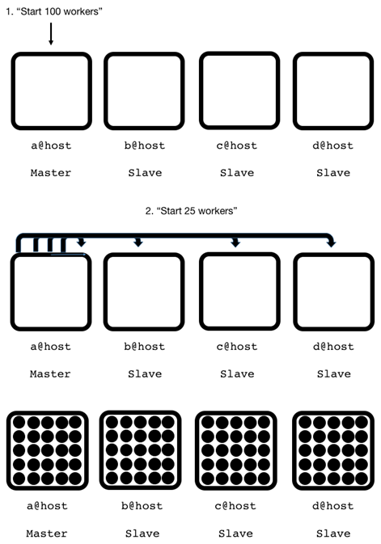
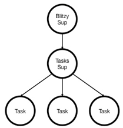

# 8   分布式和负载均衡

本章内容包括：

- 分布式Elixir的基础
- 实现分布式负载测试器
- 构建命令行应用程序
- 任务：一个用于短暂计算的抽象
- 实现分布式且容错的应用程序

这一章和下一章可能是最有趣的章节（我每一章都这么说）。在这一章中，我们将探索Erlang VM的分布式能力。我们将学习创建节点集群和远程生成进程的分布式原语。在下一章中，我们将探讨分布式系统中的故障转移和接管。

为了演示所有这些概念，我们将构建*两个*应用程序。第一个是一个命令行工具，用于对网站进行负载测试。是的，这完全可以被用于邪恶的目的，但我将把它留给你自己的发挥。

另一个应用程序将展示当一个节点故障时，集群是如何通过让另一个节点自动上线来接替故障节点的。更进一步，它还将展示当一个优先级更高的之前故障的节点重新加入集群时，一个节点是如何放弃控制权的。

8.1        为什么要分布式？

至少有两个好理由让你想要创建一个分布式系统。当你正在构建的应用程序超出了单个机器的物理能力时，你可以选择升级那个单机或者添加另一台机器。单个机器能升级的程度是有限的。同样，单个机器能处理的也有物理限制。例如打开的文件句柄数量以及网络连接数。有时候，机器需要因计划性维护或升级而被关闭。有了分布式系统，你可以设计负载在多台机器上分散。换句话说，你正在实现*负载均衡*。

容错是考虑构建分布式系统的另一个原因。这是当我们有一个或多个节点在监控运行应用程序的节点。如果那个节点故障了，下一个排队的节点将自动接管那个节点。这样的设置意味着你消除了单点故障（除非你的所有节点都托管在单一机器上！）。

不要误解；鉴于问题的性质，分布式系统仍然会很难。你仍然需要处理分布式系统中出现的权衡和问题，例如网络分裂。然而，Elixir和Erlang VM提供的工具可以让你在构建分布式系统时更加容易。

8.2        分布式的负载均衡

在本节中，我们将学习如何构建一个分布式负载测试器。我们正在构建的负载测试器基本上是对一个端点发起大量的GET请求，并测量响应时间。由于单个物理机器能打开的网络连接数量有限，这是分布式系统的一个完美用例。在这种情况下，所需的网络请求数量均匀分布在集群中的每个节点上。

8.2.1    Blitzy负载测试器概述

在我们开始学习分布式和实现Blitzy之前，让我们简单了解一下它能做什么。Blitzy是一个命令行程序。这是一个在毫无防备的情况下释放Blitzy的示例：

`% ./blitzy -n 100 http://www.bieberfever.com`
`[info]  用100次请求轰击 http://www.b

ieberfever.com`
在这里，我们创建了100个工作进程，它们将对
`www.bieberfever.com`
发起HTTP GET请求，并测量响应时间以及计算成功请求的数量。在幕后，Blitzy创建了一个集群，并在集群中的节点上分配了工作进程。在上面的示例中，100个工作进程被分配到四个节点上。因此，每个节点上运行着25个工作进程：

  

图 8.1 请求数量被分配到集群中可用的节点上

一旦每个节点上的所有工作进程都完成了，结果将被发送到主节点。

  

图 8.2 一旦一个节点收到所有其工作进程的结果，该节点将向主节点报告

主节点将汇总并报告结果：

`总工作进程数  : 1000`
`成功请求    : 1000`
`失败响应    : 0`
`平均时间（毫秒）: 3103.478963`
`最长时间（毫秒）: 5883.235``最短时间（毫秒）: 25.061`
当我计划编写一个分布式应用程序时，我总是先从非分布式版本开始，以保持事情稍微简单一些。一旦你完成了非分布式部分的工作，你可以开始添加分布式层。直接跳入构建一个从一开始就考虑分布式的应用程序通常会出错。

这就是我们在本章中开发Blitzy时采取的方法。实际上，我们将从基础开始：

1.  构建非并发版本
2.  构建并发版本
3.  构建可以在两个虚拟机实例上运行的分布式版本
4.  构建可以在连接到网络的两台不同机器上运行的分布式版本

8.2.2        开始混乱吧！

给项目起个好名字：

`% mix new blitzy`
让我们引入一些依赖项，如果我们有预知未来的能力，我们会知道要在 `mix.exs` 中包括这些依赖：

清单 8.1 为 Blitzy 设置依赖项（mix.exs）

```elixir
defmodule Blitzy.Mixfile do
use Mix.Project

def project do
[app: :blitzy,
version: "0.0.1",
elixir: "~> 1.1-rc1",
deps: deps]
end

def application do
[mod: {Blitzy, []},
applications: [:logger, :httpoison, :timex]] #3
end

defp deps do
[
{:httpoison, "~> 0.9.0"},   #1
{:timex,     "~> 3.0"},      #2
{:tzdata, "~> 0.1.8", override: true}
]
end
end
```

#1 HTTPoison 是一个 HTTP 客户端

#2 Timex 是一个日期/时间库

#3 添加必要的应用程序

如果你想知道 `tzdata` 和 `override: true`：这需要在那里，因为新版本的 `tzdata` 不适用于 escripts。Escripts 将在本章后面解释。最后，不要忘记在 `application/0` 中添加正确的条目。

始终阅读 README！

除非我阅读了库的相应 README 中给出的安装说明，否则我不会知道在 `application/0` 中包括正确的条目。如果不这样做，通常会导致令人困惑的错误。

 

8.2.3        实现工作进程

我们从工作进程开始。工作进程获取网页并计算请求所用的时间。创建 `lib/blitzy/worker.ex`。

清单 8.2 实现工作进程（lib/blitzy/worker.ex）

```elixir
defmodule Blitzy.Worker do
use Timex
require Logger

def start(url) do
{timestamp, response} = Duration.measure(fn -> HTTPoison.get(url) end)
handle_response({Duration.to_milliseconds(timestamp), response})
end

defp handle_response({msecs, {:ok, %HTTPoison.Response{status_code: code}}})
when code >= 200 and code <= 304 do
Logger.info "worker [#{node}-#{inspect self}] completed in #{msecs} msecs"
{:ok, msecs}
end

defp handle_response({_msecs, {:error, reason}}) do
Logger.info "worker [#{node}-#{inspect self}] error due to #{inspect reason}"
{:error, reason}
end

defp handle_response({_msecs, _}) do
Logger.info "worker [#{node}-#{inspect self}] errored out"
{:error, :unknown}
end
end
```

start 函数接受一个 `url` 和一个可选的 `func`。`func` 是一个用于发出 HTTP 请求的函数。通过这种方式指定一个可选函数，我们可以自由地用另一个 HTTP 客户端替换实现，比如 *HTTPotion*。

例如，我们可以选择使用 HTTPotion 的 `HTTPotion.get/1` 来代替，就像这样：

`Blitzy.Worker.start("http://www.bieberfever.com", &HTTPotion.get/1)`

然后在 `Time.measure/1` 的主体内调用 HTTP 请求函数。请注意稍微不同的语法：`func.(url)` 而不是 `func(url)`。这里的点很重要，因为我们需要告诉 Elixir `func` 指向另一个函数，而不是那个函数本身。

`Time.measure/1` 是 `Timex` 中的一个方便的函数，用于测量函数完成所需的时间。一旦该函数完成，`Time.measure/1` 就会返回一个包含所用时间和该函数返回值的元组。请注意，所有测量都以毫秒为单位。

从 `Time.measure/1` 返回的元组然后传递给 `handle_response/1`。在这里，

我们期望我们传入 `start/2` 的任何函数都给我们返回一个包含以下格式之一的元组：

`·`
`{:ok, %{status_code: code}}`

`·`
`{:error, reason}`

除了获得成功响应外，我们还检查状态代码是否在 200 到 304 的状态代码之间。如果我们遇到错误响应，我们返回一个标记为 `:error` 的元组以及错误原因。最后，我们处理最后一个情况，即处理所有其他情况。

8.2.4 运行工作进程

让我们尝试运行工作进程：

```elixir
iex(1)> Blitzy.Worker.start("http://www.bieberfever.com")
{:ok, 2458.665}
```

太棒了！访问 Justin Bieber 的粉丝网站大约需要2.4秒。注意，这也是你等待返回结果所需的时间。那么我们如何同时执行比如说，*一千个*并发请求呢？使用 `spawn`/`spawn_link`！

虽然这*可以*工作，但我们也需要一种方法来聚合工作进程的返回结果，以计算所有成功请求的平均所用时间，例如。好吧，我们*可以*将调用进程作为参数传递给 `Blitzy.Worker.start` 函数，并在结果可用时向调用进程发送消息。反过来，调用进程必须等待来自一千个工作进程的消息。

以下是我们可能如何实现这一点的快速草图。我们引入一个 `Blitzy.Caller` 模块：

清单 8.3 从工作进程聚合结果的草图

```elixir
defmodule Blitzy.Caller do
  def start(n_workers, url) do
    me = self

    1..n_workers
    |> Enum.map(fn _ -> spawn(fn -> Blitzy.Worker.start(url, me) end) end)
    |> Enum.map(fn _ ->
      receive do
        x -> x
      end
    end)
  end
end
```

调用模块接收两个参数。第一个是要创建的工作进程数量，然后是要进行负载测试的 URL。上面的代码可能不太直观，所以让我们一点一点地解释它。

我们首先在 `me` 中保存对调用进程的引用。为什么？那是因为如果我们在 `spawn` 中使用 `self` 而不是 `me`，那么 `self` 将指的是新生成的进程，而*不是*调用进程！为了自己确信：

```elixir
iex(1)> self
#PID<0.159.0>

iex(2)> spawn(fn -> IO.inspect self end)
#PID<0.162.0>
```

接下来，我们生成 `n_workers` 数量的工作进程。以下结果：

```elixir
1..n_workers
|> Enum.map(fn _ -> spawn(fn -> Blitzy.Worker.start(url, me) end) end)
```

是工作进程 PID 的列表。我们希望 PID 将结果发送给调用进程（在下一节中将更多介绍），因此我们等待相同数量的消息：

```elixir
worker_pids
|> Enum.map(fn _ ->
  receive do
    x -> x
  end
end)
```

我们只需要对 `Blitzy.Worker.start/1` 做一点小修改：

清单 8.4 修改工作进程，以便它可以将其结果发送给调用进程 (lib/worker.ex)

```elixir
defmodule Blitzy.Worker do
  def start(url, caller, func \\ &HTTPoison.get/1) do   #1
    {timestamp, response} = Duration.measure(fn -> func.(url) end)
    caller
    |> send({self,
      handle_response(
      {Duration.to_milliseconds(timestamp), response})}) #2
  end
end
```

#1: 添加一个调用者参数

#2: 无论何时计算出结果，都将结果发送给调用进程

上述修改使得 `Blitzy.Worker` 进程能够将其结果发送给调用进程。

如果这听起来有些混乱，让你有点头痛，那你并不孤单。虽然说实话这并不*那么*难，同时启动一堆任务并等待每个生成的工作进程的结果不应该太难，尤其是因为这是一个常见的用例。幸运的是，这时候*任务*就派上用场了。

8.3 任务简介

任务是 Elixir 中执行单一计算的抽象。这种计算通常简单且自包含，不需要与其他进程进行通信/协调。为了更好地理解任务如何简化上述场景。

我们可以通过调用 `Task.async/1` 创建一个异步任务：

```elixir
iex> task = Task.async(fn -> Blitzy.Worker.start("http://www.bieberfever.com") end)
```

我们得到的是一个 `Task` 结构体：

```elixir
%Task{pid: #PID<0.154.0>, ref: #Reference<0.0.3.67>}
```

此时，任务正在后台异步执行。为了从任务中获取值，我们需要调用 `Task.await/1`：

清单 8.5 创建十个任务，每个任务运行一个 Blitzy 工作进程

```elixir
iex> Task.await(task)
{:ok, 3362.655}
```

如果任务仍在计算中会发生什么呢？调用者进程将被阻塞，直到任务完成。让我们试一试：

```elixir
iex> worker_fun = fn -> Blitzy.Worker.start("http://www.bieberfever.com") end
#Function<20.54118792/0 in :erl_eval.expr/5>
iex> tasks = 1..10 |> Enum.map(fn _ -> Task.async(worker_fun) end)
```

返回结果是十个 `Task` 结构体的列表

```elixir
[%Task{pid: #PID<0.184.0>, ref: #Reference<0.0.3.1071>},
 %Task{pid: #PID<0.185.0>, ref: #Reference<0.0.3.1072>},
 %Task{pid: #PID<0.186.0>, ref: #Reference<0.0.3.1073>},
 %Task{pid: #PID<0.187.0>, ref: #Reference<0.0.3.1074>},
 %Task{pid: #PID<0.188.0>, ref: #Reference<0.0.3.1075>},
 %Task{pid: #PID<0.189.0>, ref: #Reference<0.0.3.1076>},
 %Task{pid: #PID<0.190.0>, ref: #Reference<0.0.3.1077>},
 %Task{pid: #PID<0.191.0>, ref: #Reference<0.0.3.1078>},
 %Task{pid: #PID<0.192.0>, ref: #Reference<0.0.3.1079>},
 %Task{pid: #PID<0.193.0>, ref: #Reference<0.0.3.1080>}]
```

现在有十个异步工作进程访问该网站。为了获取结果：

```elixir
iex> result = tasks |> Enum.map(&Task.await(&1))
```

根据您的网络连接情况，Shell 进程可能会被阻塞一段时间，之后您会得到类似以下的结果：

```elixir
[ok: 95.023, ok: 159.591, ok: 190.345, ok: 126.191, ok: 125.554, ok: 109.059, ok: 139.883, ok: 125.009, ok: 101.94, ok: 124.955]
```

这不是很棒吗？我们不仅可以创建异步进程来创建我们的工作进程，而且我们还有一种简单的方法来收集它们的结果。

请系好安全带，因为接下来会更精彩！不需要经历传递调用者的 pid 和设置接收块的麻烦。有了任务，这一切都会被很好地处理。

在 `lib/blitzy.ex` 中，创建一个 `run/2` 函数来创建和等待工作任务：

清单 8.6 一个方便的函数，用于在任务中运行 Blitzy 工作进程（lib/blitzy.ex）

```elixir
defmodule Blitzy do

def run(n_workers, url

) when n_workers > 0 do
  worker_fun = fn -> Blitzy.Worker.start(url) end

  1..n_workers
  |> Enum.map(fn _ -> Task.async(worker_fun) end)
  |> Enum.map(&Task.await(&1))
end
end
```

您现在可以简单地调用 `Blitzy.run/2` 并以列表形式获取结果：

```elixir
iex> Blitzy.run(10, "http://www.bieberfever.com")
[ok: 71.408, ok: 69.315, ok: 72.661, ok: 67.062, ok: 74.63, ok: 65.557, ok: 201.591, ok: 78.879, ok: 115.75, ok: 66.681]
```

但有一个小问题。观察当我们将工人数量增加到*一千*时会发生什么：

```elixir
iex> Blitzy.run(1000, "http://www.bieberfever.com")
```

这会导致：

清单 8.7 当任务超时时出现的错误消息

```elixir
(exit) exited in: Task.await(%Task{pid: #PID<0.231.0>, ref: #Reference<0.0.3.1201>}, 5000)
** (EXIT) time out
(elixir) lib/task.ex:274: Task.await/2
(elixir) lib/enum.ex:1043: anonymous fn/3 in Enum.map/2
(elixir) lib/enum.ex:1385: Enum."-reduce/3-lists^foldl/2-0-"/3
(elixir) lib/enum.ex:1043: Enum.map/2
```

问题在于 `Task.await/2` 默认在*五*秒后超时。我们可以通过给 `Task.await/2` 提供 `:infinity` 作为超时值来轻松解决这个问题：

清单 8.8 让任务永远等待 (lib/blitzy.ex)

```elixir
defmodule Blitzy do

def run(n_workers, url) when n_workers > 0 do
  worker_fun = fn -> Blitzy.Worker.start(url) end

  1..n_workers
  |> Enum.map(fn _ -> Task.async(worker_fun) end)
  |> Enum.map(&Task.await(&1, :infinity))         #1
end
end
```

#1: 让 Task.await/2 永远等待。

在这种情况下指定无限不是问题，因为如果服务器响应时间过长，HTTP 客户端将超时，因此我们愿意将此决定委托给 HTTP 客户端，而不是任务。

最后，我们需要计算平均耗时。在 `lib/blitzy.ex` 中，`parse_results/1` 负责计算一些简单的统计数据，并将结果格式化为人类友好的格式：

第 8.9 节 计算工作器的简单统计信息 (lib/blitzy.ex)

```elixir
defmodule Blitzy do

# ...

defp parse_results(results) do
  {successes, _failures} =
    Results
    |> Enum.partition(fn x -> #1
      case x do
        {:ok, _} -> true
        _        -> false
      end
    end)

  total_workers = Enum.count(results)
  total_success = Enum.count(successes)
  total_failure = total_workers - total_success

  data = successes |> Enum.map(fn {:ok, time} -> time end)
  average_time  = average(data)
  longest_time  = Enum.max(data)
  shortest_time = Enum.min(data)

  IO.puts """
  总工作器数    : #{total_workers}
  成功请求数  : #{total_success}
  失败响应数  : #{total_failure}
  平均时长 (毫秒) : #{average_time}
  最长时长 (毫秒) : #{longest_time}
  最短时长 (毫秒) : #{shortest_time}
  """
end

defp average(list) do
  sum = Enum.sum(list)
  if sum > 0 do
    sum / Enum.count(list)
  else
    0
  end
end
end
#1 Enum.partition/2
```

这部分最有趣的是使用 `Enum.partition/2` 函数。这个函数接收一个集合和一个谓词函数，并且结果是两个集合。第一个集合包含所有应用谓词函数后返回真值的元素。第二个集合包含被拒绝的元素。在我们的案例中，由于成功的请求看起来像 `{:ok, _}`，而不成功的请求看起来像 `{:error, _}`，我们可以在 `{:ok, _}` 上进行模式匹配。

8.4           接下来到分布式！

我们稍后会再回到 Blitzy。让我们学习如何在 Elixir 中构建一个集群！Erlang 虚拟机的一个杀手级特性是分布式。也就是说，有多个 Erlang 运行时互相通信的能力。当然，你可能也可以在其他语言和平台上做到这一点，但大多数会让你对计算机和人类整体失去信心。

8.4.1        位置透明性

Elixir/Erlang 集群中的进程是位置透明的。这意味着在单个节点上的进程之间发送消息和在不同节点的进程之间发送消息一样容易，只要你知道接收进程的进程 ID。

  

图 8.3 位置透明性意味着向同一节点上的进程发送消息和向远程节点上的进程发送消息基本没有区别

这使得跨节点的进程通信变得非常容易，因为从开发者的角度来看，基本上没有区别。

### 8.4.2 一个 Elixir 节点

一个节点是运行着 Erlang 虚拟机并被赋予特定名称的系统。名称被表示为一个原子，例如 `:justin@bieber.com`，很像一个电子邮件地址。名称有两种形式，*短* 和 *长*。使用短名称假设所有节点都位于同一 IP 域中。通常，这更容易设置，并且将是我们在本章中坚持使用的。

### 8.4.3 创建集群

创建集群的第一步是启动一个分布式模式的 Erlang 系统，为此，您必须给它一个名称。在一个新的终端窗口中，启动 `iex`，但这次给它一个短名称 (`--sname NAME`):

```
$ iex --sname barry
iex(barry@imac)>
```

注意你的 `iex` 提示现在有了短名称和本地机器的主机名。要获取本地机器的节点名称，调用 `Kernel.node/0` 就可以了:

```
iex(barry@imac)> node
:barry@imac
```

或者，`Node.self/0` 给你相同的结果，但我更喜欢 `node` 因为它更短。现在，在两个其他独立的终端窗口中，重复这个过程，但给它们每一个不同的名称:

启动第二个节点:

```
$ iex --sname robin
iex(robin@imac)>
```

接着是第三个:

```
$ iex --sname maurice
iex(maurice@imac)>
```

此时，节点仍处于隔离状态 - 它们不知道彼此的存在。

节点必须有唯一的名称！

如果您启动了一个已经被注册的名称的节点，虚拟机将会出现问题。由此可知，您不能混合使用长名称和短名称。

 

8.4.4 连接节点

转到 `barry` 节点，并使用 `Node.connect/1` 连接到 `robin`:

```
iex(barry@imac)> Node.connect(:robin@imac)
true
```

`Node.connect/1` 如果连接成功则返回 true。要列出所有 `barry` 连接的节点，使用 `Node.list/0`:

```
iex(barry@imac)> Node.list
[:robin@imac]
```

注意 `Node.list/1` 不会列出当前节点，只列出它连接的节点。现在，转到 `robin` 节点，再次运行 `Node.list/0`:

```
iex(robin@imac)> Node.list
[:barry@imac]
```

这里没有惊喜。连接 `barry` 到 `robin` 意味着建立了双向连接。现在从 `robin`，让我们连接到 `maurice`:

```
iex(robin@imac)> Node.connect(:maurice@imac)
true
```

现在，让我们检查 `robin` 连接的节点:

```
iex(robin@imac)> Node.list
[:barry@imac, :maurice@imac]
```

让我们回到 `barry`。我们没有在 `barry` 上显式运行 `Node.connect(:maurice@imac)`。所以我们应该看到什么呢?

```
iex(barry@imac)> Node.list
[:robin@imac, :maurice@imac]
```

8.4.5 节点连接是传递性的

太棒了！节点连接是 *传递性的*。这意味着尽管我们没有必要显式地将 `barry` 连接到 `maurice`，但这是因为 `barry` 连接到 `robin`，而 `robin` 连接到 `maurice`，因此 `

barry` 连接到 `maurice`。


图 8.4 将一个节点连接到另一个节点会自动将新节点链接到集群中的所有其他节点

断开节点会将其从集群的*所有*成员中断开。如果调用了 `Node.disconnect/1` 或由于网络中断导致节点死亡，节点可能会断开连接。

8.5 远程执行函数

现在我们知道了如何将节点连接到集群中，让我们做一些有用的事情。首先，关闭所有之前打开的 `iex` 会话，因为我们将重新从头开始创建我们的集群。

不过在此之前，转到 `lib/worker.ex` 并对 `start/3` 函数进行一行添加：

清单 8.10 向 `lib/worker.ex` 中添加一行以打印当前节点

```elixir
defmodule Blitzy.Worker do

def start(url, func \\ &HTTPoison.get/1) do
IO.puts "在 #node-#{node} 上运行"             #1
{timestamp, response} = Duration.measure(fn -> func.(url) end)
handle_response({Duration. Duration.to_milliseconds (timestamp), response})
end
# ... 和之前一样
end
#1 打印当前节点
```

这次，转到 `blitzy` 的目录，在*三个*不同的终端中操作。在第一个终端：

`% iex --sname barry -S mix`

在第二个终端：

`% iex --sname robin -S mix`

最后，在第三个终端：

`% iex --sname maurice -S mix`

接下来，我们将所有节点连接在一起。例如，从 `maurice` 节点：

```
iex(maurice@imac)> Node.connect(:barry@imac)
true

iex(maurice@imac)> Node.connect(:robin@imac)
true

iex(maurice@imac)> Node.list
[:barry@imac, :robin@imac]
```

现在有趣的部分来了。我们现在将在所有三个节点上运行 `Blitzy.Worker.start`。稍微思考一下，因为这太棒了。请注意，接下来的命令将在 `maurice` 节点上执行。虽然你可以在任何节点上执行，但某些输出会有所不同。

首先，我们将集群中的每个成员（包括当前节点）的所有引用存储到 `cluster` 中：

```
iex(maurice@imac)>  cluster = [node | Node.list]
[:maurice@imac, :barry@imac, :robin@imac]
```

然后，我们可以使用 `:rpc.multicall` 函数在所有三个节点上运行 `Blitzy.Worker.start/1`：

```
iex(maurice@imac)> :rpc.multicall(cluster, Blitzy.Worker, :start, ["http://www.bieberfever.com"])
"在 #node-maurice@imac 上运行"
"在 #node-robin@imac 上运行"
"在 #node-barry@imac 上运行"
```

返回结果看起来是这样的：

`{[ok: 2166.561, ok: 3175.567, ok: 2959.726], []}`

事实上，你甚至不需要指定 `cluster`：

```
iex(maurice@imac)> :rpc.multicall(Blitzy.Worker, :start, ["http://www.bieberfever.com"])
"在 #node-maurice@imac 上运行"
"在 #node-barry@imac 上运行"
"在 #node-robin@imac 上运行"
{[ok: 1858.212, ok: 737.108, ok: 1038.707], []}
```

注意，返回值是一个包含两个元素的元组。所有成功的调用都被捕获在第一个元素中，而第二个参数给出了不良（无法到达）节点的列表。

那么，我们如何在多个节点上执行多个工作人员，同时能够聚合结果并在之后展示它们呢？我们在实现 `Blitzy.run/2` 时使用 `Task.async/1` 和 `Task.await/2` 解决了这个问题。

```
iex(maurice@imac)> :rpc.multicall(Blitzy, :run, [5, "http://

www.bieberfever.com"], :infinity)
```

返回结果是三个列表，每个列表有五个元素。

```
{[[ok: 92.76, ok: 71.179, ok: 138.284, ok: 78.159, ok: 139.742],
[ok: 120.909, ok: 75.775, ok: 146.515, ok: 86.986, ok: 129.492],
[ok: 147.873, ok: 171.228, ok: 114.596, ok: 120.745, ok: 130.114]], []}
```

Erlang 文档中有许多有趣的函数，例如 `:rpc.pmap/3` 和 `parallel_eval/1`，我鼓励你稍后试验它们。现在，我们将注意力重新转回到 Blitzy。

8.6 使 Blitzy 分布式

我们将创建一个简单的配置文件，主节点将使用它来连接到集群的节点。打开 `config/config.exs` 并填写以下内容：

清单 8.11 整个集群的配置文件（config/config.exs）

```elixir
use Mix.Config

config :blitzy, master_node: :"a@127.0.0.1"

config :blitzy, slave_nodes: [:"b@127.0.0.1",
:"c@127.0.0.1", :"d@127.0.0.1"]
```

8.6.1 创建命令行界面

Blitzy 是一个命令行程序。因此，让我们为它构建一个命令行界面。创建一个名为 `cli.ex` 的新文件并将其放在 `lib` 中。我们希望这样调用 `Blitzy`：

`./blitzy -n [requests] [url]`

`[requests]` 是一个指定要创建工作人员数量的整数，而 `[url]` 是一个指定端点的字符串。如果用户未能提供正确的格式，则还应显示帮助消息。在 Elixir 中，很容易将这些连接起来。

首先，转到 `mix.exs` 并修改 `project/0`。创建一个名为 `escript` 的条目，并填写如下：

清单 8.12 将 escript 添加到项目函数中以确定命令行程序的主入口点（mix.exs）

```elixir
defmodule Blitzy.Mixfile do

def project do
[app: :blitzy,
version: "0.0.1",
elixir: "~> 1.1",
escript: [main_module: Blitzy.CLI], #1
deps: deps]
end
end
```

这指向 `mix` 当我们调用 `mix escript.build` 生成 `Blitzy` 命令行程序时的正确模块。由 `main_module` 指向的模块应该有一个 `main/1` 函数。让我们提供它和一些其他函数：

8.6.2 使用 OptionParser 解析输入参数

清单 8.13 使用 OptionParser 处理输入参数 (lib/cli.ex)

```elixir
use Mix.Config
defmodule Blitzy.CLI do
  require Logger

  def main(args) do
    args
    |> parse_args
    |> process_options
  end

  defp parse_args(args) do
    OptionParser.parse(args, aliases: [n: :requests],
    strict: [requests: :integer])
  end

  defp process_options(options, nodes) do
    case options do
      {[requests: n], [url], []} ->
        # 执行操作

      _ ->
        do_help
    end
  end
end
```

大多数 Elixir 的命令行程序都有相同的一般结构，即接收参数，解析它们，并处理它们。多亏了管道操作符，我们可以这样表示：

```elixir
args
|> parse_args
|> process_options
```

`args` 是一个参数的标记化列表。例如，给定

```shell
% ./blitzy -n 100 http://www.bieberfever.com
```

那么 `args` 是：

```elixir
["-n", "100", "http://www.bieberfever.com"]
```

这个列表然后被传递给 `parse_args/1`，这是 `OptionParser.parse/2` 的一个简单封装。`OptionParser.parse/2` 完成了大部分繁重的工作。

它接受一个参数列表并返回解析后的值、剩余的参数和无效选项。让我们看看如何解读这个：

```elixir
OptionParser.parse(args, aliases: [n: :requests],
strict: [requests: :integer])
```

首先，我们将 `--requests` 别名为 `n`。这是指定开关的简写方式。`OptionParser` 期望所有开关都以 `--<switch>` 开始，单字符开关 `-<switch>` 应该适当地别名。例如，`OptionParser` 将这样的命令视为无效：

```elixir
iex> OptionParser.parse(["-n", "100"])
{[], [], [{"-n", "100"}]}
```

你可以告诉它是无效的，因为是第三个列表被填充了。另一方面，如果你为开关添加了双破折号（即长格式），那么 `OptionParser` 就会接受它：

```elixir
iex(d@127.0.0.1)12> OptionParser.parse(["--n", "100"])
{[n: "100"], [], []}
```

我们还可以对开关值的类型进行断言。`-n` 的值必须是整数。因此，我们在上面的清单中的 `strict` 选项中指定了这一点。请再次注意，我们使用的是开关的长名称。

一旦我们完成了参数的解析，我们可以将结果交给 `process_options/1`。在这个函数中，我们利用了 `OptionParser.parse/2` 返回的是一个有三个元素的元组，每个元素都是一个列表。

清单 8.14 通过模式匹配，我们可以轻松声明程序期望的参数格式 (lib/cli.ex)

```elixir
defp process_options(options) do
  case options do
    {[requests: n], [url], []} -> #1
      # 稍后实现。
    _ ->
      do_help
  end
end
```

#1 模式匹配我们期望的确切格式

我们还模式匹配了程序所期望的*确切*格式。仔细审视一下模式：

```elixir
{[requests: n], [url], []}
```

你能指出我们对参数所声明的一些属性吗？这是我的：

1. `--requests` 或 `-n` 包含一个也是整数的单一值。
   
2. 还有一个 URL。

3. 没有无效的参数。这是通过第三个元素中的空列表指定的。

如果由于某种原因

参数无效，那么我们希望调用 `do_help` 函数来呈现一个友好的信息：

清单 8.15 当用户错误使用参数时添加一个简单的帮助函数 (lib/cli.ex)

```elixir
defp do_help do
  IO.puts """
  使用方法:
  blitzy -n [请求次数] [url]

  选项:
  -n, [--requests]      # 请求次数

  示例:
  ./blitzy -n 100 http://www.bieberfever.com
  """
  System.halt(0)
end
```

目前，当参数有效时不会发生任何事情。现在让我们填补缺失的部分。

8.6.3 连接到节点

我们之前在 `config/config.exs` 中创建了一个配置，指定了主节点和从节点。我们如何从我们的应用程序中访问这个配置呢？非常简单：

```elixir
iex(1)> Application.get_env(:blitzy, :master_node)
:"a@127.0.0.1"

iex(2)> Application.get_env(:blitzy, :slave_nodes)
[:"b@127.0.0.1", :"c@127.0.0.1", :"d@127.0.0.1"]
```

注意，节点 `b`、`c` 和 `d` 需要在分布式模式下启动并使用匹配的名称，然后才能执行命令 `(./blitzy -n 100 http://www.bieberfever.com)`。我们需要修改 `lib/cli.ex` 中的 `main/1` 函数：

清单 8.16 修改 main 以从配置文件中读取 (lib/cli.ex)

```elixir
defmodule Blitzy.CLI do

  def main(args) do
    Application.get_env(:blitzy, :master_node) #1
    |> Node.start                              #1

    Application.get_env(:blitzy, :slave_nodes) #2
    |> Enum.each(&Node.connect(&1))            #2

    args
    |> parse_args
    |> process_options([node|Node.list])       #3
  end
end
```
#1 在分布式模式下启动主节点

#2 连接到从节点

我们从 `config/config.exs` 中读取配置。首先，我们在分布式模式下启动主节点，并将其命名为 `a@127.0.0.1`。接下来，我们连接到从节点。然后，我们将整个集群的列表传递给 `process_options/2`，现在它接受两个参数（之前只接受一个）。接下来，让我们修改它：

清单 8.17 这个函数现在接受集群中的节点列表，并将其传递给 do\_requests

```elixir
defmodule Blitzy.CLI do
  # ...

  defp process_options(options, nodes) do
    case options do
      {[requests: n], [url], []} ->
        do_requests(n, url, nodes) #1

      _ ->
        do_help
    end
  end
end
```
#1 节点列表被传递给 do\_requests/3

节点列表被传递到 `do_requests/3` 函数，这是主要的工作函数：

```elixir
defmodule Blitzy.CLI do
  # ...

  defp do_requests(n_requests, url, nodes) do
    Logger.info "Pummelling #{url} with #{n_requests} requests"

    total_nodes  = Enum.count(nodes)            #1
    req_per_node = div(n_requests, total_nodes) #1

    nodes
    |> Enum.flat_map(fn node ->
      1..req_per_node |> Enum.map(fn _ ->
        Task.Supervisor.async({Blitzy.TasksSupervisor, node}, Blitzy.Worker, :start, [url])
      end)
    end)
    |> Enum.map(&Task.await(&1, :infinity))
    |> parse_results
  end
end
```
#1 计算每个节点要生成的工作器数量

以上代码相对简洁，但不用担心！我们很快就会再次讨论它。现在，让我们暂时绕道去看看任务*监督器*。

8.6.4 使用 Tasks.Supervisor 监督任务

我们不希望一个 `Task` 的崩溃导致整个应用程序崩溃。这在我们可能生成*成千上万*个（甚至更多！）`Task` 时尤其重要。到现在为止，你应该知道答案是将 `Task` 置于监督之下。

幸运的是，Elixir 配备了一个专门的 `Task` 监督器，恰当地称为 `Task.Supervisor`。这个监督器是一个 `:simple_one_for_one` 监督器，

其中所有被监督的 `Task` 都是临时的（在崩溃时不会重启）。为了使用 `Task.Supervisor`，我们需要创建 `lib/supervisor.ex`：



图 8.5 Blitzy 的监督树

清单 8.18 设置顶级监督树 (lib/supervisor.ex)

```elixir
defmodule Blitzy.Supervisor do
  use Supervisor

  def start_link(:ok) do
    Supervisor.start_link(__MODULE__, :ok)
  end

  def init(:ok) do
    children = [
      supervisor(Task.Supervisor, [[name: Blitzy.TasksSupervisor]])
    ]

    supervise(children, [strategy: :one_for_one])
  end
end
```

我们创建了一个顶级监督器（`Blitzy.Supervisor`），它监督一个我们命名为 `Blitzy.TasksSupervisor` 的 `Task.Supervisor`。现在，我们需要在应用程序启动时启动 `Blitzy.Supervisor`。这是 `lib/blitzy.ex`：

```elixir
defmodule Blitzy do
  use Application

  def start(_type, _args) do
    Blitzy.Supervisor.start_link(:ok)
  end
end
```

start/2 函数只是启动顶级监督器，然后启动其余的监督树。

8.6.5 使用任务监督器

让我们仔细看看这段代码，因为它展示了我们如何利用 `任务监督器(Task.Supervisor)` 在所有节点上分配工作负载，以及如何使用 `任务等待(Task.await/2)` 来检索结果：

```elixir
nodes
|> Enum.flat_map(fn node ->
  1..req_per_node |> Enum.map(fn _ ->
    Task.Supervisor.async({Blitzy.TasksSupervisor, node}, Blitzy.Worker, :start, [url])
  end)
end)
|> Enum.map(&Task.await(&1, :infinity))
|> parse_results
```

这可能是最复杂的一行：

```elixir
Task.Supervisor.async({Blitzy.TasksSupervisor, node}, Blitzy.Worker, :start, [url])
```

这与启动一个 `任务(Task)` 类似：

```elixir
Task.async(Blitzy.Worker, :start, ["http://www.bieberfever.com"])
```

然而，有几个关键的不同。首先，从 `任务监督器(Task.Supervisor)` 启动任务意味着它受到监督！其次，仔细看看第一个参数。我们传入了一个包含模块名*和*节点的元组。换句话说，我们在远程告诉每个节点的 `Blitzy.TasksSupervisor` 生成工作器。这太棒了！ `任务监督器异步(Task.Supervisor.async/3)` 返回的与 `任务异步(Task.async/3)` 相同，一个 `任务(Task)` 结构：

```elixir
%Task{pid: #PID<0.154.0>, ref: #Reference<0.0.3.67>}
```

因此，我们可以调用 `任务等待(Task.await/2)` 来等待每个工作器返回的结果。现在我们已经解决了难点，我们可以更好地理解这段代码的目的。给定一个节点，我们生成 `req_per_node` 数量的工作器：

```elixir
1..req_per_node |> Enum.map(fn _ ->
  Task.Supervisor.async({Blitzy.TasksSupervisor, node}, Blitzy.Worker, :start, [url])
end)
```

为了在所有节点上执行此操作，我们必须以某种方式*映射*通过所有节点。我们*可以*使用 `Enum.map/2`：

```elixir
nodes
|> Enum.map(fn node ->
  1..req_per_node |> Enum.map(fn _ ->
    Task.Supervisor.async({Blitzy.TasksSupervisor, node}, Blitzy.Worker, :start, [url])
  end)
end)
```

然而，这个结果将是一个嵌套列表的 `任务(Task)` 结构，因为内部 `Enum.map/2` 的结果是任务结构的列表。相反，我们想要的是 `Enum.flat_map/2`，它看起来像这样，它接受任意嵌套的列表，扁平化列表然后对扁平列表中的每个元素应用函数。下图说明了这一点：

[插入图像：使用 flatmap 扁平化任务结构列表，然后将每个任务结构映射到 Blitzy 任务监督器]

图 8.7 这里，我们使用 flatmap 来扁平化任务结构的列表，然后将每个任务结构映射到 Blitzy 任务监督器

这是代码：

```elixir
nodes
|> Enum.flat_map(fn node ->
  1..req_per_node |> Enum.map(fn _ ->
    Task.Supervisor.async({Blitzy.TasksSupervisor, node}, Blitzy.Worker, :start, [url])
  end)
end)
```

由于现在我们有了一个*扁平化*的任务结构列表，我们可以交给 `任务等待(Task.await/2)`：

```elixir
nodes
|> Enum.flat_map(fn node ->
  # 一个任务结构的列表
end) # 由于 flat map，一个任务结构的列表
|> Enum.map(&Task.await(&1, :infinity))
|> parse_results
```

`任务等待(Task.await/2)`

 本质上完成了从所有节点收集结果到主节点的工作。完成后，我们像之前一样将列表交给 `解析结果(parse_results/1)`。

8.6.6 创建二进制文件与 mix escript.build

差不多了！最后一步是生成二进制文件。在项目目录中，运行以下 `mix` 命令：

清单 8.19 构建可执行文件

```elixir
% mix escript.build
编译 lib/supervisor.ex
编译 lib/cli.ex
生成 blitzy 应用
用 MIX_ENV=dev 生成 escript blitzy
```

最后一行告诉你 `blitzy` 二进制文件已经创建。如果你列出目录中的所有文件，你会找到 `blitzy`：

清单 8.20 运行 mix escript.build 后生成 blitzy 二进制文件

```elixir
% ls
README.md     blitzy        deps          lib           mix.lock      test
_build        config        erl_crash.dump mix.exs       priv
```

8.6.7 运行 Blitzy！

终于到了！在我们启动二进制文件之前，我们需要先启动*三个*其他节点。记住，这些是从节点。在三个不同的终端里，启动从节点：

`% iex --name b@127.0.0.1 -S mix`

`% iex --name c@127.0.0.1 -S mix`
`% iex --name d@127.0.0.1 -S mix`
现在，我们可以运行
`blitzy` 了！在另一个终端中，运行
`blitzy`
命令：

`% ./blitzy -n 10000 http://www.bieberfever.com`
你会看到所有四个终端都显示出类似的信息：

`10:34:17.702 [info]  worker [b@127.0.0.1-#PID<0.2584.0>] completed in 58585.746 msecs`
下面是在我的机器上的一个例子：


  


图 8.7 在我的机器上运行 Blitzy


最后，当一切完成后，结果将会在你启动
`./blitzy`
命令的终端上报告：

`总工作者数    : 10000`
`成功请求    : 9795`
`失败响应     : 205`
`平均时间 (毫秒) : 31670.991222460456`
`最长时间 (毫秒) : 58585.746``最短时间 (毫秒) : 3141.722`
8.7 总结

在这章里，我们得到了关于分布式 Elixir 能提供什么的广泛概览。下面是快速回顾：

- Elixir 和 Erlang VM 提供的用于构建分布式系统的内置函数
- 实现一个展示负载均衡的分布式应用
- 学习如何使用任务进行短暂计算
- 实现一个命令行应用程序

在下一章中，我们将继续探索分布式的冒险。我们将探讨分布式和容错是如何相辅相成的。


