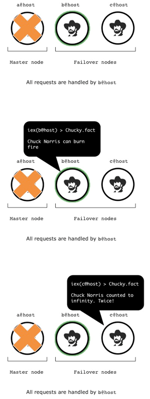

# 9 分布式和容错性

本章内容包括：

- 实现分布式和容错性应用程序
- Cookies和安全
- 在局域网(LAN)中连接节点

在上一章中，我们了解了Elixir中分布式的基础知识。特别是，我们现在知道如何建立一个集群。我们还研究了*任务（Tasks）*，这是一种抽象，它可以让我们轻松编写短暂的计算。

接下来我们要探索的概念是分布式环境下的容错性。为此，我们将构建一个应用程序，演示当一个节点宕机时，如何由另一个节点自动接管其工作。更进一步，该应用程序还将演示当一个优先级更高的之前宕机的节点重新加入集群时，如何让当前的节点让出控制权。换句话说，我们将构建一个展示分布式Elixir的*故障转移（failover）*和*接管（takeover）*能力的应用程序。

9.1 分布式容错性

故障转移发生在运行应用程序的节点宕机时，该应用程序会在另一个节点上自动重启，给定一定的超时期限。接管发生在一个节点的优先级（在列表中定义）高于当前运行节点时，导致优先级较低的节点停止，并在优先级更高的节点上重启应用程序。在编程中，至少当你看到故障转移和接管实际发生时，它们非常酷。

Chucky Chuck Norris 事实应用程序概述

我们要构建的应用程序将会故意保持简单，因为主要目标是学习如何将您的OTP应用程序连接起来，使其具有容错性，使用故障转移和接管。我们将构建*Chucky*，一个分布式且具有容错性的Chuck Norris“事实”应用程序。这是Chucky的一个示例运行：

`iex(1)> Chucky.fact`
`"Chuck Norris的键盘没有Ctrl键，因为没有什么能控制Chuck Norris。"`

`iex(2)> Chucky.fact`
`"Chuck Norris声明的所有数组都是无限大小的，因为Chuck Norris不受限制。"`
9.2 构建Chucky

Chucky是一个简单的OTP应用程序。应用程序的核心在于一个GenServer。我们将首先构建它，然后实现Application行为。最后，我们将亲自看到如何将所有内容连接起来，以利用故障转移和接管。

9.2.1 实现服务器

您知道该怎么做：

`% mix new chucky`
接下来，创建
`lib/server.ex`：


清单 9.1 实现主Chucky服务器（lib/server.ex）

`defmodule Chucky.Server do`
`use GenServer`

`#######`
`# API #`
`#######`

`def start_link do`
`GenServer.start_link(__MODULE__, [], [name: {:global, __MODULE__}]) #1`
`end`

`def fact do`
`GenServer.call({:global, __MODULE__}, :fact)                        #2`
`end`

`#############`
`# Callbacks #`
`#############`

`def init([]) do`
`:random.seed(:os.timestamp)`
`facts = "facts.txt"`
`|> File.read!`
`|> String.split("\n")`

`{:ok, facts}`
`end`

`def handle_call(:fact, _from, facts) do`
`random_fact = facts`
`|> Enum.shuffle`
`|> List.first`

`{:reply, random_fact, facts}`
`end`
`end`
#1 在集群内全局注册GenServer

#2 对全局注册的GenServer进行调用（和casts）需要额外的 :global

这里的大部分代码应该不难理解，尽管在
`

Chucky.Server.start_link/0`
和
`Chucky.Server.fact/1`
中使用的
`:global`
是新的。在
`Chucky.Server.start_link/0`，我们使用
`{:global, __MODULE__}`注册了模块的名称。这样做的效果是将
`Chucky.Server`
注册到
`global_name_server`
进程上。每次节点启动时，都会启动此进程。这意味着没有单个“特殊”的节点来跟踪名称表。相反，每个节点都将有名称表的副本。

由于我们已经全局注册了此模块，调用（和casts）也必须以
`:global`为前缀。因此，我们不是写

`def fact do`
`GenServer.call(__MODULE__, :fact)``end`
我们这样做：

`def fact do`
`GenServer.call({:global, __MODULE__}, :fact)``end`
`init/1`
回调读取一个名为
`facts.txt`的文件，基于换行符将其分割，并将
`Chucky.Server`
的状态初始化为“事实”的列表。将
`facts.txt`
存储在项目根目录中。您可以从项目的GitHub仓库获取文件副本。

`handle_call/3`
回调简单地从其状态（“事实”的列表）中随机选择一个条目，并返回它。

9.2.2 实现应用程序行为

接下来，我们将实现作为应用程序入口点的应用程序行为。此外，我们可以从
`Chucky.start/2`中创建一个显式的监督器。这是通过导入
`Supervisor.Spec`
来完成的，它暴露了
`worker/2`
函数（创建子规范），我们可以将其传递给
`Supervisor.start_link`
函数，以结束
`start/2`。创建
`lib/chucky.ex`：


清单 9.2 实现应用程序行为（lib/chucky.ex）
```elixir
defmodule Chucky do
use Application
require Logger

def start(type, _args) do
import Supervisor.Spec
children = [
worker(Chucky.Server, [])
]

case type do
:normal ->
Logger.info("Application is started on #{node}")

{:takeover, old_node} ->
Logger.info("#{node} is taking over #{old_node}")

{:failover, old_node} ->
Logger.info("#{old_node} is failing over to #{node}")
end

opts = [strategy: :one_for_one, name: {:global, Chucky.Supervisor}]
Supervisor.start_link(children, opts)
end

def fact do
Chucky.Server.fact
end
end
```

这是一个简单的监督器，监督
`Chucky.Server`。就像
`Chucky.Server`一样，
`Chucky.Supervisor`
也是全局注册的，因此使用
`:global`注册。

9.2.3 应用类型参数

请注意，我们在此使用了 `start/2` 的 `type` 参数，这是我们通常会忽略的。对于非分布式应用程序，`type` 的值通常是 `:normal`。但当我们开始处理 takeover（接管）和 failover（故障转移）时，情况就变得有趣了。

如果您查阅 Erlang 文档中 `type` 参数所期望的数据类型，您将看到这样的内容：


这正是我们在上述代码中匹配的三种情况。当应用程序以分布式模式启动时，对于 `{:takeover, node}` 和 `{:failover, node}` 的模式匹配将成功。

不详细介绍（下一节将详述），当一个节点因为要接管另一个节点（因为它具有更高优先级）而启动时，`{:takeover, node}` 中的 `node` 就是被接管的节点。

类似地，当一个节点因为另一个节点死亡而启动时，`{:failover, node}` 中的 `node` 就是死亡的那个节点。到目前为止，我们还没有编写任何特定于故障转移或接管的代码。我们接下来将处理这个。

9.3 Chucky 中故障转移和接管概述

在进入具体细节之前，让我们谈谈集群的 *行为*。在这个例子中，我们将配置一个由三个节点组成的集群。为了方便参考，以及大多是因为作者缺乏想象力，我们将节点命名为 `a@<host>`、`b@<host>` 和 `c@<host>`，其中 `<host>` 是您的主机名。本节剩余部分，我将仅用 `a`、`b` 和 `c` 来指代所有节点。

节点 `a` 将是主节点，而 `b` 和 `c` 将是从节点。在接下来的图表中，带有绿色环的节点是主节点。其余的是从节点。

节点启动的 *顺序* 很重要。在这种情况下，`a` 首先启动，其次是 `b` 和 `c`。当所有节点都启动后，集群就完全初始化了。换句话说，只有 `a`、`b` 和 `c` 初始化后，集群才会变得可用。

所有三个节点都已编译 Chucky（这是一个重要的细节）。然而，当集群启动时，只有 *一个* 应用程序启动，它在主节点上启动（惊喜！）。这意味着，虽然请求可以从集群中的任何节点发出，但只有主节点会回应该请求：


图 9.1 所有请求都由 a@host 处理，无论哪个节点接收到请求

现在让情况变得有趣。当 `a` 失败时，其余节点将在一段时间后检测到 `a` 已失败。然后它将在其中一个从节点上启动应用程序。在这种情况下，是 `b`：


图 9.2 假设 a@host 失败。在 5 秒内，一个故障转移节点将接管（见下图）



图 9.3 b@host 在检

测到 a@host 失败后自动接管

如果 `b` 失败了呢？那么 `c` 就是下一个启动应用程序的节点。到目前为止，我们介绍的都是故障转移情况。

现在，考虑一些更有趣的事情。当 `a` 重启时会发生什么？由于 `a` 是主节点，它在其余节点中具有 *最高优先级*。因此，它将发起 *接管*：


图 9.4 一旦 a@host 回来，它将发起接管

无论哪个从节点正在运行应用程序，它都将退出，并将控制权让给主节点。这有多棒？现在，我们可以看到如何在 Chucky 中实现故障转移和接管策略。

### 9.3.1        故障转移和接管配置

在本节中，我们将看到为您的分布式应用程序配置故障转移和接管所需的步骤。

步骤1：确定机器的主机名

第一步是找出您要使用的机器的主机名。例如，在我的Mac OSX上：

`% hostname –s`
`manticore`
步骤2：为每个节点创建配置文件

第二步是为每个节点创建配置文件。为了简单起见，在
`config`
目录中创建这三个文件：

`·`
`a.config`

`·`
`b.config`

`·`
`c.config`

注意它们被命名为
`<节点名称>.config`。虽然您可以自由命名任何文件名，但我建议您坚持使用此约定，因为每个文件将包含节点特定的配置细节。

步骤3：填写每个节点的配置文件

每个节点的配置文件结构看起来有点复杂，但我们稍后会更仔细地检查一下。现在，在
`config/a.config`中输入这个：

列表9.3 a@host的配置 (config/a.config)

`[{kernel,`
`[{distributed, [{chucky, 5000, [a@manticore, {b@manticore, c@manticore}]}]},`
`{sync_nodes_mandatory, [b@manticore, c@manticore]},`
`{sync_nodes_timeout, 30000}``]}].`
这代表配置单个节点的故障转移/接管所需的配置。让我们分解一下。我们从最复杂的部分开始，
`distributed`
配置参数：

`[{distributed, [{chucky, 5000, [a@manticore, {b@manticore, c@manticore}]}]}]`
`chucky`
当然是应用程序名称。
`5000`
代表节点被认为宕机之前的超时毫秒数，应用程序在下一个最高优先级的节点中重启。

`[a@manticore, {b@manticore, c@manticore}]`
列出了优先级顺序的节点。在这个例子中，
`a`
是首位，其次是
`b`
或
`c`。在元组中定义的节点之间没有优先级。例如，考虑以下条目：

`[a@manticore, {b@manticore, c@manticore}, d@manticore]`
在这种情况下，最高优先级是
`a`，然后是
`b/c`，接着是
`d`。

·     
`sync_nodes_mandatory`：*必须*在
`sync_nodes_timeout`
指定的时间内启动的节点列表

·     
`sync_nodes_optional`：*可以*在
`sync_nodes_timeout`
指定的时间内启动的节点列表。（注意，我们没有在这个应用程序中使用此选项）

·     
`sync_nodes_timeout`：等待其他节点启动的时间（以毫秒为单位）

`sync_nodes_mandatory`
和
`sync_nodes_optional`
的区别是什么？顾名思义，正在启动的节点将在
`sync_nodes_timeout`
设置的超时限制内等待所有
`sync_nodes_mandatory`
中的节点启动。如果有一个未能启动，则节点会终止自身。对于
`sync_nodes_optional`
则不是那么严格。节点只是等待直到超时过去，并且如果任何节点没有启动，*不会*自我终止。

配置从节点

对于剩下的节点，配置*几乎*相同，除了
`sync_nodes_mandatory`
条目。事实上，保持其余配置不变是*非常*重要的。例如，有不一致的
`sync_nodes_timeout`
值会导致群集的不确定行为。

这是
`b`的配置：

列表9.4 b@host的配置 (config/b.config)

`[{kernel,`
`[{distributed,`
`[{chucky,`
`5000,`
`[a@manticore, {b@m

anticore, c@manticore}]}]},`
`{sync_nodes_mandatory, [a@manticore, c@manticore]},`
`{sync_nodes_timeout, 30000}``]}].`
这是
`c`的配置：

列表9.5 c@host的配置 (config/c.config)

`[{kernel,`
`[{distributed,`
`[{chucky,`
`5000,`
`[a@manticore, {b@manticore, c@manticore}]}]},`
`{sync_nodes_mandatory, [a@manticore, b@manticore]},`
`{sync_nodes_timeout, 30000}``]}].`
步骤4：在所有节点上编译Chucky

应用程序应该在其所在的机器上编译。
`Chucky`
的编译非常简单：

`% mix compile`
再次提醒，在*每台机器*上都要这样做。

步骤5：启动分布式应用程序

打开三个不同的终端。在每个终端上，运行这些命令：

对于`a`：

`% iex --sname a -pa _build/dev/lib/chucky/ebin --app chucky --erl "-config config/a.config"`
接下来，对于`b`：

`% iex --sname b -pa _build/dev/lib/chucky/ebin --app chucky --erl "-config config/b.config"`
最后，对于`c`：

`% iex --sname c -pa _build/dev/lib/chucky/ebin --app chucky --erl "-config config/c.config"`
上述咒语虽然有点神秘，但仍可解释：
 
- `--sname <name>`：启动一个分布式节点，并为其分配*短名称*。 
- `-pa <path>`：将给定路径*前置*到Erlang代码路径。这个路径指向从Chucky运行
- `mix compile`后生成的BEAM文件。（*附加*版本是`-pz`。）  
- `--app <application>`：启动应用程序及其依赖项。
- `--erl <switches>`：传递给Erlang的开关。在我们的示例中，
- `-config config/c.config`用于配置OTP应用程序。

9.4 故障转移和接管实战

经过这么多努力，让我们看看实际效果吧！你会注意到，当你启动 `a`（甚至 `b`）时，直到启动 `c` 才会发生事情。在每个终端中运行 `Chucky.fact`：

清单 9.6 Chucky 可以从集群中的任何节点访问

```
23:10:54.465 [info]  Application is started on a@manticore
iex(a@manticore)1> Chucky.fact
"Chuck Norris doesn't read, he just stares the book down until it tells him what he wants."

iex(b@manticore)1> Chucky.fact
"Chuck Norris can use his fist as his SSH key. His foot is his GPG key."

iex(c@manticore)1> Chucky.fact
"Chuck Norris never wet his bed as a child. The bed wet itself out of fear."
```

虽然 *看起来* 应用程序在每个单独的节点上运行，我们可以轻松地说服自己这不是这种情况。注意在第一个终端，消息 `Application is started on a@manticore` 在 `a` 上打印出来，但在其他节点上没有。

还有另一种方法可以告诉我们当前节点上运行了哪些应用程序。使用 `Application.started_applications/1`，我们可以清楚地看到 `Chucky` 在 `a` 上运行：

清单 9.7 Application.started_applications/0 显示 a@host 上的 Chucky

```
iex(a@manticore)1> Application.started_applications
[{:chucky, 'chucky', '0.0.1'}, {:logger, 'logger', '1.1.1'},
 {:iex, 'iex', '1.1.1'}, {:elixir, 'elixir', '1.1.1'},
 {:compiler, 'ERTS CXC 138 10', '6.0.1'}, {:stdlib, 'ERTS CXC 138 10', '2.6'}, {:kernel, 'ERTS CXC 138 10', '4.1'}]
```

然而，`Chucky` *没有* 在 `b` 和 `c` 上运行。这里只显示了 `b` 的输出，因为两个节点的输出是相同的：

清单 9.8 Chucky 没有在 b@host 和 c@host（未显示）上运行

```
iex(b@manticore)1> Application.started_applications
[{:logger, 'logger', '1.1.1'}, {:iex, 'iex', '1.1.1'},
 {:elixir, 'elixir', '1.1.1'}, {:compiler, 'ERTS CXC 138 10', '6.0.1'}, {:stdlib, 'ERTS CXC 138 10', '2.6'}, {:kernel, 'ERTS CXC 138 10', '4.1'}]
```

现在，让我们通过退出 `iex`（按两次 Ctrl + C）来终止 `a`。大约5秒钟后，你会注意到 `Chucky` 现在已经自动在 `b` 上启动了：

清单 9.9 当 a@host 停止后，b@host 接管

```
iex(b@manticore)1>
23:16:42.161 [info]  Application is started on b@manticore
```

这是多么棒的事情！集群中的剩余节点判定 `a` 不可达并假定其已死亡。因此，`b` 承担了运行 `Chucky` 的责任。如果你现在在 `b` 上运行 `Application.started_applications/1`，你会看到类似的内容：

清单 9.10 重新运行 Application.started_applications/0 现在显示 b@host 上的 Chucky

```
iex(b@manticore)2> Application.started_applications
[{:chucky, 'chucky', '0.0.1'}, {:logger, 'logger', '1.1.1'},
 {:iex, 'iex', '1.1.1'}, {:

elixir, 'elixir', '1.1.1'},
 {:compiler, 'ERTS CXC 138 10', '6.0.1'}, {:stdlib, 'ERTS CXC 138 10', '2.6'}, {:kernel, 'ERTS CXC 138 10', '4.1'}]
```

在 `c` 上，你可以确信 `Chucky` 仍在运行：

清单 9.11 通常情况下，仍然可以从 c@host 访问 Chucky

```
iex(c@manticore)1> Chucky.fact
"The Bermuda Triangle used to be the Bermuda Square, until Chuck Norris Roundhouse kicked one of the corners off."
```

现在，让我们看看接管实战。当 `a` 重新加入集群时会发生什么？由于 `a` 是集群中优先级最高的节点，`b` 将让位给 `a`。换句话说，`a` 将接管 `b`。再次启动 `a`：

```
% iex --sname a -pa _build/dev/lib/chucky/ebin --app chucky --erl "-config config/a.config"
```

在 `a` 中，你会看到类似的内容：

```
23:23:36.695 [info]  a@manticore is taking over b@manticore
iex(a@manticore)1>
```

在 `b` 中，你会注意到应用程序已停止：

清单 9.12 当 a@host 重新启动并重新加入集群时，b@host 让位

```
iex(b@manticore)3>
23:23:36.707 [info]  Application chucky exited: :stopped
```

当然，`b` 仍然可以提供一些 Chuck Norris 的事实：

```
iex(b@manticore)4> Chucky.fact
"It takes Chuck Norris 20 minutes to watch 60 Minutes."
```

就这样！我们已经看到了一整个故障转移和接管周期。在下一节中，我们将看看如何连接同一本地区域网络中的节点。

9.5 连接局域网中的节点，Cookie 和安全性

安全性在 Erlang 设计师思考分布式时并不是一个重要考虑因素。原因是节点将在他们自己的内部/可信网络中使用。因此，事情被保持得相当简单。

为了让两个节点通信，他们需要做的就是共享一个 *cookie*。这个 cookie 是一个通常存储在你的主目录中的纯文本文件：

```bash
% cat ~/.erlang.cookie
XLVCOLWHHRIXHRRJXVCN
```

当你在同一台机器上启动节点时，你不必担心 cookie，因为所有节点在你的主目录中共享同一个 cookie。然而，一旦你开始连接到其他机器，你将不得不确保这些 cookie 都是相同的。不过，还有另一种选择。你也可以显式地调用 `Node.set_cookie/2`。在本节中，我们将看到如何连接到不在同一台机器上，但在同一局域网络中的节点。

9.5.1 查询两台机器的IP地址

首先，我们需要找出两台机器的IP地址。在Linux/Unix系统上，通常使用`ifconfig`命令。同时，请确保它们都连接到同一个局域网（LAN）。这可能意味着将机器插入同一个路由器/交换机，或者让机器连接到同一个无线接入点。下面是我在其中一台机器上的样例输出：

清单 9.13 我的机器上的ifconfig输出

```bash
% ifconfig
lo0: flags=8049<UP,LOOPBACK,RUNNING,MULTICAST> mtu 16384
options=3<RXCSUM,TXCSUM>
inet6 ::1 prefixlen 128
inet 127.0.0.1 netmask 0xff000000
inet6 fe80::1%lo0 prefixlen 64 scopeid 0x1
nd6 options=1<PERFORMNUD>
gif0: flags=8010<POINTOPOINT,MULTICAST> mtu 1280
stf0: flags=0<> mtu 1280
en0: flags=8863<UP,BROADCAST,SMART,RUNNING,SIMPLEX,MULTICAST> mtu 1500
ether 10:93:e9:05:19:da
inet6 fe80::1293:e9ff:fe05:19da%en0 prefixlen 64 scopeid 0x4
inet 192.168.0.100 netmask 0xffffff00 broadcast 192.168.0.255
nd6 options=1<PERFORMNUD>
media: autoselect status: active
```

你应该关注的数字是`192.168.0.100`。当我在另一台机器上执行相同步骤时，IP地址是`192.168.0.103`。请注意，我们在这里使用的是IPv4地址。如果你使用IPv6地址，你将需要在接下来的示例中使用IPv6地址。

9.5.2 将两个节点连接起来

让我们试试看。在第一台机器上，启动`iex`，但这次使用长名称（`--name`）标志。同时，在名称后附加`@<ip-address>`。

```elixir
% iex --name one@192.168.0.100
Erlang/OTP 18 [erts-7.1] [source] [64-bit] [smp:4:4] [async-threads:10] [hipe] [kernel-poll:false] [dtrace]

Interactive Elixir (0.13.1-dev) - press Ctrl+C to exit (type h() ENTER for help)iex(one@192.168.0.100)1>
```

在第二个节点上执行相同的步骤：

```elixir
% iex --name two@192.168.0.103
Erlang/OTP 18 [erts-7.1] [source] [64-bit] [smp:4:4] [async-threads:10] [hipe] [kernel-poll:false] [dtrace]

Interactive Elixir (1.1.1) - press Ctrl+C to exit (type h() ENTER for help)iex(two@192.168.0.103)1>
```

现在，让我们尝试将`one@192.168.0.100`和`two@192.168.0.103`连接起来：

```
iex(one@192.168.0.100)1> Node.connect :'two@192.168.0.103'
false
```

等等，为什么呢？在`two@192.168.0.103`上，你会看到一个类似的错误报告：

```elixir
=ERROR REPORT==== 25-May-2014::22:32:25 ===
** Connection attempt from disallowed node 'one@192.168.0.100' **
```

发生了什么？原来，我们缺少了一个关键成分——*cookie*。

9.5.3 记住Cookie！

当你在同一台机器上连接节点*并且*没有使用`--cookie`标志设置任何cookie时，Erlang VM只是使用存储在你的主目录中生成的cookie：

```bash
% cat ~/.erlang.cookie
XBYWEVWS

NBAROAXWPTZX%
```

这意味着，如果你在*同一*本地机器上*不使用* cookie标志连接节点，通常不会遇到任何问题。

然而，在不同的机器上，这就是一个问题。这是因为各个机器上的cookies很可能不同。考虑到这一点，让我们重新开始整个过程。这次，我们为每个节点提供相同的cookie值。或者，你也可以将相同的`.~/.erlang-cookie`复制到所有节点上。在本节中，我们使用前一种技术。在第一台机器上：

```elixir
% iex --name one@192.168.0.100 --cookie monster
Erlang/OTP 18 [erts-7.1] [source] [64-bit] [smp:4:4] [async-threads:10] [hipe] [kernel-poll:false] [dtrace]

Interactive Elixir (1.1.1) - press Ctrl+C to exit (type h() ENTER for help)iex(one@192.168.0.100)1>
```

在第二台机器上，我们确保使用*相同*的cookie值：

```elixir
% iex --name two@192.168.0.103 --cookie monster
Erlang/OTP 18 [erts-7.1] [source] [64-bit] [smp:4:4] [async-threads:10] [hipe] [kernel-poll:false] [dtrace]

Interactive Elixir (1.1.1) - press Ctrl+C to exit (type h() ENTER for help)iex(two@192.168.0.103)1>
```

让我们再次尝试将`one@192.168.0.100`连接到`two@192.168.0.103`：

```elixir
iex(one@192.168.0.100)1> Node.connect :'two@192.168.0.103'
true
```

太好了！我们已经成功地在局域网上建立了一个Elixir集群。作为一个健康检查，我们也可以做一个`Node.list/0`。回想一下，这个函数只列出它的邻居，因此不包括当前节点：

```elixir
iex(one@192.168.0.100)2> Node.list
[:"two@192.168.0.103"]
```

9.6 总结

在一个预期能够承受崩溃的应用程序中实现正确的故障转移（Failover）和接管（Takeover）是绝对必要的。与许多语言和平台不同，故障转移和接管在 OTP 中是内置的。在这一章中，我们继续探索分布式系统。特别地，我们覆盖了：

- 实现一个展示故障转移和接管的分布式应用程序
- 配置故障转移和接管
- 将节点连接到局域网（LAN）
- 使用 Cookie
- 一些关于 Chuck Norris 的笑话

在接下来的章节和之后的章节中，我们将探讨在 Elixir 中的测试。我们不仅仅覆盖单元测试，还将探索基于属性的测试，并学习如何测试并发程序。