[]{#titlepage.xhtml}

<div>

```{=html}
<svg xmlns="http://www.w3.org/2000/svg" xmlns:xlink="http://www.w3.org/1999/xlink" version="1.1" width="100%" height="100%" viewbox="0 0 1105 1391" preserveaspectratio="xMidYMid meet">
```
`<image width="1105" height="1391" xlink:href="cover.jpeg">`{=html}`</image>`{=html}
```{=html}
</svg>
```

</div>

[]{#Copyright.html}

::: wordsection
[ ]{.sgc}

{.calibre1}\

[ ]{.sgc}

[MEAP Edition]{.sgc}

[Manning Early Access Program]{.sgc}

[The Little Elixir & OTP Guidebook]{.sgc}

[Version 10]{.sgc}

[ ]{.sgc}

[ ]{.sgc}

[ ]{.sgc}

[ ]{.sgc}[ ]{.sgc1}

[ ]{.sgc}[ ]{.sgc1}

[ ]{.sgc}

# [Copyright 2016 Manning Publications]{.sgc} {#Copyright.html#heading_id_2 .copyright}

[©Manning Publications Co. We welcome reader comments about anything in
the manuscript - other than typos and other simple mistakes. These will
be cleaned up during production of the book by copyeditors and
proofreaders. ]{.sgc2}

[`<!--StartFragment-->`{=html}[[https://forums.manning.com/forums/the-little-elixir-and-otp-guidebook](https://forums.manning.com/forums/the-little-elixir-and-otp-guidebook){.pcalibre1
.pcalibre2 .pcalibre}]{.sgc4}\
]{.sgc3}

[\
]{.sgc5}

[\
]{.sgc2}

[\
]{.sgc6}

\

::: calibre2
\
:::

[\
]{.sgc7}

[\
]{.sgc7}

[ ]{.sgc8}

::: sgc9
[For more information on this and other Manning titles go to]{.sgc1}\
:::

::: sgc9
[[www.manning.com](http://www.manning.com/){.pcalibre1 .pcalibre2
.pcalibre}\
]{.sgc}
:::
:::

[]{#Welcome.html}

::: wordsection
# welcome {#Welcome.html#heading_id_2 .cochapternumber}
:::

Thank you for purchasing the MEAP for *The Little Elixir and OTP
Guidebook*! By the time you read this, I\'m probably still high-fiving
my wife for getting the book to this stage.

To fully enjoy this intermediate-level book, I assume you are a smart
person, and that you already have some programming experience
(preferably web development) under your belt. Fortunately, you don\'t
have to know Elixir and/or Erlang, although having the documentation
close by would be helpful.

Elixir is a new functional programming language built on the legendary
Erlang VM. OTP is a battle-tested framework (the source of Erlang's
greatness) that enables you to build fault-tolerant and scalable
applications.

What does that mean for you? It means that I get to show you some
awesome things that you can build with Elixir and the OTP framework. I
have strived to make this book as approachable and more importantly, as
interesting as possible.

Among other fun examples, you will learn to write concurrent programs,
see how easy it is to wire up your application to make it fault-tolerant
and build web applications with real-time connectivity capabilities.

As you're reading, I hope you'll take advantage of the Author Online
forum. I'll be reading your comments and responding, and your feedback
is helpful in the development process.

Once again, thank you for taking a chance on this first-time author.
I\'m sure you will have fun with this book!

 

--- Benjamin Tan Wei Hao

[]{#TOC.html}

::: wordsection
::: calibre6
# [brief contents]{.pcalibre} {#TOC.html#heading_id_2 .cochapternumber}
:::

[About This Book](../Text/about_this_book.html)

[[Part 1: Getting Started with Elixir &
OTP](../Text/Part_1.html){.pcalibre}]{.calibre7}

  1   [Introduction](../Text/ch01.html)

  2   [A Whirlwind Tour](../Text/ch02.html)

  3   [Processes 101](../Text/ch03.html)

  4   [Writing Server Applications with GenServer](../Text/ch04.html)

[[Part 2: Fault Tolerance, Supervision and
Distribution](../Text/Part_2.html){.pcalibre}]{.calibre7}

  5   [Concurrent Error Handling and Fault Tolerance with Links,
Monitors, and Processes](../Text/ch05.html)

  6   [Fault-tolerance with Supervisors](../Text/ch06.html)

  7   [Completing the Worker Pool Application](../Text/ch07.html)

  8   [Distribution and Load Balancing](../Text/ch08.html)

  9   [Distribution and Fault Tolerance](../Text/ch09.html)

[[Part 3: Type Specifications and
Testing](../Text/Part_3.html){.pcalibre}]{.calibre7}

10   [Dialyzer and Type Specifications](../Text/ch10.html)

11   [Property-based and concurrency testing](../Text/ch11.html)

 

[Appendix A: Installing Erlang & Elixir](../Text/App_A.html)
:::

[]{#preface.html}

::: wordsection
# Preface {#preface.html#heading_id_2 .cochapternumber}

When I came up with the books\' title, I thought it was pretty smart.
Having the words \"Little\" and \"Guidebook\" hinted that the reader
could expect a relatively thin volume. This meant that wouldn\'t be
committed to come up with a lot of content. That was just as well, since
Elixir was a very new language and there wasn\'t much of a community to
speak of. It was 2014 and Elixir was as at version 0.13 and Phoenix was
still a web socket library.

Two years and three hundred pages later much have changed. The language
has experienced many changes and the community has grown. The excitement
over Elixir is undoubtable, judging by the number of blog posts and
tweets. Companies are also starting to discover and fall in love with
Elixir. There is even renewed interest in Erlang, an absolutely
wonderful phenomenon if you ask me!

This book is my humble attempt to spread the word. I learn best by
examples, and I assume it\'s the same case for you. I\'ve tried my best
to keep the examples interesting, relatable, but most importantly,
illuminating and useful.

Having spent more than two years writing this book, I am more than
thrilled to finally get the book into your hands. I hope this book can
bring you the same joy I experience when programming in Elixir. What are
you waiting for?
:::

[]{#about_this_book.html}

::: wordsection
# About This Book {#about_this_book.html#heading_id_2 .cochapternumber}

Ohai, welcome! Elixir is a functional programming language built on the
Erlang virtual machine. It combines the productivity and expressivity of
Ruby with the concurrency and fault-tolerance of Erlang. Elixir makes
full use of Erlang\'s powerful OTP library, which many developers
consider the source of Erlang\'s greatness, so you can have mature,
professional-quality functionality right out of the gate. Elixir\'s
support for functional programming makes it a great choice for highly
distributed event-driven applications like IoT systems.

This book respects your time and is designed to get you up to speed with
Elixir and OTP with minimum fuss. However, it expects that you put in
the required amount of work to grasp all the various concepts.
Therefore, this book works best when you can try out the examples and
experiment. If you ever get stuck, don't fret -- the Elixir community is
a very welcoming one!

[How the book is
organized]{#about_this_book.html#how-the-book-is-organized .pcalibre1
.pcalibre2 .pcalibre}

This book has three parts, eleven chapters, and an appendix. Part 1
covers the fundamentals of Elixir and OTP.

Chapter 1 introduces Elixir, how it is different from its parent
language, Erlang, compares Elixir with other languages, and use cases
for Elixir and OTP.

Chapter 2 takes you on an Elixir whirlwind tour. You will write your
first Elixir program, and get acquainted with language fundamentals.

Chapter 3 presents processes, the Elixir unit of concurrency. You will
learn about the Actor concurrency model and how to use processes to send
and receive messages. You will then put together an example program to
see concurrent processes in action.

Chapter 4 introduces OTP, one of Elixir's killer features inherited from
Erlang. You will learn the philosophy behind OTP, and some of the most
important parts of OTP that you will use as an Elixir programmer. You
will understand how OTP behaviours work, and get to build your first
Elixir/OTP application -- a weather program that talks to a third-party
service -- using the GenServer behavior.

Part 2 covers the fault-tolerant and distribution aspects of Elixir and
OTP. Chapter 5 looks at the primitives available to handle errors,
especially in a concurrent setting. You will learn the unique approach
that the Erlang VM takes with respect to processes crashing. You will
also get to experience building your own supervisor process (that
resembles the Supervisor OTP behavior), before you get to use the real
thing.

Chapter 6 is all about the Supervisor OTP behavior and fault-tolerance.
You will learn about Erlang\'s \"Let it Crash\" philosophy. This chapter
introduces the worker pool application that uses the skills built up
over the previous chapters.

Chapter 7 continues with the worker pool where we add more features to
make it a more full-featured and realistic worker pool application. In
the process, you will learn how to build non-trivial supervisor
hierarchies and also learn how to dynamically create supervisor and
worker processes.

Chapter 8 examines distribution and how it helps in load balancing. It
walks you through building a distributed load balancer. Along the way,
you'll learn how to build a command line program in Elixir.

Chapter 9 continues with distribution, but this time, we look at
failovers and takeovers. This is absolutely critical in any non-trivial
application that has to be resilient to faults. You will build a Chuck
Norris jokes service that is both fault-tolerant and distributed.

Part 3 covers type specifications, property-based testing and
concurrency testing in Elixir. We will look at three tools, namely,
Dialyzer, QuickCheck and Concuerror and look at examples at which these
tools help us write better and more reliable Elixir code.

The appendix provides instructions to set up Erlang and Elixir on your
machine.

[Who should read this
book]{#about_this_book.html#who-should-read-this-book .pcalibre1
.pcalibre2 .pcalibre}

You do not have a lot of time on your hands. You want to see what the
fuss is all about with Elixir, and want to get your hands on the good
stuff as soon as possible.

I assume you know your way around a terminal and have some programming
experience.

While having prior knowledge in Elixir and Erlang would certainly be
helpful, it is by no means mandatory. However, this book is not meant to
serve as a reference for Elixir. You should know how to look up
documentation on your own.

You are also not averse to change. Elixir moves pretty fast. But then
again, you are reading this book, so I assume that this isn't a problem
for you.[]{#about_this_book.html#how-to-read-this-book .pcalibre1
.pcalibre2}

How to read this book

Front to back. This book progresses linearly, and while the earlier
chapters are more or less self-contained; the later chapters build upon
the previous ones. Some of the chapters might require re-reading, so
don't think that you should understand all the concepts on the first
reading.

My favorite kind of programming books those that encourage you to try
out the code. The concepts always seem to sink in better that way. In
this book, I strive to achieve the same. Nothing beats hand-on
experience. There are exercises at the end of some of the chapters. **Do
them!** This book is most useful with a clear head, an opened terminal,
and a desire to learn something incredibly fun and worthwhile.

Getting the example code

This code is full of examples. The latest code for the book is hosted at
the GitHub repository:
https://github.com/benjamintanweihao/the-little-elixir-otp-guidebook-code.

About the author

Benjamin Tan Wei Hao is a software engineer at Pivotal Labs, Singapore.
Deathly afraid of being irrelevant, he is always trying to catch up on
his ever-growing reading list. He enjoys going to Ruby conferences and
talking about Elixir.

He is also the author of a self-published book, The Ruby Closures Book,
on LeanPub. He also writes for the Ruby column of SitePoint, and tries
to sneak in an Elixir article now and then. In his copious free time, he
blogs at benjamintan.io.
:::

[]{#acknowledgements.html}

::: wordsection
# Acknowledgements {#acknowledgements.html#heading_id_2 .cochapternumber}

I wouldn\'t have anything to write about without José Valim and all the
hard-working developers involved in creating Elixir and building its
ecosystem.

Without the hard work of Joe Armstrong, Robert Virding, Mike Williams,
and all the brilliant people who had a part in creating Erlang and OTP,
there would be no Elixir.

I originally intended to self-publish this book back in 2013. During the
writing process, I needed reviewers to keep me honest. I reached out to
the (very young) Elixir community, and also to other developers via the
book mailing list, fully expecting a dismal response.

The response was incredible. So to Chris Bailey, J David Eisenberg, Jeff
Smith, Johnny Winn, Julien Blanchard, Kristian Rasmussen, Low Kian
Seong, Marcello Seri, Markus Mais, Matthew Margolis, Michael Simpson,
Norberto Ortigoza, Paulo Alves Pereira, Solomon White, Takayuki
Matsubara and Tallak Tveide, a big \"thank you\" for taking the time and
energy.

Thanks to Michael Stephens and Marjan Bace for giving me the opportunity
to write for Manning. Michael probably has no idea how excited I was to
receive that first email. This book is so much better because of Karen
Miller, my tireless editor. She has been with me on this project since
day one. The rest of the Manning team has been an absolute pleasure to
work with.

To the wonderful people at Pivotal Labs whom I have the privilege to
work with everyday -- you all are a constant source of inspiration.

To the two biggest joys in my life, my long-suffering wife and neglected
daughter, thanks for putting up with me.

To my parents, thank you for everything.
:::

[]{#Part_1.html}

::: wordsection
# Part 1 Getting Started with Elixir & OTP {#Part_1.html#heading_id_2 .cochapternumber}

[We begin with the basics of Elixir. We will answer some existential
questions like why do we need Elixir and what is it good for. Then,
we\'ll dive straight into a series of examples that demonstrate the
various language features.]{.calibre9}

[We then look at processes, the fundamental unit of concurrency in
Elixir. We will see how processes in Elixir relate to the Actor
concurrency model. If you have struggled with concurrency coming from
other languages, Elixir will be a breath of fresh air.]{.calibre9}

[We\'ll conclude part one with an introduction to OTP, and learn about
the GenServer behaviour, the most basic and yet most important of all
the behaviours.]{.calibre9}
:::

[]{#ch01.html}

::: wordsection
# [1[     ]{.calibre11}]{.calibre10} Introduction {#ch01.html#heading_id_2 .cochapternumber}

This chapter covers:

[·[     ]{.calibre13}]{.calibre12} What Elixir is

[·[     ]{.calibre13}]{.calibre12} How Elixir is different from Erlang

[·[     ]{.calibre13}]{.calibre12} Why Elixir is a good choice over
other languages

[·[     ]{.calibre13}]{.calibre12} What Elixir/OTP is good for

[·[     ]{.calibre13}]{.calibre12} The road ahead

Just in case you bought this book for medicinal purposes -- I'm sorry,
wrong book. This book is about Elixir the programming language. No other
language (other than Ruby) has made me so excited and happy to work
with. Even after spending more than two years of my life writing about
Elixir, I still love programming in it.

There is something very special about being involved in a community that
is so young and lively. I do not think any language has had at least
*four* books written about it, a dedicated screencast series, and a
conference -- all before v1.0. I think we are really on to something
here. Before we get into Elixir, I want to talk about Erlang and its
legendary virtual machine, because Elixir is built on top of it.

Erlang is a programming language that excels in building soft real-time,
distributed and concurrent systems. Its original use case was to program
Ericsson's telephone switches. Telephone switches basically are machines
that connect calls between callers.

These switches had to be concurrent, reliable and scalable. It had to be
able to handle multiple calls at the same time. It also had to be
extremely reliable. No one expects her calls to be dropped halfway.
Additionally, a dropped call (either due to a software/hardware fault)
should not affect the rest of the calls on the switch. The switches had
to be massively scalable and work with a distributed network of
switches.

These *production* requirements shaped Erlang into what it is today.
These exact requirements are exactly the situation we have with
multi-core and web-scale.

As you will discover in the later chapters, the scheduler of the Erlang
Virtual Machine automatically distributes workloads across processors.
This means that you get a speedup *almost* for free if you run your
program on a machine with more processors. Almost, because you will need
to change your thinking in the way you approach writing programs in
Erlang and Elixir in order to reap the full benefits.

Writing distributed programs, that is, programs that are running on
different computers and are able to communicate with each other,
involves very little ceremony.

It's time to introduce Elixir. Elixir describes itself as *a functional,
meta-programming aware language built on top of the Erlang Virtual
Machine.* Let's take this definition apart piece by piece.

Elixir is a *functional* programming language. This means that it has
all the usual features you might expect such as immutable state,
higher-order functions, lazy evaluation and pattern matching. We will
meet all of these features and more in the later chapters.

Elixir is also a very meta-programmable language. Meta-programming can
be described as code that generates code (Or, black magic). This is
possible because code can be represented in data, and data can be
represented as code. These facilities enable the programmer to add new
constructs to the language (among other things) that other languages
find difficult, or even downright impossible to do.

This book is also about OTP, a framework to build fault tolerant,
scalable, and distributed applications. Unlike most frameworks, OTP
comes packaged with quite a lot of good stuff. OTP comes with *three*
kinds databases, a set of debugging tools, profilers, a test framework
and a whole lot more. While we manage only to play with a tiny subset,
this book will give you a taste of the pure awesomeness of OTP.

It is important to realize that Elixir essentially gains OTP for free,
because OTP comes as part of the Erlang distribution. In case you are
wondering what OTP stands for, the short answer is it used to be called
**Open Telecom Platform**, which hints of Erlang's telecom heritage. It
also once again demonstrates how naming is a hard problem in computer
science. This is because OTP is a general-purpose framework, and has
little to do with telecom. Nowadays, OTP is just plain OTP, just like
how IBM just means IBM.  

1.1[          ]{.calibre14} How is Elixir different from Erlang

Before we talk about how Elixir is different from Erlang, let\'s talk
about their *similarities* first. Both Elixir and Erlang compile down to
the same byte-code. This means that both Elixir and Erlang programs,
when compiled, emit instructions that run on the same virtual machine.

Another wonderful feature of Elixir is that you can call Erlang code
directly from Elixir, and vice versa! If, for example, you find that
Elixir lacks a certain functionality that is present in Erlang, you can
call the Erlang library function directly from your Elixir code.

Elixir follows most of Erlang\'s semantics such as message passing. Most
Erlang programmers would feel right at home with Elixir.

This interoperability also means that the wealth of Erlang third-party
libraries are at the disposal of the Elixir developer (that\'s you!). So
why would you want to use Elixir instead of Erlang? There are at least
two reasons -- The tooling and ecosystem.

[]{#ch01.html#syntax .pcalibre2}[]{#ch01.html#tooling
.pcalibre2}1.1.1[       ]{.calibre13} Tooling

Out of the box, Elixir comes with a few handy tools built in:

[]{#ch01.html#interactive-elixir .pcalibre2}Interactive Elixir

The Interactive Elixir shell, or `iex`{.codeintext} for short, is a REPL
(read-eval-print-loop) that is similar to Ruby\'s `irb`{.codeintext}. It
comes with some pretty nifty features, such as syntax highlighting and a
beautiful documentation system, as shown in Figure 1.1.

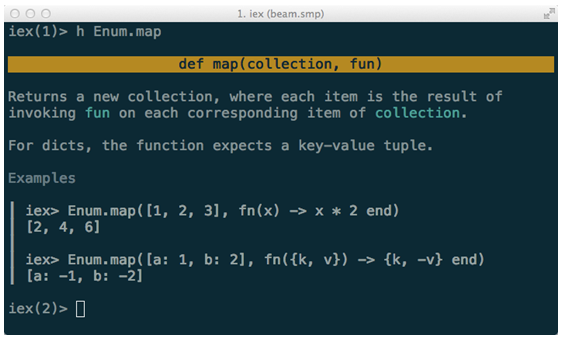{.calibre1}\

Figure 1.1 Interactive Elixir has documentation built-in

There is more to `iex!`{.codeintext} This tool allows you to connect to
*nodes*, which you can think of as separate Erlang runtimes that can
talk to each other. Each of this runtimes can live on the same computer,
same LAN or the same network.

`iex`{.codeintext} has another superpower inspired by the Ruby library
Pry. If you have used Pry before, you will know that it is a debugger
that allows you to pry into the state of your program.
`iex`{.codeintext} comes with a similarly named function called the same
function called `IEx.pry`{.codeintext}. We won't be using this feature
in the book, but this is an invaluable tool to be familiar with. Here's
a brief overview on how to use it. Let's assume I have code like this:

`require IEx`{.codebcxspfirst} ` `{.codebcxspmiddle}
`defmodule Greeter do`{.codebcxspmiddle}
`  def ohai(who, adjective) do`{.codebcxspmiddle}
`    greeting = "Ohai!, #{adjective} #{who}"`{.codebcxspmiddle}
**`    IEx.pry`{.codebcxspmiddle}**
`  end`{.codebcxspmiddle}`end`{.codebcxsplast}

The line where `IEx.pry`{.codeintext} will cause the interpreter to
pause, allowing me to inspect the variables that have been passed in.
First, I'll run the function:

`iex(1)> Greeter.ohai "leader", "glorious"`{.codebcxspfirst}
`Request to pry #PID<0.62.0> at ohai.ex:6`{.codebcxspmiddle}
` `{.codebcxspmiddle}
`      def ohai(who, adjective) do`{.codebcxspmiddle}
`        greeting = "Ohai!, #{adjective} #{who}"`{.codebcxspmiddle}
`        IEx.pry`{.codebcxspmiddle} `      end`{.codebcxspmiddle}
`    end`{.codebcxspmiddle} ` `{.codebcxspmiddle}
`Allow? [Yn] Y`{.codebcxspmiddle} ` `{.codebcxspmiddle}
[[`Once I answered yes, I get brought into`{.codebcxspmiddle}]{.calibre15}]{.bodychar}` `{.codebcxspmiddle}[`iex`{.codeintext}]{.calibre15}` `{.codebcxspmiddle}[[`where I can start inspecting the variables that were passed in:`{.codebcxspmiddle}]{.calibre15}]{.bodychar}
` `{.codebcxspmiddle}
`Interactive Elixir (1.2.4) - press Ctrl+C to exit (type h() ENTER for help)`{.codebcxspmiddle}
`pry(1)> who`{.codebcxspmiddle} `"leader"`{.codebcxspmiddle}
`pry(2)> adjective`{.codebcxspmiddle}`"glorious"`{.codebcxsplast}

There other nice features like *autocomplete* that you will find out in
the course of using `iex.`{.codeintext} Almost every release of Elixir
brings some nice improvements and additional helper functions to
`iex,`{.codeintext} so it's worth it to keep up with the changelog!
` `{.codeintext} []{#ch01.html#exunit .pcalibre2}

Testing with ExUnit

Testing aficionados will be pleased to know that there is a test
framework built in called ExUnit. ExUnit has some very nice features
such as being able to run *asynchronously* and also producing beautiful
failure messages, as show in figure 1.2. ExUnit is able to perform nifty
tricks with error reporting mainly due to *macros*, which we will not
cover in this book. Nonetheless, it is a fascinating topic to explore.

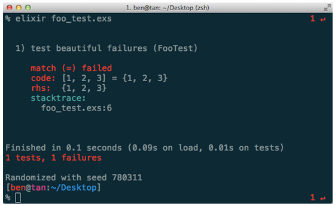{.calibre1}\

Figure 1.2 ExUnit comes with excellent error messages

[]{#ch01.html#mix .pcalibre2}Mix

Mix is a build tool used for creating, compiling, testing Elixir
projects. It is also used for managing dependencies, among other things.
Think of it like `rake`{.codeintext} in Ruby, and `lein`{.codeintext} in
Clojure. In fact, some of the first contributors to `mix`{.codeintext}
also wrote `lein`{.codeintext}. Projects such as the Phoenix web
framework have used Mix to great effect, such as building generators
that reduce writing needless boilerplate.

[]{#ch01.html#standard-library .pcalibre2}Standard Library

Elixir comes shipped with an excellent standard library. Data structures
such as ranges, strict and lazy enumeration APIs and a sane way to
manipulate strings are just some of the nice things that come packaged.

While Elixir might not be the best language to write scripts, there are
familiar sounding libraries such as `Path`{.codeintext} and
`File`{.codeintext}. The documentation is also a joy to use.
Explanations are clear and concise, with examples on how to use the
various libraries and its functions.

Elixir has modules that are *not* in the standard Erlang library. My
favorite of these is `Stream`{.codeintext}. Streams are basically
composable, lazy enumerables. They are often used to model potentially
infinite streams of value.

Elixir has also added functionality to the OTP framework. For example,
it has added quite a number of abstractions such as `Agent`{.codeintext}
to handle state, `Task`{.codeintext} to handle one-off asynchronous
computation. Both of these are built upon `GenServer`{.codeintext} (this
stands for generic server) that comes with OTP by default.

[]{#ch01.html#metaprogramming .pcalibre2}Metaprogramming

Elixir has LISP-like macros built into it, minus the parentheses. Macros
are used to extend the Elixir language by giving it new constructs
expressed in existing ones. The language implementation employs the use
of macros throughout the language. Library authors also use it
extensively to cut down on boilerplate code.

1.1.2[       ]{.calibre13} Ecosystem

Elixir being a relatively new programming language built on top of a
solid and proven language definitely has its advantages.

Thank You, Erlang!

I think the biggest gain for Elixir is the years of experience and
tooling available from the Erlang community. Almost any Erlang library
can be used in Elixir with little effort. Elixir developers do not have
to reinvent the wheel in order to build rock-solid applications.
Instead, they can happily rely on OTP. Instead, they can focus on
building additional abstractions based on existing libraries.

Learning Resources

The excitement of Elixir has led to a wellspring of learning resources
(not to beat my own drum here). There are already multiple sources for
screencasts, books and conferences. In fact, once you have learned to
translate from Elixir to Erlang, you will also stand to benefit from the
numerous well-written Erlang books such as Learn You Some Erlang for
Great Good! and Designing for Scalability with Erlang/OTP.

Phoenix

[Phoenix]{#ch01.html#u9tvcSU4FMKBj86dfMTYG87 .pcalibre2} is a web
framework written in Elixir that has gotten a lot of developers very
excited, and for good reason. For starters, response times in Phoenix
can reach *microseconds*. Phoenix proves that you can have *both* a high
performance and simple framework coupled with built-in support for
WebSockets and backed the awesome power of OTP.

It Is Still Evolving

Elixir is still constantly evolving and exploring new ideas. One of the
most interesting things I\'ve seen come up are the concurrency
abstractions that are being worked on. Even better, the Elixir core team
is constantly on the hunt for great ideas from other languages. There is
already (at least!) Ruby, Clojure and F# DNA in Elixir if you know where
to look.

[]{#ch01.html#why-elixir-and-not-x .pcalibre2
.pcalibre}1.2[          ]{.calibre14} Why Elixir and not X?

On many occasions when I give a talk about Elixir, or write about it,
the same question inevitably pops up: Should I learn Elixir over *X*? X
is usually Clojure, Scala, or Golang. This question usually stems from
two other questions. First, whether Elixir is gaining traction. Second
is the availability of Elixir jobs. Here is my response to these
questions:

Elixir is a very young language (around 5 years old at this point of
writing), so it will take time. You could use this to your advantage.
Firstly, functional programming is on the rise. There are certain
principles that remain more or less the same in most functional
programming languages. This means that whether it\'s Scala, Clojure or
Erlang, *these skills are portable*.

Erlang seems to be gaining popularity again. There is also a surge in
interest in distributed systems and the Internet of Things (IoT),
domains that are right up Elixir\'s alley.

I have a gut feeling Elixir will take off very soon. It\'s like Java in
its early days. Not many bothered with it when it first came out. But
then, the early adopters were hugely rewarded. Same story goes for Ruby.
There is definitely an advantage to being ahead of the curve.

It would be too selfish of me to keep everyone else from learning and
experiencing this wonderful language. Cast your doubts aside, have a
little faith, and enjoy the ride!

[]{#ch01.html#what-is-elixirotp-good-for .pcalibre2
.pcalibre}1.3[          ]{.calibre14} What is Elixir/OTP good for?

Everything Erlang is great for would also apply to Elixir. Elixir and
OTP combined both provide facilities to build concurrent, scalable,
fault-tolerant and distributed programs. These include, but obviously
not limited to:

[·[     ]{.calibre16}]{.calibre12} Chat servers (WhatsApp, Ejabberd)

[·[     ]{.calibre16}]{.calibre12} Game servers (Wooga)

[·[     ]{.calibre16}]{.calibre12} Web frameworks (Phoenix)

[·[     ]{.calibre16}]{.calibre12} Distributed databases (Riak and
CouchDB)

[·[     ]{.calibre16}]{.calibre12} Real-time bidding servers

[·[     ]{.calibre16}]{.calibre12} Video streaming services

[·[     ]{.calibre16}]{.calibre12} Long running services/daemons

[·[     ]{.calibre16}]{.calibre12} Command line applications

From the list, you can probably gather that Elixir is great at building
server side software -- And you\'ll be right! These software share
similar characteristics. They have to:

[·[     ]{.calibre16}]{.calibre12} Serve multiple users and clients,
often numbering in the thousands to millions, and yet manage to maintain
a decent level of responsiveness

[·[     ]{.calibre16}]{.calibre12} Stay up even in the event of failure,
or have graceful failover mechanisms

[·[     ]{.calibre16}]{.calibre12} Scale gracefully, either by adding
more CPU cores or additional machines

Elixir is no wonder drug (pun intended). You probably will not want to
do any image processing, computationally intensive tasks, or build GUI
applications on Elixir. You would not use Elixir to build hard real-time
systems. For example, you should not use Elixir to write software for a
F-22 fighter jet.

But hey, don\'t let me tell you what you can or cannot do with Elixir.
Let your creativity flow. That\'s why programming is so awesome.

1.4[          ]{.calibre14} The Road Ahead

Now that we\'ve covered some background on Elixir, Erlang and the OTP
framework, the following appetite-whetting sections give a high level
overview of what\'s the come.

1.4.1[       ]{.calibre13} A Sneak Preview of OTP Behaviours

Say you want to build a weather application. You decide to get some VC
funding and before you know it, you are funded.

After some thinking, you realize that what you are building essentially
is a simple client-server application. Of course, you don't tell your
investors this. Basically clients (this could come from via HTTP for
example) would make request and your application has to perform some
computation and return the results to each client in a timely manner.

So you go on implementing your weather application and it goes to
production. Your weather application goes viral and suddenly your users
are encountering all sorts of issues like slow load times and even
worse, service disruptions. You attempt to do some
performance-profiling, tweak settings here and there, maybe even try to
add more concurrency.

Everything seems OK for a while, but that's just the calm before the
storm. Eventually, your users are experiencing the same issues again,
except that this time you are getting errors of deadlocks and other
weird error messages. In the end, you give up and write a long blog post
on why your startup failed why you should have built your startup in
Node.js or Golang. The post goes #1 on Hacker News for a month.

While this book will *not* show you how to get VC funding, it will show
you how to build a weather service using OTP, among other fun things.
The OTP framework is what gives BEAM languages (Erlang, Elixir, etc.)
its superpowers and comes bundled together when you install Elixir.

We have mentioned that OTP is used to build concurrent, scalable,
fault-tolerant and distributed programs. One of the most important
concepts in OTP is the notion of *behaviours*. Behaviours can be thought
of as a contract between you and OTP.

When you use a behaviour, OTP expects you to fill in certain functions.
In exchange for that, OTP takes care of a whole slew of issues like
message handling (implementing synchronous or asynchronous), concurrency
errors (deadlocks and race conditions), fault-tolerance and failure
handling. These issues are general -- almost every respectable
client/server program will have to handle them somehow, and OTP steps in
and handles all these for you. Furthermore, these generic bits have been
used in production has been battle-tested for years.

In this book, we will work with two of the most used *behaviours*, the
[GenServer]{.calibre17} and the [Supervisor]{.calibre17}. There are of
course other behaviours. Once you are comfortable with learning how to
use the aforementioned behaviours, using other behaviours would be
pretty straightforward.

While you could very well roll your own Supervisor behaviour for
example, there is simply no good reason for 99.999999999% of the time.
The implementers have thought long and hard about the features that
needed to be included in most client-server programs, and have also
accounted for concurrency errors and all sorts of edge cases. How do you
use an OTP behaviour? Here\'s a minimal implementation of a weather
service that uses a [GenServer]{.calibre17} behaviour:

Listing 1.1 An example of a GenServer.

`defmodule WeatherService do`{.codebcxspfirst}
`  use GenServer # <- This brings in GenServer behaviour`{.codebcxspmiddle}
` `{.codebcxspmiddle}
`  # this is a synchronous request`{.codebcxspmiddle}
`  def handle_call({:temperature, city}, _from, state) do`{.codebcxspmiddle}
`    # ...`{.codebcxspmiddle} `  end`{.codebcxspmiddle}
` `{.codebcxspmiddle}
`  # this is an asynchronous request`{.codebcxspmiddle}
`  def handle_cast({:email_weather_report, email}, state) do`{.codebcxspmiddle}
`    # ...`{.codebcxspmiddle} `  end`{.codebcxspmiddle}
` `{.codebcxspmiddle}`end`{.codebcxsplast}

While above implementation is obviously incomplete, the important thing
to realize (and you will see this as you work through the book) is what
are the things you do *not* need to do. For example, you do not have to
implement *how* to handle a synchronous or an asynchronous request. I
will leave you in suspense for now (anyway, it\'s a sneak preview), but
we will build the same application *without* OTP and then *with* OTP.

While OTP might look extremely complicated and scary at first sight, you
will see that this is not the case as you work through the examples in
the book.

*The best way to learn how something works is to implement it yourself*.
In that spirit, you will learn how to implement the Supervisor behaviour
from scratch. The point of this is to demonstrate that there is really
not much magic involved, just that the language provides the necessary
tools to build out these useful abstractions.

We will also implement a worker pool application from scratch and evolve
it in stages. This builds upon the previous [GenServer]{.calibre17} and
[Supervisor]{.calibre17} chapters.

1.4.2[       ]{.calibre13} Distribution for Load-Balancing and
Fault-Tolerance

Elixir and OTP is an excellent candidate to build distributed systems.
In this book, we will build *two* distributed applications, highlighting
two different uses of distribution.

One reason you might want to create a distributed application is to
spread the load across multiple computers. You will create a load tester
and see how you can exploit distribution to scale up the capabilities of
your application.

You will see how given the message passing oriented nature of Elixir and
the distribution primitives available make building distributed
applications a much more pleasant experience compared to other languages
and platforms.

Another reason why you might require distribution is for
fault-tolerance. If one node fails, you would want another node to stand
in its place. You will see how to create an application that does this
too.

1.4.3[       ]{.calibre13} Dialyzer and Type-Specifications

Since Elixir is a dynamic language, we need to be wary of introducing
type errors in our programs. Therefore, one aspect of reliability is to
make sure that is type-safe.

Dialyzer is a tool in OTP that aims to detect some of these problems.
You will learn how to use Dialyzer in a series of examples. You will
also learn about the limitations of Dialyzer.

Finally, you will see how to help Dialyzer overcome some of these
limitations with the use of type specifications. You will also learn how
type specifications, besides helping Dialyzer out, also serve as
documentation. For example, this is taken from the [List]{.calibre17}
module:

Listing 1.2 An example of a function that has been annotated with type
specifications.

`@spec foldl([elem], acc, (elem, acc -> acc)) :: acc when elem: var, acc: var`{.codebcxspfirst}
`def foldl(list, acc, function) when is_list(list) and is_function(function) do`{.codebcxspmiddle}
`  :lists.foldl(function, acc, list)`{.codebcxspmiddle}`end`{.codebcxsplast}

After learning about Dialyzer and type specifications, you will come to
appreciate type specifications and how they can help make your programs
clearer and safer.

1.4.4[       ]{.calibre13} Property and Concurrency Testing

The last two chapters are dedicated to property-based and concurrency
testing. In particular, we will learn how to use QuickCheck and
Concuerror respectively. Both of these tools do not come with Elixir or
OTP by default. However, both tools are extremely useful in revealing
bugs that traditional unit-testing tools do not.

We will learn about QuickCheck for property-based testing, and learn how
property-based testing turns traditional unit testing on its head.
Instead of thinking about specific examples as in unit-testing,
property-based testing forces you to come up with general properties in
which your tested code should hold. Once you have created a property,
you can test it against hundred and even thousands of *generated* test
input. Here's an example saying that reversing a list twice gives you
back the same list:

Listing 1.3 An example a property test.

`@tag numtests: 100`{.codebcxspfirst}
`property "reverse is idempotent" do`{.codebcxspmiddle}
`  forall l <- list(char) do`{.codebcxspmiddle}
`    ensure l |> Enum.reverse |> Enum.reverse == l`{.codebcxspmiddle}
`  end`{.codebcxspmiddle}`end`{.codebcxsplast}

This will generate a hundred lists and asserts that the above property
holds for each generated list.

The other tool that we will explore is Concuerror. Concuerror is a tool
borne out of academia yet has seen real-world uses. We will learn how
Concuerror reveals hard to detect concurrency bugs such as deadlocks and
race conditions. Through a series of intentionally buggy examples, you
will use Concuerror to reveal the bugs.

1.5[          ]{.calibre14} Summary

In this chapter, we've looked at the motivations behind the creation of
Erlang, and how it perfectly fits into the multi-core and web-scale
phenomenon we have today. We then learned about the motivations of
Elixir, and presented a few reasons of why Elixir is better than Erlang,
such as Elixir's standard library and tool chain. We also looked at a
few examples that are a perfect use case for Elixir and OTP.

The other half of this chapter gave an overview of what's to come. We
began with a brief introduction of OTP, and a sneak peek at implementing
a weather service using OTP. We then talked about distribution for load
balancing and distribution. As you will soon seen, the distribution
primitives that Elixir and the OTP provide make it way easier to write
distributed programs compared to other languages that you may have used.
Finally, we explored some of the tools that help make your code more
reliable, namely Dialyzer, QuickCheck and Concuerror.

In the next chapter, we hit the ground running with a whirlwind tour of
the language features of Elixir. You will learn about the core data
types, pattern matching, recursion, writing functions and more!
:::

[]{#ch02.html}

::: wordsection
# 2[  ]{.calibre11} A Whirlwind Tour {#ch02.html#heading_id_2 .cochapternumber}

This chapter covers:

[·[     ]{.calibre13}]{.calibre12} Your first Elixir program

[·[     ]{.calibre13}]{.calibre12} Using Interactive Elixir (iex)

[·[     ]{.calibre13}]{.calibre12} Data Types

[·[     ]{.calibre13}]{.calibre12} Pattern Matching

[·[     ]{.calibre13}]{.calibre12} List and Recursion

[·[     ]{.calibre13}]{.calibre12} Modules and Functions

[·[     ]{.calibre13}]{.calibre12} The Pipe (\|\>) operator

[·[     ]{.calibre13}]{.calibre12} Erlang Interoperability

Instead of going in-depth into each language feature, I thought it would
be better to present them as a series of examples.  I will elaborate
more when we come to concepts that might seem unfamiliar to, say, a Java
or Ruby programmer. For certain concepts, you can probably draw
parallels from whatever languages you already know. Each of these
examples will get progressively more fun, and highlight almost
everything you need to understand the Elixir code in this book.

2.1[          ]{.calibre14} Setting Up Your Environment

Elixir is pretty much supported on all the major editors such as Vim,
Emacs, Spacemacs, Atom, IntelliJ and Visual Studio, just to name a few.
The aptly named
Alchemist[[[[\[1\]]{.calibre18}]{.msofootnotereference}]{.msofootnotereference}](#ch02.html#uRD9OOhUuHjWvTh2WNVJTqC){#ch02.html#uGqF9oefXSN254ifO9nOI74
.pcalibre1 .pcalibre2}, the Elixir tooling integration that works with
Emacs/Spacemacs provides for an excellent developer experience. It
features things like documentation lookup, smart code completion,
integration with `iex`{.codeintext} and `mix`{.codeintext} and a ton of
other useful features. It is by far the most supported and feature-rich
compared with the rest of the editor integration.

Get your terminal and editor ready, because the whirlwind tour begins
now.

2.2[          ]{.calibre14} First Steps

Let\'s begin with something simple. Due to my former colonial masters
(I\'m from Singapore), I am woefully unfamiliar with measurements in
feet, inches and its cousins. We are going to write a length converter
to remedy that.

Here is how we could define the length converter in Elixir. Enter the
following into your favorite text editor and save the file as
`length_converter.ex`{.codeintext}.

Listing 2.1 The length converter program in Elixir. Save this as
length_converter.ex.

`defmodule MeterToFootConverter do`{.codebcxspfirst}
`  def convert(m) do`{.codebcxspmiddle}
`    m * 3.28084`{.codebcxspmiddle}
`  end`{.codebcxspmiddle}`end`{.codebcxsplast}

`defmodule`{.codeintext} defines a new module (i.e.
`MeterToFootConverter`{.codeintext}) and `def`{.codeintext} defines a
new function (i.e. `convert`{.codeintext}).

2.2.1[       ]{.calibre13} Here Running an Elixir program in Interactive
Elixir

`iex`{.codeintext}, or Interactive Elixir for short, is the equivalent
of `irb`{.codeintext} in Ruby or `node`{.codeintext} in NodeJS. In your
terminal, launch `iex`{.codeintext} with the file name as the argument.

Listing 2.2 Running the length converter program (Interactive Elixir)

`% iex length_converter.ex`{.codebcxspfirst} ` `{.codebcxspmiddle}
`Interactive Elixir (0.13.0) - press Ctrl+C to exit (type h() ENTER for help)`{.codebcxspmiddle}`   iex(1)>`{.codebcxsplast}

The record for the tallest man in the world is 2.72 m. What is that in
feet? Let\'s find out:

`iex> MeterToFeetConverter.convert(2.72)`{.codeb}

gives

`8.9238848`{.codeb}

2.2.2[       ]{.calibre13} Stopping an Elixir program

There are a few ways to stop an Elixir program, or if you want to exit
iex. The first way is typing `Ctrl + C`{.codeintext}. The first time you
do this, you will see:

Listing 2.3 Stopping a running Elixir program in iex (Interactive
Elixir)

`BREAK: (a)bort (c)ontinue (p)roc info (i)nfo (l)oaded`{.codebcxspfirst}
`       (v)ersion (k)ill (D)b-tables (d)istribution`{.codebcxsplast}

You could either a) type `a`{.codeintext} to abort, or b) type
`Ctrl + C`{.codeintext} again. An alternative would be to use
`System.halt`{.codeintext}, although personally I'm more of a
`Ctrl + C`{.codeintext} person.

2.2.3[       ]{.calibre13} Getting Help

Since `iex`{.codeintext} is your primary tool for interacting with
Elixir, it pays to learn a bit more about it. In particular,
`iex`{.codeintext} features a pretty sweet built-in documentation
system. Fire up `iex`{.codeintext} again. Let\'s say you wanted to learn
about the `Dict`{.codeintext} module. You would type
`h Dict`{.codeintext} in `iex`{.codeintext} and the output will be
similar to figure 2.3.

{.calibre1}\

Figure 2.3 Documentation of the Dict module displayed in iex.

What are the available functions of `Dict`{.codeintext}? Type
`Dict.`{.codeintext} (the dot is important!) followed by your
`<Tab>`{.codeintext} key. You will see a list of functions available in
the `Dict`{.codeintext} module as shown in figure 2.4.

{.calibre1}\

Figure 2**.**4 A list of functions available in the
[`Dict`{.codeintext1}]{.pcalibre} module.

Now, let's say you want to learn more about the `put/3`{.codeintext}
function. I will explain what the `/3`{.codeintext} means later. For
now, it just means that this version of `put`{.codeintext} [accepts 3
arguments. In]{.bodychar} `iex`{.codeintext}[, type]{.bodychar}
`h Dict.put/3.`{.codeintext} [The output will look like figure
2.5]{.bodychar}:

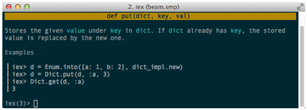{.calibre1}\

Figure 2.5 Documentation of [`Dict.put/3`{.codeintext1}]{.pcalibre}.

Pretty neat, eh? What\'s even better is that the documentation is
beautifully syntax-highlighted.

2.3[          ]{.calibre14} Data Types

Here are the common data types we will use in this book:

[·[     ]{.calibre16}]{.calibre12} Modules

[·[     ]{.calibre16}]{.calibre12} Functions

[·[     ]{.calibre16}]{.calibre12} Numbers

[·[     ]{.calibre16}]{.calibre12} Strings

[·[     ]{.calibre16}]{.calibre12} Atoms

[·[     ]{.calibre16}]{.calibre12} Tuples

[·[     ]{.calibre16}]{.calibre12} Maps

2.3.1[       ]{.calibre13} Modules, Functions and Function Clauses

Modules are Elixir\'s way of grouping functions together. Examples of
modules are `List`{.codeintext}, `String`{.codeintext}, and of course,
`MeterToFootConverter`{.codeintext}. A module is created using
`defmodule`{.codeintext}. Similarly, functions are created using
`def`{.codeintext}.

Modules

Just for kicks, let\'s write another function to convert meters into
*inches*. Given our current implementation, we need to make a few
changes. Firstly, our module name is *too specific*. Let\'s change that
to something more general. Here is our
`length_converter.ex`{.codeintext} again:

`defmodule MeterToLengthConverter do`{.codebcxspfirst}
`  # ...`{.codebcxspmiddle}`end`{.codebcxsplast}

More interestingly, how would we add a function that converts from
meters to inches? Here is one *possible* approach:

Listing 2.4  defmodules can be nested

`defmodule MeterToLengthConverter do`{.codebcxspfirst}
`  defmodule Feet do`{.codebcxspmiddle}
`    def convert(m) do`{.codebcxspmiddle}
`      m * 3.28084`{.codebcxspmiddle} `    end `{.codebcxspmiddle}
`  end`{.codebcxspmiddle} ` `{.codebcxspmiddle}
`  defmodule Inch do`{.codebcxspmiddle}
`    def convert(m) do`{.codebcxspmiddle}
`      m * 39.3701`{.codebcxspmiddle} `    end `{.codebcxspmiddle}
`  end`{.codebcxspmiddle}`end`{.codebcxsplast}

Now, you can compute the height of the tallest man in inches:

Listing 2.5  Using the dot notation (Interactive Elixir)

`iex> MeterToLengthConverter.Inch.convert(2.72)`{.codeb}

Returns

`107.08667200000001`{.codeb}

This example illustrates that modules can be nested. Here, the modules
`Feet`{.codeintext} and `Inch`{.codeintext} are nested within
`MeterToLengthConverter`{.codeintext}. To access a function in a nested
module, the *dot notation* is used. In general, to invoke functions in
Elixir, the following format is used:

`Module.function(arg1, arg2, ...)`{.codeb}

On mailing lists, this is sometimes known as \"**MFA**\". It stands for
**M**odule, **F**unction and **A**rguments. Remember this format,
because you will encounter them again in the book.

You can also flatten the module hierarchy like so:

Listing 2.6 Flattening the module hierarchy (Interactive Elixir)

`defmodule MeterToLengthConverter.Feet do #1`{.codebcxspfirst}
`  def convert(m) do`{.codebcxspmiddle}
`    m * 3.28084`{.codebcxspmiddle} `  end `{.codebcxspmiddle}
`end`{.codebcxspmiddle} ` `{.codebcxspmiddle}
`defmodule MeterToLengthConverter.Inch do #1`{.codebcxspmiddle}
`  def convert(m) do`{.codebcxspmiddle}
`    m * 39.3701`{.codebcxspmiddle}
`  end `{.codebcxspmiddle}`end`{.codebcxsplast}

#1 You can use the dot notation to specify a nested hierarchy

You would call the function exactly the same way as Listing 2.5.

Functions and Function clauses

There is a more idiomatic way of writing our length converter, and that
is using function clauses. Here is a revised version of our length
converter:

`defmodule MeterToLengthConverter do`{.codebcxspfirst}
`  def convert(:feet, m) do`{.codebcxspmiddle}
`    m * 3.28084`{.codebcxspmiddle} `  end`{.codebcxspmiddle}
` `{.codebcxspmiddle} `  def convert(:inch, m) do`{.codebcxspmiddle}
`    m * 39.3701`{.codebcxspmiddle}
`  end `{.codebcxspmiddle}`end`{.codebcxsplast}

Defining a function is pretty straightforward. Most functions are
written like this:

`def convert(:feet, m) do`{.codebcxspfirst}
`  m * 3.28084`{.codebcxspmiddle}`end`{.codebcxsplast}

Single-lined functions are written like so:

`def convert(:feet, m), do: m * 3.28084`{.codeb}

While we are at it, let's add another function to convert meters to
*yards*, this time, using the single-lined variety:

`defmodule MeterToLengthConverter do`{.codebcxspfirst}
`  def convert(:feet, m), do: m * 3.28084`{.codebcxspmiddle}
`  def convert(:inch, m), do: m * 39.3701`{.codebcxspmiddle}
`  def convert(:yard, m), do: m * 1.09361`{.codebcxspmiddle}`end`{.codebcxsplast}

Functions are referred to by their *arity* -- the number of arguments it
takes in. Therefore, we refer to the above function as
`convert/2`{.codeintext}. `convert/2`{.codeintext} is an example of a
*named function*. Elixir also has the notion of *anonymous functions*.
Here is a common example of an anonymous function:

Listing 2.7: Second argument is an anonymous function (Interactive
Elixir)

`iex> Enum.map [1, 2, 3], fn x -> x*x end`{.codeb}

gives `[1, 4, 9].`{.codeintext}

We can define a function with the same name multiple times, just as in
our example. The important thing to notice is they *must* be grouped
together. Therefore, this is bad form:

Listing 2.8: Always group similar function clauses together.

`defmodule MeterToLengthConverter do`{.codebcxspfirst}
`  def convert(:feet, m), do: m * 3.28084`{.codebcxspmiddle}
`  def convert(:inch, m), do: m * 39.3701`{.codebcxspmiddle}
`  def i_should_not_be_here, do: IO.puts "Oops" #1`{.codebcxspmiddle}
`  def convert(:yard, m), do: m * 1.09361`{.codebcxspmiddle}`end`{.codebcxsplast}

#1 Do not do this!

And Elixir would complain accordingly:

Listing 2.10:  Elixir complains when function clauses are not grouped
together.

`% iex length_converter.ex`{.codebcxspfirst}
`length_converter.ex:5: warning: clauses for the same def should be grouped together,`{.codebcxspmiddle}`def convert/2 was previously defined`{.codebcxsplast}

Another important thing: Order matters. Each function clause is matched
in a top down fashion. This means that once Elixir finds a compatible
function clause that matches, it will stop searching and execute that
function. For our current length converter, moving function clauses
around will not affect anything. When we explore recursion later, you
will begin to appreciate why ordering of function clauses matter.

2.3.2[       ]{.calibre13} Numbers

Numbers in Elixir work much like how you would expect from traditional
programming languages.

Listing 2.13:  Operating on  an integer, a hexadecimal, and a float
(Interactive Elixir)

`iex> 1 + 0x2F / 3.0`{.codebcxspfirst}
`16.666666666666664`{.codebcxsplast}

Listing 2.14:  Division and remainder functions (Interactive Elixir)

`iex> div(10,3)`{.codebcxspfirst} `3`{.codebcxspmiddle}
` `{.codebcxspmiddle}
`iex> rem(10,3)`{.codebcxspmiddle}`1`{.codebcxsplast}

2.3.3[       ]{.calibre13} Strings

Strings in Elixir lead two lives. On the surface, strings look like the
pretty standard. Here is an example that demonstrates string
interpolation:

Listing 2.15:  Elixir has string interpolation support (Interactive
Elixir)

`iex(1)> "Strings are #{:great}!"`{.codeb}

Will give you:

`"Strings are great!"`{.codeb}

We can also perform various operations on strings:

Listing 2.16:  Operating on strings (Interactive Elixir)

`iex(2)> "Strings are #{:great}!" |> String.upcase |> String.reverse`{.codeb}

This returns:

`"!TAERG ERA SGNIRTS"`{.codeb}

Strings are Binaries

How do you test for a string? There isn't an `is_string/1`{.codeintext}
function available. That's because a string in Elixir is a **binary**. A
binary is just a sequence of bytes.

Listing 2.17: Strings are Binaries (Interactive Elixir)

`iex(3)> "Strings are binaries" |> is_binary`{.codeb}

returns `true.`{.codeintext}

One way to show the binary representation of a string is to use the
binary concatenation operator `<>`{.codeintext} to attach a null byte,
`<<0>>`{.codeintext}:

Listing 2.18: Displaying the binary representation of a String
(Interactive Elixir)

`iex(4)> "ohai" <> <<0>>`{.codeb}

returns `<<111, 104, 97, 105, 0>>.`{.codeintext}

Each individual number presents a character:

`iex(5)> ?o`{.codebcxspfirst} `111`{.codebcxspmiddle}
` `{.codebcxspmiddle} `iex(6)> ?h`{.codebcxspmiddle}
`104`{.codebcxspmiddle} ` `{.codebcxspmiddle}
`iex(7)> ?a`{.codebcxspmiddle} `97`{.codebcxspmiddle}
` `{.codebcxspmiddle}
`iex(8)> ?i`{.codebcxspmiddle}`105`{.codebcxsplast}

To further convince yourself that the binary representation is
equivalent:

`iex(44)> IO.puts <<111, 104, 97, 105>>`{.codeb}

Gives you back the original string: `ohai`{.codeintext}

Strings are NOT Char lists

Char lists, as its name suggests, is a list of characters. It is an
entirely different data type from strings, and this can be quite
confusing. While strings are always enclosed in double quotes, char
lists are enclosed in single quotes.

Listing 2.19:  Strings are not char lists (Interactive Elixir)

`iex(9)> 'ohai' == "ohai"`{.codeb}

Will give you false. You usually will not use char lists, at least in
Elixir. However, when talking to some Erlang libraries, you would have
to. For example, in a later example, the Erlang http client (httpc)
accepts a char list as the URL:

`:httpc.request 'http://www.elixir-lang.org'`{.codeb}

What happens if we passed in a string (binary) instead? Try it out:

Listing 2.20: httpc.request/1 expects a char list as the URL type
(Interactive Elixir)

`iex(51)> :httpc.request "http://www.elixir-lang.org"`{.codebcxspfirst}
`** (ArgumentError) argument error`{.codebcxspmiddle}
`            :erlang.tl("http://www.elixir-lang.org")`{.codebcxspmiddle}
`    (inets) inets_regexp.erl:80: :inets_regexp.first_match/3`{.codebcxspmiddle}
`    (inets) inets_regexp.erl:68: :inets_regexp.first_match/2`{.codebcxspmiddle}
`    (inets) http_uri.erl:186: :http_uri.split_uri/5`{.codebcxspmiddle}
`    (inets) http_uri.erl:136: :http_uri.parse_scheme/2`{.codebcxspmiddle}
`    (inets) http_uri.erl:88: :http_uri.parse/2`{.codebcxspmiddle}`    (inets) httpc.erl:162: :httpc.request/5`{.codebcxsplast}

We will cover calling Erlang libraries further along the chapter, but
this is something you need to keep at the back of your head when you are
dealing with certain Erlang libraries.

2.3.4[       ]{.calibre13} Atoms

Atoms serve as constants, something akin to Ruby\'s symbols. Atoms
always start with a colon. There are 2 different ways to create atoms:
Both `:hello_atom`{.codeintext} and `:”Hello Atom”`{.codeintext} are
valid atoms. Atoms are *not* the same as strings, since atoms and
strings are completely separate data types:

Listing 2.22: Atoms are not strings! (Interactive Elixir)

`iex> :hello_atom == "hello_atom"`{.codebcxspfirst}
`false`{.codebcxsplast}

On its own, atoms are not very interesting. However, when we place atoms
into *tuples*, and use them in the context of *pattern matching*, you
will begin to understand the role of atoms and how Elixir exploits atoms
to write declarative code. We will get to pattern matching in a few
sections later. For now, let's turn our attention to tuples.

2.3.5[       ]{.calibre13} Tuples

A tuple can contain different types of data. For example, a HTTP client
might return a successful request in the form of a tuple such as:

`{200, “http://www.elixir-lang.org”}`{.codeb}

Here is how the result of an unsuccessful request might look like:

`{404, “http://www.php-is-awesome.org”}`{.codeb}

Tuples use zero-based access, just like how you would access array
elements in most programming languages. Therefore, if you wanted the URL
of the request result, you need pass in `1`{.codeintext} to
`elem/2`{.codeintext}:

Listing 2.24:  Accessing the second element in a tuple (Interactive
Elixir)

`iex> elem({404, “http://www.php-is-awesome.org”}, 1)`{.codeb}

which will return `http://www.php-is-awesome.org.`{.codeintext}

You can update a tuple using `put_elem/3`{.codeintext}:

Listing 2.25: Updating a tuple (Interactive Elixir)

`iex> put_elem({404, “http://www.php-is-awesome.org”}, 0, 503)`{.codeb}

returns

`{503, "http://www.php-is-awesome.org"}`{.codeb}

2.3.6[       ]{.calibre13} Maps

Maps are essentially key-value pairs, like a hash or dictionary,
depending on the language.  All map operations are exposed with the
`Map`{.codeintext} module.

Working with maps is pretty straightforward, with a *tiny* caveat. See
if you can spot it in the examples. Let\'s start with an empty map:

Listing 2.26: Creating a new Map

`iex> programmers = Map.new`{.codebcxspfirst} `%{}`{.codebcxsplast}

Let\'s add some smart people into the map:

Listing 2.27: Adding elements to a Map

`iex> programmers = Map.put(programmers, :joe, "Erlang")`{.codebcxspfirst}
`%{joe: "Erlang"}`{.codebcxspmiddle} ` `{.codebcxspmiddle}
`iex> programmers = Map.put(programmers, :matz, "Ruby")`{.codebcxspmiddle}
`%{joe: "Erlang", matz: "Ruby"}`{.codebcxspmiddle} ` `{.codebcxspmiddle}
`iex> programmers = Map.put(programmers, :rich, "Clojure")`{.codebcxspmiddle}`%{joe: "Erlang", matz: "Ruby", rich: "Clojure"}`{.codebcxsplast}

::: calibre20
A very important aside: Immutability
:::

Notice how [`programmers`{.codeintext}]{.calibre21} is one of the
arguments to [`Map.put/3`{.codeintext}]{.calibre21}, and is *rebound* to
[`programmers`{.codeintext}]{.calibre21} again. Why is that?

[`iex> Map.put(programmers, :rasmus, "PHP")`{.sidebaracode}]{lang="BS-LATN-BA"}
[`%{joe: "Erlang", matz: "Ruby", rasmus: "PHP", rich: "Clojure"}`{.sidebaracode}]{lang="BS-LATN-BA"}

The return value contains the new entry. Let\'s check the contents of
[`programmers`{.codeintext}]{.calibre21}:

[`iex> programmers`{.sidebaracode}]{lang="BS-LATN-BA"}
[`%{joe: "Erlang", matz: "Ruby", rich: "Clojure"}`{.sidebaracode}]{lang="BS-LATN-BA"}

This property is called *immutability*.

*All* data structures in Elixir are immutable, which means you cannot do
any modifications to it. Any modifications you make will *always* leave
the original *unchanged*. Instead, a modified copy is returned.
Therefore, in order to capture the result, you can either re-bind it to
the same variable name, or bind the value to another variable.

::: calibre22
 
:::

2.4[          ]{.calibre14} Guards

Let\'s look at `length_converter.ex`{.codeintext} once more. Let's say I
want to ensure that the arguments are always numbers. Here can modify
the program by adding guard clauses:

Listing 2.29: Guards added for additional checks.

`defmodule MeterToLengthConverter do`{.codebcxspfirst}
`  def convert(:feet, m) when is_number(m), do: m * 3.28084 #1`{.codebcxspmiddle}
`  def convert(:inch, m) when is_number(m), do: m * 39.3701 #1`{.codebcxspmiddle}
`  def convert(:yard, m) when is_number(m), do: m * 1.09361 #1`{.codebcxspmiddle}`end`{.codebcxsplast}

#1 Guards added to the function clause.

So now, if you try something funny like
`MeterToLengthConverter.convert(:feet, “smelly”)`{.codeintext}, none of
the function clauses will match. In fact, Elixir throws a
`FunctionClauseError`{.codeintext}:

Listing 2.30: Attempting to execute the above code results in a
[FunctionClauseError]{.calibre23}

`iex(1)> MeterToLengthConverter.convert (:feet, “smelly”)`{.codeb}

[(FunctionClauseError) no function clause matching in
convert/2]{.calibre24}

Negative lengths make no sense. Let's make sure the arguments are
non-negative. We can do this by adding another guard expression:

Listing 2.31:    We can include simple expressions in guards.

`defmodule MeterToLengthConverter do`{.codebcxspfirst}
`  def convert(:feet, m) when is_number(m) and m >= 0, do: m * 3.28084 #1`{.codebcxspmiddle}
`  def convert(:inch, m) when is_number(m) and m >= 0, do: m * 39.3701 #1`{.codebcxspmiddle}
`  def convert(:yard, m) when is_number(m) and m >= 0, do: m * 1.09361 #1`{.codebcxspmiddle}`end`{.codebcxsplast}

#1 Check that m is a non-negative number

Besides `is_number/1`{.codeintext}, there are also other similar
functions that will come in handy when you need to differentiate between
the various data types. To generate this list, fire up
`iex`{.codeintext}, and type `is_`{.codeintext} [followed by
the]{.bodychar} `<Tab>`{.codeintext} [key.]{.bodychar}

Listing 2.32: Auto-completion in iex to discover function names
(Interactive Elixir)

`iex(1)> is_`{.codebcxspfirst}
`is_atom/1         is_binary/1       is_bitstring/1    is_boolean/1`{.codebcxspmiddle}
`is_float/1        is_function/1     is_function/2     is_integer/1`{.codebcxspmiddle}
`is_list/1         is_map/1          is_nil/1          is_number/1`{.codebcxspmiddle}
`is_pid/1          is_port/1         is_reference/1    is_tuple/1`{.codebcxspmiddle}` `{.codebcxsplast}

The `is_*`{.codeintext} functions should be pretty self explanatory,
except for `is_port/1`{.codeintext} and `is_reference/1`{.codeintext}.
We won't be using ports in this book. We will meet references later on,
and you will see how they are useful in giving messages a unique
identity.

Guard clauses are especially useful in eliminating conditionals, and as
you have guessed, useful in making sure that your arguments are of the
correct type.

2.5[          ]{.calibre14} Pattern Matching

Pattern matching is one of the most powerful features in functional
programming languages, and Elixir is no exception. In fact, pattern
matching is one of my favorite features in Elixir. Once you see what
pattern matching can do, you will start to yearn for it in languages
that do not support them.

Elixir uses the equals operator (`=`{.codeintext}) to perform pattern
matching. Unlike most languages, Elixir not only uses the
`=`{.codeintext} operator for variable assignment. In fact,
`=`{.codeintext} is called the *match operator*. From now on, when you
see a `=`{.codeintext}, think *matches* instead of equals. What are we
matching exactly? In short, pattern matching is used to match both
values and data structures. In the examples that follow, you will learn
why `=`{.codeintext} is called the match operator. More importantly, you
will learn to love pattern matching as a powerful tool to produce
beautiful code. First, let's learn the rules:

2.5.1[       ]{.calibre13} = is used for assigning

The first rule of the match operator is this: Variable assignments only
happen when the variable is on the *left* hand side of the expression.

Listing 2.33:  Variable assignments only occur when the variable is on
the left. (Interactive Elixir)

`iex> programmers = Map.put(programmers, :jose, "Elixir")`{.codeb}

Will result in:

`%{joe: "Erlang", jose: "Elixir", matz: "Ruby", rich: "Clojure"}`{.codeb}

Here, we assignment the result of `Map.put/2`{.codeintext} into
`programmers`{.codeintext}. As expected, `programmers`{.codeintext}
contains:

`iex> programmers`{.codebcxspfirst}
`%{joe: "Erlang", jose: "Elixir", matz: "Ruby", rich: "Clojure"}`{.codebcxsplast}

2.5.2[       ]{.calibre13} = is also used for matching

Here is when things get slightly interesting. Let's swap the order of
the previous expression we had:

Listing 2.34: Matching the map (on the left) with
[`programmers`{.codeintext1}]{.calibre25} (Interactive Elixir)

`iex> %{joe: "Erlang", jose: "Elixir", matz: "Ruby", rich: "Clojure"} = programmers`{.codebcxspfirst}
`%{joe: "Erlang", jose: "Elixir", matz: "Ruby", rich: "Clojure"}`{.codebcxsplast}

Here, we flipped things around. Notice how this is *not* an assignment.
Instead, a *successful pattern match* has occurred, because the contents
of both the left hand side and `programmers`{.codeintext} are identical.
Let\'s see an *unsuccessful* pattern match:

Listing 2.35:  An unsuccessful pattern match (Interactive Elixir)

`iex> %{tolkien: "Elvish"} = programmers`{.codebcxspfirst}
`** (MatchError) no match of right hand side value: %{joe: "Erlang", jose: "Elixir", matz: "Ruby", rich: "Clojure"}`{.codebcxsplast}

When an unsuccessful match occurs, a `MatchError`{.codeintext} is
raised. Let's take a look at destructuring next, because we will need
this in order to perform some cool tricks with pattern matching.

2.5.3[       ]{.calibre13} Destructuring

Destructuring is where pattern matching really shines. One of the nicest
definitions of destructuring comes from *Common Lisp the
Language*[[[[\[2\]]{.calibre18}]{.msofootnotereference}]{.msofootnotereference}](#ch02.html#ugUVMuBAS4AjXQEz6xpJmzG){#ch02.html#uoUcCmRNSIi5gGo5YytDiK9
.pcalibre1 .pcalibre2}:

Destructuring allows you to *bind a set of variables* to a corresponding
*set of values* anywhere that you can normally bind a value to a single
variable.

Here is what it means in code:

Listing 2.36: Binding variables on the left to values on the right
(Interactive Elixir)

`iex> %{joe: a, jose: b, matz: c, rich: d} =`{.codebcxspfirst}
`     %{joe: "Erlang", jose: "Elixir", matz: "Ruby", rich: "Clojure"}`{.codebcxspmiddle}`%{joe: "Erlang", jose: "Elixir", matz: "Ruby", rich: "Clojure"}`{.codebcxsplast}

Here are the contents of each of the variables:

`iex> a`{.codebcxspfirst} `"Erlang"`{.codebcxspmiddle}
` `{.codebcxspmiddle} `iex> b`{.codebcxspmiddle}
`"Elixir"`{.codebcxspmiddle} ` `{.codebcxspmiddle}
`iex> c`{.codebcxspmiddle} `"Ruby"`{.codebcxspmiddle}
` `{.codebcxspmiddle}
`iex> d`{.codebcxspmiddle}`"Clojure"`{.codebcxsplast}

Here, we bind a set of *variables* (`a`{.codeintext}, `b`{.codeintext},
`c`{.codeintext} and `d)`{.codeintext} to a corresponding set of
*values* (`“Erlang”`{.codeintext}, `“Elixir”`{.codeintext},
`“Ruby”`{.codeintext} and `“Clojure”`{.codeintext}). What if you were
only interested in extracting some of the information? No problem,
because you can do pattern-matching without needing to specify the
entire pattern:

Listing 2.37:  Matching only part of a pattern. (Interactive Elixir)

`iex> %{jose: most_awesome_language} = programmers`{.codebcxspfirst}
`%{joe: "Erlang", jose: "Elixir", matz: "Ruby", rich: "Clojure"}`{.codebcxspmiddle}
`iex> most_awesome_language`{.codebcxspmiddle}`"Elixir"`{.codebcxsplast}

This will come in very handy when you are only interesting in extracting
a few pieces of information. Here is another useful technique that is
used very often in Elixir programs. Notice the return values of these
two expressions:

Listing 2.38: A successful fetch returns
[`{:ok, value}`{.codeintext1}]{.calibre25} (Interactive Elixir)

`iex> Map.fetch(programmers, :rich)`{.codebcxspfirst}
`{:ok, "Clojure"}`{.codebcxsplast}

Listing 2.39: An unsuccessful fetch returns
[`:error`{.codeintext1}]{.calibre25} (Interactive Elixir)

`iex> Map.fetch(programmers, :rasmus)`{.codebcxspfirst}
`:error`{.codebcxsplast}

Notice that a tuple with the atom `:ok`{.codeintext} and the value is
returned when a key is found, and an `:error`{.codeintext} atom
otherwise. Here you will see how tuples and atoms are useful, and how we
can exploit this with pattern matching. By making use of the return
values of both the happy and the exceptional path, we can express
ourselves like so:

Listing 2.40:   Handling both the happy path and error path (Interactive
Elixir)

`iex> case Map.fetch(programmers, :rich) do #1`{.codebcxspfirst}
`...>   {:ok, language} ->`{.codebcxspmiddle}
`...>     IO.puts "#{language} is a legit language."`{.codebcxspmiddle}
`...>   :error ->`{.codebcxspmiddle}
`...>     IO.puts "No idea what language this is."`{.codebcxspmiddle}`...> end`{.codebcxsplast}

This returns:

`Clojure is a legit language.`{.codeb}

Example: Reading a File

This technique is very useful for declaring preconditions in your
program. What do I mean by that? Let's take reading a file as an
example. If most of your logic depends on the file being *readable*,
then it makes sense to know as soon as possible if some error occurs
with file reading. It would be helpful to know what kind of error
occurred too. Here's a snippet from the `File.read/1`{.codeintext}
documentation:

{.calibre1}\

Figure 2.6 Documentation for File.read/1

How would you write the file reading portion? More importantly, what can
we learn from reading the above documentation?

1.[ ]{.calibre16} For a successful read, `File.read/1`{.codeintext}
returns a `{:ok, binary}`{.codeintext} [tuple]{.bodychar}. Note that
`binary`{.codeintext} is the entire contents of the read file.

2.[ ]{.calibre16} Otherwise, a `{:error, posix}`{.codeintext} tuple will
be returned. The variable `posix`{.codeintext} contains the error
reasons, which is an atom such as `:enoent`{.codeintext} or
`:eaccess`{.codeintext}.

Listing 2.41:  Reading a file

`case File.read("KISS - Beth.mp3") do`{.codebcxspfirst}
`  {:ok, binary} ->`{.codebcxspmiddle}
`    IO.puts "KIϟϟ rocks!"`{.codebcxspmiddle}
`  {:error, reason} ->`{.codebcxspmiddle}
`    IO.puts "No Rock N Roll for anyone today because of #{reason}."`{.codebcxspmiddle}`end`{.codebcxsplast}

Example: Tic-Tac-Toe board

Here\'s an illustrative example from the Tic-Tac-Toe application that
uses tuples. In this example, we have a `check_board/1`{.codeintext}
function that checks against a tic-tac-toe's board configuration. The
board is expressed using tuples. Notice how we "draw" the board using
tuples, and how easy to understand the code is:

`def check_board(board) do`{.codebcxspfirst}
`  case board do`{.codebcxspmiddle}
`    { :x, :x, :x,`{.codebcxspmiddle}
`      _ , _ , _ ,`{.codebcxspmiddle}
`      _ , _ , _ } -> :x_win`{.codebcxspmiddle} ` `{.codebcxspmiddle}
`    { _ , _ , _ ,`{.codebcxspmiddle}
`      :x, :x, :x,`{.codebcxspmiddle}
`      _ , _ , _ } -> :x_win`{.codebcxspmiddle} ` `{.codebcxspmiddle}
`    { _ , _ , _ ,`{.codebcxspmiddle}
`      _ , _ , _ ,`{.codebcxspmiddle}
`      :x, :x, :x} -> :x_win`{.codebcxspmiddle} ` `{.codebcxspmiddle}
`    { :x, _ , _ ,`{.codebcxspmiddle}
`      :x, _ , _ ,`{.codebcxspmiddle}
`      :x, _ , _ } -> :x_win`{.codebcxspmiddle} ` `{.codebcxspmiddle}
`    { _ , :x, _ ,`{.codebcxspmiddle}
`      _ , :x, _ ,`{.codebcxspmiddle}
`      _ , :x, _ } -> :x_win`{.codebcxspmiddle} ` `{.codebcxspmiddle}
`    { _ , _ , :x,`{.codebcxspmiddle}
`      _ , _ , :x,`{.codebcxspmiddle}
`      _ , _ , :x} -> :x_win`{.codebcxspmiddle} ` `{.codebcxspmiddle}
`    { :x, _ , _ ,`{.codebcxspmiddle}
`      _ , :x, _ ,`{.codebcxspmiddle}
`      _ , _ , :x} -> :x_win`{.codebcxspmiddle} ` `{.codebcxspmiddle}
`    { _ , _ , :x,`{.codebcxspmiddle}
`      _ , :x, _ ,`{.codebcxspmiddle}
`      :x, _ , _ } -> :x_win`{.codebcxspmiddle} ` `{.codebcxspmiddle}
`    # Player O board patterns omitted ...`{.codebcxspmiddle}
` `{.codebcxspmiddle} `    { a, b, c,`{.codebcxspmiddle}
`      d, e, f,`{.codebcxspmiddle}
`      g, h, i } when a and b and c and d and e and f and g and h and i -> :draw`{.codebcxspmiddle}
` `{.codebcxspmiddle} `    _ -> :in_progress`{.codebcxspmiddle}
` `{.codebcxspmiddle} `  end`{.codebcxspmiddle}`end`{.codebcxsplast}

The \'`_`{.codeintext}\' is the \"don\'t care\" or \"match everything\"
operator. You will see quite a few examples in this book. You will see
more pattern-matching in the next section, where we look at *lists*.

Example: Parsing an MP3 file

Elixir is brilliant for parsing binary data. In this example, we are
going to extract metadata from an MP3 file. It is also a good exercise
to reinforce some of the concepts you have learnt earlier. Before you
parse any binary, you must know the layout. The information that we are
interested in, the *ID3 tag*, is located at the *last 128 bytes* of the
mp3 binary:

{.calibre1}\

Figure 2.7: The ID3 tag is located at the last 128 bytes of the MP3
binary.

This means that we must somehow ignore the audio data portion, and
concentrate only on the ID3 tag. The following diagram shows the layout
of the ID3 tag:

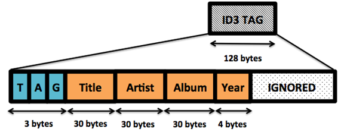{.calibre1}\

Figure 2.8: The layout of the ID3 tag.

The first 3 bytes of the ID3 tag is called the header, and contains 3
characters -- "T", "A", and a "G". The next 30 bytes contain the
*title*. The next 30 bytes is the *artist*, followed by another 30 bytes
containing the *album*. The next 4 bytes is the *year* (e.g.: "2", "0",
"1", "4"). Try to imagine how you might attempt this in some other
programming language. Here is the Elixir version. Save this file as
`id3.ex`{.codeintext}.

Listing 2.42:  The full ID3 parsing program. Save this file as
[`id3.ex`{.codeintext1}]{.calibre25}.

`defmodule ID3Parser do`{.codebcxspfirst} ` `{.codebcxspmiddle}
`  def parse(file_name) do`{.codebcxspmiddle}
`    case File.read(file_name) do                                         #1`{.codebcxspmiddle}
` `{.codebcxspmiddle}
`      {:ok, mp3} ->                                                      #2`{.codebcxspmiddle}
`        mp3_byte_size = byte_size(mp3) – 128                             #4`{.codebcxspmiddle}
` `{.codebcxspmiddle}
`        << _ :: binary-size(mp3_byte_size), id3_tag :: binary >> = mp3   #5`{.codebcxspmiddle}
` `{.codebcxspmiddle}
`        << "TAG", title   :: binary-size(30),                            `{.codebcxspmiddle}
`                  artist  :: binary-size(30),`{.codebcxspmiddle}
`                  album   :: binary-size(30),`{.codebcxspmiddle}
`                  year    :: binary-size(4),`{.codebcxspmiddle}
`                  _rest   :: binary >>       = id3_tag                   #6`{.codebcxspmiddle}
` `{.codebcxspmiddle}
`        IO.puts "#{artist} - #{title} (#{album}, #{year})"`{.codebcxspmiddle}
` `{.codebcxspmiddle}
`      _ ->                                                               #3`{.codebcxspmiddle}
`        IO.puts "Couldn't open #{file_name}"`{.codebcxspmiddle}
`    end`{.codebcxspmiddle}
`  end`{.codebcxspmiddle}`end`{.codebcxsplast}

#1 Read the MP3 binary.

#2 A successful file read returns a tuple that matches this pattern

#3 A failed file read is matched with anything else

#4 Calculate the audio portion of the MP3 in bytes

#5 Pattern matching the MP3 binary to capture the bytes of the ID3 tag

#6 Pattern matching the ID3 tag to capture the various ID3 fields

An example run of the program:

`% iex id3.ex                                                               `{.codebcxspfirst}
` `{.codebcxspmiddle}`iex(1)> ID3Parser.parse "sample.mp3"`{.codebcxsplast}

And an example result:

`Lana Del Rey - Ultraviolence (Ultraviolence, 2014)`{.codebcxspfirst}
`:ok`{.codebcxsplast}

Let's walk through the program. First, the program reads the MP3 binary.
A happy path will return a tuple that matches `{:ok, mp3}`{.codeintext},
where `mp3`{.codeintext} contains the binary contents of the file.
Otherwise, the "catch-all" \_ operator will match a failed file read.

Since we are interested only in the ID3 tag, we need to find a way to
"skip ahead". We first compute *size in bytes* of the *audio* portion of
the binary. Now that we have this information, we can make use of the
size of the audio portion to tell Elixir how to destructure the binary.
We pattern match the MP3 binary by declaring a pattern on the left, and
the mp3 variable on the right. Recall that variable assignments are on
the left, and pattern matching is attempted otherwise.

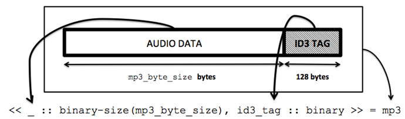{.calibre1}\

Figure 2.9: How the binary gets destructured.

You might recognize the `<< >>.`{.codeintext} It is used to represent a
binary. We then declare that we are not interested in the audio part.
How? We do that by specify the binary size that we have computed
previously. What *remains*, is the ID3 tag. That is captured in the
`id3_tag`{.codeintext} variable. Now we are free to extract the
information from the ID3 tag!

In order to do that, we perform another pattern match with the declared
pattern on the left and `id3_tag`{.codeintext} on the right. By
declaring the appropriate number of bytes, the title, artist and other
information is captured in the respective variables.

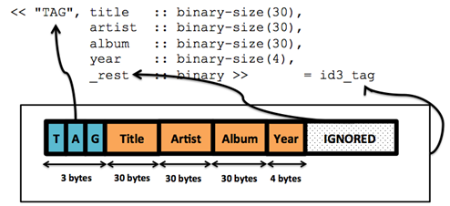{.calibre1}\

Figure 2.10: Destructuring the ID3 binary.

2.6[          ]{.calibre14} Lists

Lists are another data type in Elixir. There are quite a few interesting
things you can do with lists, and therefore deserves its own section.
Lists are somewhat similar to
*linked-lists*[[[[\[3\]]{.calibre18}]{.msofootnotereference}]{.msofootnotereference}](#ch02.html#uVViRxNwYGTYar6izeVraFD){#ch02.html#usLiHAmBCCcYO4nRXGgIKQB
.pcalibre1 .pcalibre2} in that random access is essentially a O(n)
(linear) operation. Here is the definition of a list:

A non-empty list consists of a head and a tail. The tail is also a list.

Notice the recursive nature of the above definition. Translated to code:

`iex> [1, 2, 3] == [1 | [2 | [3 | []]]]`{.codebcxspfirst}
`true`{.codebcxspmiddle}` `{.codebcxsplast}

A diagram might illustrate this better:    

{.calibre1}\

Figure 2.11: \[1,2,3\] represented as a picture

Let's try to understand this picture by starting at the outermost box.
This says that the head of the list is 1, followed by the tail of the
list. This tail, in turn, is yet another list. This time, the head of
this list is 2, followed by the tail, which (again) is another list.

Finally, this list (from the third enclosing box) consists of a head of
3, and a tail. This tail is an empty list. In fact, the *tail of the
final element of any list is always an empty list*. Recursive functions
make use of this fact to determine when the end of the list is reached.

You can also use the pattern-matching operator to prove that both sides
are in fact the same thing :

Listing 2.43: The left hand side and right hand side is equivalent.
(Interactive Elixir)

`iex> [1, 2, 3] = [1 | [2 | [3 | []]]]`{.codebcxspfirst}
`[1, 2, 3]`{.codebcxsplast}

Since no `MatchError`{.codeintext} occurred, we can be certain that both
representations of the list are equivalent. Of course, you wouldn't be
typing `[1|[2|[3|[]]]]`{.codeintext} in your day-to-day code. This is
just to emphasize that a list is a recursive data structure.

I have not explained what '`|`{.codeintext}' is. The '`|`{.codeintext}'
operator is commonly called the *cons*
[[[[\[4\]]{.calibre18}]{.msofootnotereference}]{.msofootnotereference}](#ch02.html#uFTSC7YFSH3DxvWmebI7ae2){#ch02.html#uF8QOmDRZNNvpCpSmjAEfs5
.pcalibre1 .pcalibre2}operator. When applied to lists, it separates the
head and tail. That is, the list is *destructured*. This is yet another
instance of pattern matching in action.

Listing 2.44: Destructuring a list using the cons operator. (Interactive
Elixir)

`iex> [head | tail] = [1, 2, 3]`{.codebcxspfirst}
`[1, 2, 3]`{.codebcxsplast}

Let's check the contents of head and tail:

`iex> head`{.codebcxspfirst} `1`{.codebcxspmiddle}
`iex> tail #A`{.codebcxspmiddle}`[2, 3]`{.codebcxsplast}

#A This is also a list

Notice that `tail`{.codeintext} is also a list, which is in line with
the definition. You can also use the cons operator to *add* (or append)
to the beginning of a list:

Listing 2.45: Using the cons operator to append to a list. (Interactive
Elixir)

`iex(1)> list = [1, 2, 3]`{.codebcxspfirst}
`[1, 2, 3]`{.codebcxspmiddle}
`iex(2)> [0 | list ]`{.codebcxspmiddle}`[0, 1, 2, 3]`{.codebcxsplast}

Listing 2.46: Using the ++ operator to concatenate lists (Interactive
Elixir)

We can also use the `++`{.codeintext} operator to concatenate lists:

`iex(3)> [0] ++ [1, 2, 3]`{.codebcxspfirst}
`[0, 1, 2, 3]`{.codebcxsplast}

What about a single element list? If you understood the diagram of the
list previously, then this would be a piece of cake.

Listing 2.47: The tail of a single element list matches to an empty
list. (Interactive Elixir)

`iex(1)> [ head | tail ] = [:lonely]`{.codebcxspfirst}
`[:lonely]`{.codebcxspmiddle} `iex(2)> head`{.codebcxspmiddle}
`:lonely`{.codebcxspmiddle}
`iex(3)> tail`{.codebcxspmiddle}`[]`{.codebcxsplast}

The list we have here contains a single atom. Now notice our
`tail`{.codeintext} is an empty list. This might seem strange at first,
but if you think about it, it fits the definition. It is precisely this
definition that allows us to do interesting things with lists and
recursion, which we examine next.

Example: Flattening a List

Now that you know how lists work, let\'s build our very own
`flatten/1`{.codeintext}. `flatten/1`{.codeintext} takes in a possibly
nested list and returns a flattened version. Flattening lists can be
useful especially if the list is used to represent a Tree
[[[[\[5\]]{.calibre18}]{.msofootnotereference}]{.msofootnotereference}](#ch02.html#u2to24Ap2mk93kr7NvjAZIG){#ch02.html#uD2AVQHJ9OMdJBNJCWxC9tB
.pcalibre1 .pcalibre2}data structure. Flattening the tree therefore
returns all the elements contained in the tree. Let's see an example:

`List.flatten [1, [:two], ["three", []]]`{.codeb}

will return

`[1, :two, "three"]`{.codeb}

Here is one possible implementation of `flatten/1`{.codeintext}:

`defmodule MyList do`{.codebcxspfirst}
`  def flatten([]), do: [] #1`{.codebcxspmiddle} ` `{.codebcxspmiddle}
`  def flatten([ head | tail ]) do  #2`{.codebcxspmiddle}
`    flatten(head) ++ flatten(tail) #2`{.codebcxspmiddle}
`  end`{.codebcxspmiddle} ` `{.codebcxspmiddle}
`  def flatten(head), do: [ head ] #3`{.codebcxspmiddle}`end`{.codebcxsplast}

#1 Base case, an empty list

#2 Non-empty list, with more than 1 element

#3 Single element list

Take a moment to digest the code, because there\'s more than meets the
eye. There are 3 cases to consider:

We begin with the base case (or degenerate case if you\'ve done some CS
course) -- the empty list. If we get the empty list, we simply return an
empty list.

For a non-empty list #2, we use the cons operator to split into the
`head`{.codeintext} and `tail`{.codeintext}. We then recursively call
`flatten/1`{.codeintext} on both the `head`{.codeintext} and
`tail.`{.codeintext} Next, the result is concatenated using the
`++`{.codeintext} operator. Note that `head`{.codeintext} can also be a
nested list. For example, `[[1], 2]`{.codeintext} would mean that
`head`{.codeintext} is `[1]`{.codeintext}.

If we get a non-list argument, we turn it into a list. Now, consider (it
helps to trace this on paper) what happens to a list such as
`[[1], 2]`{.codeintext}. Let\'s trace the execution:

1.[  ]{.calibre16} The first function clause #1 does not match.

2.[ ]{.calibre16} The second function clause #2 matches though. In this
case, we pattern match the list, and `head`{.codeintext} is
`[1]`{.codeintext}, and `tail`{.codeintext} is `2`{.codeintext}. Now,
`flatten([1])`{.codeintext} and `flatten(2)`{.codeintext} are called
recursively.

3.[ ]{.calibre16} Let\'s handle `flatten([1])`{.codeintext}. Again it
does not match the first clause #1. The second one #2 matches.
 `head`{.codeintext}  is `1`{.codeintext}, and `tail`{.codeintext} is
`[]`{.codeintext}.

4.[ ]{.calibre16} Now, `flatten(1)`{.codeintext} is called, and now, the
third function clause #3 matches, and returns `[1]`{.codeintext}.
`flatten([])`{.codeintext} matches the first clause and returns
`[]`{.codeintext}. A previous call to `flatten(2)`{.codeintext} (see
step 2) returns `[2]`{.codeintext}. `[1] ++ [] ++ [2]`{.codeintext}
yields our flattened list.

Don\'t despair if you did not get that the first time round. As with
most things, some practice will go a long way. Also, you will see
numerous examples in the upcoming chapters.

Ordering of Function Clauses

I previously mentioned that the *order* of function clauses matter. This
is a perfect place to explain why:

Listing 2.11:  The order of function clauses matter!

`defmodule MyList do`{.codebcxspfirst} ` `{.codebcxspmiddle}
`  def flatten([ head | tail ]) do`{.codebcxspmiddle}
`    flatten(head) ++ flatten(tail)`{.codebcxspmiddle}
`  end`{.codebcxspmiddle} ` `{.codebcxspmiddle}
`  def flatten(head), do: [ head ]`{.codebcxspmiddle}
` `{.codebcxspmiddle} `  def flatten([]), do: [] #1`{.codebcxspmiddle}
` `{.codebcxspmiddle}`end`{.codebcxsplast}

#1 This line never runs!

We have made the base case the last clause. Think about what happens
when we try `MyList.flatten([])`{.codeintext}? We expect to get
`[]`{.codeintext}, but in fact we get back `[[]]`{.codeintext}. If you
give it a little thought, you will realize that #1 never runs. The
reason is that the second function clause will match `[]`{.codeintext},
and therefore the third function clause will be ignored.

Let\'s try running this for real:

Listing 2.12: Elixir helpfully warns about unmatched clauses.
(Interactive Elixir)

`% iex length_converter.ex`{.codebcxspfirst}
`warning: this clause cannot match because a previous clause at`{.codebcxspmiddle}`line 7 always matches`{.codebcxsplast}

Elixir has got our back! Take heed of warnings like this, because they
can save you hours of debugging headaches. And unmatched clauses could
either mean dead code, or in the worse case, an infinite loop.

2.7[          ]{.calibre14} Meet \|\>, the Pipe operator

Now, I would like introduce one of the most useful operators ever
invented in Programming Language History™ --
`|>`{.codeintext}[[[[[\[6\]]{.calibre17}]{.msofootnotereference}]{.calibre26}]{.msofootnotereference}](#ch02.html#uK9hrHa3kQCIGQ7flXO8FoF){#ch02.html#udkkAPdyHmLgLsDveAOujJ9
.pcalibre1 .pcalibre2}. The `|>`{.codeintext} takes the result of the
expression on the left and inserts it as the first parameter of the
function call on the right. Here is a code snippet from an Elixir
program I have written recently. Without the pipe operator, this is how
I would have written it:

Listing 2.48: Without the \|\> operator (or, how most languages would do
it)

`defmodule URLWorker do`{.codebcxspfirst}
`  def start(url) do`{.codebcxspmiddle}
`    do_request(HTTPoison.get(url))`{.codebcxspmiddle}
`  end`{.codebcxspmiddle}
`  # ...`{.codebcxspmiddle}`end`{.codebcxsplast}

`HTTPoison`{.codeintext} is a HTTP client. It takes in a
`url`{.codeintext} and returns the HTML page. The page is then passed to
the `do_request`{.codeintext} function to perform some parsing. Notice
that in this version, you have to look for the innermost brackets to
locate `url`{.codeintext}, then move outwards as you mentally trace the
successive function calls.

I present you the version with pipe operators:

Listing 2.49: With the \|\> operator

`defmodule URLWorker do`{.codebcxspfirst}
`  def start(url) do`{.codebcxspmiddle}
`    result = url |> HTTPoison.get |> do_request`{.codebcxspmiddle}
`  end`{.codebcxspmiddle}
`  # ...`{.codebcxspmiddle}`end`{.codebcxsplast}

No contest right? Many of the examples will make extensive use of
`|>`{.codeintext}. The more you use `|>`{.codeintext}, the more you will
start to see *data as being* *transformed* from one form to another,
something like an assembly line. In fact, once you use it often enough,
you will start miss it when you program in other languages.

Example: Filtering files by filename in a directory

Let's say I have a directory filled with e-books, where this directory
could be nested with folders. I want to get the file names of only the
EPUBs. That is, I only want books that have filenames that end with
`*.epub`{.codeintext}, with "Java" in it. Here's how I would do it:

Listing 2.50: Filtering epubs that have "Java" in them.

`"/Users/Ben/Books"                                    #1`{.codebcxspfirst}
`  |> Path.join("**/*.epub")                           #2`{.codebcxspmiddle}
`  |> Path.wildcard                                    #3`{.codebcxspmiddle}
`  |> Enum.filter(fn fname ->                          #4`{.codebcxspmiddle}
`       String.contains?(Path.basename(fname), "Java")`{.codebcxspmiddle}`     end)`{.codebcxsplast}

An example output looks like:

Listing 2.51: An example output of the above expression

`["/Users/Ben/Books/Java/Java_Concurrency_In_Practice.epub",`{.codebcxspfirst}
` "/Users/Ben/Books/Javascript/JavaScript Patterns.epub",`{.codebcxspmiddle}
` "/Users/Ben/Books/Javascript/Functional_JavaScript.epub",`{.codebcxspmiddle}` "/Users/Ben/Books/Ruby/Using_JRuby_Bringing_Ruby_to_Java.epub"]`{.codebcxsplast}

#1 is the string representation of the directory. In #2, we construct a
path with wildcards. Additionally, we specify that we are only
interested in EPUBs. The result of this is passed into #3. The wildcard
function reads the path, and returns a list of matched file names. This
in turn is passed into the filter function in #4, where only file names
containing "Java" is selected. It is very nice to read code that
describes its steps so explicitly and obvious.

2.8[          ]{.calibre14} Erlang Interoperability

Because both Elixir and Erlang share the same byte code, calling Erlang
code does not affect performance in any way. More importantly, this
means that you are free to use *any* Erlang library out there with your
Elixir code.

Calling Erlang functions from Elixir

The only caveat is *how* the code is called. For example, you could
generate a random number in Erlang like so:

Listing 2.52: Generating a random number in Erlang (Interactive Erlang)

`1> random:uniform(123)`{.codebcxspfirst} `55`{.codebcxsplast}

This function comes as part of the standard Erlang distribution. I could
invoke the same Erlang function in Elixir, with some syntactical tweaks:

Listing 2.53:  Translating 
[`random:uniform().`{.codeintext1}]{.calibre25}to Elixir (Interactive
Elixir) 

`iex> :random.uniform(123)`{.codebcxspfirst} `55`{.codebcxsplast}

Notice the positions of the colon and dot between the two listings.
That's really all to it! There is a minor caveat in Elixir when working
with native Erlang functions. You cannot access documentation for Erlang
functions from `iex`{.codeintext}:

Listing 2.54:  Erlang documentation is not available in iex (Interactive
Elixir)

`iex(3)> h :random`{.codebcxspfirst}
`:random is an Erlang module and, as such, it does not have Elixir-style docs`{.codebcxsplast}

Calling Erlang functions can be very useful when Elixir doesn't have an
implementation available in the standard library. If you compare the
Erlang standard library and the Elixir one, you might draw the
conclusion that Erlang's library is much more feature packed. But if you
think about it, Elixir gets everything for free!

Calling the Erlang HTTP client in Elixir

Usually if I find that Elixir is missing a certain feature I want, I
will usually check if there's an Erlang standard library function that I
can use first, before searching for third party libraries. For example,
I once wanted to build a web crawler in Elixir. One of the very first
steps to building a web crawler is to be able to download a web page.
This requires a HTTP client. Elixir doesn't come with a built-in HTTP
client -- it doesn't need to, because Erlang comes with one, aptly named
`httpc`{.codeintext}[[[[[\[7\]]{.calibre17}]{.msofootnotereference}]{.calibre26}]{.msofootnotereference}](#ch02.html#ugLW5GzsQcZ8zXABeWVTc2H){#ch02.html#uJJ86MqDQDsHISshMOe2s83
.pcalibre1 .pcalibre2}. 

Let's say I want to download the web page of a certain programming
language. I go to the Erlang
documentation[[[[\[8\]]{.calibre18}]{.msofootnotereference}]{.msofootnotereference}](#ch02.html#u2nrvV8vG6J5gy7FjyByQX2){#ch02.html#uDMzs6Wh684M5CCzxbJmcyE
.pcalibre1 .pcalibre2}, and I manage to find exactly what I need:

{.calibre1}\

Figure 2.6  The httpc:request/1 Erlang documentation

First, I need to start the `inets`{.codeintext} application (it is
stated in the documentation), followed by the actual request:

Listing 2.55: Downloading a web page, using Erlang's httpc library
(Interactive Elixir)

`iex(1)> :inets.start`{.codebcxspfirst} `:ok`{.codebcxspmiddle}
`iex(2)> {:ok, {status, headers, body}} = :httpc.request 'http://www.elixir-lang.org'`{.codebcxspmiddle}
`{:ok,`{.codebcxspmiddle} ` {{'HTTP/1.1', 200, 'OK'},`{.codebcxspmiddle}
`  [{'cache-control', 'max-age=600'}, {'date', 'Tue, 28 Oct 2014 16:17:24 GMT'},`{.codebcxspmiddle}
`   {'accept-ranges', 'bytes'}, {'server', 'GitHub.com'},`{.codebcxspmiddle}
`   {'vary', 'Accept-Encoding'}, {'content-length', '17251'},`{.codebcxspmiddle}
`   {'content-type', 'text/html; charset=utf-8'},`{.codebcxspmiddle}
`   {'expires', 'Tue, 28 Oct 2014 16:27:24 GMT'},`{.codebcxspmiddle}
`   {'last-modified', 'Tue, 21 Oct 2014 23:38:22 GMT'}],`{.codebcxspmiddle}
`  [60, 33, 68, 79, 67, 84, 89, 80, 69, 32, 104, 116, 109, 108, 62, 10, 60, 104,`{.codebcxspmiddle}
`   116, 109, 108, 32, 120, 109, 108, 110, 115, 61, 34, 104, 116, 116, 112, 58,`{.codebcxspmiddle}`   47, 47, 119, 119, 119, 46, 119, 51, 46, 111, 114, 103, 47, 49, 57, 57, ...]}}`{.codebcxsplast}

And one more thing ...

Erlang has also a very neat GUI frontend called *Observer* that let's
you inspect the Erlang virtual machine, among other things. Invoking it
is simple:

Listing 2.56:  Invoking Observer, a built-in Erlang tool (Interactive
Elixir)

`iex(1)> :observer.start`{.codeb}

Since you are not running any computationally intensive processes, you
won't be seeing much action for now. But here's a few screenshots to
whet your appetite:

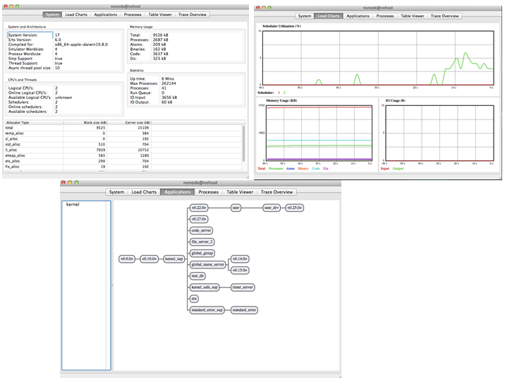{.calibre1}\

Figure 2.7 Screenshots from Observer

Observer is very useful when it comes to seeing how much load the VM is
taking, the layout of your supervision trees (you will learn about that
in the later chapters), and also looking at the data stored in the
built-in database(s) that Erlang provides.

2.9[          ]{.calibre14} Exercises

This was a pretty long chapter. Now it's time to make sure you
understood everything in the chapter.

1.[  ]{.calibre16} Implement `sum/1`{.codeintext}. This function should
take in a list of numbers, and return the sum of the list.

2.[ ]{.calibre16} Explore the `Enum`{.codeintext} module.

3.[ ]{.calibre16} Transform `[1,[[2],3]]`{.codeintext} to
`[9, 4, 1]`{.codeintext} with and without the pipe operator.

4.[ ]{.calibre16} Translate
`crypto:md5("Tales from the Crypt").`{.codeintext} from Erlang to
Elixir.

5.[ ]{.calibre16} Explore the official Elixir \"Getting Started\"
guide[[[[\[9\]]{.calibre27}]{.msofootnotereference}]{.msofootnotereference}](#ch02.html#uzWboseQ5tC5ZfAHC6pfKpA){#ch02.html#uYiNVPWCvsaM73aAlVYO2y7
.pcalibre1 .pcalibre2}.

6.[ ]{.calibre16} Take a look at an IPV4 packet. Try writing a parser
for that.

2.10[      ]{.calibre14} Summary

This concludes our whirlwind tour. If you have made it this far, give
yourself a pat on the shoulder. Do not worry if you have not understood
everything. Many of the concepts will make sense along the way, and many
of the programming constructs will be obvious once you see its
applications. As a quick recap, here is what we just learnt about:

[·[     ]{.calibre16}]{.calibre12} Elixir's fundamental data types.

[·[     ]{.calibre16}]{.calibre12} Guards, and how they work nicely
together with function clauses.

[·[     ]{.calibre16}]{.calibre12} Pattern matching, and how it leads to
very declarative code. We've also looked at a few real-world examples of
pattern matching.

[·[     ]{.calibre16}]{.calibre12} Lists, another fundamental data
structure. We've also seen how lists are represented internally in
Elixir, and how that facilitates recursion.

[·[     ]{.calibre16}]{.calibre12} How Elixir and Erlang plays nicely
with each other.

In the next chapter, we learn the fundamental unit of concurrency in
Elixir -- the process. This is one of the features that make Elixir
vastly different from "traditional" programming languages.
:::

::: calibre2
::: {#ch02.html#ftn1 .calibre2}
[[**[[**[\[1\]]{.calibre29}**]{.msofootnotereference}]{.calibre28}**]{.msofootnotereference}](#ch02.html#uGqF9oefXSN254ifO9nOI74){#ch02.html#uRD9OOhUuHjWvTh2WNVJTqC
.pcalibre1 .pcalibre2}
[https://github.com/tonini/alchemist.el]{.calibre30}
:::

::: {#ch02.html#ftn2 .calibre2}
[[**[[**[\[2\]]{.calibre29}**]{.msofootnotereference}]{.calibre28}**]{.msofootnotereference}](#ch02.html#uoUcCmRNSIi5gGo5YytDiK9){#ch02.html#ugUVMuBAS4AjXQEz6xpJmzG
.pcalibre1 .pcalibre2}
[http://www.cs.cmu.edu/Groups/AI/html/cltl/clm/node252.html]{.calibre30}
:::

::: {#ch02.html#ftn3 .calibre2}
[[**[[**[\[3\]]{.calibre29}**]{.msofootnotereference}]{.calibre28}**]{.msofootnotereference}](#ch02.html#usLiHAmBCCcYO4nRXGgIKQB){#ch02.html#uVViRxNwYGTYar6izeVraFD
.pcalibre1 .pcalibre2}
[http://en.wikipedia.org/wiki/Linked_list]{.calibre30}
:::

::: {#ch02.html#ftn4 .calibre2}
[[**[[**[\[4\]]{.calibre29}**]{.msofootnotereference}]{.calibre28}**]{.msofootnotereference}](#ch02.html#uF8QOmDRZNNvpCpSmjAEfs5){#ch02.html#uFTSC7YFSH3DxvWmebI7ae2
.pcalibre1 .pcalibre2} [This is short for construct. See]{.calibre30}
[[http://en.wikipedia.org/wiki/Cons]{.calibre31}](http://en.wikipedia.org/wiki/Cons){.pcalibre1
.pcalibre2} [for more information.]{.calibre30}
:::

::: {#ch02.html#ftn5 .calibre2}
[[**[[**[\[5\]]{.calibre29}**]{.msofootnotereference}]{.calibre28}**]{.msofootnotereference}](#ch02.html#uD2AVQHJ9OMdJBNJCWxC9tB){#ch02.html#u2to24Ap2mk93kr7NvjAZIG
.pcalibre1 .pcalibre2}
[http://en.wikipedia.org/wiki/Tree\_%28data_structure%29#Representations]{.calibre30}
:::

::: {#ch02.html#ftn6 .calibre2}
[[**[[**[\[6\]]{.calibre29}**]{.msofootnotereference}]{.calibre28}**]{.msofootnotereference}](#ch02.html#udkkAPdyHmLgLsDveAOujJ9){#ch02.html#uK9hrHa3kQCIGQ7flXO8FoF
.pcalibre1 .pcalibre2} [Little trivia -- The \|\> operator is inspired
from F#.]{.calibre30}
:::

::: {#ch02.html#ftn7 .calibre2}
[[**[[**[\[7\]]{.calibre29}**]{.msofootnotereference}]{.calibre28}**]{.msofootnotereference}](#ch02.html#uJJ86MqDQDsHISshMOe2s83){#ch02.html#ugLW5GzsQcZ8zXABeWVTc2H
.pcalibre1 .pcalibre2}
[http://erlang.org/doc/man/httpc.html#request-1]{.calibre30}
:::

::: {#ch02.html#ftn8 .calibre2}
[[**[[**[\[8\]]{.calibre29}**]{.msofootnotereference}]{.calibre28}**]{.msofootnotereference}](#ch02.html#uDMzs6Wh684M5CCzxbJmcyE){#ch02.html#u2nrvV8vG6J5gy7FjyByQX2
.pcalibre1 .pcalibre2} [Who am I kidding? In reality, I'll probably land
on Stack Overflow first.]{.calibre30}
:::

::: {#ch02.html#ftn9 .calibre2}
[[**[[**[\[9\]]{.calibre29}**]{.msofootnotereference}]{.calibre28}**]{.msofootnotereference}](#ch02.html#uYiNVPWCvsaM73aAlVYO2y7){#ch02.html#uzWboseQ5tC5ZfAHC6pfKpA
.pcalibre1 .pcalibre2}
[http://elixir-lang.org/getting_started/1.html]{.calibre30}
:::
:::

[]{#ch03.html}

::: wordsection
# 3[  ]{.calibre11} Processes 101 {#ch03.html#heading_id_2 .cochapternumber}

This chapter covers:

[·[     ]{.calibre13}]{.calibre12} The Actor concurrency model

[·[     ]{.calibre13}]{.calibre12} Creating processes

[·[     ]{.calibre13}]{.calibre12} How to send and receive messages
using processes

[·[     ]{.calibre13}]{.calibre12} Achieving concurrency using processes

[·[     ]{.calibre13}]{.calibre12} How to make processes communicate
with each other

The concept of processes is one of the most important to understand, and
rightly deserves its own chapter. Processes are the fundamental unit of
concurrency in Elixir. In fact, the Erlang VM supports up to 134
million[[[[\[1\]]{.calibre32}]{.msofootnotereference}]{.msofootnotereference}](#ch03.html#upz6AcFmGwE9eU3xCl8oqRD){#ch03.html#uawOqHhyhtkQ2B699h55Lj4
.pcalibre1 .pcalibre2} (!) processes, causing all your CPUs to happily
light up. I always get a warm, fuzzy feeling knowing that I am getting
my money\'s worth in hardware. The processes created by the Erlang VM
are independent of the operating system. The processes created by the
Erlang VM are much more lightweight, and only take mere microseconds to
create[[[[\[2\]]{.calibre32}]{.msofootnotereference}]{.msofootnotereference}](#ch03.html#ufy3ItmzNMRjmsqbWuxUpMA){#ch03.html#uaLcTH2WZVUhi5sgnh6hkO7
.pcalibre1 .pcalibre2}.

We are going to embark on a fun project. In this chapter, we will build
a simple program that reports the temperature of a given
city/state/country. But first, let us learn about the actor concurrency
model.

3.1[           ]{.calibre14} Actor Concurrency Model

Erlang (and therefore Elixir) uses the Actor Concurrency Model. This
means that:

1.[ ]{.calibre16} Each *actor* is a *process*.

2.[ ]{.calibre16} Each process performs a *specific task*.

3.[ ]{.calibre16} To tell a process to do something, you need to *send
it a message*. The process can also reply by *sending back another
message*.

4.[ ]{.calibre16} The kinds of messages the process can act upon are
specific to the process itself. In other words, messages are *pattern
matched*.

5.[ ]{.calibre16} Other than that, processes *do not share any
information* with other processes.

If all this seems fuzzy now, fret not. If you have done any
object-oriented programming, you will find that processes resemble
objects in many ways. You could even argue that it is a purer form of
object-orientation.

Here is one way to think about actors. Actors are just like people. We
communicate each other by talking to each other. For example, my wife
tells me to do the dishes. Of course, I respond by doing the dishes --
I'm a good husband. If however, my wife tells me to eat my vegetables,
she will get ignored -- I won't respond to that. In effect, I'm choosing
to respond to only certain kinds of messages. Finally, I don't know what
goes on inside her head, and neither does she know what goes on inside
my head. As you will soon see, the actor concurrency model acts just
like that -- responding to only certain kinds of messages.

3.2[           ]{.calibre14} Building a Weather application

Conceptually, our application is pretty simple. The first version
accepts a single argument containing a location, and it reports the
temperature in Celsius. That involves making a HTTP request to an
external weather service, and parsing the JSON response to extract the
temperature.

{.calibre1}\

Figure 3.1 Weather actor handling a single request.

Making a single request is trivial. What happens if we wanted to find
out the temperatures of 100 cities at once? Assuming that each request
takes 1 second, are we going to wait for 100 seconds? Obviously not! We
will see how we can make concurrency requests so that we can get our
results as soon as possible.

One of the properties of concurrency is that we never know which order
the responses come in. For example, imagine that I pass in a list of
cities in alphabetical order. The responses I get back are in no way
guaranteed to be in the same order.

How could we ensure that the responses are in the correct order then?
Read on, dear reader, because we begin our meteorological adventures in
Elixir right now.

3.2.1[                     ]{.calibre13} The Naïve Version

We start with a naïve version. That is, no concurrency will be involved.
On the other hand, the naïve version will contain all of the logic
needed to make a request, parse the response, and return the result. By
the end of this iteration, you would learn how to:

[·[     ]{.calibre16}]{.calibre12} Install and make use of third-party
libraries using mix

[·[     ]{.calibre16}]{.calibre12} Make a HTTP request to a third party
API

[·[     ]{.calibre16}]{.calibre12} Parse a JSON response using pattern
matching

[·[     ]{.calibre16}]{.calibre12} See how pipes facilitate
data-transformation

This will be the first non-trivial program that you will be working
through. But no worries though, you will be guided along every step of
the way. Let's begin!

Creating a New Project

The first order of business is to create a new project, and more
importantly, give it a great name. Since I'm the author, I get to choose
the name. In listing 3.1, we use `mix new <project name>`{.codeintext}
to create a new project

Listing 3.1 Creating a new project

`% mix new metex`{.codebcxspfirst}
`* creating README.md`{.codebcxspmiddle}
`* creating .gitignore`{.codebcxspmiddle}
`* creating mix.exs`{.codebcxspmiddle}
`* creating config`{.codebcxspmiddle}
`* creating config/config.exs`{.codebcxspmiddle}
`* creating lib`{.codebcxspmiddle}
`* creating lib/metex.ex`{.codebcxspmiddle}
`* creating test`{.codebcxspmiddle}
`* creating test/test_helper.exs`{.codebcxspmiddle}
`* creating test/metex_test.exs`{.codebcxspmiddle}
`Your mix project was created successfully.`{.codebcxspmiddle}
`You can use mix to compile it, test it, and more:`{.codebcxspmiddle}
` `{.codebcxspmiddle} `    cd metex`{.codebcxspmiddle}
`    mix test`{.codebcxspmiddle}
` `{.codebcxspmiddle}`% cd metex`{.codebcxsplast}

Follow the instructions and `cd`{.codeintext} into the
`metex`{.codeintext} directory.

Installing the Dependencies

Open `mix.exs`{.codeintext}. This is what you will see:

Listing 3.2 The default generated mix.exs file.

`defmodule Metex.Mixfile do`{.codebcxspfirst}
`  use Mix.Project`{.codebcxspmiddle} ` `{.codebcxspmiddle}
`  def project do`{.codebcxspmiddle}
`    [app: :metex,`{.codebcxspmiddle}
`     version: "0.0.1",`{.codebcxspmiddle}
`     elixir: "~> 1.0",`{.codebcxspmiddle}
`     deps: deps]`{.codebcxspmiddle} `  end`{.codebcxspmiddle}
` `{.codebcxspmiddle} `  def application do`{.codebcxspmiddle}
`    [applications: [:logger]]`{.codebcxspmiddle}
`  end`{.codebcxspmiddle} ` `{.codebcxspmiddle}
`  defp deps do`{.codebcxspmiddle} `    []`{.codebcxspmiddle}
`  end`{.codebcxspmiddle}`end`{.codebcxsplast}

Every project generated by `mix`{.codeintext} will contain this file. It
consists of two public functions, `project`{.codeintext} and
`application`{.codeintext}. The `project`{.codeintext} function
basically sets up our project. More importantly, it sets up our
project's dependencies by invoking the `deps`{.codeintext} private
function. As it stands, `deps`{.codeintext} is an empty list -- for now.
The `application`{.codeintext} function is used to generate an
application resource file. Certain dependencies in Elixir require them
to be started up in a specific way. Dependencies that are like that are
declared within this function. For example, before our application
starts, the `logger`{.codeintext} application is started up first.

Let's add two dependencies by modifying the `deps`{.codeintext} function
to look like (listing 3.3):

Listing 3.3 Declaring dependencies in mix.exs

`  defp deps do`{.codebcxspfirst}
`    [              `{.codebcxspmiddle}
`      {:httpoison, "~> 0.9.0"},  #1`{.codebcxspmiddle}
`      {:json,      "~> 0.3.0"}   #1`{.codebcxspmiddle}
`    ]`{.codebcxspmiddle}`  end`{.codebcxsplast}

#1 declaring the dependencies and also specifying the respective version
numbers

Next, add an entry to the `application`{.codeintext} function:

`  def application do`{.codebcxspfirst}
`    [applications: [:logger, :httpoison]]`{.codebcxspmiddle}`  end`{.codebcxsplast}

How did I know that I should include `:httpoison`{.codeintext}, and not
say, `:json`{.codeintext}? Truth is, I don't. So I always do the next
best thing -- read the fine manual. Each time I install a library, I
first take a look at the README. In `:httpoison`{.codeintext}'s case,
the README clearly states:

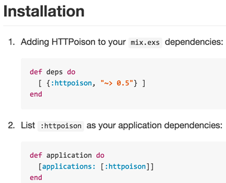{.calibre1}\

Figure 3.2 It is always helpful to look at the README of third-party
libraries for important installation instructions.

::: calibre20
Dependency version numbers are important!
:::

Pay attention to the version numbers of your dependencies. Using the
wrong version number could result in puzzling errors. Another thing to
take note of is that many of these libraries will specify the minimum
version of Elixir that it is compatible with.

::: calibre22
 
:::

Making sure you are in the Metex directory, we can install our
dependencies using the `mix deps.get`{.codeintext} command:

`% mix deps.get`{.codeb}

Notice that `mix`{.codeintext} helpfully resolves dependencies too. In
this case, it brought in two other libraries, hackney and idna (listing
3.4):

Listing 3.4 mix resolves dependencies automatically

`% mix deps.get`{.codebcxspfirst}
`Running dependency resolution`{.codebcxspmiddle}
`* Getting httpoison (Hex package)`{.codebcxspmiddle}
`Checking package (http://s3.hex.pm.global.prod.fastly.net/tarballs/httpoison-0.9.0.tar)`{.codebcxspmiddle}
`Using locally cached package`{.codebcxspmiddle}
`* Getting json (Hex package)`{.codebcxspmiddle}
`Checking package (http://s3.hex.pm.global.prod.fastly.net/tarballs/json-0.3.2.tar)`{.codebcxspmiddle}
`Using locally cached package`{.codebcxspmiddle}
`* Getting hackney (Hex package)`{.codebcxspmiddle}
`Checking package (http://s3.hex.pm.global.prod.fastly.net/tarballs/hackney-1.5.7.tar)`{.codebcxspmiddle}
`Using locally cached package`{.codebcxspmiddle}
`* Getting ssl_verify_fun (Hex package)`{.codebcxspmiddle}
`Checking package (http://s3.hex.pm.global.prod.fastly.net/tarballs/ssl_verify_fun-1.1.0.tar)`{.codebcxspmiddle}
`Using locally cached package`{.codebcxspmiddle}
`* Getting mimerl (Hex package)`{.codebcxspmiddle}
`Checking package (http://s3.hex.pm.global.prod.fastly.net/tarballs/mimerl-1.0.2.tar)`{.codebcxspmiddle}
`Using locally cached package`{.codebcxspmiddle}
`* Getting metrics (Hex package)`{.codebcxspmiddle}
`Checking package (http://s3.hex.pm.global.prod.fastly.net/tarballs/metrics-1.0.1.tar)`{.codebcxspmiddle}
`Using locally cached package`{.codebcxspmiddle}
`* Getting idna (Hex package)`{.codebcxspmiddle}
`Checking package (http://s3.hex.pm.global.prod.fastly.net/tarballs/idna-1.2.0.tar)`{.codebcxspmiddle}
`Using locally cached package`{.codebcxspmiddle}
`* Getting certifi (Hex package)`{.codebcxspmiddle}
`Checking package (http://s3.hex.pm.global.prod.fastly.net/tarballs/certifi-0.4.0.tar)`{.codebcxspmiddle}`Using locally cached package`{.codebcxsplast}

3.3[           ]{.calibre14} The Worker

Before we get into the implementation for the worker, we need to obtain
an API key from the third-party weather service, OpenWeatherMap. Head
over to `http://openweathermap.org/`{.codeintext} to create an account.
Once done, you will see that your API key has been created for you:

{.calibre1}\

Figure 3.3 Creating an account and getting an API key from
OpenWeatherMap.

Now we can get into the implementation details of the worker. The
worker's job is do fetch the temperature of a given location from
OpenWeatherMap, and parse the results. Create `worker.ex`{.codeintext}
in the `lib`{.codeintext} directory. Here is the entire listing for the
worker (listing 3.5):

Listing 3.5 The full source of worker.ex. Save this in lib/worker.ex.

`defmodule Metex.Worker do`{.codebcxspfirst} ` `{.codebcxspmiddle}
`  def temperature_of(location) do`{.codebcxspmiddle}
`    result = url_for(location) |> HTTPoison.get |> parse_response`{.codebcxspmiddle}
`    case result do`{.codebcxspmiddle}
`      {:ok, temp} ->`{.codebcxspmiddle}
`        "#{location}: #{temp}°C"`{.codebcxspmiddle}
`      :error ->`{.codebcxspmiddle}
`        "#{location} not found"`{.codebcxspmiddle}
`    end`{.codebcxspmiddle} `  end`{.codebcxspmiddle}
` `{.codebcxspmiddle} `  defp url_for(location) do`{.codebcxspmiddle}
`    location = URI.encode(location)`{.codebcxspmiddle}
`    "http://api.openweathermap.org/data/2.5/weather?q=#{location}&appid=#{apikey}"`{.codebcxspmiddle}
`  end`{.codebcxspmiddle} ` `{.codebcxspmiddle}
`  defp parse_response({:ok, %HTTPoison.Response{body: body, status_code: 200}}) do`{.codebcxspmiddle}
`    body |> JSON.decode! |> compute_temperature`{.codebcxspmiddle}
`  end`{.codebcxspmiddle} ` `{.codebcxspmiddle}
`  defp parse_response(_) do`{.codebcxspmiddle}
`    :error`{.codebcxspmiddle} `  end`{.codebcxspmiddle}
` `{.codebcxspmiddle}
`  defp compute_temperature(json) do`{.codebcxspmiddle}
`    try do`{.codebcxspmiddle}
`      temp = (json["main"]["temp"] - 273.15) |> Float.round(1)`{.codebcxspmiddle}
`      {:ok, temp}`{.codebcxspmiddle} `    rescue`{.codebcxspmiddle}
`      _ -> :error`{.codebcxspmiddle} `    end`{.codebcxspmiddle}
`  end`{.codebcxspmiddle} ` `{.codebcxspmiddle}
`  defp apikey do`{.codebcxspmiddle}
`    “APIKEY-GOES-HERE”`{.codebcxspmiddle} `  end`{.codebcxspmiddle}
` `{.codebcxspmiddle}`end`{.codebcxsplast}

Do not be alarmed if you don\'t understand entire what is going on. We
will go through the program bit by bit. For now, let\'s see how we can
run this program from `iex`{.codeintext}. From the project root
directory, launch `iex`{.codeintext} like so:

`% iex –S mix`{.codeb}

If it is the first time you are running that command, you will notice a
list of dependencies being compiled. You will not see this the next time
you run `iex`{.codeintext}, unless you modify the dependencies. Now,
let\'s find out the temperatures of some of the coldest places in the
world (listing 3.6):

Listing 3.6 An example run of the worker. (Interactive Elixir)

`iex(1)> Metex.Worker.temperature_of "Verkhoyansk, Russia"`{.codebcxspfirst}
`"Verkhoyansk, Russia: -37.3°C"`{.codebcxsplast}

Just for kicks, let\'s try another:

`iex(2)> Metex.Worker.temperature_of "Snag, Yukon, Canada"`{.codebcxspfirst}
`"Snag, Yukon, Canada: -27.6°C"`{.codebcxsplast}

What happens when we give a nonsensical location?

`iex(3)> Metex.Worker.temperature_of "Omicron Persei 8"`{.codebcxspfirst}
`"Omicron Persei 8 not found"`{.codebcxsplast}

Now that we have see the worker in action, let\'s take a closer look and
figure out how it works. We begin with the
`temperature_of/1`{.codeintext} function in listing 3.7:

Listing 3.7 The core of Metex.Worker -- temperature_of/1 function

`defmodule Metex.Worker do`{.codebcxspfirst} ` `{.codebcxspmiddle}
`  def temperature_of(location) do                       `{.codebcxspmiddle}
`    result = url_for(location) |> HTTPoison.get |>  parse_response #1`{.codebcxspmiddle}
`    case result do                           `{.codebcxspmiddle}
`      {:ok, temp} ->                          #2 `{.codebcxspmiddle}
`        "#{location}: #{temp}°C"              #2`{.codebcxspmiddle}
`      :error ->                               #3`{.codebcxspmiddle}
`        "#{location} not found"               #3`{.codebcxspmiddle}
`    end`{.codebcxspmiddle} `  end`{.codebcxspmiddle}
` `{.codebcxspmiddle} `  # ...`{.codebcxspmiddle}`end`{.codebcxsplast}

#1 Data transformation: From URL to HTTP response to parsing that
response

#2 A successfully parsed response returns the temperature and location

#3 Otherwise, an error message is returned

The most important line in the entire function is

`result = location |> url_for |> HTTPoison.get |> parse_response  `{.codeb}

Without using the pipe operator, we would have to write our function
like so:

`result = parse_response(HTTPoison.get(url_for(location)))                                `{.codeb}

The `location |> url_for`{.codeintext} constructs the URL that is used
to call the weather API. For example, the URL for Singapore would be
(substitute `<APIKEY>`{.codeintext} with your own):

`http://api.openweathermap.org/data/2.5/weather?q=Singapore&appid=<APIKEY>`{.codeb}

Once we have the URL, we can then make use of httpoison, a HTTP client,
to make a GET request:

`location |> url_for |> HTTPoison.get`{.codeb}

If you tried that URL in your browser, you would have gotten something
like this (I\'ve trimmed the JSON for brevity):

`{`{.codebcxspfirst} `  ...`{.codebcxspmiddle}
`  "main": {`{.codebcxspmiddle} `    "temp": 299.86,`{.codebcxspmiddle}
`    "temp_min": 299.86,`{.codebcxspmiddle}
`    "temp_max": 299.86,`{.codebcxspmiddle}
`    "pressure": 1028.96,`{.codebcxspmiddle}
`    "sea_level": 1029.64,`{.codebcxspmiddle}
`    "grnd_level": 1028.96,`{.codebcxspmiddle}
`    "humidity": 100`{.codebcxspmiddle} `  },`{.codebcxspmiddle}
`  ...`{.codebcxspmiddle}`}`{.codebcxsplast}

Let\'s take a closer look at the response of the HTTP client. Try this
out in iex too. In case you exited iex, remember to use 
`iex -S mix`{.codeintext} so that the dependencies (such as httpoison)
are loaded properly.

We can try out the URL of Singapore\'s temperature (listing 3.8):

Listing 3.8 Using HTTPoison to make a GET request (Interactive Elixir)

`iex(1)> HTTPoison.get "http://api.openweathermap.org/data/2.5/weather?q=Singapore&appid=<APIKEY>"`{.codeb}

Take a look at the results:

`{:ok,`{.codebcxspfirst}
` %HTTPoison.Response{body: "{\"coord\":{\"lon\":103.85,\"lat\":1.29},\"sys\":{\"message\":0.098,\"country\":\"SG\",\"sunrise\":1421795647,\"sunset\":1421839059},\"weather\":[{\"id\":802,\"main\":\"Clouds\",\"description\":\"scattered clouds\",\"icon\":\"03n\"}],\"base\":\"cmc stations\",\"main\":{\"temp\":299.86,\"temp_min\":299.86,\"temp_max\":299.86,\"pressure\":1028.96,\"sea_level\":1029.64,\"grnd_level\":1028.96,\"humidity\":100},\"wind\":{\"speed\":6.6,\"deg\":29.0007},\"clouds\":{\"all\":36},\"dt\":1421852665,\"id\":1880252,\"name\":\"Singapore\",\"cod\":200}\n",`{.codebcxspmiddle}
`  headers: %{"Access-Control-Allow-Credentials" => "true",`{.codebcxspmiddle}
`    "Access-Control-Allow-Methods" => "GET, POST",`{.codebcxspmiddle}
`    "Access-Control-Allow-Origin" => "*",`{.codebcxspmiddle}
`    "Connection" => "keep-alive",`{.codebcxspmiddle}
`    "Content-Type" => "application/json; charset=utf-8",`{.codebcxspmiddle}
`    "Date" => "Wed, 21 Jan 2015 15:59:14 GMT", "Server" => "nginx",`{.codebcxspmiddle}
`    "Transfer-Encoding" => "chunked", "X-Source" => "redis"},`{.codebcxspmiddle}`  status_code: 200}}`{.codebcxsplast}

What about passing in a URL to a missing page?

`iex(2)> HTTPoison.get "http://en.wikipedia.org/phpisawesome"`{.codeb}

This will return something like:

`{:ok,`{.codebcxspfirst}
` %HTTPoison.Response{body: "<html>Opps</html>",`{.codebcxspmiddle}
`  headers: %{"Accept-Ranges" => "bytes", "Age" => "12",`{.codebcxspmiddle}
`    "Cache-Control" => "s-maxage=2678400, max-age=2678400",`{.codebcxspmiddle}
`    "Connection" => "keep-alive", "Content-Length" => "2830",`{.codebcxspmiddle}
`    "Content-Type" => "text/html; charset=utf-8",`{.codebcxspmiddle}
`    "Date" => "Wed, 21 Jan 2015 16:04:48 GMT",`{.codebcxspmiddle}
`    "Refresh" => "5; url=http://en.wikipedia.org/wiki/phpisawesome",`{.codebcxspmiddle}
`    "Server" => "Apache",`{.codebcxspmiddle}
`    "Set-Cookie" => "GeoIP=SG:Singapore:1.2931:103.8558:v4; Path=/; Domain=.wikipedia.org",`{.codebcxspmiddle}
`    "Via" => "1.1 varnish, 1.1 varnish, 1.1 varnish",`{.codebcxspmiddle}
`    "X-Cache" => "cp1053 miss (0), cp4016 hit (1), cp4018 frontend miss (0)",`{.codebcxspmiddle}
`    "X-Powered-By" => "HHVM/3.3.1",`{.codebcxspmiddle}
`    "X-Varnish" => "2581642697, 646845726 646839971, 2421023671",`{.codebcxspmiddle}
`    "X-Wikimedia-Debug" => "prot=http:// serv=en.wikipedia.org loc=/phpisawesome"},`{.codebcxspmiddle}`  status_code: 404}}`{.codebcxsplast}

And finally, a ridiculous URL yields:

Listing 3.9 Using HTTPoison to make an invalid GET request (Interactive
Elixir)

`iex(3)> HTTPoison.get "phpisawesome"`{.codebcxspfirst}
`{:error, %HTTPoison.Error{id: nil, reason: :nxdomain}}`{.codebcxsplast}

We have just seen at least three variations of the what
HTTPoison.get(url) can return. The happy path returns a *pattern* that
resembles

`{:ok, %HTTPoison.Response{status_code: 200, body: content}}}`{.codeb}

The pattern above conveys the following information:

[·[     ]{.calibre16}]{.calibre12} This is a two-element tuple

[·[     ]{.calibre16}]{.calibre12} The first element of the tuple is an
`:ok`{.codeintext} atom, followed by a structure that represents the
response

[·[     ]{.calibre16}]{.calibre12} The response is of type
`HTTPoison.Response`{.codeintext} that contains at least two fields

[·[     ]{.calibre16}]{.calibre12} The value of
`status_code`{.codeintext} is 200, which represents a successful HTTP
GET request

[·[     ]{.calibre16}]{.calibre12} The value of body is *captured* in
content

As you can see, pattern matching is incredibly succinct, and a beautiful
way to express what you want. Similarly, an error tuple has the
following pattern:

`{:error, %HTTPoison.Error{reason: reason}}`{.codeb}

Let\'s do the same analysis again:

[·[     ]{.calibre16}]{.calibre33} [This is a two-element
tuple]{.calibre24}

[·[     ]{.calibre16}]{.calibre33} [The]{.calibre24} [first element of
the tuple is an]{.calibre24} `:error`{.codeintext} [atom, followed by a
structure that represents the error]{.calibre24}

[·[     ]{.calibre16}]{.calibre33} [The]{.calibre24} [response is of
type]{.calibre24} `HTTPoison.Error`{.codeintext}
[t]{.calibre24}[h]{.calibre24}[at contains at least one fields,
reason]{.calibre24}

[·[     ]{.calibre16}]{.calibre12} [The]{.calibre24} [reason of the
error is captured in]{.calibre24} `reason`{.codeintext}

With all that in mind, let\'s take a look at the
`parse_response/1`{.codeintext} function (listing 3.11):

Listing 3.11 Pattern matching in the parse_response/1 function

`defp parse_response({:ok, %HTTPoison.Response{body: body, status_code: 200}}) do`{.codebcxspfirst}
`  body |> JSON.decode! |> compute_temperature`{.codebcxspmiddle}
`end`{.codebcxspmiddle} ` `{.codebcxspmiddle}
`defp parse_response(_) do`{.codebcxspmiddle}
`  :error`{.codebcxspmiddle}`end`{.codebcxsplast}

Here, we specify two versions of `parse_response/1.`{.codeintext} The
first version matches a successful GET request, because we are matching
a response that is of type `HTTPoison.Response,`{.codeintext} and also
making sure that the `status_code`{.codeintext} is 200. Otherwise, we
treat any other kind of response as an error. Let\'s take a closer look
now at the first version of `parse_response/1.`{.codeintext}

`defp parse_response({:ok, %HTTPoison.Response{body: body, status_code: 200}}) do`{.codebcxspfirst}
`  # ...`{.codebcxspmiddle}`end`{.codebcxsplast}

Upon a successful pattern match, the string representation of the JSON
is captured in the body variable. In order to turn it into a \"real\"
JSON, we need to decode it:

`body |> JSON.decode!`{.codeb}

We then pass this JSON into the `compute_temperature/1`{.codeintext}
function. Here\'s the function again:

`defp compute_temperature(json) do`{.codebcxspfirst}
`  try do`{.codebcxspmiddle}
`    temp = (json["main"]["temp"] - 273.15) |> Float.round(1)`{.codebcxspmiddle}
`    {:ok, temp}`{.codebcxspmiddle} `  rescue`{.codebcxspmiddle}
`    _ -> :error`{.codebcxspmiddle}
`  end`{.codebcxspmiddle}`end`{.codebcxsplast}

We wrap the computation in a `try … rescue … end`{.codeintext} block. We
attempt to retrieve the temperaure from the given JSON and then perform
some arithmetic. At any of these points an error could occur. If it
does, we want the return result to be an `:error atom.`{.codeintext}
Otherwise, a two-element tuple containing `:ok`{.codeintext} as the
first element and the temperature is returned. Having return values of
different "shapes" is very useful because code that calls this function
for example can easily pattern match on both success and failure cases.
You will see many more cases where we can exploit opportunities for
pattern matching in the following chapters.

Here, we are subtracting 273.15 because the API provides the results in
Kelvins. We also round off the temperature to one decimal place.

What happens if the HTTP GET response doesn\'t match the first pattern?
That\'s the job of the second `parse_response/1`{.codeintext} function:

Listing 3.11 This version of parse_response/1 matches any message.

`defp parse_response(_) do`{.codebcxspfirst}
`  :error`{.codebcxspmiddle}`end`{.codebcxsplast}

Here, any other response other than a successful one is treated as an
error. That is basically it! You should now have a better understanding
of how to the worker works. Let\'s learn about how processes are created
in Elixir.

3.4[           ]{.calibre14} Creating Processes for Concurrency

Let\'s imagine we have a list of cities we want to get temperatures of:

Listing 3.12 Creating a list of cities (Interactive Elixir)

`iex> cities = ["Singapore", "Monaco", "Vatican City", "Hong Kong", "Macau"]`{.codeb}

Next, we send each request to the worker, one at a time:

Listing 3.13 Making a request to find the temperature of a city, one at
a time (Interactive Elixir)

`iex(2)> cities |> Enum.map(fn city ->    `{.codebcxspfirst}
`  Metex.Worker.temperature_of(city)`{.codebcxspmiddle}`end)`{.codebcxsplast}

This results in:

`["Singapore: 27.5°C", "Monaco: 7.3°C", "Vatican City: 10.9°C", "Hong Kong: 18.1°C", "Macau: 19.5°C"]`{.codeb}

The problem with this approach is that it is *wasteful*. As the size of
the list grows, so will the time needed to wait for all the responses to
complete. The only time the next request will be processed is when the
one before it has completed. We can do better.

{.calibre1}\

Figure 3.2 Without concurrency, the next request will have to wait for
the previous one to complete. This is very inefficient.

One important thing to realise is that *each request does not depend on
the other*. In other words, we can package each call to
`Metex.Worker.temperature_of/1`{.codeintext} into a process. Let\'s
teach our worker how to respond to messages. First, add the
`loop/0`{.codeintext} function into `lib/worker.ex:`{.codeintext}

Listing 3.14  Adding the loop/0 function into the worker so that it can
respond to messages.

`defmodule Metex.Worker do`{.codebcxspfirst} ` `{.codebcxspmiddle}
`  def loop do`{.codebcxspmiddle} `    receive do`{.codebcxspmiddle}
`      {sender_pid, location} ->`{.codebcxspmiddle}
`        send(sender_pid, {:ok, temperature_of(location)})`{.codebcxspmiddle}
`      _ ->`{.codebcxspmiddle}
`        IO.puts "don't know how to process this message"`{.codebcxspmiddle}
`    end`{.codebcxspmiddle} `    loop`{.codebcxspmiddle}
`  end`{.codebcxspmiddle} ` `{.codebcxspmiddle}
`  defp temperature_of(location) do`{.codebcxspmiddle}
`    # ...`{.codebcxspmiddle} `  end`{.codebcxspmiddle}
` `{.codebcxspmiddle} `  # ...`{.codebcxspmiddle}`end`{.codebcxsplast}

Before we go into the details, let\'s play around with this. If you
already have iex opened, you can *reload* the module:

`iex> r(Metex.Worker)`{.codeb}

Otherwise, you can run `iex -S mix`{.codeintext} again. First, we create
a process that runs the worker\'s loop function:

`iex> pid = spawn(Metex.Worker, :loop, [])`{.codeb}

The built-in spawn function creates a process. There are two variations
of spawn. The first version takes in a single function as a parameter,
the second one takes in a given module and function passing the given
arguments. Both versions return a *process id*, or *pid*, as the result.

3.4.1[                     ]{.calibre13} Receiving Messages

A pid is a *reference* to a process, much like how in object-oriented
programming the result on initialising an object gives you a *reference*
to that object. With the pid, we can send the process *messages*. The
kinds of messages that the process can receive is defined within the
receive block (listing 3.15):

Listing 3.15 The kinds of messages a process can receive is defined in
the receive block.

`receive do`{.codebcxspfirst}
`  {sender_pid, location} ->`{.codebcxspmiddle}
`    send(sender_pid, {:ok, temperature_of(location)})`{.codebcxspmiddle}
`  _ ->`{.codebcxspmiddle}
`    IO.puts "don't know how to process this message"`{.codebcxspmiddle}`end`{.codebcxsplast}

Messages are pattern-matched from *top to bottom*. In this case, if the
incoming message is a two-element tuple, then the body will be executed.
Any other message will be pattern-matched in the second pattern.

What happens if were were to write the above piece of code with the
function clauses swapped (listing 3.16):

Listing 3.16 Pattern matching occurs top-to-bottom.  Swapping the order
of messages received matters!

`receive do`{.codebcxspfirst}
`  _ ->                                  #1`{.codebcxspmiddle}
`    IO.puts "don't know how to process this message"`{.codebcxspmiddle}
`  {sender_pid, location} ->`{.codebcxspmiddle}
`    send(sender_pid, {:ok, temperature_of(location)})`{.codebcxspmiddle}`end`{.codebcxsplast}

#1 This matches any message!

If you try to run this, Elixir helpfully warns you:

`lib/worker.ex:7: warning: this clause cannot match because a previous clause at line 5 always matches`{.codeb}

In other words, the `{sender_pid, location}`{.codeintext} will *never*
be matched because the match-all operator ("`_”`{.codeintext}), as it
name suggests, will *greedily* match every single message that comes its
way.

In general, it is good practice to have the match-all case as the last
message to be matched. This is because unmatched messages in kept in the
mailbox. Therefore, it is possible to make the VM run out of memory by
repeatedly sending messages to a process that doesn\'t handle unmatched
messages.

3.4.2[                     ]{.calibre13} Sending Messages

Messages are sent using the built-in `send/2`{.codeintext} function. The
first argument is the pid of the process you want to send the message
to. The second argument is the actual message.

Listing 3.17 The pattern of the message that the worker can receive

`receive do`{.codebcxspfirst}
`  {sender_pid, location} ->               #1`{.codebcxspmiddle}
`    send(sender_pid, {:ok, temperature_of(location)})`{.codebcxspmiddle}`end`{.codebcxsplast}

#1 The incoming message contains the sender pid and location

Here, we are sending the result of the request to
`sender_pid`{.codeintext}. Where do we get `sender_pid`{.codeintext}?
The incoming message, of course! If you look closely, we are expecting
that the incoming message consists of the sender\'s pid and the
location. Putting in the sender\'s pid (or any process id for that
matter) is like putting a *return address* at the back of the envelope.
It provides the recipient an avenue to reply to.       

Let\'s send the process that we have created earlier a message (listing
3.18):

Listing 3.18 Sending the process a message using send/2 (Interactive
Elixir)

`iex> send(pid, {self, "Singapore"})`{.codeb}

Results in

`{#PID<0.125.0>, "Singapore"}`{.codeb}

Wait, besides the return result, nothing else happened! Let\'s break it
down a little. The first thing to note is that the result of
`send/2`{.codeintext} is always the *message*. The second thing is that
`send/2`{.codeintext} always returns immediately. In order words,
`send/2`{.codeintext} is like fire-and-forget. So that explains how we
got the result. But what about *why* we are not getting back any
results?

What did we pass into the message payload as the sender pid?
`self`{.codeintext}! What is ` self`{.codeintext} exactly?
`self`{.codeintext} is the pid of the calling process. In this case, it
is the pid of the `iex`{.codeintext} shell session.  We are effectively
telling the worker to send all replies to the shell session. To get back
responses from the shell session, we can use the built-in
`flush/0`{.codeintext} function (listing 3.19):

Listing 3.19 Retrieving messages sent to the shell process using flush/0
(Interactive Elixir)

`iex> flush`{.codebcxspfirst}
`"Singapore: 27.5°C"`{.codebcxspmiddle}`:ok`{.codebcxsplast}

`flush/0`{.codeintext} clears out all the messages that were sent to the
shell and prints them out. Therefore, the next time you do another
`flush`{.codeintext}, you will only get the `:ok`{.codeintext} atom.
Let\'s see this in action. Once again, we have a list of cities:

`iex> cities = ["Singapore", "Monaco", "Vatican City", "Hong Kong", "Macau"]`{.codeb}

Then, we iterate through each city. In each iteration, we spawn a new
worker. Using the pid of the new worker, we send it a two-element tuple
as a message containing the return address (the `iex`{.codeintext} shell
session) and the city (listing 3.20):

Listing 3.20 For each city, spawn a process to find out the temperature
of that city (Interactive Elixir)

`iex> cities |> Enum.each(fn city ->`{.codebcxspfirst}
`       pid = spawn(Metex.Worker, :loop, [])`{.codebcxspmiddle}
`       send(pid, {self, city})`{.codebcxspmiddle}`     end)`{.codebcxsplast}

Now, let\'s flush the messages:

`iex> flush`{.codebcxspfirst}
`{:ok, "Hong Kong: 17.8°C"}`{.codebcxspmiddle}
`{:ok, "Singapore: 27.5°C"}`{.codebcxspmiddle}
`{:ok, "Macau: 18.6°C"}`{.codebcxspmiddle}
`{:ok, "Monaco: 6.7°C"}`{.codebcxspmiddle}
`{:ok, "Vatican City: 11.8°C"}`{.codebcxspmiddle}`:ok`{.codebcxsplast}

Awesome! We finally got back our result. Notice that the result are
*not* in any order. That\'s because which response that completed first
could send the reply back to the sender as soon as it was done. If you
run the iteration again, you would most probably get the results in a
different order.

{.calibre1}\

Figure 3.4 The order of sent messages in not guaranteed when processes
do not have to wait for each other.

Take a look at the `loop`{.codeintext} function again. The first thing
to notice is that it is recursive -- it calls itself after a message has
been processed:

`def loop do`{.codebcxspfirst} `  receive do`{.codebcxspmiddle}
`    {sender_pid, location} ->`{.codebcxspmiddle}
`      send(sender_pid, {:ok, temperature_of(location)})`{.codebcxspmiddle}
`    _ ->`{.codebcxspmiddle}
`      send(sender_pid, "Unknown message")`{.codebcxspmiddle}
`  end`{.codebcxspmiddle}
`  loop # 1`{.codebcxspmiddle}`end`{.codebcxsplast}

#1 Recursive call to loop

You might be wondering why we needed the loop in the first place. In
general, the process should be able to handle more than one message. If
we left the recursive call out, the moment the process handles that
first (and only) message, it will exit, and get garbage collected. We
usually want our processes to be able to handle more than one process!
Therefore, we need a recursive call to the message handling logic.

3.5[     ]{.calibre14} Collecting and Manipulating Results with Another
Actor

Sending results to the shell session is great for seeing what messages
are sent by the workers, but nothing more. If we want to manipulate the
results, say, sorting them, we need to find another way. Instead of
using the shell session as the sender, we can create another actor to
collect the results.

This means that this actor must keep track of *how many* messages are
expected. In other words, the actor must keep state. How could we do
that?

Let\'s set up the actor first. Create a file called
`lib/coordinator.ex`{.codeintext} and fill it up as in listing 3.21:

Listing 3.21 The full source of coordinator.ex. Save this in
lib/coordinator.ex.

`defmodule Metex.Coordinator do`{.codebcxspfirst} ` `{.codebcxspmiddle}
`  def loop(results \\ [], results_expected) do`{.codebcxspmiddle}
`    receive do`{.codebcxspmiddle}
`      {:ok, result} ->`{.codebcxspmiddle}
`        new_results = [result|results]`{.codebcxspmiddle}
`        if results_expected == Enum.count(new_results) do`{.codebcxspmiddle}
`          send self, :exit`{.codebcxspmiddle}
`        end`{.codebcxspmiddle}
`        loop(new_results, results_expected)`{.codebcxspmiddle}
`      :exit ->`{.codebcxspmiddle}
`        IO.puts(results |> Enum.sort |> Enum.join(", "))`{.codebcxspmiddle}
`      _ ->`{.codebcxspmiddle}
`        loop(results, results_expected)`{.codebcxspmiddle}
`    end`{.codebcxspmiddle} `  end`{.codebcxspmiddle}
` `{.codebcxspmiddle}`end`{.codebcxsplast}

Let\'s see how we can use the coordinator together with the workers.
Open up `lib/metex.ex`{.codeintext}, and enter the following (listing
3.22):

Listing 3.22 A function to spawn a coordinator process and worker
processes in lib/metex.ex.

`defmodule Metex do`{.codebcxspfirst} ` `{.codebcxspmiddle}
`  def temperatures_of(cities) do`{.codebcxspmiddle}
`    coordinator_pid =`{.codebcxspmiddle}
`      spawn(Metex.Coordinator, :loop, [[], Enum.count(cities)]) #1            `{.codebcxspmiddle}
` `{.codebcxspmiddle}
`    cities |> Enum.each(fn city ->                   #2`{.codebcxspmiddle}
`      worker_pid = spawn(Metex.Worker, :loop, [])    #3`{.codebcxspmiddle}
`      send worker_pid, {coordinator_pid, city}       #4`{.codebcxspmiddle}
`    end)`{.codebcxspmiddle} `  end`{.codebcxspmiddle}
` `{.codebcxspmiddle}`end`{.codebcxsplast}

#1 Create a coordinator process

#2 Iterate through each city

#3 Create a worker process and execute its loop function

#4 Send the worker a message containing the coordinator process pid and
city

[We can then find out the temperatures of cities by first creating a
list of cities]{.calibre34}

`iex> cities = ["Singapore", "Monaco", "Vatican City", "Hong Kong", "Macau"]`{.codeb}

[Followed by calling
Metex.]{.calibre34}temperatures[\_of/1:]{.calibre34}

`iex> Metex.temperatures_of(cities)`{.codeb}

[The result is as]{.calibre34} expected[:]{.calibre34}

`Hong Kong: 17.8°C, Macau: 18.4°C, Monaco: 8.8°C, Singapore: 28.6°C, Vatican City: 8.5°C`{.codeb}

[Here is how]{.calibre34}
[`Metex.temperatures_of/1`{.codeintext}]{.calibre34} [work. Firstly, we
create a coordinator process. The loop function of the coordinator
process expects two arguments, the current collected results and the
total number of results it expects. Therefore, when we first create the
coordinator, we initialize it with an initially empty result list , and
the number of cities:]{.calibre34}

`iex> coordinator_pid = spawn(Metex.Coordinator, :loop, [[], Enum.count(cities)])`{.codeb}

[Now we have the coordinator process waiting for messages from the
worker. Given a list of cities, we iterate through each city, create a
worker then send the worker a message containing the coordinator pid and
the city.]{.calibre34}

Listing 3.23 Spawn worker processes for each city, and set the
coordinator process as the recipient of messages from the workers.
(Interactive Elixir)

`iex> cities |> Enum.each(fn city ->`{.codebcxspfirst}
`       worker_pid = spawn(Metex.Worker, :loop, [])`{.codebcxspmiddle}
`       send worker_pid, {coordinator_pid, city}`{.codebcxspmiddle}`     end)`{.codebcxsplast}

Once all five workers have completed the requests, the coordinator will
dutifully report the result:

`Hong Kong: 16.6°C, Macau: 18.3°C, Monaco: 8.1°C, Singapore: 26.7°C, Vatican City: 9.9°C`{.codeb}

Success! Notice that the results are sorted in lexicographical order.
Now it is time to dig into the coordinator process and find out how it
works.

What kinds of messages can the coordinator receive from the worker?
Inspecting the [`receive do ... end`{.codeintext}]{.calibre34} block, we
can conclude there are at least two kinds we are especially interested
in:

[`·`{.codeintext}[`     `{.codeintext}]{.calibre16}]{.calibre12}
`{:ok, result}`{.codeintext}

[`·`{.codeintext}[`     `{.codeintext}]{.calibre16}]{.calibre12}
`:exit`{.codeintext}

Other kinds of messages are ignored. Let\'s examine each kind of message
in closer detail.

3.5.1[                     ]{.calibre13} {:ok, result} -- The Happy Path
Message - {:ok, result}

This is the \"happy path\" message that we expect from a worker if
nothing went wrong (listing 3.24):

Listing 3.24 The happy path message

`def loop(results \\ [], results_expected) do`{.codebcxspfirst}
`  receive do`{.codebcxspmiddle}
`    {:ok, result} ->`{.codebcxspmiddle}
`      new_results = [result|results]                    #1`{.codebcxspmiddle}
`      if results_expected == Enum.count(new_results) do #2`{.codebcxspmiddle}
`        send self, :exit                                #3`{.codebcxspmiddle}
`      end`{.codebcxspmiddle}
`      loop(new_results, results_expected)               #4`{.codebcxspmiddle}
` `{.codebcxspmiddle}
`    # ... other patterns omitted ...`{.codebcxspmiddle}
` `{.codebcxspmiddle} `  end`{.codebcxspmiddle}`end`{.codebcxsplast}

#1 Add result to current list of results

#2 Check if all results have been collected

#3 Send the coordinator the exit message

#4 Loop with new results. Notice that results_expected remains unchanged

When the coordinator receives a message that fits the
[`{:ok, result}`{.codeintext}]{.calibre34} pattern, it first adds the
result into the current list of results.

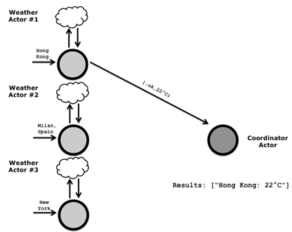{.calibre1}\

Figure 3.5 When the first result comes in, the actor saves the result in
a list.

Next, we check if the coordinator has received the correct number of
results expected. Let's assume not. In this case, the loop function
calls itself again. Notice the arguments to the recursive call to loop.
This time we pass in [`new_results`{.codeintext}]{.calibre34}, while
[`results_expected`{.codeintext}]{.calibre34} remains unchanged.

{.calibre1}\

Figure 3.6 When the coordinator receives the next message, it stores it
in the results list again.

This is how state is kept in an actor. The *copy* of the arguments are
modified, and then passed along into the loop function, where it would
be available during the next function call to itself.

[3.5.2[                     ]{.calibre13}]{.calibre24} [:exit -- The
Poison Pill Message]{.calibre24}

When the coordinator has received all the messages, it must find a way
to tell itself to stop, and report the results if necessary. A simple
way to do this is via a \"poison pill\" message (listing 3.25).

{.calibre1}\

Figure 3.7 When the coordinator receives the :exit message, it returns
the results in alphabetical order, and then exits.

Note that the [`:exit`{.codeintext}]{.calibre34} message  by itself is
not special. You can call it [`:kill`{.codeintext}]{.calibre34},
[`:self_destruct`{.codeintext}]{.calibre34}, or
[`:kaboom`{.codeintext}]{.calibre34}.

When the coordinator receives an [`:exit`{.codeintext}]{.calibre34}
message, it prints out the results lexicographically that are separated
by commas. Since we want to coordinator to exit, we do not have to call
the [`loop`{.codeintext}]{.calibre34} function (listing 3.25).

Listing 3.25 The poison pill message

`def loop(results \\ [], results_expected) do`{.codebcxspfirst}
`  receive do`{.codebcxspmiddle}
`    # ... other pattern omitted ...`{.codebcxspmiddle}
` `{.codebcxspmiddle} `    :exit ->`{.codebcxspmiddle}
`      IO.puts(results |> Enum.sort |> Enum.join(", ")) #1`{.codebcxspmiddle}
` `{.codebcxspmiddle}
`    # ... other pattern omitted ...`{.codebcxspmiddle}
`  end`{.codebcxspmiddle}`end`{.codebcxsplast}

#1 Print the results lexicographically, separated by commas

3.5.3[                     ]{.calibre13} Any Other Messages

Finally, we must take care of any other types of messages that the
coordinator can potentially receive. We capture these unwanted messages
with the [`_`{.codeintext}]{.calibre34} operator. Finally, we need to
remember to loop again, although we leave the arguments unmodified
(listing 3.26):

Listing 3.26 Matching all other messages

`def loop(results \\ [], results_expected) do`{.codebcxspfirst}
`  receive do`{.codebcxspmiddle}
`    # ... other patterns omitted ...`{.codebcxspmiddle}
`    _ ->                                #1`{.codebcxspmiddle}
`      loop(results, results_expected)   #2`{.codebcxspmiddle}
`  end`{.codebcxspmiddle}`end`{.codebcxsplast}

#1 Match every other kind of messages

#2 Loop again, leaving the arguments unmodified

3.5.4[                     ]{.calibre13} The Bigger Picture

Congratulations -- You have just written you first concurrent program in
Elixir! You used multiple processes to perform computations
concurrently. None of the processes had to wait for each other while
performing the computation, except for the coordinator process.

An important point to reinforce is that there is no shared memory. The
only way a change of state could occur within a process is when a
message is sent to it. This is different from threads, because threads
share memory. This means that multiple threads can modify the same
memory, an endless source of concurrency bugs (and headaches).

When designing your own concurrent programs, it is important to decide
the types of messages that the processes should receive and send, along
with the interations between processes. In our example program, I
decided to use [`{:ok, result}`{.codeintext}]{.calibre34} and
[`:exit`{.codeintext}]{.calibre34} for the coordinator process, and
`{sender_pid, location}`{.codeintext} for the worker process. I have
personally found it very helpful to sketch out the interactions between
the various processes along with the messages that are being sent and
received. Resist the temptation to dive right into coding and spend a
few minutes sketching. Doing this will save you hours of head-scratching
and cursing!

3.6[           ]{.calibre14} Exercises

Processes are fundamental to Elixir. You will gain a better
understanding only by running and experimenting with the code.

1.[  ]{.calibre16} Read the documentation for `send`{.codeintext} and
`receive`{.codeintext}. For `send`{.codeintext}, find out what are valid
destinations that you can send messages to. For `receive`{.codeintext},
study the example that the documentation provides.

2.[ ]{.calibre16} Read the documentation for `Process`{.codeintext}.

3.[ ]{.calibre16} Write a program that spawns two processes. The first
process, on receiving a `ping`{.codeintext} message, replies with a
`pong`{.codeintext} message. The second process, on receiving a
`pong`{.codeintext}, message replies with a `ping`{.codeintext} message
to the sender.

3.7[           ]{.calibre14} Summary

In this chapter, we covered the all-important topic of processes. You
were introduced to the Actor concurrency model. Through the example
application, we've learnt how to:

[·[     ]{.calibre16}]{.calibre12} Create processes

[·[     ]{.calibre16}]{.calibre12} Send and receive messages using
processes

[·[     ]{.calibre16}]{.calibre12} Concurrency can be achieved using
multiple processes

[·[     ]{.calibre16}]{.calibre12} Messages from worker processes can
collected and manipulated using another coordinator process

You have just been given a taste of concurrent programming in Elixir!
Have fun doing the exercises, and be sure to give your brain a little
break. See you in the next chapter, where we will learn about the
*secret sauce* of Elixir -- OTP!
:::

::: calibre2
::: {#ch03.html#ftn1 .calibre2}
[[**[[**[\[1\]]{.calibre29}**]{.msofootnotereference}]{.calibre28}**]{.msofootnotereference}](#ch03.html#uawOqHhyhtkQ2B699h55Lj4){#ch03.html#upz6AcFmGwE9eU3xCl8oqRD
.pcalibre1 .pcalibre2}
[http://www.erlang.org/doc/man/erl.html#max_processes]{.calibre30}
:::

::: {#ch03.html#ftn2 .calibre2}
[[**[[**[\[2\]]{.calibre29}**]{.msofootnotereference}]{.calibre28}**]{.msofootnotereference}](#ch03.html#uaLcTH2WZVUhi5sgnh6hkO7){#ch03.html#ufy3ItmzNMRjmsqbWuxUpMA
.pcalibre1 .pcalibre2}
[http://citeseerx.ist.psu.edu/viewdoc/download?doi=10.1.1.116.1969&rep=rep1&type=pdf]{.calibre30}
:::
:::

[]{#ch04.html}

::: wordsection
# 4[  ]{.calibre11} Writing Server Applications with GenServer {#ch04.html#heading_id_2 .cochapternumber}

This chapter covers: 

[·[     ]{.calibre13}]{.calibre12} OTP and why you should use it

[·[     ]{.calibre13}]{.calibre12} OTP behaviours

[·[     ]{.calibre13}]{.calibre12} Rewriting Metex to use the GenServer
OTP Behaviour

[·[     ]{.calibre13}]{.calibre12} Structuring your code to use
GenServer

[·[     ]{.calibre13}]{.calibre12} Handling synchronous and asynchronous
requests using callbacks

[·[     ]{.calibre13}]{.calibre12} Managing server state

[·[     ]{.calibre13}]{.calibre12} Cleanly stopping the server

[·[     ]{.calibre13}]{.calibre12} Registering the GenServer with a name

In this chapter, we begin by learning about OTP. OTP originally stood
for Open Telecom Platform. Coined by the marketing geniuses over at
Ericsson (I hope they don\'t read this!), it is now only being referred
to by its acronym. Part of the reason is because the naming is myopic.
The tools provided by OTP are in no way specific to the
telecommunications domain. Nonetheless, the naming stuck, for better or
worse. This just goes to show that naming is indeed one of the hardest
problems in Computer Science.  

We will learn what exactly OTP is. Then we will look at some of the
motivations that drove its creation. We will also see how OTP
*behaviours* help us build applications that reduce boilerplate code,
reduce potential concurrency bugs drastically and rely on code that has
benefited from the decades of hard-earned experience. 

Once we have understood the core principles of OTP, we will then learn
about one of the most important and common OTP behaviours -- the
GenServer. Short for Generic Server, the GenServer behaviour is an
abstraction of client/server functionality. We will take
`Metex`{.codeintext}, the temperature reporting application that we
built in Chapter 3, and turn it into a GenServer. By then, you would
have a firm grasp of how to implement your own GenServers.

4.1[          ]{.calibre14} What is OTP Exactly?

OTP is sometimes referred to as a framework, but that is not giving it
due credit. Instead, think of OTP as a complete development environment
for concurrent programming. To prove my point, here\'s a non-exhaustive
laundry list of the features that come with OTP:

[·[     ]{.calibre16}]{.calibre12} The Erlang interpreter and compiler

[·[     ]{.calibre16}]{.calibre12} Erlang standard libraries

[·[     ]{.calibre16}]{.calibre12} Dialyzer, a static analysis tool

[·[     ]{.calibre16}]{.calibre12} Mnesia, a distributed database

[·[     ]{.calibre16}]{.calibre12} Erlang Term Storage (ETS), an
in-memory database

[·[     ]{.calibre16}]{.calibre12} A debugger,

[·[     ]{.calibre16}]{.calibre12} An event tracer

[·[     ]{.calibre16}]{.calibre12} A release management tool 

We will encounter various pieces of OTP as we progress along the book.
For now, we will turn out attention to OTP behaviours.

4.2[          ]{.calibre14} OTP Behaviours 

Think of OTP behaviours as design patterns for processes. These
behaviours emerged from battle-tested production code, and have been
refined continuously ever since. Using OTP behaviours in your code helps
you by providing you the generic pieces of your code for free, leaving
you to implement the specific pieces of business logic.  

Take GenServer for example. GenServer provides you with client/server
functionality out of the box. In particular, it provides functionality
that in common to all servers. What are these common features?  They
are:

[·[     ]{.calibre16}]{.calibre12} Spawning the server process

[·[     ]{.calibre16}]{.calibre12} Maintaining state within the server

[·[     ]{.calibre16}]{.calibre12} Handling requests and sending
responses back

[·[     ]{.calibre16}]{.calibre12} Stopping the server process  

GenServer has got the generic side covered. You on the other hand, have
to provide the business logic. The specific logic that you need to
provide include: 

[·[     ]{.calibre16}]{.calibre12} The state that you want to initialize
the server with

[·[     ]{.calibre16}]{.calibre12} The kinds of messages the server
handles

[·[     ]{.calibre16}]{.calibre12} When to reply to the client

[·[     ]{.calibre16}]{.calibre12} What message to reply to the client

[·[     ]{.calibre16}]{.calibre12} What resources to clean up after
termination 

There are also other benefits. When you are building your server
application for example, how would you know that you have covered all
the necessary edge cases and concurrency issues that might crop up?
Furthermore, it would not be fun to have to understand different
implementations of server logic.

Take `worker.ex`{.codeintext} in the `Metex`{.codeintext} example. In my
programs that don\'t use the GenServer behaviour, I usually name the
main loop, well `loop`{.codeintext}. However, there is not stopping
anyone from naming it `await`{.codeintext}, `recur`{.codeintext} or even
something ridiculous like `while_1_true`{.codeintext}. Using the
GenServer behaviour releases me (and more likely the naming-challenged
developer) from the burden of having to think about these trivialities.

4.1.1[       ]{.calibre13} The Different OTP Behaviours 

The following table lists the common OTP behaviours that is provided out
of the box. OTP doesn't limit you to these four. In fact, you can
implement your own behaviours. However, it is imperative to understand
how to use the default ones well, because they cover most of the use
cases you would ever encounter.

Table 4.1 OTP Behaviours and the functionality they provide

+-----------------------------------+-----------------------------------+
| ::: calibre37                     | ::: calibre37                     |
| Behaviour                         | Description                       |
| :::                               | :::                               |
+-----------------------------------+-----------------------------------+
| GenServer                         | A behaviour module for            |
|                                   | implementing the server of a      |
|                                   | client-server relation.           |
+-----------------------------------+-----------------------------------+
| GenEvent                          | A behaviour module for            |
|                                   | implementing event handling       |
|                                   | functionality                     |
+-----------------------------------+-----------------------------------+
| Supervisor                        | A behaviour module for            |
|                                   | implementing supervision          |
|                                   | functionality                     |
+-----------------------------------+-----------------------------------+
| Application                       | A module for working with         |
|                                   | applications and defining         |
|                                   | application callbacks.            |
+-----------------------------------+-----------------------------------+

To make things more concrete, we can see for ourselves how these
behaviours fit together. For this, we need the Observer tool, provided
by OTP for free. Fire up `iex`{.codeintext}, and start Observer:

Listing 4. 1 Launching the Observer tool

`% iex`{.codebcxspfirst}
`iex(1)> :observer.start`{.codebcxspmiddle}`:ok`{.codebcxsplast}

When the window pops up, click on the "Applications" tab. You should see
something like this:

{.calibre1}\

Listing 4. 2 The Observer tool displaying the supervisor tree of the
Kernel application

On the left column is a list of OTP *applications* that were started
when iex was started. We will cover applications in the next chapter.
For now, you can think of them as self-contained programs. Clicking on
each option in the left column reveals the *supervisor* hierarchy for
that application. For example, the above diagram shows the supervisor
hierarchy for the `kernel`{.codeintext} application, which is the very
first application started, even before the `elixir`{.codeintext}
application starts.

If you look closely, you will notice that the supervisors have a
`sup`{.codeintext} appended*.* `kernel_sup`{.codeintext} for example
supervises ten other processes. These processes could be GenServers
(`code_server`{.codeintext} and `file_server`{.codeintext} for example)
or even other Supervisors (`kernel_safe_sup`{.codeintext} and
`standard_error_sup`{.codeintext}).

Behaviours like the GenServer and GenEvent are the *workers* -- they
contain most of the business logic, and do most of the heavy lifting.
You will learn more about them as we progress along. Supervisors at
exactly what they sound: They take care of processes under them and take
action when something bad happens. Let's make everything more concrete
by starting with the most frequently used OTP behaviour -- GenServer.

4.3[          ]{.calibre14} Hands On OTP: Revisiting Metex 

Using GenServer as an example we will go about implementing an OTP
behaviour. We will re-implement `Metex`{.codeintext}, our weather
application in Chapter 3. Only this time, we will implement it using the
GenServer behaviour. 

In case you need a refresher, `Metex`{.codeintext} reports the
temperature in Celsius given a location such as the name of a city. This
is done through a HTTP call to a third party weather service. We will
add other bells and whistles to illustrate the various GenServer
concepts such as keeping state and process registration. For example, we
will be tracking the frequency of valid locations requested.

Pieces of functionality that was discussed in Chapter 3 will be skipped.
In order words, if all this sounds new to you, now would be the perfect
time to start on Chapter 3! Once we have completed the application, we
will then take a step back and compare the approaches in Chapter 3 and
Chapter 4. Let's get started!

4.1.2[       ]{.calibre13} Creating a New Project

As usual, create a new project. Remember to place your old version of
`Metex`{.codeintext} in another directory first!

`% mix new metex`{.codeb}

In `mix.exs`{.codeintext}, fill up the `application`{.codeintext} and
`deps`{.codeintext} like so:

Listing 4. 3 Project setup

`defmodule Metex.Mixfile do`{.codebcxspfirst}
`  use Mix.Project`{.codebcxspmiddle} ` `{.codebcxspmiddle}
`  # ...`{.codebcxspmiddle} ` `{.codebcxspmiddle}
`  def application do`{.codebcxspmiddle}
`    [applications: [:logger, :httpoison]]`{.codebcxspmiddle}
`  end`{.codebcxspmiddle} ` `{.codebcxspmiddle}
`  defp deps do`{.codebcxspmiddle} `    [`{.codebcxspmiddle}
`      {:httpoison, "~> 0.9.0"},`{.codebcxspmiddle}
`      {:json,      "~> 0.3.0"}`{.codebcxspmiddle}
`    ]`{.codebcxspmiddle} `  end`{.codebcxspmiddle}
` `{.codebcxspmiddle}`end`{.codebcxsplast}

We then need to get our dependencies. In the terminal, use the
`mix deps.get`{.codeintext} command to do just that.

4.1.3[       ]{.calibre13} Making The Worker GenServer Compliant

We begin with the workhorse of the application, the worker. In
`lib/worker.ex`{.codeintext}, we first declare a new module and specify
that we want to make use of the GenServer behaviour:

Listing 4. 4 Using the GenServer behaviour

`defmodule Metex.Worker do`{.codebcxspfirst}
`  use GenServer #1`{.codebcxspmiddle}
` `{.codebcxspmiddle}`end`{.codebcxsplast}

#1 Automatically define all the callbacks required for the GenServer

Simply having `use GenServer`{.codeintext}, Elixir automatically defines
all the callbacks needed by the GenServer. This means that you get to
pick and choose which callbacks you want to implement. What exactly are
these callbacks? Glad you asked.

4.1.4[       ]{.calibre13} Callbacks

There are exactly six callbacks that are automatically defined for you.
Here\'s the entire list:

[`·`{.codeintext}[`     `{.codeintext}]{.calibre16}]{.calibre12}
`init(args)`{.codeintext}

[`·`{.codeintext}[`     `{.codeintext}]{.calibre16}]{.calibre12}
`handle_call(msg, {from, ref}, state}`{.codeintext}

[`·`{.codeintext}[`     `{.codeintext}]{.calibre16}]{.calibre12}
`handle_cast(msg, state}`{.codeintext}

[`·`{.codeintext}[`     `{.codeintext}]{.calibre16}]{.calibre12}
`handle_info(msg, state)`{.codeintext}

[`·`{.codeintext}[`     `{.codeintext}]{.calibre16}]{.calibre12}
`terminate(reason, state)`{.codeintext}

[`·`{.codeintext}[`     `{.codeintext}]{.calibre16}]{.calibre12}
`code_change(old_vsn, state, extra)`{.codeintext}

Before we go any further, it helps to remind ourselves *why* are we even
bothering to make the worker a GenServer, especially since (as you will
see soon) you need to learn about the various callback functions and
proper return values.

The biggest benefit that using OTP gives you is all the things that you
do *not* have to worry about when you write your own client-server
programs or supervisors. For example, how would you write a function
that makes an asynchronous request? What about a synchronous one? The
GenServer behaviour provides `handle_cast/2`{.codeintext} and
`handle_call/3`{.codeintext} for that exact use case.

Your process has to handle different kinds of messages. As the kinds of
messages grow, a hand-rolled process might grow unwieldy. Once again,
GenServer's various `handle_*`{.codeintext} functions provide a neat way
to specify the different kinds of messages that you want to handle.
Receiving messages is just half the equation. You also need a way to
handle replies. As expected, the callbacks have got your back (pun
intended!) since it makes it convenient to access to pid of the sender
process.

Now let's think about state management. Every process needs a way to
initialize state. It also needs a way to potentially perform some
cleanup before the process is terminated. GenServer's
`init/1`{.codeintext} and `terminate/2`{.codeintext} are just the
callbacks you need.

Recall that in the previous chapter how we managed state using a
recursive loop and passing the (potentially) modified state into the
next invocation of that loop. The return value of the different
callbacks will affect the states. Hand-rolling this in a non-trivial
process results in clumsy looking code.

Using a GenServer also makes it easy to be plugged into say, a
Supervisor. A nice thing about writing programs that conform to OTP
behaviours is that they tend to look similar. This means that if you
were to look at someone else's GenServer you most probably would easily
tell which are the messages that it can handle and what replies it can
give, and whether the replies are synchronous or asynchronous.

Now you know some of the benefits of simply having to type
`use GenServer`{.codeintext}. Elixir automatically defines all the
callbacks needed by the GenServer. In Erlang, you would have to specify
quite a bit of boilerplate. This means that you get to pick and choose
which callbacks you want to implement. What exactly are these callbacks?
Glad you asked.

Table 4.2 GenServer functions on the left call the callback functions,
defined in Metex.Worker, on the right

+-----------------------------------+-----------------------------------+
| ::: calibre37                     | ::: calibre37                     |
| GenServer Module calls ...        | Callback Module (Implemented in   |
| :::                               | Metex.Worker)                     |
|                                   | :::                               |
+-----------------------------------+-----------------------------------+
| `GenS                             | `Metex.init/1`{.codeintable}      |
| erver.start_link/3`{.codeintable} |                                   |
+-----------------------------------+-----------------------------------+
| `GenServer.call/3`{.codeintable}  | `M                                |
|                                   | etex.handle_call/3`{.codeintable} |
+-----------------------------------+-----------------------------------+
| `GenServer.cast/2`{.codeintable}  | `M                                |
|                                   | etex.handle_cast/2`{.codeintable} |
+-----------------------------------+-----------------------------------+

Each callback expects a return value that conforms to what GenServer
expects. Here\'s a table that summarizes the callbacks, the functions
that call them, and the expected return value. You will find the table
especially helpful when you need to figure out the exact return values
that each callback expects. I find myself referring to this table
constantly.

Table 4.3 GenServer callbacks and their expected return values

+-----------------------------------+-----------------------------------+
| ::: calibre37                     | ::: calibre37                     |
| Callbacks                         | Expected Return Value             |
| :::                               | :::                               |
+-----------------------------------+-----------------------------------+
| [`init(                           | [`·`{.codeintable}[`    `{.codei  |
| args)`{.codeintable}]{.calibre43} | ntable}]{.calibre16}]{.calibre44} |
|                                   | [`{:ok, s                         |
| [` `{.codeintable}]{.calibre25}   | tate}`{.codeintable}]{.calibre43} |
|                                   |                                   |
|                                   | [`·`{.codeintable}[`    `{.codei  |
|                                   | ntable}]{.calibre16}]{.calibre44} |
|                                   | [`{:ok, state, tim                |
|                                   | eout}`{.codeintable}]{.calibre43} |
|                                   |                                   |
|                                   | [`·`{.codeintable}[`    `{.codei  |
|                                   | ntable}]{.calibre16}]{.calibre44} |
|                                   | [`:i                              |
|                                   | gnore`{.codeintable}]{.calibre43} |
|                                   |                                   |
|                                   | [`·`{.codeintable}[`    `{.codei  |
|                                   | ntable}]{.calibre16}]{.calibre44} |
|                                   | [`{:stop, re                      |
|                                   | ason}`{.codeintable}]{.calibre43} |
+-----------------------------------+-----------------------------------+
| [`handle_call(msg, {from, ref},s  | [`·`{.codeintable}[`    `{.codei  |
| tate)`{.codeintable}]{.calibre43} | ntable}]{.calibre16}]{.calibre44} |
|                                   | [`{:reply, reply, s               |
| [` `{.codeintable}]{.calibre25}   | tate}`{.codeintable}]{.calibre43} |
|                                   |                                   |
|                                   | [`·`{.codeintable}[`    `{.codei  |
|                                   | ntable}]{.calibre16}]{.calibre44} |
|                                   | [`{:reply, reply, state, tim      |
|                                   | eout}`{.codeintable}]{.calibre43} |
|                                   |                                   |
|                                   | [`·`{.codeintable}[`    `{.codei  |
|                                   | ntable}]{.calibre16}]{.calibre44} |
|                                   | [`{:reply, reply, state, :hiber   |
|                                   | nate}`{.codeintable}]{.calibre43} |
|                                   |                                   |
|                                   | [`·`{.codeintable}[`    `{.codei  |
|                                   | ntable}]{.calibre16}]{.calibre44} |
|                                   | [`{:noreply, s                    |
|                                   | tate}`{.codeintable}]{.calibre43} |
|                                   |                                   |
|                                   | [`·`{.codeintable}[`    `{.codei  |
|                                   | ntable}]{.calibre16}]{.calibre44} |
|                                   | [`{:noreply, state, tim           |
|                                   | eout}`{.codeintable}]{.calibre43} |
|                                   |                                   |
|                                   | [`·`{.codeintable}[`    `{.codei  |
|                                   | ntable}]{.calibre16}]{.calibre44} |
|                                   | [`{:noreply, state, hiber         |
|                                   | nate}`{.codeintable}]{.calibre43} |
|                                   |                                   |
|                                   | [`·`{.codeintable}[`    `{.codei  |
|                                   | ntable}]{.calibre16}]{.calibre44} |
|                                   | [`{:stop, reason, reply, s        |
|                                   | tate}`{.codeintable}]{.calibre43} |
|                                   |                                   |
|                                   | [`·`{.codeintable}[`    `{.codei  |
|                                   | ntable}]{.calibre16}]{.calibre44} |
|                                   | [`{:stop, reason, s               |
|                                   | tate}`{.codeintable}]{.calibre43} |
+-----------------------------------+-----------------------------------+
| [`handle_cast(msg, s              | [`·`{.codeintable}[`    `{.codei  |
| tate)`{.codeintable}]{.calibre43} | ntable}]{.calibre16}]{.calibre44} |
|                                   | [`{:noreply, s                    |
| [` `{.codeintable}]{.calibre25}   | tate}`{.codeintable}]{.calibre43} |
|                                   |                                   |
|                                   | [`·`{.codeintable}[`    `{.codei  |
|                                   | ntable}]{.calibre16}]{.calibre44} |
|                                   | [`{:noreply, state, tim           |
|                                   | eout}`{.codeintable}]{.calibre43} |
|                                   |                                   |
|                                   | [`·`{.codeintable}[`    `{.codei  |
|                                   | ntable}]{.calibre16}]{.calibre44} |
|                                   | [`{:noreply, state, :hiber        |
|                                   | nate}`{.codeintable}]{.calibre43} |
|                                   |                                   |
|                                   | [`·`{.codeintable}[`    `{.codei  |
|                                   | ntable}]{.calibre16}]{.calibre44} |
|                                   | [`{:stop, reason, s               |
|                                   | tate}`{.codeintable}]{.calibre43} |
+-----------------------------------+-----------------------------------+
| [`handle_info(msg, st             | [`·`{.codeintable}[`    `{.codei  |
| ate) `{.codeintable}]{.calibre43} | ntable}]{.calibre16}]{.calibre44} |
|                                   | [`{:noreply, s                    |
| [` `{.codeintable}]{.calibre25}   | tate}`{.codeintable}]{.calibre43} |
|                                   |                                   |
|                                   | [`·`{.codeintable}[`    `{.codei  |
|                                   | ntable}]{.calibre16}]{.calibre44} |
|                                   | [`{:noreply, state, tim           |
|                                   | eout}`{.codeintable}]{.calibre43} |
|                                   |                                   |
|                                   | [`·`{.codeintable}[`    `{.codei  |
|                                   | ntable}]{.calibre16}]{.calibre44} |
|                                   | [`{:stop, reason, s               |
|                                   | tate}`{.codeintable}]{.calibre43} |
+-----------------------------------+-----------------------------------+
| [`terminate(reason, st            | [`·`{.codeintable}[`    `{.codei  |
| ate) `{.codeintable}]{.calibre43} | ntable}]{.calibre16}]{.calibre44} |
|                                   | [                                 |
| [` `{.codeintable}]{.calibre25}   | `:ok.`{.codeintable}]{.calibre43} |
|                                   |                                   |
|                                   | [` `{.codeintable}]{.calibre25}   |
+-----------------------------------+-----------------------------------+
| [`code_change(old_vsn, state, e   | [`·`{.codeintable}[`    `{.codei  |
| xtra)`{.codeintable}]{.calibre43} | ntable}]{.calibre16}]{.calibre44} |
|                                   | [`{:ok, new_s                     |
| [` `{.codeintable}]{.calibre25}   | tate}`{.codeintable}]{.calibre43} |
|                                   |                                   |
|                                   | [`·`{.codeintable}[`    `{.codei  |
|                                   | ntable}]{.calibre16}]{.calibre44} |
|                                   | [`{:error, re                     |
|                                   | ason}`{.codeintable}]{.calibre43} |
+-----------------------------------+-----------------------------------+

`init(args)`{.codeintext} is invoked when
`GenServer.start_link/3`{.codeintext} is called. Let\'s see that in
code:

Listing 4. 5 Structuring the code with client API, server callbacks and
helper functions

`defmodule Metex.Worker do`{.codebcxspfirst}
`  use GenServer`{.codebcxspmiddle} ` `{.codebcxspmiddle}
`  ## Client API`{.codebcxspmiddle} ` `{.codebcxspmiddle}
`  def start_link(opts \\ []) do                `{.codebcxspmiddle}
`    GenServer.start_link(__MODULE__, :ok, opts)`{.codebcxspmiddle}
`  end`{.codebcxspmiddle} ` `{.codebcxspmiddle}
`  ## Server Callbacks`{.codebcxspmiddle} ` `{.codebcxspmiddle}
`  def init(:ok) do`{.codebcxspmiddle}
`    {:ok, %{}}`{.codebcxspmiddle} `  end`{.codebcxspmiddle}
` `{.codebcxspmiddle} ` ## Helper Functions`{.codebcxspmiddle}
` `{.codebcxspmiddle}`end`{.codebcxsplast}

Here, I have demarcated, by way of comments, the different sections of
code. You will usually find Elixir/Erlang programs in the wild follow a
similar convention. Since we haven't introduced any helper functions
just yet, the "Helper Functions" section has been left unfilled.

start_link/3 and init/1

`GenServer.start_link/3`{.codeintext} takes in the module name of the
GenServer implementation where the `init/1`{.codeintext} callback is
defined. It starts the process and also links the server process to the
parent process. This means that if the server process fails for some
reason, the parent process would be notified.

The second argument is for arguments to be passed to
`init/1`{.codeintext}. Since we do not require any, an
`:ok`{.codeintext} suffices.

The final argument is a list of options to be passed to
`GenServer.start_link/3`{.codeintext}. These options include defining a
name to register the process with and to enable extra debugging
information. For now, we can pass in an empty list.

When `GenServer.start_link/3`{.codeintext} is called, it invokes
`Metex.init/1`{.codeintext}. It waits until Metex.init/1 has returned,
before returning. What are valid return values of
`Metex.init/1`{.codeintext}? Consulting the table, we get the following
four values:

[`·`{.codeintext}[`     `{.codeintext}]{.calibre16}]{.calibre12}
`{:ok, state}`{.codeintext}

[`·`{.codeintext}[`     `{.codeintext}]{.calibre16}]{.calibre12}
`{:ok, state, timeout}`{.codeintext}

[`·`{.codeintext}[`     `{.codeintext}]{.calibre16}]{.calibre12}
`:ignore`{.codeintext}

[`·`{.codeintext}[`     `{.codeintext}]{.calibre16}]{.calibre12}
`{:stop, reason}`{.codeintext}

For now, we go for the simplest, `{:ok state}`{.codeintext}. Looking at
our implementation, `state`{.codeintext} in this case is initialized to
an empty Map, `%{}`{.codeintext}. We need this map to keep the frequency
of requested locations.

Let\'s give this a spin! Open up your console and launch
`iex`{.codeintext} like so:

`% iex -S mix`{.codeb}

Let\'s now start a server process and link it to the calling process. In
this case, it\'s the shell process:

Listing 4.6 Starting the server process

`iex(1)> {:ok, pid} = Metex.Worker.start_link`{.codebcxspfirst}
`{:ok, #PID<0.134.0>}`{.codebcxsplast}

The result is a two-element tuple, and `:ok`{.codeintext} and the pid of
the new server process.

4.1.5[       ]{.calibre13} Handling Synchronous Requests with
handle_call/3

Let\'s head back to the code. Now, we want to have our server process
handle requests, which is the whole point of having a server process.
Let\'s start from the the client API and work downwards.

Listing 4.7 Implementing a synchronous request with GenServer.call/3

`defmodule Metex.Worker do`{.codebcxspfirst}
`  use GenServer`{.codebcxspmiddle} ` `{.codebcxspmiddle}
`  ## Client API`{.codebcxspmiddle} ` `{.codebcxspmiddle}
`  # ...`{.codebcxspmiddle} ` `{.codebcxspmiddle}
`  def get_temperature(pid, location) do`{.codebcxspmiddle}
`    GenServer.call(pid, {:location, location})`{.codebcxspmiddle}
`  end`{.codebcxspmiddle} ` `{.codebcxspmiddle}
`  ## Server API`{.codebcxspmiddle} ` `{.codebcxspmiddle}
`  # ...`{.codebcxspmiddle} ` `{.codebcxspmiddle}`end`{.codebcxsplast}

Here's how a client might retrieve the temperature of Singapore:

`Metex.Worker.get_temperature(pid, "Singapore").`{.codeb}

The above functions wraps a call to `GenServer.call/3`{.codeintext},
passing in the pid, and a tuple that is tagged `:location`{.codeintext}
and the actual `location`{.codeintext}. In turn,
`GenServer.call/3`{.codeintext} expects a `handle_call/3`{.codeintext}
defined in the `Metex.Worker`{.codeintext} module and invoke it
accordingly.

`GenServer.call/3`{.codeintext} makes a *synchronous* request to the
server. This means that a reply from the server is expected. The sibling
to `GenServer.call/3`{.codeintext} is `GenServer.cast/2`{.codeintext},
which makes an *asynchronous* request to the server. We will take a look
at that shortly. For now, here\'s the implementation of the
`handle_call/3`{.codeintext} for the
`{:location, location}`{.codeintext} message:

Listing 4.8 Implementing the handle_call callback

`defmodule Metex.Worker do`{.codebcxspfirst}
`  use GenServer`{.codebcxspmiddle} ` `{.codebcxspmiddle}
`  ## Client API`{.codebcxspmiddle} ` `{.codebcxspmiddle}
`  # ...`{.codebcxspmiddle} ` `{.codebcxspmiddle}
`  def get_temperature(pid, location) do`{.codebcxspmiddle}
`    GenServer.call(pid, {:location, location})`{.codebcxspmiddle}
`  end`{.codebcxspmiddle} ` `{.codebcxspmiddle}
`  ## Server API`{.codebcxspmiddle} ` `{.codebcxspmiddle}
`  # ...`{.codebcxspmiddle} ` `{.codebcxspmiddle}
`  def handle_call(#1{:location, location}, #2_from, #3stats) do`{.codebcxspmiddle}
`    case temperature_of(location) do`{.codebcxspmiddle}
`      {:ok, temp} ->`{.codebcxspmiddle}
`        new_stats = update_stats(stats, location)`{.codebcxspmiddle}
`        {:reply, "#{temp}°C", new_stats}`{.codebcxspmiddle}
` `{.codebcxspmiddle} `      _ ->`{.codebcxspmiddle}
` `{.codebcxspmiddle}
`        {:reply, :error, stats} `{.codebcxspmiddle}
`    end`{.codebcxspmiddle} `  end`{.codebcxspmiddle}
` `{.codebcxspmiddle}`end`{.codebcxsplast}

#1: The expected request to be handled

#2: This is in fact a tuple in the form of {pid, tag} which represents
the pid of the sender and the message's unique reference

#3: The current state of the GenServer

Let\'s first take a closer look at the function signature:

`def handle_call({:location, location}, _from, stats) do`{.codebcxspfirst}
`  # ...`{.codebcxspmiddle}`end`{.codebcxsplast}

The first argument declares the expected request to be handled. The
second argument returns a tuple in the form of
`{pid, tag}`{.codeintext}, where the `pid`{.codeintext} is the pid of
the client, and `tag`{.codeintext} is a unique reference of the message.
The third argument, `state`{.codeintext}, represents the *internal
state* of the server. In our case, it is the current frequency counts of
valid locations.

Now, let\'s turn out attention to the body of
`handle_call({:location, location}, ...})`{.codeintext}:

`def handle_call({:location, location}, _from, stats) do`{.codebcxspfirst}
`  case temperature_of(location) do              #1`{.codebcxspmiddle}
`    {:ok, temp} ->            `{.codebcxspmiddle}
`      new_stats = update_stats(stats, location) #2`{.codebcxspmiddle}
`      {:reply, "#{temp}°C", new_stats}          #3`{.codebcxspmiddle}
` `{.codebcxspmiddle} `    _ ->`{.codebcxspmiddle}
`      {:reply, :error, stats}                   #3`{.codebcxspmiddle}
`  end`{.codebcxspmiddle}`end`{.codebcxsplast}

#1: Makes a request to the API for location\'s temperature

#2: Update the \`stats\` Map with the location frequency

#3: Return a three-element tuple as a response.

`Metex.Worker.temperature_of/1`{.codeintext} makes a request to the
third-party API to get the location\'s temperature. If it succeeds,
`Metex.Worker.update_stats/2`{.codeintext} is invoked to return a new
Map with the updated frequency of location. Finally, it returns a
three-element tuple that any `handle_call/3`{.codeintext} is expected to
return.

In particular, this three-element tuple begins with a
`:reply`{.codeintext}, followed by the actual computed responses,
followed by the update state, which in this case is
`new_stats`{.codeintext}. If the request to the third-party API fails
for some reason or another, then `{:reply, :error, stats}`{.codeintext}
is returned. Here are the valid responses of a
`handle_call/3`{.codeintext}:

[`·`{.codeintext}[`     `{.codeintext}]{.calibre16}]{.calibre12}
`{:reply, reply, state}`{.codeintext}

[`·`{.codeintext}[`     `{.codeintext}]{.calibre16}]{.calibre12}
`{:reply, reply, state, timeout}`{.codeintext}

[`·`{.codeintext}[`     `{.codeintext}]{.calibre16}]{.calibre12}
`{:reply, reply, state, :hibernate}`{.codeintext}

[`·`{.codeintext}[`     `{.codeintext}]{.calibre16}]{.calibre12}
`{:noreply, state}`{.codeintext}

[`·`{.codeintext}[`     `{.codeintext}]{.calibre16}]{.calibre12}
`{:noreply, state, timeout}`{.codeintext}

[`·`{.codeintext}[`     `{.codeintext}]{.calibre16}]{.calibre12}
`{:noreply, state, hibernate}`{.codeintext}

[`·`{.codeintext}[`     `{.codeintext}]{.calibre16}]{.calibre12}
`{:stop, reason, reply, state}`{.codeintext}

[`·`{.codeintext}[`     `{.codeintext}]{.calibre16}]{.calibre12}
`{:stop, reason, state}`{.codeintext}

Let\'s fill in the missing pieces in order to get
`Metex.Worker.get_temperature/2`{.codeintext} to work:

Listing 4.9 Implementing the helper functions

`defmodule Metex.Worker do`{.codebcxspfirst}
`  use GenServer`{.codebcxspmiddle} ` `{.codebcxspmiddle}
`  ## Client API and Server API`{.codebcxspmiddle} ` `{.codebcxspmiddle}
`  ## previously implemented code`{.codebcxspmiddle}
` `{.codebcxspmiddle} ` `{.codebcxspmiddle}
`  ## Helper Functions`{.codebcxspmiddle} ` `{.codebcxspmiddle}
`  defp temperature_of(location) do`{.codebcxspmiddle}
`    url_for(location) |> HTTPoison.get |> parse_response`{.codebcxspmiddle}
`  end`{.codebcxspmiddle} ` `{.codebcxspmiddle}
`  defp url_for(location) do`{.codebcxspmiddle}
`    "http://api.openweathermap.org/data/2.5/weather?q=#{location}&APPID=#{apikey}"`{.codebcxspmiddle}
`  end`{.codebcxspmiddle} ` `{.codebcxspmiddle}
`  defp parse_response({:ok, %HTTPoison.Response{body: body, status_code: 200}}) do`{.codebcxspmiddle}
`    body |> JSON.decode! |> compute_temperature`{.codebcxspmiddle}
`  end`{.codebcxspmiddle} ` `{.codebcxspmiddle}
`  defp parse_response(_) do`{.codebcxspmiddle}
`    :error`{.codebcxspmiddle} `  end`{.codebcxspmiddle}
` `{.codebcxspmiddle}
`  defp compute_temperature(json) do`{.codebcxspmiddle}
`    try do`{.codebcxspmiddle}
`      temp = (json["main"]["temp"] - 273.15) |> Float.round(1)`{.codebcxspmiddle}
`      {:ok, temp}`{.codebcxspmiddle} `    rescue`{.codebcxspmiddle}
`      _ -> :error`{.codebcxspmiddle} `    end`{.codebcxspmiddle}
`  end`{.codebcxspmiddle} ` `{.codebcxspmiddle}
`  def apikey do`{.codebcxspmiddle}
`    “APIKEY-GOES-HERE”`{.codebcxspmiddle} `  end`{.codebcxspmiddle}
` `{.codebcxspmiddle}
`  defp update_stats(old_stats, location) do`{.codebcxspmiddle}
`    case Map.has_key?(old_stats, location) do`{.codebcxspmiddle}
`      true ->`{.codebcxspmiddle}
`        Map.update!(old_stats, location, &(&1 + 1))`{.codebcxspmiddle}
`      false ->`{.codebcxspmiddle}
`        Map.put_new(old_stats, location, 1)`{.codebcxspmiddle}
`    end`{.codebcxspmiddle} `  end`{.codebcxspmiddle}
` `{.codebcxspmiddle}`end`{.codebcxsplast}

Most of the implementation is the same as Chapter 3, except for minor
changes to `Metex.Worker.temperature_of/1`{.codeintext} and
`Metex.Worker.update_stats/2`{.codeintext}, which are completely new.
The implementation of `Metex.Worker.update_stats/2`{.codeintext} is
pretty simple:

Listing 4.10 Updating the frequency of a requested location

`defp update_stats(old_stats, location) do`{.codebcxspfirst}
`  case Map.has_key?(old_stats, location) do`{.codebcxspmiddle}
`    true ->`{.codebcxspmiddle}
`      Map.update!(old_stats, location, &(&1 + 1))`{.codebcxspmiddle}
`    false ->`{.codebcxspmiddle}
`      Map.put_new(old_stats, location, 1)`{.codebcxspmiddle}
`  end`{.codebcxspmiddle}`end`{.codebcxsplast}

This function takes in the `old_stats`{.codeintext} and the
`location`{.codeintext} requested. We first check if
`old_stats`{.codeintext} contains the location of the key. If so, we can
simply fetch the value and increment the counter. Otherwise, we put in a
new key called denoted by `location`{.codeintext} and set it to
`1`{.codeintext}. If the `&(&1 + 1)`{.codeintext} seems confusing, you
can do a syntactical \"unsugaring\" in your head:

`Map.update!(old_stats, location, fn(val) -> val + 1 end)`{.codeb}

Let\'s take `Metex.Worker`{.codeintext} out for another spin. Once
again, fire up `iex`{.codeintext}, the start the server with
`Metex.Worker.start_link/1`{.codeintext}:

`% iex -S mix                                                             `{.codebcxspfirst}
`iex(1)> {:ok, pid} = Metex.Worker.start_link`{.codebcxspmiddle}`{:ok, #PID<0.125.0>}]`{.codebcxsplast}

Now, let\'s get the temperatures from a few famous locations:

`iex(2)> Metex.Worker.get_temperature(pid, "Babylon")`{.codebcxspfirst}
`"12.7°C"`{.codebcxspmiddle}
`iex(3)> Metex.Worker.get_temperature(pid, "Amarillo")`{.codebcxspmiddle}
`"5.3°C"`{.codebcxspmiddle}
`iex(4)> Metex.Worker.get_temperature(pid, "Memphis")`{.codebcxspmiddle}
`"7.3°C"`{.codebcxspmiddle}
`iex(5)> Metex.Worker.get_temperature(pid, "Rio")`{.codebcxspmiddle}
`"23.5°C"`{.codebcxspmiddle}
`iex(6)> Metex.Worker.get_temperature(pid, "Philadelphia")`{.codebcxspmiddle}`"12.5°C"`{.codebcxsplast}

4.1.6[       ]{.calibre13} Accessing the Server State

Success! But wait, how do I get to see the contents of
`stat`{.codeintext}? In other words, how do we access the *server
state*? Turns out, it is not hard. Let\'s implement the client facing
API first:

`def get_stats(pid) do`{.codebcxspfirst}
`  GenServer.call(pid, :get_stats)`{.codebcxspmiddle}`end`{.codebcxsplast}

Since we expect a reply from the server, we need a synchronous reply
from the server. Therefore, we should invoke
`GenServer.call/3`{.codeintext}. Here, we are saying that the server
should handle a synchronous `:get_stats`{.codeintext} message. Notice
that messages can come in the form of any valid Elixir term. This means
that tuples, lists and atoms are all fair game. Here\'s the callback
function:

`def handle_call(:get_stats, _from, stats) do`{.codebcxspfirst}
`  {:reply, stats, stats} `{.codebcxspmiddle}`end`{.codebcxsplast}

Since we are interested in `stats`{.codeintext}, we can simply return
`stats`{.codeintext} in the second argument as the reply. Since we are
simply accessing `stats`{.codeintext}, as opposed to modifying it, we
simply pass it along unchanged as the third argument.

Before we continue, here is a gentle reminder to *group* all your
`handle_call`{.codeintext}s (and later on, `handle_cast`{.codeintext}s)
together! This is important because the Erlang virtual machine relies on
this for pattern matching. For example, if I were to \"misplace\"
`handle_call`{.codeintext}s like so:

Listing 4.11 Notice that the handle_calls are not grouped together

`defmodule Metex.Worker do`{.codebcxspfirst}
`  use GenServer`{.codebcxspmiddle} ` `{.codebcxspmiddle}
`  ## Client API`{.codebcxspmiddle} ` `{.codebcxspmiddle}
`  # ...`{.codebcxspmiddle} ` `{.codebcxspmiddle}
`  ## Server Callbacks`{.codebcxspmiddle} ` `{.codebcxspmiddle}
`  def handle_call(:get_stats, _from, stats) do # 1`{.codebcxspmiddle}
`    # ...`{.codebcxspmiddle} `  end`{.codebcxspmiddle}
` `{.codebcxspmiddle} `  def init(:ok) do`{.codebcxspmiddle}
`    # ...`{.codebcxspmiddle} `  end`{.codebcxspmiddle}
` `{.codebcxspmiddle}
`  def handle_call({:location, location}, _from, stats) do`{.codebcxspmiddle}
`    # ...`{.codebcxspmiddle} `  end`{.codebcxspmiddle}
` `{.codebcxspmiddle} `  ## Helper Functions`{.codebcxspmiddle}
` `{.codebcxspmiddle} `  # ...`{.codebcxspmiddle}`end`{.codebcxsplast}

#1: handle_calls and handle_casts should be grouped together

The compiler will then issue a friendly warning:

`% iex -S mix`{.codebcxspfirst}
` `{.codebcxspmiddle}`lib/worker.ex:29: warning: clauses for the same def should be grouped together, def handle_call/3 was previously defined (lib/worker.ex:20)`{.codebcxsplast}

4.1.7[       ]{.calibre13} Handling Asynchronous Requests with
handle_cast/2

Asynchronous requests do not require a reply from the server. This also
means that a `GenServer.cast/2`{.codeintext} returns immediately. What
is a good use case for `GenServer.cast/2`{.codeintext}? A fine example
would be a command that is issued to a server, which causes some side
effect in the server\'s state. In that case, the client issuing the
command shouldn\'t have to care about a reply.

Let\'s construct such a command. This command, called
`reset_stats`{.codeintext}, will re-initialize stats back to an empty
Map:

Listing 4. 12 Handling resetting of stats

`# Client API`{.codebcxspfirst} ` `{.codebcxspmiddle}
`# ...`{.codebcxspmiddle} ` `{.codebcxspmiddle}
`def reset_stats(pid) do`{.codebcxspmiddle}
`  GenServer.cast(pid, :reset_stats)`{.codebcxspmiddle}
`end`{.codebcxspmiddle} ` `{.codebcxspmiddle}
`# Server Callbacks`{.codebcxspmiddle} ` `{.codebcxspmiddle}
`# handle_calls go here`{.codebcxspmiddle} ` `{.codebcxspmiddle}
`def handle_cast(:reset_stats, _stats) do`{.codebcxspmiddle}
`  {:noreply, %{}}`{.codebcxspmiddle}`end`{.codebcxsplast}

`Metex.Worker.stats/1`{.codeintext} will make a call to
`GenServer.cast/2`{.codeintext}. This in turn invokes the
`handle_cast(:reset_stats, _stats)`{.codeintext} callback. Since we do
not care about the current state of the server (after all, we are
resetting it), we prepend an underscore to `stats`{.codeintext}.

The return value is a two-element tuple with `:noreply`{.codeintext} as
the first element and an empty Map, the response, as the second
argument. Again notice that the response is one of the valid
`handle_cast/2`{.codeintext} responses.

Let\'s see our handiwork! Fire up `iex -S mix`{.codeintext} again, and
try out a couple of locations:

`iex(1)> {:ok, pid} = Metex.Worker.start_link`{.codebcxspfirst}
`{:ok, #PID<0.134.0>}`{.codebcxspmiddle}
`iex(2)> Metex.Worker.get_temperature pid, "Singapore"`{.codebcxspmiddle}
`"29.0°C"`{.codebcxspmiddle}
`iex(3)> Metex.Worker.get_temperature pid, "Malaysia"`{.codebcxspmiddle}
`"22.7°C"`{.codebcxspmiddle}
`iex(4)> Metex.Worker.get_temperature pid, "Brunei"`{.codebcxspmiddle}
`"24.2°C"`{.codebcxspmiddle}
`iex(5)> Metex.Worker.get_temperature pid, "Singapore"`{.codebcxspmiddle}
`"29.0°C"`{.codebcxspmiddle}
`iex(6)> Metex.Worker.get_temperature pid, "Cambodia"`{.codebcxspmiddle}
`"27.7°C"`{.codebcxspmiddle}
`iex(7)> Metex.Worker.get_temperature pid, "Brunei"`{.codebcxspmiddle}
`"24.2°C"`{.codebcxspmiddle}
`iex(8)> Metex.Worker.get_temperature pid, "Singapore"`{.codebcxspmiddle}`"29.0°C"`{.codebcxsplast}

Now we can try out the get_stats/1 function:

`iex(9)> Metex.Worker.get_stats pid`{.codebcxspfirst}
`%{"Brunei" => 2, "Cambodia" => 1, "Malaysia" => 1, "Singapore" => 3}`{.codebcxsplast}

It works! You can clearly see the frequency of the requested locations
represented by the Map. Now, let\'s try to reset `stats`{.codeintext}:

`iex(10)> Metex.Worker.reset_stats pid`{.codebcxspfirst}
`:ok`{.codebcxspmiddle}
`iex(11)> Metex.Worker.get_stats pid`{.codebcxspmiddle}`%{}`{.codebcxsplast}

Perfect! It works as expected.

4.1.8[       ]{.calibre13} Stopping the Server and Cleaning Up

Sometimes, we need to free up resources, or some other cleanup tasks,
before the server stops. That\'s when the
`GenServer.terminate/2`{.codeintext} comes in.

How then do we stop the server? If you take a look at the callbacks
table, under the `handle_call/handle_cast`{.codeintext} column, you will
find two valid responses that starts with `:stop`{.codeintext}:

[`·`{.codeintext}[`     `{.codeintext}]{.calibre16}]{.calibre12}
`{:stop, reason, new_state}`{.codeintext}

[`·`{.codeintext}[`     `{.codeintext}]{.calibre16}]{.calibre12}
`{:stop, reason, reply, new_state}`{.codeintext}

This is a signal to the GenServer that the server will be terminated.
Therefore, all we need to do is to provide a
`handle_call/3`{.codeintext}/`handle_cast/2`{.codeintext} callback that
returns either of the responses listed above, and include any cleanup
logic in the `GenServer`{.codeintext}.terminate/2 callback. We will
first write the `stop/1`{.codeintext} function under client API:

`def stop(pid) do`{.codebcxspfirst}
`  GenServer.cast(pid, :stop)`{.codebcxspmiddle}`end`{.codebcxsplast}

Again, I\'ve chosen a `GenServer.cast/2`{.codeintext} because I don\'t
really care about any return value. Another reason might be that the
server might take time to properly clean up all resources, and I do not
want to bother to wait it. The corresponding callback is simple enough:

`def handle_cast(:stop, stats) do`{.codebcxspfirst}
`  {:stop, :normal, stats}`{.codebcxspmiddle}`end`{.codebcxsplast}

We don\'t have any resources to speak of, but you can imagine that we
might for example write `stats`{.codeintext} to a file or database. In
our example, let\'s just print the current state before we stop the
server:

Listing 4. 13 The terminate callback is called right before the server
terminates

`def terminate(reason, stats) do`{.codebcxspfirst}
`  # We could write to a file, database etc`{.codebcxspmiddle}
`  IO.puts "server terminated because of #{inspect reason}"`{.codebcxspmiddle}
`    inspect stats`{.codebcxspmiddle}
`  :ok`{.codebcxspmiddle}`end`{.codebcxsplast}

`GenServer.terminate/2`{.codeintext} has two arguments. The first
argument provides a reason why the server terminated. In a normal
termination, reason would be :`normal`{.codeintext}. The
`:normal`{.codeintext} comes from the response from the
`handle_cast/2`{.codeintext} defined early. For errors, either arising
from caught exceptions for example, you could include other reasons.
Finally, `GenServer.terminate/2`{.codeintext} must always return an
`:ok`{.codeintext}. Let\'s see how we can terminate a server in iex.

`% iex -S mix`{.codebcxspfirst}
`iex(1)> {:ok, pid} = Metex.Worker.start_link  `{.codebcxspmiddle}
`{:ok, #PID<0.152.0>}`{.codebcxspmiddle}
`iex(2)> Process.alive? pid`{.codebcxspmiddle} `true`{.codebcxspmiddle}
`iex(3)> Metex.Worker.stop pid`{.codebcxspmiddle}
`server terminated because of :normal`{.codebcxspmiddle}
`:ok`{.codebcxspmiddle}
`iex(4)> Process.alive? pid`{.codebcxspmiddle}`false`{.codebcxsplast}

4.1.9[       ]{.calibre13} What Happens when Callbacks Return an Invalid
Response?

Let\'s modify `handle_cast(:stop, stats)`{.codeintext} return value
slightly:

`def handle_cast(:stop, stats) do`{.codebcxspfirst}
`  {:stop, :normal, :ok, stats}`{.codebcxspmiddle}`end`{.codebcxsplast}

If you look at the table again, this corresponds to a valid
`handle_call/3`{.codeintext} response, not a
`handle_cast/2`{.codeintext} one! The extraneous `:ok`{.codeintext} is
for a reply to the client. Since `handle_cast/2`{.codeintext} is not
meant for replying to the client (at least, not  directly), this is
obviously wrong. Let\'s see what happens when we repeat the same process
of stopping the server:

Listing 4. 14 When callbacks do not return the expected responses,
GenServer gets upset

`% iex -S mix`{.codebcxspfirst}
`iex(1)> {:ok, pid} = Metex.Worker.start_link  `{.codebcxspmiddle}
`{:ok, #PID<0.152.0>}`{.codebcxspmiddle}
`iex(2)> Metex.Worker.stop pid`{.codebcxspmiddle}
`iex(2)>`{.codebcxspmiddle}
`10:59:15.906 [error] GenServer #PID<0.134.0> terminating #1`{.codebcxspmiddle}
`Last message: {:"$gen_cast", :stop}                      #1`{.codebcxspmiddle}
`State: %{}                                               #1 `{.codebcxspmiddle}`** (exit) bad return value: {:stop, :normal, :ok, %{}}   #1`{.codebcxsplast}

[[`#1 GenServer reports an error when it receives an invalid response from a callback handler`{.codeintext1}]{.calibre45}]{.pcalibre}

Firstly, notice that there\'s *no* compile-time error. The error only
surfaces when we try to stop the server, and GenServer freaks out by
throwing a `bad return value: {:stop, :normal, :ok, %{}}`{.codeintext}.
Whenever you see something like that, your first instinct should be to
double-check the return values of your callback handlers. It is
sometimes very easy to miss out a minor detail, and the error messages
might not be so obvious at first glance.

4.1.10[    ]{.calibre13} Receiving Other Kinds of Messages

Messages might arrive from other processes that might not be defined in
`handle_call/3`{.codeintext}/`handle_cast/2`{.codeintext}. That is where
`handle_info/2`{.codeintext} comes in. It is invoked to handle any other
messages that are received by the process, sometimes referred to as "out
of band" messages. You do not need to supply a client API counterpart
for `handle_info/2`{.codeintext}. This callback takes in two arguments,
the message received and the current state:

`def handle_info(msg, stats) do`{.codebcxspfirst}
`  IO.puts "received #{inspect msg}"`{.codebcxspmiddle}
`  {:noreply, stats}`{.codebcxspmiddle}`end`{.codebcxsplast}

Let\'s see this in action:

Listing 4. 15 With handle_info, the server process can handle any kind
of unexpected message

`iex(1)> {:ok, pid} = Metex.Worker.start_link`{.codebcxspfirst}
`{:ok, #PID<0.134.0>}`{.codebcxspmiddle}
`iex(2)> send pid, "It's raining men"`{.codebcxspmiddle}`received "It's raining men"`{.codebcxsplast}

We will see much more interesting uses for `handle_info/2`{.codeintext}
in the later chapters. The main thing to remember is that
`handle_info/2`{.codeintext} is used for any other message that isn't
covered by `handle_call/3`{.codeintext}/`handle_cast/2.`{.codeintext}

4.1.11[    ]{.calibre13} Process Registration

Having to constantly reference the GenServer via the pid can be a pain.
Fortunately, there\'s another way to do it.
`GenServer.start_link/3`{.codeintext} takes in a list of options as
it\'s third argument.

There are two common ways of registering a GenServer with a name. The
difference lies in whether the name should be visible locally or
globally. If the name is registered globally, then the name is unique
across a cluster of connected nodes. (You will learn more about
distribution soon). On the other hand, a locally registered name is only
visible from within the local node.

Having a registered name is great for a singleton GenServer. That is,
only one should exist in a node or cluster. We will let
`Metex.Worker`{.codeintext} be registered under `MW`{.codeintext}. When
we choose to register a name for the GenServer, we no longer have to
reference the process using its pid. Fortunately, the only places we
have to change are the invocations to `GenServer.call/3`{.codeintext}
and `GenServer.cast/2`{.codeintext} in the client API:

Listing 4. 16 With an explicit name, the pid no longer has to be passed
into the client API

`defmodule Metex.Worker do`{.codebcxspfirst}
`  use GenServer`{.codebcxspmiddle} ` `{.codebcxspmiddle}
`  @name MW                                                    #1`{.codebcxspmiddle}
` `{.codebcxspmiddle} `  ## Client API`{.codebcxspmiddle}
` `{.codebcxspmiddle}
`  def start_link(opts \\ []) do`{.codebcxspmiddle}
`    GenServer.start_link(__MODULE__, :ok, opts ++ [name: MW]) #2`{.codebcxspmiddle}
`  end`{.codebcxspmiddle} ` `{.codebcxspmiddle}
`  def get_temperature(location) do`{.codebcxspmiddle}
`    GenServer.call(@name, {:location, location})              #3`{.codebcxspmiddle}
`  end`{.codebcxspmiddle} ` `{.codebcxspmiddle}
`  def get_stats do`{.codebcxspmiddle}
`    GenServer.call(@name, :get_stats)                         #3`{.codebcxspmiddle}
`  end`{.codebcxspmiddle} ` `{.codebcxspmiddle}
`  def reset_stats do`{.codebcxspmiddle}
`    GenServer.cast(@name, :reset_stats)                       #3`{.codebcxspmiddle}
`  end`{.codebcxspmiddle} ` `{.codebcxspmiddle}
`  def stop do`{.codebcxspmiddle}
`    GenServer.cast(@name, :stop)                              #3`{.codebcxspmiddle}
`  end`{.codebcxspmiddle} ` `{.codebcxspmiddle}
`  # The rest of the code remains unchanged.`{.codebcxspmiddle}
`  # ...`{.codebcxspmiddle}`end`{.codebcxsplast}

#1 Store the name

#2 Initialize the server with a registered name

#3 Notice that we pass [[`@name`{.codeintext1}]{.calibre21}]{.pcalibre}
instead of [[`pid`{.codeintext1}]{.calibre21}]{.pcalibre}

Now, fire up `iex -S mix`{.codeintext} again. This time, we do not have
to explicitly capture the pid. However, it is a good idea, because we
usually want to know if the server started correctly, and therefore
would want to make sure that the `:ok`{.codeintext} is pattern matched.

Here is how we would interact with `Metex.Worker`{.codeintext} now:

`% iex -S mix`{.codebcxspfirst}
`iex(1)> Metex.Worker.start_link`{.codebcxspmiddle}
`{:ok, #PID<0.134.0>}`{.codebcxspmiddle}
`iex(2)> Metex.Worker.get_temperature "Singapore"`{.codebcxspmiddle}
`"29.3°C"`{.codebcxspmiddle}
`iex(3)> Metex.Worker.get_temperature "London"`{.codebcxspmiddle}
`"2.0°C"`{.codebcxspmiddle}
`iex(4)> Metex.Worker.get_temperature "Hong Kong"`{.codebcxspmiddle}
`"24.0°C"`{.codebcxspmiddle}
`iex(5)> Metex.Worker.get_temperature "Singapore"`{.codebcxspmiddle}
`"29.3°C"`{.codebcxspmiddle}
`iex(6)> Metex.Worker.get_stats`{.codebcxspmiddle}
`%{"Hong Kong" => 1, "London" => 1, "Singapore" => 2}`{.codebcxspmiddle}
`iex(7)> Metex.Worker.stop`{.codebcxspmiddle}
`server terminated because of :normal`{.codebcxspmiddle}`:ok`{.codebcxsplast}

4.1.12[    ]{.calibre13} Reflecting on Chapter 3\'s Metex

Look again at the `Metex`{.codeintext} we built in Chapter 3. Try to
imagine what we would need to add to obtain the same functionality as
the `Metex`{.codeintext} we built in this chapter. Also, try to figure
out where you would put all these functionality.

You might realize that some features are not as straightforward to
implement. For instance, how would you implement a synchronous and
asynchronous call? What about stopping the server? In that case, we
would have to specially handle the stop message, and not run the loop.
Where would we then stick the logic for cleaning up resources?

In the earlier version of `Metex.Worker`{.codeintext}, we had to handle
unexpected messages explicitly with the catchall operator (that\'s the
underscore) in loop. With OTP, this is handled with the
`handle_info/2`{.codeintext} callback. Stopping of the server was also
not handled.

Given all these issues, you would soon realize that the loop function
would start to balloon in size. Of course, you could always abstract
everything out in nice little functions, but that can only go so far.

Hopefully, you can start to see the benefits of OTP. Using OTP
behaviours helps you attain a consistent structure in your code. It
makes it easy to eyeball exactly where the client API is, where the
server callbacks are defined, and where the helper methods are located.

Besides providing consistency, OTP provides many helpful features that
are common to all server-like programs. For example, managing state
using GenServer is a breeze. No longer do you have to stick your state
in a loop. Being able to decide when you state should change in the
callbacks is also extremely useful.

4.4[          ]{.calibre14} Exercises

Write a GenServer that can store any valid Elixir term, given a key.
Here are a few operations to get you started:

[`·`{.codeintext}[`     `{.codeintext}]{.calibre16}]{.calibre12}
`Cache.write(:stooges, ["Larry", "Curly", "Moe"])`{.codeintext}

[`·`{.codeintext}[`     `{.codeintext}]{.calibre16}]{.calibre12}
`Cache.read(:stooges)`{.codeintext}

[`·`{.codeintext}[`     `{.codeintext}]{.calibre16}]{.calibre12}
`Cache.delete(:stooges)`{.codeintext}

[`·`{.codeintext}[`     `{.codeintext}]{.calibre16}]{.calibre12}
`Cache.clear`{.codeintext}

[`·`{.codeintext}[`     `{.codeintext}]{.calibre16}]{.calibre12}
`Cache.exist?(:stooges)`{.codeintext}

Structure your program similar to how we did in this chapter. In
particular, pay attention to which of the above operations should be
`handle_call`{.codeintext}s or `handle_cast`{.codeintext}s.

Table 4.2 A summary of the relationship between the Client API,
GenServer and Callback functions

+-------------+-------------+-------------+-------------+-------------+
| ::          |             | ::          |             | ::          |
| : calibre37 |             | : calibre37 |             | : calibre37 |
| M           |             | GenServer   |             | M           |
| etex.Worker |             | :::         |             | etex.Worker |
| Client API  |             |             |             | Callback    |
| :::         |             |             |             | :::         |
+-------------+-------------+-------------+-------------+-------------+
| `           | [`è`{.cod   | `GS.sta     | [`è`{.cod   | `MW.in      |
| MW.start_li | eintable}]{ | rt_link`{.c | eintable}]{ | it(:ok)`{.c |
| nk(:ok)`{.c | .calibre50} | odeintable} | .calibre50} | odeintable} |
| odeintable} |             |             |             |             |
+-------------+-------------+-------------+-------------+-------------+
| `M          | [`è`{.cod   | `GS.c       | [`è`{.cod   | `MW.handl   |
| W.get_temp( | eintable}]{ | all(p,{:loc | eintable}]{ | e_call(`{.c |
| p,“NY”)`{.c | .calibre50} | ,“NY”})`{.c | .calibre50} | odeintable} |
| odeintable} |             | odeintable} |             |             |
|             |             |             |             | `{:l        |
|             |             |             |             | oc, “NY”},  |
|             |             |             |             | fr, st)`{.c |
|             |             |             |             | odeintable} |
+-------------+-------------+-------------+-------------+-------------+
| `MW.r       | [`è`{.cod   | `           | [`è`{.cod   | `MW.handle  |
| eset(p)`{.c | eintable}]{ | GS.cast(p,  | eintable}]{ | _cast(:rese |
| odeintable} | .calibre50} | :reset)`{.c | .calibre50} | t,  st)`{.c |
|             |             | odeintable} |             | odeintable} |
| ` `{.c      |             |             |             |             |
| odeintable} |             |             |             |             |
+-------------+-------------+-------------+-------------+-------------+
| `MW.        | [`è`{.cod   | `GS.cast(p, | [`è`{.cod   | `MW.hand    |
| stop(p)`{.c | eintable}]{ |  :stop)`{.c | eintable}]{ | le_cast(:st |
| odeintable} | .calibre50} | odeintable} | .calibre50} | op, st)`{.c |
|             |             |             |             | odeintable} |
+-------------+-------------+-------------+-------------+-------------+
| [` `{.cod   | [` `{.cod   | [` `{.cod   | [`ç`{.cod   | If the      |
| eintable}]{ | eintable}]{ | eintable}]{ | eintable}]{ | above       |
| .calibre25} | .calibre56} | .calibre25} | .calibre50} | returns     |
|             |             |             |             |             |
|             |             |             |             | `{:         |
|             |             |             |             | stop, :norm |
|             |             |             |             | al, st}`{.c |
|             |             |             |             | odeintable} |
|             |             |             |             |             |
|             |             |             |             | then        |
|             |             |             |             |             |
|             |             |             |             | [`MW.termin |
|             |             |             |             | ate(:normal |
|             |             |             |             | , st)`{.cod |
|             |             |             |             | eintable}]{ |
|             |             |             |             | .calibre25} |
|             |             |             |             | is called   |
+-------------+-------------+-------------+-------------+-------------+

4.5[          ]{.calibre14} Summary

When I first learnt about GenServer, it was a lot to take in -- And that
is putting it gently. The following table is useful to group all the
related functions together.

Along with some of the function names, I have abbreviated
`Metex.Worker`{.codeintext} to `MW`{.codeintext},
`GenServer`{.codeintext} to `GS.`{.codeintext} The `state`{.codeintext}
has been shortened to `st`{.codeintext} and `from`{.codeintext}
shortened to `fr`{.codeintext}.  Finally, `pid`{.codeintext} is
`p`{.codeintext}.

Let's go through the last row. Say I want to stop the worker process,
and I call `Metex.Worker.stop/1`{.codeintext}. This will in turn invoke
`GenServer.cast/2`{.codeintext}, passing in the `pid`{.codeintext} and
`:stop`{.codeintext} as arguments. The callback that is triggered would
be `Metex.Worker.handle_cast(:stop, state)`{.codeintext}. If the
callback returns a tuple of the form
`{:stop, :normal, state}`{.codeintext}, then
`Metex.Worker.terminate/2`{.codeintext} is invoked.

We covered a lot of ground in this chapter. Here\'s a recap:

[·[     ]{.calibre16}]{.calibre12} What OTP is, and the principles and
motivations behind it

[·[     ]{.calibre16}]{.calibre12} The different kinds of OTP behaviours
available

[·[     ]{.calibre16}]{.calibre12} Converting Metex to use GenServer

[·[     ]{.calibre16}]{.calibre12} The various callbacks provided by
GenServer

[·[     ]{.calibre16}]{.calibre12} Managing state in the GenServer

[·[     ]{.calibre16}]{.calibre12} Structuring your code according to
convention

[·[     ]{.calibre16}]{.calibre12} Process registration

There\'s one other benefit that I have been intentionally keeping from
you until now. Using the GenServer behaviour lets you stick GenServers
into a supervision tree. What happens if your GenServer crashes? How
will it affect the rest of the parts of your system and how can you
ensure that your system stays functional?

Read on, dear reader, because Supervisors -- which happens to be one of
my favorite features of OTP -- is up next!
:::

[]{#Part_2.html}

::: wordsection
# Part 2 Fault Tolerance, Supervision and Distribution {#Part_2.html#heading_id_2 .cochapternumber}

We\'ve come to the part where most languages and platforms struggle to
do well, namely fault tolerance and distribution. We will learn about
the primitives that the Erlang VM provides to detect when processes
crash.

Then we will learn about the second OTP behaviour, the Supervisor, and
how to manage hierarchies of processes, and automatically take action
when a process crashes. We dedicate two chapters to build a
full-featured worker pool application that makes use of GenServers and
Supervisors.

We examine distribution through the lens of load balancing and
fault-tolerance in the next two chapters that follow.

By the end of these two chapters, you would have built a distributed
load tester, a distributed and fault-tolerant Chuck Norris jokes
service. More importantly, you would have a firm grasp of how to use OTP
effectively.
:::

[]{#ch05.html}

::: wordsection
# 5[  ]{.calibre11} Concurrent Error Handling and Fault Tolerance with Links, Monitors, and Processes {#ch05.html#heading_id_2 .cochapternumber}

This chapter covers:

[·[     ]{.calibre13}]{.calibre12} Handling Errors, à la Elixir style

[·[     ]{.calibre13}]{.calibre12} Links, Monitors and Trapping Exits

[·[     ]{.calibre13}]{.calibre12} Implementing a Supervisor

Ever watched *The Terminator* played by Arnold Schwarzenegger about the
assassin cyborg from the future? Whenever the terminator receives
multiple shots, it just keeps coming back unfazed, over and over again.
Once you are acquainted with the fault tolerance features by the end of
this chapter, you can build programs that are able to handle errors
gracefully and take corrective actions to fix the problem. You would not
be able to build Skynet though, at least not yet.

In sequential programs, there is usually only one main process doing all
the hard work. What happens if this process crashes? Usually, this means
that the entire program has crashed. The usual approach would be to
program *defensively*. This usually means lacing the program with
`try’`{.codeintext}s, `catch’`{.codeintext}s and
`if err != nil`{.codeintext}s.

The story is different when it comes to building concurrent programs.
Since there is more than one process running, it is possible for
*another* process to *detect the crash* and subsequently *handle the
error*. Let that sink it for a while, because that is a very liberating
notion.

You might have heard or read about the unofficial Erlang motto -- "Let
it crash" -- that Erlang programmers are so fond of saying. That's
because that's the way of doing things in the Erlang VM. As it turns
out, there are several good reasons too, as we will soon learn. This
unique way of handling errors can cause programmers who are used to
defensive programming to twitch involuntarily.

In this section, we will first learn about *links*, *monitors*,
*trapping* *exits* and *processes*, and how they come together to be the
fundamental building blocks in building fault-tolerant systems. We then
embark on building a simplistic version of a supervisor, whose only job
is to manager worker processes. This will be a perfect segue to the next
chapter, where we can then fully appreciate the convenience and
additional features that the OTP Supervisor behavior provide.

5.1[          ]{.calibre14} Links -- Till Death Do Us Part

When a process links to another, it creates a bi-directional
relationship. A linked process has a *link set*, which contains a set of
all the processes it is linked to. If either process terminates for
whatever reason, an *exit signal* is propagated to all the processes it
is linked to. Furthermore, if any of these processes is linked to a
different set of processes, then the *same* exit signal is propagated
along too.

{.calibre1}\

Figure 5.1    When a process dies, all other processes linked to it will
die too (assuming they are not trapping exits).

If you are scratching your head now and wonder why is this a good thing,
consider the following example where a bunch of processes working on a
map-reduce job. If any of these processes crashes and dies, it does not
make sense for the rest of the processes to keep on working. In fact,
having the processes linked would ease the clean up of the remaining
processes, since a failure in one of the processes automatically brings
down the rest of the linked processes.

5.1.1[       ]{.calibre13} Linking Processes Together

To make sense of this, an example is in order. A link is created using
`Process.link/1`{.codeintext}, the sole argument being the process id of
the process to *link to*. This means that `Process.link/1`{.codeintext}
must be called from within an existing process.

[[Process.link/1 and Process.monitor/1 are called from within the
context of a process]{.calibre21}]{.callouthead}

Note that [`Process.link/1`{.codeintext}]{.calibre21} must be called
from an existing process, since there is no such thing as
[`Process.link(link_from, link_to)`{.codeintext}]{.calibre21}. The same
applies for [`Process.monitor/1.`{.codeintext}]{.calibre21}

Open up an `iex`{.codeintext} session. We are going to create a process
that is linked to the `iex`{.codeintext} shell process. Since we are in
the context of the shell process, whenever we invoke
`Process.link/1`{.codeintext}, we are linking the shell process to
whatever process we point it.

The process that we are going to create will crash when we send it a
`:crash`{.codeintext} message. Observe what happens when it does. First,
let's make a note of the pid of the current shell process:

`iex> self`{.codebcxspfirst} `#PID<0.119.0>`{.codebcxsplast}

We can inspect the current link set of the shell process:

`iex> Process.info(self, :links)`{.codebcxspfirst}
`{:links, []}`{.codebcxsplast}

[`Process.info/1`{.codeintext}]{.calibre21} contains a bunch of other
useful information about a process. We are using
[`Process.info(self, :links)`{.codeintext}]{.calibre21} since we are
only interested in the link set for now. Other interesting information
includes total number of messages in the mailbox, heap size and the
arguments that the process was spawned with.

As expected, it is empty since we have not linked any processes yet.
Next, let's make a process that only responds to a `:crash`{.codeintext}
message:

`iex> pid = spawn(fn -> receive do :crash -> 1/0 end end)`{.codebcxspfirst}
`#PID<0.133.0>`{.codebcxsplast}

Now, we shall link the shell process to the process we have just
created:

`iex> Process.link(pid)`{.codeb}

`<0.133.0>`{.codeintext} is now in `self`{.codeintext}\'s link set:

`iex> Process.info(self, :links)`{.codebcxspfirst}
`{:links, [#PID<0.133.0>]}`{.codebcxsplast}

Conversely, `self`{.codeintext} `(<0.119.0>`{.codeintext}) is also in
`<0.133.0>`{.codeintext}\'s link set:

`iex> Process.info(pid, :links)`{.codebcxspfirst}
`{:links, [#PID<0.119.0>]}`{.codebcxsplast}

It should now be clear that calling `Process.link/1`{.codeintext} from
within the shell process creates a bi-directional link between the shell
process and process we just spawned.

Now, the moment we have all been waiting for -- Let\'s crash the process
and see what happens:

`iex> send(pid, :crash)`{.codebcxspfirst} ` `{.codebcxspmiddle}
`11:39:40.961 [error] Error in process <0.133.0> with exit value: {badarith,[{erlang,'/',[1,0],[]}]}`{.codebcxspmiddle}
` `{.codebcxspmiddle} ` `{.codebcxspmiddle}
`** (EXIT from #PID<0.119.0>) an exception was raised:`{.codebcxspmiddle}
`    ** (ArithmeticError) bad argument in arithmetic expression`{.codebcxspmiddle}`        :erlang./(1, 0)`{.codebcxsplast}

The error is telling us that we perform some shoddy math calculation in
`<0.133.0>`{.codeintext} that caused the `ArithmeticError`{.codeintext}.
In addition, notice that *same* error has also brought down the shell
process, `<0.119.0>`{.codeintext}. To convince ourselves that the
previous shell process is really gone:

`iex> self`{.codebcxspfirst} `#PID<0.145.0>`{.codebcxsplast}

The pid of `self`{.codeintext} is no longer `<0.119.0>`{.codeintext}.

5.1.2[       ]{.calibre13} Chain Reaction of Exit Signals

In the previous example, we set up a link between two processes.  In
this example, we will create a ring of linked processes so that you can
see for yourself the error being propagated and re-propagated to all the
links. In a terminal, create a new project:

`% mix new ring`{.codeb}

Open up `lib/ring.ex`{.codeintext}, and add the following:

Listing 5.1    ring.ex -- Create a ring of processes that are linked
together

`defmodule Ring do`{.codebcxspfirst} ` `{.codebcxspmiddle}
`  def create_processes(n) do                         `{.codebcxspmiddle}
`    1..n |> Enum.map(fn _ -> spawn(fn -> loop end) end)`{.codebcxspmiddle}
`  end`{.codebcxspmiddle} ` `{.codebcxspmiddle}
`  def loop do`{.codebcxspmiddle} `    receive do`{.codebcxspmiddle}
`      {:link, link_to} when is_pid(link_to) ->`{.codebcxspmiddle}
`        Process.link(link_to)`{.codebcxspmiddle}
`        loop`{.codebcxspmiddle} ` `{.codebcxspmiddle}
`      :crash ->`{.codebcxspmiddle} `        1/0`{.codebcxspmiddle}
`    end`{.codebcxspmiddle} `  end`{.codebcxspmiddle}
` `{.codebcxspmiddle}`end`{.codebcxsplast}

The above should be pretty straightforward.
`Ring.create_processes/1`{.codeintext} creates `n`{.codeintext}
processes that each run the `loop`{.codeintext} function defined before.
The return value of `Ring.create_processes/1`{.codeintext} is a list of
spawned pids.

The loop function defines two types of messages that the process can
receive. These are:

[·[     ]{.calibre16}]{.calibre12} `{:link, link_to}`{.codeintext} -- to
link to a process specified by `link_to`{.codeintext}.

[·[     ]{.calibre16}]{.calibre12} `:crash`{.codeintext} -- to purposely
crash the process

5.1.3[       ]{.calibre13} Setting up the Ring

Setting up a ring of links is more interesting. In particular, pay
attention to how we make use of pattern matching and recursion to set up
the ring:

Listing 5.2    ring.ex -- Setting up the ring of links using recursion

`defmodule Ring do`{.codebcxspfirst} ` `{.codebcxspmiddle}
`  # ...`{.codebcxspmiddle} ` `{.codebcxspmiddle}
`  def link_processes(procs) do`{.codebcxspmiddle}
`    link_processes(procs, [])`{.codebcxspmiddle}
`  end`{.codebcxspmiddle} ` `{.codebcxspmiddle}
`  def link_processes([proc_1, proc_2|rest], linked_processes) do`{.codebcxspmiddle}
`    send(proc_1, {:link, proc_2})`{.codebcxspmiddle}
`    link_processes([proc_2|rest], [proc_1|linked_processes])`{.codebcxspmiddle}
`  end`{.codebcxspmiddle} ` `{.codebcxspmiddle}
`  def link_processes([proc|[]], linked_processes) do`{.codebcxspmiddle}
`    first_process = linked_processes |> List.last`{.codebcxspmiddle}
`    send(proc, {:link, first_process})`{.codebcxspmiddle}
`    :ok`{.codebcxspmiddle} `  end`{.codebcxspmiddle}
` `{.codebcxspmiddle} `  # ...`{.codebcxspmiddle}
` `{.codebcxspmiddle}`end`{.codebcxsplast}

The first function clause, `link_processes/1`{.codeintext}, is the entry
point to `link_processes/2`{.codeintext}. The
`link_processes/2`{.codeintext} function initializes the second argument
to the empty list. The first argument of `link_processes/2`{.codeintext}
is a list of processes (initially unlinked):

Listing 5.3    ring.ex -- Linking the first two processes using pattern
matching

`def link_processes([proc_1, proc_2|rest], linked_processes) do`{.codebcxspfirst}
`  send(proc_1, {:link, proc_2})`{.codebcxspmiddle}
`  link_processes([proc_2|rest], [proc_1|linked_processes])`{.codebcxspmiddle}`end`{.codebcxsplast}

We can use pattern matching to get the first two processes in the list.
We then tell the first process to link to the second process by sending
it a `{:link, link_to}`{.codeintext} message.

Next, `link_processes/2`{.codeintext} is recursively called. This time,
the input processes *do not* include the first process. Instead, it is
add to the second argument, signifying that this process has been sent
the `{:link, link_to}`{.codeintext} message.

Soon enough, there will only be one process left in the input process
list. It shouldn't be hard to see why. That\'s because each time we
recursively call `link_processes/2`{.codeintext}, the size of the input
list decreases by one. We can detect this condition by pattern matching
`[proc|[]]`{.codeintext}:

Listing 5.4    ring.ex -- The terminating condition when there is only
one process left

`def link_processes([proc|[]], linked_processes) do`{.codebcxspfirst}
`  first_process = linked_processes |> List.last`{.codebcxspmiddle}
`  send(proc, {:link, first_process})`{.codebcxspmiddle}
`  :ok`{.codebcxspmiddle}`end`{.codebcxsplast}

Finally, in order to complete the ring, we need to link
`proc`{.codeintext} to the first process. Because processes are added to
the `linked_processes`{.codeintext} list in a LIFO (last in, first out)
order, this means that the first process is the last element. Once we
have created the link from the last process to the first, we have
completed the ring. Let's take this for a spin, shall we:

`% iex -S mix  `{.codeb}

Let's create five processes:

`iex(1)> pids = Ring.create_processes(5)`{.codebcxspfirst}
`[#PID<0.84.0>, #PID<0.85.0>, #PID<0.86.0>, #PID<0.87.0>, #PID<0.88.0>]`{.codebcxsplast}

Next, we link all of them up:

`iex(2)> Ring.link_processes(pids)`{.codebcxspfirst}
`:ok`{.codebcxsplast}

What is the link set of each of these processes? Let's find out:

`iex> pids |> Enum.map(fn pid -> “#{inspect pid}: #{inspect Process.info(pid, :links)}” end)`{.codeb}

This gives us:

` [“#PID<0.84.0>: {:links, [#PID<0.85.0>, #PID<0.88.0>]}”,`{.codebcxspfirst}
` “#PID<0.85.0>: {:links, [#PID<0.84.0>, #PID<0.86.0>]}”,`{.codebcxspmiddle}
` “#PID<0.86.0>: {:links, [#PID<0.85.0>, #PID<0.87.0>]}”,`{.codebcxspmiddle}
` “#PID<0.87.0>: {:links, [#PID<0.86.0>, #PID<0.88.0>]}”,`{.codebcxspmiddle}` “#PID<0.88.0>: {:links, [#PID<0.87.0>, #PID<0.84.0>]}”]`{.codebcxsplast}

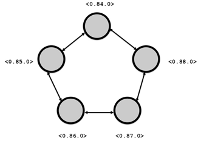{.calibre1}\

Figure 5.2    A ring of linked processes. Notice that each process has
two other processes in its link set.

Let's crash a random process! We pick a random pid from the list of
`pids`{.codeintext} and send it the `:crash`{.codeintext} message:

`iex(6)> pids |> Enum.shuffle |> List.first |> send(:crash)`{.codebcxspfirst}
`:crash`{.codebcxsplast}

We can now check that none of the processes survived:

`iex(8)> pids |> Enum.map(fn pid -> Process.alive?(pid) end)`{.codebcxspfirst}
`[false, false, false, false, false]`{.codebcxsplast}

5.1.4[       ]{.calibre13} Trapping Exits

So far, all we have done is see the links bring down all the linked
processes. What if we didn't want the process to die when it received an
error signal? We need to make the process *trap exit signals*. To make a
process trap exit signals, it needs to call
`Process.flag(:trap_exit, true)`{.codeintext}. Calling this turns the
process from a normal process to a system process.

What's the difference between a normal process and a system process?
When a system process receives an error signal, instead of crashing like
normal processes, it can turn the signal into a regular message that
looks like `{:EXIT, pid, reason}`{.codeintext}, where `pid`{.codeintext}
is the process that was terminated and `reason`{.codeintext} is the
reason for the termination.

This way, the system process can take corrective action on the
terminated process. Let's see how this works with two processes, similar
to the first example in this section.

We first note the current shell process:

`iex> self`{.codebcxspfirst} `#PID<0.58.0>`{.codebcxsplast}

Next, turn the shell process into a system process by making it trap
exits:

`iex> Process.flag(:trap_exit, true) `{.codebcxspfirst}
`false`{.codebcxsplast}

Note that just like `Process.link/1`{.codeintext}, this must be called
from within the calling process. Once again, we create a process that we
are going to crash:

`iex> pid = spawn(fn -> receive do :crash -> 1/0 end end)`{.codebcxspfirst}
`#PID<0.62.0>`{.codebcxsplast}

Then link the newly created process to the shell process:

`iex> Process.link(pid)`{.codebcxspfirst} `true`{.codebcxsplast}

Now, what happens if we try to crash the newly created process?

`iex> send(pid, :crash)`{.codebcxspfirst}
`:crash`{.codebcxspmiddle}`14:37:10.995 [error] Error in process <0.62.0> with exit value: {badarith,[{erlang,’/‘,[1,0],[]}]}`{.codebcxsplast}

First, let's check if the shell process survived:

`iex> self`{.codebcxspfirst} `#PID<0.58.0>`{.codebcxsplast}

Yup! It's the same process as before. Now, let's see what message the
shell process receive:

`iex> flush`{.codebcxspfirst}
`{:EXIT, #PID<0.62.0>, {:badarith, [{:erlang, :/, [1, 0], []}]}}`{.codebcxsplast}

As expected, because the shell process receives a message in the form of
`{:EXIT, pid, reason}`{.codeintext}. We will exploit this later when we
learn how to create our own supervisor process.

5.1.5[       ]{.calibre13} Linking a terminated/non-existent process

Let's try to link a dead process see what happens. First, let's create a
process that exits quickly:

`iex> pid = spawn(fn -> IO.puts “Bye, cruel world.” end)`{.codebcxspfirst}
`Bye, cruel world.`{.codebcxspmiddle}
` `{.codebcxspmiddle}`#PID<0.80.0>`{.codebcxsplast}

We make sure that the process is really dead:

`iex> Process.alive? pid`{.codebcxspfirst} `false`{.codebcxsplast}

Then we'll attempt to link a dead process:

`iex> Process.link(pid)`{.codebcxspfirst}
`** (ErlangError) erlang error: :noproc`{.codebcxspmiddle}`    :erlang.link(#PID<0.62.0>)`{.codebcxsplast}

`Process.link/1`{.codeintext} makes sure that you are linking to a
non-terminated process, and errors out if you try to link to a
terminated or non-existent process.

5.1.6[       ]{.calibre13} spawn_link/3: spawn and link in One Atomic
Step

Most of the time when spawning a process, you would want to use
`spawn_link/3`{.codeintext}. Is `spawn_link/3`{.codeintext} like a
glorified wrapper for `spawn/3`{.codeintext} and `link/1`{.codeintext}?
In order words, is `spawn_link(Worker, :loop, [])`{.codeintext} the same
as doing

`pid = spawn(Worker, :loop, [])`{.codebcxspfirst}
`Process.link(pid)`{.codebcxsplast}

Turns out, the story is slightly more complicated than that.
`spawn_link/3`{.codeintext} does the spawning and linking in *one atomic
operation*. Why is this important? This is because when
`link/1`{.codeintext} is given a process that has terminated or does not
exist, it throws an error. Since `spawn/3`{.codeintext} and
`link/1`{.codeintext} are two separate steps, `spawn/3`{.codeintext}
could very well fail, causing the subsequent call to
`link/1`{.codeintext} to raise an exception.

5.1.7[       ]{.calibre13} Exit Messages

There are three flavors of :`EXIT`{.codeintext} messages. You have seen
the first one where the reason for termination is returned describes the
exception.

Normal Termination

Processes send :`EXIT`{.codeintext} messages when the process terminates
normally. This means that the process doesn't have any more code to run.
For example, given this process whose only job is to receive an
`:ok`{.codeintext} message then exit:

`iex> pid = spawn(fn -> receive do :ok -> :ok end end)`{.codebcxspfirst}
`#PID<0.73.0>`{.codebcxsplast}

Remember to link the process:

`iex> Process.link(pid)`{.codebcxspfirst} `true`{.codebcxsplast}

We then send the process the `:ok`{.codeintext} message, causing it to
exit normally:

`iex> send(pid, :ok)`{.codebcxspfirst} `:ok`{.codebcxsplast}

Now, let's reveal the message that the shell process received:

`iex> flush`{.codebcxspfirst}
`{:EXIT, #PID<0.73.0>, :normal}`{.codebcxsplast}

Note that for *normal* process that is linked to a process that has just
exited normally (i.e. with a `:normal`{.codeintext} as the reason), then
the former process is *not* terminated.

Forcefully Killing a Process

There is one more way a process can die, and that is using
`Process.exit(pid, :kill)`{.codeintext}. This sends an *un-trappable*
exit signal is sent to the targeted process. This means that even though
the process might be trapping exits, this is one signal that it cannot
trap.  Let's set up the shell process to trap exits:

`iex> self`{.codebcxspfirst} `#PID<0.91.0>`{.codebcxspmiddle}
` `{.codebcxspmiddle}
`iex> Process.flag(:trap_exit, true)`{.codebcxspmiddle}`false`{.codebcxsplast}

When we try to kill it using `Process.exit/2`{.codeintext} with a reason
other than `:kill`{.codeintext}:

`iex> Process.exit(self, :whoops)`{.codebcxspfirst}
`true`{.codebcxspmiddle} ` `{.codebcxspmiddle}
`iex> self`{.codebcxspmiddle} `#PID<0.91.0>`{.codebcxspmiddle}
` `{.codebcxspmiddle} `iex> flush`{.codebcxspmiddle}
`{:EXIT, #PID<0.91.0>, :whoops}`{.codebcxspmiddle} ` `{.codebcxspmiddle}
`iex> self`{.codebcxspmiddle}`#PID<0.91.0>`{.codebcxsplast}

Here, we have shown that the shell process has successfully trapped the
signal since it receives the `{:EXIT, pid, reason}`{.codeintext} message
in its mailbox. Now, lets try `Process.exit(self, :kill)`{.codeintext}:

`iex> Process.exit(self, :kill)`{.codebcxspfirst}
`** (EXIT from #PID<0.91.0>) killed`{.codebcxspmiddle}
` `{.codebcxspmiddle}
`iex> self`{.codebcxspmiddle}`#PID<0.103.0>`{.codebcxsplast}

This time, notice that the shell process restarts and the process id is
no longer the one we had before.

5.1.8[       ]{.calibre13} Ring, revisited

Consider the ring again. Only two processes are trapping exits. This is
what we want to create:

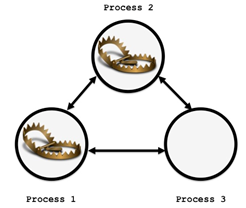{.calibre1}\

Figure 5.3 What happens when process 2 is killed?

Open up `lib/ring.ex`{.codeintext} again, and add messages let the
process trap exit and handle `{:EXIT, pid, reason}`{.codeintext}:

Listing 5.5    ring.ex -- Let the process handle :EXIT and :DOWN
messages

`defmodule Ring do`{.codebcxspfirst} `  # …`{.codebcxspmiddle}
` `{.codebcxspmiddle} `  def loop do`{.codebcxspmiddle}
`    receive do`{.codebcxspmiddle}
`      {:link, link_to} when is_pid(link_to) ->`{.codebcxspmiddle}
`        Process.link(link_to)`{.codebcxspmiddle}
`        loop`{.codebcxspmiddle} ` `{.codebcxspmiddle}
`      :trap_exit ->`{.codebcxspmiddle}
`        Process.flag(:trap_exit, true)                #1`{.codebcxspmiddle}
`        loop`{.codebcxspmiddle} ` `{.codebcxspmiddle}
`      :crash ->`{.codebcxspmiddle} `        1/0`{.codebcxspmiddle}
` `{.codebcxspmiddle}
`      {:EXIT, pid, reason} ->                         #2`{.codebcxspmiddle}
`        IO.puts “#{inspect self} received {:EXIT, #{inspect pid}, #{reason}}”`{.codebcxspmiddle}
`        loop`{.codebcxspmiddle} ` `{.codebcxspmiddle}
`    end`{.codebcxspmiddle} `  end`{.codebcxspmiddle}
` `{.codebcxspmiddle}`end`{.codebcxsplast}

#1 Handle a message to trap exits  

#2 Handle a message to detect :DOWN messages

Process 1 and Process 2 are trapping exits. All Processes are linked to
each other. Now, what happens when 2 is killed? We can create three
processes to find out:

`iex> [p1, p2, p3]  = Ring.create_processes(3)`{.codebcxspfirst}
`[#PID<0.97.0>, #PID<0.98.0>, #PID<0.99.0>]`{.codebcxsplast}

And link all of them together:

`iex> [p1, p2, p3] |> Ring.link_processes`{.codeb}

We set the first two processes to trap exits.

`iex> send(p1, :trap_exit)`{.codebcxspfirst}
`iex> send(p2, :trap_exit)`{.codebcxsplast}

Observer what happens when we kill `p2`{.codeintext}:

`iex> Process.exit(p2, :kill)`{.codebcxspfirst}
`#PID<0.97.0> received {:EXIT, #PID<0.98.0>, killed}`{.codebcxspmiddle}`#PID<0.97.0> received {:EXIT, #PID<0.99.0>, killed}`{.codebcxsplast}

As a final check, only `p1`{.codeintext} survives:

`iex> [p1, p2, p3] |> Enum.map(fn p -> Process.alive?(p) end)`{.codebcxspfirst}
`[true, false, false]`{.codebcxsplast}

Here's the lesson:

If a process is trapping exits, and it is targeted to be killed using
`Process.exit(pid, :kill)`{.codeintext}, it is going to get killed
anyway. When it dies, it propagates a
`{:EXIT, #PID<0.98.0>, :killed}`{.codeintext} message to the processes
in its link set, which *can* be trapped.

Here's a table to summarize all the different scenarios:

Table 5. 1    The different scenarios that can happen when a process in
a link set exits

+-----------------------+-----------------------+-----------------------+
| ::: calibre37         | ::: calibre37         | ::: calibre37         |
| When a process in its | Trapping exits?       | What happens then?    |
| link set ...          | :::                   | :::                   |
| :::                   |                       |                       |
+-----------------------+-----------------------+-----------------------+
| Exits normally        | Yes                   | Receives              |
|                       |                       | `{:EXIT, pid, :n      |
|                       |                       | ormal}`{.codeintable} |
+-----------------------+-----------------------+-----------------------+
|                       | No                    | Nothing               |
+-----------------------+-----------------------+-----------------------+
| Killed using          | Yes                   | Receives              |
|                       |                       | `{:EXIT, pid, :n      |
| `Process.exit(pid,    |                       | ormal}`{.codeintable} |
| :kill)`{.codeintable} |                       |                       |
+-----------------------+-----------------------+-----------------------+
|                       | No                    | Terminates with       |
|                       |                       | `` `:kill             |
|                       |                       | ed ``{.codeintable}\` |
+-----------------------+-----------------------+-----------------------+
| Killed using          | Yes                   | Receives              |
|                       |                       | `{:EXIT, pid, o       |
| `Process.exit(pid,    |                       | ther }`{.codeintable} |
| other)`{.codeintable} |                       |                       |
+-----------------------+-----------------------+-----------------------+
|                       | No                    | Terminates with       |
|                       |                       | `other`{.codeintable} |
+-----------------------+-----------------------+-----------------------+

5.2[          ]{.calibre14} Monitors

Sometimes, you don't need a bidirectional link. You just want the
process to know if some other process has gone down, and not affect
anything about the monitoring process. For example, in a client-server
architecture, if the client goes down for whatever reason, the server
shouldn't go down.

That's what *monitors* are for. They set up a uni-directional link
between the monitoring process and the process to be monitored. Let's do
some monitoring! We create our favorite crash-able process:

`iex> pid = spawn(fn -> receive do :crash -> 1/0 end end)`{.codebcxspfirst}
`#PID<0.60.0>`{.codebcxsplast}

Then, we tell the shell to monitor this process:

`iex> Process.monitor(pid)`{.codebcxspfirst}
`#Reference<0.0.0.80>`{.codebcxsplast}

Notice that the return value is a *reference* to the monitor.

A reference is unique, and can be used to identify where the message
comes from, although that's a topic for a chapter later on.

Now, crash the process and see what happens:

`iex> send(pid, :crash)`{.codebcxspfirst} `:crash`{.codebcxspmiddle}
` `{.codebcxspmiddle} `iex>`{.codebcxspmiddle}
`18:55:20.381 [error] Error in process <0.60.0> with exit value: {badarith,[{erlang,’/‘,[1,0],[]}]}`{.codebcxspmiddle}`nil`{.codebcxsplast}

Let's inspect the shell processes' mailbox:

`iex> flush`{.codebcxspfirst}
`{:DOWN, #Reference<0.0.0.80>, :process, #PID<0.60.0>,`{.codebcxspmiddle}` {:badarith, [{:erlang, :/, [1, 0], []}]}}`{.codebcxsplast}

Notice that the reference matches the reference returned from
`Process.monitor/1`{.codeintext}.

5.2.1[       ]{.calibre13} Monitoring a Terminated/Non-Existent Process

What happens when you try to monitor a terminated/non-existent process?
Continue from our previous example, we first convince ourselves that
`pid`{.codeintext} is indeed dead:

`iex> Process.alive?(pid)`{.codebcxspfirst} `false`{.codebcxsplast}

Then let's try monitoring again:

`iex(11)> Process.monitor(pid)`{.codebcxspfirst}
`#Reference<0.0.0.114>`{.codebcxsplast}

`Process.monitor/1`{.codeintext} processes without incident, unlike
`Process.link/1`{.codeintext}, which throws an `:noproc`{.codeintext}
error. What message does the shell process get?

`iex(12)> flush`{.codebcxspfirst}
`{:DOWN, #Reference<0.0.0.114>, :process, #PID<0.60.0>, :noproc}`{.codebcxsplast}

We get a similar looking `:noproc`{.codeintext} message, except that it
is not an error but a plain old message lying in the mailbox. Therefore,
this message can be pattern matched from the mailbox.

5.3[          ]{.calibre14} Implementing a Supervisor

A supervisor is a process whose only job is to monitor one or more
processes. These processes can be worker processes or even other
supervisors.

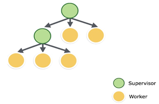{.calibre1}\

Figure 5.4    A supervision tree can be layered with other supervision
trees. Both supervisors and workers can be supervised.

Supervisors and workers are arranged in a supervision tree. If any of
the workers die, the supervisor can restart the dead worker, and
potentially other workers in the supervision tree, based on certain
*restart strategies*. What are worker processes? They are usually
processes that have implemented the GenServer, GenFSM or GenEvent
behaviors.

So far, you have all the building blocks needed to build your own
Supervisor. Once you are done with this section, Supervisors will not
seem magical anymore, although that does not make them any less awesome.

5.3.1[       ]{.calibre13} Supervisor API

The follow table lists the API of the supervisor along with a brief
description:

Table 5.2    A summary of APIs that we will implement

+-----------------------------------+-----------------------------------+
| ::: calibre37                     | ::: calibre37                     |
| API                               | Description                       |
| :::                               | :::                               |
+-----------------------------------+-----------------------------------+
| `start_lin                        | Given a list of child             |
| k(child_spec_list)`{.codeintable} | specifications (possibly empty),  |
|                                   | start the supervisor process and  |
|                                   | corresponding children            |
+-----------------------------------+-----------------------------------+
| `start_child(super                | Given a supervisor pid and a      |
| visor, child_spec)`{.codeintable} | child specification, start the    |
|                                   | child process and link it to the  |
|                                   | supervisor.                       |
+-----------------------------------+-----------------------------------+
| `terminate_chil                   | Given a supervisor pid and a      |
| d(supervisor, pid)`{.codeintable} | child pid, terminate the child.   |
+-----------------------------------+-----------------------------------+
| `restart_child(supervisor         | Given a supervisor pid, child     |
| , pid, child_spec)`{.codeintable} | pid, and a child specification,   |
|                                   | restart the child process and     |
|                                   | initialize the child process with |
|                                   | the child specification.          |
+-----------------------------------+-----------------------------------+
| `count_ch                         | Given the supervisor pid, return  |
| ildren(supervisor)`{.codeintable} | the number of child processes.    |
+-----------------------------------+-----------------------------------+
| `which_ch                         | Given the supervisor pid, return  |
| ildren(supervisor)`{.codeintable} | the state of the supervisor.      |
+-----------------------------------+-----------------------------------+

Implementing the above API will give us a pretty good grasp of how the
actual OTP Supervisor works under the hood.

5.3.2[       ]{.calibre13} Building Our Own Supervisor

As usual, we start with a new `mix`{.codeintext} project. Since calling
it `Supervisor`{.codeintext} is unoriginal, and
`MySupervisor`{.codeintext} is boring, let's give it some Old English
flair and call it `ThySupervisor`{.codeintext} instead:

`% mix new thy_supervisor`{.codeb}

As a form of revision, we are going to build our supervisor using the
GenServer behavior. You might be surprised to know that the supervisor
behavior does, in fact, implement the GenServer behavior.

`defmodule ThySupervisor do`{.codebcxspfirst}
`  use GenServer`{.codebcxspmiddle}
` `{.codebcxspmiddle}`end`{.codebcxsplast}

5.3.3[       ]{.calibre13} start_link(child_spec_list)

The first thing is to implement `start_link/1`{.codeintext}.

`defmodule ThySupervisor do`{.codebcxspfirst}
`  use GenServer`{.codebcxspmiddle} ` `{.codebcxspmiddle}
`  def start_link(child_spec_list) do`{.codebcxspmiddle}
`    GenServer.start_link(__MODULE__, [child_spec_list])`{.codebcxspmiddle}
`  end`{.codebcxspmiddle} ` `{.codebcxspmiddle}`end`{.codebcxsplast}

This is the main entry point to creating a supervisor process. Here, we
call `GenServer.start_link/2`{.codeintext} with the name of the module
and passing in a list with a single element of
`child_spec_list`{.codeintext}. `child_spec_list`{.codeintext} specifies
a list of (potentially empty) *child specifications*.

This is a fancy way of telling the supervisor what *kinds* of processes
it should manage. A child specification for two (similar) workers could
look like
`[{ThyWorker, :start_link, []}, {ThyWorker, :start_link, []}]`{.codeintext}.

Recall that `GenServer.start_link/2`{.codeintext} expects the
`ThySupervisor.init/1`{.codeintext} callback to be implemented. It
passes the second argument (the list) into `:init/1`{.codeintext}. Let's
do that:

Listing 5.6    thy_supervisor.ex -- start_link/1 and init callback/1.
Notice that exits are being trapped in the init/1 callback.

`defmodule ThySupervisor do`{.codebcxspfirst}
`  use GenServer`{.codebcxspmiddle} ` `{.codebcxspmiddle}
`  #######`{.codebcxspmiddle} `  # API #`{.codebcxspmiddle}
`  #######`{.codebcxspmiddle} ` `{.codebcxspmiddle}
`  def start_link(child_spec_list) do`{.codebcxspmiddle}
`    GenServer.start_link(__MODULE__, [child_spec_list])`{.codebcxspmiddle}
`  end`{.codebcxspmiddle} ` `{.codebcxspmiddle}
`  ######################`{.codebcxspmiddle}
`  # Callback Functions #`{.codebcxspmiddle}
`  ######################`{.codebcxspmiddle} ` `{.codebcxspmiddle}
`  def init([child_spec_list]) do`{.codebcxspmiddle}
`    Process.flag(:trap_exit, true)                      #1`{.codebcxspmiddle}
`    state = child_spec_list`{.codebcxspmiddle}
`              |> start_children`{.codebcxspmiddle}
`              |> Enum.into(HashDict.new)`{.codebcxspmiddle}
` `{.codebcxspmiddle} `    {:ok, state}`{.codebcxspmiddle}
`  end`{.codebcxspmiddle} ` `{.codebcxspmiddle}`end`{.codebcxsplast}

#1 Make the supervisor process trap exits

The first thing we do here is to let the supervisor process trap exits.
This is so that it can receive exit signals from its children as normal
messages.

There is quite a bit going on in the lines that follow. The
`child_spec_list`{.codeintext} is fed into
`start_children/1`{.codeintext}. This function, as you will soon see,
spawns the child processes and returns a list of tuples. Each tuple is a
pair that contains the pid of the newly spawned child and the child
specification. For example:

` [{<0.82.0>, {ThyWorker, :init, []}}, {<0.84.0>, {ThyWorker, :init, []}}]`{.codeb}

This list is then fed into `Enum.into/2`{.codeintext}. By passing in
`HashDict.new`{.codeintext} as the second argument, we are effectively
transforming the list of tuples into a `HashDict`{.codeintext}, with the
pids of the child processes as the keys and the child specifications as
the values.

[[transforming an enumerable to a collectable with
enum.into]{.calibre21}]{.callouthead}

[`Enum.into/2`{.codeintext}]{.calibre21} (and
[`Enum.into/3`{.codeintext}]{.calibre21} that takes an additional
transformation function) takes an enumerable (like a
[`List`{.codeintext}]{.calibre21}) and inserts it into a
[`Collectable`{.codeintext}]{.calibre21} (like a
[`HashDict`{.codeintext}]{.calibre21}. This is very helpful because
HashDict knows that if it gets a tuple, the first element becomes the
key, and the second element becomes the value:

`iex> h = [{:pid1, {:mod1, :fun1, :arg1}}, {:pid2, {:mod2, :fun2, :arg2}}] |> Enum.into(HashDict.new)`{.codeb}

This returns a HashDict:

`#HashDict<[pid2: {:mod2, :fun2, :arg2}, pid1: {:mod1, :fun1, :arg1}]>`{.codeb}

The key can be retrieved like so:

`iex> HashDict.fetch(h, :pid2)`{.codebcxspfirst}
`{:ok, {:mod2, :fun2, :arg2}}`{.codebcxsplast}

The resulting `HashDict`{.codeintext} of pid and child specification
mappings forms the *state* of the supervisor process, which we return in
a `{:ok, state}`{.codeintext} tuple, which is expected of
`init/1`{.codeintext}.

start_child(supervisor, child_spec)

I have not described what goes on in the private function
`start_children/1`{.codeintext} that is used in `init/1`{.codeintext}.
Let's skip ahead a little and look at `start_child/2`{.codeintext}
first. This function takes in the supervisor pid and child specification
and attaches the child to the supervisor:

Listing 5.7    thy_supervisor.ex -- Starting a single child process

`defmodule ThySupervisor do`{.codebcxspfirst}
`  use GenServer`{.codebcxspmiddle} ` `{.codebcxspmiddle}
`  #######`{.codebcxspmiddle} `  # API #`{.codebcxspmiddle}
`  #######`{.codebcxspmiddle} ` `{.codebcxspmiddle}
`  def start_child(supervisor, child_spec) do`{.codebcxspmiddle}
`    GenServer.call(supervisor, {:start_child, child_spec})`{.codebcxspmiddle}
`  end`{.codebcxspmiddle} ` `{.codebcxspmiddle} ` `{.codebcxspmiddle}
` `{.codebcxspmiddle} `  ######################`{.codebcxspmiddle}
`  # Callback Functions #`{.codebcxspmiddle}
`  ######################`{.codebcxspmiddle} ` `{.codebcxspmiddle}
`  def handle_call({:start_child, child_spec}, _from, state) do`{.codebcxspmiddle}
`    case start_child(child_spec) do`{.codebcxspmiddle}
`      {:ok, pid} ->`{.codebcxspmiddle}
`        new_state = state |> HashDict.put(pid, child_spec)`{.codebcxspmiddle}
`        {:reply, {:ok, pid}, new_state}`{.codebcxspmiddle}
`      :error ->`{.codebcxspmiddle}
`        {:reply, {:error, “error starting child”}, state}`{.codebcxspmiddle}
`    end`{.codebcxspmiddle} `  end`{.codebcxspmiddle}
` `{.codebcxspmiddle} `  #####################`{.codebcxspmiddle}
`  # Private Functions #`{.codebcxspmiddle}
`  #####################`{.codebcxspmiddle} ` `{.codebcxspmiddle}
`  defp start_child({mod, fun, args}) do`{.codebcxspmiddle}
`    case apply(mod, fun, args) do`{.codebcxspmiddle}
`      pid when is_pid(pid) ->`{.codebcxspmiddle}
`        Process.link(pid)`{.codebcxspmiddle}
`        {:ok, pid}`{.codebcxspmiddle} `      _ ->`{.codebcxspmiddle}
`        :error`{.codebcxspmiddle} `    end`{.codebcxspmiddle}
`  end`{.codebcxspmiddle} ` `{.codebcxspmiddle}`end`{.codebcxsplast}

The `start_child/2`{.codeintext} API call makes a synchronous call
request to the supervisor. The request contains a tuple containing the
`:start_child`{.codeintext} atom and child specification. The request is
handled by the
`handle_call({:start_child, child_spec}, _, _)`{.codeintext} callback.
It attempts to start a new child process using the
`start_child/1`{.codeintext} private function.

Upon success, the caller process receives `{:ok, pid}`{.codeintext} and
the state of the supervisor is updated to `new_state`{.codeintext}.
Otherwise, the caller process receives as tuple tagged with
`:error`{.codeintext} and is provided a reason.

[[Supervisor and Spawning Child Processes with
spawn_link]{.calibre21}]{.callouthead}

Here is an important point, and we are making a large assumption here.
The assumption is that we assume that the created process links to the
supervisor process. What does this mean? This means that we assume that
the process is spawned using [`spawn_link`{.codeintext}]{.calibre21}. In
fact, in the OTP Supervisor behavior assumes that processes are created
using [`spawn_link`{.codeintext}]{.calibre21}.

Starting child processes

Now, we can look at the `start_children/1`{.codeintext} function, which
is used in `init/1`{.codeintext}. Here it is:

Listing 5.8  thy_supervisor .ex -- Starting children processes

`defmodule ThySupervisor do`{.codebcxspfirst} `  # …`{.codebcxspmiddle}
` `{.codebcxspmiddle} `  #####################`{.codebcxspmiddle}
`  # Private Functions #`{.codebcxspmiddle}
`  #####################`{.codebcxspmiddle} ` `{.codebcxspmiddle}
`    defp start_children([child_spec|rest]) do`{.codebcxspmiddle}
`      case start_child(child_spec) do`{.codebcxspmiddle}
`        {:ok, pid} ->`{.codebcxspmiddle}
`          [{pid, child_spec}|start_children(rest)]`{.codebcxspmiddle}
`        :error ->`{.codebcxspmiddle}
`          :error`{.codebcxspmiddle} `      end`{.codebcxspmiddle}
`    end`{.codebcxspmiddle} `   `{.codebcxspmiddle}
`    defp start_children([]), do: []`{.codebcxspmiddle}`end`{.codebcxsplast}

The `start_children/1`{.codeintext} function takes a list of child
specifications and hands `start_child/1`{.codeintext} a child
specification, all the while accumulating a list of tuples. As
previously seen, each tuple is a pair that contains the
`pid`{.codeintext} and the child specification.

How does `start_child/1`{.codeintext} do its work? Turns out, there
isn't a lot of sophisticated machinery involved. Whenever we see a
`pid`{.codeintext}, we will link it to the supervisor process:

`defp start_child({mod, fun, args}) do`{.codebcxspfirst}
`  case apply(mod, fun, args) do`{.codebcxspmiddle}
`    pid when is_pid(pid) ->`{.codebcxspmiddle}
`      Process.link(pid)`{.codebcxspmiddle}
`      {:ok, pid}`{.codebcxspmiddle} `    _ ->`{.codebcxspmiddle}
`      :error`{.codebcxspmiddle}
`  end`{.codebcxspmiddle}`end`{.codebcxsplast}

terminate_child(supervisor, pid)

The supervisor needs a way to terminate its children. Here's the API,
callback and private function implementation:

Listing 5.9    thy_supervisor.ex -- Terminating a single child process

`defmodule ThySupervisor do`{.codebcxspfirst}
`  use GenServer`{.codebcxspmiddle} ` `{.codebcxspmiddle}
`  #######`{.codebcxspmiddle} `  # API #`{.codebcxspmiddle}
`  #######`{.codebcxspmiddle} ` `{.codebcxspmiddle}
`  def terminate_child(supervisor, pid) when is_pid(pid) do`{.codebcxspmiddle}
`    GenServer.call(supervisor, {:terminate_child, pid})`{.codebcxspmiddle}
`  end`{.codebcxspmiddle} ` `{.codebcxspmiddle}
`  ######################`{.codebcxspmiddle}
`  # Callback Functions #`{.codebcxspmiddle}
`  ######################`{.codebcxspmiddle} ` `{.codebcxspmiddle}
`  def handle_call({:terminate_child, pid}, _from, state) do`{.codebcxspmiddle}
`    case terminate_child(pid) do`{.codebcxspmiddle}
`      :ok ->`{.codebcxspmiddle}
`        new_state = state |> HashDict.delete(pid)`{.codebcxspmiddle}
`        {:reply, :ok, new_state}`{.codebcxspmiddle}
`      :error ->`{.codebcxspmiddle}
`        {:reply, {:error, “error terminating child”}, state}`{.codebcxspmiddle}
`    end`{.codebcxspmiddle} `  end`{.codebcxspmiddle}
` `{.codebcxspmiddle} `  #####################`{.codebcxspmiddle}
`  # Private Functions #`{.codebcxspmiddle}
`  #####################`{.codebcxspmiddle} ` `{.codebcxspmiddle}
`  defp terminate_child(pid) do`{.codebcxspmiddle}
`    Process.exit(pid, :kill)`{.codebcxspmiddle}
`    :ok`{.codebcxspmiddle} `  end`{.codebcxspmiddle}
` `{.codebcxspmiddle}`end`{.codebcxsplast}

We use `Process.exit(pid, :kill)`{.codeintext} to terminate the child
process. Remember how we set the supervisor to trap exits? When a child
is forcibly killed using `Process.exit(pid, :kill)`{.codeintext}, the
supervisor will receive a message in the form of
`{:EXIT, pid, :killed}`{.codeintext}. In order to handle this message,
the `handle_info/3`{.codeintext} callback is used:

Listing 5.10  thy_supervisor.ex -- :EXIT messages are handled via the
handle_info/3 callback

`def handle_info({:EXIT, from, :killed}, state) do`{.codebcxspfirst}
`  new_state = state |> HashDict.delete(from)`{.codebcxspmiddle}
`  {:no_reply, new_state}`{.codebcxspmiddle}`end`{.codebcxsplast}

All we need to do is to update the supervisor state by remove its entry
in the `HashDict`{.codeintext}, and return the appropriate tuple in the
callback.

restart_child(pid, child_spec)

Sometimes it is helpful to manually restart a child process. When we
want to restart a child process, we need to supply the process id and
the child specification. Why do we need the child specifications passed
in along with the process id?  The reason is that you might want to add
in more arguments, and that has to go into the child specification.

The `restart_child/2`{.codeintext} private function is a combination of
`terminate_child/1`{.codeintext} and `start_child/1`{.codeintext}.

Listing 5.11  thy_supervisor.ex -- Restarting a child process

`defmodule ThySupervisor do`{.codebcxspfirst}
`  use GenServer`{.codebcxspmiddle} ` `{.codebcxspmiddle}
`  #######`{.codebcxspmiddle} `  # API #`{.codebcxspmiddle}
`  #######`{.codebcxspmiddle} ` `{.codebcxspmiddle}
`  def restart_child(supervisor, pid, child_spec) when is_pid(pid) do`{.codebcxspmiddle}
`    GenServer.call(supervisor, {:restart_child, pid, child_spec})`{.codebcxspmiddle}
`  end`{.codebcxspmiddle} ` `{.codebcxspmiddle}
`  ######################`{.codebcxspmiddle}
`  # Callback Functions #`{.codebcxspmiddle}
`  ######################`{.codebcxspmiddle} ` `{.codebcxspmiddle}
`  def handle_call({:restart_child, old_pid}, _from, state) do`{.codebcxspmiddle}
`    case HashDict.fetch(state, old_pid) do`{.codebcxspmiddle}
`      {:ok, child_spec} ->`{.codebcxspmiddle}
`        case restart_child(old_pid, child_spec) do`{.codebcxspmiddle}
`          {:ok, {pid, child_spec}} ->`{.codebcxspmiddle}
`            new_state = state`{.codebcxspmiddle}
`                          |> HashDict.delete(old_pid)`{.codebcxspmiddle}
`                          |> HashDict.put(pid, child_spec)`{.codebcxspmiddle}
`            {:reply, {:ok, pid}, new_state}`{.codebcxspmiddle}
`          :error ->`{.codebcxspmiddle}
`            {:reply, {:error, “error restarting child”}, state}`{.codebcxspmiddle}
`        end`{.codebcxspmiddle} `      _ ->`{.codebcxspmiddle}
`        {:reply, :ok, state}`{.codebcxspmiddle}
`    end`{.codebcxspmiddle} `  end`{.codebcxspmiddle}
` `{.codebcxspmiddle} `  #####################`{.codebcxspmiddle}
`  # Private Functions #`{.codebcxspmiddle}
`  #####################`{.codebcxspmiddle} ` `{.codebcxspmiddle}
`  defp restart_child(pid, child_spec) when is_pid(pid) do`{.codebcxspmiddle}
`    case terminate_child(pid) do`{.codebcxspmiddle}
`      :ok ->`{.codebcxspmiddle}
`        case start_child(child_spec) do`{.codebcxspmiddle}
`          {:ok, new_pid} ->`{.codebcxspmiddle}
`            {:ok, {new_pid, child_spec}}`{.codebcxspmiddle}
`          :error ->`{.codebcxspmiddle}
`            :error`{.codebcxspmiddle} `        end`{.codebcxspmiddle}
`      :error ->`{.codebcxspmiddle} `        :error`{.codebcxspmiddle}
`    end`{.codebcxspmiddle} `  end`{.codebcxspmiddle}
` `{.codebcxspmiddle}`end`{.codebcxsplast}

count_children(supervisor)

This function returns the number of children that is linked to the
supervisor. The implementation is straightforward:

Listing 5.12    thy_supervisor.ex -- Counting the number of child
processes

`defmodule ThySupervisor do`{.codebcxspfirst}
`  use GenServer`{.codebcxspmiddle} ` `{.codebcxspmiddle}
`  #######`{.codebcxspmiddle} `  # API #`{.codebcxspmiddle}
`  #######`{.codebcxspmiddle} ` `{.codebcxspmiddle}
`  def count_children(supervisor) do`{.codebcxspmiddle}
`    GenServer.call(supervisor, :count_children)`{.codebcxspmiddle}
`  end`{.codebcxspmiddle} ` `{.codebcxspmiddle}
`  ######################`{.codebcxspmiddle}
`  # Callback Functions #`{.codebcxspmiddle}
`  ######################`{.codebcxspmiddle} ` `{.codebcxspmiddle}
`  def handle_call(:count_children, _from, state) do`{.codebcxspmiddle}
`    {:reply, HashDict.size(state), state}`{.codebcxspmiddle}
`  end`{.codebcxspmiddle} ` `{.codebcxspmiddle}`end`{.codebcxsplast}

which_children(supervisor)

This is similar to `count_children/1`{.codeintext}'s implementation.
Because our implementation is simple, it is fine to return the entire
state:

Listing 5.13    thy_supervisor.ex --  A simplistic implementation of
which_childre/1 that returns the entire state of the supervisor

`defmodule ThySupervisor do`{.codebcxspfirst}
`  use GenServer`{.codebcxspmiddle} ` `{.codebcxspmiddle}
`  #######`{.codebcxspmiddle} `  # API #`{.codebcxspmiddle}
`  #######`{.codebcxspmiddle} ` `{.codebcxspmiddle}
`  def which_children(supervisor) do`{.codebcxspmiddle}
`    GenServer.call(supervisor, :which_children)`{.codebcxspmiddle}
`  end`{.codebcxspmiddle} ` `{.codebcxspmiddle}
`  ######################`{.codebcxspmiddle}
`  # Callback Functions #`{.codebcxspmiddle}
`  ######################`{.codebcxspmiddle} ` `{.codebcxspmiddle}
`  def handle_call(:which_children, _from, state) do`{.codebcxspmiddle}
`    {:reply, state, state}`{.codebcxspmiddle} `  end`{.codebcxspmiddle}
` `{.codebcxspmiddle}`end`{.codebcxsplast}

terminate(reason, state)

This callback is called to shutdown the supervisor process. Before we
terminate the supervisor process, we need to terminate all the children
it is linked to, which is handled by the
`terminate_children/1`{.codeintext} private function:

Listing 5.14    thy_supervisor.ex -- Terminating the supervisor involves
terminating the child processes first

`defmodule ThySupervisor do`{.codebcxspfirst}
`  use GenServer`{.codebcxspmiddle} ` `{.codebcxspmiddle}
`  ######################`{.codebcxspmiddle}
`  # Callback Functions #`{.codebcxspmiddle}
`  ######################`{.codebcxspmiddle} ` `{.codebcxspmiddle}
`  def terminate(_reason, state) do`{.codebcxspmiddle}
`    terminate_children(state)`{.codebcxspmiddle}
`    :ok`{.codebcxspmiddle} `  end`{.codebcxspmiddle}
` `{.codebcxspmiddle} `  #####################`{.codebcxspmiddle}
`  # Private Functions #`{.codebcxspmiddle}
`  #####################`{.codebcxspmiddle} ` `{.codebcxspmiddle}
`  defp terminate_children([]) do`{.codebcxspmiddle}
`    :ok`{.codebcxspmiddle} `  end`{.codebcxspmiddle}
` `{.codebcxspmiddle}
`  defp terminate_children(child_specs) do`{.codebcxspmiddle}
`    child_specs |> Enum.each(fn {pid, _} -> terminate_child(pid) end)`{.codebcxspmiddle}
`  end`{.codebcxspmiddle} ` `{.codebcxspmiddle}
`  defp terminate_child(pid) do`{.codebcxspmiddle}
`    Process.exit(pid, :kill)`{.codebcxspmiddle}
`    :ok`{.codebcxspmiddle} `  end`{.codebcxspmiddle}
` `{.codebcxspmiddle}`end`{.codebcxsplast}

5.3.4[       ]{.calibre13} Handling Crashes

I've saved the best for last. What happens when one of the child
processes crashes? If you were paying attention, the supervisor would
receive a message that looks like `{:EXIT, pid, reason}`{.codeintext}.
Once again, we use the `handle_info/3`{.codeintext} callback to handle
the exit messages.

There are two cases to consider (other than `:killed`{.codeintext},
which we handled in `terminate_child/1`{.codeintext}).

The first case is when the process exited normally. The supervisor
doesn't have to do anything in this case, except update its state:

Listing 5.15    thy_supervisor.ex -- Do nothing when a child process
exits normally

`def handle_info({:EXIT, from, :normal}, state) do`{.codebcxspfirst}
`  new_state = state |> HashDict.delete(from)`{.codebcxspmiddle}
`  {:no_reply, new_state}`{.codebcxspmiddle}`end`{.codebcxsplast}

The second case is when the process has exited abnormally and hasn't
been forcibly killed. In that case, the supervisor should automatically
restart the failed process:

Listing 5.16    thy_supervisor.ex -- Restart a child process
automatically if it exits for an abnormal reason

`def handle_info({:EXIT, old_pid, _reason}, state) do`{.codebcxspfirst}
`  case HashDict.fetch(state, old_pid) do`{.codebcxspmiddle}
`    {:ok, child_spec} ->`{.codebcxspmiddle}
`      case restart_child(old_pid, child_spec) do`{.codebcxspmiddle}
`        {:ok, {pid, child_spec}} ->`{.codebcxspmiddle}
`          new_state = state`{.codebcxspmiddle}
`                        |> HashDict.delete(old_pid)`{.codebcxspmiddle}
`                        |> HashDict.put(pid, child_spec)`{.codebcxspmiddle}
`          {:no_reply, new_state}`{.codebcxspmiddle}
`        :error ->`{.codebcxspmiddle}
`          {:no_reply, state}`{.codebcxspmiddle}
`      end`{.codebcxspmiddle} `    _ ->`{.codebcxspmiddle}
`      {:no_reply, state}`{.codebcxspmiddle}
`  end`{.codebcxspmiddle}`end`{.codebcxsplast}

This above function is nothing new. It is almost the same implementation
as `restart_child/2`{.codeintext}, except that the child specification
is *reused*.

5.3.5[       ]{.calibre13} Full Completed Source

Here is the full source of our hand-rolled supervisor in all its glory:

Listing 5.17    The full implementation of thy_supervisor.ex

`defmodule ThySupervisor do`{.codebcxspfirst}
`  use GenServer`{.codebcxspmiddle} ` `{.codebcxspmiddle}
`  #######`{.codebcxspmiddle} `  # API #`{.codebcxspmiddle}
`  #######`{.codebcxspmiddle} ` `{.codebcxspmiddle}
`  def start_link(child_spec_list) do`{.codebcxspmiddle}
`    GenServer.start_link(__MODULE__, [child_spec_list])`{.codebcxspmiddle}
`  end`{.codebcxspmiddle} ` `{.codebcxspmiddle}
`  def start_child(supervisor, child_spec) do`{.codebcxspmiddle}
`    GenServer.call(supervisor, {:start_child, child_spec})`{.codebcxspmiddle}
`  end`{.codebcxspmiddle} ` `{.codebcxspmiddle}
`  def terminate_child(supervisor, pid) when is_pid(pid) do`{.codebcxspmiddle}
`    GenServer.call(supervisor, {:terminate_child, pid})`{.codebcxspmiddle}
`  end`{.codebcxspmiddle} ` `{.codebcxspmiddle}
`  def restart_child(supervisor, pid, child_spec) when is_pid(pid) do`{.codebcxspmiddle}
`    GenServer.call(supervisor, {:restart_child, pid, child_spec})`{.codebcxspmiddle}
`  end`{.codebcxspmiddle} ` `{.codebcxspmiddle}
`  def count_children(supervisor) do`{.codebcxspmiddle}
`    GenServer.call(supervisor, :count_children)`{.codebcxspmiddle}
`  end`{.codebcxspmiddle} ` `{.codebcxspmiddle}
`  def which_children(supervisor) do`{.codebcxspmiddle}
`    GenServer.call(supervisor, :which_children)`{.codebcxspmiddle}
`  end`{.codebcxspmiddle} ` `{.codebcxspmiddle}
`  ######################`{.codebcxspmiddle}
`  # Callback Functions #`{.codebcxspmiddle}
`  ######################`{.codebcxspmiddle} ` `{.codebcxspmiddle}
`  def init([child_spec_list]) do`{.codebcxspmiddle}
`    Process.flag(:trap_exit, true)`{.codebcxspmiddle}
`    state = child_spec_list`{.codebcxspmiddle}
`              |> start_children`{.codebcxspmiddle}
`              |> Enum.into(HashDict.new)`{.codebcxspmiddle}
` `{.codebcxspmiddle} `    {:ok, state}`{.codebcxspmiddle}
`  end`{.codebcxspmiddle} ` `{.codebcxspmiddle}
`  def handle_call({:start_child, child_spec}, _from, state) do`{.codebcxspmiddle}
`    case start_child(child_spec) do`{.codebcxspmiddle}
`      {:ok, pid} ->`{.codebcxspmiddle}
`        new_state = state |> HashDict.put(pid, child_spec)`{.codebcxspmiddle}
`        {:reply, {:ok, pid}, new_state}`{.codebcxspmiddle}
`      :error ->`{.codebcxspmiddle}
`        {:reply, {:error, “error starting child”}, state}`{.codebcxspmiddle}
`    end`{.codebcxspmiddle} `  end`{.codebcxspmiddle}
` `{.codebcxspmiddle}
`  def handle_call({:terminate_child, pid}, _from, state) do`{.codebcxspmiddle}
`    case terminate_child(pid) do`{.codebcxspmiddle}
`      :ok ->`{.codebcxspmiddle}
`        new_state = state |> HashDict.delete(pid)`{.codebcxspmiddle}
`        {:reply, :ok, new_state}`{.codebcxspmiddle}
`      :error ->`{.codebcxspmiddle}
`        {:reply, {:error, “error terminating child”}, state}`{.codebcxspmiddle}
`    end`{.codebcxspmiddle} `  end`{.codebcxspmiddle}
` `{.codebcxspmiddle}
`  def handle_call({:restart_child, old_pid}, _from, state) do`{.codebcxspmiddle}
`    case HashDict.fetch(state, old_pid) do`{.codebcxspmiddle}
`      {:ok, child_spec} ->`{.codebcxspmiddle}
`        case restart_child(old_pid, child_spec) do`{.codebcxspmiddle}
`          {:ok, {pid, child_spec}} ->`{.codebcxspmiddle}
`            new_state = state`{.codebcxspmiddle}
`                          |> HashDict.delete(old_pid)`{.codebcxspmiddle}
`                          |> HashDict.put(pid, child_spec)`{.codebcxspmiddle}
`            {:reply, {:ok, pid}, new_state}`{.codebcxspmiddle}
`          :error ->`{.codebcxspmiddle}
`            {:reply, {:error, “error restarting child”}, state}`{.codebcxspmiddle}
`        end`{.codebcxspmiddle} `      _ ->`{.codebcxspmiddle}
`        {:reply, :ok, state}`{.codebcxspmiddle}
`    end`{.codebcxspmiddle} `  end`{.codebcxspmiddle}
` `{.codebcxspmiddle}
`  def handle_call(:count_children, _from, state) do`{.codebcxspmiddle}
`    {:reply, HashDict.size(state), state}`{.codebcxspmiddle}
`  end`{.codebcxspmiddle} ` `{.codebcxspmiddle}
`  def handle_call(:which_children, _from, state) do`{.codebcxspmiddle}
`    {:reply, state, state}`{.codebcxspmiddle} `  end`{.codebcxspmiddle}
` `{.codebcxspmiddle}
`  def handle_info({:EXIT, from, :normal}, state) do`{.codebcxspmiddle}
`    new_state = state |> HashDict.delete(from)`{.codebcxspmiddle}
`    {:no_reply, new_state}`{.codebcxspmiddle} `  end`{.codebcxspmiddle}
` `{.codebcxspmiddle}
`  def handle_info({:EXIT, from, :killed}, state) do`{.codebcxspmiddle}
`    new_state = state |> HashDict.delete(from)`{.codebcxspmiddle}
`    {:no_reply, new_state}`{.codebcxspmiddle} `  end`{.codebcxspmiddle}
` `{.codebcxspmiddle}
`  def handle_info({:EXIT, old_pid, _reason}, state) do`{.codebcxspmiddle}
`    case HashDict.fetch(state, old_pid) do`{.codebcxspmiddle}
`      {:ok, child_spec} ->`{.codebcxspmiddle}
`        case restart_child(old_pid, child_spec) do`{.codebcxspmiddle}
`          {:ok, {pid, child_spec}} ->`{.codebcxspmiddle}
`            new_state = state`{.codebcxspmiddle}
`                          |> HashDict.delete(old_pid)`{.codebcxspmiddle}
`                          |> HashDict.put(pid, child_spec)`{.codebcxspmiddle}
`            {:no_reply, new_state}`{.codebcxspmiddle}
`          :error ->`{.codebcxspmiddle}
`            {:no_reply, state}`{.codebcxspmiddle}
`        end`{.codebcxspmiddle} `      _ ->`{.codebcxspmiddle}
`        {:no_reply, state}`{.codebcxspmiddle}
`    end`{.codebcxspmiddle} `  end`{.codebcxspmiddle}
` `{.codebcxspmiddle}
`  def terminate(_reason, state) do`{.codebcxspmiddle}
`    terminate_children(state)`{.codebcxspmiddle}
`    :ok`{.codebcxspmiddle} `  end`{.codebcxspmiddle}
` `{.codebcxspmiddle} `  #####################`{.codebcxspmiddle}
`  # Private Functions #`{.codebcxspmiddle}
`  #####################`{.codebcxspmiddle} ` `{.codebcxspmiddle}
`  defp start_children([child_spec|rest]) do`{.codebcxspmiddle}
`    case start_child(child_spec) do`{.codebcxspmiddle}
`      {:ok, pid} ->`{.codebcxspmiddle}
`        [{pid, child_spec}|start_children(rest)]`{.codebcxspmiddle}
`      :error ->`{.codebcxspmiddle} `        :error`{.codebcxspmiddle}
`    end`{.codebcxspmiddle} `  end`{.codebcxspmiddle}
` `{.codebcxspmiddle}
`  defp start_children([]), do: []`{.codebcxspmiddle}
` `{.codebcxspmiddle}
`  defp start_child({mod, fun, args}) do`{.codebcxspmiddle}
`    case apply(mod, fun, args) do`{.codebcxspmiddle}
`      pid when is_pid(pid) ->`{.codebcxspmiddle}
`        Process.link(pid)`{.codebcxspmiddle}
`        {:ok, pid}`{.codebcxspmiddle} `      _ ->`{.codebcxspmiddle}
`        :error`{.codebcxspmiddle} `    end`{.codebcxspmiddle}
`  end`{.codebcxspmiddle} ` `{.codebcxspmiddle}
`  defp terminate_children([]) do`{.codebcxspmiddle}
`    :ok`{.codebcxspmiddle} `  end`{.codebcxspmiddle}
` `{.codebcxspmiddle}
`  defp terminate_children(child_specs) do`{.codebcxspmiddle}
`    child_specs |> Enum.each(fn {pid, _} -> terminate_child(pid) end)`{.codebcxspmiddle}
`  end`{.codebcxspmiddle} ` `{.codebcxspmiddle}
`  defp terminate_child(pid) do`{.codebcxspmiddle}
`    Process.exit(pid, :kill)`{.codebcxspmiddle}
`    :ok`{.codebcxspmiddle} `  end`{.codebcxspmiddle}
` `{.codebcxspmiddle}
`  defp restart_child(pid, child_spec) when is_pid(pid) do`{.codebcxspmiddle}
`    case terminate_child(pid) do`{.codebcxspmiddle}
`      :ok ->`{.codebcxspmiddle}
`        case start_child(child_spec) do`{.codebcxspmiddle}
`          {:ok, new_pid} ->`{.codebcxspmiddle}
`            {:ok, {new_pid, child_spec}}`{.codebcxspmiddle}
`          :error ->`{.codebcxspmiddle}
`            :error`{.codebcxspmiddle} `        end`{.codebcxspmiddle}
`      :error ->`{.codebcxspmiddle} `        :error`{.codebcxspmiddle}
`    end`{.codebcxspmiddle}
`  end`{.codebcxspmiddle}`end`{.codebcxsplast}

5.4[          ]{.calibre14} A Sample Run (Or: Does It Really Work?)

Before we put our supervisor through its paces, create a new file
`lib/thy_worker.ex`{.codeintext}:

Listing 5.18    lib/thy_worker.ex -- An example worker to be used with
ThySupervisor

`defmodule ThyWorker do`{.codebcxspfirst}
`  def start_link do`{.codebcxspmiddle}
`    spawn(fn -> loop end)`{.codebcxspmiddle} `  end`{.codebcxspmiddle}
` `{.codebcxspmiddle} `  def loop do`{.codebcxspmiddle}
`    receive do`{.codebcxspmiddle}
`      :stop -> :ok`{.codebcxspmiddle} ` `{.codebcxspmiddle}
`      msg ->`{.codebcxspmiddle}
`        IO.inspect msg`{.codebcxspmiddle}
`        loop`{.codebcxspmiddle} `    end`{.codebcxspmiddle}
`  end`{.codebcxspmiddle}`end`{.codebcxsplast}

We begin by creating a worker:

`iex> {:ok, sup_pid} = ThySupervisor.start_link([])`{.codebcxspfirst}
`{:ok, #PID<0.86.0>}`{.codebcxsplast}

Let's create a process and add it to the supervisor. We save the pid of
the newly spawned child process.

`iex> {:ok, child_pid} = ThySupervisor.start_child(sup_pid, {ThyWorker, :start_link, []})`{.codeb}

Let's see what links are present in the supervisor:

`iex(3)> Process.info(sup_pid, :links)`{.codebcxspfirst}
`{:links, [#PID<0.82.0>, #PID<0.86.0>]}`{.codebcxsplast}

Interesting -- there are two processes linked to the supervisor process.
The first one is obviously the child process we just spawned. What about
the other one?

`iex> self`{.codebcxspfirst} `#PID<0.82.0>`{.codebcxsplast}

A little thought should reveal that since the supervisor process is
spawned and linked by the shell process, it would have the shell's pid
in its link set.

Let's kill the child process:

`iex> Process.exit(child_pid, :crash)`{.codeb}

What happens when we inspect the link set of the supervisor again?

`iex> Process.info(sup_pid, :links)`{.codebcxspfirst}
`{:links, [#PID<0.82.0>, #PID<0.90.0>]}`{.codebcxsplast}

Sweet! The supervisor automatically took care of spawning and linking
the new child process. To convince ourselves, we can peek at the
supervisors state:

`iex> ThySupervisor.which_children(sup_pid)`{.codebcxspfirst}
`#HashDict<[{#PID<0.90.0>, {ThyWorker, :start_link, []}}]>`{.codebcxsplast}

5.5[          ]{.calibre14} Summary

In this chapter, we worked through several examples that highlight how:

[·[     ]{.calibre16}]{.calibre12} The "Let it Crash" philosophy means
delegating error detection and handling to another process and not
coding too defensively

[·[     ]{.calibre16}]{.calibre12} Links set up bi-directional
relationships between processes that serve to propagate exit signals
when a crash happens in one of the processes

[·[     ]{.calibre16}]{.calibre12} Monitors set up a unidirectional
relationship between processes so that the monitoring process is simply
notified when a monitored process dies

[·[     ]{.calibre16}]{.calibre12} Exit signals can be trapped by
so-called system processes that convert exit signals into normal
messages

[·[     ]{.calibre16}]{.calibre12} Implement a simplistic supervisor
process using processes and links

In the next chapter, we are ready to dive into the OTP Supervisor
behavior. We will learn about the most important Supervisor features,
and get to experiment with them by building a worker pooler. Fun times!
:::

[]{#ch06.html}

::: wordsection
# [6[     ]{.calibre11}]{.calibre10} Fault Tolerance with Supervisors {#ch06.html#heading_id_2 .cochapternumber}

This chapter covers:

[·[     ]{.calibre13}]{.calibre12} How to use the OTP Supervisor
behavior

[·[     ]{.calibre13}]{.calibre12} Learn how to use ETS, Erlang Term
Storage

[·[     ]{.calibre13}]{.calibre12} How to use supervisors with normal
processes and other OTP behaviors

[·[     ]{.calibre13}]{.calibre12} Implementing a very basic worker pool
application

In the previous chapter, we built a naïve supervisor made from
primitives provided by the language, namely, monitors, links and
processes. That should give you a good understanding of how supervisors
work under the hood.

After teasing you in the previous chapter, we are finally going to use
the real thing: The *OTP Supervisor behavior* (henceforth simply
referred to as Supervisor). The sole responsibility of a supervisor is
to observe and check if an attached child process goes down and take
some action if it happens.

The OTP version offers a few more bells and whistles from our previous
implementation. Take *restart strategies* for example, which dictates
how a supervisor should restart the children if something goes wrong. It
also offers options too for limiting the number of restarts within a
specific timeframe. This is especially useful for preventing infinite
restarts.

To *really* understand supervisors, it is important to try them out for
yourself. Therefore, instead of boring you with every single supervisor
option, we are going to build this application (presented in its full
glory courtesy of the *Observer* application:

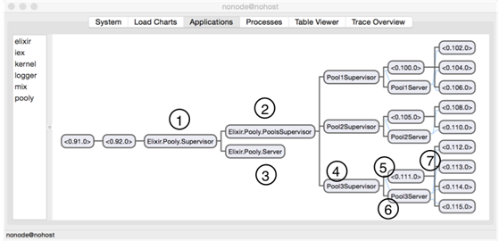{.calibre1}\

Figure 6.1 The completed worker pool application

Figure 6.1 shows the completed worker pool application. #1 is the
top-level `Supervisor`{.codeintext}. It supervises #2, another
`Supervisor`{.codeintext} (`PoolsSupervisor`{.codeintext}), and a
`GenServer`{.codeintext} (`Pooly.Server`{.codeintext}), #3.
`PoolsSupervisor`{.codeintext} in turn supervises three other
`PoolSupervisor`{.codeintext}s. One of them is marked as #4. These
supervisors have unique names. Each `PoolSupervisor`{.codeintext} in
turn supervises a worker supervisor #5 (represented by its process id)
and a GenServer #6. Finally, #7 are the actual workers doing the grunt
work. If you are wondering what the `GenServer`{.codeintext}'s are for,
they are primarily needed to maintain state for the supervisor "at the
same level". For example, the `GenServer`{.codeintext} at #6 helps
maintain the state for the supervisor at #5.

6.1[          ]{.calibre14} Implementing Pooly -- a Worker Pool
Application

We are going to build a worker pool over the course of two chapters.
What is a worker pool, you say? It is something that manages a pool
(surprise!) of workers. The reason you want this might be to manage
access to a scarce resource. It could be anything from a pool of Redis
connections, web socket connections and even a pool of GenServer
workers.

For example, if you spawn one million processes, and each process needs
a connection to the database. It is impractical to open one million
database connections. To get around this, a pool of database connections
is created. Each time a process needs a database connection it will
issue a request to the pool. Once the process is done with the database
connection, it is returned back to the pool. In effect, resource
allocation is delegated to the worker pool application.

The worker pool application that we are will build is *not* trivial at
all. In fact, if you are familiar with Poolboy, a lot of the design has
been adapted for this example. No worries if you have not heard or used
Poolboy, it is not a prerequisite.

I believe this is a very rewarding exercise, because it gets you
thinking about concepts and issues that would otherwise not come up in
simpler examples. You will get hands on with the Supervisor API too.

As such, this example may be slightly more challenging than the previous
examples so far. Some of the code/design might not be obvious, but
mostly because you didn't have the benefit of hindsight. But fret not,
dear reader, for you will be guided every step of the way. All I ask is
work through the code by typing it on your computer, and await
enlightenment by the end of the next chapter!

6.1.1[       ]{.calibre13} The Plan

We will evolve the design of Pooly through four versions. This chapter
covers the fundamentals of Supervisor, and get you building a very basic
version (version 1) of Pooly. The following chapter would be completely
focused on building the various features of Pooly.

Table 6.1 lists the characteristics of each version of Pooly:

+-----------------------------------+-----------------------------------+
| ::: calibre37                     | ::: calibre37                     |
| Version                           | Characteristics                   |
| :::                               | :::                               |
+-----------------------------------+-----------------------------------+
| 1                                 | Supports a *single* pool          |
|                                   |                                   |
|                                   | Supports a *fixed* number of      |
|                                   | workers                           |
|                                   |                                   |
|                                   | No recovery when consumer and/or  |
|                                   | worker process fail               |
+-----------------------------------+-----------------------------------+
| 2                                 | Same as version 1                 |
|                                   |                                   |
|                                   | Recovery when consumer and/or     |
|                                   | worker process fail               |
+-----------------------------------+-----------------------------------+
| 3                                 | Supports *multiple* pools         |
|                                   |                                   |
|                                   | Supports a *variable* number of   |
|                                   | workers                           |
+-----------------------------------+-----------------------------------+
| 4                                 | Same as version 3                 |
|                                   |                                   |
|                                   | Variable sized pool that allows   |
|                                   | for overflowing of workers        |
|                                   |                                   |
|                                   | Queuing for consumer processes    |
|                                   | when all workers are busy         |
+-----------------------------------+-----------------------------------+

Table 6. 1 The different changes that Pooly will undergo across four
versions

To have an idea of how the design will evolve, version 1 and 2 looks
like:

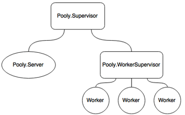{.calibre1}\

Figure 6.2 Version 1 and 2 of Pooly

Rectangles represent `Supervisor`{.codeintext}s, ovals represent
`GenServer`{.codeintext}s and circles represent the worker processes. In
version 3 and version 4, the design will evolve like so:

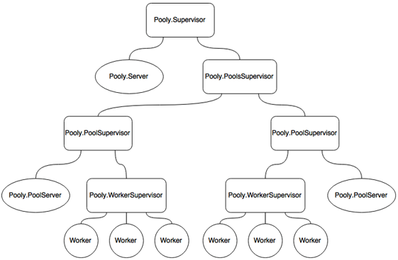{.calibre1}\

Figure 6.3 Version 3 and 4 of Pooly

From the diagram, it should be obvious why it's called a supervision
*tree*.

6.1.2[       ]{.calibre13} A Sample Run of Pooly

Before we get into the actual coding, it is instructive to see how to
use Pooly. This covers the first version of Pooly.

Starting a Pool

In order to start a pool, it must be given a *pool configuration*. It
provides the information needed for Pooly to initialize the pool. This
is what it looks like:

`pool_config = [`{.codebcxspfirst}
`  mfa: {SampleWorker, :start_link, []},`{.codebcxspmiddle}
`  size: 5`{.codebcxspmiddle}`]`{.codebcxsplast}

This tells the pool to create *five* `SampleWorker`{.codeintext}s. To
start the pool:

`Pooly.start_pool(pool_config)`{.codeb}

Checking Out Workers

In Pooly lingo, *checking out* workers means requesting and getting a
worker from the pool. The return value is a pid of an available worker.

`worker_pid = Pooly.checkout`{.codeb}

Once a *consumer process* has gotten hold of a
`worker_pid`{.codeintext}, it can do whatever it wants with it. What
happens if there are no more workers available? For now,
`:noproc`{.codeintext} is returned. We will have more sophisticated ways
of handling this in later versions.

Checking in Workers Back to the Pool

Once a consumer process is done with the worker, it must return it to
the pool, also known as checking in a worker. Checking in a worker is
straightforward:

`Pooly.checkin(worker_pid)`{.codeb}

Getting the status of a pool

It is useful to get some useful information from the pool.

`Pooly.status`{.codeb}

For now, this returns a tuple such as `{3, 2}`{.codeintext}. This means
that there are three free workers and two busy ones. That concludes the
short tour of the API.

6.1.3[       ]{.calibre13} Diving into Pooly, Version 1: Laying the
Groundwork

Go to your favorite directory and create a new project with
`mix`{.codeintext}:

`% mix new pooly`{.codeb}

::: calibre20
A note about the source code
:::

The different versions of this project for this chapter have been split
into different branches. For example, to checkout version 3,
[`cd`{.codeintext}]{.calibre21} into the project folder and do a
[`git checkout version-3`{.codeintext}]{.calibre21}.

::: calibre22
 
:::

::: calibre20
mix and the \--sup option
:::

You might be aware that [`mix`{.codeintext}]{.calibre21} includes an
option called [`--sup`{.codeintext}]{.calibre21}. This option generates
an OTP application skeleton including a supervision tree. If this option
is left out, the application is generated *without* a supervisor and
application callback. For example, you might be tempted to create Pooly
like so:

[`% mix new pooly --sup`{.sidebaracode}]{lang="BS-LATN-BA"}

However, since we are learning, we shall opt for the flag-less version.

::: calibre22
 
:::

The very first version of Pooly will only support a single pool of fixed
workers. Furthermore, there will be no recovery handling when either the
consumer or worker process fails. By the end of this version, Pooly will
look like:

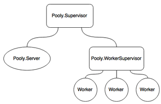{.calibre1}\

Figure 6. 4 Version 1 of Pooly

As you can see, the application consists of a top-level supervisor
(`Pooly.Supervisor`{.codeintext}) that supervises two other processes, a
GenServer process (`Pooly.Server`{.codeintext}) and a worker supervisor
(`Pooly.WorkerSupervisor`{.codeintext}). You might recall from the
previous chapter that supervisors can themselves be supervised, since
supervisors themselves processes.

::: calibre20
How do I even start?
:::

Whenever I am designing Elixir programs with possibly many supervision
hierarchies, I will always produce a sketch first. That's because (as
you will find out soon enough) there are quite a few things to keep
quite a few things in your head. Probably more so than other languages,
you must already have a rough design in your head, which forces you to
think slightly ahead.

::: calibre22
 
:::

When Pooly first starts, only `Pooly.Server`{.codeintext} is attached to
`Pooly.Supervisor`{.codeintext}.  When the pool is started with pool
configuration, `Pooly.Server`{.codeintext} first verifies that the pool
configuration is valid.

After that, it sends a `:start_worker_supervisor`{.codeintext} to
`Pooly.Supervisor`{.codeintext}. This message instructs
`Pooly.Supervisor`{.codeintext} to start
`Pooly.WorkerSupervisor`{.codeintext}. Finally,
`Pooly.WorkerSupervisor`{.codeintext} is told to start a number of
worker processes based on the `size`{.codeintext} specified in the pool
configuration.

The following diagram illustrates how Pooly version 1 works:

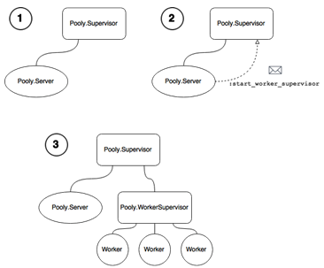{.calibre1}\

Figure 6. 2 How the various components of Pooly are initialized

6.2[          ]{.calibre14} Implementing the Worker Supervisor

We will first create a worker supervisor. This supervisor would be in
charge of monitoring all the spawned workers in the pool. Create
`worker_supervisor.ex`{.codeintext} in `lib/pooly`{.codeintext}. Just
like a GenServer behavior (or *any* other OTP behavior for that matter),
this is how to use the Supervisor behavior:

`defmodule Pooly.WorkerSupervisor do`{.codebcxspfirst}
`  use Supervisor`{.codebcxspmiddle}`end`{.codebcxsplast}

In Listing 6. 1, we define the good old `start_link/1`{.codeintext}
function that serves as the main entry point when creating a supervisor
process. The `start_link/1`{.codeintext} function that we define is a
wrapper function that calls `Supervisor.start_link/2`{.codeintext},
passing in the module name and the arguments.

Just like GenServer, when you define
`Supervisor.start_link/2`{.codeintext}, you should then implement the
corresponding `init/1`{.codeintext} callback function next. Whatever
arguments passed to `Supervisor.start_link/2`{.codeintext} would be then
passed along to the `init/1`{.codeintext} callback:

Listing 6.1 lib/pooly/worker_supervisor.ex -- Using pattern matching to
validate and destructure arguments

`defmodule Pooly.WorkerSupervisor do`{.codebcxspfirst}
`  use Supervisor`{.codebcxspmiddle} ` `{.codebcxspmiddle}
`  #######`{.codebcxspmiddle} `  # API #`{.codebcxspmiddle}
`  #######`{.codebcxspmiddle} ` `{.codebcxspmiddle}
`  def start_link({_,_,_} = mfa) do             #1`{.codebcxspmiddle}
`    Supervisor.start_link(__MODULE__, mfa)`{.codebcxspmiddle}
`  end`{.codebcxspmiddle} ` `{.codebcxspmiddle}
`  #############`{.codebcxspmiddle} `  # Callbacks #`{.codebcxspmiddle}
`  #############`{.codebcxspmiddle} ` `{.codebcxspmiddle}
`  def init({m,f,a}) do                         #2`{.codebcxspmiddle}
`    # …`{.codebcxspmiddle}
`  end`{.codebcxspmiddle}`end`{.codebcxsplast}

#1 Pattern match the arguments to make sure that the arguments are
indeed a tuple containing three elements.

#2 Pattern match the individual elements from the three-element tuple.

In #1, we declare that `start_link`{.codeintext} takes a three-element
tuple, which would be the module, function, and list of arguments of the
worker process.

Notice the beauty of pattern matching at work here. Saying
`{_,_,_} = mfa`{.codeintext} essentially does *two* things. First, it
asserts that the input argument must be a three-element tuple. Secondly,
the input argument is referenced by `mfa`{.codeintext}. We *could* have
done written it as `{m,f,a}`{.codeintext} instead. However, since we are
not using the individual elements, we pass along the entire tuple using
`mfa`{.codeintext}.

`mfa`{.codeintext} is then passed along to the `init/1`{.codeintext}
callback. This time, we need to use the individual elements of the
tuple, and therefore in #2 we assert that the expected input argument is
`{m,f,a}`{.codeintext}. The `init/1`{.codeintext} callback is where the
actual initialization occurs.

6.2.1[       ]{.calibre13} Initializing the Supervisor

Let's take a closer look at the `init/1`{.codeintext} callback, where
most of the interesting bits happen in a supervisor:

Listing 6.2  lib/pooly/worker_supervisor.ex -- Initializing the
supervisor with a child and supervisor specification

`defmodule Pooly.WorkerSupervisor do`{.codebcxspfirst}
` `{.codebcxspmiddle} `  #############`{.codebcxspmiddle}
`  # Callbacks #`{.codebcxspmiddle} `  #############`{.codebcxspmiddle}
` `{.codebcxspmiddle} `  def init({m,f,a} = x) do`{.codebcxspmiddle}
`    worker_opts = [restart:  :permanent,`{.codebcxspmiddle}
`                   function: f]`{.codebcxspmiddle}
` `{.codebcxspmiddle}
`    children = [worker(m, a, worker_opts)]     `{.codebcxspmiddle}
` `{.codebcxspmiddle}
`    opts     = [strategy: :simple_one_for_one, `{.codebcxspmiddle}
`                max_restarts: 5,`{.codebcxspmiddle}
`                max_seconds: 5]`{.codebcxspmiddle}
` `{.codebcxspmiddle} `    supervise(children, opts)`{.codebcxspmiddle}
`  end`{.codebcxspmiddle} ` `{.codebcxspmiddle}`end`{.codebcxsplast}

Let's learn how to decipher Listing 6. 2. In order for a supervisor to
initialize its children, you must give it a *child specification*. A
child specification (we covered this briefly in the previous chapter) is
a recipe for the supervisor to spawn its children.

The child specification is created with
`Supervisor.Spec.worker/3`{.codeintext}. The
`Supervisor.Spec`{.codeintext} module is imported by the Supervisor
behavior by default, so there's no need to supply the fully qualified
version.

The return value of the `init/1`{.codeintext} callback must be a
*supervisor specification*. In order to construct a supervisor
specification, we use the `Supervisor.Spec.supervise/2`{.codeintext}
function.

`supervise/2`{.codeintext} takes in two arguments. The first argument is
a *list* of children. The second argument is a *keyword list* of
options. In the code listing above, this is represented by
`children`{.codeintext} and `opts`{.codeintext} respectively.

Before we get into defining children, let's discuss about the *second*
argument to `supervise/2`{.codeintext}.

6.2.2[       ]{.calibre13} Supervision Options

Our example defines the options to `supervise/2`{.codeintext} as such:

`opts = [strategy: :simple_one_for_one,`{.codebcxspfirst}
`        max_restarts: 5,`{.codebcxspmiddle}`        max_seconds: 5]`{.codebcxsplast}

There are a few options that can be set here. The most important one is
the *restart strategy*, which we will look at next.

6.2.3[       ]{.calibre13} Restart Strategies

Restart strategies dictate how a supervisor restarts a child/children
when something goes wrong. In order to define a restart strategy,
include a `strategy`{.codeintext} key along with the restart strategy.
There are four kinds of restart strategies:

[`·`{.codeintext}[`     `{.codeintext}]{.calibre16}]{.calibre12}
`:one_for_one`{.codeintext}

[`·`{.codeintext}[`     `{.codeintext}]{.calibre16}]{.calibre12}
`:rest_for_one`{.codeintext}

[`·`{.codeintext}[`     `{.codeintext}]{.calibre16}]{.calibre12}
`:one_for_all`{.codeintext}

[`·`{.codeintext}[`     `{.codeintext}]{.calibre16}]{.calibre12}
`:simple_one_for_one`{.codeintext}

Let's take a quick look at all of them.

:one_for_one

If that process dies, only that process is restarted. All the other
processes are not affected.

:one_for_all

Just like the three musketeers, if *any* process dies, all the processes
under the supervision tree die along with it. After that, all of them
are restarted again. This strategy is useful if all the processes under
the supervise tree depend on each other.

:rest_for_one

If one of the processes dies, the rest of the processes that were
started *after* that process are terminated. After that, the process
that died and the rest of the child processes are restarted. Think of it
like dominoes arranged in a circular fashion.

:simple_one_for_one

The previous three strategies are used to build a static supervision
tree. This means that the workers are specified upfront via the child
specification.

In `:simple_one_for_one`{.codeintext}, you would specify only *one*
entry in the child specification. Every child process that is spawned
from this supervisor would be the *same* kind of process.

The best way to think about the `:simple_one_for_one`{.codeintext}
strategy is like a factory method (or a constructor in OOP languages),
where the workers that are "produced" are alike.
`:simple_one_for_one`{.codeintext} is used when we want to dynamically
create workers.

The supervisor initially starts out with empty workers. Workers are then
dynamically attached to the supervisor. Next, we look at the other
options that allow us to fine-tune the behavior of supervisors.

6.2.4[       ]{.calibre13} Max Restarts and Max Seconds

`max_restarts`{.codeintext} and `max_seconds`{.codeintext} translate to
the maximum number of restarts the supervisor can tolerate within a
maximum number of seconds before it gives up and terminates.

Why have something like that in the first place? The main reason is that
you do not want your supervisor to infinitely restart its children when
something is genuinely wrong (programmer error?). Therefore, you might
want to specify a threshold for the supervisor to give up. Note that by
default, `max_restarts`{.codeintext} and `max_seconds`{.codeintext} are
set to 3 and 5 respectively.

In the code listing above, we specify that the supervisor should give up
if there are more than five restarts within five seconds.

6.2.5[       ]{.calibre13} Defining Children

It is now time to learn how to define children. In our code, the
children is specified in a list:

`children = [worker(m, a, worker_opts)]`{.codeb}

What does this tell us? It says that this supervisor has one child, or
one *kind* of child, in the case of a :`simple_one_for_one`{.codeintext}
restart strategy. (It doesn't make sense to define multiple workers when
in general we do not know how many workers we want to spawn when using a
`:simple_one_for_one`{.codeintext} restart strategy.

The `worker/3`{.codeintext} function creates a child specification for a
*worker*, as opposed its sibling `supervisor/3`{.codeintext}. This means
that if the child is *not* a supervisor, use `worker/3`{.codeintext}. If
you are supervising a supervisor, then use `supervise/3`{.codeintext}.
You will use both variants very soon.

Both variants take the module, arguments and options. The first two are
exactly what you would expect. The third argument is more interesting.

Child Specification Default Options

By default, when you leave the options out like so

`children = [worker(m, a)]`{.codeb}

Elixir will supply the following options as the default:

` [id: module,`{.codebcxspfirst}
` function: :start_link,`{.codebcxspmiddle}
` restart: :permanent,`{.codebcxspmiddle}
` shutdown: :infinity,`{.codebcxspmiddle}` modules: [module]]`{.codebcxsplast}

function: The Start Function of the Worker

`function`{.codeintext} should be obvious -- It's the `f`{.codeintext}
of `mfa`{.codeintext}.  Sometimes the main entry point of a worker is
some other function other than `start_link`{.codeintext}.  This is the
place to specify the custom function to be called.

restart: Restart Value

The two restart values that we will use throughout the Pooly application
are:

[·[     ]{.calibre16}]{.calibre12} `:permanent`{.codeintext} - the child
process is always restarted

[·[     ]{.calibre16}]{.calibre12} `:temporary`{.codeintext} - the child
process is never restarted.

In `worker_opts`{.codeintext}, we specified `:permanent`{.codeintext}.
This means that any crashed worker is always restarted.

Creating a Sample Worker

In order to test this out, we need a sample worker. Create
`sample_worker.ex`{.codeintext} in `lib/pooly`{.codeintext}. Fill it in
with this:

Listing 6.3 lib/pooly/sample_worker.ex -- A worker used to test Pooly

`defmodule SampleWorker do`{.codebcxspfirst}
`  use GenServer`{.codebcxspmiddle} ` `{.codebcxspmiddle}
`  def start_link(_) do`{.codebcxspmiddle}
`    GenServer.start_link(__MODULE__, :ok, [])`{.codebcxspmiddle}
`  end`{.codebcxspmiddle} ` `{.codebcxspmiddle}
`  def stop(pid) do`{.codebcxspmiddle}
`    GenServer.call(pid, :stop)`{.codebcxspmiddle}
`  end`{.codebcxspmiddle} ` `{.codebcxspmiddle}
`  def handle_call(:stop, _from, state) do`{.codebcxspmiddle}
`    {:stop, :normal, :ok, state}`{.codebcxspmiddle}
`  end`{.codebcxspmiddle}`end`{.codebcxsplast}

`SampleWorker`{.codeintext} is a very simple GenServer that pretty much
does nothing except having functions that control its lifecycle.

`iex> {:ok, worker_sup} = Pooly.WorkerSupervisor.start_link({SampleWorker, :start_link, []})`{.codeb}

Now, we can create a child:

`iex> Supervisor.start_child(worker_sup, [[]])`{.codeb}

The return value is a two-element tuple that looks like
`{:ok, #PID<0.132.0>}`{.codeintext}. Add a few more children to the
supervisor. Now, let's see all the children that the worker supervisor
is supervising using `Supervisor.which_children/1`{.codeintext}:

`iex> Supervisor.which_children(worker_sup)`{.codeb}

The result is a list that looks like:

` [{:undefined, #PID<0.98.0>, :worker, [SampleWorker]},`{.codebcxspfirst}
`  {:undefined, #PID<0.101.0>, :worker, [SampleWorker]}]`{.codebcxsplast}

We can also count the number of children:

`iex> Supervisor.count_children(worker_sup)`{.codeb}

The return result should be self-explanatory:

`%{active: 2, specs: 1, supervisors: 0, workers: 2}`{.codeb}

Now to see the supervisor in action! Create another child, but this
time, save a reference to it:

`iex> {:ok, worker_pid} = Supervisor.start_child(worker_sup, [[]])`{.codeb}

`Supervisor.which_children(worker_sup)`{.codeintext} should look like

` [{:undefined, #PID<0.98.0>, :worker, [SampleWorker]},`{.codebcxspfirst}
` {:undefined, #PID<0.101.0>, :worker, [SampleWorker]},`{.codebcxspmiddle}` {:undefined, #PID<0.103.0>, :worker, [SampleWorker]}]`{.codebcxsplast}

Now, let's stop the worker we just created:

`iex> SampleWorker.stop(worker_pid)`{.codeb}

Let\'s inspect the state of the worker supervisor\'s children:

`iex(8)> Supervisor.which_children(worker_sup)`{.codebcxspfirst}
`[{:undefined, #PID<0.98.0>, :worker, [SampleWorker]},`{.codebcxspmiddle}
` {:undefined, #PID<0.101.0>, :worker, [SampleWorker]},`{.codebcxspmiddle}` {:undefined, #PID<0.107.0>, :worker, [SampleWorker]}]`{.codebcxsplast}

Woo hoo! The supervisor automatically restarted the stopped worker! I
still get a warm fuzzy feeling whenever the supervisor restarts a failed
child automatically. Getting something similar in other languages
usually require a lot more work. Next, we look at implementing
`Pooly.Server`{.codeintext}.

6.3[          ]{.calibre14} Implementing the Server: The Brains of the
Operation

Now, we will work on the brains of the operation. In general, you want
to leave the supervisor with as little logic as possible, since lesser
code means lesser chances of things breaking.

Therefore, we introduce a GenServer process that will handle most of the
interesting logic of the application. The server process must
communicate with both the top-level supervisor and the worker
supervisor. One way would be to use *named processes*:

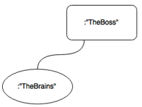{.calibre1}\

Figure 6. 3 Named processes allow other processes to reference them by
their name

In this case, both processes can refer to each other by their respective
names. However, a more general solution would be to have the server
process contain a reference to the top-level supervisor and the worker
supervisor as part of its *state*.

Where will the server get the references to both supervisors? When the
top-level supervisor starts the server, the supervisor can pass its own
pid to the server. In fact, this is exactly what we will do when we come
to the implementation of the top-level supervisor.

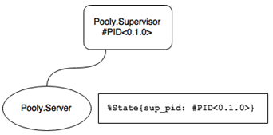{.calibre1}\

Figure 6. 3 A reference to the supervisor is stored in the state of
Pooly.Server

Now, since the server has a reference to the top-level supervisor, it
can tell it to start a child using the
`Pooly.WorkerSupervisor`{.codeintext} module, pass in the relevant bits
of the pool configuration, and `Pooly.WorkerSupervisor`{.codeintext}
will handle the rest.

The server process also maintains the state of the pool. We already know
that the server has to store references to the top-level supervisor and
the worker supervisor. What else should it store? For starters, it needs
to store details about the pool such as what kind of workers to create
and how many of them. The pool configuration provides this information.

6.3.1[       ]{.calibre13} Pool Configuration

The server accepts a pool configuration that comes in a keyword list. In
this version, an example pool configuration would look like this:

`[mfa: {SampleWorker, :start_link, []}, size: 5]`{.codeb}

The key `mfa`{.codeintext} stands for `m`{.codeintext}odule,
`f`{.codeintext}unction, and list of `a`{.codeintext}rguments of the
pool of worker(s) to be created.  `size`{.codeintext} is the number of
worker processes to be created.

Enough
jibber-jabber[[[[\[1\]]{.calibre18}]{.msofootnotereference}]{.msofootnotereference}](#ch06.html#up96ptASYY5BuP5vtTDTfHE){#ch06.html#u7YNvHigi67GoJPRzPXBQf4
.pcalibre1 .pcalibre2}, let's see some code! Create a file called
`server.ex`{.codeintext} and place it in `lib/pooly`{.codeintext}.

For now, we will make `Pooly.Server`{.codeintext} a *named process*,
which means that we can reference the server process using the module
name (i.e. `Pooly.Server.status`{.codeintext} instead of
`Pool.Server.status(pid)`{.codeintext}). Listing 6. 4 shows how this is
done:

Listing 6.4 lib/pooly/server.ex -- A reference to the top-level
supervisor and pool configuration is passed to initialize the server
process

`defmodule Pooly.Server do`{.codebcxspfirst}
`  use GenServer`{.codebcxspmiddle}
`  import Supervisor.Spec`{.codebcxspmiddle} ` `{.codebcxspmiddle}
`  #######`{.codebcxspmiddle} `  # API #`{.codebcxspmiddle}
`  #######`{.codebcxspmiddle} ` `{.codebcxspmiddle}
`  def start_link(sup, pool_config) do`{.codebcxspmiddle}
`    GenServer.start_link(__MODULE__, [sup, pool_config], name: __MODULE__)`{.codebcxspmiddle}
`  end`{.codebcxspmiddle} ` `{.codebcxspmiddle}`end`{.codebcxsplast}

The server process needs both the reference to the top-level supervisor
process and the pool configuration, which we pass in as
`[sup, pool_config]`{.codeintext}.

Now, we need to implement the `init/1`{.codeintext} callback. The
`init/1`{.codeintext} callback has two responsibilities. The first one
would be to validate the pool configuration. The second one would be to
initialize the state, as all good `init`{.codeintext} callbacks do.

6.3.2[       ]{.calibre13} Validating the Pool Configuration

A valid pool configuration looks like:

` [mfa: {SampleWorker, :start_link, []}, size: 5]`{.codeb}

This is a keyword list with two keys, `mfa`{.codeintext} and
`size`{.codeintext}. Any other key will be ignored. As the function goes
through the pool configuration keyword list, the state is gradually
built up:

Listing 6.5 lib/pooly/server.ex -- Setting up the state of the server
with multiple init/2 function clauses

`defmodule Pooly.Server do`{.codebcxspfirst}
`  use GenServer`{.codebcxspmiddle} ` `{.codebcxspmiddle}
`  defmodule State do                               #1`{.codebcxspmiddle}
`    defstruct sup: nil, size: nil, mfa: nil`{.codebcxspmiddle}
`  end`{.codebcxspmiddle} ` `{.codebcxspmiddle}
`  #############`{.codebcxspmiddle} `  # Callbacks #`{.codebcxspmiddle}
`  #############`{.codebcxspmiddle} ` `{.codebcxspmiddle}
`  def init([sup, pool_config]) when is_pid(sup) do #2`{.codebcxspmiddle}
`    init(pool_config, %State{sup: sup})`{.codebcxspmiddle}
`  end`{.codebcxspmiddle} ` `{.codebcxspmiddle}
`  def init([{:mfa, mfa}|rest], state) do           #3`{.codebcxspmiddle}
`    init(rest,  %{state | mfa: mfa})`{.codebcxspmiddle}
`  end`{.codebcxspmiddle} ` `{.codebcxspmiddle}
`  def init([{:size, size}|rest], state) do         #4`{.codebcxspmiddle}
`    init(rest, %{state | size: size})`{.codebcxspmiddle}
`  end`{.codebcxspmiddle} ` `{.codebcxspmiddle}
`  def init([_|rest], state) do                     #5`{.codebcxspmiddle}
`    init(rest, state)`{.codebcxspmiddle} `  end`{.codebcxspmiddle}
` `{.codebcxspmiddle}
`  def init([], state) do                           #6`{.codebcxspmiddle}
`    send(self, :start_worker_supervisor)           #7`{.codebcxspmiddle}
`    {:ok, state}`{.codebcxspmiddle} `  end`{.codebcxspmiddle}
` `{.codebcxspmiddle}`end`{.codebcxsplast}

Listing 6. 5 sets up the state of the server. #1 declares a
`struct`{.codeintext} that serves as a container for the server's
state.  #2 is the callback when `GenServer.start_link/3`{.codeintext} is
invoked.

The `init/1`{.codeintext} callback receives the pid of the top level
supervisor along with the pool configuration. It then calls
`init/2`{.codeintext}, which is given the pool configuration along with
a new state that contains the pid of the top-level supervisor.

Each element in a keyword list is represented by a two-element tuple,
where the first element is the key and the second element the value.

For now, we are interested in remembering the `mfa`{.codeintext} and
`size`{.codeintext} values of the pool configuration. #3 and #4 do
exactly that. If we wanted to add more fields to the state, we just add
more function clauses with the appropriate pattern. #5 ignores any
options that we do not care about.

Finally, once we have gone through the entire list as in #6, we expect
that that the state has been initialized. Remember that one of the valid
return values of `init/1`{.codeintext} is `{:ok, state}`{.codeintext}.
Since `init/1`{.codeintext} calls `init/2`{.codeintext}, and the empty
list case in #6 would be the last function clause invoked, it should
therefore return `{:ok, state}`{.codeintext}.

What is the curious looking line on #7? Once we reach #6, we are
confident that the state has been built. That is when we can start the
worker supervisor that we implemented previously. What is happening is
that the server process is sending a message to itself. Because
`send/2`{.codeintext} returns immediately, the `init/1`{.codeintext}
callback is not blocked. You do not want `init/1`{.codeintext} to time
out, do you?

While the number of `init/1`{.codeintext} functions can look
overwhelming, fret not. Individually, each function is as small as it
gets. Without pattern matching in the function arguments, we would need
to write a large conditional to capture all the possibilities.  

6.3.3[       ]{.calibre13} Starting the Worker Supervisor

When the server process sends a message to itself using
`send/2`{.codeintext}, the message is handled using
`handle_info/2`{.codeintext}:

Listing 6.6 lib/pooly/server.ex -- Callback handler for starting the
worker supervisor

`defmodule Pooly.Server do`{.codebcxspfirst} ` `{.codebcxspmiddle}
`  defstruct sup: nil, worker_sup: nil, size: nil, workers: nil, mfa: nil`{.codebcxspmiddle}
` `{.codebcxspmiddle} `  #############`{.codebcxspmiddle}
`  # Callbacks #`{.codebcxspmiddle} `  #############`{.codebcxspmiddle}
` `{.codebcxspmiddle}
`  def handle_info(:start_worker_supervisor, state = %{sup: sup, mfa: mfa, size: size}) do`{.codebcxspmiddle}
`    {:ok, worker_sup} = Supervisor.start_child(sup, supervisor_spec(mfa))        #1`{.codebcxspmiddle}
`    workers = prepopulate(size, worker_sup)              #2`{.codebcxspmiddle}
`    {:noreply, %{state | worker_sup: worker_sup, workers: workers}} #3`{.codebcxspmiddle}
`  end`{.codebcxspmiddle} ` `{.codebcxspmiddle}
`  #####################`{.codebcxspmiddle}
`  # Private Functions #`{.codebcxspmiddle}
`  #####################`{.codebcxspmiddle} ` `{.codebcxspmiddle}
`  defp supervisor_spec(mfa) do`{.codebcxspmiddle}
`    opts = [restart: :temporary]                       `{.codebcxspmiddle}
`    supervisor(Pooly.WorkerSupervisor, [mfa], opts)      #4`{.codebcxspmiddle}
`  end`{.codebcxspmiddle} ` `{.codebcxspmiddle}`end`{.codebcxsplast}

There's quite a bit going on in Listing 6.6. Since the state of the
server process contains the top-level supervisor pid
(`sup`{.codeintext}), we invoke `Supervisor.start_child/2`{.codeintext}
with the supervisor pid and a supervisor specification. After that, we
pass the pid of the newly created worker supervisor pid
(`worker_sup`{.codeintext}) and use it to start `size`{.codeintext}
number of workers. Finally, we update the state with the worker
supervisor pid and newly created workers.

#1 returns a tuple with the worker supervisor pid as the second element.
In #4, the supervisor specification consists of a worker supervisor as a
child. Notice that instead of

`worker(Pooly.WorkerSupervisor, [mfa], opts)`{.codeb}

We use the supervisor variant:

`supervisor(Pooly.WorkerSupervisor, [mfa], opts)`{.codeb}

Here, we pass in `restart: :temporary`{.codeintext} in #4 as the
supervisor specification. This means that the top-level supervisor will
not automatically restart the worker supervisor. This seems a bit odd.
Why? The reason is that we want to do something more than having the
supervisor restart the child. Because we want some custom recovery
rules, we "turn off" the supervisor\'s default behavior of automatically
restarting downed workers with `restart: :temporary`{.codeintext}.

Note that this version doesn't deal with any worker recovery should
crashes occur. The later versions will fix this. Let's deal with
pre-populating of the workers next.

6.3.4[       ]{.calibre13} Pre-populating the Worker Supervisor with
Workers

Given a `size`{.codeintext} option in the pool configuration, the worker
supervisor can pre-populate itself with a pool of workers. The
`prepopulate/2`{.codeintext} function in Listing 6. 7 takes in a size
and the worker supervisor pid, and builds a list of `size`{.codeintext}
number of workers, as seen in #1:

Listing 6.7 lib/pooly/server.ex -- Prepopulating the worker supervisor
with workers

`defmodule Pooly.Server do`{.codebcxspfirst} ` `{.codebcxspmiddle}
`  #####################`{.codebcxspmiddle}
`  # Private Functions #`{.codebcxspmiddle}
`  #####################`{.codebcxspmiddle} ` `{.codebcxspmiddle}
`  defp prepopulate(size, sup) do`{.codebcxspmiddle}
`    prepopulate(size, sup, [])`{.codebcxspmiddle}
`  end`{.codebcxspmiddle} ` `{.codebcxspmiddle}
`  defp prepopulate(size, _sup, workers) when size < 1 do`{.codebcxspmiddle}
`    workers`{.codebcxspmiddle} `  end`{.codebcxspmiddle}
` `{.codebcxspmiddle}
`  defp prepopulate(size, sup, workers) do`{.codebcxspmiddle}
`    prepopulate(size-1, sup, [new_worker(sup) | workers]) #1`{.codebcxspmiddle}
`  end`{.codebcxspmiddle} ` `{.codebcxspmiddle}
`  defp new_worker(sup) do`{.codebcxspmiddle}
`    {:ok, worker} = Supervisor.start_child(sup, [[]]) #2`{.codebcxspmiddle}
`    worker`{.codebcxspmiddle} `  end`{.codebcxspmiddle}
` `{.codebcxspmiddle}`end`{.codebcxsplast}

#1 Creates a list of workers that is attached to the worker supervisor.

#2 Dynamically create a worker process and attaching it to the
supervisor.

6.3.5[       ]{.calibre13} Creating a New Worker Process

The `new_worker/1`{.codeintext} function in Listing 6. 7 is worth a
look. Here, we use the `Supervisor.start_child/2`{.codeintext} once
again to spawn the worker processes. Instead of passing in a child
specification, we pass in a *list of arguments*.

::: calibre20
The two flavors of Supervisor.start_child/2
:::

There are two flavors of
[`Supervisor.start_child/2`{.codeintext}]{.calibre21}. The first one
takes in a child specification:

[`{:ok, sup} = Supervisor.start_child(sup, supervisor_spec(mfa))`{.sidebaracode}]{lang="BS-LATN-BA"}

The other flavor takes in a list of arguments:

[`{:ok, worker} = Supervisor.start_child(sup, [[]])`{.sidebaracode}]{lang="BS-LATN-BA"}

Which flavor should you use?
[`Pooly.WorkerSupervisor`{.codeintext}]{.calibre21} uses a
[`:simple_one_for_one`{.codeintext}]{.calibre21} restart strategy. This
means that the child specification has already been pre-defined. Which
means that the first flavor is out -- the second one is what you want.

The second version lets you pass *additional* arguments to the worker.
What happens under the hood is that the arguments defined in the child
specification when creating
[`Pooly.WorkerSupervisor`{.codeintext}]{.calibre21} is *concatenated*
with the list passed into the
[`Supevisor.start_child/2`{.codeintext}]{.calibre21} and the result is
then passed along to the worker process during initialization.

::: calibre22
 
:::

The return result of `new_worker/2`{.codeintext} is the pid of the newly
created worker. We have not yet implemented a way of *getting a worker
out* of a pool, and its dual, *putting a worker back* into the pool.
There two actions are also known as *checking out* and *checking in* a
worker respectively. But before we do that, we need to do a brief detour
and talk about ETS in the next section.

6.3.6[       ]{.calibre13} Just Enough ETS

In this chapter and the next, we will make use of ETS, also known as
Erlang Term Storage. This section will give you just enough background
to understand the ETS-related code in this chapter and the next.

What is ETS

It is in essence a very efficient in-memory database built specially to
store Erlang/Elixir data. It is able to store large amounts of data
without breaking a sweat. Data access is also done in constant time.  It
comes for free Erlang, which means we have to use `:ets`{.codeintext} in
order to access it from Elixir.

Creating a New ETS Table

Creating a table is done using `:ets.new/2`{.codeintext}. Let's create a
table to store my Mum's favorite artists, their date of birth and genre:

`iex> :ets.new(:mum_faves, [])`{.codebcxspfirst} `12308`{.codebcxsplast}

The most basic form takes it an atom representing the name of the table,
and an empty list of options. The return value of
`:ets.new/2`{.codeintext} is a table ID, which is akin to a pid. The
process that created the ETS table is deemed the *owner process*. In
this case, the `iex`{.codeintext} process is the owner. The most common
options are related to the ETS table's *type*, *access rights* and
whether it is *named*.

ETS Table Types

ETS tables come in four different flavors:

[·[     ]{.calibre16}]{.calibre12} `:set`{.codeintext} -- This is the
default. Its characteristics are exactly the set data structure you
might have learned about in CS101 (unordered, each unique key mapping to
an element).

[·[     ]{.calibre16}]{.calibre12} `:ordered_set`{.codeintext} -- A
sorted version of `:set`{.codeintext}.

[·[     ]{.calibre16}]{.calibre12} `:bag`{.codeintext} -- Rows with the
same keys *are allowed*, but the rows must be different.

[·[     ]{.calibre16}]{.calibre12} `:duplicate_bag`{.codeintext} -- Same
as `:bag`{.codeintext} but without the row-uniqueness restriction.

In this chapter and the next, we are going to use `:set`{.codeintext},
which essentially means we don't have to specify the table type in the
list of options. If we wanted to be specific, we would create the table
like so:

`iex> :ets.new(:mum_faves, [:set])`{.codeb}

Access Rights

Access rights control which process can read from and write to the ETS
table. There are three options:

[·[     ]{.calibre16}]{.calibre12} `:protected`{.codeintext} -- The
owner process has full read and write permissions. All other processes
can only read from it. This is the default.

[·[     ]{.calibre16}]{.calibre12} `:public`{.codeintext} -- No
restrictions on reading and writing.

[·[     ]{.calibre16}]{.calibre12} `:private`{.codeintext} -- Only the
owner process can read from and write to the table.

We will use `:private`{.codeintext} tables in this chapter, because we
will be storing pool-related data that other pools have no business
knowing about. So let's say my Mom is pretty shy about her eclectic
music tastes, and wants to make the table private:

`iex> :ets.new(:mum_faves, [:set, :private])`{.codeb}

Named Tables

Notice that when we created the ETS table, we supplied an atom. This is
slightly misleading because we *cannot* use `:mum_faves`{.codeintext} to
refer to the table without supplying the `:named_table`{.codeintext}
option. Therefore, to use `:mum_faves`{.codeintext} instead of a
unintelligible reference like `12308`{.codeintext}, you can do:

`iex> :ets.new(:mum_faves, [:set, :private, :named_table])`{.codebcxspfirst}
`:mum_faves`{.codebcxsplast}

Note that if you try run the line above again, you will get:

`iex> :ets.new(:mum_faves, [:set, :private, :named_table])`{.codebcxspfirst}
`   ** (ArgumentError) argument error`{.codebcxspmiddle}`    (stdlib) :ets.new(:mum_faves, [:set, :private, :named_table])`{.codebcxsplast}

That's because names should be a *unique* reference to an ETS table.

Inserting and Deleting Data

Data is inserted using the `:ets.insert/2`{.codeintext} function. The
first argument is the table identifier (the number or the name), the
second argument is the data. The data comes in the form of a tuple,
where the first element is the key, and the second can be *any*,
*arbitrarily nested* term. Here are a few of Mum's favorites:

`iex> :ets.insert(:mum_faves, {“Michael Bolton”, 1953, “Pop”})`{.codebcxspfirst}
`true`{.codebcxspmiddle}
`iex> :ets.insert(:mum_faves, {“Engelbert Humperdinck”, 1936, “Easy Listening”})`{.codebcxspmiddle}
`true`{.codebcxspmiddle}
`iex> :ets.insert(:mum_faves, {“Justin Beiber”, 1994, “Teen”})`{.codebcxspmiddle}
`true`{.codebcxspmiddle}
`iex> :ets.insert(:mum_faves, {“Jim Reeves”, 1923, “Country”})`{.codebcxspmiddle}
`true`{.codebcxspmiddle}
`iex> :ets.insert(:mum_faves, {“Cyndi Lauper”, 1953, “Pop”})`{.codebcxspmiddle}`true`{.codebcxsplast}

We can take a look at what's in the table using
`:ets.tab2list/1`{.codeintext}:

[`iex> :ets.tab2list(:mum_faves)`{.codebcxspfirst}]{lang="FR"}
`[{“Michael Bolton”, 1953, “Pop”},`{.codebcxspmiddle}
` {“Cyndi Lauper”, 1953, “Pop”},`{.codebcxspmiddle}
` {“Justin Beiber”, 1994, “Teen”},`{.codebcxspmiddle}
` {“Engelbert Humperdinck”, 1936, “Easy Listening”},`{.codebcxspmiddle}` {“Jim Reeves”, 1923, “Country”}]`{.codebcxsplast}

Note that the return result is a list, and that the elements within the
list are unordered. All right, I lied. My Mum isn't really a Justin
Beiber
fan[[[[\[2\]]{.calibre18}]{.msofootnotereference}]{.msofootnotereference}](#ch06.html#uWwoyrKLmBpPBX94Gi5Hau2){#ch06.html#unZsK4dstzhrpK6CA9DbDs8
.pcalibre1 .pcalibre2}. Let's rectify this:

`iex> :ets.delete(:mum_faves, “Justin Beiber”)`{.codebcxspfirst}
`true`{.codebcxsplast}

Looking up Data

A table is of no use if we cannot retrieve data. The simplest way to do
that is to use the key. What's Michael Bolton's birth year? Let's find
out:

`iex> :ets.lookup(:mum_faves, “Michael Bolton”)`{.codebcxspfirst}
`[{“Michael Bolton”, 1953, “Pop”}]`{.codebcxsplast}

Why is the result a list? Recall that ETS supports other types, such as
the `:duplicate_bag`{.codeintext}, which allows for duplicated rows.
Therefore, the most general data structure to represent this is the
humble list.

What if you wanted to search by the *year* instead? We can use
`:ets.match/2`{.codeintext}:

`iex> :ets.match(:mum_faves, {:”$1”, 1953, :”$2”})`{.codebcxspfirst}
`[[“Michael Bolton”, “Pop”], [“Cyndi Lauper”, “Pop”]]`{.codebcxsplast}

We pass in a *pattern*, which looks slightly strange at first sight.
Since we are only querying using the year, we use `:”$N`{.codeintext}"
as placeholders, where `N`{.codeintext} is an integer. These numbers
correspond to the order in which the elements in each matching result
are presented. Let's swap the placeholders:

`iex(20)> :ets.match(:mum_faves, {:”$2”, 1953, :”$1”})`{.codebcxspfirst}
`[[“Pop”, “Michael Bolton”], [“Pop”, “Cyndi Lauper”]]`{.codebcxsplast}

You can clearly see now that the genre comes before the artiste name.
What if you only cared about returning the artiste? We can use an
underscore to omit the genre like so:

`iex(25)> :ets.match(:mum_faves, {:”$1”, 1953, :”_”})`{.codebcxspfirst}
`[[“Michael Bolton”], [“Cyndi Lauper”]]`{.codebcxsplast}

There is much more to learn about ETS, but this is all the information
you need to understand the ETS bits of the code. Let's go back to
checking out a worker form the pool.

6.3.7[       ]{.calibre13} Checking-out a Worker

When a consumer process checks out a worker from the pool, there are a
few key logistical issues to handle such as:

[·[     ]{.calibre16}]{.calibre12} What is the pid of the consumer
process?

[·[     ]{.calibre16}]{.calibre12} Which worker pid is the consumer
process using?

The consumer process needs to be *monitored* by the server because if it
dies, the server process needs to know about it and take recovery
action. Once again, we are not implementing the recovery code yet, but
laying the groundwork.

We also need to know which worker the consumer process so that when we
can pinpoint which consumer process used which worker pid. Here's the
implementation of checking out of workers:

Listing 6.8 lib/pooly/server.ex -- Checking out of a worker

`defmodule Pooly.Server do`{.codebcxspfirst} ` `{.codebcxspmiddle}
`  #######`{.codebcxspmiddle} `  # API #`{.codebcxspmiddle}
`  #######`{.codebcxspmiddle} ` `{.codebcxspmiddle}
`  def checkout do`{.codebcxspmiddle}
`    GenServer.call(__MODULE__, :checkout)`{.codebcxspmiddle}
`  end`{.codebcxspmiddle} ` `{.codebcxspmiddle} ` `{.codebcxspmiddle}
`  #############`{.codebcxspmiddle} `  # Callbacks #`{.codebcxspmiddle}
`  #############`{.codebcxspmiddle} ` `{.codebcxspmiddle}
`  def handle_call(:checkout, {from_pid, _ref}, %{workers: workers, monitors: monitors} = state) do                               #1`{.codebcxspmiddle}
`    case workers do                                           #2`{.codebcxspmiddle}
`      [worker|rest] ->`{.codebcxspmiddle}
`        ref = Process.monitor(from_pid)                       #3`{.codebcxspmiddle}
`        true = :ets.insert(monitors, {worker, ref})           #4`{.codebcxspmiddle}
`        {:reply, worker, %{state | workers: rest}}`{.codebcxspmiddle}
` `{.codebcxspmiddle} `      [] ->`{.codebcxspmiddle}
`        {:reply, :noproc, state}`{.codebcxspmiddle}
`    end`{.codebcxspmiddle} `  end`{.codebcxspmiddle}
` `{.codebcxspmiddle}`end`{.codebcxsplast}

We will use an ETS table to store the monitors. The implementation of
the callback function is interesting. There are two cases to handle.
Either we have workers left for checking out, or we don't. In the latter
case, we return `{:reply, :noproc, state}`{.codeintext} signifying that
no processes are available. In most examples about GenServers, you see
that the `from`{.codeintext} parameter is usually ignored:

`def handle_call(:checkout, _from, state) do`{.codebcxspfirst}
`  # …`{.codebcxspmiddle}`end                  `{.codebcxsplast}

In this instance, `from`{.codeintext} is *very* useful. Note that
`from`{.codeintext} is in fact a two-element tuple consisting of the
client pid and a tag (a reference). In #1, we care only about the pid of
the client. We use the pid of the client (`from_pid`{.codeintext}) and
get the server process to monitor it. Then in #4 we use the resulting
reference and add it into the ETS table. Finally, the state is updated
with one worker less.

We now need to update the `init/1`{.codeintext} callback because we have
introduced a new `monitors`{.codeintext} field to store the monitors ETS
table:

Listing 6.9 lib/pooly/server.ex -- Storing a reference to the monitors
ETS table into the state of the server

`defmodule Pooly.Server do`{.codebcxspfirst} ` `{.codebcxspmiddle}
`  #############`{.codebcxspmiddle} `  # Callbacks #`{.codebcxspmiddle}
`  #############`{.codebcxspmiddle} ` `{.codebcxspmiddle}
`  def init([sup, pool_config]) when is_pid(sup) do`{.codebcxspmiddle}
`    monitors = :ets.new(:monitors, [:private])                #1`{.codebcxspmiddle}
`    init(pool_config, %State{sup: sup, monitors: monitors})   #1`{.codebcxspmiddle}
`  end`{.codebcxspmiddle}`end`{.codebcxsplast}

#1 Update the state to store the monitors table

6.3.8[       ]{.calibre13} Checking-in a Worker

The reverse of checking out a worker is (wait for it) checking in. In
fact, the implementation shown in Listing 6. 10 is the reverse of
Listing 6. 8:

Listing 6.10 lib/pooly/server.ex -- Checking in a worker

`defmodule Pooly.Server do`{.codebcxspfirst} ` `{.codebcxspmiddle}
`  #######`{.codebcxspmiddle} `  # API #`{.codebcxspmiddle}
`  #######`{.codebcxspmiddle} ` `{.codebcxspmiddle}
`  def checkin(worker_pid) do`{.codebcxspmiddle}
`    GenServer.cast(__MODULE__, {:checkin, worker_pid})`{.codebcxspmiddle}
`  end`{.codebcxspmiddle} ` `{.codebcxspmiddle}
`  #############`{.codebcxspmiddle} `  # Callbacks #`{.codebcxspmiddle}
`  #############`{.codebcxspmiddle} ` `{.codebcxspmiddle}
`  def handle_cast({:checkin, worker}, %{workers: workers, monitors: monitors} = state) do`{.codebcxspmiddle}
`    case :ets.lookup(monitors, worker) do`{.codebcxspmiddle}
`      [{pid, ref}] ->`{.codebcxspmiddle}
`        true = Process.demonitor(ref)                 `{.codebcxspmiddle}
`        true = :ets.delete(monitors, pid)             `{.codebcxspmiddle}
`        {:no_reply, %{state | workers: [pid|workers]}}`{.codebcxspmiddle}
`      [] ->`{.codebcxspmiddle}
`        {:no_reply, state}`{.codebcxspmiddle}
`    end`{.codebcxspmiddle} `  end`{.codebcxspmiddle}
` `{.codebcxspmiddle}`end`{.codebcxsplast}

Given a worker pid (`worker`{.codeintext}), the entry is searched for in
the `monitors`{.codeintext} ETS table. If an entry is not found, nothing
is done. If an entry is found, then the consumer process is
de-monitored, the entry removed from the ETS table, and the
`workers`{.codeintext} field of the server state is updated with the
addition of the pid of the worker.

6.3.9[       ]{.calibre13} Getting the Status of the Pool

We would like to have some insight into our pool. That is simple enough
to implement:

Listing 6.11 lib/pooly/server.ex -- Getting the status of the pool

`defmodule Pooly.Server do`{.codebcxspfirst} ` `{.codebcxspmiddle}
`  #######`{.codebcxspmiddle} `  # API #`{.codebcxspmiddle}
`  #######`{.codebcxspmiddle} ` `{.codebcxspmiddle}
`  def status do`{.codebcxspmiddle}
`    GenServer.call(__MODULE__, :status)`{.codebcxspmiddle}
`  end`{.codebcxspmiddle} ` `{.codebcxspmiddle}
`  #############`{.codebcxspmiddle} `  # Callbacks #`{.codebcxspmiddle}
`  #############`{.codebcxspmiddle} ` `{.codebcxspmiddle}
`  def handle_call(:status, _from, %{workers: workers, monitors: monitors} = state) do`{.codebcxspmiddle}
`    {:reply, {length(workers), :ets.info(monitors, :size)}, state}`{.codebcxspmiddle}
`  end`{.codebcxspmiddle} ` `{.codebcxspmiddle}`end`{.codebcxsplast}

This gives some information about the number of workers available and
the number of checked out (busy) workers.

6.4[          ]{.calibre14} Implementing the Top Level Supervisor

There's one last piece before we can claim version 1 as feature
complete[[[[\[3\]]{.calibre18}]{.msofootnotereference}]{.msofootnotereference}](#ch06.html#u6i3m7eccaU4Iqg9jh9Wyh4){#ch06.html#u5UHZe9erUMjrZtCEGXEoxG
.pcalibre1 .pcalibre2}.  Create `supervisor.ex`{.codeintext} in
`lib/pooly`{.codeintext}. This will be the top-level supervisor. Here's
the full implementation:

Listing 6.12 lib/pooly/supervisor.ex -- The top-level supervisor

`defmodule Pooly.Supervisor do`{.codebcxspfirst}
`  use Supervisor`{.codebcxspmiddle} ` `{.codebcxspmiddle}
`  def start_link(pool_config) do`{.codebcxspmiddle}
`    Supervisor.start_link(__MODULE__, pool_config)`{.codebcxspmiddle}
`  end`{.codebcxspmiddle} ` `{.codebcxspmiddle}
`  def init(pool_config) do`{.codebcxspmiddle}
`    children = [`{.codebcxspmiddle}
`      worker(Pooly.Server, [self, pool_config])`{.codebcxspmiddle}
`    ]`{.codebcxspmiddle} ` `{.codebcxspmiddle}
`    opts = [strategy: :one_for_all]`{.codebcxspmiddle}
` `{.codebcxspmiddle} `    supervise(children, opts)`{.codebcxspmiddle}
`  end`{.codebcxspmiddle} ` `{.codebcxspmiddle}`end`{.codebcxsplast}

As you can see, the structure of `Pooly.Supervisor`{.codeintext} is very
similar to `Pooly.WorkerSupervisor`{.codeintext}. The
`start_link/1`{.codeintext} function takes a `pool_config`{.codeintext}.
The `init/1`{.codeintext} callback receives the pool configuration.

The `children`{.codeintext} list consists of the
`Pooly.Server`{.codeintext}. Recall that
`Pooly.Server.start_link/2`{.codeintext} takes in two arguments, first
the pid of the top-level supervisor process (the one we are working on
right now) and the pool configuration.

What about the worker supervisor? Why aren't we supervising it? Now it
should be clear that because it is the *server* that starts the worker
supervisor, therefore it is not included here at first.

The restart strategy we use here is `:one_for_all`{.codeintext}. Why not
say, `:one_for_one`{.codeintext}? Think about it for a moment.

What happens when the server crashes? It loses all its state. When the
server process restarts, the state is essentially a blank slate.
Therefore, the state of the server is inconsistent with the actual pool
state.

What happens if the worker supervisor crashes? Then the pid of the
worker supervisor would be different, along with the worker processes.
Once again, the state of the server would be inconsistent with the
actual pool state.

There is a *dependency* between the server process and the worker
supervisor. If either goes down, it should take the other down with it
-- hence the `:one_for_all`{.codeintext} restart strategy.

6.5[          ]{.calibre14} Making Pooly an OTP Application

Create a file called `pooly.ex`{.codeintext} in `lib`{.codeintext}. We
will be creating an OTP application, which serves as an entry point to
Pooly. It also serves to contain convenience functions such as
`start_pool/1`{.codeintext} so that clients can say
`Pooly.start_pool/2`{.codeintext} instead of
`Pooly.Server.start_pool/2`{.codeintext}. First, add this into
`pooly.ex`{.codeintext}:

Listing 6. 13 lib/pooly.ex -- The Pooly application

`defmodule Pooly do`{.codebcxspfirst}
`  use Application`{.codebcxspmiddle} ` `{.codebcxspmiddle}
`  def start(_type, _args) do`{.codebcxspmiddle}
`    pool_config = [mfa: {SampleWorker, :start_link, []}, size: 5]`{.codebcxspmiddle}
`    start_pool(pool_config)`{.codebcxspmiddle}
`  end`{.codebcxspmiddle} ` `{.codebcxspmiddle}
`  def start_pool(pool_config) do`{.codebcxspmiddle}
`    Pooly.Supervisor.start_link(pool_config)`{.codebcxspmiddle}
`  end`{.codebcxspmiddle} ` `{.codebcxspmiddle}
`  def checkout do`{.codebcxspmiddle}
`    Pooly.Server.checkout`{.codebcxspmiddle} `  end`{.codebcxspmiddle}
` `{.codebcxspmiddle} `  def checkin(worker_pid) do`{.codebcxspmiddle}
`    Pooly.Server.checkin(worker_pid)`{.codebcxspmiddle}
`  end`{.codebcxspmiddle} ` `{.codebcxspmiddle}
`  def status do`{.codebcxspmiddle}
`    Pooly.Server.status`{.codebcxspmiddle} `  end`{.codebcxspmiddle}
` `{.codebcxspmiddle}`end`{.codebcxsplast}

`Pooly`{.codeintext} uses an OTP *Application* behavior. What we have
done here is to specify `start/2`{.codeintext}, which is called first
when `Pooly`{.codeintext} is initialized. We have predefined a pool
configuration and a call to `start_pool/1`{.codeintext} simply out of
convenience.

6.6[          ]{.calibre14} Bringing Pooly for a Spin

First, open `mix.exs`{.codeintext} and modify
`application/0`{.codeintext}:

`defmodule Pooly.Mixfile do`{.codebcxspfirst}
`  use Mix.Project`{.codebcxspmiddle} ` `{.codebcxspmiddle}
`  def project do`{.codebcxspmiddle}
`    [app: :pooly,`{.codebcxspmiddle}
`     version: "0.0.1",`{.codebcxspmiddle}
`     elixir: "~> 1.0",`{.codebcxspmiddle}
`     build_embedded: Mix.env == :prod,`{.codebcxspmiddle}
`     start_permanent: Mix.env == :prod,`{.codebcxspmiddle}
`     deps: deps]`{.codebcxspmiddle} `  end`{.codebcxspmiddle}
` `{.codebcxspmiddle} `  def application do`{.codebcxspmiddle}
`    [applications: [:logger],`{.codebcxspmiddle}
`              mod: {Pooly, []}] #1`{.codebcxspmiddle}
`  end`{.codebcxspmiddle} ` `{.codebcxspmiddle}
`  defp deps do`{.codebcxspmiddle} `    []`{.codebcxspmiddle}
`  end`{.codebcxspmiddle}`end`{.codebcxsplast}

#1 Start the Pooly application

Next, head to the project directory and launch `iex`{.codeintext}:

`% iex -S mix`{.codeb}

Next, fire up Observer:

`iex> :observer.start`{.codeb}

Select the *Applications* tab and you will see something similar to
this:

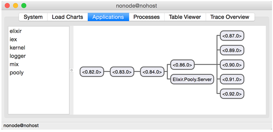{.calibre1}\

Figure 6.4 Version 1 of Pooly as seen from Observer

Let's start by killing a worker. (I hope you are not reading this book
aloud). You can do this by right-click on a worker process and selecting
*Kill process*:

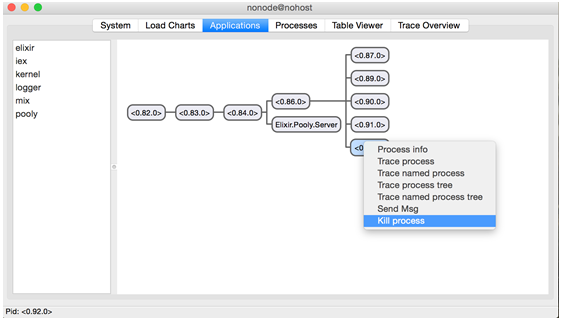{.calibre1}\

Figure 6.5 Killing a worker from Observer

You would realize that the supervisor spawned a new worker in the killed
processes' place.

More importantly, the crash/exit of a single worker didn't affect the
rest of the supervision tree. In other words, the crash of that single
worker was isolated only to *that* worker, and didn't affect anything
else.

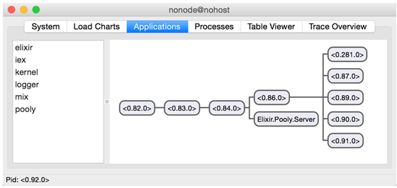{.calibre1}\

Figure 6. 6 The supervisor replaced a killed worker with a newly spawned
worker

Now, what happens if we kill `Pooly.Server`{.codeintext}? Once again,
right click on the `Pooly.Server`{.codeintext} and select *Kill process*
like so:

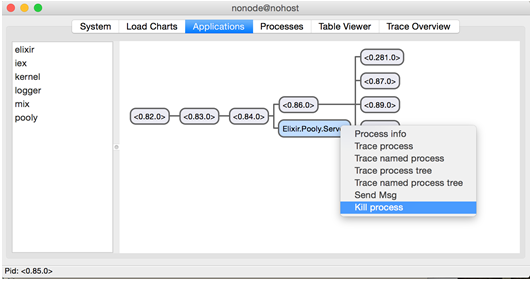{.calibre1}\

Figure 6. 7 Killing the Server process from Observer

This time, *all* the processes were killed and the top-level restarted
*all* its child processes:

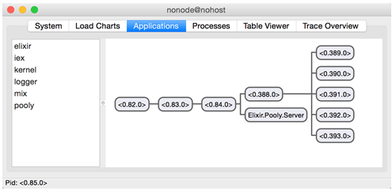{.calibre1}\

Figure 6. 8 Killing the Server restarted all the processes under the
top-level supervisor

What just happened? Why did the killing of `Pooly.Server`{.codeintext}
cause everything under the top-level supervisor to die? The mere
description of the effect should already yield an important clue. What
is the restart strategy of the top-level supervisor?

Let's jolt our memory a little:

`defmodule Pooly.Supervisor do`{.codebcxspfirst} ` `{.codebcxspmiddle}
`  def init(pool_config) do`{.codebcxspmiddle}
`    # …`{.codebcxspmiddle}
`    opts = [strategy: :one_for_all]`{.codebcxspmiddle}
` `{.codebcxspmiddle} `    supervise(children, opts)`{.codebcxspmiddle}
`  end`{.codebcxspmiddle} ` `{.codebcxspmiddle}`end`{.codebcxsplast}

The `:one_for_all`{.codeintext} restart strategy explains exactly why
the killing of `Pooly.Server`{.codeintext} brought down (and restarted)
the rest of the children.

6.7[          ]{.calibre14} Exercises

1.[ ]{.calibre16} What happens when you kill the
`WorkerSupervisor`{.codeintext} process in Observer? Can you explain
what happened?

2.[ ]{.calibre16} Shutdown and Restart values. Play around with the
various shutdown and restart values. For example, in
`Pooly.WorkerSupervisor`{.codeintext}, try changing `opts`{.codeintext}
from

`opts = [strategy: :simple_one_for_one, `{.codebcxspfirst}
`        max_restarts: 5,`{.codebcxspmiddle}`        max_seconds: 5]`{.codebcxsplast}

To something like

`opts = [strategy: :simple_one_for_one, `{.codebcxspfirst}
`        max_restarts: 0,`{.codebcxspmiddle}`        max_seconds: 5]`{.codebcxsplast}

Next, try changing `worker_opts`{.codeintext} from

` worker_opts = [restart:  :permanent, function: f]`{.codeb}

To

`worker_opts = [restart:  :temporary, function: f]`{.codeb}

Remember to set back `opts`{.codeintext} to the original value.

6.8[          ]{.calibre14} Summary

In this chapter, we learned about:

[·[     ]{.calibre16}]{.calibre12} OTP Supervisor behavior

[·[     ]{.calibre16}]{.calibre12} Different supervisor restart
strategies

[·[     ]{.calibre16}]{.calibre12} Using ETS to store state

[·[     ]{.calibre16}]{.calibre12} How to construct supervisor
hierarchies, both static and dynamic

[·[     ]{.calibre16}]{.calibre12} The various supervisor and child
specification options

[·[     ]{.calibre16}]{.calibre12} Implementing a very basic worker pool
application

We have seen how, using different restart strategies, the Supervisor can
dictate how its children restart. More importantly, depending again on
the restart strategy, the supervisor is able to isolate crashes to only
the process affected.

Even though the first version of Pooly is simple, it allowed us to
experiment with constructing both static and dynamic supervision
hierarchies. In the former case, we declared in the supervision
specification of `Pooly.Supervisor`{.codeintext} that
`Pooly.Server`{.codeintext} is to be supervised. In the latter case,
`Pooly.WorkerSupervisor`{.codeintext} is only added to the supervision
tree when `Pooly.Server`{.codeintext} is initialized.

In the following chapter, we will continue to evolve the design of Pooly
while adding more features it. At the same time, we will explore more
advanced uses of Supervisor.
:::

::: calibre2
::: {#ch06.html#ftn1 .calibre2}
[[**[[**[\[1\]]{.calibre29}**]{.msofootnotereference}]{.calibre28}**]{.msofootnotereference}](#ch06.html#u7YNvHigi67GoJPRzPXBQf4){#ch06.html#up96ptASYY5BuP5vtTDTfHE
.pcalibre1 .pcalibre2} [This was written with the voice of Mr.T in
mind.]{.calibre30}
:::

::: {#ch06.html#ftn2 .calibre2}
[[**[[**[\[2\]]{.calibre29}**]{.msofootnotereference}]{.calibre28}**]{.msofootnotereference}](#ch06.html#unZsK4dstzhrpK6CA9DbDs8){#ch06.html#uWwoyrKLmBpPBX94Gi5Hau2
.pcalibre1 .pcalibre2} [She isn't a Cyndi Lauper fan either, but I was
listening to "Girls just want to have fun" while writing
this.]{.calibre30}
:::

::: {#ch06.html#ftn3 .calibre2}
[[**[[**[\[3\]]{.calibre29}**]{.msofootnotereference}]{.calibre28}**]{.msofootnotereference}](#ch06.html#u5UHZe9erUMjrZtCEGXEoxG){#ch06.html#u6i3m7eccaU4Iqg9jh9Wyh4
.pcalibre1 .pcalibre2} [A rare occurrence in the software
industry.]{.calibre30}
:::
:::

[]{#ch07.html}

::: wordsection
# 7[  ]{.calibre11} Completing the Worker Pool Application {#ch07.html#heading_id_2 .cochapternumber}

This chapter covers:

[·[     ]{.calibre13}]{.calibre12} Implement the entire worker pool
application

[·[     ]{.calibre13}]{.calibre12} Build multiple supervision
hierarchies

[·[     ]{.calibre13}]{.calibre12} Dynamically creating supervisors and
workers

In this chapter, we will continue to evolve the design of
`Pooly`{.codeintext}, which we started in Chapter 6. By the end of this
chapter, we would have a full, working worker pool application. We will
get to explore other the Supervisor API more thoroughly, and also
explore more advanced (read: fun!) supervisor topics.

In chapter 6, we were left with a very rudimentary worker pool
application, if we can even call it that. In the following sections,
will add some smarts into `Pooly`{.codeintext}. For example, there is
currently no way of handling crashes and restarts gracefully. The
current version of `Pooly`{.codeintext} can only handle a single pool
with a fixed number of workers. Version 3 of `Pooly`{.codeintext} will
implement support for multiple pools and support for variable number of
worker processes.

Sometimes the pool must deal with unexpected load. What happens when
there are too many requests? What happens when all the workers are busy?
In version 4, we make pools be variable-sized that allows for the
*overflowing* of workers. We also implement queuing for consumer
processes when all workers are busy.

7.1[          ]{.calibre14} Version 3: Error Handling, Multiple Pools
and Workers

How can we tell if a process crashes? We can either monitor or link to
it. This leads to the next question, which should we choose? To answer
that question, we must think about what should happen when processes
crash. There are two cases to consider. There can be crashes between:

[·[     ]{.calibre16}]{.calibre12} Server process and Consumer process

[·[     ]{.calibre16}]{.calibre12} Server process and Worker process

7.1.1[       ]{.calibre13} Case 1: Crashes between the Server and Worker

A crash of the server process shouldn't affect a consumer process. In
fact, the reverse is also true! When a consumer process crashes, it
shouldn't crash the server process. Therefore, *monitors* are the way to
go.

We are already monitoring the consumer process each time a checkout of a
worker is made. What's left is to handle the `:DOWN`{.codeintext}
message of a consumer process:

Listing 7.1 lib/pooly/server.ex -- Handling :DOWN message from a
consumer

`defmodule Pooly.Server do`{.codebcxspfirst} ` `{.codebcxspmiddle}
`  #############`{.codebcxspmiddle} `  # Callbacks #`{.codebcxspmiddle}
`  #############`{.codebcxspmiddle} ` `{.codebcxspmiddle}
`  def handle_info({:DOWN, ref, _, _, _}, state = %{monitors: monitors, workers: workers}) do`{.codebcxspmiddle}
`    case :ets.match(monitors, {:”$1”, ref}) do`{.codebcxspmiddle}
`      [[pid]] ->`{.codebcxspmiddle}
`        true = :ets.delete(monitors, pid)`{.codebcxspmiddle}
`        new_state = %{state | workers: [pid|workers]} #1`{.codebcxspmiddle}
`        {:no_reply, new_state}`{.codebcxspmiddle} ` `{.codebcxspmiddle}
`      [[]] ->`{.codebcxspmiddle}
`        {:no_reply, state}`{.codebcxspmiddle}
`    end`{.codebcxspmiddle} `  end`{.codebcxspmiddle}
` `{.codebcxspmiddle}`end`{.codebcxsplast}

#1 Return the worker back to the pool

When a consumer process goes down, we match the reference in the
`monitors`{.codeintext} ETS table, delete the monitor, and add back the
worker into the state.

7.1.2[       ]{.calibre13} Case 2: Crashes between the Server and Worker

If the server crashes, should it bring down the worker process? It
should, because otherwise, the state of the server will be inconsistent
with the pool's actual state. On the other hand, when a worker process
crashes, should it bring down the server process? Of course not! What
does this mean for us? Well, because of the bi-directional dependency,
we should be using *links*. However, since the server should *not* crash
when a worker process crashes, the server process should trap exits:

Listing 7.2 lib/pooly/server.ex -- Make the server process trap exits to
prevent worker processes from crashing itself

`defmodule Pooly.Server do`{.codebcxspfirst} ` `{.codebcxspmiddle}
`  #############`{.codebcxspmiddle} `  # Callbacks #`{.codebcxspmiddle}
`  #############`{.codebcxspmiddle}
`  def init([sup, pool_config]) when is_pid(sup) do`{.codebcxspmiddle}
`    Process.flag(:trap_exit, true)                          #1`{.codebcxspmiddle}
`    monitors = :ets.new(:monitors, [:private])`{.codebcxspmiddle}
`    init(pool_config, %State{sup: sup, monitors: monitors})`{.codebcxspmiddle}
`  end`{.codebcxspmiddle} ` `{.codebcxspmiddle}`end`{.codebcxsplast}

#1 Set the server process to trap exits.

With the server process now trapping exits, we should now handle
`:EXIT`{.codeintext} messages coming from workers:

Listing 7.3 lib/pooly/server.ex -- Handling :EXIT messages from workers
in the pool server

`defmodule Pooly.Server do`{.codebcxspfirst} ` `{.codebcxspmiddle}
`  #############`{.codebcxspmiddle} `  # Callbacks #`{.codebcxspmiddle}
`  #############`{.codebcxspmiddle} ` `{.codebcxspmiddle}
`  def handle_info({:EXIT, pid, _reason}, state = %{monitors: monitors, workers: workers, worker_sup: worker_sup}) do`{.codebcxspmiddle}
`    case :ets.lookup(monitors, pid) do`{.codebcxspmiddle}
`      [{pid, ref}] ->`{.codebcxspmiddle}
`        true = Process.demonitor(ref)`{.codebcxspmiddle}
`        true = :ets.delete(monitors, pid)`{.codebcxspmiddle}
`        new_state = %{state | workers: [new_worker(worker_sup)|workers]}`{.codebcxspmiddle}
`        {:noreply, new_state}`{.codebcxspmiddle} ` `{.codebcxspmiddle}
`      [[]] ->`{.codebcxspmiddle}
`        {:noreply, state}`{.codebcxspmiddle}
`    end`{.codebcxspmiddle} `  end`{.codebcxspmiddle}
` `{.codebcxspmiddle}`end`{.codebcxsplast}

When a worker process exits unexpectedly, its entry is looked up in the
`monitors`{.codeintext} ETS table. If an entry doesn't exist, nothing
needs to be done. Otherwise, the consumer process is no longer
monitored, and its entry is removed from the `monitors`{.codeintext}
table. Finally, a new worker is created and added back into the workers
field of the server state.

7.1.3[       ]{.calibre13} Handling Multiple Pools

After version 2, we have a very basic worker pool in place. However, any
self-respecting worker pool application should be able to handle
multiple pools. Let's go through a few possible designs before we start
coding. The most straight forward way would be to design the supervision
tree like so:

{.calibre1}\

Figure 7. 1 A possible design to handle multiple pools

Do you see a problem with this? We are essentially sticking more
`WorkerSupervisor`{.codeintext}'s into `Pooly.Supervisor`{.codeintext}.
This is a bad design. The issue here is the *error kernel*, or the lack
thereof.

Allow me to elaborate. Issues with any of the
`WorkerSupervisor`{.codeintext}s shouldn't affect the
`Pooly.Server`{.codeintext}. It pays to think about what happens when a
process crashes and who gets affected. A potential fix could be to add
another supervisor to handle all the worker supervisors, say a
`Pooly.WorkersSupervisor`{.codeintext} (*just* another level of
indirection!). Here's how it could like now:

{.calibre1}\

Figure 7. 2 Another possible design. Can you identify the bottleneck?

Do you notice another problem? The poor `Pooly.Server`{.codeintext}
process has to handle *every* request that is meant for any pool. This
means that the server process might pose a bottleneck if messages to it
come fast and furious, and could potentially flood its mailbox.
`Pooly.Server`{.codeintext} also presents a single point of failure,
since it contains the state of every pool. The death of the server
process means that *all* of the worker supervisors would have to be
brought down. Consider this design then:

{.calibre1}\

Figure 7. 3 The final design of Pooly

The top-level supervisor `Pooly.Supervisor`{.codeintext} supervises a
`Pooly.Server`{.codeintext} and a `PoolsSupervisor`{.codeintext}. The
`PoolsSupevisor`{.codeintext} in turn supervises many
`PoolSupervisor`{.codeintext}s. Each `PoolSupervisor`{.codeintext}
supervises its own `PoolServer`{.codeintext} and
`WorkerSupervisor`{.codeintext}.

As you probably have guessed, Pooly is going to undergo a design
overhaul. To make things easier to follow, we will implement the changes
from top down.

7.1.4[       ]{.calibre13} Adding the Application Behavior to Pooly

The first place to change is `lib/pooly.ex`{.codeintext}, the main entry
point of Pooly. Since we are now supporting multiple pools, we want to
refer to each pool by its name. This means that the various functions
will also accept `pool_name`{.codeintext} as a parameter:

Listing 7.4 lib/pooly.ex -- Adding support for multiple pools

`defmodule Pooly do`{.codebcxspfirst}
`  use Application`{.codebcxspmiddle} ` `{.codebcxspmiddle}
`  def start(_type, _args) do`{.codebcxspmiddle}
`    pools_config =                                            #2`{.codebcxspmiddle}
`      [                                                       #1`{.codebcxspmiddle}
`        [name: “Pool1”,                                       #1`{.codebcxspmiddle}
`          mfa: {SampleWorker, :start_link, []}, size: 2],     #1`{.codebcxspmiddle}
`        [name: “Pool2”,                                       #1`{.codebcxspmiddle}
`          mfa: {SampleWorker, :start_link, []}, size: 3],     #1 `{.codebcxspmiddle}
`        [name: “Pool3”,                                       #1`{.codebcxspmiddle}
`          mfa: {SampleWorker, :start_link, []}, size: 4],     #1 `{.codebcxspmiddle}
`      ]                                                       #1`{.codebcxspmiddle}
` `{.codebcxspmiddle}
`    start_pools(pools_config)                                 #2`{.codebcxspmiddle}
`  end`{.codebcxspmiddle} ` `{.codebcxspmiddle}
`  def start_pools(pools_config) do                            #2`{.codebcxspmiddle}
`    Pooly.Supervisor.start_link(pools_config)                 #2`{.codebcxspmiddle}
`  end`{.codebcxspmiddle} ` `{.codebcxspmiddle}
`  def checkout(pool_name) do                                  #3`{.codebcxspmiddle}
`    Pooly.Server.checkout(pool_name)                          #3`{.codebcxspmiddle}
`  end`{.codebcxspmiddle} ` `{.codebcxspmiddle}
`  def checkin(pool_name, worker_pid) do                       #3`{.codebcxspmiddle}
`    Pooly.Server.checkin(pool_name, worker_pid)               #3`{.codebcxspmiddle}
`  end`{.codebcxspmiddle} ` `{.codebcxspmiddle}
`  def status(pool_name) do                                    #3`{.codebcxspmiddle}
`    Pooly.Server.status(pool_name)                            #3`{.codebcxspmiddle}
`  end`{.codebcxspmiddle} ` `{.codebcxspmiddle}`end`{.codebcxsplast}

#1 Pool configuration now takes in configuration of multiple pools.
Pools also have names.

#2 Pluralization change from pool_config to pools_config.

#3 The rest of the APIs take in pool_name as a parameter.

7.1.5[       ]{.calibre13} Adding the Top-level Supervisor

Our next stop is the top-level supervisor,
`lib/pooly/supervisor.ex`{.codeintext}.  The top-level supervisor is in
charged of kick-starting `Pooly.Server`{.codeintext} and
`Pooly.PoolsSupervisor`{.codeintext}. When
`Pooly.PoolsSupervisor`{.codeintext} starts, it starts up individual
`Pooly.PoolSupervisor`{.codeintext}s that in turn starts its own
`Pooly.Server`{.codeintext} and `Pooly.WorkerSupervisor.`{.codeintext}

{.calibre1}\

Figure 7. 4 Starting from the top-level supervisor

Looking at the diagram `Pooly.Supervisor`{.codeintext} supervises two
processes: `Pooly.PoolsSupervisor`{.codeintext} (as yet unimplemented)
and `Pooly.Server`{.codeintext}. We therefore need to add these two
processes to the `Pooly.Supervisor`{.codeintext}'s children list. Let's
do just that:

Listing 7.5 lib/pooly/supervisor.ex -- Top-level supervisor supervises
the top-level pool server and pools supervisor

`defmodule Pooly.Supervisor do`{.codebcxspfirst}
`  use Supervisor`{.codebcxspmiddle} ` `{.codebcxspmiddle}
`  def start_link(pools_config) do                             #1`{.codebcxspmiddle}
`    Supervisor.start_link(__MODULE__, pools_config,`{.codebcxspmiddle}
`                          name: __MODULE__)                   #2`{.codebcxspmiddle}
`  end`{.codebcxspmiddle} ` `{.codebcxspmiddle}
`  def init(pools_config) do                                   #1`{.codebcxspmiddle}
`    children = [`{.codebcxspmiddle}
`      supervisor(Pooly.PoolsSupervisor, []),                  #3`{.codebcxspmiddle}
`      worker(Pooly.Server, [pools_config])                    #3`{.codebcxspmiddle}
`    ]`{.codebcxspmiddle} ` `{.codebcxspmiddle}
`    opts = [strategy: :one_for_all]`{.codebcxspmiddle}
` `{.codebcxspmiddle} `    supervise(children, opts)`{.codebcxspmiddle}
`  end`{.codebcxspmiddle} ` `{.codebcxspmiddle}`end`{.codebcxsplast}

#1 Pluralization change from pool_config to pools_config.

#2 Pooly.Supervisor is now a named process.

#3 Pooly.Supervisor now supervises two children. Note that Pooly.Server
no longer takes the pid Pooly.Supervisor, since we can refer to it by
name.

The major changes to `Pooly.Supervisor`{.codeintext} are mainly the
adding of `Pooly.PoolsSupervisor`{.codeintext} as a child and giving
`Pooly.Supervisor`{.codeintext} a name. Recall that we are setting the
name of `Pooly.Supervisor`{.codeintext} to `__MODULE__`{.codeintext} in
#1, this means that we can refer to the process as
`Pooly.Supervisor`{.codeintext} instead of pid. Therefore, we do not
need to pass in `self`{.codeintext} (see version 2 of
`Pooly.Supervisor`{.codeintext}) into `Pooly.Server`{.codeintext}.

7.1.6[       ]{.calibre13} Adding the Supervisor of Pools

Create `pools_supervisor.ex`{.codeintext} in `lib/pooly/`{.codeintext}.
Here's the implementation:

Listing 7.6 lib/pooly/pools_supervisor.ex -- Full implementation of the
pools supervisor

`defmodule Pooly.PoolsSupervisor do`{.codebcxspfirst}
`  use Supervisor`{.codebcxspmiddle} ` `{.codebcxspmiddle}
`  def start_link do`{.codebcxspmiddle}
`    Supervisor.start_link(__MODULE__, [], name: __MODULE__) #1`{.codebcxspmiddle}
`  end`{.codebcxspmiddle} ` `{.codebcxspmiddle}
`  def init(_) do`{.codebcxspmiddle} `    opts = [`{.codebcxspmiddle}
`      strategy: :one_for_one                                #2`{.codebcxspmiddle}
`    ]`{.codebcxspmiddle} ` `{.codebcxspmiddle}
`    supervise([], opts)                                    `{.codebcxspmiddle}
`  end`{.codebcxspmiddle} ` `{.codebcxspmiddle}`end`{.codebcxsplast}

Just like `Pooly.Supervisor`{.codeintext}, we are giving
`Pooly.PoolsSupervisor`{.codeintext} a name. Notice that this supervisor
has *no* child specifications. In fact, when it starts up, there are no
pools attached to it. The reason for this is because, just as in version
2, we want to validate the pool configuration *before* creating any
pools. Therefore, the only information we supply is the restart
strategy, as shown in #2. Why `:one_for_one`{.codeintext}? A crash in
any of the pools shouldn't affect every other pool.

7.1.7[       ]{.calibre13} Making Pooly.Server Dumber

In version 1 and version 2, we said that `Pooly.Server`{.codeintext} was
the brains of the entire operation. No longer is the case. The
`Pooly.Server`{.codeintext} is going to have some of its job taken over
by the dedicated `Pooly.PoolServer`{.codeintext}.

{.calibre1}\

Figure 7. 6 Logic from the top-level pool server from previous version
will be moved into individual pool servers

Most of the APIs are the same from previous versions, which the addition
of the `pool_name`{.codeintext}. Open up
`lib/pooly/server.ex`{.codeintext} and *replace* the previous
implementation with this:

Listing 7.7 lib/pooly/server.ex -- Full implementation of the top-level
pool server

`defmodule Pooly.Server do`{.codebcxspfirst}
`  use GenServer`{.codebcxspmiddle}
`  import Supervisor.Spec`{.codebcxspmiddle} ` `{.codebcxspmiddle}
`  #######`{.codebcxspmiddle} `  # API #`{.codebcxspmiddle}
`  #######`{.codebcxspmiddle} ` `{.codebcxspmiddle}
`  def start_link(pools_config) do`{.codebcxspmiddle}
`    GenServer.start_link(__MODULE__, pools_config, name: __MODULE__)`{.codebcxspmiddle}
`  end`{.codebcxspmiddle} ` `{.codebcxspmiddle}
`  def checkout(pool_name) do`{.codebcxspmiddle}
`    GenServer.call(:”#{pool_name}Server”, :checkout) #2`{.codebcxspmiddle}
`  end`{.codebcxspmiddle} ` `{.codebcxspmiddle}
`  def checkin(pool_name, worker_pid) do`{.codebcxspmiddle}
`    GenServer.cast(:”#{pool_name}Server”, {:checkin, worker_pid})              #2`{.codebcxspmiddle}
`  end`{.codebcxspmiddle} ` `{.codebcxspmiddle}
`  def status(pool_name) do`{.codebcxspmiddle}
`    GenServer.call(:”#{pool_name}Server”, :status)   #2`{.codebcxspmiddle}
`  end`{.codebcxspmiddle} ` `{.codebcxspmiddle}
`  #############`{.codebcxspmiddle} `  # Callbacks #`{.codebcxspmiddle}
`  #############`{.codebcxspmiddle} ` `{.codebcxspmiddle}
`  def init(pools_config) do                         #3`{.codebcxspmiddle}
`    pools_config |> Enum.each(fn(pool_config) ->    #3`{.codebcxspmiddle}
`      send(self, {:start_pool, pool_config})        #3`{.codebcxspmiddle}
`    end)                                            #3`{.codebcxspmiddle}
` `{.codebcxspmiddle} `    {:ok, pools_config}`{.codebcxspmiddle}
`  end`{.codebcxspmiddle} ` `{.codebcxspmiddle}
`  def handle_info({:start_pool, pool_config}, state) do #4`{.codebcxspmiddle}
`    {:ok, _pool_sup} = Supervisor.start_child(Pooly.PoolsSupervisor, supervisor_spec(pool_config))                           #4`{.codebcxspmiddle}
`    {:no_reply, state}`{.codebcxspmiddle} `  end`{.codebcxspmiddle}
` `{.codebcxspmiddle} `  #####################`{.codebcxspmiddle}
`  # Private Functions #`{.codebcxspmiddle}
`  #####################`{.codebcxspmiddle} ` `{.codebcxspmiddle}
`  defp supervisor_spec(pool_config) do`{.codebcxspmiddle}
`    opts = [id: :”#{pool_config[:name]}Supervisor”]    #5`{.codebcxspmiddle}
`    supervisor(Pooly.PoolSupervisor, [pool_config], opts)`{.codebcxspmiddle}
`  end`{.codebcxspmiddle} ` `{.codebcxspmiddle}`end`{.codebcxsplast}

In this version, `Pooly.Server`{.codeintext}'s job is to *delegate* all
the requests to the respective pools, and to start the pools and attach
the pools to `Pooly.PoolsSupervisor`{.codeintext}.

In #2, we are assuming that each individual pool server is named

`:”#{pool_name}Server”`{.codeintext}. Notice that the name is an *atom*!
Sadly, I have lost hours (and hair) on this because I failed to read the
documentation properly.

In #3 the `pools_config`{.codeintext} is iterated and the
`{:start_pool, pool_config}`{.codeintext} message is sent itself. The
handling of the message is performed in #4, where
`Pooly.PoolsSupervisor`{.codeintext} is told to start a child based on
the given `pool_config`{.codeintext}.

There is one *tiny* caveat to look out for. Notice in #5 we make sure
that each `Pooly.PoolSupervisor`{.codeintext} is started with a *unique*
supervisor specification id. If you forget to do this, you would get a
cryptic error message such as:

`12:08:16.336 [error] GenServer Pooly.Server terminating`{.codebcxspfirst}
`Last message: {:start_pool, [name: “Pool2”, mfa: {SampleWorker, :start_link, []}, size: 2]}`{.codebcxspmiddle}
`State: [[name: “Pool1”, mfa: {SampleWorker, :start_link, []}, size: 2], [name: “Pool2”, mfa: {SampleWorker, :start_link, []}, size: 2]]`{.codebcxspmiddle}
`** (exit) an exception was raised:`{.codebcxspmiddle}
`    ** (MatchError) no match of right hand side value: {:error, {:already_started, #PID<0.142.0>}}`{.codebcxspmiddle}
`        (pooly) lib/pooly/server.ex:38: Pooly.Server.handle_info/2`{.codebcxspmiddle}
`        (stdlib) gen_server.erl:593: :gen_server.try_dispatch/4`{.codebcxspmiddle}
`        (stdlib) gen_server.erl:659: :gen_server.handle_msg/5`{.codebcxspmiddle}`        (stdlib) proc_lib.erl:237: :proc_lib.init_p_do_apply/3`{.codebcxsplast}

The clue here is
`{:error, {:already_started, #PID<0.142.0>}}`{.codeintext}. I spent a
couple of hours trying to figure this out before stumbling on this
solution. What happens when a `Pooly.PoolSupervisor`{.codeintext} is
starts with a given `pool_config`{.codeintext}?

7.1.8[       ]{.calibre13} Adding the Pool Supervisor

{.calibre1}\

Figure 7. 7 Implementing the individual pool supervisors

`Pooly.PoolSupervisor`{.codeintext} takes the place of
`Pooly.Supervisor`{.codeintext} of previous versions. As such, there are
only a few minor changes. Firstly, each
`Pooly.PoolSupervisor`{.codeintext} is now initialized with a name.
Secondly, we need to tell `Pooly.PoolSupervisor`{.codeintext} to use
`Pooly.PoolServer`{.codeintext} instead. Here are the changes:

Listing 7.8 lib/pooly/pool_supervisor.ex -- Full implementation of
individual pool supervisor

`defmodule Pooly.PoolSupervisor do`{.codebcxspfirst}
`  use Supervisor`{.codebcxspmiddle} ` `{.codebcxspmiddle}
`  def start_link(pool_config) do`{.codebcxspmiddle}
`    Supervisor.start_link(__MODULE__, pool_config, name: :”#{pool_config[:name]}Supervisor”)                     #1`{.codebcxspmiddle}
`  end`{.codebcxspmiddle} ` `{.codebcxspmiddle}
`  def init(pool_config) do`{.codebcxspmiddle}
`    opts = [`{.codebcxspmiddle}
`      strategy: :one_for_all                                 `{.codebcxspmiddle}
`    ]`{.codebcxspmiddle} ` `{.codebcxspmiddle}
`    children = [`{.codebcxspmiddle}
`      worker(Pooly.PoolServer, [self, pool_config])     #2`{.codebcxspmiddle}
`    ]`{.codebcxspmiddle} ` `{.codebcxspmiddle}
`    supervise(children, opts)`{.codebcxspmiddle}
`  end`{.codebcxspmiddle} ` `{.codebcxspmiddle}`end`{.codebcxsplast}

We give individual pool supervisors a name in #1, although this is not
strictly necessary. It helps up easily pinpoint the pool supervisors
when viewing them in Observer.

Secondly, the child specification in #2 is changed from
`Pooly.Server`{.codeintext} to `Pooly.PoolServer`{.codeintext}. We are
passing the same parameters. Even though we are naming
`Pooly.PoolSupervisor`{.codeintext}, we will *not* be using the name in
`Pooly.PoolServer`{.codeintext}, so that we can reuse much of the
implementation from `Pooly.Server`{.codeintext} from version 2.

7.1.9[       ]{.calibre13} Adding the Brains for the Pool

As noted in the previous section, much of the logic remains unchanged,
except in places to support multiple pools. In the interest of saving
trees and screen real-estate, functions that are exactly the same as
`Pooly.Server`{.codeintext} version 2 has their implementation stubbed
out with "`# …`{.codeintext}." In other words, if you are following
along, you can copy and paste the implementation of \`Pooly.Server\`
version 2 to `Pooly.PoolyServer`{.codeintext}.

Here is implementation of `Pooly.PoolServer`{.codeintext}:

Listing 7.9 lib/pooly/pool_server.ex -- Full implementation of
individual pool server

`defmodule Pooly.PoolServer do`{.codebcxspfirst}
`  use GenServer`{.codebcxspmiddle}
`  import Supervisor.Spec`{.codebcxspmiddle} ` `{.codebcxspmiddle}
`  defmodule State do`{.codebcxspmiddle}
`    defstruct pool_sup: nil, worker_sup: nil, monitors: nil, size: nil, workers: nil, name: nil, mfa: nil`{.codebcxspmiddle}
`  end`{.codebcxspmiddle} ` `{.codebcxspmiddle}
`  def start_link(pool_sup, pool_config) do`{.codebcxspmiddle}
`    GenServer.start_link(__MODULE__, [pool_sup, pool_config], name: name(pool_config[:name]))                               #1`{.codebcxspmiddle}
`  end`{.codebcxspmiddle} ` `{.codebcxspmiddle}
`  def checkout(pool_name) do                                  #2`{.codebcxspmiddle}
`    GenServer.call(name(pool_name), :checkout)                #2`{.codebcxspmiddle}
`  end`{.codebcxspmiddle} ` `{.codebcxspmiddle}
`  def checkin(pool_name, worker_pid) do                       #2`{.codebcxspmiddle}
`    GenServer.cast(name(pool_name), {:checkin, worker_pid})   #2`{.codebcxspmiddle}
`  end`{.codebcxspmiddle} ` `{.codebcxspmiddle}
`  def status(pool_name) do                                    #2`{.codebcxspmiddle}
`    GenServer.call(name(pool_name), :status)                  #2`{.codebcxspmiddle}
`  end `{.codebcxspmiddle} ` `{.codebcxspmiddle}
`  #############`{.codebcxspmiddle} `  # Callbacks #`{.codebcxspmiddle}
`  ############j`{.codebcxspmiddle} ` `{.codebcxspmiddle}
`  def init([pool_sup, pool_config]) when is_pid(pool_sup) do`{.codebcxspmiddle}
`    Process.flag(:trap_exit, true)`{.codebcxspmiddle}
`    monitors = :ets.new(:monitors, [:private])`{.codebcxspmiddle}
`    init(pool_config, %State{pool_sup: pool_sup, monitors:    monitors})         #3`{.codebcxspmiddle}
`  end`{.codebcxspmiddle} ` `{.codebcxspmiddle}
`  def init([{:name, name}|rest], state) do`{.codebcxspmiddle}
`    # …`{.codebcxspmiddle} `  end`{.codebcxspmiddle}
` `{.codebcxspmiddle}
`  def init([{:mfa, mfa}|rest], state) do`{.codebcxspmiddle}
`    # …`{.codebcxspmiddle} `  end`{.codebcxspmiddle}
` `{.codebcxspmiddle}
`  def init([{:size, size}|rest], state) do`{.codebcxspmiddle}
`    # …`{.codebcxspmiddle} `  end`{.codebcxspmiddle}
` `{.codebcxspmiddle} `  def init([], state) do`{.codebcxspmiddle}
`    send(self, :start_worker_supervisor)                    #4`{.codebcxspmiddle}
`    {:ok, state} `{.codebcxspmiddle} `  end`{.codebcxspmiddle}
` `{.codebcxspmiddle} `  def init([_|rest], state) do`{.codebcxspmiddle}
`    # …`{.codebcxspmiddle} `  end`{.codebcxspmiddle}
` `{.codebcxspmiddle}
`  def handle_call(:checkout, {from_pid, _ref}, %{workers: workers, monitors: monitors} = state) do`{.codebcxspmiddle}
`    # …`{.codebcxspmiddle} `  end`{.codebcxspmiddle}
` `{.codebcxspmiddle}
`  def handle_call(:status, _from, %{workers: workers, monitors: monitors} = state) do`{.codebcxspmiddle}
`    # …`{.codebcxspmiddle} `  end`{.codebcxspmiddle}
` `{.codebcxspmiddle}
`  def handle_cast({:checkin, worker}, %{workers: workers, monitors: monitors} = state) do`{.codebcxspmiddle}
`    # …`{.codebcxspmiddle} `  end`{.codebcxspmiddle}
` `{.codebcxspmiddle}
`  def handle_info(:start_worker_supervisor, state = %{pool_sup: pool_sup, name: name, mfa: mfa, size: size}) do`{.codebcxspmiddle}
`    {:ok, worker_sup} = Supervisor.start_child(pool_sup, supervisor_spec(name, mfa))#5`{.codebcxspmiddle}
`    workers = prepopulate(size, worker_sup)                 #6`{.codebcxspmiddle}
`    {:no_reply, %{state | worker_sup: worker_sup, workers: workers}}`{.codebcxspmiddle}
`  end`{.codebcxspmiddle} ` `{.codebcxspmiddle}
`  def handle_info({:DOWN, ref, _, _, _}, state = %{monitors: monitors, workers: workers}) do`{.codebcxspmiddle}
`    # …`{.codebcxspmiddle} `  end`{.codebcxspmiddle}
` `{.codebcxspmiddle}
`  def handle_info({:EXIT, pid, _reason}, state = %{monitors: monitors, workers: workers, pool_sup: pool_sup}) do`{.codebcxspmiddle}
`    case :ets.lookup(monitors, pid) do`{.codebcxspmiddle}
`      [{pid, ref}] ->`{.codebcxspmiddle}
`        true = Process.demonitor(ref)`{.codebcxspmiddle}
`        true = :ets.delete(monitors, pid)`{.codebcxspmiddle}
`        new_state = %{state | workers: [new_worker(pool_sup)|workers]}`{.codebcxspmiddle}
`        {:no_reply, new_state}`{.codebcxspmiddle} ` `{.codebcxspmiddle}
`      _ ->`{.codebcxspmiddle}
`        {:no_reply, state}`{.codebcxspmiddle}
`    end`{.codebcxspmiddle} `  end`{.codebcxspmiddle}
` `{.codebcxspmiddle}
`  def terminate(_reason, _state) do`{.codebcxspmiddle}
`    :ok`{.codebcxspmiddle} `  end`{.codebcxspmiddle}
` `{.codebcxspmiddle} `  #####################`{.codebcxspmiddle}
`  # Private Functions #`{.codebcxspmiddle}
`  #####################`{.codebcxspmiddle} ` `{.codebcxspmiddle}
`  defp name(pool_name) do                                   #7`{.codebcxspmiddle}
`    :”#{pool_name}Server”                                    `{.codebcxspmiddle}
`  end                                                      `{.codebcxspmiddle}
` `{.codebcxspmiddle}
`  defp prepopulate(size, sup) do`{.codebcxspmiddle}
`    # …`{.codebcxspmiddle} `  end`{.codebcxspmiddle}
` `{.codebcxspmiddle}
`  defp prepopulate(size, _sup, workers) when size < 1 do`{.codebcxspmiddle}
`    # …`{.codebcxspmiddle} `  end`{.codebcxspmiddle}
` `{.codebcxspmiddle}
`  defp prepopulate(size, sup, workers) do`{.codebcxspmiddle}
`    # …`{.codebcxspmiddle} `  end`{.codebcxspmiddle}
` `{.codebcxspmiddle} `  defp new_worker(sup) do`{.codebcxspmiddle}
`    # …`{.codebcxspmiddle} `  end`{.codebcxspmiddle}
` `{.codebcxspmiddle}
`  defp supervisor_spec(name, mfa) do                         #8`{.codebcxspmiddle}
`    opts = [id: name <> “WorkerSupervisor”, restart: :temporary]`{.codebcxspmiddle}
`    supervisor(Pooly.WorkerSupervisor, [self, mfa], opts)    #9`{.codebcxspmiddle}
`  end`{.codebcxspmiddle} ` `{.codebcxspmiddle}`end`{.codebcxsplast}

There are a few notable changes. The server's
`start_link/2`{.codeintext} function takes in the *pool supervisor* as
the first argument. In #3, the pid of the pool supervisor is saved in
the state of the server process. Also, note that the state of the server
has been extended to store the pid of the pool supervisor and worker
supervisor:

`defmodule State do`{.codebcxspfirst}
`  defstruct pool_sup: nil, worker_sup: nil, monitors: nil, size: nil,`{.codebcxspmiddle}
`            workers: nil, name: nil, mfa: nil`{.codebcxspmiddle}`end`{.codebcxsplast}

Once the server is done processing the pool configuration, it will
eventually send itself the `:start_worker_supervisor`{.codeintext}
message to itself, as seen in #4. This message is handled by the
`handle_info/2`{.codeintext} callback. In #5, the pool supervisor is
told to start a worker supervisor as a child, using the child
specification defined in #8. In addition to `mfa`{.codeintext}, we also
pass in the pid of the server process. Once the pid of the worker
supervisor is returned, it is used in #6 to pre-populate itself with
workers. #2 makes use of `name/1`{.codeintext} to reference the
appropriate pool server to call the appropriate functions.

7.1.10[    ]{.calibre13} Adding the Worker Supervisor for the Pool

The last piece is the worker supervisor. It is tasked with managing the
individual workers. It manages any crashing workers. There is a subtle
detail. During initialization, the worker supervisor creates a *link*
its corresponding pool server. Why bother? If either the pool server or
worker supervisor goes down, there is no point in one or the other to
continue to exist.

{.calibre1}\

Figure 7. 8 Implementing the individual pools\' worker supervisor

Let's look at the full implementation for more details:

Listing 7.10 lib/pooly/worker_supervisor.ex -- Full implementation of
the pool\'s worker supervisor

`defmodule Pooly.WorkerSupervisor do`{.codebcxspfirst}
`  use Supervisor`{.codebcxspmiddle} ` `{.codebcxspmiddle}
`  def start_link(pool_server, {_,_,_} = mfa) do           #1`{.codebcxspmiddle}
`    Supervisor.start_link(__MODULE__, [pool_server, mfa]) #1`{.codebcxspmiddle}
`  end`{.codebcxspmiddle} ` `{.codebcxspmiddle}
`  def init([pool_server, {m,f,a}]) do`{.codebcxspmiddle}
`    Process.link(pool_server)                             #2`{.codebcxspmiddle}
`    worker_opts = [restart:  :temporary,`{.codebcxspmiddle}
`                   shutdown: 5000,`{.codebcxspmiddle}
`                   function: f]`{.codebcxspmiddle}
` `{.codebcxspmiddle}
`    children = [worker(m, a, worker_opts)]`{.codebcxspmiddle}
`    opts     = [strategy:     :simple_one_for_one,`{.codebcxspmiddle}
`                max_restarts: 5,`{.codebcxspmiddle}
`                max_seconds:  5]`{.codebcxspmiddle}
` `{.codebcxspmiddle} `    supervise(children, opts)`{.codebcxspmiddle}
`  end`{.codebcxspmiddle} ` `{.codebcxspmiddle}`end`{.codebcxsplast}

The only changes are the additional `pool_server`{.codeintext} argument,
and linking of `pool_server`{.codeintext} to the worker supervisor
process. Why? As previously mentioned, there is a dependency between
both processes, and the pool server needs to be notified when the worker
supervisor goes down. Similarly, should the worker supervisor crash, it
should also take down the pool server.

In order for the pool server to handle the message, you need to add
another `handle_info/2`{.codeintext} callback in
`lib/pooly/pool_server.ex`{.codeintext}:ð

Listing 7.11 lib/pooly/pool_server.ex -- Let the pool server detect if
the worker supervisor goes down

`defmodule Pooly.PoolServer do`{.codebcxspfirst} ` `{.codebcxspmiddle}
`  #############`{.codebcxspmiddle} `  # Callbacks #`{.codebcxspmiddle}
`  #############`{.codebcxspmiddle} ` `{.codebcxspmiddle}
`  def handle_info({:EXIT, worker_sup, reason}, state = %{worker_sup: worker_sup}) do`{.codebcxspmiddle}
`    {:stop, reason, state}`{.codebcxspmiddle} `  end`{.codebcxspmiddle}
` `{.codebcxspmiddle}`end`{.codebcxsplast}

Here, whenever the worker supervisor exits, it will terminate the pool
server too, with the reason being the same reason that terminated the
worker supervisor.

7.1.11[    ]{.calibre13} Taking it for a spin

Let's make sure we wired everything up correctly. First, open up
`lib/pooly.ex`{.codeintext} to configure the pool. Make sure the
`start/2`{.codeintext} function looks like this:

Listing 7.12 lib/pooly.ex -- Configuring Pooly to start three pools of
various sizes

`defmodule Pooly do`{.codebcxspfirst}
`  use Application`{.codebcxspmiddle} ` `{.codebcxspmiddle}
`  def start(_type, _args) do`{.codebcxspmiddle}
`    pools_config =`{.codebcxspmiddle} `      [`{.codebcxspmiddle}
`        [name: “Pool1”, mfa: {SampleWorker, :start_link, []}, size: 2],`{.codebcxspmiddle}
`        [name: “Pool2”, mfa: {SampleWorker, :start_link, []}, size: 3],`{.codebcxspmiddle}
`        [name: “Pool3”, mfa: {SampleWorker, :start_link, []}, size: 4]`{.codebcxspmiddle}
`      ]`{.codebcxspmiddle} ` `{.codebcxspmiddle}
`    start_pools(pools_config)`{.codebcxspmiddle}
`  end`{.codebcxspmiddle} ` `{.codebcxspmiddle}
`   # …`{.codebcxspmiddle}`end`{.codebcxsplast}

Here, we are telling Pooly to create three pools, each with a given size
and type of worker. For simplicity (laziness, really), we are using
`SampleWorker`{.codeintext} in all three pools. In a fresh terminal
session, launch `iex`{.codeintext} and start Observer:

`% iex -S mix`{.codebcxspfirst} `iex> :observer.start`{.codebcxsplast}

Bear witness to the glorious supervision tree you have created:

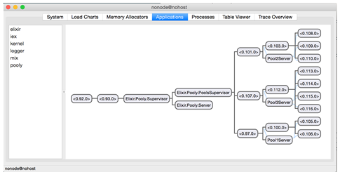{.calibre1}\

Figure 7. 9 The Pooly supervision tree as seen from Observer

Now, starting from the leaves (the lowest/rightmost) of the supervision
tree, try right-clicking the process and killing it. You will again
notice that a new process will take over.

Next, work your way higher. What happens when say,
`Pool3Server`{.codeintext} is killed? You will notice that the
corresponding `WorkerSupervisor`{.codeintext} and the workers underneath
it will all be killed and the re-spawned. It is important to note that
`Pool3Server`{.codeintext} is a brand new process.

Go even higher now. What happens when you kill a
`PoolSupervisor`{.codeintext}? As expected, everything underneath it
gets killed, and another `PoolSupervisor`{.codeintext} is re-spawned and
everything underneath it re-spawns too. Notice what *doesn't* happen.
The rest of the application remains unaffected. Isn't that wonderful?
When crashes happen, as the inevitably will, having a nicely layered
supervision hierarchy allows the error to be handled in a very isolated
way, thereby not affecting the rest of the application.

7.2[          ]{.calibre14} Version 4: Implementing Overflowing and
Queuing

In the final version of Pooly, we are going to extend it a little to
support a variable number of workers by specifying a *maximum overflow*.

We also want to introduce the notion of *queuing* up workers. That is,
when the maximum overflow limit has been reached, Pooly has the ability
to queue up workers for consumers that are willing to *block and wait*
for a next available worker.

7.2.1[       ]{.calibre13} Implementing Maximum Overflow

As usual, in order to specify the maximum overflow, we add a new field
to the pool configuration. In `lib/pooly.ex`{.codeintext}, modify
`pools_config`{.codeintext} in `start/2`{.codeintext} to look like:

Listing 7.13 lib/pooly.ex -- Implementing maximum overflow

`defmodule Pooly do`{.codebcxspfirst} ` `{.codebcxspmiddle}
`  def start(_type, _args) do`{.codebcxspmiddle}
`    pools_config =`{.codebcxspmiddle} `      [`{.codebcxspmiddle}
`        [name: “Pool1”,`{.codebcxspmiddle}
`         mfa: {SampleWorker, :start_link, []},`{.codebcxspmiddle}
`         size: 2,`{.codebcxspmiddle}
`         max_overflow: 3                       #1`{.codebcxspmiddle}
`        ],`{.codebcxspmiddle}
`        [name: “Pool2”,`{.codebcxspmiddle}
`         mfa: {SampleWorker, :start_link, []},`{.codebcxspmiddle}
`         size: 3,`{.codebcxspmiddle}
`         max_overflow: 0                       #1`{.codebcxspmiddle}
`        ],`{.codebcxspmiddle}
`        [name: “Pool3”,`{.codebcxspmiddle}
`         mfa: {SampleWorker, :start_link, []},`{.codebcxspmiddle}
`         size: 4,`{.codebcxspmiddle}
`         max_overflow: 0                       #1`{.codebcxspmiddle}
`        ]`{.codebcxspmiddle} ` `{.codebcxspmiddle}
`      ]`{.codebcxspmiddle} ` `{.codebcxspmiddle}
`    start_pools(pools_config)`{.codebcxspmiddle}
`  end`{.codebcxspmiddle} ` `{.codebcxspmiddle}`end`{.codebcxsplast}

#1 Specifying the maximum overflow in the pools configuration.

Now that we have a new option for the pool configuration, we must now
head over to `lib/pooly/pool_server.ex`{.codeintext} to add support for
`max_overflow`{.codeintext}. This includes:

[·[     ]{.calibre16}]{.calibre12} Adding an entry called
`max_overflow`{.codeintext} in `State`{.codeintext}

[·[     ]{.calibre16}]{.calibre12} Adding an entry called
`overflow`{.codeintext} in `State`{.codeintext} to keep track of the
current overflow count

[·[     ]{.calibre16}]{.calibre12} Adding a function clause in
`init/2`{.codeintext} to handle `max_overflow`{.codeintext}

Here are the additions:

Listing 7.14 lib/pooly/pool_server.ex -- Adding a maximum overflow
option in the pool server

`defmodule Pooly.PoolServer do`{.codebcxspfirst} ` `{.codebcxspmiddle}
`  defmodule State do`{.codebcxspmiddle}
`    defstruct pool_sup: nil, worker_sup: nil, monitors: nil, size: nil, workers: nil, name: nil, mfa: nil, overflow: nil, max_overflow: nil`{.codebcxspmiddle}
`  end`{.codebcxspmiddle} ` `{.codebcxspmiddle}
`  #############`{.codebcxspmiddle} `  # Callbacks #`{.codebcxspmiddle}
`  #############`{.codebcxspmiddle} ` `{.codebcxspmiddle}
`  def init([{:name, name}|rest], state) do`{.codebcxspmiddle}
`    # …`{.codebcxspmiddle} `  end`{.codebcxspmiddle}
` `{.codebcxspmiddle} `  # … more init/1 definitions`{.codebcxspmiddle}
` `{.codebcxspmiddle}
`  def init([{:max_overflow, max_overflow}|rest], state) do`{.codebcxspmiddle}
`    init(rest, %{state | max_overflow: max_overflow})`{.codebcxspmiddle}
`  end`{.codebcxspmiddle} ` `{.codebcxspmiddle}
`  def init([], state) do`{.codebcxspmiddle} `    #…`{.codebcxspmiddle}
`  end`{.codebcxspmiddle} ` `{.codebcxspmiddle}
`  def init([_|rest], state) do`{.codebcxspmiddle}
`    # …`{.codebcxspmiddle} `  end`{.codebcxspmiddle}
` `{.codebcxspmiddle}`end`{.codebcxsplast}

Next, we must consider the case of an actual overflow. An overflow is
said to happen if the total number of busy workers exceeds
`size`{.codeintext} *and* is within the limits of
`max_overflow`{.codeintext}. When can overflows happen? When a worker is
checked *out*. Therefore, the only place to look for is
`handle_call({:checkout, block}, from, state)`{.codeintext}.

Handling this case is quite simple. #1 checks if we are within the
limits of overflowing. If so, a new worker is created and the necessary
bookkeeping information is added into the `monitors`{.codeintext} ETS
table. A reply containing the worker pid is given to the consumer
process along with an increment of the `overflow`{.codeintext} count:

Listing 7.15 lib/pooly/pool_server.ex -- Handling overflows during
checking out in the pool server

`defmodule Pooly.PoolServer do`{.codebcxspfirst} ` `{.codebcxspmiddle}
`  #############`{.codebcxspmiddle} `  # Callbacks #`{.codebcxspmiddle}
`  #############`{.codebcxspmiddle} ` `{.codebcxspmiddle}
`  def handle_call({:checkout, block}, {from_pid, _ref} = from, state) do`{.codebcxspmiddle}
`    %{worker_sup:   worker_sup,`{.codebcxspmiddle}
`      workers:      workers,`{.codebcxspmiddle}
`      monitors:     monitors,`{.codebcxspmiddle}
`      overflow:     overflow,`{.codebcxspmiddle}
`      max_overflow: max_overflow} = state`{.codebcxspmiddle}
` `{.codebcxspmiddle} `    case workers do`{.codebcxspmiddle}
`      [worker|rest] ->`{.codebcxspmiddle}
`        # …`{.codebcxspmiddle}
`        {:reply, worker, %{state | workers: rest}}`{.codebcxspmiddle}
` `{.codebcxspmiddle}
`      [] when max_overflow > 0 and overflow < max_overflow -> #1`{.codebcxspmiddle}
`        {worker, ref} = new_worker(worker_sup, from_pid)`{.codebcxspmiddle}
`        true = :ets.insert(monitors, {worker, ref})`{.codebcxspmiddle}
`        {:reply, worker, %{state | overflow: overflow+1}}`{.codebcxspmiddle}
` `{.codebcxspmiddle} `      [] ->`{.codebcxspmiddle}
`        {:reply, :full, state};`{.codebcxspmiddle}
`    end`{.codebcxspmiddle} `  end`{.codebcxspmiddle}
` `{.codebcxspmiddle}`end`{.codebcxsplast}

7.2.2[       ]{.calibre13} Handling Worker Check-ins

Now that we can handle overflow, how then do we handle worker check-ins?
How then do we handle *check-ins*? Previously in version 2, all we did
was add the worker pid back into the `workers`{.codeintext} field of the
`PoolServer`{.codeintext} state:

`{:no_reply, %{state | workers: [pid|workers]}}`{.codeb}

However, when handling a check-in of an *overflowed* worker, we do not
want to add it back into the `workers`{.codeintext} field. It is
sufficient to just *dismiss* the worker. We will implement a helper
function to handle check-ins:

Listing 7. 16 lib/pooly/pool_server.ex -- Handling worker overflows in
the pool server

`defmodule Pooly.PoolServer do`{.codebcxspfirst} ` `{.codebcxspmiddle}
`  #####################`{.codebcxspmiddle}
`  # Private Functions #`{.codebcxspmiddle}
`  #####################`{.codebcxspmiddle} ` `{.codebcxspmiddle}
`  def handle_checkin(pid, state) do`{.codebcxspmiddle}
`    %{worker_sup:   worker_sup,`{.codebcxspmiddle}
`      workers:      workers,`{.codebcxspmiddle}
`      monitors:     monitors,`{.codebcxspmiddle}
`      overflow:     overflow} = state`{.codebcxspmiddle}
` `{.codebcxspmiddle} `    if overflow > 0 do`{.codebcxspmiddle}
`      :ok = dismiss_worker(worker_sup, pid)`{.codebcxspmiddle}
`      %{state | waiting: empty, overflow: overflow-1}`{.codebcxspmiddle}
`    else`{.codebcxspmiddle}
`      %{state | waiting: empty, workers: [pid|workers], overflow: 0}`{.codebcxspmiddle}
`    end`{.codebcxspmiddle} `  end`{.codebcxspmiddle}
` `{.codebcxspmiddle}
`  defp dismiss_worker(sup, pid) do`{.codebcxspmiddle}
`    true = Process.unlink(pid)`{.codebcxspmiddle}
`    Supervisor.terminate_child(sup, pid)`{.codebcxspmiddle}
`  end`{.codebcxspmiddle} ` `{.codebcxspmiddle}`end`{.codebcxsplast}

What `handle_checkin/2`{.codeintext} does is check that the pool is
indeed overflowed when a worker is being checked back in. If so, it
delegates to `dismiss_worker/2`{.codeintext} to terminate the worker,
and decrement `overflow`{.codeintext}. Otherwise, the worker should be
added back into `workers`{.codeintext} as before.

The function for dismissing workers should not be too hard to
understand. All we need to do is unlink the worker from the pool server,
and tell the worker supervisor to terminate the child. Now, we can
update `handle_cast({:checkin, worker}, state)`{.codeintext}:

Listing 7.17 lib/pooly/pool_server.ex -- Updating the check-in callback
to use handle_checkin/2

`defmodule Pooly.PoolServer do`{.codebcxspfirst} ` `{.codebcxspmiddle}
`  #############`{.codebcxspmiddle} `  # Callbacks #`{.codebcxspmiddle}
`  #############`{.codebcxspmiddle} ` `{.codebcxspmiddle}
`  def handle_cast({:checkin, worker}, %{monitors: monitors} = state) do`{.codebcxspmiddle}
`    case :ets.lookup(monitors, worker) do`{.codebcxspmiddle}
`      [{pid, ref}] ->`{.codebcxspmiddle}
`        # …`{.codebcxspmiddle}
`        new_state = handle_checkin(pid, state) #1`{.codebcxspmiddle}
`        {:no_reply, new_state}`{.codebcxspmiddle} ` `{.codebcxspmiddle}
`      [] ->`{.codebcxspmiddle}
`        {:no_reply, state}`{.codebcxspmiddle}
`    end`{.codebcxspmiddle}
`  end`{.codebcxspmiddle}`end`{.codebcxsplast}

#1 Update this line to use handle_checkin/2

7.2.3[       ]{.calibre13} Handling Worker Exits

What happens when an overflowed worker exits? Let's turn to the callback
function `handle_info({:EXIT, pid, _reason}, state)`{.codeintext}.
Similar to the case when handling worker check-ins, we delegate the task
of handling worker exits to a helper function:

Listing 7.18 lib/pooly/pool_server.ex -- A helper function to compute
the state for worker exits

`defmodule Pooly.PoolServer do`{.codebcxspfirst} ` `{.codebcxspmiddle}
`  #####################`{.codebcxspmiddle}
`  # Private Functions #`{.codebcxspmiddle}
`  #####################`{.codebcxspmiddle} ` `{.codebcxspmiddle}
`  defp handle_worker_exit(pid, state) do`{.codebcxspmiddle}
`    %{worker_sup:   worker_sup,`{.codebcxspmiddle}
`      workers:      workers,`{.codebcxspmiddle}
`      monitors:     monitors,`{.codebcxspmiddle}
`      overflow:     overflow} = state`{.codebcxspmiddle}
` `{.codebcxspmiddle} `    if overflow > 0 do`{.codebcxspmiddle}
`      %{state | overflow: overflow-1}`{.codebcxspmiddle}
`    else`{.codebcxspmiddle}
`      %{state | workers: [new_worker(worker_sup)|workers]}`{.codebcxspmiddle}
`    end`{.codebcxspmiddle}
`  end`{.codebcxspmiddle}`end`{.codebcxsplast}

The logic is the reverse of `handle_checkin/2`{.codeintext}. We check if
the pool is overflowed, and if so, decrement the counter. Since the pool
is overflowed, we do not bother to add the worker back into the pool. On
the other hand, if the pool is not overflowed, then we need to add a
worker back into the worker list.

Listing 7.19 lib/pooly/pool_server.ex -- Updating the handle_info
callback to handle worker exits

`defmodule Pooly.PoolServer do`{.codebcxspfirst} ` `{.codebcxspmiddle}
`  #############`{.codebcxspmiddle} `  # Callbacks #`{.codebcxspmiddle}
`  #############`{.codebcxspmiddle} ` `{.codebcxspmiddle}
`  def handle_info({:EXIT, pid, _reason}, state = %{monitors: monitors, workers: workers, worker_sup: worker_sup}) do`{.codebcxspmiddle}
`    case :ets.lookup(monitors, pid) do`{.codebcxspmiddle}
`      [{pid, ref}] ->`{.codebcxspmiddle}
`        # …`{.codebcxspmiddle}
`        new_state = handle_worker_exit(pid, state) #1`{.codebcxspmiddle}
`        {:no_reply, new_state}`{.codebcxspmiddle} ` `{.codebcxspmiddle}
`      _ ->`{.codebcxspmiddle}
`        {:no_reply, state}`{.codebcxspmiddle}
`    end`{.codebcxspmiddle} `  end`{.codebcxspmiddle}
` `{.codebcxspmiddle}`end`{.codebcxsplast}

#1 Update this line to use handle_worker_exit/2

7.2.4[       ]{.calibre13} Updating Status with Overflow Information

Let's give `Pooly`{.codeintext} the ability to report whether it is
overflowed or not. The pool will have three states:
`:overflow`{.codeintext}, `:full`{.codeintext} and
`:ready`{.codeintext}. Here's the updated implementation of
`handle_call(:status, from, state)`{.codeintext}:

Listing 7.20 lib/pooly/pool_server.ex -- Adding overflow information
into the status

`defmodule Pooly.PoolServer do`{.codebcxspfirst} ` `{.codebcxspmiddle}
`  #############`{.codebcxspmiddle} `  # Callbacks #`{.codebcxspmiddle}
`  #############`{.codebcxspmiddle} ` `{.codebcxspmiddle}
`  def handle_call(:status, _from, %{workers: workers, monitors: monitors} = state) do`{.codebcxspmiddle}
`    {:reply, {state_name(state), length(workers), :ets.info(monitors, :size)}, state}`{.codebcxspmiddle}
`  end`{.codebcxspmiddle} ` `{.codebcxspmiddle}
`  #####################`{.codebcxspmiddle}
`  # Private Functions #`{.codebcxspmiddle}
`  #####################`{.codebcxspmiddle} ` `{.codebcxspmiddle}
`  defp state_name(%State{overflow: overflow, max_overflow: max_overflow, workers: workers}) when overflow < 1 do`{.codebcxspmiddle}
`    case length(workers) == 0 do`{.codebcxspmiddle}
`      true ->`{.codebcxspmiddle}
`        if max_overflow < 1 do`{.codebcxspmiddle}
`          :full`{.codebcxspmiddle} `        else`{.codebcxspmiddle}
`          :overflow`{.codebcxspmiddle} `        end`{.codebcxspmiddle}
`      false ->`{.codebcxspmiddle} `        :ready`{.codebcxspmiddle}
`    end`{.codebcxspmiddle} `  end`{.codebcxspmiddle}
` `{.codebcxspmiddle}
`  defp state_name(%State{overflow: max_overflow, max_overflow: max_overflow}) do`{.codebcxspmiddle}
`    :full`{.codebcxspmiddle} `  end`{.codebcxspmiddle}
` `{.codebcxspmiddle} `  defp state_name(_state) do`{.codebcxspmiddle}
`    :overflow`{.codebcxspmiddle} `  end`{.codebcxspmiddle}
` `{.codebcxspmiddle}`end`{.codebcxsplast}

7.2.5[       ]{.calibre13} Queuing Worker Processes

For the last bit of `Pooly`{.codeintext}, we are going to handle the
case where consumers are willing to wait for a worker to be available.
In other words, the consumer process is willing to block until the
worker pool frees up a worker.

For this to work, we need to queue up worker processes, and match a
newly freed worker process with a waiting consumer process.

A Blocking Consumer

A consumer must tell `Pooly`{.codeintext} if it is willing to block. We
can do this by simply extending the API for `checkout`{.codeintext} in
`lib/pooly.ex`{.codeintext}:

`defmodule Pooly do`{.codebcxspfirst}
`  @timeout 5000`{.codebcxspmiddle} ` `{.codebcxspmiddle}
`  #######`{.codebcxspmiddle} `  # API #`{.codebcxspmiddle}
`  #######`{.codebcxspmiddle} ` `{.codebcxspmiddle}
`  def checkout(pool_name, block \\ true, timeout \\ @timeout) do`{.codebcxspmiddle}
`    Pooly.Server.checkout(pool_name, block, timeout)`{.codebcxspmiddle}
`  end`{.codebcxspmiddle} ` `{.codebcxspmiddle}`end`{.codebcxsplast}

In this new version of `checkout`{.codeintext}, we add two extra
parameters, `block`{.codeintext} and `timeout`{.codeintext}. Head over
now to `lib/pooly/server.ex`{.codeintext}, where we will update the
`checkout`{.codeintext} function accordingly:

`defmodule Pooly.Server do`{.codebcxspfirst} ` `{.codebcxspmiddle}
`  #######`{.codebcxspmiddle} `  # API #`{.codebcxspmiddle}
`  #######`{.codebcxspmiddle} ` `{.codebcxspmiddle}
`  def checkout(pool_name, block, timeout) do`{.codebcxspmiddle}
`    Pooly.PoolServer.checkout(pool_name, block, timeout)`{.codebcxspmiddle}
`  end`{.codebcxspmiddle} ` `{.codebcxspmiddle}`end`{.codebcxsplast}

Now, to the real meat of the implementation,
`lib/pooly/pooly_server.ex`{.codeintext}:

Listing 7.21 lib/pooly/pool_server.ex -- Setting up Pool Server to use
queue for waiting consumers

`defmodule Pooly.PoolServer do`{.codebcxspfirst} ` `{.codebcxspmiddle}
`  defmodule State do`{.codebcxspmiddle}
`    defstruct pool_sup: nil, …, waiting: nil, …, max_overflow: nil #1`{.codebcxspmiddle}
`  end`{.codebcxspmiddle} ` `{.codebcxspmiddle}
`  #############`{.codebcxspmiddle} `  # Callbacks #`{.codebcxspmiddle}
`  ############j`{.codebcxspmiddle} ` `{.codebcxspmiddle}
`  def init([pool_sup, pool_config]) when is_pid(pool_sup) do`{.codebcxspmiddle}
`    Process.flag(:trap_exit, true)`{.codebcxspmiddle}
`    monitors = :ets.new(:monitors, [:private])`{.codebcxspmiddle}
`    waiting  = :queue.new                              #1`{.codebcxspmiddle}
`    state    = %State{pool_sup: pool_sup, monitors: monitors, waiting: waiting, overflow: 0}                                  #1`{.codebcxspmiddle}
` `{.codebcxspmiddle} `    init(pool_config, state)`{.codebcxspmiddle}
`  end`{.codebcxspmiddle} ` `{.codebcxspmiddle}
`  #######`{.codebcxspmiddle} `  # API #`{.codebcxspmiddle}
`  #######`{.codebcxspmiddle} ` `{.codebcxspmiddle}
`  def checkout(pool_name, block, timeout) do`{.codebcxspmiddle}
`    GenServer.call(name(pool_name), {:checkout, block}, timeout) #2`{.codebcxspmiddle}
`  end`{.codebcxspmiddle} ` `{.codebcxspmiddle}`end`{.codebcxsplast}

#1 Update the state to store the queue of waiting consumers

#2 Add block and timeout callback for checkout.

First, update the state with a `waiting`{.codeintext} field. That will
store the *queue* of consumers. While Elixir doesn't come with a queue
data structure, it doesn't need to! Erlang comes with queue
implementation. There's a bigger lesson to this. Whenever you find
something that may be missing in Elixir, instead of reaching for a
third-party
library[[[[\[1\]]{.calibre18}]{.msofootnotereference}]{.msofootnotereference}](#ch07.html#uwSRyDKLGjMmgjcGYhoZfmG){#ch07.html#uTtuo3MaRXcuCm9c6Xiu2jC
.pcalibre1 .pcalibre2}, try finding out if Erlang has the functionality
you need. This highlights the wonderful interoperability between Erlang
and Elixir.

7.2.6[       ]{.calibre13} Slight Detour: Queues in Erlang

The queue implementation that Erlang provides is very interesting. I
will let the examples do the talking. We only look at the basics of
using a queue, namely creating a queue, adding and removing items from a
queue. In a fresh `iex`{.codeintext} session, create a queue:

`iex(1)> q = :queue.new`{.codebcxspfirst} `{[], []}`{.codebcxsplast}

Notice that the return value is a tuple of two elements. Lists, to be
more precise. Why two? To answer that question, add a couple of items
into the queue:

`iex(2)> q = :queue.in(“uno”, q)`{.codebcxspfirst}
`{[“uno”], []}`{.codebcxspmiddle} ` `{.codebcxspmiddle}
`iex(3)> q = :queue.in(“dos”, q)`{.codebcxspmiddle}
`{[“dos”], [“uno”]}`{.codebcxspmiddle} ` `{.codebcxspmiddle}
`iex(4)> q = :queue.in(“tres”, q)`{.codebcxspmiddle}`{[“tres”, “dos”], [“uno”]}`{.codebcxsplast}

The first element (i.e. the head of the queue) is the *second* element
of the tuple, while the remaining of the queue is represented by the
*first* element. Now, try removing an element from the queue:

`iex(5)> :queue.out(q)`{.codebcxspfirst}
`{{:value, “uno”}, {[“tres”], [“dos”]}}`{.codebcxsplast}

This is an interesting looking tuple. Let's break it down a little.

`{{:value, “uno”}, …}`{.codeb}

This tagged tuple (with `:value`{.codeintext}) contains the value of the
first element of the queue. Now for the other part:

`{…, {[“tres”], [“dos”]}}`{.codeb}

This tuple is the new queue, after the first element has been removed.
The representation of the new queue is the same as the one we saw
earlier, with the first element being the second element of the tuple,
while the remaining part of the queue in the first element.

Yes, I know it's slightly confusing, but hang in there. Arranging the
result this way makes sense because remember, data structures are
immutable in Elixir/Erlang land. Also, this is a perfect case for
pattern matching:

`iex(6)> {{:value, head}, q} = :queue.out(q)`{.codebcxspfirst}
`{{:value, “uno”}, {[“tres”], [“dos”]}}`{.codebcxspmiddle}
` `{.codebcxspmiddle}
`iex(7)> {{:value, head}, q} = :queue.out(q)`{.codebcxspmiddle}
`{{:value, “dos”}, {[], [“tres”]}}`{.codebcxspmiddle}
` `{.codebcxspmiddle}
`iex(8)> {{:value, head}, q} = :queue.out(q)`{.codebcxspmiddle}`{{:value, “tres”}, {[], []}}`{.codebcxsplast}

What happens when we try to get something out of an empty queue?

`iex(9)> {{:value, head}, q} = :queue.out(q)`{.codebcxspfirst}
`** (MatchError) no match of right hand side value: {:empty, {[], []}}`{.codebcxsplast}

Whoops! For an empty queue, the return value is a tuple that contains
`:empty`{.codeintext} as the first element. This concludes the brief
detour on using the queue, and all that you need to understand the
examples that follow.

7.2.7[       ]{.calibre13} Back to Queuing Worker Processes

Next, we add `block`{.codeintext} and `timeout`{.codeintext} to the
invocation of the callback function. However, what's that
`make_ref`{.codeintext} doing there in #2? In order to answer that
question, we need to look at the updated implementation of the callback:

Listing 7.22 lib/pooly/pool_server.ex -- Handling waiting consumers

`defmodule Pooly.PoolServer do`{.codebcxspfirst} ` `{.codebcxspmiddle}
`  #############`{.codebcxspmiddle} `  # Callbacks #`{.codebcxspmiddle}
`  #############`{.codebcxspmiddle} ` `{.codebcxspmiddle}
`  def handle_call({:checkout, block}, {from_pid, _ref} = from, state) do`{.codebcxspmiddle}
`    %{worker_sup:   worker_sup,`{.codebcxspmiddle}
`      workers:      workers,`{.codebcxspmiddle}
`      monitors:     monitors,`{.codebcxspmiddle}
`      waiting:      waiting,`{.codebcxspmiddle}
`      overflow:     overflow,`{.codebcxspmiddle}
`      max_overflow: max_overflow} = state # 1`{.codebcxspmiddle}
` `{.codebcxspmiddle} `    case workers do`{.codebcxspmiddle}
`      [worker|rest] ->`{.codebcxspmiddle}
`        # …`{.codebcxspmiddle} ` `{.codebcxspmiddle}
`      [] when max_overflow > 0 and overflow < max_overflow ->`{.codebcxspmiddle}
`        # …`{.codebcxspmiddle} ` `{.codebcxspmiddle}
`      [] when block == true ->                                #2`{.codebcxspmiddle}
`        ref = Process.monitor(from_pid)                     `{.codebcxspmiddle}
`        waiting = :queue.in({from, ref}, waiting)             #2`{.codebcxspmiddle}
`        {:noreply, %{state | waiting: waiting}, :infinity}`{.codebcxspmiddle}
` `{.codebcxspmiddle} `      [] ->`{.codebcxspmiddle}
`        {:reply, :full, state};`{.codebcxspmiddle}
`    end`{.codebcxspmiddle} `  end`{.codebcxspmiddle}
` `{.codebcxspmiddle}`end`{.codebcxsplast}

#1 Update state with waiting

#2 Add waiting consumer into the queue.

There are two things we've added:

[·[     ]{.calibre16}]{.calibre12} `waiting`{.codeintext} to the state

[·[     ]{.calibre16}]{.calibre12} Handling the case when consumer is
willing to block

Let's deal with the case when we are overflowed, and there is a request
for a worker where the consumer is willing to wait. This case is covered
in #3.

Handling a Consumer that is Willing to Block

When a consumer is willing to block, we will first monitor it. That's
because if it crashes for some reason, we must know about it, and remove
it from the queue.

Next, we add to the `waiting`{.codeintext} queue a tuple of the form
`{from, ref}`{.codeintext}. `from`{.codeintext} is the same
`from`{.codeintext} of the callback. Note that `from`{.codeintext} is in
fact a *tuple*, containing a tuple of the consumer pid and a tag, itself
a reference.

Finally, note that the reply is in fact a `:noreply`{.codeintext}, with
`:infinity`{.codeintext} as the timeout. Returning
`:noreply`{.codeintext} means that
`GenServer.reply(from_pid, message)`{.codeintext} must be called from
*somewhere* else. Since we do not know how long we must wait, we pass in
`:infinity`{.codeintext}.

*Where* do we need to call `GenServer.reply/2`{.codeintext}? In other
words, when we need to reply the consumer process? During a check-in of
a worker! Time to update `handle_checkin/2`{.codeintext}. This time, we
will use the `waiting`{.codeintext} queue and pattern matching:

Listing 7.23 lib/pooly/pool_server.ex -- Handling a consumer check in
that is willing to block

`defmodule Pooly.PoolServer do`{.codebcxspfirst} ` `{.codebcxspmiddle}
`  #####################`{.codebcxspmiddle}
`  # Private Functions #`{.codebcxspmiddle}
`  #####################`{.codebcxspmiddle} ` `{.codebcxspmiddle}
`      def handle_checkin(pid, state) do`{.codebcxspmiddle}
`    %{worker_sup:   worker_sup,`{.codebcxspmiddle}
`      workers:      workers,`{.codebcxspmiddle}
`      monitors:     monitors,`{.codebcxspmiddle}
`      waiting:      waiting,`{.codebcxspmiddle}
`      overflow:     overflow} = state`{.codebcxspmiddle}
` `{.codebcxspmiddle}
`    case :queue.out(waiting) do`{.codebcxspmiddle}
`      {{:value, {from, ref}}, left} ->`{.codebcxspmiddle}
`        true = :ets.insert(monitors, {pid, ref})`{.codebcxspmiddle}
`        GenServer.reply(from, pid)                   #1`{.codebcxspmiddle}
`        %{state | waiting: left}`{.codebcxspmiddle}
` `{.codebcxspmiddle}
`      {:empty, empty} when overflow > 0 ->`{.codebcxspmiddle}
`        :ok = dismiss_worker(worker_sup, pid)`{.codebcxspmiddle}
`        %{state | waiting: empty, overflow: overflow-1}`{.codebcxspmiddle}
` `{.codebcxspmiddle} `      {:empty, empty} ->`{.codebcxspmiddle}
`        %{state | waiting: empty, workers: [pid|workers], overflow: 0}`{.codebcxspmiddle}
`    end`{.codebcxspmiddle}
`  end`{.codebcxspmiddle}`end`{.codebcxsplast}

#1 Replying to the consumer process when a worker is available

Depending on the output of the queue, we have three cases that we have
to handle. The first case is when the queue is not empty. This means
that we have at least one consumer process waiting for a worker. We
insert a three-element tuple into the `monitors`{.codeintext} ETS table.
Now, we can finally tell the consumer process that we have an available
worker by doing `GenServer.reply/2`{.codeintext}.

The second case is when there are no consumers currently waiting, and
yet we are in an overflow state. This means that we just have to
decrement the `overflow`{.codeintext} count by 1.

The last case to handle is when there are no consumers currently
waiting, and we are *not* in an overflow state. For this, we can just
add back the worker back into the `workers`{.codeintext} field.

Getting a Worker from Worker Exits

There is another way that a waiting consumer can get a worker, and that
is if some other worker process exits. The modification is simple. Head
to `handle_worker_exit/2`{.codeintext} and modify
`handle_worker_exit/2`{.codeintext}:

Listing 7.24 lib/pooly/pool_server.ex -- Handling worker exits

`defmodule Pooly.PoolServer do`{.codebcxspfirst} ` `{.codebcxspmiddle}
`  #####################`{.codebcxspmiddle}
`  # Private Functions #`{.codebcxspmiddle}
`  #####################`{.codebcxspmiddle} ` `{.codebcxspmiddle}
`  defp handle_worker_exit(pid, state) do`{.codebcxspmiddle}
`    %{worker_sup:   worker_sup,`{.codebcxspmiddle}
`      workers:      workers,`{.codebcxspmiddle}
`      monitors:     monitors,`{.codebcxspmiddle}
`      waiting:      waiting,`{.codebcxspmiddle}
`      overflow:     overflow} = state`{.codebcxspmiddle}
` `{.codebcxspmiddle}
`    case :queue.out(waiting) do`{.codebcxspmiddle}
`      {{:value, {from, ref}}, left} ->`{.codebcxspmiddle}
`        new_worker = new_worker(worker_sup)`{.codebcxspmiddle}
`        true = :ets.insert(monitors, {new_worker, ref})`{.codebcxspmiddle}
`        GenServer.reply(from, new_worker)`{.codebcxspmiddle}
`        %{state | waiting: left}`{.codebcxspmiddle}
` `{.codebcxspmiddle}
`      {:empty, empty} when overflow > 0 ->`{.codebcxspmiddle}
`        %{state | overflow: overflow-1, waiting: empty}`{.codebcxspmiddle}
` `{.codebcxspmiddle} `      {:empty, empty} ->`{.codebcxspmiddle}
`        workers = [new_worker(worker_sup) | workers]`{.codebcxspmiddle}
`        %{state | workers: workers, waiting: empty}`{.codebcxspmiddle}
`    end`{.codebcxspmiddle}
`  end`{.codebcxspmiddle}`end`{.codebcxsplast}

Similar to `handle_checkin/2`{.codeintext}, we use pattern matching from
the result of `:queue.out/1`{.codeintext}. The first case is when we
have a waiting consumer process. Since a worker has crashed or exited,
we simply create a new one, and hand it to the consumer process. The
rest of the cases are pretty self-explanatory.

7.2.8[       ]{.calibre13} Taking it for a spin

Now to see reap the fruits of our labor. Configure the pool like so:

`defmodule Pooly do`{.codebcxspfirst} ` `{.codebcxspmiddle}
`  def start(_type, _args) do`{.codebcxspmiddle}
`    pools_config =`{.codebcxspmiddle} `      [`{.codebcxspmiddle}
`        [name: “Pool1”,`{.codebcxspmiddle}
`         mfa: {SampleWorker, :start_link, []},`{.codebcxspmiddle}
`         size: 2,`{.codebcxspmiddle}
`         max_overflow: 1                      `{.codebcxspmiddle}
`        ],`{.codebcxspmiddle}
`        [name: “Pool2”,`{.codebcxspmiddle}
`         mfa: {SampleWorker, :start_link, []},`{.codebcxspmiddle}
`         size: 3,`{.codebcxspmiddle}
`         max_overflow: 0                      `{.codebcxspmiddle}
`        ],`{.codebcxspmiddle}
`        [name: “Pool3”,`{.codebcxspmiddle}
`         mfa: {SampleWorker, :start_link, []},`{.codebcxspmiddle}
`         size: 4,`{.codebcxspmiddle}
`         max_overflow: 0                      `{.codebcxspmiddle}
`        ]`{.codebcxspmiddle} `      ]`{.codebcxspmiddle}
` `{.codebcxspmiddle} `    start_pools(pools_config)`{.codebcxspmiddle}
`  end`{.codebcxspmiddle}`end`{.codebcxsplast}

Here, only Pool 1 has overflow configured. Open a new `iex`{.codeintext}
session:

`% iex –S mix`{.codebcxspfirst}
`iex(1)> w1 = Pooly.checkout(“Pool1”)`{.codebcxspmiddle}
`#PID<0.97.0>`{.codebcxspmiddle} ` `{.codebcxspmiddle}
`iex(2)> w2 = Pooly.checkout(“Pool1”)`{.codebcxspmiddle}
`#PID<0.96.0>`{.codebcxspmiddle} ` `{.codebcxspmiddle}
`iex(3)> w3 = Pooly.checkout(“Pool1”)`{.codebcxspmiddle}`#PID<0.111.0>`{.codebcxsplast}

With max overflow set to 1, the pool can handle one extra worker. What
happens when you try to check out another worker? The client will be
blocked indefinitely or timeout, depending on how you try to check out
the worker. For example, doing this will block indefinitely:

`iex(4)> Pooly.checkout(“Pool1”, true, :infinity)`{.codeb}

On the other hand, doing this will time out after five seconds:

`iex(4)> Pooly.checkout(“Pool1”, true, 5000)`{.codeb}

If you are following along the example, you will realize that the
session is blocked. Before we continue, open up
`lib/pooly/sample_worker.ex`{.codeintext}. Add the
`work_for/2`{.codeintext} function and its corresponding callback:

Listing 7.25 lib/pooly/sample_worker.ex -- Enable SampleWorker to
simulate processing for a given period of time

`defmodule SampleWorker do`{.codebcxspfirst}
`  use GenServer`{.codebcxspmiddle} ` `{.codebcxspmiddle}
`  # …`{.codebcxspmiddle} ` `{.codebcxspmiddle}
`  def work_for(pid, duration) do`{.codebcxspmiddle}
`    GenServer.cast(pid, {:work_for, duration})`{.codebcxspmiddle}
`  end`{.codebcxspmiddle} ` `{.codebcxspmiddle}
`  def handle_cast({:work_for, duration}, state) do`{.codebcxspmiddle}
`    :timer.sleep(duration)`{.codebcxspmiddle}
`    {:stop, :normal, state}`{.codebcxspmiddle}
`  end`{.codebcxspmiddle} ` `{.codebcxspmiddle}`end`{.codebcxsplast}

This function tells the worker to sleep for some time then exits
normally. This is to simulate a short-lived worker. Restart the session
as per the above steps. In other words, check out three workers:

`iex(1)> w1 = Pooly.checkout(“Pool1”)`{.codebcxspfirst}
`#PID<0.97.0>`{.codebcxspmiddle} ` `{.codebcxspmiddle}
`iex(2)> w2 = Pooly.checkout(“Pool1”)`{.codebcxspmiddle}
`#PID<0.96.0>`{.codebcxspmiddle} ` `{.codebcxspmiddle}
`iex(3)> w3 = Pooly.checkout(“Pool1”)`{.codebcxspmiddle}`#PID<0.111.0>`{.codebcxsplast}

This time, we tell the first worker to work for ten seconds.

`iex(4)> SampleWorker.work_for(w1, 10_000)`{.codebcxspfirst}
`:ok`{.codebcxsplast}

Now try to checkout a worker. Since we have exceeded the maximum
overflow, the pool will cause the client to block.

`iex(5)> Pooly.checkout(“Pool1”, true, :infinity)`{.codeb}

Ten seconds later, the console prints out a pid:

`#PID<0.114.0>`{.codeb}

Success! Even though we were in an overflowed state, once the first
worker has completed it job, another slot became available and was
handled over to the waiting client.

7.3[          ]{.calibre14} Exercises

1.[  ]{.calibre16} *Restart Strategies.* Play around with the different
restart strategies. For example, pick one supervisor and its restart
strategy to something different. Launch `:observer.start`{.codeintext}
and see what happens. Did the supervisor restart the child/children
processes as you expected?

2.[  ]{.calibre16} *Transactions*. There's a limitation with this
implementation. It is assumed that all consumers behave like good
citizens of the pool and check back in the workers when they are done
with it. In general, the pool shouldn't make assumptions like this,
since it is way too easy to cause a starvation of workers. In order to
get around this, Poolboy has *transactions*. Here's the skeleton:

`defmodule Pooly.Server do`{.codebcxspfirst} ` `{.codebcxspmiddle}
`  def transaction(pool_name, fun, timeout) do`{.codebcxspmiddle}
`    worker = <FILL ME IN>`{.codebcxspmiddle}
`    try do`{.codebcxspmiddle} `      <FILL ME IN>`{.codebcxspmiddle}
`    after`{.codebcxspmiddle} `      <FILL ME IN>`{.codebcxspmiddle}
`    end`{.codebcxspmiddle} `  end`{.codebcxspmiddle}
` `{.codebcxspmiddle}`end`{.codebcxsplast}

3.[  ]{.calibre16} Currently, it is possible to check-in the same worker
*multiple* times. Fix this!

7.4[          ]{.calibre14} Summary

Believe it or not, we are done with `Pooly`{.codeintext}! If you have
made it this far, you deserve a nice meal. Not only that, you have
re-implemented 96.777% of Poolboy, but in Elixir. This is probably the
most complicated and largest example in this chapter. But I'm pretty
sure after working through this example you would have gained a deeper
appreciation of not only supervisors, but also how they interact with
other processes and how supervisors can be structured in a layered way
to provide fault tolerance.

If you struggled with Chapter 6 and 7, don't
worry[[[[\[2\]]{.calibre18}]{.msofootnotereference}]{.msofootnotereference}](#ch07.html#uDaQkkzKLpF45pTTXpKN5X8){#ch07.html#uZv3OqK4r8HhoLncUO8eZeD
.pcalibre1 .pcalibre2}, there's nothing wrong with you. I struggled with
grasping this too. There were a lot of moving parts in
`Pooly`{.codeintext}. However if you step back and look at the code
again, it's pretty amazing how everything fits so well together. In this
chapter, we:

[·[     ]{.calibre16}]{.calibre12} Understand how to use the OTP
Supervisor behavior

[·[     ]{.calibre16}]{.calibre12} Build multiple supervision
hierarchies

[·[     ]{.calibre16}]{.calibre12} Dynamically create supervisors and
workers using the OTP Supervisor API

[·[     ]{.calibre16}]{.calibre12} Took a grand tour of building a
non-trivial application using a mixture of Supervisors and GenServers.

In the next chapter, we look at an equally exciting topic, distribution!
:::

::: calibre2
::: {#ch07.html#ftn1 .calibre2}
[[**[[**[\[1\]]{.calibre29}**]{.msofootnotereference}]{.calibre28}**]{.msofootnotereference}](#ch07.html#uTtuo3MaRXcuCm9c6Xiu2jC){#ch07.html#uwSRyDKLGjMmgjcGYhoZfmG
.pcalibre1 .pcalibre2} [Or even worse, building one yourself (unless
it's for educational purposes)!]{.calibre30}
:::

::: {#ch07.html#ftn2 .calibre2}
[[**[[**[\[2\]]{.calibre29}**]{.msofootnotereference}]{.calibre28}**]{.msofootnotereference}](#ch07.html#uZv3OqK4r8HhoLncUO8eZeD){#ch07.html#uDaQkkzKLpF45pTTXpKN5X8
.pcalibre1 .pcalibre2} [If you didn't, I don't want to hear about
it.]{.calibre30}
:::
:::

[]{#ch08.html}

::: wordsection
# []{#ch08.html#chapter-8---distribution .pcalibre1 .pcalibre2 .pcalibre}8[  ]{.calibre11} Distribution and Load Balancing {#ch08.html#heading_id_2 .cochapternumber}

This chapter covers:

[·[     ]{.calibre13}]{.calibre12} The basics of distributed Elixir

[·[     ]{.calibre13}]{.calibre12} Implementing a distributed load
tester

[·[     ]{.calibre13}]{.calibre12} Building a command line application

[·[     ]{.calibre13}]{.calibre12} Tasks, an abstraction for short-lived
computations

[·[     ]{.calibre13}]{.calibre12} Implementing a distributed and
fault-tolerant application

This chapter and the next are going to be the most fun chapters (I say
that for *every* chapter). In this chapter, we will explore the
distribution capabilities of the Erlang VM. We will learn about the
distribution primitives that let us create a cluster of nodes and spawn
processes remotely. The next chapter we will explore failover and
takeover in a distributed system.

In order to demonstrate all these concepts, we will build *two*
applications. The first one is a command line tool to perform load
testing on websites. Yes, this could very well be used for evil
purposes, but I will leave you to your own exploits.

The other is an application that will demonstrate how a cluster handles
failures by having another node automatically stepping up to take the
place of a downed node. To take things further, it will also demonstrate
how a node yields control when a previously downed node of higher
priority rejoins the cluster.

[]{#ch08.html#why-distributed .pcalibre1 .pcalibre2
.pcalibre}8.1[          ]{.calibre14} Why Distributed?

There are at least two good reasons why you would want create a
distributed system. When the application you are building has exceeded
the physical capabilities of a single machine, then you would have a
choice of either upgrading that single machine or adding another
machine. There are limits to how much you can upgrade a single machine.
There are also physical limits to how much a single machine can handle.
Examples include the number of opened file handles and also network
connections. Sometimes a machine has to be brought down of scheduled
maintenance or upgrades. With a distributed system, you can design the
load to be spread across multiple machines. In other words, you are
achieving *load balancing*.

Fault-tolerance is the other reason to consider building a distributed
system. This is when we have one or more nodes are monitoring the node
that is running the application. If that node goes down, the next node
next in line will automatically take over that node. Having a setup like
this means that you eliminate a single point of failure (unless all your
nodes are hosted on a single machine!).

Make no mistake; distributed systems will still be hard given the nature
of the problem. It is still up to you to content with the tradeoffs and
issues that come up with distributed systems such as net splits.
However, what Elixir and the Erlang VM offers are tools that you can
weld to make your like *way* easier to build distributed systems.

[]{#ch08.html#distribution-for-load-balancing .pcalibre1 .pcalibre2
.pcalibre}8.2[          ]{.calibre14} Distribution for Load Balancing

In this section, we will learn how to build a distributed load tester.
The load tester that we are building basically creates a barrage of GET
requests to an endpoint, and measures the response time. Since there is
a limit to the number of open network connections a single physical
machine can make, this is a perfect use case for a distributed system.
In this case, the number of web requests needed is spread evenly across
each node in the cluster.

[]{#ch08.html#an-overview-of-blitzy-the-load-tester .pcalibre1
.pcalibre2}8.2.1[       ]{.calibre13} An Overview of Blitzy, the Load
Tester

Before we begin learning about distribution and implementing Blitzy,
lets briefly see what it can do. Blitzy is a command line program. This
is an example of unleashing Blitzy on an unsuspecting victim:

`   % ./blitzy -n 100 http://www.bieberfever.com`{.codebcxspfirst}
`   [info]  Pummeling http://www.bieberfever.com with 100 requests`{.codebcxsplast}

Here, we are creating 100 workers that will make a HTTP GET request to
`www.bieberfever.com`{.codeintext} and measure the response time and
count the number of successful requests. Behind the scenes, Blitzy
creates a cluster and splits the workers across the nodes in the
cluster. In the above example, 100 workers are split across four nodes.
Therefore, there are 25 workers running on each node:

{.calibre1}\

Figure 8.1 The number of requests is split across the available nodes in
the cluster

Once all the workers from each individual node have completed, the
result will then be sent over the master node.

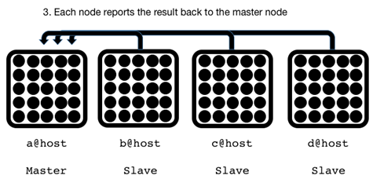{.calibre1}\

Figure 8.2 Once a node has received results from all its workers, the
respective node will report back to the worker

The master node will then aggregate and report the results:

`Total workers    : 1000`{.codebcxspfirst}
`Successful reqs  : 1000`{.codebcxspmiddle}
`Failed res       : 0`{.codebcxspmiddle}
`Average (msecs)  : 3103.478963`{.codebcxspmiddle}
`Longest (msecs)  : 5883.235`{.codebcxspmiddle}`Shortest (msecs) : 25.061`{.codebcxsplast}

When I am planning to write a distributed application, I always begin
with the non-distributed version first, just to keep things slightly
simpler. Once you have gotten the non-distributed bits working, you can
then move on to layering the distribution layer. Jumping straight into
building an application with distribution in mind for a first iteration
usually turns out badly.

That is the approach we will take when developing Blitzy in this
chapter. In fact, we will begin with baby steps:

1.[ ]{.calibre16} Build the non-concurrent version

2.[ ]{.calibre16} Build the concurrent version

3.[ ]{.calibre16} Build the distributed version, that can run on two
virtual machine instances

4.[ ]{.calibre16} Build the distributed version, that can run on two
separate machines connected to a network

[]{#ch08.html#let-the-mayhem-begin .pcalibre1
.pcalibre2}8.2.2[       ]{.calibre13} Let the Mayhem Begin!

Give the project a good name:

`% mix new blitzy`{.codeb}

Let\'s pull in some dependencies that, if we had a crystal ball, we
would know to include in `mix.exs`{.codeintext}:

Listing 8.1 Setting up the dependencies for Blitzy (mix.exs)

`defmodule Blitzy.Mixfile do`{.codebcxspfirst}
`  use Mix.Project`{.codebcxspmiddle} ` `{.codebcxspmiddle}
`  def project do`{.codebcxspmiddle}
`    [app: :blitzy,`{.codebcxspmiddle}
`     version: "0.0.1",`{.codebcxspmiddle}
`     elixir: "~> 1.1-rc1",`{.codebcxspmiddle}
`     deps: deps]`{.codebcxspmiddle} `  end`{.codebcxspmiddle}
` `{.codebcxspmiddle} `  def application do`{.codebcxspmiddle}
`    [mod: {Blitzy, []},`{.codebcxspmiddle}
`     applications: [:logger, :httpoison, :timex]] #3`{.codebcxspmiddle}
`  end`{.codebcxspmiddle} ` `{.codebcxspmiddle}
`  defp deps do`{.codebcxspmiddle} `    [`{.codebcxspmiddle}
`      {:httpoison, "~> 0.9.0"},   #1`{.codebcxspmiddle}
`      {:timex,     "~> 3.0"},      #2`{.codebcxspmiddle}
`      {:tzdata, "~> 0.1.8", override: true}`{.codebcxspmiddle}
`    ]`{.codebcxspmiddle} `  end`{.codebcxspmiddle}`end`{.codebcxsplast}

#1 HTTPoison is a HTTP client

#2 Timex is a date/time library

#3 Add the prerequisite applications

If you are wondering about `tzdata`{.codeintext} and the
`override: true`{.codeintext}: This needs to be there because newer
versions of `tzdata`{.codeintext} do not play nice with escripts.
Escripts will be explained later in the chapter. Finally, do not forget
to add the correct entries in `application/0`{.codeintext}.

::: calibre20
Always read the README!
:::

I wouldn\'t know to include the correct entries in
[`application/0`{.codeintext}]{.calibre21} unless I have read the
installation instructions given in the respective READMEs of the
libraries. Failure to do so will often lead to confusing errors.

::: calibre22
 
:::

[]{#ch08.html#implementing-the-worker-process .pcalibre1
.pcalibre2}8.2.3[       ]{.calibre13} Implementing the Worker Process

We begin with the worker process. The worker fetches the webpage and
computes how long the request took. Create
`lib/blitzy/worker.ex`{.codeintext}.

Listing 8.2 Implementing the worker (lib/blitzy/worker.ex)

`defmodule Blitzy.Worker do`{.codebcxspfirst}
`  use Timex`{.codebcxspmiddle} `  require Logger`{.codebcxspmiddle}
` `{.codebcxspmiddle} `  def start(url) do`{.codebcxspmiddle}
`    {timestamp, response} = Duration.measure(fn -> HTTPoison.get(url) end)`{.codebcxspmiddle}
`    handle_response({Duration.to_milliseconds(timestamp), response})`{.codebcxspmiddle}
`  end`{.codebcxspmiddle} ` `{.codebcxspmiddle}
`  defp handle_response({msecs, {:ok, %HTTPoison.Response{status_code: code}}})`{.codebcxspmiddle}
`  when code >= 200 and code <= 304 do`{.codebcxspmiddle}
`    Logger.info "worker [#{node}-#{inspect self}] completed in #{msecs} msecs"`{.codebcxspmiddle}
`    {:ok, msecs}`{.codebcxspmiddle} `  end`{.codebcxspmiddle}
` `{.codebcxspmiddle}
`  defp handle_response({_msecs, {:error, reason}}) do`{.codebcxspmiddle}
`     Logger.info "worker [#{node}-#{inspect self}] error due to #{inspect reason}"`{.codebcxspmiddle}
`    {:error, reason}`{.codebcxspmiddle} `  end`{.codebcxspmiddle}
` `{.codebcxspmiddle}
`  defp handle_response({_msecs, _}) do`{.codebcxspmiddle}
`     Logger.info "worker [#{node}-#{inspect self}] errored out"`{.codebcxspmiddle}
`    {:error, :unknown}`{.codebcxspmiddle} `  end`{.codebcxspmiddle}
` `{.codebcxspmiddle}`end`{.codebcxsplast}

The start function takes a `url`{.codeintext} and an optional
`func`{.codeintext}. `func`{.codeintext} is a function that will be used
to make the HTTP request. By specifying an optional function this way,
we are free to swap out the implementation with another HTTP client, say
*HTTPotion.*

For example, we could have instead chosen to use HTTPotion\'s
`HTTPotion.get/1`{.codeintext} instead like so:

`Blitzy.Worker.start("http://www.bieberfever.com", &HTTPotion.get/1)`{.codeb}

The HTTP request function is then invoked inside the body of
`Time.measure/1`{.codeintext}. Notice that slightly different syntax:
`func.(url)`{.codeintext} instead of `func(url)`{.codeintext}. The dot
here is important since we need to tell Elixir that `func`{.codeintext}
is pointing to another function and not that function itself.

`Time.measure/1`{.codeintext} is a handy function from
`Timex`{.codeintext} that measures the time taken for a function to
complete. Once that function completes, `Time.measure/1`{.codeintext}
returns a tuple containing the time taken and the return value of that
function. Note that all measurements are in milliseconds.

The tuple returned from `Time.measure/1`{.codeintext} is then passed
along to `handle_response/1`{.codeintext}. Here, we are expecting that
whatever function we pass into `start/2`{.codeintext} gives us a return
result containing a tuple in either of the following formats:

[`·`{.codeintext}[`     `{.codeintext}]{.calibre16}]{.calibre12}
`{:ok, %{status_code: code}`{.codeintext}

[`·`{.codeintext}[`     `{.codeintext}]{.calibre16}]{.calibre12}
`{:error, reason}`{.codeintext}

In addition to getting a successful response, we also check that the
status code falls between a status code of 200 and 304. If we hit into
an error response, we return a tuple tagged with `:error`{.codeintext}
along with the reason for the error. Finally, we handle the last case
where we handle all other cases.

[]{#ch08.html#running-the-worker .pcalibre1
.pcalibre2}8.2.4[       ]{.calibre13} Running the Worker

Let\'s try running the worker:

`iex(1)> Blitzy.Worker.start("http://www.bieberfever.com")`{.codebcxspfirst}
`{:ok, 2458.665}`{.codebcxsplast}

Awesome! Hitting Justin Bieber\'s fan site takes around 2.4 seconds.
Notice that this was the amount of time you had to wait to get the
result back too. How then can we execute say, a *thousand* concurrent
requests? Use `spawn`{.codeintext}/`spawn_link`{.codeintext}!

While that *can* work, we also need a way to aggregate the return
results of the worker to calculate the average time taken for all
successful requests made by the workers, for example. Well, we *could*
pass the caller process into the argument of the
`Blitzy.Worker.start`{.codeintext} function, and send a message to the
caller process once the result is available. In turn, the caller process
must wait for incoming messages of from a thousand workers.

Here\'s a quick sketch of how we might accomplish this. We introduce a
`Blitzy.Caller`{.codeintext} module:

Listing 8.3 A sketch for aggregating result from the worker processes

`defmodule Blitzy.Caller do`{.codebcxspfirst}
`  def start(n_workers, url) do`{.codebcxspmiddle}
`    me = self`{.codebcxspmiddle} ` `{.codebcxspmiddle}
`    1..n_workers`{.codebcxspmiddle}
`    |> Enum.map(fn _ -> spawn(fn -> Blitzy.Worker.start(url, me) end) end)`{.codebcxspmiddle}
`    |> Enum.map(fn _ ->`{.codebcxspmiddle}
`      receive do`{.codebcxspmiddle} `        x -> x`{.codebcxspmiddle}
`      end`{.codebcxspmiddle} `    end)`{.codebcxspmiddle}
`  end`{.codebcxspmiddle}`end`{.codebcxsplast}

The caller module takes in two arguments. The first is the number of
workers to create, followed by the URL to load test against. The above
code might not exactly be too intuitive, so let's go through it bit by
bit.

We first save a reference to the calling process in `me`{.codeintext}.
Why? That\'s because if we use `self`{.codeintext} instead of
`me`{.codeintext} within `spawn`{.codeintext}, then `self`{.codeintext}
would refer to the newly spawned process and *not* the calling process!
To convince yourself:

`iex(1)> self`{.codebcxspfirst} `#PID<0.159.0>`{.codebcxspmiddle}
` `{.codebcxspmiddle}
`iex(2)> spawn(fn -> IO.inspect self end)`{.codebcxspmiddle}`#PID<0.162.0>`{.codebcxsplast}

Next, we spawn `n_workers`{.codeintext} number of workers. The result of

`1..n_workers`{.codebcxspfirst}
`|> Enum.map(fn _ -> spawn(fn -> Blitzy.Worker.start(url, me) end) end)`{.codebcxsplast}

Is a list of worker pids. We expect the pids to be sending the caller
process the results (more on that in the next section), therefore we
wait for an equal number of the messages:

`worker_pids`{.codebcxspfirst} `|> Enum.map(fn _ ->`{.codebcxspmiddle}
`    receive do`{.codebcxspmiddle} `    x -> x`{.codebcxspmiddle}
`    end`{.codebcxspmiddle}`end)`{.codebcxsplast}

We only need to make a slight modification to
`Blitzy.Worker.start/1`{.codeintext}:

Listing 8.4 Modifying the worker process so that it can send its results
to its caller process (lib/worker.ex)

`defmodule Blitzy.Worker do`{.codebcxspfirst} ` `{.codebcxspmiddle}
`  def start(url, caller, func \\ &HTTPoison.get/1) do   #1`{.codebcxspmiddle}
`    {timestamp, response} = Duration.measure(fn -> func.(url) end)`{.codebcxspmiddle}
`    caller`{.codebcxspmiddle} `    |> send({self,`{.codebcxspmiddle}
`             handle_response(`{.codebcxspmiddle}
`             {Duration. to_milliseconds (timestamp), response})}) #2`{.codebcxspmiddle}
`  end`{.codebcxspmiddle} ` `{.codebcxspmiddle}`end`{.codebcxsplast}

#1: Add a caller argument

#2: Whenever the result is computed, send the result to the caller
process

The above modifications allow the `Blitzy.Worker`{.codeintext} process
to send its results to the caller process.

If it sounds messy and starting to make your head hurt a little, then
you are in good company. Although honestly it is not *that* hard,
spawning a bunch of tasks concurrently and waiting for the result from
each of its spawned workers shouldn\'t be that hard, especially since
this is a common use case. Thankfully, this is when *Tasks* come in.

[]{#ch08.html#introducing-tasks .pcalibre1 .pcalibre2
.pcalibre}8.3[          ]{.calibre14} Introducing Tasks

Tasks are an abstraction in Elixir to execute one particular
computation. This computation is usually simple and self-contained, and
requires no communication/coordination with other processes. To
appreciate how Tasks can make the above scenario easier.

We can create an asynchronous task by invoking
`Task.async/1`{.codeintext}:

`iex> task = Task.async(fn -> Blitzy.Worker.start("http://www.bieberfever.com") end)`{.codeb}

What we get back is a `Task`{.codeintext} struct:

`%Task{pid: #PID<0.154.0>, ref: #Reference<0.0.3.67>}`{.codeb}

At this point, the task is asynchronously executing in the background.
In order to get the value out of the task, we need to invoke
`Task.await/1`{.codeintext}:

Listing 8.5 Creating ten tasks, each running a Blitzy worker process

`iex> Task.await(task)`{.codebcxspfirst}
`{:ok, 3362.655}`{.codebcxsplast}

What happens if the task is still computing? The caller process will be
blocked until the task finishes. Let\'s try it out:

`iex> worker_fun = fn -> Blitzy.Worker.start("http://www.bieberfever.com") end`{.codebcxspfirst}
`#Function<20.54118792/0 in :erl_eval.expr/5>`{.codebcxspmiddle}
` `{.codebcxspmiddle}`iex> tasks = 1..10 |> Enum.map(fn _ -> Task.async(worker_fun) end)`{.codebcxsplast}

The return result is a list of ten `Task`{.codeintext} structs

`[%Task{pid: #PID<0.184.0>, ref: #Reference<0.0.3.1071>},`{.codebcxspfirst}
` %Task{pid: #PID<0.185.0>, ref: #Reference<0.0.3.1072>},`{.codebcxspmiddle}
` %Task{pid: #PID<0.186.0>, ref: #Reference<0.0.3.1073>},`{.codebcxspmiddle}
` %Task{pid: #PID<0.187.0>, ref: #Reference<0.0.3.1074>},`{.codebcxspmiddle}
` %Task{pid: #PID<0.188.0>, ref: #Reference<0.0.3.1075>},`{.codebcxspmiddle}
` %Task{pid: #PID<0.189.0>, ref: #Reference<0.0.3.1076>},`{.codebcxspmiddle}
` %Task{pid: #PID<0.190.0>, ref: #Reference<0.0.3.1077>},`{.codebcxspmiddle}
` %Task{pid: #PID<0.191.0>, ref: #Reference<0.0.3.1078>},`{.codebcxspmiddle}
` %Task{pid: #PID<0.192.0>, ref: #Reference<0.0.3.1079>},`{.codebcxspmiddle}` %Task{pid: #PID<0.193.0>, ref: #Reference<0.0.3.1080>}]`{.codebcxsplast}

There are now ten asynchronous workers hitting the site. To grab the
results:

`iex> result = tasks |> Enum.map(&Task.await(&1))`{.codeb}

Depending on your network connection, the shell process might be blocked
for a while before you get something like:

`[ok: 95.023, ok: 159.591, ok: 190.345, ok: 126.191, ok: 125.554, ok: 109.059, ok: 139.883, ok: 125.009, ok: 101.94, ok: 124.955]`{.codeb}

Isn\'t this awesome? Not only can we create asynchronous processes to
create our workers, but we also have an easy way of collecting results
from them.

Hang on to your seats, because this is only going to get better! There
is no need to go through the hassle of having to pass in the caller\'s
pid and having to set up any receive blocks. With Tasks, this is all
handled nicely for you.

In `lib/blitzy.ex`{.codeintext}, create a `run/2`{.codeintext} function
that creates and waits for the worker tasks:

Listing 8.6 A convenience function to run Blitzy workers in Tasks
(lib/blitzy.ex)

`defmodule Blitzy do`{.codebcxspfirst} ` `{.codebcxspmiddle}
`  def run(n_workers, url) when n_workers > 0 do`{.codebcxspmiddle}
`    worker_fun = fn -> Blitzy.Worker.start(url) end`{.codebcxspmiddle}
` `{.codebcxspmiddle} `    1..n_workers`{.codebcxspmiddle}
`      |> Enum.map(fn _ -> Task.async(worker_fun) end)`{.codebcxspmiddle}
`      |> Enum.map(&Task.await(&1))`{.codebcxspmiddle}
`  end`{.codebcxspmiddle} ` `{.codebcxspmiddle}`end`{.codebcxsplast}

You can now simply invoke `Blitzy.run/2`{.codeintext} and get the
results in a list:

`iex> Blitzy.run(10, "http://www.bieberfever.com")`{.codebcxspfirst}
` `{.codebcxspmiddle}
`[ok: 71.408, ok: 69.315, ok: 72.661, ok: 67.062, ok: 74.63, ok: 65.557,`{.codebcxspmiddle}` ok: 201.591, ok: 78.879, ok: 115.75, ok: 66.681]`{.codebcxsplast}

There\'s a tiny issue though. Observe what happens when we bump up the
number of workers to a *thousand*:

`iex> Blitzy.run(1000, "http://www.bieberfever.com")`{.codeb}

This results in:

Listing 8.7 The error message when a Task timeouts

`(exit) exited in: Task.await(%Task{pid: #PID<0.231.0>, ref: #Reference<0.0.3.1201>}, 5000)`{.codebcxspfirst}
`    ** (EXIT) time out`{.codebcxspmiddle}
`    (elixir) lib/task.ex:274: Task.await/2`{.codebcxspmiddle}
`    (elixir) lib/enum.ex:1043: anonymous fn/3 in Enum.map/2`{.codebcxspmiddle}
`    (elixir) lib/enum.ex:1385: Enum."-reduce/3-lists^foldl/2-0-"/3`{.codebcxspmiddle}`    (elixir) lib/enum.ex:1043: Enum.map/2`{.codebcxsplast}

The problem here is that `Task.await/2`{.codeintext} times out after
*five* seconds (the default). We can easily fix this by giving
`:infinity`{.codeintext} to `Task.await/2`{.codeintext} as the timeout
value:

Listing 8.8 Making a Task wait forever (lib/blitzy.ex)

`defmodule Blitzy do`{.codebcxspfirst} ` `{.codebcxspmiddle}
`  def run(n_workers, url) when n_workers > 0 do`{.codebcxspmiddle}
`    worker_fun = fn -> Blitzy.Worker.start(url) end`{.codebcxspmiddle}
` `{.codebcxspmiddle} `    1..n_workers`{.codebcxspmiddle}
`      |> Enum.map(fn _ -> Task.async(worker_fun) end)`{.codebcxspmiddle}
`      |> Enum.map(&Task.await(&1, :infinity))         #1`{.codebcxspmiddle}
`  end`{.codebcxspmiddle} ` `{.codebcxspmiddle}`end`{.codebcxsplast}

#1: Letting Task.await/2 wait forever.

Specifying infinity is not a problem in this case because the HTTP
client will timeout should the server take too long, therefore we gladly
delegate this decision to the HTTP client and not the Task.

Finally, we need to compute the average time taken. In
`lib/blitzy.ex`{.codeintext}, `parse_results/1`{.codeintext} handles
computing some simple statistics and formatting the results into a
human-friendly format:

Listing 8.9  Computing simple statistics from the workers
(lib/blitzy.ex)

`defmodule Blitzy do`{.codebcxspfirst} ` `{.codebcxspmiddle}
`  # ...`{.codebcxspmiddle} ` `{.codebcxspmiddle}
`  defp parse_results(results) do`{.codebcxspmiddle}
`    {successes, _failures} =`{.codebcxspmiddle}
`      Results`{.codebcxspmiddle}
`        |> Enum.partition(fn x -> #1`{.codebcxspmiddle}
`             case x do`{.codebcxspmiddle}
`               {:ok, _} -> true`{.codebcxspmiddle}
`               _        -> false`{.codebcxspmiddle}
`           end`{.codebcxspmiddle} `         end)`{.codebcxspmiddle}
` `{.codebcxspmiddle}
`    total_workers = Enum.count(results)`{.codebcxspmiddle}
`    total_success = Enum.count(successes)`{.codebcxspmiddle}
`    total_failure = total_workers - total_success`{.codebcxspmiddle}
` `{.codebcxspmiddle}
`    data = successes |> Enum.map(fn {:ok, time} -> time end)`{.codebcxspmiddle}
`    average_time  = average(data)`{.codebcxspmiddle}
`    longest_time  = Enum.max(data)`{.codebcxspmiddle}
`    shortest_time = Enum.min(data)`{.codebcxspmiddle}
` `{.codebcxspmiddle} `    IO.puts """`{.codebcxspmiddle}
`    Total workers    : #{total_workers}`{.codebcxspmiddle}
`    Successful reqs  : #{total_success}`{.codebcxspmiddle}
`    Failed res       : #{total_failure}`{.codebcxspmiddle}
`    Average (msecs)  : #{average_time}`{.codebcxspmiddle}
`    Longest (msecs)  : #{longest_time}`{.codebcxspmiddle}
`    Shortest (msecs) : #{shortest_time}`{.codebcxspmiddle}
`    """`{.codebcxspmiddle} `  end`{.codebcxspmiddle}
` `{.codebcxspmiddle} `  defp average(list) do`{.codebcxspmiddle}
`    sum = Enum.sum(list)`{.codebcxspmiddle}
`    if sum > 0 do`{.codebcxspmiddle}
`      sum / Enum.count(list)`{.codebcxspmiddle}
`    else`{.codebcxspmiddle} `      0`{.codebcxspmiddle}
`    end`{.codebcxspmiddle} `  end`{.codebcxspmiddle}
` `{.codebcxspmiddle}`end`{.codebcxsplast}

#1 Enum.partition/2

The most interesting part is the use of `Enum.partition/2`{.codeintext}.
This function takes in a collection and a predicate function, and
results in two collections. The first collection contains all the
elements where the predicate function returned a truthy value when
applied. The second collection contains the rejects. In our case, since
a successful request looks like `{:ok, _}`{.codeintext} and an
unsuccessful request looks like `{:error, _}`{.codeintext}, we can
pattern match on `{:ok, _}`{.codeintext}.

[]{#ch08.html#onward-to-distribution .pcalibre1 .pcalibre2
.pcalibre}8.4[          ]{.calibre14} Onward to Distribution!

We will revisit Blitzy in a little bit. Let\'s learn to build a cluster
in Elixir! One of the killer features of the Erlang virtual machine is
distribution. That is, the ability to have multiple Erlang runtimes
talking to each other. Sure, you can probably do it on other languages
and platforms, but most will leave you losing faith in computers and
humanity in general.

[]{#ch08.html#location-transparency .pcalibre1
.pcalibre2}8.4.1[       ]{.calibre13} Location Transparency

Processes in an Elixir/Erlang cluster are location transparent. This
means that it just as easy to send a message between processes on a
single node as it is on a different node, as long as you know the
process id of the recipient process.

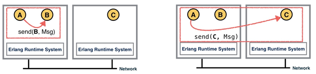{.calibre1}\

Figure 8.3 Location transparency means that is essentially no difference
sending a message to a process on the same node and to a process on a
remote node

This makes it incredibly easy to have processes communicate across
nodes, since there is fundamentally no difference, at least from the
developer\'s point of view.

[]{#ch08.html#an-elixir-node .pcalibre1
.pcalibre2}8.4.2[       ]{.calibre13} An Elixir Node

A node is a system running the Erlang virtual machine with a given name.
A name is represented as an atom such as
`:justin@bieber.com`{.codeintext}, much like an email address. Names
come in two flavors, *short* and *long*. Using short names assume that
all the nodes will be located within the same IP domain. In general,
this is easier to set up and will be what we will be sticking with in
this chapter.

[]{#ch08.html#creating-a-cluster .pcalibre1
.pcalibre2}8.4.3[       ]{.calibre13} Creating a Cluster

The first step in creating a cluster is to start an Erlang system in
distributed mode, and to do that, you must give it a name. In a fresh
terminal, fire up `iex`{.codeintext} but this time, give it a short name
`(--sname NAME`{.codeintext}):

`$ iex --sname barry`{.codebcxspfirst}
`iex(barry@imac)>`{.codebcxsplast}

Notice that your `iex`{.codeintext} prompt now has the short name and
the hostname of the local machine. To get node name of the local
machine, a call to `Kernel.node/0`{.codeintext} will do the trick:

`iex(barry@imac)> node`{.codebcxspfirst} `:barry@imac`{.codebcxsplast}

Alternatively, `Node.self/0`{.codeintext} gives you the same result, but
I prefer `node`{.codeintext} since it\'s much shorter. Now, in two other
separate terminal windows, repeat the process but give each of them
different names:

Start the second node:

`$ iex --sname robin`{.codebcxspfirst}
`iex(robin@imac)>`{.codebcxsplast}

Followed by the third one:

`$ iex --sname maurice`{.codebcxspfirst}
`iex(maurice@imac)>`{.codebcxsplast}

At this point, the nodes are still in isolation -- They do not know of
each other's existence.

::: calibre20
Nodes must have unique names!
:::

If you start a node with a name that has already been registered, the VM
will throw a fit. A corollary to this is that you cannot mix long and
short names.

::: calibre22
 
:::

[]{#ch08.html#connecting-nodes .pcalibre1
.pcalibre2}8.4.4[       ]{.calibre13} Connecting Nodes

Go to the `barry`{.codeintext} node, and connect to `robin`{.codeintext}
using `Node.connect/1`{.codeintext}:

`iex(barry@imac)> Node.connect(:robin@imac)`{.codebcxspfirst}
`true`{.codebcxsplast}

`Node.connect/1`{.codeintext} returns true if the connection is
successful. To list all the nodes `barry`{.codeintext} is connected to,
use `Node.list/0`{.codeintext}:

`iex(barry@imac)> Node.list`{.codebcxspfirst}
`[:robin@imac]`{.codebcxsplast}

Note that `Node.list/1`{.codeintext} doesn\'t list the current node,
only nodes that it is connected to. Now, go to the `robin`{.codeintext}
node, and run `Node.list/0`{.codeintext} again:

`iex(robin@imac)> Node.list`{.codebcxspfirst}
`[:barry@imac]`{.codebcxsplast}

No surprises here. Connecting `barry`{.codeintext} to
`robin`{.codeintext} means that a bi-directional connection is set up.
Now from `robin`{.codeintext}, let\'s connect to `maurice`{.codeintext}:

`iex(robin@imac)> Node.connect(:maurice@imac)`{.codebcxspfirst}
`true`{.codebcxsplast}

Now, let\'s check the nodes that `robin`{.codeintext} is connected to:

`iex(robin@imac)> Node.list`{.codebcxspfirst}
`[:barry@imac, :maurice@imac]`{.codebcxsplast}

Let\'s check back to `barry`{.codeintext}. We didn\'t explicitly run
`Node.connect(:maurice@imac)`{.codeintext} on `barry`{.codeintext}. So
what should we see?

`iex(barry@imac)9> Node.list`{.codebcxspfirst}
`[:robin@imac, :maurice@imac]`{.codebcxsplast}

[]{#ch08.html#node-connections-are-transitive .pcalibre1
.pcalibre2}8.4.5[       ]{.calibre13} Node Connections Are Transitive

Sweet! Node connections are *transitive*. This means that even though we
didn\'t have to connect `barry`{.codeintext} to `maurice`{.codeintext}
explicitly, this was done because `barry`{.codeintext} is connected to
`robin`{.codeintext} and `robin`{.codeintext} is connected to
`maurice`{.codeintext} so therefore `barry`{.codeintext} is connected to
`maurice`{.codeintext}.

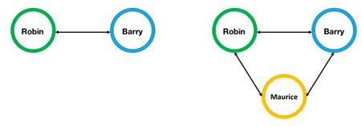{.calibre1}\

Figure 8.4 Connecting a node to another node automatically links the new
node to all the other nodes in the cluster

Disconnecting a node disconnects it from *all* the members of the
cluster. A node might disconnect if `Node.disconnect/1`{.codeintext} is
called or if the node dies due to a network disruption for example.

[]{#ch08.html#remotely-executing-functions .pcalibre1 .pcalibre2
.pcalibre}8.5[          ]{.calibre14} Remotely Executing Functions

So now that we know how to connect nodes to a cluster, lets do something
useful. First, close all previously opened `iex`{.codeintext} sessions
because we are going to create our cluster again from scratch.

Before that though, head to `lib/worker.ex`{.codeintext} and make a one
line addition to the `start/3`{.codeintext} function:

Listing 8.10 Adding a line to print the current node (lib/worker.ex)

`defmodule Blitzy.Worker do`{.codebcxspfirst} ` `{.codebcxspmiddle}
`  def start(url, func \\ &HTTPoison.get/1) do`{.codebcxspmiddle}
`    IO.puts "Running on #node-#{node}"             #1`{.codebcxspmiddle}
`    {timestamp, response} = Duration.measure(fn -> func.(url) end)`{.codebcxspmiddle}
`    handle_response({Duration. Duration.to_milliseconds (timestamp), response})`{.codebcxspmiddle}
`  end`{.codebcxspmiddle}
`  # ... same as before`{.codebcxspmiddle}`end`{.codebcxsplast}

#1 Print current node

This time, go to the directory of `blitzy`{.codeintext}, and in *three*
different terminals. In the first terminal:

`% iex --sname barry -S mix`{.codeb}

And in the second terminal:

`% iex --sname robin -S mix`{.codeb}

Finally, in the third terminal:

`% iex --sname maurice -S mix`{.codeb}

Next, we connect all the nodes together. For example, from the
`maurice`{.codeintext} node:

`iex(maurice@imac)> Node.connect(:barry@imac)`{.codebcxspfirst}
`true`{.codebcxspmiddle} ` `{.codebcxspmiddle}
`iex(maurice@imac)> Node.connect(:robin@imac)`{.codebcxspmiddle}
`true`{.codebcxspmiddle} ` `{.codebcxspmiddle}
`iex(maurice@imac)> Node.list`{.codebcxspmiddle}`[:barry@imac, :robin@imac]`{.codebcxsplast}

Now for the fun bit. We are now going run
`Blitzy.Worker.start`{.codeintext} on all three nodes. Let that sink it
for a moment, because that is *super* awesome. Note that the rest of the
commands will be performed on the `maurice`{.codeintext} node. While you
are free to perform it on any node, some of the output will be
different.

First, we store all the references of every single member of the cluster
(including the current node) into `cluster`{.codeintext}:

`iex(maurice@imac)>  cluster = [node | Node.list]`{.codebcxspfirst}
`[:maurice@imac, :barry@imac, :robin@imac]`{.codebcxsplast}

Then, we can make use of the `:rpc.multicall`{.codeintext} function to
run `Blitzy.Worker.start/1`{.codeintext} on all three nodes:

`iex(maurice@imac)> :rpc.multicall(cluster, Blitzy.Worker, :start, ["http://www.bieberfever.com"])`{.codebcxspfirst}
`"Running on #node-maurice@imac"`{.codebcxspmiddle}
`"Running on #node-robin@imac"`{.codebcxspmiddle}`"Running on #node-barry@imac"`{.codebcxsplast}

The return result looks like:

`{[ok: 2166.561, ok: 3175.567, ok: 2959.726], []}`{.codeb}

In fact, you do not even need to specify the `cluster`{.codeintext}:

`iex(maurice@imac)> :rpc.multicall(Blitzy.Worker, :start, ["http://www.bieberfever.com"])`{.codebcxspfirst}
`"Running on #node-maurice@imac"`{.codebcxspmiddle}
`"Running on #node-barry@imac"`{.codebcxspmiddle}
`"Running on #node-robin@imac"`{.codebcxspmiddle}`{[ok: 1858.212, ok: 737.108, ok: 1038.707], []}`{.codebcxsplast}

Notice that the return value is a tuple of two elements. All successful
calls are captured in the first element, and a list of bad (unreachable)
nodes is given in the second argument.

So now, how do we execute multiple workers in multiple nodes, while
being able to aggregate the results and present them afterwards? We
solved that when we implemented `Blitzy.run/2`{.codeintext} using
`Task.async/1`{.codeintext} and `Task.await/2`{.codeintext}.

`iex(maurice@imac)> :rpc.multicall(Blitzy, :run, [5, "http://www.bieberfever.com"], :infinity)`{.codeb}

The return result is three lists, each with five elements.

`{[[ok: 92.76, ok: 71.179, ok: 138.284, ok: 78.159, ok: 139.742],`{.codebcxspfirst}
`  [ok: 120.909, ok: 75.775, ok: 146.515, ok: 86.986, ok: 129.492],`{.codebcxspmiddle}
`  [ok: 147.873, ok: 171.228, ok: 114.596, ok: 120.745, ok: 130.114]],`{.codebcxspmiddle}` []}`{.codebcxsplast}

There are many interesting functions in the Erlang documentation for the
[RPC module](http://www.erlang.org/doc/man/rpc.html){.pcalibre1
.pcalibre2} such as `:rpc.pmap/3`{.codeintext} and
`parallel_eval/1`{.codeintext}, and I encourage you to experiment with
them later on. For now, we turn our attention back to Blitzy.

[]{#ch08.html#making-blitzy-distributed .pcalibre1 .pcalibre2
.pcalibre}8.6[          ]{.calibre14} Making Blitzy Distributed

[]{#ch08.html#setting-up-the-configuration .pcalibre1 .pcalibre2}We will
create a simple configuration file that the master node will make use of
to connect to the nodes of the cluster. Open
`config/config.exs`{.codeintext} and fill in the following:

Listing 8.11 Configuration file for the entire cluster
(config/config.exs)

`use Mix.Config`{.codebcxspfirst} ` `{.codebcxspmiddle}
`config :blitzy, master_node: :"a@127.0.0.1"`{.codebcxspmiddle}
` `{.codebcxspmiddle}
`config :blitzy, slave_nodes: [:"b@127.0.0.1",`{.codebcxspmiddle}
`                              :"c@127.0.0.1",`{.codebcxspmiddle}`                              :"d@127.0.0.1"]`{.codebcxsplast}

[]{#ch08.html#creating-a-command-line-interface .pcalibre1
.pcalibre2}8.6.1[       ]{.calibre13} Creating a command line interface

Blitzy is a command-line program. Therefore, let\'s build a command line
interface for it. Create a new file called `cli.ex`{.codeintext} and
place it in `lib`{.codeintext}. This is how we would like to invoke
`Blitzy`{.codeintext}:

`./blitzy -n [requests] [url]`{.codeb}

`[requests]`{.codeintext} is an integer which specifies the number of
workers to create and `[url]`{.codeintext} is a string that specifies
the endpoint. Also, a help message should be presented if the user fails
to supply the right format. In Elixir, it is easy to wire this
up.[]{#ch08.html#escript .pcalibre1 .pcalibre2}

First, head over to `mix.exs`{.codeintext} and modify
`project/0`{.codeintext}. Create an entry called `escript`{.codeintext}
fill it like so:

Listing 8.12 Adding escript to the project function to determine the
main entry point of the command line program (mix.exs)

`defmodule Blitzy.Mixfile do`{.codebcxspfirst} ` `{.codebcxspmiddle}
`  def project do`{.codebcxspmiddle}
`    [app: :blitzy,`{.codebcxspmiddle}
`     version: "0.0.1",`{.codebcxspmiddle}
`     elixir: "~> 1.1",`{.codebcxspmiddle}
`     escript: [main_module: Blitzy.CLI], #1`{.codebcxspmiddle}
`     deps: deps]`{.codebcxspmiddle} `  end`{.codebcxspmiddle}
` `{.codebcxspmiddle}`end`{.codebcxsplast}

This points `mix`{.codeintext} to the right module when we call
`mix escript.build`{.codeintext} to generate the `Blitzy`{.codeintext}
command line program. The module pointed to by
`main_module`{.codeintext} is expected to have a `main/1`{.codeintext}
function. Let\'s provide that, and a few other functions:

[]{#ch08.html#parsing-input-arguments-with-optionparse .pcalibre1
.pcalibre2}8.6.2[       ]{.calibre13} Parsing input arguments with
OptionParser

Listing 8.13 Handling input arguments using OptionParser (lib/cli.ex)

`use Mix.Config`{.codebcxspfirst}
`defmodule Blitzy.CLI do`{.codebcxspmiddle}
`  require Logger`{.codebcxspmiddle} ` `{.codebcxspmiddle}
`  def main(args) do`{.codebcxspmiddle} `    args`{.codebcxspmiddle}
`      |> parse_args`{.codebcxspmiddle}
`      |> process_options`{.codebcxspmiddle} `  end`{.codebcxspmiddle}
` `{.codebcxspmiddle} `  defp parse_args(args) do`{.codebcxspmiddle}
`    OptionParser.parse(args, aliases: [n: :requests],`{.codebcxspmiddle}
`                              strict: [requests: :integer])`{.codebcxspmiddle}
`  end`{.codebcxspmiddle} ` `{.codebcxspmiddle}
`  defp process_options(options, nodes) do`{.codebcxspmiddle}
`    case options do`{.codebcxspmiddle}
`      {[requests: n], [url], []} ->`{.codebcxspmiddle}
`        # perform action`{.codebcxspmiddle} ` `{.codebcxspmiddle}
`      _ ->`{.codebcxspmiddle} `        do_help`{.codebcxspmiddle}
` `{.codebcxspmiddle} `    end`{.codebcxspmiddle}
`  end`{.codebcxspmiddle} ` `{.codebcxspmiddle}`end`{.codebcxsplast}

Most command line programs in Elixir will have the same general
structure of taking in the arguments, parsing it, and processing them.
Thanks to the pipeline operator, we can express this as such:

`args`{.codebcxspfirst}
`    |> parse_args`{.codebcxspmiddle}`    |> process_options`{.codebcxsplast}

`args`{.codeintext} is a tokenized list of arguments. For example, given

`% ./blitzy -n 100 http://www.bieberfever.com    `{.codeb}

Then `args`{.codeintext} is:

`["-n", "100", "http://www.bieberfever.com"]`{.codeb}

This list is then passed to `parse_args/1`{.codeintext}, which is a thin
wrapper for `OptionParser.parse/2`{.codeintext}.
`OptionParser.parse/2`{.codeintext} does most of the heavy lifting.

It accepts a list of arguments and returns the parsed values, the
remaining arguments and the invalid options. Let\'s see how to decipher
this:

`OptionParser.parse(args, aliases: [n: :requests],`{.codebcxspfirst}
`                          strict: [requests: :integer])`{.codebcxsplast}

First, we alias `--requests`{.codeintext} to `n`{.codeintext}. This is a
way to specify shorthand for switches. `OptionParser`{.codeintext}
expects that all switches start with `--<switch>`{.codeintext}, and
single character switches `-<switch>`{.codeintext} should be
appropriated aliased. For example, `OptionParser`{.codeintext} treats
this as invalid:

`iex> OptionParser.parse(["-n", "100"])`{.codebcxspfirst}
`{[], [], [{"-n", "100"}]}`{.codebcxsplast}

You can tell it is invalid since it is the third list that is populated.
On the other hand, if you added double dashes to the switch (i.e.: the
longhand version), then `OptionParser`{.codeintext} happily accepts it:

`iex(d@127.0.0.1)12> OptionParser.parse(["--n", "100"])`{.codebcxspfirst}
`{[n: "100"], [], []}`{.codebcxsplast}

We can also assert properties on the types of the value of the switch.
The value of `-n`{.codeintext} must be an integer. Hence, we specify
this in the `strict`{.codeintext} option as in the above listing. Note
once again that we are using the longhand name of the switch.

Once we are done parsing the arguments, we can hand the results over to
`process_options/1`{.codeintext}. In this function, we make use of the
fact that `OptionParser.parse/2`{.codeintext} returns a tuple with three
elements, each of them a list.

Listing 8.14 With pattern matching, we can easily declare the format of
arguments the program expects (lib/cli.ex)

`defp process_options(options) do`{.codebcxspfirst}
`  case options do`{.codebcxspmiddle}
`    {[requests: n], [url], []} -> #1`{.codebcxspmiddle}
`      # To be implemented later.`{.codebcxspmiddle}
`    _ ->`{.codebcxspmiddle} `      do_help`{.codebcxspmiddle}
` `{.codebcxspmiddle} `  end`{.codebcxspmiddle}`end`{.codebcxsplast}

#1 Pattern matching the exact format we expect

We also pattern match the *exact* format the program expects. Examine
the pattern a little closer:

`{[requests: n], [url], []}`{.codeb}

Can you point out a few properties that we are asserting on the
arguments? Here\'s mine:

1.[  ]{.calibre16} `--requests`{.codeintext} or `-n`{.codeintext}
contains a single value that is also an integer.

2.[ ]{.calibre16} There is also a URL.

3.[ ]{.calibre16} There are no invalid arguments. This is specified by
the empty list in the third element.

If for any reason the arguments are invalid, then we want to invoke the
`do_help`{.codeintext} function to present a friendly message:

Listing 8.15 Adding a simple help function when the user gets the
arguments wrong (lib/cli.ex)

`defp do_help do`{.codebcxspfirst} `  IO.puts """`{.codebcxspmiddle}
`  Usage:`{.codebcxspmiddle}
`  blitzy -n [requests] [url]`{.codebcxspmiddle} ` `{.codebcxspmiddle}
`  Options:`{.codebcxspmiddle}
`  -n, [--requests]      # Number of requests`{.codebcxspmiddle}
` `{.codebcxspmiddle} `  Example:`{.codebcxspmiddle}
`  ./blitzy -n 100 http://www.bieberfever.com`{.codebcxspmiddle}
`  """`{.codebcxspmiddle}
`  System.halt(0)`{.codebcxspmiddle}`end`{.codebcxsplast}

For now, nothing happens when the arguments are valid. Let\'s fill in
the missing pieces now.

[]{#ch08.html#connecting-to-the-nodes .pcalibre1
.pcalibre2}8.6.3[       ]{.calibre13} Connecting to the Nodes

We created a configuration in `config/config.exs`{.codeintext}
previously, specifying the master and slave nodes. How do we access the
configuration from our application? Pretty simple:

`iex(1)> Application.get_env(:blitzy, :master_node)`{.codebcxspfirst}
`:"a@127.0.0.1"`{.codebcxspmiddle} ` `{.codebcxspmiddle}
`iex(2)>   Application.get_env(:blitzy, :slave_nodes)`{.codebcxspmiddle}`[:"b@127.0.0.1", :"c@127.0.0.1", :"d@127.0.0.1"]`{.codebcxsplast}

Note that nodes `b`{.codeintext}, `c`{.codeintext}, and `d`{.codeintext}
need to be started in distributed mode with the matching names before
the command `(./blitzy -n 100 http://www.bieberfever.com`{.codeintext})
is executed. We need to modify the `main/1`{.codeintext} function in
`lib/cli.ex`{.codeintext}:

Listing 8.16 Modifying main to read from the configuration file
(lib/cli.ex)

`defmodule Blitzy.CLI do`{.codebcxspfirst} ` `{.codebcxspmiddle}
`  def main(args) do`{.codebcxspmiddle}
`    Application.get_env(:blitzy, :master_node) #1`{.codebcxspmiddle}
`      |> Node.start                            #1`{.codebcxspmiddle}
` `{.codebcxspmiddle}
`    Application.get_env(:blitzy, :slave_nodes) #2`{.codebcxspmiddle}
`      |> Enum.each(&Node.connect(&1))          #2`{.codebcxspmiddle}
` `{.codebcxspmiddle} `    args`{.codebcxspmiddle}
`      |> parse_args`{.codebcxspmiddle}
`      |> process_options([node|Node.list])     #3`{.codebcxspmiddle}
`  end`{.codebcxspmiddle} ` `{.codebcxspmiddle}`end`{.codebcxsplast}

#1 Start the master node in distributed mode

#2 Connect to the slave nodes

We read the configuration from `config/config.exs`{.codeintext}. First,
we start the master node in distributed mode, and assign it the name
`a@127.0.0.1`{.codeintext}. Next, we connect to the slave nodes. Then,
we pass the list of the entire cluster into
`process_options/2`{.codeintext}, which now takes in two arguments
(previously it took only one). Let\'s modify that next:

Listing 8.17 This function now takes in the list of nodes in the
cluster, and hands it to do_requests

`defmodule Blitzy.CLI do`{.codebcxspfirst} `  # ...`{.codebcxspmiddle}
` `{.codebcxspmiddle}
`  defp process_options(options, nodes) do`{.codebcxspmiddle}
`    case options do`{.codebcxspmiddle}
`      {[requests: n], [url], []} ->`{.codebcxspmiddle}
`        do_requests(n, url, nodes) #1`{.codebcxspmiddle}
` `{.codebcxspmiddle} `      _ ->`{.codebcxspmiddle}
`        do_help`{.codebcxspmiddle} ` `{.codebcxspmiddle}
`    end`{.codebcxspmiddle} `  end`{.codebcxspmiddle}
` `{.codebcxspmiddle}`end`{.codebcxsplast}

#1 The list of nodes is passed into do_requests/3

The list of nodes is passed into the `do_requests/3`{.codeintext}
function, which is the main workhorse function:

`defmodule Blitzy.CLI do`{.codebcxspfirst} `  # ...`{.codebcxspmiddle}
` `{.codebcxspmiddle}
`  defp do_requests(n_requests, url, nodes) do`{.codebcxspmiddle}
`    Logger.info "Pummelling #{url} with #{n_requests} requests"`{.codebcxspmiddle}
` `{.codebcxspmiddle}
`    total_nodes  = Enum.count(nodes)             #1`{.codebcxspmiddle}
`    req_per_node = div(n_requests, total_nodes)  #1`{.codebcxspmiddle}
` `{.codebcxspmiddle} `    nodes`{.codebcxspmiddle}
`    |> Enum.flat_map(fn node ->`{.codebcxspmiddle}
`         1..req_per_node |> Enum.map(fn _ ->`{.codebcxspmiddle}
`           Task.Supervisor.async({Blitzy.TasksSupervisor, node}, Blitzy.Worker, :start, [url])`{.codebcxspmiddle}
`         end)`{.codebcxspmiddle} `       end)`{.codebcxspmiddle}
`    |> Enum.map(&Task.await(&1, :infinity))`{.codebcxspmiddle}
`    |> parse_results`{.codebcxspmiddle} `  end`{.codebcxspmiddle}
` `{.codebcxspmiddle}`end`{.codebcxsplast}

#1 Compute the number of workers to spawn per node

The above code is relatively terse, but fear not! We will return to it
shortly. For now, let's take a short detour and look at Task
*supervisors*.

[]{#ch08.html#supervising-tasks-with-tasks.supervisor .pcalibre1
.pcalibre2}8.6.4[       ]{.calibre13} Supervising Tasks with
Tasks.Supervisor

We do not want the crashing of a `Task`{.codeintext} to bring down the
entire application. This is especially so when we are spawning possibly
*thousands* (or even more than that!) `Task`{.codeintext} s. By now, you
should know that the answer is to place the `Task`{.codeintext}s under
supervision.

Happily, Elixir comes equipped with a `Task`{.codeintext}-specific
supervisor aptly called `Task.Supervisor`{.codeintext}. This supervisor
is a `:simple_one_for_one`{.codeintext} supervisor where all the
supervised `Tasks`{.codeintext} are temporary (they are not restarted
when crashed). In order to use the `Task.Supervisor`{.codeintext}, we
need to create `lib/supervisor.ex`{.codeintext}:

{.calibre1}\

Figure 8.5 The supervision tree of Blitzy

Listing 8. 18 Setting up the top-level supervision tree
(lib/supervisor.ex)

`defmodule Blitzy.Supervisor do`{.codebcxspfirst}
`  use Supervisor`{.codebcxspmiddle} ` `{.codebcxspmiddle}
`  def start_link(:ok) do`{.codebcxspmiddle}
`    Supervisor.start_link(__MODULE__, :ok)`{.codebcxspmiddle}
`  end`{.codebcxspmiddle} ` `{.codebcxspmiddle}
`  def init(:ok) do`{.codebcxspmiddle}
`    children = [`{.codebcxspmiddle}
`      supervisor(Task.Supervisor, [[name: Blitzy.TasksSupervisor]])`{.codebcxspmiddle}
`    ]`{.codebcxspmiddle} ` `{.codebcxspmiddle}
`    supervise(children, [strategy: :one_for_one])`{.codebcxspmiddle}
`  end`{.codebcxspmiddle} ` `{.codebcxspmiddle}`end`{.codebcxsplast}

We create a top-level supervisor (`Blitzy.Supervisor`{.codeintext}) that
supervises a `Task.Supervisor`{.codeintext}, that we name
`Blitzy.TasksSupervisor`{.codeintext}. Now, we need to start
`Blitzy.Supervisor`{.codeintext} when the application starts. Here is
`lib/blitzy.ex`{.codeintext}:

`defmodule Blitzy do`{.codebcxspfirst}
`  use Application`{.codebcxspmiddle} ` `{.codebcxspmiddle}
`  def start(_type, _args) do`{.codebcxspmiddle}
`    Blitzy.Supervisor.start_link(:ok)`{.codebcxspmiddle}
`  end`{.codebcxspmiddle}`end`{.codebcxsplast}

The start/2 function just starts the top-level supervisor, which will
then start the rest of the supervision tree.

[]{#ch08.html#using-a-task-supervisor .pcalibre1
.pcalibre2}8.6.5[       ]{.calibre13} Using a Task Supervisor

Let\'s take a closer look at this piece of code, because it illustrates
how we make use of the `Task.Supervisor`{.codeintext} to spread the
workload across all the nodes and how we can use
`Task.await/2`{.codeintext} to retrieve the results:

`nodes`{.codebcxspfirst} `|> Enum.flat_map(fn node ->`{.codebcxspmiddle}
`     1..req_per_node |> Enum.map(fn _ ->`{.codebcxspmiddle}
`       Task.Supervisor.async({Blitzy.TasksSupervisor, node}, Blitzy.Worker, :start, [url])`{.codebcxspmiddle}
`     end)`{.codebcxspmiddle} `   end)`{.codebcxspmiddle}
`|> Enum.map(&Task.await(&1, :infinity))`{.codebcxspmiddle}`|> parse_results`{.codebcxsplast}

This is probably most complicated line:

`Task.Supervisor.async({Blitzy.TasksSupervisor, node}, Blitzy.Worker, :start, [url])`{.codeb}

This is similar to starting a `Task`{.codeintext}:

`Task.async(Blitzy.Worker, :start, ["http://www.bieberfever.com"])`{.codeb}

However, there are a few key differences. Firstly, starting the task
from a `Task.Supervisor`{.codeintext} makes it, well, supervised!
Secondly, take a closer look at the first argument. We are passing in a
tuple containing the module name *and* the node. In order words, we are
remotely telling each node\'s `Blitzy.TasksSupervisor`{.codeintext} to
spawn workers. That is super awesome!
`Task.Supervisor.async/3`{.codeintext} returns the same thing as
`Task.async/3`{.codeintext}, a `Task`{.codeintext} struct:

`%Task{pid: #PID<0.154.0>, ref: #Reference<0.0.3.67>}`{.codeb}

Therefore, we can call `Task.await/2`{.codeintext} to wait for the
results to be returned from each worker. Now that we have gotten the
hard bits out of the way, we can better understand what this code is
trying to do. Given a node, we spawn `req_per_node`{.codeintext} number
of workers:

`1..req_per_node |> Enum.map(fn _ ->`{.codebcxspfirst}
`  Task.Supervisor.async({Blitzy.TasksSupervisor, node}, Blitzy.Worker, :start, [url])`{.codebcxspmiddle}`end)`{.codebcxsplast}

In order to do this on all the nodes, we have to somehow *map* through
all the nodes. We *could* use `Enum.map/2`{.codeintext}:

`nodes`{.codebcxspfirst} `|> Enum.map(fn node ->`{.codebcxspmiddle}
`     1..req_per_node |> Enum.map(fn _ ->`{.codebcxspmiddle}
`       Task.Supervisor.async({Blitzy.TasksSupervisor, node}, Blitzy.Worker, :start, [url])`{.codebcxspmiddle}
`     end)`{.codebcxspmiddle}`   end)`{.codebcxsplast}

However, this result would be a nested list of `Task`{.codeintext}
structs because the result of the inner `Enum.map/2`{.codeintext} is
list of `Task`{.codeintext} structs. Instead, what we want is
`Enum.flat_map/2`{.codeintext}, which looks like this, which takes a
arbitrarily nested list, flattens the list then applies a function to
each of the elements on the flattened list. The following diagram
illustrates:

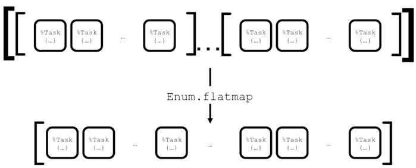{.calibre1}\

Figure 8.7 Here, we are using flatmap to flatten the list of Task
Structs, then mapping each Task Struct to the Blitzy Task Supervisor

Here's the code:

`nodes`{.codebcxspfirst} `|> Enum.flat_map(fn node ->`{.codebcxspmiddle}
`     1..req_per_node |> Enum.map(fn _ ->`{.codebcxspmiddle}
`       Task.Supervisor.async({Blitzy.TasksSupervisor, node}, Blitzy.Worker, :start, [url])`{.codebcxspmiddle}
`     end)`{.codebcxspmiddle}`   end)`{.codebcxsplast}

Since now we have a *flattened* list of `Task.Struct`{.codeintext}s, we
can hand it to `Task.await/2`{.codeintext}:

`nodes`{.codebcxspfirst} `|> Enum.flat_map(fn node ->`{.codebcxspmiddle}
`     # A list of Task structs`{.codebcxspmiddle}
`   end) # A list of Task structs (due to flat map)`{.codebcxspmiddle}
`|> Enum.map(&Task.await(&1, :infinity))`{.codebcxspmiddle}`|> parse_results`{.codebcxsplast}

`Task.await/2`{.codeintext} essentially does the collection of the
results from all the nodes from the master node. Once done, we hand over
the list the `parse_results/1`{.codeintext} as before.

[]{#ch08.html#creating-the-binary-with-mix-escript.bui .pcalibre1
.pcalibre2}8.6.6[       ]{.calibre13} Creating the binary with mix
escript.build

Almost there! The last step is to generate the binary. In the project
directory, run the following `mix`{.codeintext} command:

Listing 8.19 Building the executable

`% mix escript.build`{.codebcxspfirst}
`Compiled lib/supervisor.ex`{.codebcxspmiddle}
`Compiled lib/cli.ex`{.codebcxspmiddle}
`Generated blitzy app`{.codebcxspmiddle}`Generated escript blitzy with MIX_ENV=dev`{.codebcxsplast}

The last line tells you that the `blitzy`{.codeintext} binary has been
created. If you list all the files in your directory, you will find
`blitzy`{.codeintext}:

Listing 8.20 The blitzy binary is generated after running mix
escript.build

`% ls`{.codebcxspfirst}
`README.md      blitzy         deps           lib            mix.lock       test`{.codebcxspmiddle}`_build         config         erl_crash.dump mix.exs        priv`{.codebcxsplast}

[]{#ch08.html#running-blitzy .pcalibre1
.pcalibre2}8.6.7[       ]{.calibre13} Running Blitzy!

Finally! Before we start the binary, we have to start *three* other
nodes. Recall that these are the slave nodes. In three separate
terminals, start the slave nodes:

`% iex --name b@127.0.0.1 -S mix`{.codebcxspfirst} ` `{.codebcxspmiddle}
`% iex --name c@127.0.0.1 -S mix`{.codebcxspmiddle}
` `{.codebcxspmiddle}`% iex --name d@127.0.0.1 -S mix`{.codebcxsplast}

Now, we can run `blitzy`{.codeintext}! In another terminal, run the
`blitzy`{.codeintext} command:

`% ./blitzy -n 10000 http://www.bieberfever.com`{.codeb}

You will see all four terminals populated with messages like:

`10:34:17.702 [info]  worker [b@127.0.0.1-#PID<0.2584.0>] completed in 58585.746 msecs`{.codeb}

Here\'s an example on my machine:

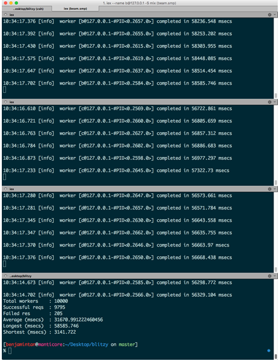{.calibre1}\

Figure 8.7 Running Blitzy on my machine

Finally, when everything is done, the result will be reported on the
terminal you launched the `./blitzy`{.codeintext} command:

`Total workers    : 10000`{.codebcxspfirst}
`Successful reqs  : 9795`{.codebcxspmiddle}
`Failed res       : 205`{.codebcxspmiddle}
`Average (msecs)  : 31670.991222460456`{.codebcxspmiddle}
`Longest (msecs)  : 58585.746`{.codebcxspmiddle}`Shortest (msecs) : 3141.722`{.codebcxsplast}

[]{#ch08.html#distribution-for-fault-tolerance .pcalibre1 .pcalibre2
.pcalibre}[]{#ch08.html#summary .pcalibre1 .pcalibre2
.pcalibre}8.7[          ]{.calibre14} Summary

In this chapter, we managed to get a broad overview of what distributed
Elixir can offer. Here\'s the quick rundown:

[·[     ]{.calibre16}]{.calibre12} The built-in functions that Elixir
and the Erlang VM provide to build distributed systems

[·[     ]{.calibre16}]{.calibre12} Implement a distributed applications
that demonstrates load-balancing

[·[     ]{.calibre16}]{.calibre12} Learn how to use Tasks for
short-lived computation

[·[     ]{.calibre16}]{.calibre12} Implement a command line application

In the next chapter, we continue with our adventures on distribution. We
explore how distribution and fault tolerance go hand-in-hand.
:::

[]{#ch09.html}

::: wordsection
# []{#ch09.html#chapter-8---distribution .pcalibre1 .pcalibre2 .pcalibre}9[  ]{.calibre11} Distribution and Fault Tolerance {#ch09.html#heading_id_2 .cochapternumber}

This chapter covers:

[·[     ]{.calibre13}]{.calibre12} Implementing a distributed and
fault-tolerant application

[·[     ]{.calibre13}]{.calibre12} Cookies and Security

[·[     ]{.calibre13}]{.calibre12} Connecting to nodes in a Local Area
Network (LAN)

In the previous chapter, we looked at the basics of distribution in
Elixir. In particular, we now know how to set up a cluster. We also
looked at *Tasks*, which are an abstraction over GenServers that make it
easy to write short-lived computations.

The next concept that we are going to explore is fault tolerance with
respect to distribution. For this, we will be building an application
that will demonstrate how a cluster handles failures by having another
node automatically stepping up to take the place of a downed node. To
take things further, it will also demonstrate how a node yields control
when a previously downed node of higher priority rejoins the cluster. In
other words, we will build an application that demonstrates the
*failover* and *takeover* capabilities of distributed Elixir.

[]{#ch09.html#distribution-for-fault-tolerance .pcalibre1 .pcalibre2
.pcalibre}9.1[          ]{.calibre14} Distribution for Fault Tolerance

Failover happens when a node running an application goes down, and that
application is being restarted on another node automatically, given some
time-out period. Takeover happens when a node has a higher priority
(defined in a list) than the currently running node, causing the lower
priority node to stop and the application be restarted in the higher
priority node. Failovers and takeovers are very cool (in programming, at
least) when you see them in action.

[]{#ch09.html#an-overview-of-chucky-the-chuck-norris-f .pcalibre1
.pcalibre2}An Overview of Chucky the Chuck Norris Facts Application

The application we are going to build is going to be deliberately
simple, since the main objective is to learn how to wire up your OTP
application to be fault-tolerant using failovers and takeovers. We will
build *Chucky*, a distributed and fault-tolerant Chuck Norris \"facts\"
application. This is an example run of Chucky:

`iex(1)> Chucky.fact`{.codebcxspfirst}
`"Chuck Norris’s keyboard doesn’t have a Ctrl key because nothing controls Chuck Norris."`{.codebcxspmiddle}
` `{.codebcxspmiddle}
`iex(2)> Chucky.fact`{.codebcxspmiddle}`"All arrays Chuck Norris declares are of infinite size, because Chuck Norris knows no bounds."`{.codebcxsplast}

[]{#ch09.html#building-chucky .pcalibre1 .pcalibre2
.pcalibre}9.2[          ]{.calibre14} Building Chucky

Chucky is a simple OTP application. The meat of the application lies in
a GenServer. We will first build that, followed by implementing the
Application behavior. Finally, we will see for ourselves how to hook
everything up to make use of failover and takeover.

[]{#ch09.html#implementing-the-server .pcalibre1
.pcalibre2}9.2.1[       ]{.calibre13} Implementing the Server

You know the drill:

`% mix new chucky`{.codeb}

Next, create `lib/server.ex`{.codeintext}:

Listing 9.1 Implementing the main Chucky server (lib/server.ex)

`defmodule Chucky.Server do`{.codebcxspfirst}
`  use GenServer`{.codebcxspmiddle} ` `{.codebcxspmiddle}
`  #######`{.codebcxspmiddle} `  # API #`{.codebcxspmiddle}
`  #######`{.codebcxspmiddle} ` `{.codebcxspmiddle}
`  def start_link do`{.codebcxspmiddle}
`    GenServer.start_link(__MODULE__, [], [name: {:global, __MODULE__}]) #1`{.codebcxspmiddle}
`  end`{.codebcxspmiddle} ` `{.codebcxspmiddle}
`  def fact do`{.codebcxspmiddle}
`    GenServer.call({:global, __MODULE__}, :fact)                        #2`{.codebcxspmiddle}
`  end`{.codebcxspmiddle} ` `{.codebcxspmiddle}
`  #############`{.codebcxspmiddle} `  # Callbacks #`{.codebcxspmiddle}
`  #############`{.codebcxspmiddle} ` `{.codebcxspmiddle}
`  def init([]) do`{.codebcxspmiddle}
`    :random.seed(:os.timestamp)`{.codebcxspmiddle}
`    facts = "facts.txt"`{.codebcxspmiddle}
`             |> File.read!`{.codebcxspmiddle}
`             |> String.split("\n")`{.codebcxspmiddle}
` `{.codebcxspmiddle} `    {:ok, facts}`{.codebcxspmiddle}
`  end`{.codebcxspmiddle} ` `{.codebcxspmiddle}
`  def handle_call(:fact, _from, facts) do`{.codebcxspmiddle}
`    random_fact = facts`{.codebcxspmiddle}
`                  |> Enum.shuffle`{.codebcxspmiddle}
`                  |> List.first`{.codebcxspmiddle}
` `{.codebcxspmiddle}
`    {:reply, random_fact, facts}`{.codebcxspmiddle}
`  end`{.codebcxspmiddle} ` `{.codebcxspmiddle}`end`{.codebcxsplast}

#1 Globally register the GenServer within the cluster

#2 Calls (and casts) to a globally registered GenServer have an extra
:global

Most of the code here should not be too hard to understand, although the
usage of `:global`{.codeintext} in
`Chucky.Server.start_link/0`{.codeintext} and
`Chucky.Server.fact/1`{.codeintext} is new. In
`Chucky.Server.start_link/0`{.codeintext}, we register the name of the
module using `{:global, __MODULE__}`{.codeintext}. This has the effect
of registering `Chucky.Server`{.codeintext} onto the
`global_name_server`{.codeintext} process. This process is started each
time a node starts. This means that there isn\'t single \"special\" node
that keeps track of the name tables. Instead, each node will have a
replica of the name tables.

Since we have globally registered this module, calls (and casts) also
have to be prefixed with `:global`{.codeintext}. Therefore, instead of
writing

`  def fact do`{.codebcxspfirst}
`    GenServer.call(__MODULE__, :fact)`{.codebcxspmiddle}`  end`{.codebcxsplast}

We do:

 

`  def fact do`{.codebcxspfirst}
`    GenServer.call({:global, __MODULE__}, :fact)`{.codebcxspmiddle}`  end`{.codebcxsplast}

The `init/1`{.codeintext} callback reads a file called
`facts.txt`{.codeintext}, splits it up based on newlines, and
initializes the state of `Chucky.Server`{.codeintext} to be the list of
\"facts\". Store `facts.txt`{.codeintext} in the project root directory.
You can grab a copy of the file from the project\'s GitHub repository.

The `handle_call/3`{.codeintext} callback simply picks a random entry
from its state (the list of \"facts"), and returns it.

[]{#ch09.html#implementing-the-application-behavior .pcalibre1
.pcalibre2}9.2.2[       ]{.calibre13} Implementing the Application
Behavior

Next, we will implement the Application behavior that will serve as the
entry point to the application. In addition, instead of creating an
explicit supervisor, we can create one from within
`Chucky.start/2`{.codeintext}. This is done by importing
`Supervisor.Spec`{.codeintext} that exposes the `worker/2`{.codeintext}
function (which creates the child specification) that we can pass into
the `Supervisor.start_link`{.codeintext} function at the end of
`start/2`{.codeintext}. Create `lib/chucky.ex`{.codeintext}:

Listing 9.2 Implementing the Application behavior (lib/chucky.ex)

`defmodule Chucky do`{.codebcxspfirst}
`  use Application`{.codebcxspmiddle}
`  require Logger`{.codebcxspmiddle} ` `{.codebcxspmiddle}
`  def start(type, _args) do`{.codebcxspmiddle}
`    import Supervisor.Spec`{.codebcxspmiddle}
`    children = [`{.codebcxspmiddle}
`      worker(Chucky.Server, [])`{.codebcxspmiddle}
`    ]`{.codebcxspmiddle} ` `{.codebcxspmiddle}
`    case type do`{.codebcxspmiddle}
`      :normal ->`{.codebcxspmiddle}
`        Logger.info("Application is started on #{node}")`{.codebcxspmiddle}
` `{.codebcxspmiddle} `      {:takeover, old_node} ->`{.codebcxspmiddle}
`        Logger.info("#{node} is taking over #{old_node}")`{.codebcxspmiddle}
` `{.codebcxspmiddle} `      {:failover, old_node} ->`{.codebcxspmiddle}
`        Logger.info("#{old_node} is failing over to #{node}")`{.codebcxspmiddle}
`    end`{.codebcxspmiddle} ` `{.codebcxspmiddle}
`    opts = [strategy: :one_for_one, name: {:global, Chucky.Supervisor}]`{.codebcxspmiddle}
`    Supervisor.start_link(children, opts)`{.codebcxspmiddle}
`  end`{.codebcxspmiddle} ` `{.codebcxspmiddle}
`  def fact do`{.codebcxspmiddle}
`    Chucky.Server.fact`{.codebcxspmiddle} `  end`{.codebcxspmiddle}
` `{.codebcxspmiddle}`end`{.codebcxsplast}

This is a simple supervisor that supervises
`Chucky.Server`{.codeintext}. Just like `Chucky.Server`{.codeintext},
`Chucky.Supervisor`{.codeintext} is also globally registered, and
therefore is registered with `:global`{.codeintext}.

[]{#ch09.html#todo .pcalibre1 .pcalibre2}9.2.3[       ]{.calibre13}
Application type arguments

Notice that we are using the `type`{.codeintext} argument of
`start/2`{.codeintext}, which we usually ignore. For non-distributed
applications, the value of `type`{.codeintext} is usually
`:normal`{.codeintext}. It is when we start playing with takeover and
failover when things start to get a little interesting.

If you look up the Erlang documentation on the data types that
`type`{.codeintext} expects, you will see this:

{.calibre1}\

This are exactly the three cases that we pattern match for in the above
code listing. The pattern match succeeds for the
`{:takeover, node}`{.codeintext} and `{:failover, node}`{.codeintext} if
the application is started in distribution-mode.

Without going into too much detail (that happens in the next section),
when a node gets started because it is taking over another node (because
it has higher priority), then `node`{.codeintext} in
`{:takeover, node}`{.codeintext} is the node being taken over.

In a similar vein, when a node gets started because another node dies,
then `node`{.codeintext} `{:failover, node}`{.codeintext} is the node
that died. Up till now, we haven\'t done any failover or takeover
specific code yet. We tackle that next.

[]{#ch09.html#todo-1 .pcalibre1 .pcalibre2
.pcalibre}[]{#ch09.html#an-overview-of-failover-and-takeover-in-
.pcalibre1 .pcalibre2 .pcalibre}9.3[          ]{.calibre14} An Overview
of Failover and Takeover in Chucky

Before we go into the specifics, let\'s talk about the *behavior* of the
cluster. In this example, we will configure a cluster of three nodes.
For ease of reference, and mostly due to a lack of imagination on the
author\'s part, we will name the nodes `a@<host>`{.codeintext},
`b@<host>`{.codeintext} and `c@< host>`{.codeintext}, where
`<host>`{.codeintext}  is your hostname. I will refer to all the nodes
by `a`{.codeintext}, `b`{.codeintext} and `c`{.codeintext} for the
remaining of this section.

Node `a`{.codeintext} will be the master node, while `b`{.codeintext}
and `c`{.codeintext} will be the slave nodes. In the figures that
follow, the node with a green ring is the master node. The remaining
ones are the slave nodes.

The *order* in which the nodes are started matters. In this case,
`a`{.codeintext} starts first, followed by `b`{.codeintext} and
`c`{.codeintext}. The cluster is fully initialized when all the nodes
have started. In other words, only `a`{.codeintext}, `b`{.codeintext}
and `c`{.codeintext} are initialized, the cluster will then be usable.

All three nodes have Chucky *compiled* (this is an important detail).
However, when the cluster starts, only *one* application is started, and
it is started on the master node (surprise!). This means that while the
requests can be made from any node in the cluster, only the master node
serves back that request:

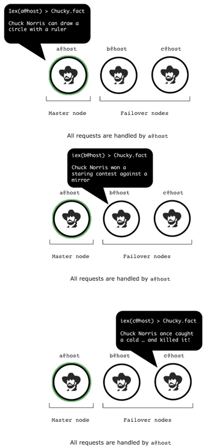{.calibre1}\

Figure 9.1 All requests are handled by a@host, no matter which node
receives the request

Now let\'s make things interesting. When `a`{.codeintext} fails, the
remaining nodes will, after some time detect that `a`{.codeintext} has
failed. It will then spin up the application on one of the slave nodes.
In this case, `b`{.codeintext}:

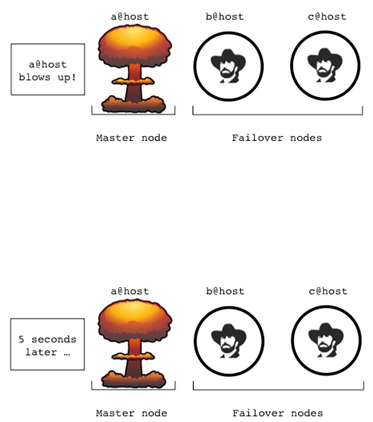{.calibre1}\

Figure 9.2 Assuming a@host fails. Within 5 seconds, a failover node will
take over (See next figure)

{.calibre1}\

Figure 9.3 b@host takes over automatically once it has been detected
that a@host has failed

What if `b`{.codeintext} fails? Then `c`{.codeintext} is next in line to
spin up the application. So far, what we have covered are failover
situations.

Now, consider something more interesting. What happens when
`a`{.codeintext} restarts? Since `a`{.codeintext} is the master node, it
has the *highest priority* amongst the rest of the nodes. Therefore, it
will initiate a *takeover*:

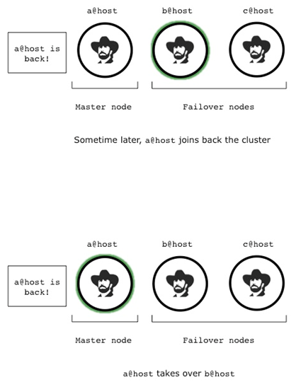{.calibre1}\

Figure 9. 4 Once a@host is back, it will initiate a takeover

Whichever slave node is running the application will exit, and yield
control to the master node. How awesome is that? Now, we can see how we
can implement failover and takeover strategies in Chucky.

[]{#ch09.html#configuring-failover-and-takeover .pcalibre1
.pcalibre2}9.3.1[       ]{.calibre13} Configuring Failover and Takeover

In this section, we will see the steps needed to configure your
distributed application for failover and takeover.

[]{#ch09.html#step-1-determine-the-hostnames-of-the-ma .pcalibre1
.pcalibre2}Step 1: Determine the hostname(s) of the machine(s)

The first step is to find out the hostname of the machine(s) that you
are going to be on. For example, on my Mac OSX:

`% hostname –s`{.codebcxspfirst} `manticore`{.codebcxsplast}

[]{#ch09.html#step-2-create-configuration-files-for-ea .pcalibre1
.pcalibre2}Step 2: Create configuration files for each of the nodes

The second step would be to create configuration files for each of your
nodes. To keep it simple, create these three files in the
`config`{.codeintext} directory:

[`·`{.codeintext}[`     `{.codeintext}]{.calibre16}]{.calibre12}
`a.config`{.codeintext}

[`·`{.codeintext}[`     `{.codeintext}]{.calibre16}]{.calibre12}
`b.config`{.codeintext}

[`·`{.codeintext}[`     `{.codeintext}]{.calibre16}]{.calibre12}
`c.config`{.codeintext}

Notice that they are named `<name-of-node>.config`{.codeintext}. While
you are free to give it any file name you like, I suggest you stick to
this convention since each file will contain node-specific configuration
details.

[]{#ch09.html#step-3-filling-up-the-configuration-file .pcalibre1
.pcalibre2}Step 3: Filling up the configuration files for each of the
nodes

[]{#ch09.html#configuring-the-master-node .pcalibre1 .pcalibre2}The
configuration file for each node looks slightly complicated in
structure, but we will examine it a little more closely in a moment. For
now, enter this in `config/a.config`{.codeintext}:

Listing 9. 3 The configuration for a@host (config/a.config)

`[{kernel,`{.codebcxspfirst}
`  [{distributed, [{chucky, 5000, [a@manticore, {b@manticore, c@manticore}]}]},`{.codebcxspmiddle}
`   {sync_nodes_mandatory, [b@manticore, c@manticore]},`{.codebcxspmiddle}
`   {sync_nodes_timeout, 30000}`{.codebcxspmiddle}`  ]}].`{.codebcxsplast}

This represents the configuration needed to configure failover/takeover
for a single node. Let\'s break it down. We start with the most
complicated part, the `distributed`{.codeintext} configuration
parameter:

`[{distributed, [{chucky, 5000, [a@manticore, {b@manticore, c@manticore}]}]}]`{.codeb}

`chucky`{.codeintext} is of course the application name.
`5000`{.codeintext} represents the timeout in milliseconds before the
node is considered down the application is restarted in the next highest
priority node.

`[a@manticore, {b@manticore, c@manticore}]`{.codeintext} lists the nodes
in priority. In this case, `a`{.codeintext} is first in line, followed
by *either* `b`{.codeintext} or `c`{.codeintext}. Nodes defined in a
tuple do not have a priority amongst themselves. For example, consider
the following entry:

`[a@manticore, {b@manticore, c@manticore}, d@manticore]`{.codeb}

In this case, the highest priority is `a`{.codeintext}, then
`b/c`{.codeintext}, followed by `d`{.codeintext}.

[·[     ]{.calibre16}]{.calibre12} `sync_nodes_mandatory`{.codeintext}:
The list of nodes that *must* be started within the time specified by
`sync_nodes_timeout`{.codeintext}

[·[     ]{.calibre16}]{.calibre12} `sync_nodes_optional`{.codeintext}:
The list of nodes that *can* be started within the time specified by
`sync_nodes_timeout`{.codeintext}. (Note that we are not using this
option for this application)

[·[     ]{.calibre16}]{.calibre12} `sync_nodes_timeout`{.codeintext}:
How long to wait for the other nodes to start (in milliseconds)

What\'s the difference of `sync_nodes_mandatory`{.codeintext} and
`sync_nodes_optional`{.codeintext}? As its name suggests, the node being
started will wait for all the nodes in
`sync_nodes_mandatory`{.codeintext} to start up, within the timeout
limit set by `sync_nodes_timeout`{.codeintext}. If even one fails to
start, the node terminates itself. The case is not so strict for
`sync_nodes_optional`{.codeintext}. The node will just wait till the
timeout elapses, and will *not* terminate itself if any node is not up.

[]{#ch09.html#configuring-the-slave-nodes .pcalibre1
.pcalibre2}Configuring the Slave Nodes

For the remaining nodes, the configuration is *almost* the same, except
for the `sync_nodes_mandatory`{.codeintext} entry. In fact, it is *very*
important that the rest of the configuration is unchanged. For example,
having an inconsistent `sync_nodes_timeout`{.codeintext} value would
lead to undetermined behavior of the cluster.

Here\'s the configuration for `b`{.codeintext}:

Listing 9.4 The configuration for b@host (config/b.config)

`[{kernel,`{.codebcxspfirst} `  [{distributed,`{.codebcxspmiddle}
`    [{chucky,`{.codebcxspmiddle} `      5000,`{.codebcxspmiddle}
`      [a@manticore, {b@manticore, c@manticore}]}]},`{.codebcxspmiddle}
`   {sync_nodes_mandatory, [a@manticore, c@manticore]},`{.codebcxspmiddle}
`   {sync_nodes_timeout, 30000}`{.codebcxspmiddle}`  ]}].`{.codebcxsplast}

And here\'s the configuration for `c`{.codeintext}:

Listing 9.5 The configuration for c@host (config/c.config)

[`[{`{.codebcxspfirst}]{.calibre64}[`kernel`{.codebcxspfirst}]{.calibre65}[`,`{.codebcxspfirst}]{.calibre64}
`  `{.codebcxspmiddle}[`[{`{.codebcxspmiddle}]{.calibre64}[`distributed`{.codebcxspmiddle}]{.calibre65}[`,`{.codebcxspmiddle}]{.calibre64}
`    `{.codebcxspmiddle}[`[{`{.codebcxspmiddle}]{.calibre64}[`chucky`{.codebcxspmiddle}]{.calibre65}[`,`{.codebcxspmiddle}]{.calibre64}
`      `{.codebcxspmiddle}[`5000`{.codebcxspmiddle}]{.calibre66}[`,`{.codebcxspmiddle}]{.calibre64}
`      `{.codebcxspmiddle}[`[`{.codebcxspmiddle}]{.calibre64}[`a@manticore`{.codebcxspmiddle}]{.calibre65}[`,`{.codebcxspmiddle}]{.calibre64}` `{.codebcxspmiddle}[`{`{.codebcxspmiddle}]{.calibre64}[`b@manticore`{.codebcxspmiddle}]{.calibre65}[`,`{.codebcxspmiddle}]{.calibre64}` `{.codebcxspmiddle}[`c@manticore`{.codebcxspmiddle}]{.calibre65}[`}]}]},`{.codebcxspmiddle}]{.calibre64}
`   `{.codebcxspmiddle}[`{`{.codebcxspmiddle}]{.calibre64}[`sync_nodes_mandatory`{.codebcxspmiddle}]{.calibre65}[`,`{.codebcxspmiddle}]{.calibre64}` `{.codebcxspmiddle}[`[`{.codebcxspmiddle}]{.calibre64}[`a@manticore`{.codebcxspmiddle}]{.calibre65}[`,`{.codebcxspmiddle}]{.calibre64}` `{.codebcxspmiddle}[`b@manticore`{.codebcxspmiddle}]{.calibre65}[`]},`{.codebcxspmiddle}]{.calibre64}
`   `{.codebcxspmiddle}[`{`{.codebcxspmiddle}]{.calibre64}[`sync_nodes_timeout`{.codebcxspmiddle}]{.calibre65}[`,`{.codebcxspmiddle}]{.calibre64}` `{.codebcxspmiddle}[`30000`{.codebcxspmiddle}]{.calibre66}[`}`{.codebcxspmiddle}]{.calibre64}[` `{.codebcxsplast}]{.calibre64}` `{.codebcxsplast}[`]}].`{.codebcxsplast}]{.calibre64}

[]{#ch09.html#step-4-compile-chucky-on-all-the-nodes .pcalibre1
.pcalibre2}Step 4: Compile Chucky on all the Nodes

The application should be compiled on machine it is on. Compiling
`Chucky`{.codeintext} is easy enough:

`% mix compile`{.codeb}

Once again, remember to do this on *every machine* of the cluster.

[]{#ch09.html#step-5-start-the-distributed-application .pcalibre1
.pcalibre2}Step 5: Start the Distributed Application

Open three different terminals. On each of them, run these commands:

For `a`{.codeintext}:

`% iex --sname a -pa _build/dev/lib/chucky/ebin --app chucky --erl "-config config/a.config"`{.codeb}

Next, for `b`{.codeintext}:

`% iex --sname b -pa _build/dev/lib/chucky/ebin --app chucky --erl "-config config/b.config"`{.codeb}

Finally, for `c`{.codeintext}:

`% iex --sname c -pa _build/dev/lib/chucky/ebin --app chucky --erl "-config config/c.config"`{.codeb}

The above incantation is slightly cryptic, but still decipherable:

[·[     ]{.calibre16}]{.calibre12} `--sname <name>`{.codeintext}: Starts
a distributed node, and assigns a *short name* to it.

[·[     ]{.calibre16}]{.calibre12} `-pa <path>`{.codeintext}: *Prepends*
the given path to the Erlang code path. This path points to the BEAM
files generated from Chucky after running `mix compile`{.codeintext}.
(The *appends* version is `-pz`{.codeintext}.)

[·[     ]{.calibre16}]{.calibre12} `--app <application>`{.codeintext}:
Starts the application along with its dependencies.

[·[     ]{.calibre16}]{.calibre12} `--erl <switches>`{.codeintext}:
Switches passed down to Erlang. In our example,
`-config config/c.config`{.codeintext} is used to configure OTP
applications.

[]{#ch09.html#failover-and-takeover-in-action .pcalibre1 .pcalibre2
.pcalibre}9.4[          ]{.calibre14} Failover and Takeover in Action

After all that hard work, let\'s see some action! You will notice that
when you started `a`{.codeintext} (and even `b`{.codeintext}), nothing
happens until `c`{.codeintext} is started. In each terminal, run
`Chucky.fact`{.codeintext}:

Listing 9.6 Chucky can be accessed from any node in the cluster

`23:10:54.465 [info]  Application is started on a@manticore`{.codebcxspfirst}
`iex(a@manticore)1> Chucky.fact`{.codebcxspmiddle}
`"Chuck Norris doesn't read, he just stares the book down untill it tells him what he wants."`{.codebcxspmiddle}
` `{.codebcxspmiddle} `iex(b@manticore)1> Chucky.fact`{.codebcxspmiddle}
`"Chuck Norris can use his fist as his SSH key. His foot is his GPG key."`{.codebcxspmiddle}
` `{.codebcxspmiddle}
`iex(c@manticore)1> Chucky.fact`{.codebcxspmiddle}`"Chuck Norris never wet his bed as a child. The bed wet itself out of fear."`{.codebcxsplast}

While it *seems* that the application is running on each individual
node, we can easily convince ourselves that this is not the case. Notice
that in the first terminal, the message
`Application is started on a@manticore`{.codeintext} is printed out on
`a`{.codeintext}, but not the others.

There is another way to tell what applications are running on the
current node. With `Application.started_applications/1`{.codeintext}, we
can clearly see that `Chucky`{.codeintext} is running on
`a`{.codeintext}:

Listing 9.7 Application.started_applications/0 shows Chucky on a@host

`iex(a@manticore)1> Application.started_applications`{.codebcxspfirst}
`[{:chucky, 'chucky', '0.0.1'}, {:logger, 'logger', '1.1.1'},`{.codebcxspmiddle}
` {:iex, 'iex', '1.1.1'}, {:elixir, 'elixir', '1.1.1'},`{.codebcxspmiddle}
` {:compiler, 'ERTS  CXC 138 10', '6.0.1'}, {:stdlib, 'ERTS  CXC 138 10', '2.6'},`{.codebcxspmiddle}` {:kernel, 'ERTS  CXC 138 10', '4.1'}]`{.codebcxsplast}

However, it `Chucky`{.codeintext} is *not* running on `b`{.codeintext}
and `c`{.codeintext}. Only the output of `b`{.codeintext} is shown here,
since the output on both nodes is identical:

Listing 9.8 Chucky is not running on b@host and c@host (not shown)

`iex(b@manticore)1> Application.started_applications`{.codebcxspfirst}
`[{:logger, 'logger', '1.1.1'}, {:iex, 'iex', '1.1.1'},`{.codebcxspmiddle}
` {:elixir, 'elixir', '1.1.1'}, {:compiler, 'ERTS  CXC 138 10', '6.0.1'},`{.codebcxspmiddle}` {:stdlib, 'ERTS  CXC 138 10', '2.6'}, {:kernel, 'ERTS  CXC 138 10', '4.1'}]`{.codebcxsplast}

Now, let\'s terminate `a`{.codeintext} by exiting `iex`{.codeintext}
(entering Ctrl + C twice). In about 5 seconds, you will notice that
`Chucky`{.codeintext} has now automatically started in `b`{.codeintext}:

Listing 9.9 When a@host goes down, b@host takes over

`iex(b@manticore)1>`{.codebcxspfirst}
`23:16:42.161 [info]  Application is started on b@manticore`{.codebcxsplast}

How awesome is that? The remaining nodes in the cluster determined that
`a`{.codeintext} was unreachable and presumed dead. Therefore,
`b`{.codeintext} assumed the responsibility of running
`Chucky`{.codeintext}. If you now run
`Application.started_applications/1`{.codeintext} on `b`{.codeintext},
you would see something like:

Listing 9.10 Re-running Application.started_applications/0 now shows
Chucky on b@host

`iex(b@manticore)2> Application.started_applications`{.codebcxspfirst}
`[{:chucky, 'chucky', '0.0.1'}, {:logger, 'logger', '1.1.1'},`{.codebcxspmiddle}
` {:iex, 'iex', '1.1.1'}, {:elixir, 'elixir', '1.1.1'},`{.codebcxspmiddle}
` {:compiler, 'ERTS  CXC 138 10', '6.0.1'}, {:stdlib, 'ERTS  CXC 138 10', '2.6'},`{.codebcxspmiddle}` {:kernel, 'ERTS  CXC 138 10', '4.1'}]`{.codebcxsplast}

On `c`{.codeintext}, you can convince yourself that
`Chucky`{.codeintext} is still running:

Listing 9.11 As usual, Chucky can still be accessed from c@host

`iex(c@manticore)1> Chucky.fact`{.codebcxspfirst}
`"The Bermuda Triangle used to be the Bermuda Square, until Chuck Norris Roundhouse kicked one of the corners off."`{.codebcxsplast}

Now, let\'s see some takeover in action. What happens when
`a`{.codeintext} rejoins the cluster? Since `a`{.codeintext} is the
highest priority node in the cluster, `b`{.codeintext} will yield
control to `a`{.codeintext}. In other words, `a`{.codeintext} will
takeover `b`{.codeintext}. Start `a`{.codeintext} again:

`% iex --sname a -pa _build/dev/lib/chucky/ebin --app chucky --erl "-config config/a.config"`{.codeb}

In `a`{.codeintext}, you will see something like:

`23:23:36.695 [info]  a@manticore is taking over b@manticore`{.codebcxspfirst}
`iex(a@manticore)1>`{.codebcxsplast}

In `b`{.codeintext}, you will notice that the application has stopped:

Listing 9.12 When a@host restarts and rejoins the cluster, b@host yields
control

`iex(b@manticore)3>`{.codebcxspfirst}
`23:23:36.707 [info]  Application chucky exited: :stopped`{.codebcxsplast}

Of course, `b`{.codeintext} can still dish out some Chuck Norris facts:

`iex(b@manticore)4> Chucky.fact`{.codebcxspfirst}
`"It takes Chuck Norris 20 minutes to watch 60 Minutes."`{.codebcxsplast}

There you have it! We have seen one complete cycle of failover and
takeover. In the next section, we will look at connecting nodes that are
in the same local area network.

[]{#ch09.html#todo-cookies-and-security .pcalibre1 .pcalibre2
.pcalibre}9.5[          ]{.calibre14} Connecting Nodes in a LAN, Cookies
and Security

Security wasn't a huge thing on the minds of Erlang designers when they
were thinking about distribution. The reason for that was that the nodes
were going to be used in their own internal/trusted networks. As such,
things were kept pretty simple.

In order for two nodes to communicate, all they need to do is share a
*cookie*. This cookie is a plain text file stored usually in your home
directory:

`% cat ~/.erlang.cookie`{.codebcxspfirst}
`XLVCOLWHHRIXHRRJXVCN`{.codebcxsplast}

When you start nodes on the same machine, you didn't have to worry about
cookies because all the nodes shared the same cookie in your home
directory. However, once you start connecting to other machines, you
will have to ensure that these cookies are all the same. There is an
alternative though. You can also explicitly call
`Node.set_cookie/2`{.codeintext}. In this section, we will see how we
can connect to nodes that are not on the same machine, but on the same
local network.

9.5.1[       ]{.calibre13} Find out the IP Addresses of both machines

First, we need to find out the IP addresses of both machines. On
Linux/Unix systems, that\'s usually `ifconfig`{.codeintext}. Also, do
make sure that they both are connected to the same LAN. This could mean
either plugging the machines into the same router/switch or having the
machines connected to the same wireless endpoint. Here is a sample
output on one of my machines:

Listing 9.13 The output of ifconfig on my machine

`% ifconfig`{.codebcxspfirst}
`lo0: flags=8049<UP,LOOPBACK,RUNNING,MULTICAST> mtu 16384`{.codebcxspmiddle}
`  options=3<RXCSUM,TXCSUM>`{.codebcxspmiddle}
`  inet6 ::1 prefixlen 128`{.codebcxspmiddle}
`  inet 127.0.0.1 netmask 0xff000000`{.codebcxspmiddle}
`  inet6 fe80::1%lo0 prefixlen 64 scopeid 0x1`{.codebcxspmiddle}
`  nd6 options=1<PERFORMNUD>`{.codebcxspmiddle}
`gif0: flags=8010<POINTOPOINT,MULTICAST> mtu 1280`{.codebcxspmiddle}
`stf0: flags=0<> mtu 1280`{.codebcxspmiddle}
`en0: flags=8863<UP,BROADCAST,SMART,RUNNING,SIMPLEX,MULTICAST> mtu 1500`{.codebcxspmiddle}
`  ether 10:93:e9:05:19:da`{.codebcxspmiddle}
`  inet6 fe80::1293:e9ff:fe05:19da%en0 prefixlen 64 scopeid 0x4`{.codebcxspmiddle}
`  inet 192.168.0.100 netmask 0xffffff00 broadcast 192.168.0.255`{.codebcxspmiddle}
`  nd6 options=1<PERFORMNUD>`{.codebcxspmiddle}
`  media: autoselect`{.codebcxspmiddle}`  status: active`{.codebcxsplast}

The numbers you should be looking out for is
`192.168.0.100`{.codeintext}. When I performed the same steps on the
other machine, the IP address is `192.168.0.103`{.codeintext}. Do note
that we are using IPv4 addresses here. If you were using IPv6 addresses
you would have to use the IPv6 addresses for the following examples.

9.5.2[       ]{.calibre13} Connecting both Nodes together

Let\'s give this a go. On the first machine, start `iex`{.codeintext}
but this time with the long name (`--name`{.codeintext}) flag. Also,
append `@<ip-address>`{.codeintext} after the name.

`% iex --name one@192.168.0.100`{.codebcxspfirst}
`Erlang/OTP 18 [erts-7.1] [source] [64-bit] [smp:4:4] [async-threads:10] [hipe] [kernel-poll:false] [dtrace]`{.codebcxspmiddle}
` `{.codebcxspmiddle}
`Interactive Elixir (0.13.1-dev) - press Ctrl+C to exit (type h() ENTER for help)`{.codebcxspmiddle}`iex(one@192.168.0.100)1>`{.codebcxsplast}

Perform the same steps on the second node:

`% iex --name two@192.168.0.103`{.codebcxspfirst}
`Erlang/OTP 18 [erts-7.1] [source] [64-bit] [smp:4:4] [async-threads:10] [hipe] [kernel-poll:false] [dtrace]`{.codebcxspmiddle}
` `{.codebcxspmiddle}
`Interactive Elixir (1.1.1) - press Ctrl+C to exit (type h() ENTER for help)`{.codebcxspmiddle}`iex(two@192.168.0.103)1>`{.codebcxsplast}

Now, let\'s try to connect `one@192.168.0.100`{.codeintext} and
[`two@192.168.0.103`{.codeintext}](mailto:two@192.168.0.103){.pcalibre1
.pcalibre2} together:

`iex(one@192.168.0.100)1> Node.connect :'two@192.168.0.103'`{.codebcxspfirst}
`false`{.codebcxsplast}

Wait what? On `two@192.168.0.103`{.codeintext}, you would be able to see
a similar error report:

`=ERROR REPORT==== 25-May-2014::22:32:25 ===`{.codebcxspfirst}
`** Connection attempt from disallowed node 'one@192.168.0.100' **`{.codebcxsplast}

What happened? Turns out, we are missing a key ingredient -- The
*cookie*.

9.5.3[       ]{.calibre13} Remember the Cookie!

When you connect nodes on the same machine *and* you do not set any
cookie with the `--cookie`{.codeintext} flag, the Erlang VM simply uses
the generated one that sits in your home directory:

`% cat ~/.erlang.cookie`{.codebcxspfirst}
`XBYWEVWSNBAROAXWPTZX%`{.codebcxsplast}

This means that if you connect nodes *without* the cookie flag on the
*same* local machine, you usually will not hit into any problems.

On different machines however, this *is* a problem. That\'s because the
cookies are most likely different across the various machines. With this
in mind, let\'s restart the entire process. This time however, we supply
the same cookie value for every node. Alternatively, you can either copy
the same `.~/.erlang-cookie`{.codeintext} across all the nodes. In this
section, we use the former technique. On the first machine:

`% iex --name one@192.168.0.100 --cookie monster`{.codebcxspfirst}
`Erlang/OTP 18 [erts-7.1] [source] [64-bit] [smp:4:4] [async-threads:10] [hipe] [kernel-poll:false] [dtrace]`{.codebcxspmiddle}
` `{.codebcxspmiddle}
`Interactive Elixir (1.1.1) - press Ctrl+C to exit (type h() ENTER for help)`{.codebcxspmiddle}`iex(one@192.168.0.100)1>`{.codebcxsplast}

On the second machine, we make sure we use the *same* cookie value:

`% iex --name two@192.168.0.103 --cookie monster`{.codebcxspfirst}
`Erlang/OTP 18 [erts-7.1] [source] [64-bit] [smp:4:4] [async-threads:10] [hipe] [kernel-poll:false] [dtrace]`{.codebcxspmiddle}
` `{.codebcxspmiddle}
`Interactive Elixir (1.1.1) - press Ctrl+C to exit (type h() ENTER for help)`{.codebcxspmiddle}`iex(two@192.168.0.103)1>`{.codebcxsplast}

Let\'s connect `one@192.168.0.100`{.codeintext} to
`two@192.168.0.103`{.codeintext} again:

`iex(one@192.168.0.100)1> Node.connect :'two@192.168.0.103'`{.codebcxspfirst}
`true`{.codebcxsplast}

Great success! We have successfully set up an Elixir cluster over a LAN.
As a sanity check, we can also do a `Node.list/0.`{.codeintext} Recall
that this function only lists its neighbors and therefore doesn't
include the current node:

`iex(one@192.168.0.100)2> Node.list`{.codebcxspfirst}
`[:"two@192.168.0.103"]`{.codebcxsplast}

[]{#ch09.html#summary .pcalibre1 .pcalibre2
.pcalibre}9.6[          ]{.calibre14} Summary

Having proper failover and takeover implemented in an application that
is expected to survive crashes is absolutely essential. Unlike a lot of
languages and platforms, failover and takeover are baked into OTP. In
this chapter, we continued our explorations in distribution. In
particular, we covered:

[·[     ]{.calibre16}]{.calibre12} Implement a distributed application
that demonstrates failover and takeover

[·[     ]{.calibre16}]{.calibre12} Configure for failover and takeover

[·[     ]{.calibre16}]{.calibre12} Connect nodes to a local area network
(LAN)

[·[     ]{.calibre16}]{.calibre12} Make use of cookies

[·[     ]{.calibre16}]{.calibre12} A few Chuck Norris jokes

In the next chapter and the chapter after that, we look at testing in
Elixir. Instead of covering unit testing, we explore property-based
testing and also learn how to test concurrent programs.
:::

[]{#Part_3.html}

::: wordsection
# Part 3 Type Specifications and Testing {#Part_3.html#heading_id_2 .cochapternumber}

Having \"Let it crash\" as a mantra doesn\'t give you the license to
write untested code. In the final part of this book, we\'ll examine the
techniques and tools that make our Elixir code more reliable.

We\'ll look at Dialyzer and learn how to lace our code with type
specifications to catch bugs in our code. We then go into property-based
testing, where we learn how assert properties of our functions and learn
to write code that generates tests for us.

While writing concurrent code in Elixir is definitely easier, errors
will definitely crop up. In the final chapter, we\'ll look at
Concuerror, a tool to hunt down concurrency bugs.
:::

[]{#ch10.html}

::: wordsection
# [10[          ]{.calibre11}]{.calibre67} Dialyzer and Type Specifications {#ch10.html#heading_id_2 .cochapternumber}

This chapter covers:

[·[     ]{.calibre13}]{.calibre12} What is Dialyzer and how it works

[·[     ]{.calibre13}]{.calibre12} Finding discrepancies in your code
with Dialyzer

[·[     ]{.calibre13}]{.calibre12} Writing type specifications and
defining your own types

Depending on your inclination, the mere mention of types could either
send you shrieking with joy or recoiling in terror. Being a dynamically
typed language, Elixir spares you from having to pepper your code base
with types à la Haskell. Some might argue that this leads to a quicker
development cycle. However, the Elixir programmer shouldn't get too
smug. Statically typed languages can catch a whole class of errors at
*compile* time that a dynamic language can only catch at *runtime*.

Fortunately for us, the fault-tolerance features baked into the language
try to save us from ourselves. Languages without these features (Ruby,
I'm looking at you) will just crash. However, it is our responsibility
to make our software as reliable as possible. In this chapter, we will
learn how to exploit types to do that.

We will learn about Dialyzer, a tool that comes bundled with the Erlang
distribution. This power tool is used to weed out certain classes of
software bugs. The best part? You don't have to do anything special to
your code.

You will learn some of the interesting theory behind how Dialyzer works.
That will help you decipher its (sometimes cryptic) error messages. You
will also understand why Dialyzer is not a silver bullet to solve all
the your typing woes.

In last part of this chapter, we will learn how we can make Dialyzer to
a better job at hunting for bugs by sprinkling our code with types. By
the end of this chapter, you will learn how to integrate Dialyzer as
part of your development workflow.

Whoever came up with the name Dialyzer deserves a raise for the awesome
telecom-related acronym. Dialyzer stands for DIscrepancy Analyze for
ERlang. Dialyzer is a tool that helps you find discrepancies in your
code. Exactly what kind? Here's a list:

[·[     ]{.calibre16}]{.calibre12} Type Errors

[·[     ]{.calibre16}]{.calibre12} Exception-raising code

[·[     ]{.calibre16}]{.calibre12} Unsatisfiable conditions

[·[     ]{.calibre16}]{.calibre12} Redundant code

[·[     ]{.calibre16}]{.calibre12} Race conditions

We will see for ourselves how Dialyzer can pick up some these
discrepancies soon. Before that, it is helpful to understand how
Dialyzer works under the hood.

10.1[      ]{.calibre14} How does Dialyzer Work

Static languages can catch potential errors at compile time. Dynamic
language, by their very nature, can only detect these errors at runtime.
Dialyzer attempts to bring some of the benefits of static type-checkers
to a dynamic language like Elixir/Erlang.

One of the main objectives of Dialyzer is not to get in the way of
existing programs. This means that no Erlang (and Elixir) programmer
should be expected to rewrite code just to accommodate Dialyzer.

This leads to a very nice outcome: You do not need to provide Dialyzer
any additional information for it to do its work. That is not to say
that you *can't*. In fact, as you will see later on, you can provide
additional type information that can let Dialyzer do a better job at
hunting down discrepancies.

10.2[      ]{.calibre14} Success Typings

Dialyzer uses the notion of *success typings* to gather and infer type
information. It is worth getting an idea of how Dialyzer works. To
understand what success typings are, we need to understand a little bit
about the Elixir type system.

A dynamic language such as Elixir requires a type system that is more
relaxed than a static type system, since functions can potentially take
in multiple types of arguments.

Let's look at the Boolean "and" function for example. In a static
language such as Haskell, the `and`{.codeintext} function could be
implemented like so:

`and :: Bool -> Bool -> Bool`{.codebcxspfirst}
`and x y | x == True && y == True = True`{.codebcxspmiddle}`        | otherwise = False`{.codebcxsplast}

The first line `and :: Bool -> Bool -> Bool`{.codeintext} is the type
signature of the function. It says that `and`{.codeintext} is a function
that accepts two Booleans as an argument and returns a Boolean. If the
type checker sees anything else other than Booleans as inputs to
`and`{.codeintext}, your program will not make it pass compilation. How
would an Elixir version look like?

Listing 10.1 Boolean and implemented in Elixir

`defmodule MyBoolean do`{.codebcxspfirst} `   `{.codebcxspmiddle}
`  def and(true, true) do`{.codebcxspmiddle}
`    true`{.codebcxspmiddle} `  end`{.codebcxspmiddle}
` `{.codebcxspmiddle} `  def and(false, _) do`{.codebcxspmiddle}
`    false`{.codebcxspmiddle} `  end`{.codebcxspmiddle}
` `{.codebcxspmiddle} `  def and(_, false) do`{.codebcxspmiddle}
`    false`{.codebcxspmiddle} `  end`{.codebcxspmiddle}
` `{.codebcxspmiddle}`end`{.codebcxsplast}

Thanks to pattern matching, we can express `and/2`{.codeintext} as three
function clauses. What are valid arguments to `and/2`{.codeintext}? Both
the first and second argument accepts `true`{.codeintext},
`false`{.codeintext}, and `_`{.codeintext} while the return values are
all Booleans.

The "\_" as you already know means "anything under the sun". Therefore,
these are perfectly ok invocations of `and/2`{.codeintext}:

`MyBoolean.and(false, "great success!")`{.codebcxspfirst}
`MyBoolean.and([1, 2, 3], false)`{.codebcxsplast}

A Haskell type checker will not allow a program like the Elixir one
presented earlier, because it doesn't allow "anything under the sun" as
a type. It cannot handle such an uncertainty.

Dialyzer on the other hand, employs a different typing inference
algorithm called success typings. Success typings are very optimistic.
It always assumes that all your functions are used correctly. Therefore
your code is innocent until proven guilty.

Success typings start with *over-approximating* the valid inputs and
outputs to your functions. So it starts with assuming that your function
can take it anything and it returns anything. However, as it understands
your code better, it generates *constraints*. These constraints will in
turn restrict the value inputs and as a consequence, the output.

For example, if it sees `x + y`{.codeintext}, then `x`{.codeintext} and
`y`{.codeintext} must definitely be numbers. Guards such as
`is_atom(z)`{.codeintext} also provide additional constraints. Once the
constraints are generated, it is time to *solve* them, just like a
puzzle. The solution to the puzzle is the success typing of the
function. Conversely, if no solution is found, the constraints are
*unsatisfiable* and you have a type violation on your hands.

However, it is important to realize that because Dialyzer starts with
always assuming your code is right, it *doesn't* guarantee that your
code is type-safe. Now, before you get up and leave the room, there is a
very nice property that arises from this. If Dialyzer finds something
wrong, it is *guaranteed* to be right. So the first lesson of Dialyzer
is this:

::: calibre20
Dialyzer is never wrong!
:::

` `{.sidebaracode}[`Dialyzer is _always_ right if it says your code is wrong.`{.sidebaracode}]{lang="BS-LATN-BA"}

::: calibre22
 
:::

This is why when Dialyzer says that your code is messed up, it is 100%
correct. Stricter type-checkers begin with assuming that your code is
wrong, and that your code must type-check successfully before it is
allowed to compile. This also means that your code is guaranteed (more
or less) to be type-safe.

So to reiterate: Dialyzer will *not* (or ever) discover all
type-violations. However, if it finds a problem, then your code is
*guaranteed* to be problematic. Now that we have some background on how
success typings work, let's turn our attention to finding out about
types in Elixir.

10.3[      ]{.calibre14} Revealing Types in Elixir, Part I

We've been using Elixir without much emphasis on the exact types. In
this section and the next, we will pay slightly more attention.

From Elixir 1.2 onwards, there is a very handy helper in
`iex`{.codeintext} that prints information about the given data type
called `i/1`{.codeintext}. For example, what is the difference between
`"ohai"`{.codeintext} and `'ohai'`{.codeintext} (note the use of double
and single quotes respectively)? Let's find out:

Listing 10.2 Using i/1 to reveal the type of an Elixir string

`iex> i("ohai")`{.codebcxspfirst} `Term`{.codebcxspmiddle}
`  "ohai"`{.codebcxspmiddle} `Data type`{.codebcxspmiddle}
`  BitString`{.codebcxspmiddle} `Byte size`{.codebcxspmiddle}
`  4`{.codebcxspmiddle} `Description`{.codebcxspmiddle}
`  This is a string: a UTF-8 encoded binary. It's printed surrounded by`{.codebcxspmiddle}
`  "double quotes" because all UTF-8 codepoints in it are printable.`{.codebcxspmiddle}
`Raw representation`{.codebcxspmiddle}
`  <<111, 104, 97, 105>>`{.codebcxspmiddle}
`Reference modules`{.codebcxspmiddle}`String, :binary`{.codebcxsplast}

And let's now contrast it with `'ohai'`{.codeintext}:

Listing 10.3 Using i/1 to reveal the type of a character list

`iex> i('ohai')`{.codebcxspfirst} `Term`{.codebcxspmiddle}
`  'ohai'`{.codebcxspmiddle} `Data type`{.codebcxspmiddle}
`  List`{.codebcxspmiddle} `Description`{.codebcxspmiddle}
`  This is a list of integers that is printed as a sequence of codepoints`{.codebcxspmiddle}
`  delimited by single quotes because all the integers in it represent valid`{.codebcxspmiddle}
`  ascii characters. Conventionally, such lists of integers are referred to as`{.codebcxspmiddle}
`  "char lists".`{.codebcxspmiddle}
`Raw representation`{.codebcxspmiddle}
`  [111, 104, 97, 105]`{.codebcxspmiddle}
`Reference modules`{.codebcxspmiddle}`  List`{.codebcxsplast}

Next time if you are getting type errors and are confused, reach
immediately for the `i/1`{.codeintext} helper.

10.4[      ]{.calibre14} Getting Started with Dialyzer

Dialyzer can either use Erlang source code or debug-compiled BEAM
byte-code. Obviously, this leaves us with the latter option. This means
that before we run Dialyzer we must remember to do a
`mix compile`{.codeintext}.

::: calibre20
Remember to compile first!
:::

Since starting to use Dialyzer I have lost count about the number of
times I have forgotten this step. Fortunately, once I have discovered
Dialyxir (you will see this later on), I no longer have to manually
compile my code.

::: calibre22
 
:::

Dialyzer comes installed with the Erlang distribution and exists as a
command-line program:

`% dialyzer`{.codebcxspfirst}
`  Checking whether the PLT /Users/benjamintan/.dialyzer_plt is up-to-date...`{.codebcxspmiddle}
`dialyzer: Could not find the PLT: /Users/benjamintan/.dialyzer_plt`{.codebcxspmiddle}
`Use the options:`{.codebcxspmiddle}
`   --build_plt   to build a new PLT; or`{.codebcxspmiddle}
`   --add_to_plt  to add to an existing PLT`{.codebcxspmiddle}
` `{.codebcxspmiddle}
`For example, use a command like the following:`{.codebcxspmiddle}
`   dialyzer --build_plt --apps erts kernel stdlib mnesia`{.codebcxspmiddle}
`Note that building a PLT such as the above may take 20 mins or so`{.codebcxspmiddle}
` `{.codebcxspmiddle}
`If you later need information about other applications, say crypto,`{.codebcxspmiddle}
`you can extend the PLT by the command:`{.codebcxspmiddle}
`  dialyzer --add_to_plt --apps crypto`{.codebcxspmiddle}`For applications that are not in Erlang/OTP use an absolute file name.`{.codebcxsplast}

Awesome, we have convinced ourselves that Dialyzer is indeed installed.
But what is this *PLT* that Dialyzer is trying to search for?

10.4.1[    ]{.calibre13} The PLT: The Persistent Lookup Table

The PLT stands for Persistent Lookup Table. Dialyzer uses the PLT to
store the result of its analysis. You can also use a previously
constructed PLT that serves as a starting point for Dialyzer. This
becomes important because any non-trivial Elixir application would
probably involve OTP. If we run Dialyzer on such an application, the
analysis will undoubtedly take a long time.

Since the OTP libraries will not change, we can always build a "base
PLT" and only run Dialyzer on our application, which by comparison will
take a much shorter time. The flip side of this is that once you upgrade
Erlang and/or Elixir, you must be remember to rebuild the PLT.

10.4.2[    ]{.calibre13} Dialyxir

Traditionally, running Dialyzer involves quite a bit of typing.
Thankfully, thanks to the laziness of programmers there are libraries
that contain `mix`{.codeintext} tasks that make our lives easier. The
one that we are going to use is *Dialyxir*. Dialyxir contains
`mix`{.codeintext} tasks that make Dialyzer a joy to use in Elixir
projects.

Dialyxir can either be installed as a dependency (as we will see later)
or it can be installed globally. We will install Dialyxir globally
first, so that we can build the PLT table. This is not strictly
necessary, but is useful when you don't want to install Dialyxir as a
project dependency:

`git clone https://github.com/jeremyjh/dialyxir`{.codebcxspfirst}
`cd dialyxir`{.codebcxspmiddle}
`mix archive.build`{.codebcxspmiddle}`mix archive.install`{.codebcxsplast}

Let's start using Dialyxir!

10.4.3[    ]{.calibre13} Building a PLT Table

As previously mentioned, we need to build a PLT first. Happily, Dialyxir
has a mix task to build a PLT:

` % mix dialyzer.plt `{.codeb}

Grab a coffee because this will take a while:

`Starting PLT Core Build ... this will take awhile`{.codebcxspfirst}
`dialyzer --output_plt /Users/benjamintan/.dialyxir_core_18_1.2.0-rc.1.plt --build_plt --apps erts kernel stdlib crypto public_key -r /usr/local/Cellar/elixir/HEAD/bin/../lib/elixir/../eex/ebin /usr/local/Cellar/elixir/HEAD/bin/../lib/elixir/../elixir/ebin /usr/local/Cellar/elixir/HEAD/bin/../lib/elixir/../ex_unit/ebin /usr/local/Cellar/elixir/HEAD/bin/../lib/elixir/../iex/ebin /usr/local/Cellar/elixir/HEAD/bin/../lib/elixir/../mix/ebin`{.codebcxspmiddle}
`...`{.codebcxspmiddle}
`  cover:compile_beam_directory/1`{.codebcxspmiddle}
`  cover:modules/0`{.codebcxspmiddle}
`  cover:start/0`{.codebcxspmiddle}
`  fprof:analyse/1`{.codebcxspmiddle}
`  fprof:apply/3`{.codebcxspmiddle}
`  fprof:profile/1`{.codebcxspmiddle}
`  httpc:request/5`{.codebcxspmiddle}
`  httpc:set_options/2`{.codebcxspmiddle}
`  inets:start/2`{.codebcxspmiddle} `  inets:stop/2`{.codebcxspmiddle}
`  leex:file/2`{.codebcxspmiddle} `  yecc:file/2`{.codebcxspmiddle}
`Unknown types:`{.codebcxspmiddle}
`  compile:option/0`{.codebcxspmiddle}
` done in 2m33.16s`{.codebcxspmiddle}`done (passed successfully)`{.codebcxsplast}

You don't have to worry about "Unknown types" and other warnings as long
as the PLT was built successfully.

10.5[      ]{.calibre14} Software Discrepancies that Dialyzer can Detect

In this section, we will create a project to play with. The example
project is a simple currency converter that only converts Singapore
Dollars to United States dollars. Create the project:

` % mix new dialyzer_playground `{.codeb}

Open up `mix.exs`{.codeintext} and add Dialyxir:

Listing 10.4 Add the dialyxir dependency (mix.exs)

`defmodule DialyzerPlayground.Mixfile do `{.codebcxspfirst}
`  # ...`{.codebcxspmiddle} ` `{.codebcxspmiddle}
`  defp deps do`{.codebcxspmiddle}
`    [{:dialyxir, "~> 0.3", only: [:dev]}]`{.codebcxspmiddle}
`  end`{.codebcxspmiddle}`end`{.codebcxsplast}

As usual, remember to run `mix deps.get`{.codeintext}. Now the fun
begins!

10.5.1[    ]{.calibre13} Catching Type Errors

We begin with a simple example that demonstrates how Dialyzer can catch
simple type errors. Create `lib/bug_1.ex`{.codeintext}:

Listing 10.5 Cashy.Bug1 has a type error. Can you spot it?
(lib/bug_1.ex)

`defmodule Cashy.Bug1 do`{.codebcxspfirst} ` `{.codebcxspmiddle}
`  def convert(:sgd, :usd, amount) do`{.codebcxspmiddle}
`    {:ok, amount * 0.70}`{.codebcxspmiddle} `  end`{.codebcxspmiddle}
` `{.codebcxspmiddle} `  def run do`{.codebcxspmiddle}
`    convert(:sgd, :usd, :one_million_dollars)`{.codebcxspmiddle}
`  end`{.codebcxspmiddle} ` `{.codebcxspmiddle}`end`{.codebcxsplast}

The `convert/3`{.codeintext} function takes in three arguments. The
first two arguments *must* be the atoms `:sgd`{.codeintext} and
`:usd`{.codeintext} respectively. `amount`{.codeintext} is assumed to be
a number and is used to compute the exchange rate from Singapore dollars
to United States dollars. Pretty straightforward stuff.

Now imagine that `run/1`{.codeintext} function that could live on
another module. It is not inconceivable to have someone use this
function wrongly, such as passing in at atom as the last argument to
`convert/3`{.codeintext}, instead of a number.

The problem with the code only suffice the moment `run/1`{.codeintext}
is executed. Otherwise, this problem might not even surface. It is
worthwhile to note that a statically typed language will never allow for
code like this. Good thing for us, we have Dialyzer! Let's run Dialyzer
and see what happens:

` % mix dialyzer `{.codeb}

Here's the output:

`% mix dialyzer`{.codebcxspfirst}
`Compiled lib/bug_1.ex`{.codebcxspmiddle}
`Generated dialyzer_playground app`{.codebcxspmiddle}
`...`{.codebcxspmiddle}
`  Proceeding with analysis...`{.codebcxspmiddle}
`bug_1.ex:7: Function run/0 has no local return`{.codebcxspmiddle}
`bug_1.ex:8: The call 'Elixir.Cashy.Bug1':convert('sgd','usd','one_million_dollars') will never return since it differs in the 3rd argument from the success typing arguments: ('sgd','usd',number())`{.codebcxspmiddle}
` done in 0m1.00s`{.codebcxspmiddle}`done (warnings were emitted)`{.codebcxsplast}

Dialyzer has found us a problem! "no local return" in Dialyzer-speak
means that the function will definitely fail. This usually means that
Dialyzer has found a type error and has therefore determined that the
function can never return.

As it rightly pointed out, `convert/3`{.codeintext} will never return
because the arguments that we have given it will cause an
`ArithmeticError`{.codeintext}.

10.5.2[    ]{.calibre13} Wrong Use of Built-In Functions

Let's examine another case. Create `lib/bug_2.ex`{.codeintext}:

Listing 10.6 Cashy.Bug2 has a wrong use of a built-in function.
(lib/bug_2.ex)

`defmodule Cashy.Bug2 do`{.codebcxspfirst} ` `{.codebcxspmiddle}
`  def convert(:sgd, :usd, amount) do`{.codebcxspmiddle}
`    {:ok, amount * 0.70}`{.codebcxspmiddle} `  end`{.codebcxspmiddle}
` `{.codebcxspmiddle} `  def convert(_, _, _) do`{.codebcxspmiddle}
`    {:error, :invalid_amount}`{.codebcxspmiddle}
`  end`{.codebcxspmiddle} ` `{.codebcxspmiddle}
`  def run(amount) do`{.codebcxspmiddle}
`    case convert(:sgd, :usd, amount) do`{.codebcxspmiddle}
`      {:ok, amount} ->`{.codebcxspmiddle}
`        IO.puts "converted amount is #{amount}"`{.codebcxspmiddle}
` `{.codebcxspmiddle} `      {:error, reason} ->`{.codebcxspmiddle}
`        IO.puts "whoops, #{String.to_atom(reason)}"`{.codebcxspmiddle}
`    end`{.codebcxspmiddle} `  end`{.codebcxspmiddle}
` `{.codebcxspmiddle}`end`{.codebcxsplast}

The first function clause is identical to the one in
`Cashy.Bug1`{.codeintext}. In addition, there is a catch-all clause that
returns `{:error, :invalid_amount}`{.codeintext}. Once again, imagine
`run/1`{.codeintext} is called by some client code elsewhere. Can you
spot the problem? Let's see what Dialyzer says:

`% mix dialyzer                                               `{.codebcxspfirst}
`...`{.codebcxspmiddle}
`bug_2.ex:18: The call erlang:binary_to_atom(reason@1::'invalid_amount','utf8') breaks the contract (Binary,Encoding) -> atom() when is_subtype(Binary,binary()), is_subtype(Encoding,'latin1' | 'unicode' | 'utf8')`{.codebcxspmiddle}
` done in 0m1.02s`{.codebcxspmiddle}`done (warnings were emitted)`{.codebcxsplast}

Interesting! There seems to be a problem with:

`erlang:binary_to_atom(reason@1::'invalid_amount','utf8')`{.codeb}

It seems to be breaking some form of contract. On line 18, as Dialyzer
points out, we are invoking `String.to_atom/1`{.codeintext}. Seems like
this is causing the problem. The contract that
`erlang:binary_to_atom/2`{.codeintext} is looking for is

` (Binary,Encoding) -> atom() `{.codeb}

What we are supplying as inputs are
`'invalid_amount' and 'utf8'`{.codeintext} which work out to be
`(Atom, Encoding)`{.codeintext}. On closer inspection, we should have
called `Atom.to_string/1`{.codeintext} instead of
`String.to_atom/1`{.codeintext}. Whoops.

10.5.3[    ]{.calibre13} Redundant Code

Dead code impedes maintainability. In certain cases, Dialyzer can
analyze code paths and discover redundant code.
`lib/bug_3.ex`{.codeintext} provides an example of this:

Listing 10.7 Cashy.Bug3 has a redundant code path. (lib/bug_3.ex)

`defmodule Cashy.Bug3 do`{.codebcxspfirst} ` `{.codebcxspmiddle}
`  def convert(:sgd, :usd, amount) when amount > 0 do`{.codebcxspmiddle}
`    {:ok, amount * 0.70}`{.codebcxspmiddle} `  end`{.codebcxspmiddle}
` `{.codebcxspmiddle} `  def run(amount) do`{.codebcxspmiddle}
`    case convert(:sgd, :usd, amount) do`{.codebcxspmiddle}
`      amount when amount <= 0 ->`{.codebcxspmiddle}
`        IO.puts "whoops, should be more than zero"`{.codebcxspmiddle}
`      _ ->`{.codebcxspmiddle}
`        IO.puts "converted amount is #{amount}"`{.codebcxspmiddle}
`    end`{.codebcxspmiddle} `  end`{.codebcxspmiddle}
` `{.codebcxspmiddle}`end`{.codebcxsplast}

This time, we have added a guard clause to `convert/2`{.codeintext},
making sure that the currency conversion takes place only when
`amount`{.codeintext} is larger than zero. Take a look now at
`run/1`{.codeintext}. It has two clauses. One of them handles the case
when `amount`{.codeintext} is lesser or equal to zero. The second clause
handles when `amount`{.codeintext} is larger. What does Dialyzer say
about this?

`% mix dialyzer                                               `{.codebcxspfirst}
`...`{.codebcxspmiddle}
`bug_3.ex:9: Guard test amount@2::{'ok',float()} =< 0 can never succeed`{.codebcxspmiddle}
` done in 0m0.97s`{.codebcxspmiddle}`done (warnings were emitted)`{.codebcxsplast}

Dialyzer has helpfully identified some redundant code! Since we have the
guard clause in `convert/3`{.codeintext}, we can be sure that the
`amount <= 0`{.codeintext} case will never happen. Again, this is a
trivial example. However, it is not hard to imagine that a programmer
could easily not know this behavior and therefore try to cover all the
cases, when in fact this is redundant.

10.5.4[    ]{.calibre13} Type Errors in Guard Clauses

Type errors can occur in the case where guard clauses are used. Guard
clauses constrain the types of the arguments that they wrap. In this
next example, that argument is `amount`{.codeintext}. Let's take a look
at `lib/bug_4.ex`{.codeintext}. You might be able to spot the problem
easily:

Listing 10.8 There will be an error when run/1 executes. Can you guess
why? (lib/bug_4.ex)

`defmodule Cashy.Bug4 do`{.codebcxspfirst} ` `{.codebcxspmiddle}
`  def convert(:sgd, :usd, amount) when is_float(amount) do`{.codebcxspmiddle}
`    {:ok, amount * 0.70}`{.codebcxspmiddle} `  end`{.codebcxspmiddle}
` `{.codebcxspmiddle} `  def run do`{.codebcxspmiddle}
`    convert(:sgd, :usd, 10)`{.codebcxspmiddle}
`  end`{.codebcxspmiddle} ` `{.codebcxspmiddle}`end`{.codebcxsplast}

Let Dialyzer do its thing:

`% mix dialyzer                                               `{.codebcxspfirst}
`...`{.codebcxspmiddle}
`bug_4.ex:7: Function run/0 has no local return`{.codebcxspmiddle}
`bug_4.ex:8: The call 'Elixir.Cashy.Bug4':convert('sgd','usd',10) will never return since it differs in the 3rd argument from the success typing arguments: ('sgd','usd',float())`{.codebcxspmiddle}
` done in 0m0.97s`{.codebcxspmiddle}`done (warnings were emitted)`{.codebcxsplast}

If we stare hard enough we would have realized that `10`{.codeintext} is
not of type `float()`{.codeintext} and therefore fails the guard clause.
An interesting thing about guard clauses is that they will never throw
exceptions, which is the whole point since you are specifically allowing
only certain kinds of input. However, this might sometimes lead to
confusing bugs such as the one above when is seems like
`10`{.codeintext} should be allowed past the guard clause.

10.5.5[    ]{.calibre13} Tripping Up Dialyzer with Some Indirection

In the last example of this section, we look at a slightly modified
version of `Cashy.Bug1`{.codeintext}. Create
`lib/bug_5.ex`{.codeintext}:

Listing 10.9 Dialyzer will not be able to catch this bug. (lib/bug_5.ex)

`defmodule Cashy.Bug5 do`{.codebcxspfirst} ` `{.codebcxspmiddle}
`  def convert(:sgd, :usd, amount) do`{.codebcxspmiddle}
`    amount * 0.70`{.codebcxspmiddle} `  end`{.codebcxspmiddle}
` `{.codebcxspmiddle}
`  def amount({:value, value}) do`{.codebcxspmiddle}
`    value`{.codebcxspmiddle} `  end`{.codebcxspmiddle}
` `{.codebcxspmiddle} `  def run do`{.codebcxspmiddle}
`    convert(:sgd, :usd, amount({:value, :one_million_dollars}))`{.codebcxspmiddle}
`  end`{.codebcxspmiddle} ` `{.codebcxspmiddle}`end`{.codebcxsplast}

Now, it would seem obvious that Dialyzer would most likely report the
same bugs as it did for `Cashy.Bug1`{.codeintext}. Notice here that we
have merely added a layer of indirection by making the
`amount/1`{.codeintext} a function call that returns the actual value of
the amount we want to convert. Let's test our hypothesis:

`% mix dialyzer `{.codebcxspfirst}
`...                                                       `{.codebcxspmiddle}
`  Proceeding with analysis... done in 0m1.05s`{.codebcxspmiddle}`done (passed successfully)`{.codebcxsplast}

Oh wait, what? Unfortunately in this instance, Dialyzer cannot detect
the discrepancy because of this indirection. This is a perfect segue
into the next topic on type specifications. We will come back to
`Cashy.Bug5`{.codeintext} after that.

10.6[      ]{.calibre14} Type Specifications

We have mentioned that Dialyzer can happily run without any help from
you. We have shown you some examples of the software discrepancies that
Dialyzer can detect from `Cashy.Bug1`{.codeintext} through
`Cashy.Bug4`{.codeintext}.

However as `Cashy.Bug5`{.codeintext} has shown, all is not rainbows and
unicorns. While Dialyzer could report
`passed successfully`{.codeintext}, that doesn't mean that your code is
free of bugs. There are some cases where Dialyzer cannot detect
completely on its own.

With some effort, we can help Dialyzer to potentially reveal
hard-to-detect bugs. We do this by adding *type specifications*, or
*Typespecs* for short.

The other advantage of adding type specifications to your code is that
it serves as a form of documentation. Especially with dynamic languages,
it is sometimes not obvious what are valid inputs and what the type of
the return value. In this section, you will learn how to write your own
type specifications not only to write better documentation, but also to
write more reliable code.

10.6.1[    ]{.calibre13} Writing Type Specifications

The best way to show you how to work with type specifications is through
a few examples. The format of defining a type specification is:

`@spec function_name(type1, type2) :: return_type`{.codeb}

The format should be self-explanatory. We will cover what are valid
values of types later on (`type1`{.codeintext}, `type2`{.codeintext} and
`return_type`{.codeintext}). Here are some of the types and type unions
that have already been pre-defined (these will make more sense when you
work through the examples). These are not exhaustive, but rather a good
sampling of the available types.

+-----------------------------------+-----------------------------------+
| ::: calibre37                     | ::: calibre37                     |
| Type                              | Description                       |
| :::                               | :::                               |
+-----------------------------------+-----------------------------------+
| `term`{.codeintable}              | This is defined as                |
|                                   | `any`{.codeintext}.               |
|                                   | `term`{.codeintext} represents    |
|                                   | any valid Elixir term, and this   |
|                                   | also includes functions with      |
|                                   | `_`{.codeintext} as the argument. |
+-----------------------------------+-----------------------------------+
| `boolean`{.codeintable}           | This is defined as the union of   |
|                                   | both Boolean types --             |
|                                   | `false | true`{.codeintext}.      |
|                                   |                                   |
|                                   | `char`{.codeintext}: This is      |
|                                   | defined as the range of valid     |
|                                   | characters:                       |
|                                   | `0..0x10ffff`{.codeintext}. Note  |
|                                   | that `..`{.codeintext} is the     |
|                                   | range operator.                   |
+-----------------------------------+-----------------------------------+
| `number`{.codeintable}            | This is defined as the union of   |
|                                   | integers and floats --            |
|                                   | `integer | float`{.codeintext}.   |
+-----------------------------------+-----------------------------------+
| `binary`{.codeintable}            | Use this for Elixir strings.      |
+-----------------------------------+-----------------------------------+
| `char_list`{.codeintable}         | Use this for Erlang strings. This |
|                                   | is defined as                     |
|                                   | `[char]`{.codeintext}.            |
+-----------------------------------+-----------------------------------+
| `list`{.codeintable}              | This is defined as                |
|                                   | `[any]`{.codeintext}. You can     |
|                                   | always constrain the type if the  |
|                                   | list. For example,                |
|                                   | `[number]`{.codeintext}.          |
+-----------------------------------+-----------------------------------+
| `fun`{.codeintable}               | `(... -> any)`{.codeintext}       |
|                                   | represents *any* anonymous        |
|                                   | function. You might want to       |
|                                   | constrain this based the          |
|                                   | functions arity and return type.  |
|                                   | For example,                      |
|                                   | `(() -> integer)`{.codeintext} is |
|                                   | an arity-zero anonymous function  |
|                                   | that returns an integer, while    |
|                                   | `(integer,                        |
|                                   |  atom -> [boolean])`{.codeintext} |
|                                   | is an arity-two function that     |
|                                   | takes an integer and an atom      |
|                                   | respectively, and returns a list  |
|                                   | of Booleans.                      |
+-----------------------------------+-----------------------------------+
| `pid`{.codeintable}               | A process id                      |
+-----------------------------------+-----------------------------------+
| `tuple`{.codeintable}             | Any kind of tuple. Other valid    |
|                                   | options are `{}`{.codeintext} and |
|                                   | `{:ok, binary}`{.codeintext}.     |
+-----------------------------------+-----------------------------------+
| `map`{.codeintable}               | Any kind of map. Other valid      |
|                                   | options are `%{}`{.codeintext}    |
|                                   | and                               |
|                                   | `%{atom => binary}`{.codeintext}  |
+-----------------------------------+-----------------------------------+

Table 10. 1 Some of the available types for use in type-specifications

The next few examples will give you a better feel.

Example: Addition

Let's start with a simple add function that takes two numbers and
returns another number. This is one possible type specification:

Listing 10.10 A possible type specification for add/2

`@spec add(integer, integer) :: integer`{.codebcxspfirst}
`def add(x, y) do`{.codebcxspmiddle}
`  x + y `{.codebcxspmiddle}`end`{.codebcxsplast}

As it stands, `add/2`{.codeintext} might be too restrictive. We might
also want to include floats *or* integers. The way to write that would
be:

Listing 10.11 Including both floats and numbers as input arguments and
return values

`@spec add(integer | float, integer | float) :: integer | float`{.codebcxspfirst}
`def add(x, y) do`{.codebcxspmiddle}
`  x + y `{.codebcxspmiddle}`end`{.codebcxsplast}

Thankfully, we can use the built-in shorthand type
`number`{.codeintext}, which is defined as
`integer | float`{.codeintext}. The `|`{.codeintext} means that
`number`{.codeintext} is a union type. As the name suggests, a union
type is a type that is made up of two or more types. The union type can
apply to both input types and the types of return values.

Listing 10.12 Using the number shorthand to represent integer \| float

`@spec add(number, number) :: number`{.codebcxspfirst}
`def add(x, y) do`{.codebcxspmiddle}
`  x + y `{.codebcxspmiddle}`end`{.codebcxsplast}

We will see more examples of union types soon when we learn how to
define our own types.

Example: [List.fold/3]{.calibre70}

Let's try to tackle something more challenging:
`List.fold/3`{.codeintext}. This function reduces the given list from
the left with a function. It also requires a starting value for the
accumulator. Here is how the function works:

`iex> List.foldl([1, 2, 3], 10, fn (x, acc) -> x + acc end)`{.codeb}

As expected, the function will return `16`{.codeintext}. The first
argument is the list, followed by the starting value of the accumulator.
The last argument is the function that performs each step of the
reduction. Here is the function signature (taken from the
`List`{.codeintext} source code):

Listing 10.13 The function signature of List.foldl

`def foldl(list, acc, function)`{.codebcxspfirst}
`  when is_list(list) and is_function(function) do`{.codebcxspmiddle}
`      # the implementation is not important here`{.codebcxspmiddle}`end`{.codebcxsplast}

`List.foldl/3`{.codeintext} already constrains the type of
`list`{.codeintext} to be well, a list, due to the
`is_list/1`{.codeintext} guard clause. However, the elements of the list
can be any valid Elixir term. The same goes for `function`{.codeintext}
needing to be an actual function. `function`{.codeintext} has to be an
arity of two, where the first argument is the same type as
`elem`{.codeintext} and the second argument the same type as
`acc`{.codeintext}. Finally, the return result of this function should
be the same type as `acc`{.codeintext}. One possible way to specify the
type specification of `List.foldl/3`{.codeintext} could be:

Listing 10.14 One possible (but not very helpful) way to writing the
type specification of List.foldl/3

`@spec foldl([any], any, (any, any -> any)) :: any`{.codebcxspfirst}
`def foldl(list, acc, function)`{.codebcxspmiddle}
`  when is_list(list) and is_function(function) do`{.codebcxspmiddle}
`      # the implementation is not important here`{.codebcxspmiddle}`end`{.codebcxsplast}

While there is technically nothing wrong with this type specification as
far as Dialyzer is concerned, it doesn't show the relation between the
types between the input arguments and the return value. We can use type
variables with no restriction given as arguments to the function like
so:

`@spec function(arg) :: arg when arg: var`{.codeb}

Note the `var`{.codeintext}, which means any variable. Therefore, we can
supply better variable names to the type specification like so:

Listing 10.15 Providing better variable names in the type specification

`@spec foldl([elem], acc, (elem, acc -> acc)) :: acc when`{.codebcxspfirst}
`  elem: var, acc: var`{.codebcxspmiddle}
`def foldl(list, acc, function)`{.codebcxspmiddle}
`  when is_list(list) and is_function(function) do`{.codebcxspmiddle}
`  # the implementation is not important here`{.codebcxspmiddle}`end`{.codebcxsplast}

Example: Map Function

We can also use guards can be used to restrict type variables given as
arguments to the function like so:

`@spec function(arg) :: arg when arg: atom`{.codeb}

In this example, we have our own implementation of
`Enum.map/2`{.codeintext}. Create `lib/my_enum.ex`{.codeintext}. Notice
the type specifications of the individual arguments and return result.

Listing 10.16 A type specification for the map function (lib/my_enum.ex0

`defmodule MyEnum do`{.codebcxspfirst} ` `{.codebcxspmiddle}
`  @spec map(f, list_1) :: list_2 when`{.codebcxspmiddle}
`    f: ((a) -> b),`{.codebcxspmiddle}
`    list_1: [a],`{.codebcxspmiddle}
`    list_2: [b],`{.codebcxspmiddle} `    a: term,`{.codebcxspmiddle}
`    b: term`{.codebcxspmiddle}
`  def map(f, [h|t]), do: [f.(h)| map(f, t)]`{.codebcxspmiddle}
` `{.codebcxspmiddle}
`  def map(f, []) when is_function(f, 1), do: []`{.codebcxspmiddle}
` `{.codebcxspmiddle}`end`{.codebcxsplast}

From the type specification, we are declaring that:

[·[     ]{.calibre16}]{.calibre12} `f`{.codeintext} (the first argument
to `map/2`{.codeintext} is a single-arity function that takes in a term
and return another term

[·[     ]{.calibre16}]{.calibre12} `list_1`{.codeintext} (the second
argument to `map/2`{.codeintext}) and `list_2`{.codeintext} (the return
result of `map/2`{.codeintext} are a list of terms.

We have also taken pains to name the input and output types of
`f`{.codeintext}. While this is not strictly necessary, having
explicitly put `a`{.codeintext} and `b`{.codeintext} says that
`f`{.codeintext} operates on a type `a`{.codeintext} and returns a type
`b`{.codeintext}, and that `map/2`{.codeintext} takes as input a list of
type `a`{.codeintext} and outputs a list of type `b`{.codeintext}. As
you can see, type specifications can convey a lot of information.

10.7[      ]{.calibre14} Writing your own Types

You can define your own types using `@type`{.codeintext}. For example,
let's come up with a custom type for RGB color codes. Create
`lib/hexy.ex`{.codeintext}:

Listing 10.17 Using \@type to define custom types (lib/hexy.ex)

`defmodule Hexy do`{.codebcxspfirst}
`  @type rgb() :: {0..255, 0..255, 0..255}           #1`{.codebcxspmiddle}
`  @type hex() :: binary                             #2`{.codebcxspmiddle}
`     `{.codebcxspmiddle}
`  @spec rgb_to_hex(rgb) :: hex                      #3`{.codebcxspmiddle}
`  def rgb_to_hex({r, g, b}) do`{.codebcxspmiddle}
`   [r, g, b]`{.codebcxspmiddle}
`   |> Enum.map(fn x -> Integer.to_string(x, 16) |> String.rjust(2, ?0) end)`{.codebcxspmiddle}
`   |> Enum.join`{.codebcxspmiddle}
`end`{.codebcxspmiddle}`end`{.codebcxsplast}

#1 Type alias for a RGB color code

#2 Type alias for a Hex color code

#3 Using the custom type definitions in the specification

We could have just specify
`@spec rgb_to_hex(tuple) :: binary`{.codeintext}, but that doesn't
convey a lot of information, neither does it constrain the input
arguments much except to say that a tuple is expected. In this case,
even an empty one is acceptable.

Instead, specified a tuple with three elements, and further specified
that each element are integers which range from 0 to 255. Finally, we
gave the type a descriptive name like `rgb`{.codeintext}. For
`hex`{.codeintext}, instead of calling it simply `binary`{.codeintext}
(a string in Elixir), we aliased it to `hex`{.codeintext} just to be
more descriptive.

10.7.1[    ]{.calibre13} Multiple Return Types and Bodiless Function
Clauses

It is not uncommon to have functions that consist of multiple return
types. In this case, we can use *bodiless function clause*s to group
type annotations together. Consider the following:

Listing 10.18 Using a bodiless function clause and attaching the type
specification to that (lib/hexy.ex)

`defmodule Hexy do`{.codebcxspfirst}
`  @type rgb() :: {0..255, 0..255, 0..255}`{.codebcxspmiddle}
`  @type hex() :: binary`{.codebcxspmiddle} `     `{.codebcxspmiddle}
`  @spec rgb_to_hex(rgb) :: hex | {:error, :invalid}`{.codebcxspmiddle}
`  def rgb_to_hex(rgb) #1`{.codebcxspmiddle} `     `{.codebcxspmiddle}
`  def rgb_to_hex({r, g, b}) do`{.codebcxspmiddle}
`        [r, g, b]`{.codebcxspmiddle}
`        |> Enum.map(fn x -> Integer.to_string(x, 16) |> String.rjust(2, ?0) end)`{.codebcxspmiddle}
`        |> Enum.join`{.codebcxspmiddle} `  end`{.codebcxspmiddle}
`     `{.codebcxspmiddle} `  def rgb_to_hex(_) do`{.codebcxspmiddle}
`        {:error, :invalid}`{.codebcxspmiddle}
`  end`{.codebcxspmiddle}`end`{.codebcxsplast}

[#1 The bodiless function clause]{.calibre71}

This time, `rgb_to_hex/1`{.codeintext} has two clauses. The second
clause is the fallback case. This fallback case will always return
`{:error, :invalid}`{.codeintext}. This means that we have to update our
type specification.

Instead of writing it above the first function clause like we did in the
previous example, we can create a *bodiless* function clause. One thing
to note is how we defined the clause. This will work:

` def rgb_to_hex(rgb) `{.codeb}

While this will *not* work:

` def rgb_to_hex({r, g, b}) `{.codeb}

If you tried to compile the file, you would get an error message:

` ** (CompileError) lib/hexy.ex:7: can use only variables and \\ as arguments of bodiless clause `{.codeb}

Having a bodiless function clause is useful to group all the possible
type specifications in one place, which saves you from sprinkling the
type specifications on every function clause.

10.7.2[    ]{.calibre13} Revealing Types in Elixir, Part II

Besides `i/1`{.codeintext}, there is another handy `iex`{.codeintext}
helper: `t/1`{.codeintext}. `t/1`{.codeintext} prints the types for the
given module or for the given function/arity pair. This is handy if you
wanted to know more about the types (possibly custom) used in a module.
For example, let's investigate the types found in `Enum`{.codeintext}:

`iex> t Enum`{.codebcxspfirst}
`@type t() :: Enumerable.t()`{.codebcxspmiddle}
`@type element() :: any()`{.codebcxspmiddle}
`@type index() :: non_neg_integer()`{.codebcxspmiddle}`@type default() :: any()`{.codebcxsplast}

Here, we can see that `Enum`{.codeintext} has four defined types.
`Enumerable.t`{.codeintext} looks interesting. The
`Enumerable`{.codeintext} module also has a bunch of defined types:

`iex> t Enumerable`{.codebcxspfirst}
`@type acc() :: {:cont, term()} | {:halt, term()} | {:suspend, term()}`{.codebcxspmiddle}
`@type reducer() :: (term(), term() -> acc())`{.codebcxspmiddle}
`@type result() :: {:done, term()} | {:halted, term()} | {:suspended, term(), continuation()}`{.codebcxspmiddle}
`@type continuation() :: (acc() -> result())`{.codebcxspmiddle}`@type t() :: term()`{.codebcxsplast}

10.7.3[    ]{.calibre13} Back to Bug #5

Before we end of this chapter, let's come back to
`Cashy.Bug5`{.codeintext} as promised. Without any type specifications,
Dialyzer was unable to find the obvious bug. However, let's add in the
type specifications now:

Listing 10. 19 Adding type specifications to Cashy.Bug5 (lib/bug_5.ex)

`defmodule Cashy.Bug5 do`{.codebcxspfirst} ` `{.codebcxspmiddle}
`  @type currency() :: :sgd | :usd`{.codebcxspmiddle}
` `{.codebcxspmiddle}
`  @spec convert(currency, currency, number) :: number`{.codebcxspmiddle}
`  def convert(:sgd, :usd, amount) do`{.codebcxspmiddle}
`    amount * 0.70`{.codebcxspmiddle} `  end`{.codebcxspmiddle}
` `{.codebcxspmiddle}
`  @spec amount({:value, number}) :: number`{.codebcxspmiddle}
`  def amount({:value, value}) do`{.codebcxspmiddle}
`    value`{.codebcxspmiddle} `  end`{.codebcxspmiddle}
` `{.codebcxspmiddle} `  def run do`{.codebcxspmiddle}
`    convert(:sgd, :usd, amount({:value, :one_million_dollars}))`{.codebcxspmiddle}
`  end`{.codebcxspmiddle} ` `{.codebcxspmiddle}`end`{.codebcxsplast}

This time when we run Dialyzer, it shows an error that we *didn't*
expect, and one we expected but didn't get previously:

`bug_5.ex:22: The specification for 'Elixir.Cashy.Bug5':convert/3 states that the function might also return integer() but the inferred return is float()`{.codebcxspfirst}
` `{.codebcxspmiddle}
`bug_5.ex:32: Function run/0 has no local return`{.codebcxspmiddle}
`bug_5.ex:33: The call 'Elixir.Cashy.Bug5':amount({'value','one_million_dollars'}) breaks the contract ({'value',number()}) -> number()`{.codebcxspmiddle}
` done in 0m1.05s`{.codebcxspmiddle}`done (warnings were emitted)`{.codebcxsplast}

Let's deal with the second, more straightforward error first. Since we
are passing in an atom (`:one_million_dollars`{.codeintext}) instead of
a number, Dialyzer rightly complains.

What about the second error? It is saying that our type specifications
say that an `integer`{.codeintext} could be returned, but what Dialyzer
has inferred is that the function only returns `float`{.codeintext}. Now
when we inspect the body of the function, we see:

` amount * 0.70  `{.codeb}

Of course! Multiplying with a float will always return a float! That is
why Dialyzer was complaining. This is nice because Dialyzer is able to
check our type specifications in some cases for obvious errors.

10.8[      ]{.calibre14} Exercises

1.[ ]{.calibre16} Play around with `Cashy.Bug1`{.codeintext} through
`Cashy.Bug5`{.codeintext} and try to add erroneous type specifications.
See if the error messages make sense to you. A harder exercise is to
devise code that has an obvious error but Dialyzer fails to catch the
bug. This is something that we have done in `Cashy.Bug5`{.codeintext}.

2.[ ]{.calibre16} Imagine you are writing a card game. A card consists
of a suit and a value. Come up with types for a card, a suit and the
cards value. To get you started:

` @type card :: {suit(), value()} @type suit :: <FILL THIS IN> @type value :: <FILL THIS IN> `{.codeb}

3.[ ]{.calibre16} Try your hand at specifying the types for some
built-in functions. A good place to start is the `List`{.codeintext} and
`Enum`{.codeintext} module. A good source of inspiration is the
Erlang/OTP (yes, Erlang!) code base. The syntax is slightly different,
but should pose no major obstacle for you.

10.9[      ]{.calibre14} Summary

Dialyzer has been used in production to great effect. It has discovered
software discrepancies in OTP, for example, that hasn't been discovered
before. While it is no silver bullet, Dialyzer provides some of the
benefits of a static type checker that languages such as Haskell have.

Including types in your functions not only serve as documentation, it
also allows Dialyzer to be more accurate in spotting discrepancies. As
an added benefit, Dialyzer can also point out if you have made a mistake
in the type specification. In this chapter, we learnt about:

[·[     ]{.calibre16}]{.calibre12} Success typings, the type inference
mechanism that Dialyzer uses

[·[     ]{.calibre16}]{.calibre12} How to use Dialyzer and interpret its
sometimes cryptic error messages

[·[     ]{.calibre16}]{.calibre12} How to increase the accuracy of
Dialyzer by providing type specifications and guards like
`is_function(f, 1)`{.codeintext} and `is_list(l)`{.codeintext}

In the next chapter, we look at testing tools that have been written
specially for the Erlang eco-system. These tools are not the run of the
mill unit-testing tools. These power tools can generate test cases based
on general properties that you define and hunt down concurrency errors.
:::

[]{#ch11.html}

::: wordsection
# 11[     ]{.calibre11} Property-Based and Concurrency Testing {#ch11.html#heading_id_2 .cochapternumber}

This chapter covers:

[·[     ]{.calibre13}]{.calibre12} Property-Based Testing with
QuickCheck

[·[     ]{.calibre13}]{.calibre12} Detect concurrency errors with
Concuerror

In this final chapter (hurray!), we continue the survey of some of the
testing tools that are available. You have just seen ExUnit and
Dialyzer. However, the Erlang ecosystem has much more to offer, as the
following sections will demonstrate.

First, there's QuickCheck, the property-based testing tool.
Property-based testing turns unit testing on its head. Instead of
writing *specific* test cases as with traditional unit testing, property
based testing forces you to express your test cases in terms *general*
specifications. Once you have these specifications in place, the tool
can generate as many test cases as you heart desires.

Next, we then look at Concuerror. Concuerror is a tool that
systematically detects concurrency errors in your programs. Concuerror
can point out hard to detect and often surprising race conditions,
deadlocks and potential process crashes.

This chapter contains plenty of examples to try out, providing ample
opportunity to get a feel of these tools. These tools can lend an
incredible amount of insight into your programs, especially when they
start to grow in complexity. Let's starting upgrading our testing
skills!

11.1[      ]{.calibre14} Introduction to Property-Based Testing and
QuickCheck

Face it -- Unit-testing can be hard work. You often need to think of
several scenarios and make sure you cover all the edge cases. You need
to cater for cases like garbage data, extreme values and lazy
programmers who just want the test to pass in the dumbest way possible.
What if I told you that instead of writing individual test cases by
hand, you could instead *generate* test cases by writing a
*specification* instead? That is exactly what property based testing is
about.

Here's a quick example: Say we are testing a sorting function. In
unit-testing land, we would come up with different examples of lists
such as:

[`·`{.codeintext}[`     `{.codeintext}]{.calibre16}]{.calibre12}
`[3, 2, 1, 5, 4]`{.codeintext}

[`·`{.codeintext}[`     `{.codeintext}]{.calibre16}]{.calibre12}
`[3, 2, 4, 4, 1, 5, 4] # With duplicates`{.codeintext}

[·[     ]{.calibre16}]{.calibre12}
`[1, 2, 3, 4, 5]       # Already sorted`{.codeintext}  

Can you think of other cases that we might have missed out? At the top
of my head, we are missing cases such as the empty list a list that
contains negative integers. Speaking of integers, what about other data
types like atoms or tuples? As you can see, it starts to become tedious
and the probability of missing some edge case goes way up.

With property-based testing, we can specify properties of our sorting
function. For example, sorting a list once is the same as sorting the
list twice. We can specify a property like so (do not worry about the
syntax yet):

Listing 11.1 An example property for list sorting

`@tag numtests: 1000`{.codebcxspfirst}
`property "sorting twice will yield the same result" do`{.codebcxspmiddle}
`  forall l <- list(int) do`{.codebcxspmiddle}
`    ensure l |> Enum.sort == l |> Enum.sort |> Enum.sort`{.codebcxspmiddle}
`  end`{.codebcxspmiddle}`end`{.codebcxsplast}

This property generates *a thousand* different kinds of lists of
integers and make sure that the properties hold for each of this list.
If the property fails, the tool will automatically *shrink* the test
case to find the smallest list that fails the same property.

QuickCheck is the tool that we are going to use. To be precise, we are
going to use Erlang QuickCheck developed by Quviq. While the
full-version of Erlang QuickCheck requires a commercial license, the one
that we are going to use is a scaled-down version called Erlang
QuickCheck *Mini*.

::: calibre20
What's the difference between the paid and free version of Quviq
QuickCheck?
:::

Both versions support property-based testing which is this whole point!.
The paid version has other niceties like testing with state machines,
parallel execution of test cases to detect race conditions (we will have
Conqueror for that) and of course, commercial support.

::: calibre22
 
:::

You should be aware that apart from Erlang QuickCheck, there are a few
flavors of similar property-based testing tools available:

[·[     ]{.calibre16}]{.calibre12} Triform QuickCheck or *Triq*
[[[[\[1\]]{.calibre72}]{.msofootnotereference}]{.msofootnotereference}](#ch11.html#u83UNuzRV57fRwEzhWNgBm6){#ch11.html#uEandRAdHEMbKa7scWKaW7C
.pcalibre1 .pcalibre2}

[·[     ]{.calibre16}]{.calibre12}
PropEr[[[[\[2\]]{.calibre72}]{.msofootnotereference}]{.msofootnotereference}](#ch11.html#uzOPdfenDvyvCoAdHdYLuV8){#ch11.html#uY3Qeh8W6N7zl8IWhUktnSA
.pcalibre1 .pcalibre2}: A QuickCheck-inspired property-based testing
tool for Erlang

Quivq's version is arguably the most mature of the three. Although the
free version is somewhat limited in features, it is more than adequate
for our purposes. Once you have grasped the basics, you can easily move
on to the other flavors of QuickCheck since the concepts are identical
and the syntax similar. Let's get started with installing QuickCheck
onto our system.

11.1.1[    ]{.calibre13} Installing QuickCheck

Installing QuickCheck is slightly more involved than the usual Elixir
dependency, but not difficult at all. First, head over to
Quviq[[[[\[3\]]{.calibre18}]{.msofootnotereference}]{.msofootnotereference}](#ch11.html#utP7ZYyoYEcEE26GeQaeT75){#ch11.html#ud7Cx2vjA84I2jInhUdGBw8
.pcalibre1 .pcalibre2} and download the *free* version of QuickCheck
(Mini). Unless you have a valid license, you should download the free
version otherwise you will be prompted for a license. Here are the steps
once you have downloaded the file:

[·[     ]{.calibre16}]{.calibre12} Unzip the file and `cd`{.codeintext}
into the resulting folder

[·[     ]{.calibre16}]{.calibre12} Run `iex`{.codeintext}

[·[     ]{.calibre16}]{.calibre12} Run
`:eqc_install.install()`{.codeintext}

If everything went well, you will see:

`iex(1)> :eqc_install.install`{.codebcxspfirst}
`Installation program for "Quviq QuickCheck Mini" version 2.01.0.`{.codebcxspmiddle}
`Installing in directory /usr/local/Cellar/erlang/18.1/lib/erlang/lib.`{.codebcxspmiddle}
`Installing ["eqc-2.01.0"].`{.codebcxspmiddle}
`Quviq QuickCheck Mini is installed successfully.`{.codebcxspmiddle}
`Bookmark the documentation at /usr/local/Cellar/erlang/18.1/lib/erlang/lib/eqc-2.01.0/doc/index.html.`{.codebcxspmiddle}`:ok`{.codebcxsplast}

It would be wise to heed the helpful prompt to bookmark the
documentation.

11.1.2[    ]{.calibre13} Using QuickCheck in Elixir

Now that you have QuickCheck installed, we are back into familiar
territory. Let's create a new project to play with QuickCheck:

`mix new quickcheck_playground`{.codeb}

Open `mix.ex`{.codeintext}, and add the following:

Listing 11.2 Setting up a project to use QuickCheck

`defmodule QuickcheckPlayground.Mixfile do`{.codebcxspfirst}
`  use Mix.Project`{.codebcxspmiddle} ` `{.codebcxspmiddle}
`  def project do`{.codebcxspmiddle}
`    [app: :quickcheck_playground,`{.codebcxspmiddle}
`     version: "0.0.1",`{.codebcxspmiddle}
`     elixir: "~> 1.2-rc",`{.codebcxspmiddle}
`     build_embedded: Mix.env == :prod,`{.codebcxspmiddle}
`     start_permanent: Mix.env == :prod,`{.codebcxspmiddle}
`     test_pattern: "*_{test,eqc}.exs",     #1`{.codebcxspmiddle}
`     deps: deps]`{.codebcxspmiddle} `  end`{.codebcxspmiddle}
` `{.codebcxspmiddle} `  def application do`{.codebcxspmiddle}
`    [applications: [:logger]]`{.codebcxspmiddle}
`  end`{.codebcxspmiddle} ` `{.codebcxspmiddle}
`  defp deps do`{.codebcxspmiddle}
`    [{:eqc_ex, "~> 1.2.4"}]                #2`{.codebcxspmiddle}
`  end`{.codebcxspmiddle}`end`{.codebcxsplast}

#1: Specify the test pattern for tests. Note the suffix "\_eqc" for
QuickCheck tests.

#2: Add the Elixir wrapper for Erlang QuickCheck.

Do a `mix deps.get`{.codeintext} to fetch the dependencies. Let's try
out an example next!

List Reversing -- The "Hello World" of QuickCheck

We'll make sure that we have everything set up correctly by writing a
simple property of list reversal, namely, reversing a list twice yields
back the same list.

`defmodule ListsEQC do`{.codebcxspfirst}
`  use ExUnit.Case`{.codebcxspmiddle}
`  use EQC.ExUnit`{.codebcxspmiddle} ` `{.codebcxspmiddle}
`  property "reversing a list twice yields the original list" do`{.codebcxspmiddle}
`    forall l <- list(int) do`{.codebcxspmiddle}
`      ensure l |> Enum.reverse |> Enum.reverse == l`{.codebcxspmiddle}
`    end`{.codebcxspmiddle} `  end`{.codebcxspmiddle}
` `{.codebcxspmiddle}`end`{.codebcxsplast}

Never mind what all these means for now. To run this test, execute
`mix test test/lists_eqc.exs`{.codeintext}:

`% mix test test/lists_eqc.exs                           `{.codebcxspfirst}
`....................................................................................................`{.codebcxspmiddle}
`OK, passed 100 tests`{.codebcxspmiddle} `.`{.codebcxspmiddle}
` `{.codebcxspmiddle}
`Finished in 0.06 seconds (0.05s on load, 0.01s on tests)`{.codebcxspmiddle}
`1 test, 0 failures`{.codebcxspmiddle}
` `{.codebcxspmiddle}`Randomized with seed 704750`{.codebcxsplast}

Sweet! QuickCheck just ran *one hundred* tests. That's the default
number of tests that QuickCheck generates. We can modify the amount by
annotating with `@tag numtests: <N>`{.codeintext}, where
`<N>`{.codeintext} is a positive integer. Let's purposely introduce an
error to the property:

Listing 11. 3. This is an erroneous list-reversing property

` defmodule ListsEQC do`{.codebcxspfirst}
`  use ExUnit.Case`{.codebcxspmiddle}
`  use EQC.ExUnit`{.codebcxspmiddle} ` `{.codebcxspmiddle}
`  property "reversing a list twice yields the original list" do`{.codebcxspmiddle}
`    forall l <- list(int) do`{.codebcxspmiddle}
`      # NOTE: THIS IS WRONG!`{.codebcxspmiddle}
`      ensure l |> Enum.reverse == l`{.codebcxspmiddle}
`    end`{.codebcxspmiddle} `  end`{.codebcxspmiddle}
` `{.codebcxspmiddle}`end`{.codebcxsplast}

`ensure/2`{.codeintext} checks whether the property is satisfied, and
prints out an error message if the property fails. Let's run
`mix test test/lists_eqc.exs`{.codeintext} again and see what happens:

Listing 11. 4 QuickCheck detects an inconsistency in the property and
reports an example that fails it

`% mix test test/lists_eqc.exs                                                                `{.codebcxspfirst}
`...................Failed! After 20 tests.`{.codebcxspmiddle}
`[0,-2]`{.codebcxspmiddle}
`not ensured: [-2, 0] == [0, -2]`{.codebcxspmiddle}
`Shrinking xxxx..x(2 times)`{.codebcxspmiddle} `[0,1]`{.codebcxspmiddle}
`not ensured: [1, 0] == [0, 1]`{.codebcxspmiddle} ` `{.codebcxspmiddle}
`  1) test Property reversing a list twice gives back the original list (ListsEQC)`{.codebcxspmiddle}
`     test/lists_eqc.exs:5`{.codebcxspmiddle}
`     forall(l <- list(int)) do`{.codebcxspmiddle}
`       ensure(l |> Enum.reverse() == l)`{.codebcxspmiddle}
`     end`{.codebcxspmiddle} `     Failed for [0, 1]`{.codebcxspmiddle}
` `{.codebcxspmiddle} `     stacktrace:`{.codebcxspmiddle}
`       test/lists_eqc.exs:5`{.codebcxspmiddle} ` `{.codebcxspmiddle}
`Finished in 0.1 seconds (0.05s on load, 0.06s on tests)`{.codebcxspmiddle}`1 test, 1 failure`{.codebcxsplast}

After 20 tries, QuickCheck has reported that the property failed, and
even provided a *counter example* to back up its claim. Now that we are
confident that we have QuickCheck properly set up, we can get into the
good stuff. But first, how do you go about designing your own
properties?

11.1.3[    ]{.calibre13} Patterns for Designing Properties

Designing properties is by far the trickiest bit about property-based
testing. Fear not! Here are a couple of pointers that are helpful when
devising your own properties. As you work through the examples, try to
figure out which of these heuristics fit.

Inverse Functions

This is one of the easiest to exploit. Some functions also have an
inverse counterpart.

{.calibre1}\

Figure 11. 1 An inverse function

Figure 11.1 illustrates what an inverse function is about. The main idea
is that the inverse function undoes the action of the original function.
Therefore, executing the original function followed by executing the
inverse function basically does nothing. We can make use of this
property to test out encoding and decoding of binaries using
`Base.encode64/1`{.codeintext} and `Base.decode64!`{.codeintext} as an
example:

Listing 11. 5 Encoding and decoding are inverses of each other

`property "encoding is the reverse of decoding" do`{.codebcxspfirst}
`  forall bin <- binary do`{.codebcxspmiddle}
`    ensure bin |> Base.encode64 |> Base.decode64! == bin`{.codebcxspmiddle}
`  end`{.codebcxspmiddle}`end`{.codebcxsplast}

You can try executing the above property and unsurprisingly all the
tests should pass. Here are a few more examples of functions that have
inverses:

[·[     ]{.calibre16}]{.calibre12} Encoding and decoding

[·[     ]{.calibre16}]{.calibre12} Serializing and deserializing

[·[     ]{.calibre16}]{.calibre12} Splitting and Joining

[·[     ]{.calibre16}]{.calibre12} Setting and Getting

Exploit Invariants

Another technique is to exploit invariants. An invariant is a property
that remains unchanged when a specific transformation is applied. Two
examples of invariants:

[·[     ]{.calibre16}]{.calibre12} A sort function always sorts elements
in order

[·[     ]{.calibre16}]{.calibre12} A monotonically increasing function
is always such that the former element is smaller or equals to the next
element

Say we wanted to test out a sorting function. First, we create a helper
function that checks if a list is sorted in increasing order:

`def is_sorted([]), do: true`{.codebcxspfirst} ` `{.codebcxspmiddle}
`def is_sorted(list) do`{.codebcxspmiddle} `  list`{.codebcxspmiddle}
`  |> Enum.zip(tl(list))`{.codebcxspmiddle}
`  |> Enum.all?(fn {x, y} -> x <= y end)`{.codebcxspmiddle}`end`{.codebcxsplast}

We can then use the function in the property to then check if the sort
function does its job properly:

Listing 11.6 Property to checking if sorting invariant holds

`property "sorting works" do`{.codebcxspfirst}
`  forall l <- list(int) do`{.codebcxspmiddle}
`    ensure l |> Enum.sort |> is_sorted == true`{.codebcxspmiddle}
`  end`{.codebcxspmiddle}`end`{.codebcxsplast}

When you execute the above property, everything should pass.

Use an Existing Implementation

Suppose you have developed a sorting algorithm can perform sorting in
constant time. One simple way to test your implementation is against an
*existing* implementation that is known to work well. For example, we
can test our custom implementation with *Erlang* one:

Listing 11. 7 Testing against an existing implementation is a great way
to maintain feature parity

`property "List.super_sort/1" do`{.codebcxspfirst}
`  forall l <- list(int) do`{.codebcxspmiddle}
`    ensure List.super_sort(l) == :lists.sort(l)`{.codebcxspmiddle}
`  end`{.codebcxspmiddle}`end`{.codebcxsplast}

Use a Simpler Implementation

This is a slight variation of the previous technique. Let's say you want
to test an implementation of Map. One way is to use a previous
implementation of a map. However, that might be too cumbersome, and not
every operation of your implementation might (pardon the pun) map to the
implementation that you want to test against.

There is another way! Instead of using a map, why not use something
simpler like a list? Yes, it might not be the most efficient data
structure in the world, but it is simple, and easy to create
implementations of the map operations.

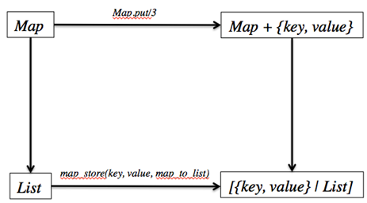{.calibre1}\

Figure 11. 2 Using a simpler implementation to test against a tested
implementation

For example, let's test out the `Map.put/3`{.codeintext} operation. When
a value is added using an existing key, the old value will be replaced.
How can we test this out? Let an example show you how:

Listing 11. 8 Using a simpler implementation to test the more
complicated one

`property "storing keys and values" do`{.codebcxspfirst}
`  forall {k, v, m} <- {key, val, map} do`{.codebcxspmiddle}
`    map_to_list = m |> Map.put(k, v) |> Map.to_list`{.codebcxspmiddle}
`    map_to_list == map_store(k, v, map_to_list)`{.codebcxspmiddle}
`  end`{.codebcxspmiddle} `end`{.codebcxspmiddle} ` `{.codebcxspmiddle}
`defp map_store(k, v, list) do`{.codebcxspmiddle}
`  case find_index_with_key(k, list) do`{.codebcxspmiddle}
`    {:match, index} ->`{.codebcxspmiddle}
`      List.replace_at(list, index, {k, v})`{.codebcxspmiddle}
`    _ ->`{.codebcxspmiddle} `      [{k, v} | list]`{.codebcxspmiddle}
`  end`{.codebcxspmiddle} `end`{.codebcxspmiddle} ` `{.codebcxspmiddle}
`defp find_index_with_key(k, list) do`{.codebcxspmiddle}
`  case Enum.find_index(list, fn({x,_}) -> x == k end) do`{.codebcxspmiddle}
`    nil   -> :nomatch`{.codebcxspmiddle}
`    index -> {:match, index}`{.codebcxspmiddle}
`  end`{.codebcxspmiddle}`end`{.codebcxsplast}

The `map_store/3`{.codeintext} helper function basically simulates the
behavior of how `Map.put/3`{.codeintext} would have added a key/value
pair. The list contains elements that are two-element tuples. The tuple
represents a key/value pair. When `map_store/3`{.codeintext} finds tuple
that matches the key, it will replace the entire tuple with the same key
but with the new value. Otherwise, the new key/value is inserted into
the list.

Here, we are exploiting the fact a map can be represented as a list, and
also that the behavior of `Map.put/3`{.codeintext} can be easily
implemented using a list. In fact, most operations of the can be
represented (and therefore tested) using a similar technique presented
above.

Performing operations in different orders

For certain operations, the order doesn't matter. Three examples of
these are:

[·[     ]{.calibre16}]{.calibre12} Appending a list and reversing it is
the same as prepending a list and reversing the list

[·[     ]{.calibre16}]{.calibre12} Adding elements to a set in different
orders should not affect the resulting elements in the set

[·[     ]{.calibre16}]{.calibre12} Adding an element and sorting it
gives the same results as prepending an element and sorting

Listing 11.9 The end result of sorting is always the same, no matter
where the element is added before

`property "appending an element and sorting it is the same as prepending an element and sorting it" do`{.codebcxspfirst}
`  forall {i, l} <- {int, list} do`{.codebcxspmiddle}
`    [i|l] |> Enum.sort == l ++ [i] |> Enum.sort`{.codebcxspmiddle}
`  end`{.codebcxspmiddle}`end`{.codebcxsplast}

When you execute the above property, everything should pass.

Idempotent Operations

An
idempotent[[[[\[4\]]{.calibre18}]{.msofootnotereference}]{.msofootnotereference}](#ch11.html#uDAzWNpJXjoRDvP35LqJIwB){#ch11.html#u635lIFw7sxq7be8l3pcDE6
.pcalibre1 .pcalibre2} operation is a fancy way of saying that an
operation will yield the same result when it is performed once or
performed repeatedly. For example:

[·[     ]{.calibre16}]{.calibre12} Calling `Enum.filter/2`{.codeintext}
with the same predicate twice is the same as doing it once

[·[     ]{.calibre16}]{.calibre12} Calling `Enum.sort/1`{.codeintext}
twice is the same as doing it once

[·[     ]{.calibre16}]{.calibre12} HTTP GET requests

Another example is `Enum.uniq/2`{.codeintext}, where calling the
function twice should not have any additional effect:

Listing 11.10 Calling an idempotent function once or multiple times
always gives the same result

`property "calling Enum.uniq/1 twice has no effect" do`{.codebcxspfirst}
`  forall l <- list(int) do`{.codebcxspmiddle}
`    ensure l |> Enum.uniq == l |> Enum.uniq |> Enum.uniq`{.codebcxspmiddle}
`  end`{.codebcxspmiddle}`end`{.codebcxsplast}

Running this property will pass all tests. Of course, these six are not
the only ones, but they are a good starting point. The next piece of the
puzzle is generators. Let's get right to it.

11.1.4[    ]{.calibre13} Generators

Generators are used to generate random test data for our QuickCheck
properties. These data could be numbers (integers, floats, real numbers
etc.), strings, and even different kinds of data structures like lists,
tuples and maps.

In this section, we will explore the generators that are available to us
by default. Then, we will learn how to create our own custom generators.

11.1.5[    ]{.calibre13} Built-in Generators

QuickCheck comes pre-shipped with a bunch of generators/generator
combinators. Table 11.1 lists some of the more common ones that you
would encounter:

+-----------------------------------+-----------------------------------+
| ::: calibre37                     | ::: calibre37                     |
| Generator/ Combinator             | Description                       |
| :::                               | :::                               |
+-----------------------------------+-----------------------------------+
| `binary/0`{.codeintable}          | Generates a binary of random      |
|                                   | size.                             |
+-----------------------------------+-----------------------------------+
| `binary/1`{.codeintable}          | Generates a binary of a given     |
|                                   | size in bytes.                    |
+-----------------------------------+-----------------------------------+
| `bool/0`{.codeintable}            | Generates a random Boolean.       |
+-----------------------------------+-----------------------------------+
| `char/0`{.codeintable}            | Generates a random character.     |
+-----------------------------------+-----------------------------------+
| `choose/2`{.codeintable}          | Generates a number in the range M |
|                                   | to N.                             |
+-----------------------------------+-----------------------------------+
| `elements/1`{.codeintable}        | Generates an element of the list  |
|                                   | argument.                         |
+-----------------------------------+-----------------------------------+
| `frequency/1`{.codeintable}       | Makes a weighted choice between   |
|                                   | the generators in its argument,   |
|                                   | such that the probability of      |
|                                   | choosing each generator is        |
|                                   | proportional to the weight paired |
|                                   | with it.                          |
+-----------------------------------+-----------------------------------+
| `list/1`{.codeintable}            | Generates a list of elements      |
|                                   | generated by its argument.        |
+-----------------------------------+-----------------------------------+
| `map/2`{.codeintable}             | Generates a map with keys         |
|                                   | generated by K and values         |
|                                   | generated by V.                   |
+-----------------------------------+-----------------------------------+
| `nat/0`{.codeintable}             | Generates a small natural number  |
|                                   | (bounded by the generation size). |
+-----------------------------------+-----------------------------------+
| `non_empty/1`{.codeintable}       | Make sure that the generated      |
|                                   | value is not empty.               |
+-----------------------------------+-----------------------------------+
| `oneof/1`{.codeintable}           | Generates a value using a         |
|                                   | randomly chosen element of the    |
|                                   | list of generators.               |
+-----------------------------------+-----------------------------------+
| `orderedlist/1`{.codeintable}     | Generates an ordered list of      |
|                                   | elements generated by G.          |
+-----------------------------------+-----------------------------------+
| `real/0`{.codeintable}            | Generates a real number.          |
+-----------------------------------+-----------------------------------+
| `sublist/1`{.codeintable}         | Generate a random sub-list of the |
|                                   | given list.                       |
+-----------------------------------+-----------------------------------+
| `utf8/0`{.codeintable}            | Generates a random utf8 binary.   |
+-----------------------------------+-----------------------------------+
| `vector/2`{.codeintable}          | Generates a list of the given     |
|                                   | length, with elements generated   |
|                                   | by G.                             |
+-----------------------------------+-----------------------------------+

Table 11.1 A list of generator and generator combinators that come with
QuickCheck

You have already seen generators in action in the previous examples.
Here are some other examples on using generators.

Example: Specifying the Tail of a List

How would we write a specification for getting the tail of a list? As a
refresher, this is what `tl/1`{.codeintext} does:

Listing 11.11 tl/1 gets the tails of the list

`iex> h tl`{.codebcxspfirst}
`                                  def tl(list)`{.codebcxspmiddle}
` `{.codebcxspmiddle}
`Returns the tail of a list. Raises ArgumentError if the list is empty.`{.codebcxspmiddle}
` `{.codebcxspmiddle} ` `{.codebcxspmiddle} `Examples`{.codebcxspmiddle}
` `{.codebcxspmiddle}
`┃ iex> tl([1, 2, 3, :go])`{.codebcxspmiddle}`┃ [2, 3, :go]`{.codebcxsplast}

The representation of a non-empty list, it is
`[head|tail]`{.codeintext}, where `head`{.codeintext} is the first
element of the list and `tail`{.codeintext} is a smaller list not
including the head. With this definition in mind, we can therefore
define the property as such:

Listing 11.12 Property for getting the tail of the list

`property "tail of list" do`{.codebcxspfirst}
`  forall l <- list(int) do`{.codebcxspmiddle}
`    [_head|tail] = l`{.codebcxspmiddle}
`    ensure tl(l) == tail`{.codebcxspmiddle}
`  end`{.codebcxspmiddle}`end`{.codebcxsplast}

Let's try this out and see what happens.

`1) test Property tail of list (ListsEQC)`{.codebcxspfirst}
`     test/lists_eqc.exs:11`{.codebcxspmiddle}
`     forall(l <- list(int)) do`{.codebcxspmiddle}
`       [_ | tail] = l`{.codebcxspmiddle}
`       ensure(tl(l) == tail)`{.codebcxspmiddle}
`     end`{.codebcxspmiddle}`     Failed for [] `{.codebcxsplast}

Whoops! Turns out, QuickCheck has found a counterexample -- the empty
list! And that is spot on, because if you were to look back at the
definition of `tl/1`{.codeintext}, it raises
`ArgumentError`{.codeintext} if the list is empty. In order words, we
should correct our property.

We can try using `implies/1`{.codeintext} to add a precondition to our
property. This precondition here will always make sure that the
generated list is empty. Let's set the precondition where we only want
*non-empty* lists:

Listing 11.13 Using implies/2 to set a precondition for the generated
lists

`property "tail of list" do`{.codebcxspfirst}
`  forall l <- list(int) do`{.codebcxspmiddle}
`    implies l != [] do`{.codebcxspmiddle}
`      [_head|tail] = l`{.codebcxspmiddle}
`      ensure tl(l) == tail`{.codebcxspmiddle}
`    end`{.codebcxspmiddle}
`  end`{.codebcxspmiddle}`end`{.codebcxsplast}

This time when we run the test, all the tests pass, but we see something
slightly different:

`xxxxxxxxxx.xxxxx.xx...x...x...xxx.xx..x....x.........x....x.............x..x........................(x10)...(x1)xxxxx`{.codebcxspfirst}
`OK, passed 100 tests`{.codebcxsplast}

The crosses (`x`{.codeintext}) indicate that some tests been discarded
because these tests have failed the post-condition. Ideally, you do not
want test cases to be discarded. We can instead express it different and
make sure that our generated list is always non-empty. In QuickCheck, we
can easily add a generator combinator and therefore get rid of
`implies/1`{.codeintext}:

Listing 11.14 Using non_empty/1 to explicitly generate non-empty lists

`property "tail of list" do`{.codebcxspfirst}
`  forall l <- non_empty(list(int)) do`{.codebcxspmiddle}
`    [_head|tail] = l`{.codebcxspmiddle}
`    ensure tl(l) == tail`{.codebcxspmiddle}
`  end`{.codebcxspmiddle}`end`{.codebcxsplast}

This time, *none* of the test cases were discarded:

` .................................................................................................... OK, passed 100 tests `{.codeb}

Example: Specifying List Concatenation

So far, we have only used one generator. Sometimes, that is not enough.
Say we want to test `Enum.concat/2`{.codeintext}. A straightforward way
would be to test `Enum.concat/2`{.codeintext} against the built-in
`++`{.codeintext} operator that does the same thing. This requires two
lists:

Listing 11.15 Using more than one generator

`property "list concatenation" do`{.codebcxspfirst}
`  forall {l1, l2} <- {list(int), list(int)} do`{.codebcxspmiddle}
`    ensure Enum.concat(l1, l2) == l1 ++ l2`{.codebcxspmiddle}
`  end`{.codebcxspmiddle}`end`{.codebcxsplast}

In the next section, we will see how to define our own custom
generators. You will find that QuickCheck is expressive enough to
produce any kind of data we need.

11.1.6[    ]{.calibre13} Creating Custom Generators

All the generators we have been using are built-in. However, we can just
as easily create our own generators. Why go through the trouble though?
Sometimes, you want the random data that QuickCheck generates to have
certain characteristics.

Example: Specifying String Splitting

Let's say we wanted to test `String.split/2`{.codeintext}. This function
takes a string and a delimiter, and splits the string based on the
delimiter. For example:

`iex(1)> String.split("everything|is|awesome|!", "|")`{.codebcxspfirst}
`["everything", "is", "awesome", "!"]`{.codebcxsplast}

Step back and think for a moment how we might write a property for
`String.split/2`{.codeintext}. One way would be to test the *inverse* of
a string. Given a function `f(x)`{.codeintext} and it's *inverse*,
`f`{.codeintext}^`-1`{.codeintext}^`(x)`{.codeintext}, then we can say
that:

{.calibre1}\

This means that when you apply a function to value, and then you apply
the inverse function to the resulting value, you get back the original
value.

In this case, the inverse operation of splitting a string using a
delimiter is *joining* the result of the splitting with that same
delimiter. For this, we write a quick helper function called join that
takes the tokenized result from the split operation and the delimiter:

`def join(parts, delimiter) do`{.codebcxspfirst}
`  parts |> Enum.intersperse([delimiter]) |> Enum.join`{.codebcxspmiddle}`end`{.codebcxsplast}

Here's an example:

`iex> join(["everything", "is", "awesome", !], [?|])`{.codebcxspfirst}
` `{.codebcxspmiddle}`"everything|is|awesome|!"`{.codebcxsplast}

With this, we can write a property for `String.split/2`{.codeintext}:

Listing 11. 16 Splitting and joining a string with the same delimiter
are inverse operations

` defmodule StringEQC do`{.codebcxspfirst}
`  use ExUnit.Case`{.codebcxspmiddle}
`  use EQC.ExUnit`{.codebcxspmiddle} ` `{.codebcxspmiddle}
`  property "splitting a string with a delimiter and joining it again yields the same string" do`{.codebcxspmiddle}
`    forall s <- list(char) do`{.codebcxspmiddle}
`      s = to_string(s)`{.codebcxspmiddle}
`       ensure String.split(s, ",") |> join(",") == s`{.codebcxspmiddle}
`    end`{.codebcxspmiddle} `  end`{.codebcxspmiddle}
` `{.codebcxspmiddle}
`  defp join(parts, delimiter) do`{.codebcxspmiddle}
`    parts |> Enum.intersperse([delimiter]) |> Enum.join`{.codebcxspmiddle}
`  end`{.codebcxspmiddle} ` `{.codebcxspmiddle}`end`{.codebcxsplast}

::: calibre20
[[`to_string`{.codeintext1}]{.calibre25}]{.pcalibre} on character lists
:::

Notice the use of [`to_string/1`{.codeintext}]{.calibre21}. This
function is used to converts the argument to a string according to the
[`String.Chars`{.codeintext}]{.calibre21} *protocol*. Protocols are not
covered in this book, but the point is we must massage the list of
characters into a format that
[`String.split/2`{.codeintext}]{.calibre21} can understand.

::: calibre22
 
:::

There's a tiny problem though. What is the probability that QuickCheck
actually generates a string that contains commas? Let's find out with
`collect/2`{.codeintext}:

Listing 11. 17 With collect/2, we can see a distribution of the
generated data

`property "splitting a string with a delimiter and joining it again yields the same string" do`{.codebcxspfirst}
`  forall s <- list(char) do`{.codebcxspmiddle}
`    s = to_string(s)`{.codebcxspmiddle}
`    collect string: s, in:                           #1`{.codebcxspmiddle}
`      ensure String.split(s, ",") |> join(",") == s  #1`{.codebcxspmiddle}
`  end`{.codebcxspmiddle}`end`{.codebcxsplast}

#1: The \`collect\` macro reports statistics of the generated
data[[` `{.codeintext1}]{.calibre21}]{.pcalibre}

Here's a snippet of the output from `collect/2`{.codeintext}:

`1% <<"¡N?½W.E">>`{.codebcxspfirst}
`1% <<121,6,53,194,189,5>>`{.codebcxspmiddle}
`1% <<"x2A¤">>`{.codebcxspmiddle} `1% <<"q$">>`{.codebcxspmiddle}
`1% <<"g">>`{.codebcxspmiddle} `1% <<102,7,112>>`{.codebcxspmiddle}
`1% <<"f">>`{.codebcxspmiddle}
`1% <<98,75,6,194,154>>`{.codebcxspmiddle}`1% <<"\\¯\e">>`{.codebcxsplast}

Even if you were to inspect the entire generated data set, you would be
hard pressed to find anything with a comma. How hard pressed exactly?
QuickCheck has `classify/3`{.codeintext} for that:

Listing 11.18 classify/3 runs a Boolean function against the generated
data

`property "splitting a string with a delimiter and joining it again yields the same string" do`{.codebcxspfirst}
`  forall s <- list(char) do`{.codebcxspmiddle}
`    s = to_string(s)`{.codebcxspmiddle}
`    :eqc.classify(String.contains?(s, ","),`{.codebcxspmiddle}
`                  :string_with_commas,`{.codebcxspmiddle}
`                  ensure String.split(s, ",") |> join(",") == s)`{.codebcxspmiddle}
`  end`{.codebcxspmiddle}`end`{.codebcxsplast}

`classify/3`{.codeintext} runs a Boolean function again the generate
string input and property, and displays the result. In this case, it
reports:

`....................................................................................................`{.codebcxspfirst}
`OK, passed 100 tests`{.codebcxspmiddle}
` `{.codebcxspmiddle}`1% string_with_commas`{.codebcxsplast}

While all the tests pass, only a paltry *one percent* of the data has
commas. Since we only have a hundred tests, only *one* string that was
generated had one or more commas.

What we really want is to generate *more* strings that have *more*
commas. Luckily for us, QuickCheck gives us the tools to do just that.
The end result is to be able to express the property like this, where
`string_with_commas`{.codeintext} is our custom generator that we are
going to implement next.

`property "splitting a string with a delimiter and joining it again yields the same string" do`{.codebcxspfirst}
`  forall s <- string_with_commas do`{.codebcxspmiddle}
`    s = to_string(s)`{.codebcxspmiddle}
`    ensure(String.split(s, ",") |> join(",") == s)`{.codebcxspmiddle}
`  end`{.codebcxspmiddle}`end`{.codebcxsplast}

Example: Generating Strings with Commas

Let's come up with a few requirements for our list.

1.[  ]{.calibre16} It has to be between 1 to 10 characters long

2.[  ]{.calibre16} The string should contain lowercase alphabets

3.[  ]{.calibre16} The string should contain commas

4.[  ]{.calibre16} Commas should appear less frequently than alphabets

Let's tackle the first thing on the list. When using the
`list/1`{.codeintext} generator, we do not have control of the length of
the list. For that, we have to use the `vector/2`{.codeintext}
generator, which accepts a length and a generator.

Create a new file called `eqc_gen.ex`{.codeintext} in
`lib`{.codeintext}. Let's start with the our first custom generator:

Listing 11. 19 vector/2 generates a list with a specified length

`defmodule EQCGen do`{.codebcxspfirst}
`  use EQC.ExUnit`{.codebcxspmiddle} ` `{.codebcxspmiddle}
`  def string_with_fixed_length(len) do`{.codebcxspmiddle}
`    vector(len, char)`{.codebcxspmiddle} `  end`{.codebcxspmiddle}
` `{.codebcxspmiddle}`end`{.codebcxsplast}

Then open an `iex`{.codeintext} session with `iex -S mix`{.codeintext}.
We can get a sample of what QuickCheck might generate with
`:eqc_gen.sample/1`{.codeintext}:

`iex> :eqc_gen.sample(EQCGen.string_with_fixed_length(5))`{.codeb}

Here's a possible output:

`[170,246,255,153,8]`{.codebcxspfirst} `"ñísJ£"`{.codebcxspmiddle}
`"×¾sûÛ"`{.codebcxspmiddle} `"ÈÚwä\t"`{.codebcxspmiddle}
`[85,183,155,222,83]`{.codebcxspmiddle}
`[158,49,169,40,2]`{.codebcxspmiddle} `"¥Ùêr¿"`{.codebcxspmiddle}
`[58,51,129,71,177]`{.codebcxspmiddle}
`"æ¿q5º"`{.codebcxspmiddle}`"C°{Sð"`{.codebcxsplast}

::: calibre20
String Representation
:::

Recall that strings internally are lists of characters, and characters
can be represented using integers.

::: calibre22
 
:::

Generating fixed-length strings is no fun. With `choose/2`{.codeintext},
we can introduce some variation.

Listing 11.20 choose/2 returns a random number that we can use in
vector/2 to generate lists of varying lengths

`def string_with_variable_length do`{.codebcxspfirst}
`  let len <- choose(1, 10) do`{.codebcxspmiddle}
`    vector(len, char)`{.codebcxspmiddle}
`  end`{.codebcxspmiddle}`end`{.codebcxsplast}

The use of `let/2`{.codeintext} here is important. `let/2`{.codeintext}
binds the generated value for use with another generator. In other
words, this *will not* work:

Listing 11.21 The wrong way of using choose/2. Remember that choose/2 is
a generator too.

`# NOTE: This doesn’t work!`{.codebcxspfirst}
`def string_with_variable_length do`{.codebcxspmiddle}
`  vector(choose(1, 10), char)`{.codebcxspmiddle}`end`{.codebcxsplast}

That's because the first argument of vector/1 should be an integer, not
a generator.

::: calibre20
Tip: You do not have to restart the iex session
:::

Instead you can recompile and reload the specified module's source file.
Therefore, after we have added the new generator, we can reload
[`EQCGen`{.codeintext}]{.calibre21} directly from the session:

[`iex(1)> r(EQCGen)`{.sidebaracode}]{lang="BS-LATN-BA"}
[`lib/eqc_gen.ex:1: warning: redefining module EQCGen`{.sidebaracode}]{lang="BS-LATN-BA"}
[`{:reloaded, EQCGen, [EQCGen]}`{.sidebaracode}]{lang="BS-LATN-BA"}

::: calibre22
 
:::

Try running `:eqc_gen.sample/1`{.codeintext} against
`string_with_variable_length`{.codeintext}:

`iex(1)> :eqc_gen.sample(EQCGen.string_with_variable_length)`{.codebcxspfirst}
`"ß"`{.codebcxspmiddle} `[188,220,86,82,6,14,230,136]`{.codebcxspmiddle}
`[150]`{.codebcxspmiddle} `[65,136,250,131,106]`{.codebcxspmiddle}
`[4]`{.codebcxspmiddle} `[205,6,254,43,64,115]`{.codebcxspmiddle}
`",ÄØ"`{.codebcxspmiddle}
`[184,203,190,93,158,29,250]`{.codebcxspmiddle}
`"vp\vwSçú"`{.codebcxspmiddle}
`[186,128,49]`{.codebcxspmiddle}`[247,158,120,140,113,186]`{.codebcxsplast}

It works! There are no empty lists, and the longer list has ten elements
in them. Now, to tackle the second requirement: The generated string
should only contain lower-case characters. The key here is to limit the
values that are generated in the string. Currently, we are allowing
*any* character (including UTF--8) to be part of the string:

` vector(len, char)`{.codeb}

To do what we want, we can use the `oneof/1`{.codeintext} generator that
randomly picks an element from a list of generators. In this case, we
only need to supply a single list containing lowercased alphabets. Note
that we are using the Erlang `:lists.seq/2`{.codeintext} function to
generate a sequence of lowercased alphabets:

` vector(len, oneof(:lists.seq(?a, ?z))) `{.codeb}

Reloading the module and running `eqc_gen.sample/1`{.codeintext} again:

`iex> :eqc_gen.sample(EQCGen.string_with_variable_length)`{.codeb}

We get a taste of what QuickCheck might generate:

`"kcra"`{.codebcxspfirst} `"iqtg"`{.codebcxspmiddle}
`"yqwmqusd"`{.codebcxspmiddle} `"hoyacocy"`{.codebcxspmiddle}
`"jk"`{.codebcxspmiddle} `"a"`{.codebcxspmiddle}
`"iekkoi"`{.codebcxspmiddle} `"nugzrdgon"`{.codebcxspmiddle}
`"tcopskokv"`{.codebcxspmiddle}
`"wgddqmaq"`{.codebcxspmiddle}`"lexsbkosce"`{.codebcxsplast}

Nice! How do we have commas as part of the generated string? A naive way
would be to simply add the comma character as part of the generated
string:

` vector(len, oneof(:lists.seq(?a, ?z) ++ [?,]))`{.codeb}

The problem with this approach is that we cannot control how many times
the comma appears. We can fix this using `frequency/1`{.codeintext}. It
is easier to show how `frequency/1`{.codeintext} is used before
explaining:

Listing 11.22 Using frequency/1 to control how often a value is
generated

`vector(len,frequency([{3, oneof(:lists.seq(?a, ?z))},`{.codebcxspfirst}
`                      {1, ?,}]))`{.codebcxsplast}

When we express it like that, a lower-case alphabet will be generated
75% of the time, while a comma will be generated 25% of the time. Here's
the final result:

Listing 11.23 Using frequency/1 to increase the probability of commas
being generated in the resulting string

`def string_with_commas do`{.codebcxspfirst}
`  let len <- choose(1, 10) do`{.codebcxspmiddle}
`    vector(len, frequency([{3, oneof(:lists.seq(?a, ?z))},`{.codebcxspmiddle}
`                           {1, ?,}]))`{.codebcxspmiddle}
` `{.codebcxspmiddle} `    end`{.codebcxspmiddle}
`  end`{.codebcxspmiddle}`end`{.codebcxsplast}

Reload the module and run `eqc_gen.sample/1`{.codeintext}:

`iex> :eqc_gen.sample(EQCGen.string_with_commas)`{.codeb}

Here's a sample of the generated data:

`"acrn"`{.codebcxspfirst} `",,"`{.codebcxspmiddle}
`"uandbz,afl"`{.codebcxspmiddle} `"o,,z"`{.codebcxspmiddle}
`",,wwkr"`{.codebcxspmiddle} `",lm"`{.codebcxspmiddle}
`",h,s,aej,"`{.codebcxspmiddle} `",mpih,vjsq"`{.codebcxspmiddle}
`"swz"`{.codebcxspmiddle}
`"n,,yc,"`{.codebcxspmiddle}`"jlvmh,g"`{.codebcxsplast}

Much better! Now, let's use our newly minted generator:

Listing 11. 24 Using our new generator that generates string with (more)
commas

`property "splitting a string with a delimiter and joining it again yields the same string" do`{.codebcxspfirst}
`  forall s <- EGCGen.string_with_commas do # 1`{.codebcxspmiddle}
`    s = to_string(s)`{.codebcxspmiddle}
`    :eqc.classify(String.contains?(s, ","),`{.codebcxspmiddle}
`                  :string_with_commas,`{.codebcxspmiddle}
`                  ensure String.split(s, ",") |> join(",") == s)`{.codebcxspmiddle}
`  end`{.codebcxspmiddle}`end`{.codebcxsplast}

#1 Using our new generator

This time, the results are *much* better:

`....................................................................................................`{.codebcxspfirst}
`OK, passed 100 tests`{.codebcxspmiddle}
` `{.codebcxspmiddle}`65% string_with_commas`{.codebcxsplast}

Of course, if you are still not satisfied with the test data
distribution, you are always in power to tweak the values yourself. It
is always good practice to check the distribution of test data,
especially when you data depend on certain characteristics such has
having at least one comma. Here are a few example generators that you
can try implementing:

[·[     ]{.calibre16}]{.calibre12} A DNA sequence. A DNA sequence
consists of only A's, T's, G's and C's. An example is
`ACGTGGTCTTAA`{.codeintext}.

[·[     ]{.calibre16}]{.calibre12} A Hexadecimal sequence. A Hexadecimal
consists of 0 to 9, and the letters `A`{.codeintext} to
`F`{.codeintext}. An example is `0FF1CE`{.codeintext} and
`CAFEBEEF`{.codeintext}.

[·[     ]{.calibre16}]{.calibre12} A sorted and unique sequence of
numbers. For example: `-4, 10, 12, 35, 100`{.codeintext}

11.1.7[    ]{.calibre13} Recursive Generators

Let's try our hand at something *slightly* more challenging. Suppose we
need to generate *recursive* test data. An example is JSON, where the
value of a JSON key could be yet another JSON structure. Another example
is the tree data structure (which we will see in the next section).

This is when we need *recursive* generators. As its name suggests, these
are generators that call themselves. In this example imagine that we are
going to write a property for `List.flatten/1`{.codeintext}, and we need
to generate nested lists.

However, when solving problems with recursion, you must take care not to
have infinite recursion. The way to prevent that is to have the input to
the recursive calls to be *smaller* at each invocation, and reaching to
a terminal condition somehow.

The standard way to handle recursive generators in QuickCheck is to use
`sized/2`{.codeintext}. `sized/2`{.codeintext} gives you access to the
current size parameter of the test data currently being generated. We
can use this parameter to therefore control the size of the input of the
recursive calls.

Example: Generating Arbitrarily Nested Lists (Test with List.flatten/2)

An example is in order. First, we will create an entry point for our
tests to use the nested list generator:

Listing 11.25 sized/2 gives us access to the size parameter of the
generated data

` defmodule EQCGen do`{.codebcxspfirst}
`  use EQC.ExUnit`{.codebcxspmiddle} ` `{.codebcxspmiddle}
`  def nested_list(gen) do`{.codebcxspmiddle}
`    sized size do`{.codebcxspmiddle}
`      nested_list(size, gen)`{.codebcxspmiddle}
`    end`{.codebcxspmiddle} `  end`{.codebcxspmiddle}
` `{.codebcxspmiddle}
`  # nested_list/2 not implemented yet`{.codebcxspmiddle}
` `{.codebcxspmiddle}`end`{.codebcxsplast}

`nested_list/1`{.codeintext} accepts a generator as an argument, and
hands it to `nested_list/2`{.codeintext} which is wrapped in
`sized/2`{.codeintext}. `nested_list/2`{.codeintext} takes in two
arguments. `size`{.codeintext} is the size of the current test data to
be generated by `gen`{.codeintext}, while the second argument is the
generator.

We now need to implement `nested_list/2`{.codeintext}. For lists, there
are two cases. Either the list is empty, or not. An empty list should be
returned if the size passed in is zero:

Listing 11. 26 Implementing the empty list case of nested_list/2

`defmodule EQCGen do`{.codebcxspfirst}
`  use EQC.ExUnit`{.codebcxspmiddle} ` `{.codebcxspmiddle}
`  # nested/1 goes here`{.codebcxspmiddle} ` `{.codebcxspmiddle}
`  defp nested_list(0, _gen) do`{.codebcxspmiddle}
`    []`{.codebcxspmiddle} `  end`{.codebcxspmiddle}
` `{.codebcxspmiddle}`end`{.codebcxsplast}

The second case is where the action happens:

Listing 11. 27 Implementing the non-empty list case of nested_list/2.
Here is where the recursion happens.

`defmodule EQCGen do`{.codebcxspfirst}
`  use EQC.ExUnit`{.codebcxspmiddle} ` `{.codebcxspmiddle}
`  # nested/1 goes here`{.codebcxspmiddle} ` `{.codebcxspmiddle}
`  # nested/2 empty case goes here`{.codebcxspmiddle}
` `{.codebcxspmiddle} `  defp nested_list(n, gen) do`{.codebcxspmiddle}
`    oneof [[gen|nested_list(n-1, gen)],        `{.codebcxspmiddle}
`           [nested_list(n-1, gen)]]`{.codebcxspmiddle}
`      end`{.codebcxspmiddle} ` `{.codebcxspmiddle}`end`{.codebcxsplast}

Let's try it out with

`iex(1)> :eqc_gen.sample EQCGen.nested_list(:eqc_gen.int)`{.codeb}

Here are the results:

`[[-10,[-7,[9,[4,[[]]]]]]]`{.codebcxspfirst}
`[10,0,2,-3,[[-6,[[-2,-1]]]]]`{.codebcxspmiddle}
`[[8,[[11,[-7,-3,-9,10,-8,-10]]]]]`{.codebcxspmiddle}
`[5,8,[-10,-11,[7,[-4,-10,0,[5]]]]]`{.codebcxspmiddle}
`[[-8,-4,2,12,-6,9,1,[[[12,-4,[]]]]]]`{.codebcxspmiddle}
`[8,[4,12,[13,-12,[12,4,[15,14,[4]]]]]]`{.codebcxspmiddle}
`[[[[6,[-11,[[-6,[[[[[[-16]]]]]]]]]]]]]`{.codebcxspmiddle}
`[-7,13,[15,-13,[-3,[5,0,[16,-17,[[[[]]]]]]]]]`{.codebcxspmiddle}
`[18,[[[[[-8,-8,[3,[-12,[18,[13,[[]]]]]]]]]]]]`{.codebcxspmiddle}
`[[-2,[[[-6,-17,3,[[-18,[[12,[[[13,1]]]]]]]]]]]]`{.codebcxspmiddle}
`[[[[-15,[-17,[[[-16,[[[20,[[[17,10,[]]]]]]]]]]]]]]]`{.codebcxspmiddle}`:ok`{.codebcxsplast}

Hurray! We managed to generate a bunch of nested lists of integers. But
did you notice that the generation took a *very* long time? The problem
lies with this line:

`oneof [[gen|nested_list(n-1, gen)],        `{.codebcxspfirst}
`       [nested_list(n-1, gen)]]`{.codebcxsplast}

What is happening internally is that even though we are saying choose
*either* `[gen|nested_list(n-1, gen)]`{.codeintext} or
`[nested_list(n-1, gen)]`{.codeintext}. What's really happening is that
*both* expressions are being evaluated, even when we only need one of
them. What we need is to use *lazy evaluation*. Being lazy only
evaluates the part of the `oneof/1`{.codeintext} that we need.
Fortunately, all we have to do is wrap a `lazy/1`{.codeintext} around
`oneof/1`{.codeintext}:

Listing 11. 28 lazy/1 only calls generators on demand

`lazy do`{.codebcxspfirst}
`  oneof [[gen|nested_list(n-1, gen)],        `{.codebcxspmiddle}
`         [nested_list(n-1, gen)]]`{.codebcxspmiddle}`end`{.codebcxsplast}

Here's the final version:

Listing 11. 29 The final version of the nested list generator

`defmodule EQCGen do`{.codebcxspfirst}
`  use EQC.ExUnit`{.codebcxspmiddle} ` `{.codebcxspmiddle}
`  def nested_list(gen) do`{.codebcxspmiddle}
`    sized size do`{.codebcxspmiddle}
`      nested_list(size, gen)`{.codebcxspmiddle}
`    end`{.codebcxspmiddle} `  end`{.codebcxspmiddle}
` `{.codebcxspmiddle} `  defp nested_list(0, _gen) do`{.codebcxspmiddle}
`    []`{.codebcxspmiddle} `  end`{.codebcxspmiddle}
` `{.codebcxspmiddle} `  defp nested_list(n, gen) do`{.codebcxspmiddle}
`    lazy do`{.codebcxspmiddle}
`      oneof [[gen|nested_list(n-1, gen)],`{.codebcxspmiddle}
`             [nested_list(n-1, gen)]]`{.codebcxspmiddle}
`    end`{.codebcxspmiddle} `  end`{.codebcxspmiddle}
` `{.codebcxspmiddle}`end`{.codebcxsplast}

This time, the generation of the nested lists zips right along. In order
to let the concepts sink in, we will work through another example.

Example: Generating a Balanced Tree

In this example, we will learn to build a generator that spits out
*balanced trees*. As a refresher, a balanced tree is such that:

[·[     ]{.calibre16}]{.calibre12} The left and right subtree' heights
differ by at most one

[·[     ]{.calibre16}]{.calibre12} The left and right subtree are both
balanced

As before, we first create the entry point:

Listing 11.30 The entry point to the balanced tree generator. Note the
use of sized/2 again

`defmodule EQCGen do`{.codebcxspfirst}
`  use EQC.ExUnit`{.codebcxspmiddle} ` `{.codebcxspmiddle}
`  def balanced_tree(gen) do`{.codebcxspmiddle}
`    sized size do`{.codebcxspmiddle}
`      balanced_tree(size, gen)`{.codebcxspmiddle}
`    end`{.codebcxspmiddle} `  end`{.codebcxspmiddle}
` `{.codebcxspmiddle}
`  # balanced_tree/2 not implemented yet`{.codebcxspmiddle}
` `{.codebcxspmiddle}`end`{.codebcxsplast}

A terminal node of a tree is the *leaf node*. That is the base case of
the tree construction:

Listing 11.31 The base case is when the size of the tree is zero

`defmodule EQCGen do`{.codebcxspfirst}
`  use EQC.ExUnit`{.codebcxspmiddle} ` `{.codebcxspmiddle}
`  # balanced_tree/1 goes here`{.codebcxspmiddle} ` `{.codebcxspmiddle}
`  def balanced_tree(0, gen) do`{.codebcxspmiddle}
`    {:leaf, gen}`{.codebcxspmiddle} `  end`{.codebcxspmiddle}
` `{.codebcxspmiddle}`end`{.codebcxsplast}

Notice that we tag the leaf node with the `:leaf`{.codeintext} atom.
Next, we need to implement the case where the node is *not* a leaf:

Listing 11.32 Recursively calling generators in the non-base case
version of balanced_tree/2

`defmodule EQCGen do`{.codebcxspfirst}
`  use EQC.ExUnit`{.codebcxspmiddle} ` `{.codebcxspmiddle}
`  # balanced_tree/1 goes here`{.codebcxspmiddle} ` `{.codebcxspmiddle}
`  # balanced_tree/2 leaf node case here`{.codebcxspmiddle}
` `{.codebcxspmiddle} `  def balanced_tree(n, gen) do`{.codebcxspmiddle}
`    lazy do`{.codebcxspmiddle} `      {:node,`{.codebcxspmiddle}
`        gen,`{.codebcxspmiddle}
`        balanced_tree(div(n, 2), gen), # 1`{.codebcxspmiddle}
`        balanced_tree(div(n, 2), gen)} # 1`{.codebcxspmiddle}
`    end`{.codebcxspmiddle} `  end`{.codebcxspmiddle}
` `{.codebcxspmiddle}`end`{.codebcxsplast}

#1: Each recursive call halves the size of the subtree

For non-leaf nodes, we tag the tuple with `:node`{.codeintext} followed
by the value of the generator. Finally, we recursively call
`balanced_tree/2`{.codeintext} twice: One for the left subtree and one
for the right subtree. Each recursive call *halves* the size of the
generated subtree. This ensures that we eventually hit the base case and
terminate.

Finally, we wrap recursive calls with a `lazy/1`{.codeintext} to make
sure that the recursive calls are only invoked when needed. Here's the
final version:

Listing 11.33 The final version of the balanced tree generator

`defmodule EQCGen do`{.codebcxspfirst}
`  use EQC.ExUnit`{.codebcxspmiddle} ` `{.codebcxspmiddle}
`  def balanced_tree(gen) do`{.codebcxspmiddle}
`    sized size do`{.codebcxspmiddle}
`      balanced_tree(size, gen)`{.codebcxspmiddle}
`    end`{.codebcxspmiddle} `  end`{.codebcxspmiddle}
` `{.codebcxspmiddle} `  def balanced_tree(0, gen) do`{.codebcxspmiddle}
`    {:leaf, gen}`{.codebcxspmiddle} `  end`{.codebcxspmiddle}
` `{.codebcxspmiddle} `  def balanced_tree(n, gen) do`{.codebcxspmiddle}
`    lazy do`{.codebcxspmiddle} `      {:node,`{.codebcxspmiddle}
`        gen,`{.codebcxspmiddle}
`        balanced_tree(div(n, 2), gen),`{.codebcxspmiddle}
`        balanced_tree(div(n, 2), gen)}`{.codebcxspmiddle}
`    end`{.codebcxspmiddle} `  end`{.codebcxspmiddle}
` `{.codebcxspmiddle}`end`{.codebcxsplast}

We can generate a few balanced trees with integers as the generator:

`iex> :eqc_gen.sample EQCGen.balanced_tree(:eqc_gen.int)`{.codeb}

This gives us an output like:

`{node,0,`{.codebcxspfirst} `      {node,8,`{.codebcxspmiddle}
`            {node,8,{node,8,{leaf,6},{leaf,-3}},{node,1,{leaf,5},{leaf,-7}}},`{.codebcxspmiddle}
`            {node,1,{node,-4,{leaf,8},{leaf,3}},{node,1,{leaf,-8},{leaf,7}}}},`{.codebcxspmiddle}
`      {node,-4,`{.codebcxspmiddle}
`            {node,6,{node,-1,{leaf,6},{leaf,10}},{node,5,{leaf,-6},{leaf,-3}}},`{.codebcxspmiddle}`            {node,-4,{node,6,{leaf,3},{leaf,-1}},{node,2,{leaf,8},{leaf,8}}}}}`{.codebcxsplast}

Try your hand at generating these recursive structures:

[·[     ]{.calibre16}]{.calibre12} An unbalanced tree

[·[     ]{.calibre16}]{.calibre12} JSON

11.1.8[    ]{.calibre13} Summary of QuickCheck

The big idea of QuickCheck is write properties of your code, and leave
the generation of the test cases and verification of the properties to
the tool. Once you have come up with the properties, the tool handles
the rest and can easily generate hundreds to thousands of test cases.

On the other hand, it is not rainbows and unicorns --- you need to think
of the properties yourself. While thinking of the properties does
involve a lot of thinking on your part, the benefits are huge. Often the
process of thinking through the properties leaves you with a much better
understanding of your code.

We have covered enough of the basics so that you are able to write your
own QuickCheck properties and generators. There are other (advanced)
areas that we have no explored, such as shrinking of test data and
verification of state machines. I will just gently point you to the
resources at the end of this chapter. Now, we look at concurrency
testing with a ambitiously named tool called Concuerror.

11.2[      ]{.calibre14} Concurrency Testing with Concuerror

While the actor concurrency model in Elixir eliminates a whole class of
concurrency errors, it is by no means a silver bullet. It is still very
possible (and very easy) to introduce concurrency bugs. In the examples
that follow, I challenge you to figure out what the concurrency bugs are
by simply eyeballing the code.

Exposing concurrency bugs via traditional unit testing is also very
difficult, if not woefully inadequate endeavor. Concuerror is a tool
that systematically weeds out concurrency errors. While it cannot find
every single kind of concurrency bug, the bugs that it can reveal are
very impressive.

We will learn how to use Concuerror and exploit its capabilities to
reveal hard-to-find concurrency bugs. I guarantee you will be surprised
with the results. First, we need to get Concuerror installed.

11.2.1[    ]{.calibre13} Installing Concuerror

Getting Concuerror installed is simple. Here are the steps required:

`$ git clone https://github.com/parapluu/Concuerror.git`{.codebcxspfirst}
`$ cd Concuerror`{.codebcxspmiddle} `$ make`{.codebcxspmiddle}
` MKDIR ebin`{.codebcxspmiddle}
` GEN  src/concuerror_version.hrl`{.codebcxspmiddle}
` DEPS src/concuerror_callback.erl`{.codebcxspmiddle}
` ERLC src/concuerror_callback.erl`{.codebcxspmiddle}
` …`{.codebcxspmiddle}` GEN  concuerror`{.codebcxsplast}

The last line of the output is the Concuerror program (an Erlang script)
that, for convenience, you would want to include into your
`PATH`{.codeintext}.

::: calibre20
Add [[`concuerror`{.codeintext1}]{.calibre25}]{.pcalibre} to your
[[`PATH`{.codeintext1}]{.calibre25}]{.pcalibre}
:::

On Unix systems, this means adding a line like

[`export PATH=$PATH:"/path/to/Concuerror"`{.codeintext}]{.calibre21}

::: calibre22
 
:::

11.2.2[    ]{.calibre13} Setting Up the Project

Create a new project:

`mix new concuerror_playground `{.codeb}

Next, open `mix.exs`{.codeintext} and add make sure you add the lines in
bold:

Listing 11. 34 Setting up to use Concuerror

`defmodule ConcuerrorPlayground.Mixfile do`{.codebcxspfirst}
`  use Mix.Project`{.codebcxspmiddle} ` `{.codebcxspmiddle}
`  def project do`{.codebcxspmiddle}
`    [app: :concuerror_playground,`{.codebcxspmiddle}
`     version: "0.0.1",`{.codebcxspmiddle}
`     elixir: "~> 1.2-rc",`{.codebcxspmiddle}
`     build_embedded: Mix.env == :prod,`{.codebcxspmiddle}
`     start_permanent: Mix.env == :prod,`{.codebcxspmiddle}
`     elixir_paths: elixirc_paths(Mix.env), #1`{.codebcxspmiddle}
`     test_pattern: "*_test.ex*",           #1`{.codebcxspmiddle}
`     warn_test_pattern: nil,               #1`{.codebcxspmiddle}
`     deps: deps]`{.codebcxspmiddle} `  end`{.codebcxspmiddle}
` `{.codebcxspmiddle} `  def application do`{.codebcxspmiddle}
`    [applications: [:logger]]`{.codebcxspmiddle}
`  end`{.codebcxspmiddle} ` `{.codebcxspmiddle}
`  defp deps do`{.codebcxspmiddle} `    []`{.codebcxspmiddle}
`  end`{.codebcxspmiddle} ` `{.codebcxspmiddle}
`  defp elixirc_paths(:test), do: ["lib", "test/concurrency"] #1`{.codebcxspmiddle}
`  defp elixirc_paths(_),     do: ["lib"]                     #1`{.codebcxspmiddle}`end`{.codebcxsplast}

#1 These lines are needed so that Concuerror tests get compiled.

By default, Elixir tests end with `.exs`{.codeintext}. This means that
they are not compiled. Concuerror doesn't understand `.exs`{.codeintext}
files (or even `.ex`{.codeintext} files for that matter), therefore, we
need to tell Elixir to compile these files into `.beam`{.codeintext}.
For this to happen, we first modify the test pattern to accept
`.ex`{.codeintext} and `.exs`{.codeintext} files. We also turn off the
option for `warn_test_pattern`{.codeintext}, which complains when there
is a `.ex`{.codeintext} file in the `test`{.codeintext} directory.

Finally, we add two `elixirc_path/1`{.codeintext} functions and add the
`elixir_paths`{.codeintext} option. This explicitly tells the compile
that we want the files in both `lib`{.codeintext} and
`test/concurrency`{.codeintext} to be compiled.

One last bit before we move on to the examples. Concuerror is able to
display its output in a helpful diagram. We will see a few examples of
this later.

The output is a Graphviz `.dot`{.codeintext} file. Graphviz is an open
source graph visualization software. It is available for most package
managers or can be obtained via
[http://www.graphviz.org/](http://www.graphviz.org/){.pcalibre1
.pcalibre2}. Make sure that Graphviz has been properly installed:

`% dot -V dot - graphviz version 2.38.0 (20140413.2041) `{.codeb}

11.2.3[    ]{.calibre13} Types of Errors that Concuerror can Detect

How does Concuerror perform its magic? The tool instruments your code
(usually in the form of a test), and it knows which points process
interleaving can happen. Armed with this knowledge, it systematically
searches and reports for any errors it can find. Some of the
concurrency-related errors it can detect are:

[·[     ]{.calibre16}]{.calibre12} Deadlocks

[·[     ]{.calibre16}]{.calibre12} Race conditions

[·[     ]{.calibre16}]{.calibre12} Unexpected process crashing

[·[     ]{.calibre16}]{.calibre12} In the examples that follow, we will
see the kinds of errors that Concuerror can pick out.

11.2.4[    ]{.calibre13} Deadlocks

A deadlock happens when two actions are waiting for each other to
finish, and therefore neither can make progress. When Concuerror finds a
program state where one or more processes are blocked on a
`receive`{.codeintext} and no other process are available for
scheduling, it will consider that state to be deadlocked. We will see
two such examples of deadlocks.

Example: Ping Pong (Communication Deadlock)

We start with something simple. Create `ping_pong.ex`{.codeintext} in
`lib`{.codeintext}:

Listing 11. 35 Can you spot the deadlock?

`defmodule PingPong do`{.codebcxspfirst} ` `{.codebcxspmiddle}
`  def ping do`{.codebcxspmiddle} `    receive do`{.codebcxspmiddle}
`      :pong -> :ok`{.codebcxspmiddle} `    end`{.codebcxspmiddle}
`  end`{.codebcxspmiddle} ` `{.codebcxspmiddle}
`  def pong(ping_pid) do`{.codebcxspmiddle}
`    send(ping_pid, :pong)`{.codebcxspmiddle}
`    receive do`{.codebcxspmiddle}
`      :ping -> :ok`{.codebcxspmiddle} `    end`{.codebcxspmiddle}
`  end`{.codebcxspmiddle} ` `{.codebcxspmiddle}`end`{.codebcxsplast}

Create a corresponding test file in `test/concurrency`{.codeintext} and
name it `ping_pong_test.ex`{.codeintext}. Let's see the test:

Listing 11. 36 Implementing test/0 so that Concuerror can test PingPong

`Code.require_file "../test_helper.exs", __DIR__`{.codebcxspfirst}
` `{.codebcxspmiddle}
`defmodule PingPong.ConcurrencyTest do`{.codebcxspmiddle}
`  import PingPong`{.codebcxspmiddle} ` `{.codebcxspmiddle}
`  def test do`{.codebcxspmiddle}
`    ping_pid = spawn(fn -> ping end)`{.codebcxspmiddle}
`    spawn(fn -> pong(ping_pid) end)`{.codebcxspmiddle}
`  end`{.codebcxspmiddle} ` `{.codebcxspmiddle}`end `{.codebcxsplast}

The test itself is pretty simple. We spawn two processes, one running
the `ping/0`{.codeintext} function and one running the
`pong/1`{.codeintext} function. The `pong`{.codeintext} function takes
the pid of the `ping`{.codeintext} process.

There are few slight differences compared to ExUnit tests. Notice once
again that unlike our usual test files that end with
`.exs`{.codeintext}, our concurrency tests via Concuerror needs to be
compiled and therefore must end with `.ex`{.codeintext}. Besides that,
the test function itself is named `test/0`{.codeintext}.

As you will see later on, Concuerror expects that test functions have
*no arity* (no arguments). Additionally, if you do not explicitly supply
the test function name, it automatically looks for
`test/0`{.codeintext}. Running the test is slightly involved. First, we
need to compile the tests:

`% mix test `{.codeb}

Next, we need to run Concuerror. We need to explicitly tell Concuerror
where to find the compiled binaries for Elixir, ExUnit and finally our
project. We do that by specifying the paths (`--pa`{.codeintext}) and
pointing to the respective `ebin`{.codeintext} directory:

`concuerror --pa /usr/local/Cellar/elixir/HEAD/lib/elixir/ebin/ \`{.codebcxspfirst}
`           --pa /usr/local/Cellar/elixir/HEAD/lib/ex_unit/ebin \`{.codebcxspmiddle}
`           --pa _build/test/lib/concuerror_playground/ebin     \`{.codebcxspmiddle}
`           -m Elixir.PingPong.ConcurrencyTest \`{.codebcxspmiddle}
`           --graph ping_pong.dot \`{.codebcxspmiddle}`           --show_races true`{.codebcxsplast}

Then we need to tell Concuerror exactly which module using the
`-m`{.codeintext} flag. We need to say
`Elixir.PingPong.ConcurrencyTest`{.codeintext} instead of just
`PingPong.ConcurrencyTest`{.codeintext}. `--graph`{.codeintext} tells
Concuerror to generate a Graphviz visualization of the output and
`--show_races true`{.codeintext} tells Concuerror to highlight race
conditions.

There is also the `-t`{.codeintext} option that isn't shown in here.
This `-t`{.codeintext} option along with a value tells Concuerror the
test function to execution. As mentioned previously, it looks for
`test/0`{.codeintext} by default. If you want to specify your own test
function, then you would need to supply `-t`{.codeintext} and the
corresponding test function name. Look at that! Concuerror found us an
error:

`# ... output omitted`{.codebcxspfirst}
`Error: Stop testing on first error. (Check '-h keep_going').`{.codebcxspmiddle}
` `{.codebcxspmiddle}
`Done! (Exit status: warning)`{.codebcxspmiddle}`  Summary: 1 errors, 1/1 interleaving explored`{.codebcxsplast}

Here's the output of `concuerror_report.txt`{.codeintext}:

`Erroneous interleaving 1:`{.codebcxspfirst}
`* Blocked at a 'receive' (when all other processes have exited):`{.codebcxspmiddle}
`    P.2 in ping_pong.ex line 11`{.codebcxspmiddle}
`--------------------------------------------------------------------------------`{.codebcxspmiddle}
` `{.codebcxspmiddle} `Interleaving info:`{.codebcxspmiddle}
`   1: P: P.1 = erlang:spawn(erlang, apply, [#Fun<'Elixir.PingPong.ConcurrencyTest'.'-test/0-fun-0-'.0>,[]])`{.codebcxspmiddle}
`    in erlang.erl line 2497`{.codebcxspmiddle}
`   2: P: P.2 = erlang:spawn(erlang, apply, [#Fun<'Elixir.PingPong.ConcurrencyTest'.'-test/0-fun-1-'.0>,[]])`{.codebcxspmiddle}
`    in erlang.erl line 2497`{.codebcxspmiddle}
`   3: P: exits normally`{.codebcxspmiddle}
`   4: P.2: pong = erlang:send(P.1, pong)`{.codebcxspmiddle}
`    in ping_pong.ex line 10`{.codebcxspmiddle}
`   5: Message (pong) from P.2 reaches P.1`{.codebcxspmiddle}
`   6: P.1: receives message (pong)`{.codebcxspmiddle}
`    in ping_pong.ex line 4`{.codebcxspmiddle}
`   7: P.1: exits normally`{.codebcxspmiddle} ` `{.codebcxspmiddle}
`Done! (Exit status: warning)`{.codebcxspmiddle}`  Summary: 1 errors, 1/1 interleaving explored`{.codebcxsplast}

You might be wondering what are `P`{.codeintext}, `P.1`{.codeintext} and
`P.2`{.codeintext}. `P`{.codeintext} is the parent process.
`P.1`{.codeintext} is the first process spawned by the parent process
and `P.2`{.codeintext} is the second process spawned by the parent
process. Now, let's tell Concuerror to generate a visualization of the
interleaving:

`% dot -Tpng ping_pong.dot > ping_pong.png`{.codeb}

`ping_pong.png`{.codeintext} looks like:

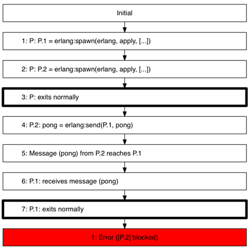{.calibre1}\

Figure 11. 3 Concuerror showing us a blocked process

The numbered lines on the report correspond with the numbers on the
image. It helps also to view the image *and* the report side by side to
piece together the events leading up to the problem. Its like playing
detective and piecing together the clues of a crime scene! This time,
the crime scene is a GenServer program.

Example: GenServer doing sync call to itself in another sync call

OTP behaviors shield us from many potential concurrency bugs, but it is
very possible to shoot yourself in the foot. This next example showcases
an example of how to do exactly that. In other words, don't try this at
home:

Listing 11. 37 The complete implementation of a shady Stack GenServer

`defmodule Stacky do`{.codebcxspfirst}
`  use GenServer`{.codebcxspmiddle}
`  require Integer`{.codebcxspmiddle} ` `{.codebcxspmiddle}
`  @name __MODULE__`{.codebcxspmiddle} ` `{.codebcxspmiddle}
`  def start_link do`{.codebcxspmiddle}
`    GenServer.start_link(__MODULE__, :ok, name: @name)`{.codebcxspmiddle}
`  end`{.codebcxspmiddle} ` `{.codebcxspmiddle}
`  def add(item) do`{.codebcxspmiddle}
`    GenServer.call(@name, {:add, item})`{.codebcxspmiddle}
`  end`{.codebcxspmiddle} ` `{.codebcxspmiddle}
`  def tag(item) do`{.codebcxspmiddle}
`    GenServer.call(@name, {:tag, item})`{.codebcxspmiddle}
`  end`{.codebcxspmiddle} ` `{.codebcxspmiddle}
`  def stop do`{.codebcxspmiddle}
`    GenServer.call(@name, :stop)`{.codebcxspmiddle}
`  end`{.codebcxspmiddle} ` `{.codebcxspmiddle}
`  def init(:ok) do`{.codebcxspmiddle} `    {:ok, []}`{.codebcxspmiddle}
`  end`{.codebcxspmiddle} ` `{.codebcxspmiddle}
`  def handle_call({:add, item}, _from, state) do`{.codebcxspmiddle}
`    new_state = [item|state]`{.codebcxspmiddle}
`    {:reply, {:ok, new_state}, new_state}`{.codebcxspmiddle}
`  end`{.codebcxspmiddle} ` `{.codebcxspmiddle}
`  def handle_call({:tag, item}, _from, state) when Integer.is_even(item) do`{.codebcxspmiddle}
`    add({:even, item})`{.codebcxspmiddle} `  end`{.codebcxspmiddle}
` `{.codebcxspmiddle}
`  def handle_call({:tag, item}, _from, state) when Integer.is_odd(item) do`{.codebcxspmiddle}
`    add({:odd, item})`{.codebcxspmiddle} `  end`{.codebcxspmiddle}
` `{.codebcxspmiddle}
`  def handle_call(:stop, _from, state) do`{.codebcxspmiddle}
`    {:stop, :normal, state}`{.codebcxspmiddle}
`  end`{.codebcxspmiddle} ` `{.codebcxspmiddle}`end`{.codebcxsplast}

Numbers are added into the Stack GenServer. If the number is an even
number, then a tagged tuple `{:even, number}`{.codeintext} is added into
the stack. If it's an odd number, then `{:odd, number}`{.codeintext}
will be pushed into the stack instead. Here's the *intended* behavior
(again, this doesn't work with the current implementation):

`iex(1)> Stacky.start_link`{.codebcxspfirst}
`{:ok, #PID<0.87.0>}`{.codebcxspmiddle} ` `{.codebcxspmiddle}
`iex(2)> Stacky.add(1)`{.codebcxspmiddle} `{:ok, [1]}`{.codebcxspmiddle}
` `{.codebcxspmiddle} `iex(3)> Stacky.add(2)`{.codebcxspmiddle}
`{:ok, [2, 1]}`{.codebcxspmiddle} ` `{.codebcxspmiddle}
`iex(4)> Stacky.add(3)`{.codebcxspmiddle}
`{:ok, [3, 2, 1]}`{.codebcxspmiddle} ` `{.codebcxspmiddle}
`iex(5)> Stacky.tag(4)`{.codebcxspmiddle}
`{:ok, [{:even, 4], 3, 2, 1]}`{.codebcxspmiddle} ` `{.codebcxspmiddle}
`iex(6)> Stacky.tag(5)`{.codebcxspmiddle}`{:ok, [{:odd, 5}, {:even, 4], 3, 2, 1]}`{.codebcxsplast}

Unfortunately, when we try out `Stack.tag/1`{.codeintext}, we get a
nasty error message:

`16:44:26.939 [error] GenServer Stacky terminating`{.codebcxspfirst}
`** (stop) exited in: GenServer.call(Stacky, {:add, {:even, 4}}, 5000)`{.codebcxspmiddle}
`    ** (EXIT) time out`{.codebcxspmiddle}
`    (elixir) lib/gen_server.ex:564: GenServer.call/3`{.codebcxspmiddle}
`    (stdlib) gen_server.erl:629: :gen_server.try_handle_call/4`{.codebcxspmiddle}
`    (stdlib) gen_server.erl:661: :gen_server.handle_msg/5`{.codebcxspmiddle}
`    (stdlib) proc_lib.erl:240: :proc_lib.init_p_do_apply/3`{.codebcxspmiddle}
`Last message: {:tag, 3}`{.codebcxspmiddle}`State: [3, 2, 1]`{.codebcxsplast}

Take a moment and see if you can spot the problem. While you are
thinking, let Concuerror help you out a little. Create
`stacky_test.ex`{.codeintext} in `test/concurrency`{.codeintext}. The
test is simple:

Listing 11. 38 Creating test/0 to test with Concuerror

`Code.require_file "../test_helper.exs", __DIR__`{.codebcxspfirst}
` `{.codebcxspmiddle}
`defmodule Stacky.ConcurrencyTest do`{.codebcxspmiddle}
` `{.codebcxspmiddle} `  def test do`{.codebcxspmiddle}
`    {:ok, _pid} = Stacky.start_link`{.codebcxspmiddle}
`    Stacky.tag(1)`{.codebcxspmiddle}
`    Stacky.stop`{.codebcxspmiddle} `  end`{.codebcxspmiddle}
` `{.codebcxspmiddle}`end`{.codebcxsplast}

Run `mix test`{.codeintext} then run Concuerror and see what happens:

`% concuerror --pa /usr/local/Cellar/elixir/HEAD/lib/elixir/ebin \`{.codebcxspfirst}
`             --pa /usr/local/Cellar/elixir/HEAD/lib/ex_unit/ebin \`{.codebcxspmiddle}
`             --pa _build/test/lib/concuerror_playground/ebin     \`{.codebcxspmiddle}
`             -m Elixir.Stacky.ConcurrencyTest \`{.codebcxspmiddle}`             --graph stacky.dot`{.codebcxsplast}

Here's the output:

`# output truncated ...`{.codebcxspfirst}
`Tip: A process crashed with reason '{timeout, ...}'. This may happen when a call to a gen_server (or similar) does not receive a reply within some standard timeout. Use the '--after_timeout' option to treat after clauses that exceed some threshold as 'impossible'.`{.codebcxspmiddle}
`Tip: An abnormal exit signal was sent to a process. This is probably the worst thing that can happen race-wise, as any other side-effecting operation races with the arrival of the signal. If the test produces too many interleavings consider refactoring your code.`{.codebcxspmiddle}
`Info: You can see pairs of racing instructions (in the report and --graph) with '--show_races true'`{.codebcxspmiddle}
`Error: Stop testing on first error. (Check '-h keep_going').`{.codebcxspmiddle}
` `{.codebcxspmiddle}
`Done! (Exit status: warning)`{.codebcxspmiddle}`  Summary: 1 errors, 1/2 interleavings explored`{.codebcxsplast}

11.2.5[    ]{.calibre13} Reading Concuerror's Outputs

It is essential to read what Concuerror tells you. Part of the reason is
because Concuerror might need your help to for its error detection. The
thing to look out for are the *tips*. Let's start with the first one:

`Tip: A process crashed with reason '{timeout, ...}'. This may happen when a call to a gen_server (or similar) does not receive a reply within some standard timeout. Use the '--after_timeout' option to treat after clauses that exceed some threshold as 'impossible'.`{.codeb}

Concuerror always assumes that the `after`{.codeintext} clause is
*possible* to reach. Therefore, it will search through the interleavings
that will trigger the clause. However, since adding to the stack is a
pretty trivial operation, we can explicitly tell Concuerror to say that
the `after`{.codeintext} clause will never be triggered with the
`--after_timeout N`{.codeintext} flag, where any value higher than
`N`{.codeintext} is taken as `:infinity`{.codeintext}. Let's run
Concuerror again with the `--after_timeout 1000`{.codeintext} flag:

`% concuerror --pa /usr/local/Cellar/elixir/HEAD/lib/elixir/ebin/ \`{.codebcxspfirst}
`             --pa /usr/local/Cellar/elixir/HEAD/lib/ex_unit/ebin \`{.codebcxspmiddle}
`             --pa _build/test/lib/concuerror_playground/ebin     \`{.codebcxspmiddle}
`             -m Elixir.Stacky.ConcurrencyTest \`{.codebcxspmiddle}
`             --graph stacky.dot \`{.codebcxspmiddle}`             --after_timeout 1000`{.codebcxsplast}

Interesting! This time, no more tips are emitted. However, as previously
reported, Concuerror has found an error:

`% concuerror --pa /usr/local/Cellar/elixir/HEAD/lib/elixir/ebin/ \`{.codebcxspfirst}
`             --pa /usr/local/Cellar/elixir/HEAD/lib/ex_unit/ebin \`{.codebcxspmiddle}
`             --pa _build/test/lib/concuerror_playground/ebin     \`{.codebcxspmiddle}
`             -m Elixir.Stacky.ConcurrencyTest \`{.codebcxspmiddle}
`             --graph stacky.dot \`{.codebcxspmiddle}
`             --after_timeout 1000`{.codebcxspmiddle}
` `{.codebcxspmiddle} `# ... output truncated`{.codebcxspmiddle}
`Error: Stop testing on first error. (Check '-h keep_going').`{.codebcxspmiddle}
` `{.codebcxspmiddle} `Done! (Exit status: warning)`{.codebcxspmiddle}
`  Summary: 1 errors, 1/1 interleavings explored`{.codebcxspmiddle}
`# ... output truncated`{.codebcxspmiddle}
`Error: Stop testing on first error. (Check '-h keep_going').`{.codebcxspmiddle}
` `{.codebcxspmiddle}
`Done! (Exit status: warning)`{.codebcxspmiddle}`  Summary: 1 errors, 1/1 interleavings explored`{.codebcxsplast}

The report reveals some details about the error it found:

`Erroneous interleaving 1:`{.codebcxspfirst}
`* Blocked at a 'receive' (when all other processes have exited):`{.codebcxspmiddle}
`    P in gen.erl line 168`{.codebcxspmiddle}`    P.1 in gen.erl line 168`{.codebcxsplast}

`Blocked at a 'receive'`{.codeintext} is basically Concuerror telling
you that a deadlock had occurred. Next, it shows the details of how it
discovered the error:

`Interleaving info:`{.codebcxspfirst}
`   1: P: undefined = erlang:whereis('Elixir.Stacky')`{.codebcxspmiddle}
`    in gen.erl line 298`{.codebcxspmiddle}
`   2: P: [] = erlang:process_info(P, registered_name)`{.codebcxspmiddle}
`    in proc_lib.erl line 678`{.codebcxspmiddle}
`   3: P: P.1 = erlang:spawn_opt({proc_lib,init_p,[P,[],gen,init_it,[gen_server,P,P,{local,'Elixir.Stacky'},'Elixir.Stacky',ok,[]]],[link]})`{.codebcxspmiddle}
`    in erlang.erl line 2673`{.codebcxspmiddle}
`   4: P.1: undefined = erlang:put('$ancestors', [P])`{.codebcxspmiddle}
`    in proc_lib.erl line 234`{.codebcxspmiddle}
`   5: P.1: undefined = erlang:put('$initial_call', {'Elixir.Stacky',init,1})`{.codebcxspmiddle}
`    in proc_lib.erl line 235`{.codebcxspmiddle}
`   6: P.1: true = erlang:register('Elixir.Stacky', P.1)`{.codebcxspmiddle}
`    in gen.erl line 301`{.codebcxspmiddle}
`   7: P.1: {ack,P.1,{ok,P.1}} = P ! {ack,P.1,{ok,P.1}}`{.codebcxspmiddle}
`    in proc_lib.erl line 378`{.codebcxspmiddle}
`   8: Message ({ack,P.1,{ok,P.1}}) from P.1 reaches P`{.codebcxspmiddle}
`   9: P: receives message ({ack,P.1,{ok,P.1}})`{.codebcxspmiddle}
`    in proc_lib.erl line 334`{.codebcxspmiddle}
`  10: P: P.1 = erlang:whereis('Elixir.Stacky')`{.codebcxspmiddle}
`    in gen.erl line 256`{.codebcxspmiddle}
`  11: P: #Ref<0.0.1.188> = erlang:monitor(process, P.1)`{.codebcxspmiddle}
`    in gen.erl line 155`{.codebcxspmiddle}
`  12: P: {'$gen_call',{P,#Ref<0.0.1.188>},{tag,1}} = erlang:send(P.1, {'$gen_call',{P,#Ref<0.0.1.188>},{tag,1}}, [noconnect])`{.codebcxspmiddle}
`    in gen.erl line 166`{.codebcxspmiddle}
`  13: Message ({'$gen_call',{P,#Ref<0.0.1.188>},{tag,1}}) from P reaches P.1`{.codebcxspmiddle}
`  14: P.1: receives message ({'$gen_call',{P,#Ref<0.0.1.188>},{tag,1}})`{.codebcxspmiddle}
`    in gen_server.erl line 382`{.codebcxspmiddle}
`  15: P.1: P.1 = erlang:whereis('Elixir.Stacky')`{.codebcxspmiddle}
`    in gen.erl line 256`{.codebcxspmiddle}
`  16: P.1: #Ref<0.0.1.209> = erlang:monitor(process, P.1)`{.codebcxspmiddle}
`    in gen.erl line 155`{.codebcxspmiddle}
`  17: P.1: {'$gen_call',{P.1,#Ref<0.0.1.209>},{add,{odd,1}}} = erlang:send(P.1, {'$gen_call',{P.1,#Ref<0.0.1.209>},{add,{odd,1}}}, [noconnect])`{.codebcxspmiddle}`    in gen.erl line 166`{.codebcxsplast}

The very last line tells us the line that is causing the deadlock:

`17: P.1: {'$gen_call',{P.1,#Ref<0.0.1.209>},{add,{odd,1}}} = erlang:send(P.1, {'$gen_call',{P.1,#Ref<0.0.1.209>},{add,{odd,1}}}, [noconnect])`{.codebcxspfirst}
`    in gen.erl line 166`{.codebcxsplast}

The problem here is that when two or more synchronous calls are mutually
waiting for each other, you get a deadlock. In this example, the
callback of the synchronous `tag/1`{.codeintext} function calls
`add/1`{.codeintext}, which itself is synchronous. `tag/1`{.codeintext}
will return when `add/1`{.codeintext} returns, but `add/1`{.codeintext}
is waiting for `tag/1`{.codeintext} to return too. Therefore, both
processes are deadlocked.

Since we know where the problem is, let's fix it. The only changes
needed are in `tag/1`{.codeintext} callback functions:

Listing 11. 39 Fixing Stacky by avoiding additional synchronous calls in
synchronous calls

`defmodule Stacky do`{.codebcxspfirst} ` `{.codebcxspmiddle}
`  # ...`{.codebcxspmiddle} ` `{.codebcxspmiddle}
`  def handle_call({:tag, item}, _from, state) when Integer.is_even(item) do`{.codebcxspmiddle}
`    new_state = [{:even, item} |state]`{.codebcxspmiddle}
`    {:reply, {:ok, new_state}, new_state}`{.codebcxspmiddle}
`  end`{.codebcxspmiddle} ` `{.codebcxspmiddle}
`  def handle_call({:tag, item}, _from, state) when Integer.is_odd(item) do`{.codebcxspmiddle}
`    new_state = [{:odd, item} |state]`{.codebcxspmiddle}
`    {:reply, {:ok, new_state}, new_state}`{.codebcxspmiddle}
`  end`{.codebcxspmiddle} ` `{.codebcxspmiddle}
`  # ...`{.codebcxspmiddle}`end`{.codebcxsplast}

Remember to compile and then run Concuerror again:

`# ... output omitted`{.codebcxspfirst}
`Tip: An abnormal exit signal was sent to a process. This is probably the worst thing that can happen race-wise, as any other side-effecting operation races with the arrival of the signal. If the test produces too many interleavings consider refactoring your code.`{.codebcxspmiddle}
`Error: Stop testing on first error. (Check '-h keep_going').`{.codebcxspmiddle}
` `{.codebcxspmiddle}
`Done! (Exit status: warning)`{.codebcxspmiddle}`  Summary: 1 errors, 1/1 interleavings explored`{.codebcxsplast}

Whoops! Concuerror reported another error. What went wrong? Let's crack
open the report again:

`Erroneous interleaving 1:`{.codebcxspfirst}
`* At step 30 process P exited abnormally`{.codebcxspmiddle}
`    Reason:`{.codebcxspmiddle}
`      {normal,{'Elixir.GenServer',call,['Elixir.Stacky',stop,5000]}}`{.codebcxspmiddle}
`    Stacktrace:`{.codebcxspmiddle}
`      [{'Elixir.GenServer',call,3,[{file,"lib/gen_server.ex"},{line,564}]},`{.codebcxspmiddle}
`       {'Elixir.Stacky.ConcurrencyTest',test,0,`{.codebcxspmiddle}`           [{file,"test/concurrency/stacky_test.ex"},{line,8}]}]`{.codebcxsplast}

The tip indicated an abnormal exit. However from the looks of it, our
GenServer exited *normally* and `Stacky.stop/0`{.codeintext} caused
this. Since this is something that Concuerror should not worry about, we
can safely tell it that processes the exit with `:normal`{.codeintext}
as a reason is fine using the `--treat_as_normal normal`{.codeintext}
option:

`% concuerror --pa /usr/local/Cellar/elixir/HEAD/lib/elixir/ebin/ \ `{.codebcxspfirst}
`           --pa /usr/local/Cellar/elixir/HEAD/lib/ex_unit/ebin \`{.codebcxspmiddle}
`           --pa _build/test/lib/concuerror_playground/ebin     \`{.codebcxspmiddle}
`           -m Elixir.Stacky.ConcurrencyTest \`{.codebcxspmiddle}
`           --graph stacky.dot \`{.codebcxspmiddle}
`           --show_races true  \`{.codebcxspmiddle}
`--after_timeout 1000 \`{.codebcxspmiddle}
`--treat_as_normal normal`{.codebcxspmiddle} ` `{.codebcxspmiddle}
`# ... some output omitted`{.codebcxspmiddle}
`Warning: Some abnormal exit reasons were treated as normal (--treat_as_normal).`{.codebcxspmiddle}
`Tip: An abnormal exit signal was sent to a process. This is probably the worst thing that can happen race-wise, as any other side-effecting operation races with the arrival of the signal. If the test produces too many interleavings consider refactoring your code.`{.codebcxspmiddle}
`Done! (Exit status: completed)`{.codebcxspmiddle}`  Summary: 0 errors, 1/1 interleavings explored`{.codebcxsplast}

Hurray! Everything is good now!

Example: Race Condition with Process Registration

Create `lib/spawn_reg.ex`{.codeintext}. This example will demonstrate a
race condition caused by process registration. If you recall, process
registration is basically assigning a process a name. Look at the
implementation below and see if you can spot the race condition.

Listing 11. 40 Full implementation of SpawnReg.

`defmodule SpawnReg do`{.codebcxspfirst} ` `{.codebcxspmiddle}
`  @name __MODULE__`{.codebcxspmiddle} ` `{.codebcxspmiddle}
`  def start do`{.codebcxspmiddle}
`    case Process.whereis(@name) do`{.codebcxspmiddle}
`      nil ->`{.codebcxspmiddle}
`        pid = spawn(fn -> loop end)`{.codebcxspmiddle}
`        Process.register(pid, @name)`{.codebcxspmiddle}
`        :ok`{.codebcxspmiddle} `      _ ->`{.codebcxspmiddle}
`        :already_started`{.codebcxspmiddle} `    end`{.codebcxspmiddle}
`  end`{.codebcxspmiddle} ` `{.codebcxspmiddle}
`  def loop do`{.codebcxspmiddle} `    receive do`{.codebcxspmiddle}
`      :stop ->`{.codebcxspmiddle} `        :ok`{.codebcxspmiddle}
`      _ ->`{.codebcxspmiddle} `        loop`{.codebcxspmiddle}
`    end`{.codebcxspmiddle} `  end`{.codebcxspmiddle}
` `{.codebcxspmiddle}`end`{.codebcxsplast}

This program looks innocent enough. The `start/0`{.codeintext} function
creates a named process, but not before checking if has already been
registered with the name. When spawned, the process terminates on
receiving a `:stop`{.codeintext} message, and continues blissfully
otherwise. Can you figure out what's wrong with this program?

Create the test file in
`test/concurrency_test/spawn_reg_test.ex`{.codeintext}. We spawn the
`SpawnReg`{.codeintext} process within another process, after which we
tell the `SpawnReg`{.codeintext} process to stop:

`Code.require_file "../test_helper.exs", __DIR__`{.codebcxspfirst}
` `{.codebcxspmiddle}
`defmodule SpawnReg.ConcurrencyTest do`{.codebcxspmiddle}
` `{.codebcxspmiddle} `  def test do`{.codebcxspmiddle}
`    spawn(fn -> SpawnReg.start end)`{.codebcxspmiddle}
`    send(SpawnReg, :stop)`{.codebcxspmiddle} `  end`{.codebcxspmiddle}
` `{.codebcxspmiddle}`end`{.codebcxsplast}

Concuerror discovers a problem (Remember to do a `mix test`{.codeintext}
first):

`% concuerror --pa /usr/local/Cellar/elixir/HEAD/lib/elixir/ebin/ \`{.codebcxspfirst}
`           --pa /usr/local/Cellar/elixir/HEAD/lib/ex_unit/ebin \`{.codebcxspmiddle}
`           --pa _build/test/lib/concuerror_playground/ebin     \`{.codebcxspmiddle}
`           -m Elixir.SpawnReg.ConcurrencyTest \`{.codebcxspmiddle}
`           --graph spawn_reg.dot`{.codebcxspmiddle}
` `{.codebcxspmiddle} ` `{.codebcxspmiddle}
`# ... output omitted`{.codebcxspmiddle}
`Info: You can see pairs of racing instructions (in the report and --graph) with '--show_races true'`{.codebcxspmiddle}
`Error: Stop testing on first error. (Check '-h keep_going').`{.codebcxspmiddle}
` `{.codebcxspmiddle}
`Done! (Exit status: warning)`{.codebcxspmiddle}`  Summary: 1 errors, 1/2 interleavings explored`{.codebcxsplast}

It also tells us about using the `--show_races true`{.codeintext} to
reveal pairs of racing instructions. Let's do that:

`% concuerror --pa /usr/local/Cellar/elixir/HEAD/lib/elixir/ebin/ \`{.codebcxspfirst}
`           --pa /usr/local/Cellar/elixir/HEAD/lib/ex_unit/ebin \`{.codebcxspmiddle}
`           --pa _build/test/lib/concuerror_playground/ebin     \`{.codebcxspmiddle}
`           -m Elixir.SpawnReg.ConcurrencyTest \`{.codebcxspmiddle}
`           --graph spawn_reg.dot \`{.codebcxspmiddle}`           --show_races true`{.codebcxsplast}

Let's examine the report for the erroneous interleaving:

`Erroneous interleaving 1:`{.codebcxspfirst}
`* At step 3 process P exited abnormally`{.codebcxspmiddle}
`    Reason:`{.codebcxspmiddle}
`      {badarg,[{erlang,send,`{.codebcxspmiddle}
`                       ['Elixir.SpawnReg',stop],`{.codebcxspmiddle}
`                       [9,{file,"test/concurrency/spawn_reg_test.ex"}]}]}`{.codebcxspmiddle}
`    Stacktrace:`{.codebcxspmiddle}
`      [{erlang,send,`{.codebcxspmiddle}
`               ['Elixir.SpawnReg',stop],`{.codebcxspmiddle}
`               [9,{file,"test/concurrency/spawn_reg_test.ex"}]}]`{.codebcxspmiddle}
`* Blocked at a 'receive' (when all other processes have exited):`{.codebcxspmiddle}`    P.1.1 in spawn_reg.ex line 17`{.codebcxsplast}

It tells us that at the third step, the `SpawnReg.stop/0`{.codeintext}
call fails with a `:badarg`{.codeintext}. The `P.1.1`{.codeintext}
process is also deadlocked. In other words, it never received a message
that it was waiting for. Which is the `P.1.1`{.codeintext} process? This
is the first process spawned by the first process that was spawned by
the parent process. In less words:

`spawn(fn -> SpawnReg.start end) `{.codeb}

Another reason why Concuerror might say that is because we have failed
to "tear down" our processes. In general for Concuerror tests, it is
good practice to make our processes exit once we are done with them,
such as sending `:stop`{.codeintext} messages. If we inspect the
interleaving info, we get a get a better sense of the problem:

`Interleaving info:`{.codebcxspfirst}
`   1: P: P.1 = erlang:spawn(erlang, apply, [#Fun<'Elixir.SpawnReg.ConcurrencyTest'.'-test/0-fun-0-'.0>,[]])`{.codebcxspmiddle}
`    in erlang.erl line 2495`{.codebcxspmiddle}
`   2: P: Exception badarg raised by: erlang:send('Elixir.SpawnReg', stop)`{.codebcxspmiddle}
`    in spawn_reg_test.ex line 9`{.codebcxspmiddle}
`   3: P: exits abnormally ({badarg,[{erlang,send,['Elixir.SpawnReg',stop],[9,{file,[116,101,115,116,47,99,111,110|...]}]}]})`{.codebcxspmiddle}
`   4: P.1: undefined = erlang:whereis('Elixir.SpawnReg')`{.codebcxspmiddle}
`    in process.ex line 359`{.codebcxspmiddle}
`   5: P.1: P.1.1 = erlang:spawn(erlang, apply, [#Fun<'Elixir.SpawnReg'.'-start/0-fun-0-'.0>,[]])`{.codebcxspmiddle}
`    in erlang.erl line 2495`{.codebcxspmiddle}
`   6: P.1: true = erlang:register('Elixir.SpawnReg', P.1.1)`{.codebcxspmiddle}
`    in process.ex line 338`{.codebcxspmiddle}
`   7: P.1: exits normally`{.codebcxspmiddle}
`--------------------------------------------------------------------------------`{.codebcxspmiddle}
` `{.codebcxspmiddle} `Pairs of racing instructions:`{.codebcxspmiddle}
`*    2: P: Exception badarg raised by: erlang:send('Elixir.SpawnReg', stop)`{.codebcxspmiddle}`     6: P.1: true = erlang:register('Elixir.SpawnReg', P.1.1)`{.codebcxsplast}

Concuerror has helpfully discovered a race condition! In fact, it has
even pointed out the pair of racing instructions that was the cause! You
might find the image more helpful. You will also notice that the image
contains an error pointing to the pair racing instructions. Super handy!

Here's the graphic version:

{.calibre1}\

Figure 11.4 Concuerror showing a race condition

The race condition here happens because the process might not complete
setting name up yet. Therefore, `send/2`{.codeintext} might fail if
`:name`{.codeintext} is not registered yet. Concuerror has identified
that this is a *possible* interleaving. If you tried this out in the
console, you very well might have not even encountered the error.

11.3[      ]{.calibre14} Summary of Concuerror

We have just seen some of the concurrency bugs that Concuerror can pick
out. Many of these bugs are not obvious and sometimes very surprising.
It is nearly impossible to use conventional unit-testing techniques and
expose the concurrency bugs that Concuerror is able to pick up
relatively easily. Furthermore, unit-testing tools are not able to
produce a process trace of the inter-leavings that led up to the bug,
whether is a process deadlock, crash or a race-condition. Concuerror is
a tool I will keep close by when I develop my Elixir programs.

11.4[      ]{.calibre14} Resources

Both tools were borne out of research; therefore, you will most likely
see papers rather than written books about tools such as QuickCheck and
Concuerror. You are witnessing a humble attempt to contribute to the
latter. Fortunately in recent years, the creators of these two tools
have been giving conference talks and workshops that are freely
available online. Here's a list of resources that you will find useful
if you want to dive deeper into QuickCheck and Concuerror:

[·[     ]{.calibre16}]{.calibre12} Software Testing with QuickCheck
(paper by John Hughes)

[·[     ]{.calibre16}]{.calibre12} Testing Erlang Data Types with Quviq
QuickCheck (paper by Thomas Arts, Laura M. Castro and John Hughes)

[·[     ]{.calibre16}]{.calibre12} Jesper Louis Anderson has a series of
excellent posts
[[[[\[5\]]{.calibre72}]{.msofootnotereference}]{.msofootnotereference}](#ch11.html#uGplayAVlyLaX4IyOPPBFu5){#ch11.html#uwnx7uBuXSXwJ6LEmLvJuxF
.pcalibre1 .pcalibre2}where he develops a QuickCheck model to test the
new implementation of Map in Erlang 18.0.

[·[     ]{.calibre16}]{.calibre12} Test-Driven Development of Concurrent
Programs using Concuerror (paper by Alkis Gotovos, Maria Christakis and
Konstantinos Sangonas)

11.5[      ]{.calibre14} Summary

In this chapter, we have seen two power tools. One is capable of
generating as many test cases as you want, and the other is capable of
seeking hard-to-find concurrency bugs and potentially reveal insights
into our code. To recap, we have learnt:

[·[     ]{.calibre16}]{.calibre12} How to use QuickCheck and Concuerror
in Elixir (even though they have been originally written for Erlang
programs in mind)

[·[     ]{.calibre16}]{.calibre12} How to generate test cases with
QuickCheck by specifying properties that are more general than specific
unit tests

[·[     ]{.calibre16}]{.calibre12} Learn a few pointers to come up with
own our properties

[·[     ]{.calibre16}]{.calibre12} Design custom generators to produce
exactly the kind of data we need

[·[     ]{.calibre16}]{.calibre12} Use Concuerror to detect various
concurrency errors such as communication deadlocks, process deadlocks
and race conditions

[·[     ]{.calibre16}]{.calibre12} Seen a few examples of how these
concurrency bugs can occur

We haven't explored every feature there is, and some advanced but very
useful features have been left out. Thank goodness, otherwise I would
never be done with the book! However, this chapter should give you the
fundamentals and tools needed to conduct your own exploration.
:::

::: calibre2
::: {#ch11.html#ftn1 .calibre2}
[[**[[**[\[1\]]{.calibre75}**]{.msofootnotereference}]{.calibre28}**]{.msofootnotereference}](#ch11.html#uEandRAdHEMbKa7scWKaW7C){#ch11.html#u83UNuzRV57fRwEzhWNgBm6
.pcalibre1 .pcalibre2} [http://krestenkrab.github.io/triq]{.calibre76}
:::

::: {#ch11.html#ftn2 .calibre2}
[[**[[**[\[2\]]{.calibre75}**]{.msofootnotereference}]{.calibre28}**]{.msofootnotereference}](#ch11.html#uY3Qeh8W6N7zl8IWhUktnSA){#ch11.html#uzOPdfenDvyvCoAdHdYLuV8
.pcalibre1 .pcalibre2} [https://github.com/manopapad/proper]{.calibre76}
:::

::: {#ch11.html#ftn3 .calibre2}
[[**[[**[\[3\]]{.calibre75}**]{.msofootnotereference}]{.calibre28}**]{.msofootnotereference}](#ch11.html#ud7Cx2vjA84I2jInhUdGBw8){#ch11.html#utP7ZYyoYEcEE26GeQaeT75
.pcalibre1 .pcalibre2} [http://www.quviq.com/downloads/]{.calibre76}
:::

::: {#ch11.html#ftn4 .calibre2}
[[**[[**[\[4\]]{.calibre75}**]{.msofootnotereference}]{.calibre28}**]{.msofootnotereference}](#ch11.html#u635lIFw7sxq7be8l3pcDE6){#ch11.html#uDAzWNpJXjoRDvP35LqJIwB
.pcalibre1 .pcalibre2} [This is an excellent word to impress your
friends and annoy your co-workers.]{.calibre76}
:::

::: {#ch11.html#ftn5 .calibre2}
[[**[[**[\[5\]]{.calibre75}**]{.msofootnotereference}]{.calibre28}**]{.msofootnotereference}](#ch11.html#uwnx7uBuXSXwJ6LEmLvJuxF){#ch11.html#uGplayAVlyLaX4IyOPPBFu5
.pcalibre1 .pcalibre2} [https://medium.com/@jlouis666]{.calibre76}
:::
:::

[]{#App_A.html}

::: wordsection
# Appendix A Installing Erlang and Elixir {#App_A.html#heading_id_2 .cochapternumber}

Welcome to Chapter 0, or what publishers like to call, Appendix *A*. We
will cover how to get Elixir set up on your system as fast as possible.
I will cover Mac OS X, some Linux distributions and MS Windows. It is
listed in order of difficulty.

A.1[         ]{.calibre14} Getting Erlang

Before we install Elixir, we must Erlang. At this time of writing, the
minimum version of Erlang is 18.0. Elixir has so far been very good at
keeping up with new Erlang releases.

Just as there are multiple ways of getting Elixir, the same goes to
Erlang. If you can get it via a package manager, do that. Otherwise, the
least problematic way (by far!) is to head over to the Erlang Solutions
site[[[[\[1\]]{.calibre18}]{.msofootnotereference}]{.msofootnotereference}](#App_A.html#uGRexWD7e8DL2GrOrcFocH8){#App_A.html#ulZ3weFoR2csTrcsjKXzrfG
.pcalibre1 .pcalibre2} and download a copy. They host Erlang packages
for several Linux distributions (Ubuntu, CentOS, Debian, Fedora and even
one of the Raspberry Pi), Mac OS X and Windows.

A.2[         ]{.calibre14} Method 1: Package Managers / Pre-built
installers.

If you operating system comes with it, you should always opt to install
Elixir via a package manager. That would usually get you up to speed in
the shortest time possible. The following sections outline the
installation steps for some of the more populate operating systems. If
you system is not listed, don't fret. There are usually instructions
floating around cyberspace.

A.2.1[      ]{.calibre13} Mac OS X via Homebrew and Macports

Chances are you would either have the Homebrew or Macports package
manager installed. If so, then you are only one step away from a new and
shiny Elixir (and Erlang) installation. For Homebrew:

` % brew update && brew install elixir  `{.codeb}

For Macports, just do the usual `port install`{.codeintext}:

` % sudo port install elixir `{.codeb}

Notice that we are not specifying any version numbers. Installing via
package managers usually installs the latest *stable* versions. We will
cover how to build and install Elixir from source in the later sections.

A.2.2[      ]{.calibre13} Linux (Ubuntu and Fedora)

Since there are a billion Linux distributions out there, I will limit it
to the more popular ones, namely Ubuntu and Fedora. If so, installing
Elixir would be a one-liner affair for you.

Fedora 17 to 22 (and newer)

If you are on Fedora 17 and newer (and older than Fedora 21):

` % yum install elixir `{.codeb}

If you are on Fedora 22 and above:

` % dnf install elixir  `{.codeb}

Ubuntu

Ubuntu-flavored distributions need to do slightly more work. You first
need to add the Erlang solutions repository:

` % wget https://packages.erlang-solutions.com/erlang-solutions_1.0_all.deb && sudo dpkg -i erlang-solutions_1.0_all.deb `{.codeb}

Next, as all Ubuntu users would already know:

` % sudo apt-get update `{.codeb}

Next, we need to get Erlang (and a bunch of other Erlang related
applications):

` % sudo apt-get install esl-erlang `{.codeb}

Finally, we can grab Elixir:

` % sudo apt-get install elixir `{.codeb}

A.2.3[      ]{.calibre13} MS Windows

Getting Elixir on Windows couldn't be easier. All you need to do is to
install the Elixir web
installer[[[[\[2\]]{.calibre18}]{.msofootnotereference}]{.msofootnotereference}](#App_A.html#unSboXWaDHFFHWhG44f39C3){#App_A.html#uVJT5MoKQk8Ut7nrzybS9dC
.pcalibre1 .pcalibre2}, and you should be set.

A.3[         ]{.calibre14} Method 2: Compiling from scratch (Linux/Unix
only)

So, you are feeling lucky eh? Sometimes there's just that awesome
feature that you cannot wait to play with. There are times where you
want to experiment with Elixir directly and maybe fix a bug or implement
a new feature. If so, then this is the route you want to take.

Happily, the only thing Elixir has a dependency on is Erlang. If you
have installed Erlang properly, compiling Elixir from source is usually
not very dramatic.

In the section, I assume that you are using a Unix/Linux system and have
all the necessary build tools installed, such as `make`{.codeintext}.
First, you need to clone Elixir from the official repository:

` % git clone https://github.com/elixir-lang/elixir.git `{.codeb}

Next, change into the newly created directory:

` % cd elixir `{.codeb}

Finally, you can start building the sources:

` % make clean test `{.codeb}

It is pretty fascinating to see all the messages go by -- it never gets
old. Once done, there's an additional step: You need to add the
`elixir`{.codeintext} directory to your `PATH`{.codeintext}, so that you
can access commands like `elixir`{.codeintext} and `iex`{.codeintext}.

Depending on your shell, you can append the `elixir`{.codeintext}
directory to your `PATH`{.codeintext}. For example, if I were to use
`zsh`{.codeintext}, then I would locate the `~/.zshrc`{.codeintext} and
append the directory:

` export PATH= ... # other PATH goes there export PATH=$PATH:"~/elixir" `{.codeb}

Here, I am specifying that the one of the `PATH`{.codeintext}s is the
`elixir`{.codeintext} directory is located directly under my home
directory.

A.4[         ]{.calibre14} Verifying your Elixir installation

The last thing to do is checking that Elixir has been installed
correctly:

` % elixir -v `{.codeb}

If all goes well, you will be greeted with the Erlang/OTP version and
the Elixir version:

`Erlang/OTP 18 [erts-7.2] [source] [64-bit] [smp:4:4] [async-threads:10] [hipe] [kernel-poll:false] [dtrace]  Elixir 1.3.2 `{.codeb}

What are you waiting for? On to chapter 1!
:::

::: calibre2
::: {#App_A.html#ftn1 .calibre2}
[[**[[**[\[1\]]{.calibre75}**]{.msofootnotereference}]{.calibre28}**]{.msofootnotereference}](#App_A.html#ulZ3weFoR2csTrcsjKXzrfG){#App_A.html#uGRexWD7e8DL2GrOrcFocH8
.pcalibre1 .pcalibre2}
[https://www.erlang-solutions.com/resources/download.html]{.calibre76}
:::

::: {#App_A.html#ftn2 .calibre2}
[[**[[**[\[2\]]{.calibre75}**]{.msofootnotereference}]{.calibre28}**]{.msofootnotereference}](#App_A.html#uVJT5MoKQk8Ut7nrzybS9dC){#App_A.html#unSboXWaDHFFHWhG44f39C3
.pcalibre1 .pcalibre2}
[https://repo.hex.pm/elixir-websetup.exe]{.calibre76}
:::
:::
