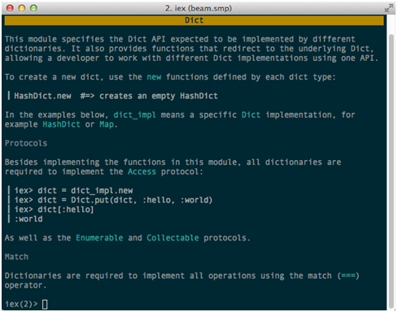
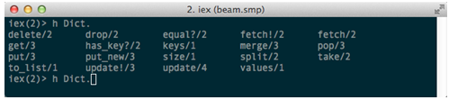
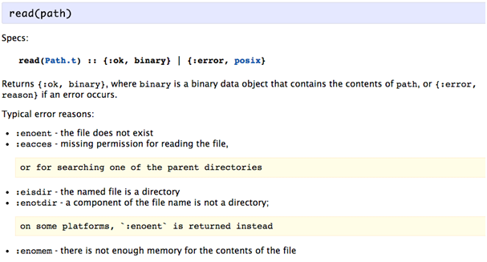
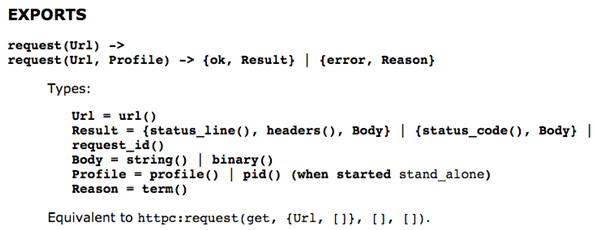

# 2. 快速入门

本章内容包括：

- 第一个Elixir程序
- 使用交互式Elixir（iex）
- 数据类型
- 模式匹配
- 列表与递归
- 模块与函数
- 管道（|>）运算符
- Erlang互操作性

我认为，与其深入每个语言特性，不如通过一系列示例来呈现它们。对于对Java或Ruby程序员来说可能陌生的概念，我会进行更多的阐述。对于某些概念，您可能可以从您已知的任何语言中找到相似之处。这些示例会逐渐变得更有趣，几乎展示了理解本书中Elixir代码所需的所有内容。

## 2.1 设置环境

Elixir在所有主流编辑器上都得到了很好的支持，比如Vim、Emacs、Spacemacs、Atom、IntelliJ和Visual Studio，仅举几例。专门为Emacs/Spacemacs与Elixir集成开发的Alchemist[[1]](#uRD9OOhUuHjWvTh2WNVJTqC)，提供了极佳的开发体验。它具有诸如文档查找、智能代码补全、与`iex`和`mix`的集成等众多有用的功能。与其他编辑器集成相比，它是支持最广泛、功能最丰富的。

准备好你的终端和编辑器，因为快速入门之旅现在就开始。

## 2.2 第一步

让我们从简单的开始。由于我曾经的殖民统治者（我来自新加坡），我对英尺、英寸及其亲戚们的度量单位不太熟悉。我们将编写一个长度转换器来解决这个问题。

以下是我们如何在Elixir中定义长度转换器的方法。输入以下内容到你最喜欢的文本编辑器中，并将文件保存为 `length_converter.ex`。

**清单 2.1 Elixir中的长度转换程序。保存为 length_converter.ex。**

```elixir
defmodule MeterToFootConverter do
  def convert(m) do
    m * 3.28084
  end
end
```

`defmodule` 定义一个新模块（即 `MeterToFootConverter`），而 `def` 定义一个新函数（即 `convert`）。

### 2.2.1 在交互式Elixir中运行Elixir程序

`iex`，或简称交互式Elixir，相当于Ruby中的 `irb` 或NodeJS中的 `node`。在你的终端中，使用文件名作为参数启动 `iex`。

**清单 2.2 运行长度转换程序（交互式Elixir）**

```
% iex length_converter.ex

Interactive Elixir (0.13.0) - 按 Ctrl+C 退出（输入 h() ENTER 获取帮助）iex(1)>
```

世界上最高的男人的记录是2.72米。那是多少英尺？让我们找出答案：

```
iex> MeterToFeetConverter.convert(2.72)
```

结果是

```
8.9238848
```

### 2.2.2 停止Elixir程序

有几种方法可以停止Elixir程序，或者如果你想退出iex。第一种方法是输入 `Ctrl + C`。第一次这样做时，你会看到：

**清单 2.3 在iex中停止运行的Elixir程序（交互式Elixir）**

```bash
BREAK: (a)bort (c)ontinue (p)roc info (i)nfo (l)oaded
(v)ersion (k)ill (D)b-tables (d)istribution
```

你可以选择 `a)` 输入 `a` 来中止，或者 `b)` 再次输入 `Ctrl + C`。另一种选择是使用 `System.halt`，虽然我个人更喜欢 `Ctrl + C`。

### 2.2.3 获取帮助

由于 `iex` 是与Elixir交互的主要工具，因此学习更多关于它的信息是很有价值的。特别是，`iex` 有一个非常棒的内置文档系统。再次启动 `iex`。假设你想了解 `Dict` 模块。你可以在 `iex` 中输入 `h Dict`，输出将类似于图2.3。

  

图 2.3 在iex中显示的Dict模块文档。

`Dict` 有哪些可用的函数？输入 `Dict.`（重要的是后面的点！），然后按你的 `<Tab>` 键。你将看到 `Dict` 模块中可用的函数列表，如图2.4所示。

  

图 2.4 `Dict` 模块中可用的函数列表。

现在，假设你想了解更多关于 `put/3` 函数。我稍后会解释 `/3` 是什么意思。现在，它只意味着这个版本的 `put` 接受3个参数。在 `iex` 中，输入 `h Dict.put/3`。输出看起来像图2.5：

  

图 2.5 `Dict.put/3` 的文档。

相当整洁，对吧？更好的是，文档还有美观的语法高亮。

## 2.3 数据类型

在本书中，我们将使用以下常见数据类型：

- 模块（Modules）
- 函数（Functions）
- 数字（Numbers）
- 字符串（Strings）
- 原子（Atoms）
- 元组（Tuples）
- 映射（Maps）

### 2.3.1 模块、函数和函数子句

模块是Elixir用于将函数组合在一起的方式。模块的例子包括`List`、`String`，当然还有`MeterToFootConverter`。使用`defmodule`创建模块。同样，使用`def`创建函数。

#### 模块

让我们编写另一个函数，将米转换为*英寸*。根据我们当前的实现，我们需要做一些更改。首先，我们的模块名*太具体*了。让我们将其更改为更通用的名称。这是我们的`length_converter.ex`：

```elixir
defmodule MeterToLengthConverter do
# ...
end
```

更有趣的是，我们如何添加一个将米转换为英寸的函数？这是一种*可能的*方法：

##### 列表 2.4 defmodules可以嵌套

```elixir
defmodule MeterToLengthConverter do
  defmodule Feet do
    def convert(m) do
      m * 3.28084
    end
  end

  defmodule Inch do
    def convert(m) do
      m * 39.3701
    end
  end
end
```

现在，您可以计算最高的男人的身高（以英寸为单位）：

##### 列表 2.5 使用点表示法（交互式Elixir）

```elixir
iex> MeterToLengthConverter.Inch.convert(2.72)
```

返回

`107.08667200000001`

这个例子说明了模块可以嵌套。这里，模块`Feet`和`Inch`嵌套在`MeterToLengthConverter`内。要访问嵌套模块中的函数，使用*点表示法*。通常，要在Elixir中调用函数，使用以下格式：

```elixir
Module.function(arg1, arg2, ...)
```

在邮件列表中，这有时被称为“**MFA**”。它代表**模块（Module）**、**函数（Function）**和**参数（Arguments）**。记住这种格式，因为您将在本书中再次遇到它。

您还可以像这样扁平化模块层次结构：

##### 列表 2.6 扁平化模块层次结构（交互式Elixir）

```elixir
defmodule MeterToLengthConverter.Feet do #1
  def convert(m) do
    m * 3.28084
  end
end

defmodule MeterToLengthConverter.Inch do #1
  def convert(m) do
    m * 39.3701
  end
end
```

#1 您可以使用点表示法来指定嵌套层次结构

您将以与列表 2.5 完全相同的方式调用该函数。

#### 函数和函数子句

编写长度转换器的更习惯的方式是使用函数子句。这是我们长度转换器的修订版本：

```elixir
defmodule MeterToLengthConverter do
  def convert(:feet, m) do
    m * 3.28084
  end

  def convert(:inch, m) do
    m * 39.3701
  end
end
```

定义一个函数相当直接。大多数函数都是这样写的：

```elixir
def convert(:feet, m) do
  m * 3.28084
end
```

单行函数这样写：

```elixir
def convert(:feet, m), do: m * 3.28084
```

既然我们提到了，让我们再添加一个将米转换为*码*的函数，这次使用单行变体：

```elixir
defmodule MeterToLengthConverter do
  def convert(:fe

et, m), do: m * 3.28084
  def convert(:inch, m), do: m * 39.3701
  def convert(:yard, m), do: m * 1.09361
end
```

函数按其*元数*（它接受的参数数量）来引用。因此，我们将上述函数称为`convert/2`。`convert/2`是*命名函数*的一个例子。Elixir还有*匿名函数*的概念。这是一个匿名函数的常见例子：

##### 列表 2.7：第二个参数是一个匿名函数（交互式Elixir）

```elixir
iex> Enum.map [1, 2, 3], fn x -> x*x end
```

给出

`[1, 4, 9].`

我们可以定义具有相同名称的多个函数，就像我们的示例中那样。需要注意的重要一点是它们*必须*被分组在一起。因此，这是不好的形式：

##### 列表 2.8：始终将相似的函数子句分组在一起。

```elixir
defmodule MeterToLengthConverter do
  def convert(:feet, m), do: m * 3.28084
  def convert(:inch, m), do: m * 39.3701
  def i_should_not_be_here, do: IO.puts "Oops" #1
  def convert(:yard, m), do: m * 1.09361
end
```

#1 不要这样做！

Elixir会相应地抱怨：
##### 列表 2.10：当函数子句未分组在一起时，Elixir会抱怨。

```elixir
% iex length_converter.ex
length_converter.ex:5: warning: clauses for the same def should be grouped together, def convert/2 was previously defined
```

另一个重要的事情：顺序很重要。每个函数子句都是自上而下匹配的。这意味着一旦Elixir找到一个兼容的函数子句匹配，它就会停止搜索并执行该函数。对于我们当前的长度转换器，移动函数子句不会影响任何事情。当我们稍后探讨递归时，您将开始理解函数子句顺序为何重要。

### 2.3.2 数字（Numbers）

在 Elixir 中，数字的运作方式和传统编程语言中的类似。

**清单 2.13：操作整数、十六进制数和浮点数（交互式 Elixir）**

`iex> 1 + 0x2F / 3.0`
`16.666666666666664`

**清单 2.14：除法和余数函数（交互式 Elixir）**

`iex> div(10,3)`
`3`

`iex> rem(10,3)`
`1`

### 2.3.3 字符串（Strings）

Elixir 中的字符串有两种形态。表面上看，字符串看起来很标准。这里有一个展示字符串插值的例子：

**清单 2.15：Elixir 支持字符串插值（交互式 Elixir）**

`iex(1)> "字符串是 #{:great}！"`
将给出：

`"字符串是 great！"`
我们还可以对字符串执行各种操作：

**清单 2.16：对字符串的操作（交互式 Elixir）**

`iex(2)> "字符串是 #{:great}！" |> String.upcase |> String.reverse`
这将返回：

`"！TAERG 是 字符串"`
字符串是二进制数据（Binaries）

如何测试一个字符串？没有 `is_string/1` 函数可用。这是因为在 Elixir 中，字符串是一种**二进制数据**。二进制数据只是一个字节序列。

清单 2.17：字符串是二进制数据（交互式 Elixir）

`iex(3)> "字符串是二进制数据" |> is_binary`
返回
`true。`

展示字符串的二进制表示的一种方式是使用二进制串联运算符 `<>` 来附加一个空字节，`<<0>>`：

清单 2.18：展示字符串的二进制表示（交互式 Elixir）

`iex(4)> "ohai" <> <<0>>`
返回
`<<111, 104, 97, 105, 0>>。`

每个数字代表一个字符：

`iex(5)> ?o`
`111`

`iex(6)> ?h`
`104`

`iex(7)> ?a`
`97`

`iex(8)> ?i`
`105`
为了进一步确信二进制表示与原字符串等价：

`iex(44)> IO.puts <<111, 104, 97, 105>>`
将给你原始字符串：
`ohai`

字符串不是字符列表（Char lists）

顾名思义，字符列表是字符的列表。它与字符串是完全不同的数据类型，这可能会有些混淆。虽然字符串总是用双引号括起来，字符列表则用单引号括起来。

**清单 2.19：字符串不是字符列表（交互式 Elixir）**

`iex(9)> 'ohai' == "ohai"`
将给出 false。你通常不会使用字符列表，至少在 Elixir 中不会。然而，当与某些 Erlang 库交互时，你可能需要这样做。例如，在后面的示例中，Erlang 的 http 客户端（httpc）接受字符列表作为 URL：

`:httpc.request 'http://www.elixir-lang.org'`
如果我们传入字符串（二进制数据）会发生什么呢？试试看：

**清单 2.20：httpc.request/1 期望 URL 类型为字符列表（交互式 Elixir）**

`iex(51)> :httpc.request "http://www.elixir-lang.org"`
`** (ArgumentError) 参数错误`
`:erlang.tl("http://www.elixir-lang.org")`
`(inets) inets_regexp.erl:80: :inets_regexp.first_match/3`
`(inets) inets_regexp.erl:68: :inets_regexp.first_match/2`
`(inets) http_uri.erl:186: :http_uri.split_uri/5`
`(inets) http_uri.erl:136: :http_uri.parse_scheme/2`
`(inets) http_uri.er

l:88: :http_uri.parse/2`
`(inets) httpc.erl:162: :httpc.request/5`
我们将在本章后面进一步讨论调用 Erlang 库的内容，但当你处理某些 Erlang 库时，这是你需要记在脑后的事情。


### 2.3.4 原子 (Atoms)

原子在Elixir中作为常量存在，有点类似于Ruby中的符号。原子总是以冒号开始。创建原子有两种不同的方式：`:hello_atom`和`:”Hello Atom”`都是有效的原子。需要注意的是，原子和字符串并不相同，因为原子和字符串是完全不同的数据类型。

**清单 2.22: 原子不是字符串！(交互式Elixir)**

`iex> :hello_atom == "hello_atom"`
`false`
单独来看，原子并不是非常有趣。然而，当我们将原子放入*元组*中，并在*模式匹配*的上下文中使用它们时，你就会开始理解原子的作用以及Elixir如何利用原子编写声明性代码。我们将在后面几节中讨论模式匹配。现在，让我们转向元组。

### 2.3.5 元组 (Tuples)

一个元组可以包含不同类型的数据。例如，一个HTTP客户端可能以元组的形式返回一个成功的请求：

`{200, “http://www.elixir-lang.org”}`
一个失败的请求可能看起来像这样：

`{404, “http://www.php-is-awesome.org”}`
元组使用基于零的访问方式，就像在大多数编程语言中访问数组元素一样。因此，如果你想要获取请求结果的URL，你需要传入
`1`
给
`elem/2`：

**清单 2.24: 访问元组中的第二个元素 (交互式Elixir)**

`iex> elem({404, “http://www.php-is-awesome.org”}, 1)`
这将返回
`http://www.php-is-awesome.org.`

你可以使用`put_elem/3`来更新一个元组：

清单 2.25: 更新一个元组 (交互式Elixir)

`iex> put_elem({404, “http://www.php-is-awesome.org”}, 0, 503)`
返回

`{503, "http://www.php-is-awesome.org"}`

### 2.3.6 映射 (Maps)

映射本质上是键值对，类似于哈希或字典，具体取决于你所使用的语言。所有映射操作都通过`Map`模块暴露。

使用映射相当直接，有一个*小*注意点。看看你是否能在例子中发现它。让我们从一个空映射开始：

**清单 2.26: 创建一个新的映射**

`iex> programmers = Map.new`
`%{}`
让我们向映射中添加一些聪明的人：

**清单 2.27: 向映射中添加元素**
```elixir
iex> programmers = Map.put(programmers, :joe, "Erlang")
%{joe: "Erlang"}
iex> programmers = Map.put(programmers, :matz, "Ruby")
%{joe: "Erlang", matz: "Ruby"}
iex> programmers = Map.put(programmers, :rich, "Clojure")
%{joe: "Erlang", matz: "Ruby", rich: "Clojure"}
```


一个非常重要的旁白：不可变性 (Immutability)

注意到`programmers`是`Map.put/3`的一个参数，并且*重新绑定*到`programmers`上。为什么会这样？

```elixir
iex> Map.put(programmers, :rasmus, "PHP")
%{joe: "Erlang", matz: "Ruby", rasmus: "PHP", rich: "Clojure"}
```
返回值包含了新的条目。让我们检查一下`programmers`的内容：

```elixir
iex> programmers
%{joe: "Erlang", matz: "Ruby", rich: "Clojure"}
```

这个属性被称为*不可变性*。

Elixir中的**所有**数据结构都是不可变的，这意味着你无法对其进行任何修改。你所做的任何修改*总是*保留原始结构*不变*。相反，返回一个修改过的副本。因此，为了捕获结果，你可以将其重新绑定到同一个变量名，或者将值绑定到另一个变量上。

## 2.4 守卫 (Guards)

让我们再次看看 `length_converter.ex`。假设我想确保参数始终是数字。我们可以通过添加守卫子句来修改程序：

清单 2.29: 为额外检查添加守卫。

```elixir
defmodule MeterToLengthConverter do
  def convert(:feet, m) when is_number(m), do: m * 3.28084 #1
  def convert(:inch, m) when is_number(m), do: m * 39.3701 #1
  def convert(:yard, m) when is_number(m), do: m * 1.09361 #1
end
```
#1 在函数子句中添加守卫。

所以现在，如果你尝试像 `MeterToLengthConverter.convert(:feet, "smelly")` 这样有趣的事情，没有任何函数子句会匹配。实际上，Elixir会抛出一个 `FunctionClauseError`：

**清单 2.30: 尝试执行上述代码会导致 FunctionClauseError**

```elixir
iex(1)> MeterToLengthConverter.convert (:feet, “smelly”)
(FunctionClauseError) no function clause matching in convert/2
```

负长度没有意义。让我们确保参数是非负的。我们可以通过添加另一个守卫表达式来实现这一点：

**清单 2.31: 我们可以在守卫中包含简单表达式。**

```elixir
defmodule MeterToLengthConverter do
  def convert(:feet, m) when is_number(m) and m >= 0, do: m * 3.28084 #1
  def convert(:inch, m) when is_number(m) and m >= 0, do: m * 39.3701 #1
  def convert(:yard, m) when is_number(m) and m >= 0, do: m * 1.09361 #1
end
```
#1 检查 m 是否为非负数

除了 `is_number/1`，当你需要区分不同的数据类型时，还有其他类似的函数会派上用场。要生成这个列表，启动 `iex`，然后输入 `is_` 后跟 `<Tab>` 键。

清单 2.32: 在 iex 中使用自动补全来发现函数名称（交互式 Elixir）

```elixir
iex(1)> is_
is_atom/1         is_binary/1       is_bitstring/1    is_boolean/1
is_float/1        is_function/1     is_function/2     is_integer/1
is_list/1         is_map/1          is_nil/1          is_number/1
is_pid/1          is_port/1         is_reference/1    is_tuple/1
```
`is_*` 函数应该是非常直观的，除了 `is_port/1` 和 `is_reference/1`。我们在这本书中不会使用端口。稍后我们会遇到引用，你将看到它们在为消息赋予唯一身份时是如何有用的。

守卫子句在消除条件语句方面特别有用，正如你所猜测的，它们在确保你的参数是正确类型时也很有用。

2.5 模式匹配

模式匹配是函数式编程语言中最强大的功能之一，而Elixir也不例外。事实上，模式匹配是我最喜欢的Elixir功能之一。一旦你看到模式匹配能做什么，你就会开始渴望在不支持它们的语言中使用它们。

Elixir使用等号(`=`)来执行模式匹配。与大多数语言不同，Elixir不仅使用`=`操作符进行变量赋值。事实上，`=`被称为*匹配操作符*。从现在开始，当你看到一个`=`时，不要想它是等于，而是匹配。我们究竟在匹配什么呢？简而言之，模式匹配用于匹配值和数据结构。在接下来的示例中，你将了解为什么`=`被称为匹配操作符。更重要的是，你将学会爱上模式匹配，作为一种生成优美代码的强大工具。首先，让我们学习规则：

### 2.5.1 `=` 用于赋值

匹配操作符的第一个规则是：变量赋值仅在变量位于表达式的*左*侧时发生。

代码清单 2.33：变量赋值仅在变量位于左侧时发生。（交互式Elixir）

`iex> programmers = Map.put(programmers, :jose, "Elixir")`
将产生：

`%{joe: "Erlang", jose: "Elixir", matz: "Ruby", rich: "Clojure"}`
这里，我们将`Map.put/2`的结果赋值给了`programmers`。预期中，`programmers`包含：

```elixir
iex> 程序员
%{joe: "Erlang", jose: "Elixir", matz: "Ruby", rich: "Clojure"}
```


### 2.5.2 `=` 也用于匹配

现在事情变得稍微有趣一些。让我们交换一下我们之前的表达式顺序：

代码清单 2.34：匹配地图（在左侧）与`programmers`（交互式Elixir）
```elixir
iex> %{joe: "Erlang", jose: "Elixir", matz: "Ruby", rich: "Clojure"} = programmers
%{joe: "Erlang", jose: "Elixir", matz: "Ruby", rich: "Clojure"}
```
在这里，我们调换了顺序。注意这*不是*一个赋值。相反，发生了一次*成功的模式匹配*，因为左侧的内容和`programmers`是相同的。让我们看一个*不成功*的模式匹配：

代码清单 2.35：一个不成功的模式匹配（交互式Elixir）

```elixir
iex> %{tolkien: "Elvish"} = programmers
** (MatchError) no match of right hand side value: %{joe: "Erlang", jose: "Elixir", matz: "Ruby", rich: "Clojure"}
```

当一个不成功的匹配发生时，会抛出一个`MatchError`。接下来我们来看看解构，因为我们需要用到它来执行一些模式匹配的酷炫技巧。

### 2.5.3 解构

解构是模式匹配发挥作用的地方。*Common Lisp the Language* 中对解构最好的定义之一是：

解构允许你将一组变量绑定到相应的值集合，这可以在任何你能将一个值绑定到单个变量的地方进行。

以下是代码中的意思：

清单 2.36：将左侧的变量绑定到右侧的值（交互式Elixir）

```elixir
iex> %{joe: a, jose: b, matz: c, rich: d} =
%{joe: "Erlang", jose: "Elixir", matz: "Ruby", rich: "Clojure"}
```

下面是每个变量的内容：

```elixir
iex> a
"Erlang"

iex> b
"Elixir"

iex> c
"Ruby"

iex> d
"Clojure"
```

这里，我们将一组*变量*（`a`、`b`、`c` 和 `d`）绑定到相应的一组*值*（“Erlang”、 “Elixir”、 “Ruby” 和 “Clojure”）。如果你只对提取部分信息感兴趣怎么办？没问题，因为你可以进行模式匹配，而不需要指定整个模式：

清单 2.37：仅匹配部分模式（交互式Elixir）

```elixir
iex> %{jose: most_awesome_language} = programmers
%{joe: "Erlang", jose: "Elixir", matz: "Ruby", rich: "Clojure"}
iex> most_awesome_language
"Elixir"
```

这在你只对提取少量信息感兴趣时非常方便。这里是Elixir程序中经常使用的另一种有用技术。注意这两个表达式的返回值：

清单 2.38：成功的提取返回 `{:ok, value}`（交互式Elixir）

```elixir
iex> Map.fetch(programmers, :rich)
{:ok, "Clojure"}
```

清单 2.39：不成功的提取返回 `:error`（交互式Elixir）

```elixir
iex> Map.fetch(programmers, :rasmus)
:error
```

注意，当找到键时返回一个包含原子 `:ok` 和值的元组，否则返回 `:error` 原子。这里你将看到元组和原子是如何有用的，以及我们如何利用模式匹配来利用这些返回值。通过利用快乐路径和异常路径的返回值，我们可以这样表达自己：

清单 2.40：处理快乐路径和错误路径（交互式Elixir）

```elixir
iex> case Map.fetch(programmers, :rich) do #1
...>   {:ok, language} ->
...>     IO.puts "#{language} is a legit language."
...>   :error ->
...>     IO.puts "No idea what language this is."
...> end
```

这将返回：

`Clojure is a legit language.`

示例：读取文件

这种技术非常适用于在程序中声明前提条件。我的意思是什么？以读取文件为例。如果你的大部分逻辑依赖于文件的*可读性*，那么知道文件读取出现错误的情况尽早出现是有意义的。知道发生了什么类型的错误也会有所帮助。以下是 `File.read/1` 文档的片段：



图 2.6：File.read/1 的文档

你会如何编写文件读取部分？更重要的是，从上述文档中我们能学到什么？

1. 对于成功的读取，`File.read/1` 返回一个 `{:ok, binary}` 元组。注意 `binary` 是读取文件的全部内容。

2. 否则，将返回 `{:error, posix}` 元组。变量 `posix`

 包含错误原因，这是一个原子，如 `:enoent` 或 `:eaccess`。

清单 2.41：读取文件

```elixir
case File.read("KISS - Beth.mp3") do
    {:ok, binary} ->
    IO.puts "KIϟϟ rocks!"
    {:error, reason} ->
    IO.puts "No Rock N Roll for anyone today because of #{reason}."
end
```

示例：井字棋盘

以下是使用元组的井字棋应用程序的一个示例。在这个例子中，我们有一个 `check_board/1` 函数，它检查井字棋的棋盘配置。棋盘是使用元组表示的。注意我们如何使用元组“绘制”棋盘，以及代码是多么易于理解：

```elixir
def check_board(board) do
    case board do
        { :x, :x, :x,
        _ , _ , _ ,
        _ , _ , _ } -> :x_win

        { _ , _ , _ ,
        :x, :x, :x,
        _ , _ , _ } -> :x_win

        { _ , _ , _ ,
        _ , _ , _ ,
        :x, :x, :x} -> :x_win

        { :x, _ , _ ,
        :x, _ , _ ,
        :x, _ , _ } -> :x_win

        { _ , :x, _ ,
        _ , :x, _ ,
        _ , :x, _ } -> :x_win

        { _ , _ , :x,
        _ , _ , :x,
        _ , _ , :x} -> :x_win

        { :x, _ , _ ,
        _ , :x, _ ,
        _ , _ , :x} -> :x_win

        { _ , _ , :x,
        _ , :x, _ ,
        :x, _ , _ } -> :x_win

        # Player O board patterns omitted ...

        { a, b, c,
        d, e, f,
        g, h, i } when a and b and c and d and e and f and g and h and i -> :draw

        _ -> :in_progress

    end
end
```

'`_`' 是 "不关心" 或 "匹配一切" 运算符。在本书中你将看到很多这样的例子。在下一节中，我们将看到更多模式匹配的例子，其中我们将讨论*列表*。

示例：解析MP3文件

Elixir 非常适合解析二进制数据。在这个例子中，我们将从MP3文件中提取元数据。这也是一个很好的练习，以加强你之前学到的一些概念。在解析任何二进制之前，你必须知道布局。我们感兴趣的信息，*ID3标签*，位于mp3二进制的*最后128字节*：


图 2.7：ID3标签位于MP3二进制的最后128字节。

这意味着我们必须以某种方式忽略音频数据部分，只关注ID3标签。下图显示了ID3标签的布局：


图 2.8：ID3标签的布局。

ID3标签的前三个字节称为头部，包含三个字符：“T”，“A”和“G”。接下来的30个字节包含*标题（title）*。然后是30个字节的*艺术家（artist）*，接着是另外30个字节的*专辑（album）*。接下来的4个字节是*年份（year）*（例如：“2”，“0”，“1”，“4”）。试想你会如何在其他编程语言中实现这一点。这是Elixir版本的实现，请将此文件保存为`id3.ex`。

```elixir
defmodule ID3Parser do
  def parse(file_name) do
    case File.read(file_name) do #1 读取MP3二进制数据。
      {:ok, mp3} -> #2 成功读取文件返回一个匹配此模式的元组。
        mp3_byte_size = byte_size(mp3) – 128 #4 计算MP3音频部分的字节大小。
        << _ :: binary-size(mp3_byte_size), id3_tag :: binary >> = mp3 #5 使用模式匹配从MP3二进制数据中捕获ID3标签的字节。
        << "TAG", title   :: binary-size(30),
          artist  :: binary-size(30),
          album   :: binary-size(30),
          year    :: binary-size(4),
          _rest   :: binary >>       = id3_tag #6 使用模式匹配从ID3标签中捕获各种ID3字段。
        IO.puts "#{artist} - #{title} (#{album}, #{year})"
      _ -> #3 文件读取失败则与其他任何内容匹配。
        IO.puts "Couldn't open #{file_name}"
    end
  end
end
```

程序运行示例：

```elixir
% iex id3.ex
iex(1)> ID3Parser.parse "sample.mp3"
```
程序运行结果示例：

```elixir
Lana Del Rey - Ultraviolence (Ultraviolence, 2014)
:ok
```

让我们来回顾一下程序的运行过程。首先，程序读取MP3的二进制数据。正常情况下会返回一个匹配`{:ok, mp3}`的元组，其中`mp3`包含文件的二进制内容。否则，通用的`_`操作符将匹配文件读取失败的情况。

由于我们只关注ID3标签，因此需要找到一种方法来“跳过”前面的部分。我们首先计算二进制音频部分的*字节大小*。现在我们有了这个信息，就可以告诉Elixir如何解构二进制数据。我们通过在左边声明一个模式，并在右边使用mp3变量来进行模式匹配。请记住，变量赋值在左边，否则尝试进行模式匹配。

  

图 2.9: 二进制数据的解构方式。

你可能认出了`<< >>`。它用于表示一个二进制数据。然后我们声明我们对音频部分不感兴趣。我们如何做到这一点呢？我们通过指定之前计算出的二进制大小来实现。剩下的就是ID3标签，被捕获到`id3_tag`变量中。现在我们可以自由地从ID3标签中提取信息了！

为了做到这一点，我们进行了另一个模式匹配，左边声明了模式，右边是`id3_tag`。通过声明适当数量的字节，标题、艺术家和其他信息被捕获到相应的变量中。

  

图 2.10: 解构ID3二进制数据。

## 2.6 列表

列表是 Elixir 中的另一种数据类型。列表有许多有趣的用途，因此值得单独讨论。列表在某种程度上类似于*链表*[[3]](#uVViRxNwYGTYar6izeVraFD)，因为随机访问基本上是一个 O(n) （线性）操作。下面是列表的定义：

一个非空列表由头部和尾部组成。尾部也是一个列表。

请注意上述定义的递归性质。转换成代码就是：

`iex> [1, 2, 3] == [1 | [2 | [3 | []]]]`
`true`
一个图示可能更能说明这一点：

  

图 2.11：[1,2,3] 的图示表示

让我们从最外层的盒子开始理解这幅图。这表明列表的头部是 1，随后是列表的尾部。这个尾部，又是另一个列表。这次，这个列表的头部是 2，随后是尾部，这个尾部（再次）是另一个列表。

最终，这个列表（从第三个封闭盒子）由一个头部 3 和一个尾部组成。这个尾部是一个空列表。实际上，*任何列表的最后一个元素的尾部总是一个空列表*。递归函数利用这一事实来确定列表何时结束。

您还可以使用模式匹配运算符来证明两边确实是同一回事：

列表 2.43：左侧和右侧是等价的。（交互式 Elixir）

`iex> [1, 2, 3] = [1 | [2 | [3 | []]]]`
`[1, 2, 3]`
由于没有
`MatchError`
发生，我们可以确定这两种表示列表的方法是等价的。当然，您不会在日常代码中输入
`[1|[2|[3|[]]]]`。
这只是为了强调列表是一种递归数据结构。

我还没有解释‘`|`’是什么。‘`|`’运算符通常被称为*cons* [[4]](#uFTSC7YFSH3DxvWmebI7ae2)运算符。应用于列表时，它用于分隔头部和尾部。也就是说，列表被*解构*了。这是模式匹配的又一个实例。

列表 2.44：使用 cons 运算符解构列表。（交互式 Elixir）

`iex> [head | tail] = [1, 2, 3]`
`[1, 2, 3]`
让我们检查 head 和 tail 的内容：

`iex> head`
`1`
`iex> tail #A``[2, 3]`
#A 这也是一个列表

注意
`tail`
也是一个列表，这符合定义。您还可以使用 cons 运算符向列表的开头*添加*（或追加）：

列表 2.45：使用 cons 运算符向列表中追加。（交互式 Elixir）

`iex(1)> list = [1, 2, 3]`
`[1, 2, 3]`
`iex(2)> [0 | list ]``[0, 1, 2, 3]`
列表 2.46：使用 ++ 运算符连接列表（交互式 Elixir）

我们还可以使用
`++`
运算符来连接列表：

`iex(3)> [0] ++ [1, 2, 3]`
`[0, 1, 2, 3]`
那么单个元素的列表呢？如果您理解了之前的列表图示，那么这将是小菜一碟。

列表 2.47：单元素列表的尾部匹配为空列表。（交互式 Elixir）

`

iex(1)> [ head | tail ] = [:lonely]`
`[:lonely]`
`iex(2)> head`
`:lonely`
`iex(3)> tail``[]`
这里我们有一个包含单个原子的列表。现在注意我们的
`tail`
是一个空列表。起初这可能看起来有些奇怪，但如果您仔细思考，它符合定义。正是这种定义使我们能够用列表和递归做一些有趣的事情，我们接下来会进行探索。

示例：展平列表

现在您了解了列表的工作原理，让我们来构建我们自己的
`flatten/1`。
`flatten/1`
接受一个可能嵌套的列表，并返回一个展平的版本。展平列表特别有用，尤其是当列表用于表示树 [[5]](#u2to24Ap2mk93kr7NvjAZIG) 数据结构时。因此，展平树会返回树中包含的所有元素。让我们看一个例子：

`List.flatten [1, [:two], ["three", []]]`
将返回

`[1, :two, "three"]`
这是
`flatten/1` 的一种可能实现：

`defmodule MyList do`
`def flatten([]), do: [] #1`

`def flatten([ head | tail ]) do  #2`
`flatten(head) ++ flatten(tail) #2`
`end`

`def flatten(head), do: [ head ] #3``end`
#1 基本情况，一个空列表

#2 非空列表，有多于 1 个元素

#3 单元素列表

花点时间消化这段代码，因为它不仅仅是表面看起来那样。需要考虑 3 种情况：

我们从基本情况（或者如果您上过一些计算机科学课程的话，退化情况）开始 —— 空列表。如果我们得到一个空列表，我们只需返回一个空列表。

对于非空列表 #2，我们使用 cons 运算符将其分解为
`head`
和
`tail`。然后我们递归地调用
`flatten/1`
处理
`head`
和
`tail`。
接下来，使用
`++`
运算符将结果连接起来。注意
`head`
也可能是一个嵌套列表。例如，
`[[1], 2]`
意味着
`head`
是
`[1]`。

如果我们得到一个非列表参数，我们将其转换成一个列表。现在，考虑（最好在纸上跟踪）对像
`[[1], 2]` 这样的列表的处理。让我们跟踪执行过程：

1.   第一个函数子句 #1 不匹配。

2.  第二个函数子句 #2 匹配。在这种情况下，我们对列表进行模式匹配，
`head`
是
`[1]`，而
`tail`
是
`2`。现在，
`flatten([1])`
和
`flatten(2)`
被递归调用。

3.  处理
`flatten([1])`。它同样不匹配第一个子句 #1。第二个子句 #2 匹配。
 `head`
 是
`1`，而
`tail`
是
`[]`。

4.  现在调用
`flatten(1)`
，第三个函数子句 #3 匹配，返回
`[1]`。
`flatten([])`
匹配第一个子句，返回
`[]`。之前对
`flatten(2)`
的调用（见第 2 步）返回
`[2]`。
`[1] ++ [] ++ [2]`
生成了我们的展平列表。

不要灰心，如果你第一次没有完全理解。就像大多数事情一样，多一些练习会有很大的帮助。此外，在接下来的章节中，你将看到许多例子。

## 函数子句（Function Clauses）的排序

我之前提到过，函数子句（Function Clauses）的*顺序*很重要。这是一个完美的例子来解释为什么：

清单 2.11: 函数子句（Function Clauses）的顺序很重要！

```elixir
defmodule MyList do

def flatten([ head | tail ]) do
    flatten(head) ++ flatten(tail)
end

def flatten(head), do: [ head ]

def flatten([]), do: [] #1 这行永远不会运行！
end

```

我们将基本情况设为了最后一个子句。想一想，当我们尝试`MyList.flatten([])`时会发生什么？我们期望得到`[]`，但实际上我们得到了`[[]]`。如果你仔细思考一下，你会意识到#1从未被执行。原因是第二个函数子句会匹配`[]`，因此第三个函数子句将被忽略。

让我们真正运行一下这个程序：

清单 2.12: Elixir 会有帮助地警告未匹配的子句。 (交互式 Elixir)

```elixir
% iex length_converter.ex
warning: this clause cannot match because a previous clause at line 7 always matches
```
Elixir 在我们背后支持！像这样的警告值得注意，因为它们可以节省你数小时的调试头痛。而未匹配的条款可能意味着无效代码，或者在更糟糕的情况下，是一个无限循环。

## 2.7  管道运算符 `|>`

现在，我想介绍编程语言史上™最有用的运算符之一 - `|>`。这个运算符将左边表达式的结果作为右边函数调用的第一个参数。这是我最近写的一个Elixir程序中的代码片段。如果没有管道运算符，我会这样写它：

代码清单 2.48：没有 `|>` 运算符（或者，大多数语言的做法）

```elixir
defmodule URLWorker do
  def start(url) do
    do_request(HTTPoison.get(url))
  end
  # ...
end
```

`HTTPoison` 是一个 HTTP 客户端。它接收一个 `url` 并返回 HTML 页面。然后将页面传递给 `do_request` 函数进行一些解析。注意，在这个版本中，你必须寻找最内层的括号来定位 `url`，然后在你心理上追踪连续的函数调用向外移动。

我向你展示带有管道运算符的版本：

代码清单 2.49：使用 `|>` 运算符

```elixir
defmodule URLWorker do
  def start(url) do
    result = url |> HTTPoison.get |> do_request
  end
  # ...
end
```

毫无疑问吧？许多例子将广泛使用 `|>`。你越多使用 `|>`，就越会开始看到 *数据正在* *从一种形式转换* 到另一种，就像装配线一样。事实上，一旦你经常使用它，当你在其他语言中编程时，你会开始想念它。

示例：按文件名过滤目录中的文件

假设我有一个装满电子书的目录，这个目录可能嵌套有文件夹。我想只获取 EPUB 的文件名。也就是说，我只想要文件名以 `*.epub` 结尾且包含 “Java” 的书籍。这是我的做法：

代码清单 2.50：过滤包含 “Java” 的 epub。

```elixir
"/Users/Ben/Books"                                  #1
|> Path.join("**/*.epub")                           #2
|> Path.wildcard                                    #3
|> Enum.filter(fn fname ->                          #4
  String.contains?(Path.basename(fname), "Java") end)
```

一个示例输出看起来像：

代码清单 2.51：上述表达式的一个示例输出

```bash
["/Users/Ben/Books/Java/Java_Concurrency_In_Practice.epub",
 "/Users/Ben/Books/Javascript/JavaScript Patterns.epub",
 "/Users/Ben/Books/Javascript/Functional_JavaScript.epub",
 "/Users/Ben/Books/Ruby/Using_JRuby_Bringing_Ruby_to_Java.epub"]
```

#1 是目录的字符串表示。在 #2 中，我们构造了一个带通配符的路径。此外，我们指定我们只对 EPUB 感兴趣。这个结果传递给 #3。通配符函数读取路径，并返回匹配的文件名列表。这反过来又传递到 #4 中的过滤函数，只选择包含 “Java” 的文件名。阅读如此明确和显而易见地描述其步骤的代码是非常好的。

## 2.8 Erlang与Elixir互操作性

由于Elixir和Erlang共享相同的字节码，因此在性能方面调用Erlang代码不会有任何影响。更重要的是，这意味着您可以自由地使用任何Erlang库与您的Elixir代码一起使用。

### 从Elixir调用Erlang函数

唯一的注意点是*如何*调用代码。例如，您可以像这样在Erlang中生成一个随机数：

#### 清单 2.52：在Erlang中生成随机数（交互式Erlang）

```erlang
1> random:uniform(123)
55
```

这个函数是Erlang标准发行版的一部分。我可以在Elixir中用一些语法调整调用相同的Erlang函数：

#### 清单 2.53：将 `random:uniform().` 翻译为Elixir（交互式Elixir）

```elixir
iex> :random.uniform(123)
55
```

注意两个清单中冒号和点的位置。这就是全部！在Elixir中使用原生Erlang函数时有一个小注意点。您无法从`iex`访问Erlang函数的文档：

#### 清单 2.54：在iex中无法获得Erlang文档（交互式Elixir）

```elixir
iex(3)> h :random
:random 是一个Erlang模块，因此它没有Elixir风格的文档
```

调用Erlang函数在Elixir中没有相应实现的标准库时非常有用。如果您比较Erlang和Elixir的标准库，可能会得出Erlang的库功能更加丰富的结论。但如果您仔细想想，Elixir实际上免费获得了一切！

### 在Elixir中调用Erlang的HTTP客户端

通常，如果我发现Elixir缺少我想要的某个功能，我会首先检查是否有Erlang标准库函数可以使用，然后才搜索第三方库。例如，我曾想在Elixir中构建一个网络爬虫。构建网络爬虫的第一步之一就是能够下载网页。这需要一个HTTP客户端。Elixir没有内置的HTTP客户端——它不需要，因为Erlang有一个，恰当地命名为`httpc`[[7]]。

假设我想下载某个编程语言的网页。我查阅了Erlang文档[[8]]，找到了我需要的内容：



#### 图 2.6 Erlang文档中的httpc:request/1

首先，我需要启动`inets`应用程序（文档中有说明），然后进行实际的请求：

#### 清单 2.55：使用Erlang的httpc库下载网页（交互式Elixir）

```elixir
iex(1)> :inets.start
:ok
iex(2)> {:ok, {status, headers, body}} = :httpc.request 'http://www.elixir-lang.org'
{:ok,
 {{'HTTP/1.1', 200, 'OK'},
  [{'cache-control', 'max-age=600'}, {'date', 'Tue, 28 Oct 2014 16:17:24 GMT'},
   {'accept-ranges', 'bytes'}, {'server', 'GitHub.com'},
   {'vary', 'Accept-Encoding'}, {'content-length', '17251'},
   {'content-type', 'text/html; charset=utf-8'},
   {'expires', 'Tue, 28 Oct 2014 16:27:24 GMT'},
   {'last-modified', 'Tue, 21 Oct 2014 23:38:22 GMT'}],
  [60, 33, 68, 79, 67, 84, 89, 80, 69, 32, 104, 116, 109, 108, 62, 10, 60, 104,
   116, 109

, 108, 32, 120, 109, 108, 110, 115, 61, 34, 104, 116, 116, 112, 58, 47, 47, 119, 119, 119, 46, 119, 51, 46, 111, 114, 103, 47, 49, 57, 57, ...]}}
```

#### 还有一件事……

Erlang还有一个非常整洁的GUI前端，名为*Observer*，让您能够检查Erlang虚拟机等内容。调用它很简单：

#### 清单 2.56：调用Observer，一个内置的Erlang工具（交互式Elixir）

```elixir
iex(1)> :observer.start
```

由于您当前没有运行任何计算密集型进程，因此现在不会看到太多动作。但这里有一些截图，供您预览：


#### 图 2.7 Observer的截图

Observer在查看VM承受的负载、监督树的布局（您将在后面的章节学习到这一点）以及查看Erlang提供的内置数据库中存储的数据方面非常有用。

## 2.9 练习

这是一个相当长的章节。现在是时候确保你理解了章节中的所有内容。

1. 实现 `sum/1` 函数。这个函数应该接收一个数字列表，并返回该列表的总和。
2. 探索 `Enum` 模块。
3. 将 `[1,[[2],3]]` 转换为 `[9, 4, 1]`，分别使用和不使用管道操作符。
4. 将 Erlang 中的 `crypto:md5("Tales from the Crypt").` 翻译为 Elixir。
5. 探索官方的 Elixir "入门指南"[[9]](#uzWboseQ5tC5ZfAHC6pfKpA)。
6. 看看一个 IPV4 数据包。尝试编写一个解析器。

## 2.10 总结

这结束了我们的快速旅程。如果你坚持到了这里，请给自己一个赞。如果你还没有理解所有内容，不用担心。许多概念会在途中变得清晰，一旦你看到它们的应用，许多编程结构会变得显而易见。作为一个快速回顾，这里是我们刚刚学到的内容：

- Elixir 的基本数据类型。
- 保护（Guards），以及它们如何与函数子句很好地协作。
- 模式匹配，以及它如何导致非常声明式的代码。我们还看了一些模式匹配的实际例子。
- 列表，另一个基本的数据结构。我们还看到了列表在 Elixir 中如何内部表示，以及这如何促进递归。
- Elixir 和 Erlang 如何良好地协同工作。

在下一章中，我们将学习 Elixir 中并发的基本单位——进程。这是 Elixir 与“传统”编程语言截然不同的特性之一。


[****[1]****](#uGqF9oefXSN254ifO9nOI74) https://github.com/tonini/alchemist.el
[****[2]****](#uoUcCmRNSIi5gGo5YytDiK9) http://www.cs.cmu.edu/Groups/AI/html/cltl/clm/node252.html
[****[3]****](#usLiHAmBCCcYO4nRXGgIKQB) http://en.wikipedia.org/wiki/Linked\_list
[****[4]****](#uF8QOmDRZNNvpCpSmjAEfs5) `construct`的缩写. 参考 <http://en.wikipedia.org/wiki/Cons>获得更多信息.
[****[5]****](#uD2AVQHJ9OMdJBNJCWxC9tB) http://en.wikipedia.org/wiki/Tree\_%28data\_structure%29#Representations
[****[6]****](#udkkAPdyHmLgLsDveAOujJ9) `|>` 操作符收到了F#的启发.
[****[7]****](#uJJ86MqDQDsHISshMOe2s83) http://erlang.org/doc/man/httpc.html#request-1
[****[8]****](#uDMzs6Wh684M5CCzxbJmcyE)骗你的，在现实中我可能会首先访问StackOverflow。
[****[9]****](#uYiNVPWCvsaM73aAlVYO2y7) http://elixir-lang.org/getting\_started/1.html


