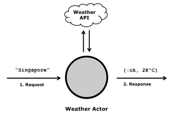
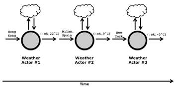
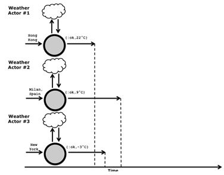
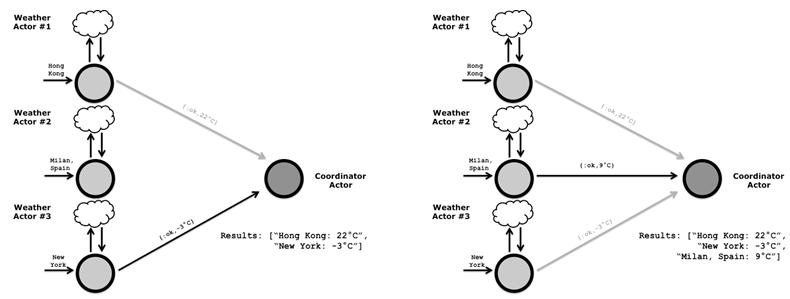
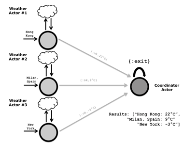

# 3   进程101

本章内容包括：

- Actor并发模型（Actor Concurrency Model）
- 创建进程
- 如何使用进程发送和接收消息
- 使用进程实现并发
- 如何使进程相互通信

理解进程的概念是非常重要的，它理所当然地拥有自己的一章。进程是Elixir中并发的基本单位。实际上，Erlang虚拟机（Erlang VM）支持高达1.34亿个进程，这使得所有的CPU都能愉快地运转。知道我充分利用了硬件资源，总是让我有一种温暖、愉悦的感觉。Erlang虚拟机创建的进程与操作系统无关。这些进程更轻量级，创建它们仅需要几微秒。

我们将开始一个有趣的项目。在本章中，我们将构建一个简单的程序，用于报告特定城市/州/国家的温度。但首先，让我们了解一下actor并发模型。

## 3.1            Actor并发模型

Erlang（因此也包括Elixir）使用Actor并发模型。这意味着：

1.  每个*actor*都是一个*进程*。
2.  每个进程执行一个*特定任务*。
3.  要让进程做某事，你需要*向它发送消息*。进程也可以通过*发送回另一个消息*来回复。
4.  进程可以处理的消息类型特定于进程本身。换句话说，消息是*模式匹配*的。
5.  除此之外，进程*不与其他进程共享任何信息*。

如果这一切现在看起来还有些模糊，不要担心。如果你做过面向对象编程，你会发现进程在很多方面类似于对象。甚至可以说它是更纯粹的面向对象形式。

这里有一个思考actors的方式。Actors就像人一样。我们通过相互交谈来交流。例如，我的妻子告诉我洗碗。当然，我会通过洗碗来回应——我是个好丈夫。但如果我的妻子告诉我吃蔬菜，她会被忽略——我不会对此作出回应。实际上，我选择只对某些类型的消息做出回应。最后，我不知道她脑海中在想什么，她也不知道我脑海中在想什么。正如你将很快看到的，actor并发模型就像这样——只对某些类型的消息做出回应。

## 3.2            构建天气应用

从概念上讲，我们的应用程序非常简单。第一个版本接受一个包含位置的单个参数，并报告摄氏温度。这涉及向外部天气服务发出HTTP请求，并解析JSON响应以提取温度。

  

图3.1 天气actor处理单个请求。

进行单个请求是微不足道的。但如果我们想要同时了解100个城市的温度怎么办？假设每个请求需要1秒钟，我们要等待100秒吗？显然不是！我们将看到如何进行并发请求，以便尽快获得结果。

并发的一个特性是，我们永远不知道响应以何种顺序返回。例如，想象一下，我按字母顺序传入一个城市列表。我收到的回应绝对不保证以相同的顺序排列。

我们如何确保响应的顺序是正确的呢？亲爱的读者，继续阅读下去，因为我们现在就开始在Elixir中的气象冒险。

### 3.2.1 简单版本

我们从一个简单版本开始。也就是说，不会涉及到并发。另一方面，简单版本将包含所有需要发出请求、解析响应和返回结果的逻辑。在这个迭代的结束时，你将学习如何：

- 使用mix安装和使用第三方库
- 向第三方API发出HTTP请求
- 使用模式匹配解析JSON响应
- 看看管道如何促进数据转换

这将是你要处理的第一个非琐碎的程序。但是不用担心，你将在每一步都得到指导。让我们开始吧！


#### 创建一个新项目

首要任务是创建一个新项目，更重要的是，给它起一个好名字。既然我是作者，我就来选择名字。在清单3.1中，我们使用
`mix new <project name>`
来创建一个新项目

清单3.1 创建一个新项目
```bash
% mix new metex
* creating README.md
* creating .gitignore
* creating mix.exs
* creating config
* creating config/config.exs
* creating lib
* creating lib/metex.ex
* creating test
* creating test/test_helper.exs
* creating test/metex_test.exs
Your mix project was created successfully.
You can use mix to compile it, test it, and more:

cd metex
mix test
% cd metex
```

按照指示，进入`metex`目录。

#### 安装依赖项

打开`mix.exs`。你会看到以下内容：

**清单3.2 默认生成的mix.exs文件。**

```elixir
defmodule Metex.Mixfile do
    use Mix.Project

    def project do
        [app: :metex,
        version: "0.0.1",
        elixir: "~> 1.0",
        deps: deps]
    end

    def application do
        [applications: [:logger]]
    end

    defp deps do
        []
    end
end
```
每个由`mix`生成的项目都会包含这个文件。它由两个公共函数组成，`project`和`application`。这个`project`函数基本上是设置我们的项目。更重要的是，它通过调用`deps`私有函数来设置我们项目的依赖项。就目前而言，`deps`是一个空列表 - 暂时的。这个`application`函数用于生成一个应用资源文件。Elixir中的某些依赖项需要以特定的方式启动。像这样的依赖项在此函数中声明。例如，在我们的应用程序启动之前，先启动`logger`应用程序。

让我们通过修改`deps`函数来添加两个依赖项，使其看起来像（清单3.3）：

**清单3.3 在mix.exs中声明依赖项**
```elixir
defp deps do
    [
    {:httpoison, "~> 0.9.0"},  #1
    {:json,      "~> 0.3.0"}   #1
    ]
end
```
#1 声明依赖项并指定相应的版本号

接下来，在`application`函数中添加一个条目：

```elixir
def application do
    [applications: [:logger, :httpoison]]
end
```

我怎么知道我应该包括`:httpoison`，而不是说，`:json`？事实上，我不知道。所以我总是做下一个最好的事情 - 阅读详细的手册。每次我安装一个库，我首先看一下README。在`:httpoison`的情况下，README清楚地说明了：

  
图3.2 查看第三方库的README以获取重要的安装指令总是很有帮助的。

#### 依赖项版本号很重要！

注意你的依赖项的版本号。使用错误的版本号可能会导致令人困惑的错误。另一件需要注意的事情是，这些库中的许多都会指定它们与之兼容的Elixir的最小版本。

确保你在Metex目录中，我们可以使用`mix deps.get`命令来安装我们的依赖项：

`% mix deps.get`
注意到`mix`也有助于解决依赖项。在这种情况下，它引入了另外两个库，hackney和idna（清单3.4）：

清单 3.4 mix 自动解决依赖关系

```shell
% mix deps.get
Running dependency resolution
* Getting httpoison (Hex package)
Checking package (http://s3.hex.pm.global.prod.fastly.net/tarballs/httpoison-0.9.0.tar)
Using locally cached package
* Getting json (Hex package)
Checking package (http://s3.hex.pm.global.prod.fastly.net/tarballs/json-0.3.2.tar)
Using locally cached package
* Getting hackney (Hex package)
Checking package (http://s3.hex.pm.global.prod.fastly.net/tarballs/hackney-1.5.7.tar)
Using locally cached package
* Getting ssl_verify_fun (Hex package)
Checking package (http://s3.hex.pm.global.prod.fastly.net/tarballs/ssl_verify_fun-1.1.0.tar)
Using locally cached package
* Getting mimerl (Hex package)
Checking package (http://s3.hex.pm.global.prod.fastly.net/tarballs/mimerl-1.0.2.tar)
Using locally cached package
* Getting metrics (Hex package)
Checking package (http://s3.hex.pm.global.prod.fastly.net/tarballs/metrics-1.0.1.tar)
Using locally cached package
* Getting idna (Hex package)
Checking package (http://s3.hex.pm.global.prod.fastly.net/tarballs/idna-1.2.0.tar)
Using locally cached package
* Getting certifi (Hex package)
Checking package (http://s3.hex.pm.global.prod.fastly.net/tarballs/certifi-0.4.0.tar)
Using locally cached package
```

3.3 Worker模块

在我们开始实现Worker模块之前，我们需要从第三方天气服务OpenWeatherMap获取一个API密钥。请访问`http://openweathermap.org/`创建一个账户。完成后，你会看到你的API密钥已经为你创建好了：

  

图 3.3 在OpenWeatherMap创建账户并获取API密钥。

现在我们可以深入了解Worker模块的实现细节。Worker模块的工作是从OpenWeatherMap获取给定位置的温度，并解析结果。在
`lib`
目录中创建
`worker.ex`
。以下是Worker模块的完整列表（清单3.5）：

清单3.5 worker.ex的完整源码。保存在lib/worker.ex中。

```elixir
defmodule Metex.Worker do

    def temperature_of(location) do
        result = url_for(location) |> HTTPoison.get |> parse_response
        case result do
            {:ok, temp} ->
            "#{location}: #{temp}°C"
            :error ->
            "#{location} not found"
        end
    end

    defp url_for(location) do
        location = URI.encode(location)
        "http://api.openweathermap.org/data/2.5/weather?q=#{location}&appid=#{apikey}"
    end

    defp parse_response({:ok, %HTTPoison.Response{body: body, status_code: 200}}) do
        body |> JSON.decode! |> compute_temperature
    end

    defp parse_response(_) do
        :error
    end

    defp compute_temperature(json) do
        try do
            temp = (json["main"]["temp"] - 273.15) |> Float.round(1)
            {:ok, temp}
        rescue
            _ -> :error
        end
    end

    defp apikey do
        "APIKEY-GOES-HERE"
    end
end
```
如果你不完全理解正在发生的事情，不要惊慌。我们将一点一点地浏览程序。现在，让我们看看如何从`iex`运行这个程序。从项目根目录启动`iex`，如下所示：

```shell
% iex –S mix
```

如果这是你第一次运行该命令，你会注意到一系列依赖项正在被编译。下次你运行`iex`时，除非你修改了依赖项，否则你不会看到这个。现在，让我们找出世界上一些最冷的地方的温度（清单3.6）：

清单3.6 工作人员的示例运行。（交互式Elixir）

```shell
iex(1)> Metex.Worker.temperature_of "Verkhoyansk, Russia"
"Verkhoyansk, Russia: -37.3°C"
```

只是为了好玩，让我们再试一个：
```shell
iex(2)> Metex.Worker.temperature_of "Snag, Yukon, Canada"
"Snag, Yukon, Canada: -27.6°C"
```

当我们给出一个无意义的位置时会发生什么？
```shell
iex(3)> Metex.Worker.temperature_of "Omicron Persei 8"
"Omicron Persei 8 not found"
```
现在我们已经看到了Worker模块的行动，让我们仔细看看并弄清楚它是如何工作的。我们从清单3.7中的`temperature_of/1`函数开始：

清单3.7 Metex.Worker的核心 - `temperature_of/1`函数

```elixir
defmodule Metex.Worker do

def temperature_of(location) do
    result = url_for(location) |> HTTPoison.get |>  parse_response #1
    case result do
        {:ok, temp} ->                          #2
        "#{location}: #{temp}°C"              #2
        :error ->                               #3
        "#{location} not found"               #3
    end
end

# ...end
```
- #1 数据转换：从URL到HTTP响应，再到解析该响应
- #2 成功解析的响应返回温度和位置
- #3 否则，返回一个错误消息

整个函数中最重要的一行是
```elixir
result = location |> url_for |> HTTPoison.get |> parse_response
```
如果不使用管道操作符，我们将不得不这样编写我们的函数：
```elixir
result = parse_response(HTTPoison.get(url_for(location)))
```

`location |> url_for`构造了用于调用天气API的URL。例如，新加坡的URL将是（用你自己的替换`<APIKEY>`）：
`http://api.openweathermap.org/data/2.5/weather?q=Singapore&appid=<APIKEY>`

一旦我们有了URL，我们就可以使用httpoison，一个HTTP客户端，来发出GET请求：
```elixir
location |> url_for |> HTTPoison.get
```
如果你在浏览器中尝试了那个URL，你会得到这样的东西（我已经为了简洁而修剪了JSON）：

```json
{
...
"main": {
"temp": 299.86,
"temp_min": 299.86,
"temp_max": 299.86,
"pressure": 1028.96,
"sea_level": 1029.64,
"grnd_level": 1028.96,
"humidity": 100
},
...}
```
让我们仔细看看HTTP客户端的响应。也可以在iex中试试这个。如果你退出了iex，记得使用
`iex -S mix`
这样依赖项（如httpoison）就能正确加载。

我们可以试试新加坡的温度URL（清单3.8）：

清单3.8 使用HTTPoison发出GET请求（交互式Elixir）

```shell
iex(1)> HTTPoison.get "http://api.openweathermap.org/data/2.5/weather?q=Singapore&appid=<APIKEY>"
```
看看结果：

```elixir
{:ok,
%HTTPoison.Response{body: "{\"coord\":{\"lon\":103.85,\"lat\":1.29},\"sys\":{\"message\":0.098,\"country\":\"SG\",\"sunrise\":1421795647,\"sunset\":1421839059},\"weather\":[{\"id\":802,\"main\":\"Clouds\",\"description\":\"scattered clouds\",\"icon\":\"03n\"}],\"base\":\"cmc stations\",\"main\":{\"temp\":299.86,\"temp_min\":299.86,\"temp_max\":299.86,\"pressure\":1028.96,\"sea_level\":1029.64,\"grnd_level\":1028.96,\"humidity\":100},\"wind\":{\"speed\":6.6,\"deg\":29.0007},\"clouds\":{\"all\":36},\"dt\":1421852665,\"id\":1880252,\"name\":\"Singapore\",\"cod\":200}\n",
headers: %{"Access-Control-Allow-Credentials" => "true",
"Access-Control-Allow-Methods" => "GET, POST",
"Access-Control-Allow-Origin" => "*",
"Connection" => "keep-alive",
"Content-Type" => "application/json; charset=utf-8",
"Date" => "Wed, 21 Jan 2015 15:59:14 GMT", "Server" => "nginx",
"Transfer-Encoding" => "chunked", "X-Source" => "redis"},status_code: 200}}
```
如果传入一个不存在的页面的URL会怎样？

```shell
iex(2)> HTTPoison.get "http://en.wikipedia.org/phpisawesome"
```
这将返回类似这样的东西：

```elixir
{:ok,
%HTTPoison.Response{body: "<html>Opps</html>",
headers: %{"Accept-Ranges" => "bytes", "Age" => "12",
"Cache-Control" => "s-maxage=2678400, max-age=2678400",
"Connection" => "keep-alive", "Content-Length" => "2830",
"Content-Type" => "text/html; charset=utf-8",
"Date" => "Wed, 21 Jan 2015 16:04:48 GMT",
"Refresh" => "5; url=http://en.wikipedia.org/wiki/phpisawesome",
"Server" => "Apache",
"Set-Cookie" => "GeoIP=SG:Singapore:1.2931:103.8558:v4; Path=/; Domain=.wikipedia.org",
"Via" => "1.1 varnish, 1.1 varnish, 1.1 varnish",
"X-Cache" => "cp1053 miss (0), cp4016 hit (1), cp4018 frontend miss (0)",
"X-Powered-By" => "HHVM/3.3.1",
"X-Varnish" => "2581642697, 646845726 646839971, 2421023671",
"X-Wikimedia-Debug" => "prot=http:// serv=en.wikipedia.org loc=/phpisawesome"},status_code: 404}}
```
最后，一个荒谬的URL会产生什么呢？

清单3.9 使用HTTPoison发出无效的GET请求（交互式Elixir）

```shell
iex(3)> HTTPoison.get "phpisawesome"
{:error, %HTTPoison.Error{id: nil, reason: :nxdomain}}
```
我们刚刚看到了HTTPoison.get(url)可以返回的至少三种变体。快乐路径返回一个类似于

`{:ok, %HTTPoison.Response{status_code: 200, body: content}}}`
的模式。上面的模式传达了以下信息：

- 这是一个两元素元组
- 元组的第一个元素是一个`:ok`原子，后面跟着一个表示响应的结构
- 响应是`HTTPoison.Response`类型的，包含至少两个字段
- `status_code`的值是200，表示一个成功的HTTP GET请求
- body的值在content中被*捕获*

如你所见，模式匹配非常简洁，是表达你想要的东西的一种美丽的方式。同样，错误元组有以下模式：

`{:error, %HTTPoison.Error{reason: reason}}`
让我们再做一次相同的分析：

- 这是一个两元素元组
- 元组的第一个元素是一个`:error`原子，后面跟着一个表示错误的结构
- 响应是`HTTPoison.Error`类型的，包含至少一个字段，即reason
- 错误的原因在`reason`中被捕获

牢记这些，让我们看一下`parse_response/1`函数（清单3.11）：

清单3.11 parse\_response/1函数中的模式匹配

```elixir
defp parse_response({:ok, %HTTPoison.Response{body: body, status_code: 200}}) do
    body |> JSON.decode! |> compute_temperature
end

defp parse_response(_) do
    :error
end
```
在这里，我们指定了`parse_response/1`的两个版本。第一个版本匹配成功的GET请求，因为我们正在匹配一个类型为`HTTPoison.Response`的响应，并确保`status_code`是200。否则，我们将任何其他类型的响应视为错误。现在让我们仔细看看`parse_response/1`的第一个版本。

```elixir
defp parse_response({:ok, %HTTPoison.Response{body: body, status_code: 200}}) do
# ...
end
```
在成功的模式匹配后，JSON的字符串表示被捕获在body变量中。为了将其转换为"真正"的JSON，我们需要解码它：

`body |> JSON.decode!`
然后我们将这个JSON传递给`compute_temperature/1`函数。这是函数的内容：

```elixir
defp compute_temperature(json) do
    try do
        temp = (json["main"]["temp"] - 273.15) |> Float.round(1)
        {:ok, temp}
    rescue
        _ -> :error
    end
end
```
我们在`try … rescue … end`块中包装计算。我们试图从给定的JSON中检索温度，然后进行一些算术运算。在这些点中的任何一个都可能发生错误。如果发生错误，我们希望返回结果是一个`:error`原子。否则，返回一个包含`:ok`作为第一个元素和温度的两元素元组。具有不同“形状”的返回值非常有用，因为例如调用此函数的代码可以轻松地在成功和失败的情况下进行模式匹配。在接下来的章节中，你将看到更多我们可以利用模式匹配的机会。

在这里，我们减去273.15，因为API以开尔文提供结果。我们还将温度四舍五入到小数点后一位。

如果HTTP GET响应与第一个模式不匹配，会发生什么呢？这就是第二个`parse_response/1`函数的工作：

清单3.11 这个版本的parse\_response/1匹配任何消息。

```elixir
defp parse_response(_) do
    :error
end
```
在这里，除了成功的响应之外，任何其他响应都被视为错误。基本上就是这样！你现在应该对工作人员的工作方式有了更好的理解。让我们学习一下在Elixir中如何创建进程。

3.4 创建进程以实现并发

假设我们有一份我们想要获取温度的城市列表：

清单3.12 创建城市列表（交互式Elixir）

```shell
iex> cities = ["Singapore", "Monaco", "Vatican City", "Hong Kong", "Macau"]
```
接下来，我们一次向工作人员发送每个请求：

清单3.13 一次请求查找城市的温度（交互式Elixir）

```elixir
iex(2)> cities |> Enum.map(fn city ->
Metex.Worker.temperature_of(city)end)
```
结果是：

`["Singapore: 27.5°C", "Monaco: 7.3°C", "Vatican City: 10.9°C", "Hong Kong: 18.1°C", "Macau: 19.5°C"]`
这种方法的问题是它是*浪费的*。随着列表大小的增长，等待所有响应完成所需的时间也会增长。只有在前一个请求完成后，下一个请求才会被处理。我们可以做得更好。

  

图3.2 没有并发，下一个请求将不得不等待前一个请求完成。这非常低效。

需要意识到的一个重要事情是，*每个请求并不依赖于其他请求*。换句话说，我们可以将每个对`Metex.Worker.temperature_of/1`的调用打包到一个进程中。让我们教工作人员如何响应消息。首先，将`loop/0`函数添加到`lib/worker.ex:`

清单3.14  将loop/0函数添加到工作人员中，以便它可以响应消息。

```elixir
defmodule Metex.Worker do

    def loop do
        receive do
            {sender_pid, location} ->
            send(sender_pid, {:ok, temperature_of(location)})
            _ ->
            IO.puts "don't know how to process this message"
        end
        loop
    end

    defp temperature_of(location) do
    # ...
    end

# ...end
```
在我们深入了解细节之前，让我们先玩玩这个。如果你已经打开了iex，你可以*重新加载*模块：

```shell
iex> r(Metex.Worker)
```
否则，你可以再次运行`iex -S mix`。首先，我们创建一个运行工作人员的循环函数的进程：

```shell
iex> pid = spawn(Metex.Worker, :loop, [])
```
内置的spawn函数创建一个进程。spawn有两个版本。第一个版本将一个函数作为参数，第二个版本将一个给定的模块和函数传递给定的参数。两个版本都返回一个*进程id*，或者说*pid*，作为结果。

3.4.1 接收消息

进程ID（pid）是对进程的*引用*，就像在面向对象编程中初始化一个对象会给你一个对该对象的*引用*一样。有了pid，我们就可以向进程发送*消息*。进程可以接收的消息类型在接收块中定义（清单3.15）：

清单3.15 进程可以接收的消息类型在接收块中定义。

```elixir
receive do
{sender_pid, location} ->
send(sender_pid, {:ok, temperature_of(location)})
_ ->
IO.puts "don't know how to process this message"
end
```
消息是从*上到下*进行模式匹配的。在这种情况下，如果传入的消息是一个两元素元组，那么将执行主体。任何其他消息都将在第二个模式中进行模式匹配。

如果我们将上述代码的函数子句交换顺序，会发生什么呢（清单3.16）：

清单3.16 模式匹配是从上到下进行的。交换接收到的消息的顺序很重要！

```elixir
receive do
_ ->                                  #1
IO.puts "don't know how to process this message"
{sender_pid, location} ->
send(sender_pid, {:ok, temperature_of(location)})
end
```
#1 这匹配任何消息！

如果你试图运行这个，Elixir会有帮助地警告你：

`lib/worker.ex:7: warning: this clause cannot match because a previous clause at line 5 always matches`
换句话说，`{sender_pid, location}`将*永远不会*被匹配，因为匹配所有操作符（“`_”`），顾名思义，将*贪婪地*匹配它所遇到的每一条消息。

一般来说，将匹配所有的情况作为最后一个要匹配的消息是一种好的做法。这是因为未匹配的消息会保留在邮箱中。因此，通过反复向一个不处理未匹配消息的进程发送消息，可能会使虚拟机耗尽内存。

### 3.4.2 发送消息

消息是使用内置的`send/2`函数发送的。第一个参数是你想要发送消息的进程的pid。第二个参数是实际的消息。

清单3.17 工作人员可以接收的消息的模式

```elixir
receive do
{sender_pid, location} ->               #1
send(sender_pid, {:ok, temperature_of(location)})
end
```
#1 进入的消息包含发送者pid和位置

在这里，我们将请求的结果发送给`sender_pid`。我们从哪里得到`sender_pid`呢？当然是从进入的消息中！如果你仔细看，我们期望进入的消息由发送者的pid和位置组成。将发送者的pid（或者说任何进程id）放入就像在信封背面放一个*返回地址*一样。它为收件人提供了一个回复的途径。

让我们发送一个消息给我们之前创建的进程（清单3.18）：

清单3.18 使用send/2向进程发送消息（交互式Elixir）

```shell
iex> send(pid, {self, "Singapore"})
```
结果是

`{#PID<0.125.0>, "Singapore"}`
等等，除了返回结果，什么都没有发生！让我们稍微分解一下。首先要注意的是，`send/2`的结果总是*消息*。第二件事是，`send/2`总是立即返回。换句话说，`send/2`就像是发射-忘记。所以这就解释了我们是如何得到结果的。但是*为什么*我们没有得到任何结果呢？

我们将什么作为发送者pid传入消息有效载荷？`self`！`self`到底是什么？`self`是调用进程的pid。在这种情况下，它是`iex`shell会话的pid。我们实际上是告诉工作人员将所有的回复发送到shell会话。要从shell会话中获取回复，我们可以使用内置的`flush/0`函数（清单3.19）：

清单3.19 使用flush/0检索发送到shell进程的消息（交互式Elixir）

```shell
iex> flush
"Singapore: 27.5°C"
:ok
```
`flush/0`清除了发送到shell的所有消息并打印它们出来。因此，下次你再做一次`flush`，你只会得到`:ok`原子。让我们看看这个在实践中是如何工作的。再次，我们有一个城市列表：

```shell
iex> cities = ["Singapore", "Monaco", "Vatican City", "Hong Kong", "Macau"]
```
然后，我们遍历每个城市。在每次迭代中，我们生成一个新的工作人员。使用新工作人员的pid，我们发送一个包含返回地址（`iex`shell会话）和城市的两元素元组作为消息（清单3.20）：

清单3.20 对于每个城市，生成一个进程来查找该城市的温度（交互式Elixir）

```elixir
iex> cities |> Enum.each(fn city ->
pid = spawn(Metex.Worker, :loop, [])
send(pid, {self, city})
end)
```
现在，让我们刷新消息：

```shell
iex> flush
{:ok, "Hong Kong: 17.8°C"}
{:ok, "Singapore: 27.5°C"}
{:ok, "Macau: 18.6°C"}
{:ok, "Monaco: 6.7°C"}
{:ok, "Vatican City: 11.8°C"}
:ok
```
太棒了！我们终于得到了我们的结果。注意结果*不是*按任何顺序排列的。这是因为哪个响应先完成就可以在完成后尽快将回复发送回发送者。如果你再次运行迭代，你可能会得到不同顺序的结果。

  

图3.4 当进程不必等待彼此时，发送消息的顺序不能保证。

再看一下
`loop`
函数。首先要注意的是，它是递归的 - 在处理完一条消息后，它会调用自己：

```elixir
def loop do
  receive do
    {sender_pid, location} ->
      send(sender_pid, {:ok, temperature_of(location)})
    _ ->
      send(sender_pid, "Unknown message")
  end
  loop # 1
end
```
#1 对loop的递归调用

你可能会想，为什么我们需要循环。一般来说，进程应该能够处理多于一条的消息。如果我们省略了递归调用，那么进程在处理完第一条（也是唯一的）消息后，就会退出，并被垃圾回收。我们通常希望我们的进程能够处理多于一个的进程！因此，我们需要对消息处理逻辑进行递归调用。

3.5      用另一个Actor收集和操作结果

将结果发送到shell会话对于查看工作人员发送的消息很有用，但仅此而已。如果我们想要操作结果，比如说，对它们进行排序，我们需要找到另一种方法。我们可以创建另一个actor来收集结果，而不是使用shell会话作为发送者。

这意味着这个actor必须跟踪*期望的*消息数量。换句话说，actor必须保持状态。我们该如何做呢？

首先，让我们设置actor。创建一个名为`lib/coordinator.ex`的文件，并按照清单3.21中的内容填充它：

清单3.21 coordinator.ex的完整源代码。将此保存在lib/coordinator.ex中。

```elixir
defmodule Metex.Coordinator do

def loop(results \\ [], results_expected) do
  receive do
    {:ok, result} ->
      new_results = [result|results]
      if results_expected == Enum.count(new_results) do
        send self, :exit
      end
      loop(new_results, results_expected)
    :exit ->
      IO.puts(results |> Enum.sort |> Enum.join(", "))
    _ ->
      loop(results, results_expected)
  end
end
end
```
让我们看看我们如何将协调器和工作人员一起使用。打开`lib/metex.ex`，并输入以下内容（清单3.22）：

清单3.22 在lib/metex.ex中创建一个协调器进程和工作人员进程的函数。

```elixir
defmodule Metex do

def temperatures_of(cities) do
  coordinator_pid =
    spawn(Metex.Coordinator, :loop, [[], Enum.count(cities)]) #1

  cities |> Enum.each(fn city ->                               #2
    worker_pid = spawn(Metex.Worker, :loop, [])                #3
    send worker_pid, {coordinator_pid, city}                   #4
  end)
end
end
```
#1 创建一个协调器进程
#2 遍历每个城市
#3 创建一个工作进程并执行其循环函数
#4 向工作人员发送一条包含协调器进程pid和城市的消息

然后，我们可以通过首先创建一个城市列表来找出城市的温度

`iex> cities = ["Singapore", "Monaco", "Vatican City", "Hong Kong", "Macau"]`
然后调用Metex.temperatures\_of/1：

`iex> Metex.temperatures_of(cities)`
结果如预期：

`Hong Kong: 17.8°C, Macau: 18.4°C, Monaco: 8.8°C, Singapore: 28.6°C, Vatican City: 8.5°C`
这就是`Metex.temperatures\_of/1`的工作原理。首先，我们创建一个协调器进程。协调器进程的循环函数期望两个参数，当前收集的结果和它期望的结果总数。因此，当我们首次创建协调器时，我们用一个初始为空的结果列表和城市数量初始化它：

`iex> coordinator_pid = spawn(Metex.Coordinator, :loop, [[], Enum.count(cities)])`
现在我们有了等待来自工作人员消息的协调器进程。给定一个城市列表，我们遍历每个城市，创建一个工作人员，然后向工作人员发送一条包含协调器pid和城市的消息。

清单3.23 为每个城市生成工作进程，并将协调器进程设置为工作人员消息的接收者。（交互式Elixir）

```elixir
iex> cities |> Enum.each(fn city ->
  worker_pid = spawn(Metex.Worker, :loop, [])
  send worker_pid, {coordinator_pid, city}
end)
```
一旦所有五个工作人员完成了请求，协调器将尽职尽责地报告结果：

`Hong Kong: 16.6°C, Macau: 18.3°C, Monaco: 8.1°C, Singapore: 26.7°C, Vatican City: 9.9°C`
成功！注意结果是按字典顺序排序的。现在是时候深入研究协调器进程，找出它是如何工作的了。

协调器可以从工作人员那里接收哪些消息？检查`receive do ... end`块，我们可以得出至少有两种我们特别感兴趣的消息：

`·`
`{:ok, result}`

`·`
`:exit`

其他类型的消息将被忽略。让我们更详细地检查每种消息。

### 3.5.1                      {:ok, result} - 顺利进行的消息 - {:ok, result}

这是我们期望从工作人员那里收到的"顺利进行的"消息，如果没有出错的话（清单3.24）：

清单3.24 顺利进行的消息

```elixir
def loop(results \\ [], results_expected) do
  receive do
    {:ok, result} ->
      new_results = [result|results]                 #1
      if results_expected == Enum.count(new_results) do #2
        send self, :exit                             #3
      end
      loop(new_results, results_expected)            #4

    # ... 其他模式省略 ...

  end
end
```
#1 将结果添加到当前结果列表中

#2 检查是否已收集到所有结果

#3 向协调器发送退出消息

#4 使用新的结果循环。注意，results\_expected保持不变

当协调器收到符合`{:ok, result}`模式的消息时，它首先将结果添加到当前的结果列表中。

  

图3.5 当第一个结果进入时，actor将结果保存在列表中。

接下来，我们检查协调器是否已经收到了预期的正确结果数量。假设没有。在这种情况下，循环函数再次调用自己。注意到循环的递归调用的参数。这次我们传入`new\_results`，而`results\_expected`保持不变。

  

图3.6 当协调器收到下一条消息时，它再次将其存储在结果列表中。

这就是actor中保持状态的方式。参数的*副本*被修改，然后传递到循环函数中，在下一次对自身的函数调用中，它将可用。

### 3.5.2                      :exit - 中断信号消息

当协调器收到所有的消息时，它必须找到一种方法来告诉自己停止，并在必要时报告结果。一种简单的方法是通过一个"中断信号"消息（清单3.25）。

  

图3.7 当协调器收到:exit消息时，它按字母顺序返回结果，然后退出。

注意，`:exit`消息本身并不特殊。你可以称之为`:kill`、`:self\_destruct`或`:kaboom`。

当协调器收到`:exit`消息时，它会打印出用逗号分隔的字典顺序的结果。由于我们希望协调器退出，我们不需要调用`loop`函数（清单3.25）。

清单3.25 中断信号消息

```elixir
def loop(results \\ [], results_expected) do
  receive do
    # ... 其他模式省略 ...

    :exit ->
      IO.puts(results |> Enum.sort |> Enum.join(", ")) #1

    # ... 其他模式省略 ...
  end
end
```
#1 按字典顺序打印结果，用逗号分隔

### 3.5.3                      其他消息

最后，我们必须处理协调器可能接收到的任何其他类型的消息。我们使用`\_`操作符捕获这些不需要的消息。最后，我们需要记住再次循环，尽管我们保持参数不变（清单3.26）：

清单3.26 匹配所有其他消息

```elixir
def loop(results \\ [], results_expected) do
  receive do
    # ... 其他模式省略 ...
    _ ->                                     #1
      loop(results, results_expected)        #2
  end
end
```
#1 匹配所有其他类型的消息

#2 再次循环，保持参数不变

### 3.5.4                      宏观视角

恭喜你 - 你刚刚用Elixir编写了你的第一个并发程序！你使用了多个进程来并发地执行计算。在执行计算时，没有一个进程需要等待其他进程，除了协调器进程。

需要强调的一个重要点是，这里没有共享内存。进程内状态的改变只能通过发送消息来实现。这与线程不同，因为线程是共享内存的。这意味着多个线程可以修改同一块内存，这是并发错误（和头痛）的无尽之源。

在设计你自己的并发程序时，决定进程应该接收和发送的消息类型，以及进程之间的交互是很重要的。在我们的示例程序中，我决定使用`{:ok, result}`和`:exit`作为协调器进程的消息，使用`{sender_pid, location}`作为工作进程的消息。我发现，画出各个进程之间的交互以及正在发送和接收的消息是非常有帮助的。抵制直接跳入编码的诱惑，花几分钟时间进行草图绘制。这样做将节省你数小时的挠头和咒骂的时间！

## 3.6 练习

进程是Elixir的基础。只有通过运行和实验代码，你才能更好地理解。

1.   阅读`send`和`receive`的文档。对于`send`，找出你可以发送消息的有效目标。对于`receive`，研究文档提供的示例。

2.  阅读`Process`的文档。

3.  编写一个程序，生成两个进程。第一个进程，在收到`ping`消息时，回复一个`pong`消息。第二个进程，在收到`pong`消息时，向发送者回复一个`ping`消息。

## 3.7 总结

在本章中，我们介绍了进程这个至关重要的主题。你被介绍到了Actor并发模型。通过示例应用，我们学习了如何：

·      创建进程

·      使用进程发送和接收消息

·      可以使用多个进程实现并发

·      工作进程的消息可以由另一个协调器进程收集和操作

你刚刚尝试了Elixir的并发编程！在做练习的时候玩得开心，一定要给你的大脑稍微休息一下。我们下一章见，我们将学习Elixir的*秘密酱料* - OTP！


[****[1]****](#uawOqHhyhtkQ2B699h55Lj4) http://www.erlang.org/doc/man/erl.html#max\_processes
[****[2]****](#uaLcTH2WZVUhi5sgnh6hkO7) http://citeseerx.ist.psu.edu/viewdoc/download?doi=10.1.1.116.1969&rep=rep1&type=pdf


